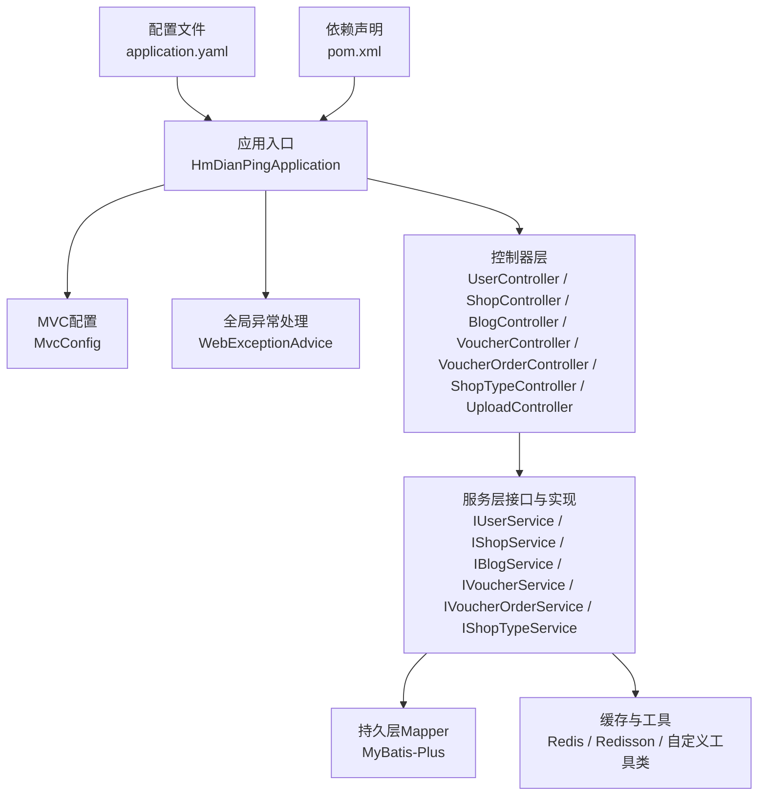
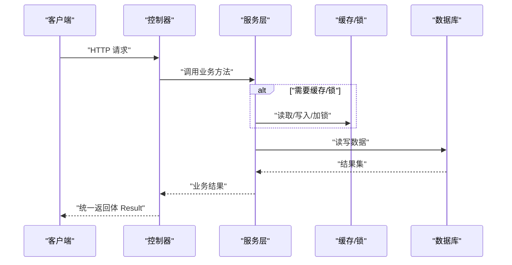
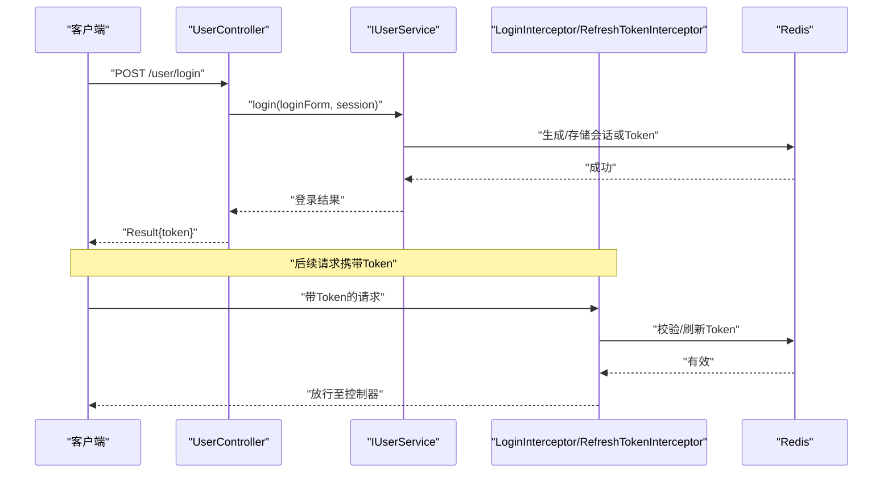
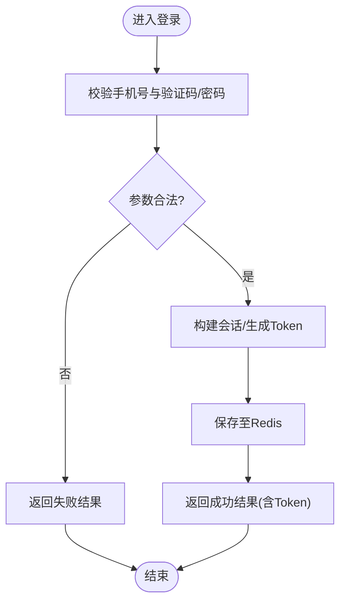
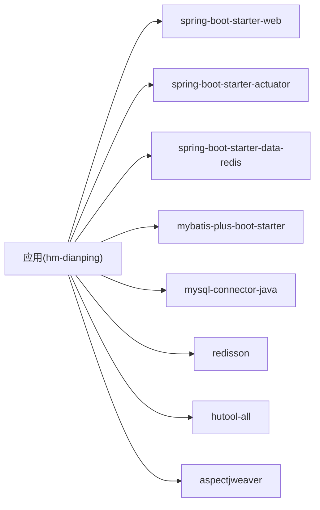

# API接口文档

<cite>
**本文引用的文件**
- [HmDianPingApplication.java](file://src/main/java/com/hmdp/HmDianPingApplication.java)
- [application.yaml](file://src/main/resources/application.yaml)
- [pom.xml](file://pom.xml)
- [MvcConfig.java](file://src/main/java/com/hmdp/config/MvcConfig.java)
- [WebExceptionAdvice.java](file://src/main/java/com/hmdp/config/WebExceptionAdvice.java)
- [Result.java](file://src/main/java/com/hmdp/dto/Result.java)
- [UserController.java](file://src/main/java/com/hmdp/controller/UserController.java)
- [ShopController.java](file://src/main/java/com/hmdp/controller/ShopController.java)
- [BlogController.java](file://src/main/java/com/hmdp/controller/BlogController.java)
- [VoucherController.java](file://src/main/java/com/hmdp/controller/VoucherController.java)
- [VoucherOrderController.java](file://src/main/java/com/hmdp/controller/VoucherOrderController.java)
- [ShopTypeController.java](file://src/main/java/com/hmdp/controller/ShopTypeController.java)
- [UploadController.java](file://src/main/java/com/hmdp/controller/UploadController.java)
</cite>

## 目录
1. [简介](#简介)
2. [项目结构](#项目结构)
3. [核心组件](#核心组件)
4. [架构总览](#架构总览)
5. [详细接口规范](#详细接口规范)
6. [依赖分析](#依赖分析)
7. [性能考虑](#性能考虑)
8. [故障排查指南](#故障排查指南)
9. [结论](#结论)
10. [附录](#附录)

## 简介
本文件为 my-hbdp（hm-dianping）项目的 RESTful API 接口文档，覆盖用户认证、商户管理、博客内容、优惠券与订单、上传等能力。文档包含：
- HTTP 方法与 URL 模式
- 请求/响应数据模型
- 认证与鉴权方式
- 错误处理策略
- 安全与速率限制建议
- 版本信息
- 常见用例与客户端实现指南
- 调试工具与监控方法

## 项目结构
后端基于 Spring Boot 2.3.12，使用 MyBatis-Plus 访问 MySQL，Redis 用于缓存与会话相关能力，统一异常通过全局控制器通知处理，统一返回体 Result 封装。

图表来源
- [HmDianPingApplication.java:1-18](file://src/main/java/com/hmdp/HmDianPingApplication.java#L1-L18)
- [MvcConfig.java:1-34](file://src/main/java/com/hmdp/config/MvcConfig.java#L1-L34)
- [WebExceptionAdvice.java:1-18](file://src/main/java/com/hmdp/config/WebExceptionAdvice.java#L1-L18)
- [UserController.java:1-86](file://src/main/java/com/hmdp/controller/UserController.java#L1-L86)
- [ShopController.java:1-101](file://src/main/java/com/hmdp/controller/ShopController.java#L1-L101)
- [BlogController.java:1-84](file://src/main/java/com/hmdp/controller/BlogController.java#L1-L84)
- [VoucherController.java:1-58](file://src/main/java/com/hmdp/controller/VoucherController.java#L1-L58)
- [VoucherOrderController.java:1-34](file://src/main/java/com/hmdp/controller/VoucherOrderController.java#L1-L34)
- [ShopTypeController.java:1-37](file://src/main/java/com/hmdp/controller/ShopTypeController.java#L1-L37)
- [UploadController.java:1-64](file://src/main/java/com/hmdp/controller/UploadController.java#L1-L64)
- [application.yaml:1-28](file://src/main/resources/application.yaml#L1-L28)
- [pom.xml:1-96](file://pom.xml#L1-L96)

章节来源
- [HmDianPingApplication.java:1-18](file://src/main/java/com/hmdp/HmDianPingApplication.java#L1-L18)
- [application.yaml:1-28](file://src/main/resources/application.yaml#L1-L28)
- [pom.xml:1-96](file://pom.xml#L1-L96)

## 核心组件
- 统一返回体 Result：包含 success、errorMsg、data、total 字段，提供 ok()/fail() 静态工厂方法。
- 全局异常处理 WebExceptionAdvice：捕获 RuntimeException 并返回统一失败结果。
- MVC拦截器 MvcConfig：注册登录校验与刷新令牌拦截器，并对部分公开路径放行。
- 应用配置 application.yaml：端口、数据库、Redis、Jackson、日志级别等。
- 启动类 HmDianPingApplication：启用扫描与AOP代理。

章节来源
- [Result.java:1-31](file://src/main/java/com/hmdp/dto/Result.java#L1-L31)
- [WebExceptionAdvice.java:1-18](file://src/main/java/com/hmdp/config/WebExceptionAdvice.java#L1-L18)
- [MvcConfig.java:1-34](file://src/main/java/com/hmdp/config/MvcConfig.java#L1-L34)
- [application.yaml:1-28](file://src/main/resources/application.yaml#L1-L28)
- [HmDianPingApplication.java:1-18](file://src/main/java/com/hmdp/HmDianPingApplication.java#L1-L18)

## 架构总览
整体采用分层架构：Controller -> Service -> Mapper，结合 Redis 做缓存与分布式锁，统一异常与返回体贯穿全链路。

图表来源
- [UserController.java:1-86](file://src/main/java/com/hmdp/controller/UserController.java#L1-L86)
- [ShopController.java:1-101](file://src/main/java/com/hmdp/controller/ShopController.java#L1-L101)
- [BlogController.java:1-84](file://src/main/java/com/hmdp/controller/BlogController.java#L1-L84)
- [VoucherController.java:1-58](file://src/main/java/com/hmdp/controller/VoucherController.java#L1-L58)
- [VoucherOrderController.java:1-34](file://src/main/java/com/hmdp/controller/VoucherOrderController.java#L1-L34)
- [ShopTypeController.java:1-37](file://src/main/java/com/hmdp/controller/ShopTypeController.java#L1-L37)
- [UploadController.java:1-64](file://src/main/java/com/hmdp/controller/UploadController.java#L1-L64)

## 详细接口规范

### 通用约定
- 基础地址：http://127.0.0.1:8081
- 统一返回体 Result 字段：
  - success: Boolean
  - errorMsg: String
  - data: Object
  - total: Long
- 认证方式：
  - 登录成功后服务端下发 Token（由拦截器链维护），后续请求需在请求头携带该 Token。
  - 未登录或 Token 无效将触发鉴权拦截逻辑。
- 分页参数：
  - current：页码，默认 1
  - 每页大小由系统常量控制（如 MAX_PAGE_SIZE、DEFAULT_PAGE_SIZE）
- 公共放行路径（无需登录）：
  - /shop/**、/voucher/**、/shop-type/**、/upload/**、/blog/hot、/user/code、/user/login

章节来源
- [application.yaml:1-28](file://src/main/resources/application.yaml#L1-L28)
- [MvcConfig.java:1-34](file://src/main/java/com/hmdp/config/MvcConfig.java#L1-L34)
- [Result.java:1-31](file://src/main/java/com/hmdp/dto/Result.java#L1-L31)

---

### 用户认证接口
- 发送手机验证码
  - 方法：POST
  - 路径：/user/code
  - 请求参数：phone（查询参数）
  - 响应：Result
- 登录
  - 方法：POST
  - 路径：/user/login
  - 请求体：LoginFormDTO（手机号+验证码 或 手机号+密码）
  - 响应：Result（成功时返回 Token 或用户标识，具体以服务端实现为准）
- 获取当前登录用户
  - 方法：GET
  - 路径：/user/me
  - 认证：需登录
  - 响应：Result<UserDTO>
- 获取用户详情
  - 方法：GET
  - 路径：/user/info/{id}
  - 路径参数：id（Long）
  - 响应：Result<UserInfo>（若不存在则返回空对象）
- 登出
  - 方法：POST
  - 路径：/user/logout
  - 认证：需登录
  - 响应：Result（当前实现提示“功能未完成”）

章节来源
- [UserController.java:1-86](file://src/main/java/com/hmdp/controller/UserController.java#L1-L86)

---

### 商户管理接口
- 根据ID查询商铺
  - 方法：GET
  - 路径：/shop/{id}
  - 路径参数：id（Long）
  - 响应：Result<Shop>
- 新增商铺
  - 方法：POST
  - 路径：/shop
  - 请求体：Shop
  - 响应：Result<Long>（返回店铺ID）
- 更新商铺
  - 方法：PUT
  - 路径：/shop
  - 请求体：Shop
  - 响应：Result
- 按类型分页查询商铺
  - 方法：GET
  - 路径：/shop/of/type
  - 查询参数：typeId（Integer）、current（Integer，默认1）
  - 响应：Result<List<Shop>>
- 按名称关键字分页查询商铺
  - 方法：GET
  - 路径：/shop/of/name
  - 查询参数：name（String，可选）、current（Integer，默认1）
  - 响应：Result<List<Shop>>

章节来源
- [ShopController.java:1-101](file://src/main/java/com/hmdp/controller/ShopController.java#L1-L101)

---

### 博客内容接口
- 发布博文
  - 方法：POST
  - 路径：/blog
  - 认证：需登录
  - 请求体：Blog（服务端自动填充 userId）
  - 响应：Result<Long>（返回博文ID）
- 点赞博文
  - 方法：PUT
  - 路径：/blog/like/{id}
  - 认证：需登录
  - 路径参数：id（Long）
  - 响应：Result
- 我的博文列表
  - 方法：GET
  - 路径：/blog/of/me
  - 认证：需登录
  - 查询参数：current（Integer，默认1）
  - 响应：Result<List<Blog>>
- 热门博文
  - 方法：GET
  - 路径：/blog/hot
  - 查询参数：current（Integer，默认1）
  - 响应：Result<List<Blog>>（每条附带作者昵称与头像）

章节来源
- [BlogController.java:1-84](file://src/main/java/com/hmdp/controller/BlogController.java#L1-L84)

---

### 优惠券接口
- 新增普通券
  - 方法：POST
  - 路径：/voucher
  - 请求体：Voucher
  - 响应：Result<Long>（返回券ID）
- 新增秒杀券
  - 方法：POST
  - 路径：/voucher/seckill
  - 请求体：Voucher（含秒杀信息）
  - 响应：Result<Long>（返回券ID）
- 查询店铺优惠券列表
  - 方法：GET
  - 路径：/voucher/list/{shopId}
  - 路径参数：shopId（Long）
  - 响应：Result<List<Voucher>>

章节来源
- [VoucherController.java:1-58](file://src/main/java/com/hmdp/controller/VoucherController.java#L1-L58)

---

### 优惠券订单接口
- 抢购秒杀券
  - 方法：POST
  - 路径：/voucher-order/seckill/{id}
  - 认证：需登录
  - 路径参数：id（Long，券ID）
  - 响应：Result

章节来源
- [VoucherOrderController.java:1-34](file://src/main/java/com/hmdp/controller/VoucherOrderController.java#L1-L34)

---

### 社交功能接口
- 关注/取关等接口
  - 当前控制器已定义但尚未暴露具体方法，后续可扩展。

章节来源
- [FollowController.java:1-21](file://src/main/java/com/hmdp/controller/FollowController.java#L1-L21)

---

### 评论接口
- 博文评论相关接口
  - 当前控制器已定义但尚未暴露具体方法，后续可扩展。

章节来源
- [BlogCommentsController.java:1-21](file://src/main/java/com/hmdp/controller/BlogCommentsController.java#L1-L21)

---

### 商户类型接口
- 查询商户类型列表
  - 方法：GET
  - 路径：/shop-type/list
  - 响应：Result<List<ShopType>>

章节来源
- [ShopTypeController.java:1-37](file://src/main/java/com/hmdp/controller/ShopTypeController.java#L1-L37)

---

### 文件上传接口
- 上传博文图片
  - 方法：POST
  - 路径：/upload/blog
  - 请求体：multipart/form-data，字段名 file
  - 响应：Result<String>（返回文件名）
- 删除博文图片
  - 方法：GET
  - 路径：/upload/blog/delete
  - 查询参数：name（String，文件名）
  - 响应：Result

章节来源
- [UploadController.java:1-64](file://src/main/java/com/hmdp/controller/UploadController.java#L1-L64)

---

### 认证流程时序图

图表来源
- [UserController.java:1-86](file://src/main/java/com/hmdp/controller/UserController.java#L1-L86)
- [MvcConfig.java:1-34](file://src/main/java/com/hmdp/config/MvcConfig.java#L1-L34)

---

### 登录流程图

图表来源
- [UserController.java:1-86](file://src/main/java/com/hmdp/controller/UserController.java#L1-L86)

## 依赖分析
- 框架与中间件
  - Spring Boot 2.3.12
  - MyBatis-Plus 3.4.3
  - Redis（Lettuce连接池）
  - Redisson 3.13.6
  - Actuator（健康检查与指标）
- 关键外部依赖
  - MySQL Connector/J 5.1.47
  - Hutool 5.7.17
  - AspectJ Weaver

图表来源
- [pom.xml:1-96](file://pom.xml#L1-L96)

章节来源
- [pom.xml:1-96](file://pom.xml#L1-L96)

## 性能考虑
- 分页查询
  - 使用 Page 分页，避免一次性加载大量数据；注意合理设置每页大小。
- 热点数据缓存
  - 对高频读接口（如热门博文、商铺详情）可引入 Redis 缓存，注意缓存穿透、击穿、雪崩防护。
- 并发与一致性
  - 秒杀场景建议使用 Redisson 分布式锁与 Lua 脚本保证原子性。
- 连接池优化
  - 调整 Lettuce 连接池参数（最大活跃、空闲、回收周期）以适应负载。
- 序列化
  - Jackson 忽略非空字段可减少响应体积。

[本节为通用指导，不直接分析具体文件]

## 故障排查指南
- 全局异常
  - 所有未捕获的 RuntimeException 将被统一处理并返回失败结果，便于前端一致化处理。
- 日志
  - 应用日志级别设置为 debug，便于定位问题；生产环境建议调整为 info/warn。
- 健康检查
  - 可通过 Actuator 暴露的健康端点查看运行状态。
- 常见问题
  - 登录失败：检查验证码是否过期、手机号格式是否正确。
  - 权限不足：确认请求头是否携带有效 Token。
  - 文件上传失败：检查磁盘空间与目录权限。

章节来源
- [WebExceptionAdvice.java:1-18](file://src/main/java/com/hmdp/config/WebExceptionAdvice.java#L1-L18)
- [application.yaml:1-28](file://src/main/resources/application.yaml#L1-L28)

## 结论
本项目提供了完整的用户认证、商户管理、博客、优惠券与订单、上传等核心接口，采用统一的返回体与异常处理，具备良好的扩展性与可维护性。建议在后续迭代中完善社交与评论接口，补充限流、审计与更完善的监控告警。

[本节为总结性内容，不直接分析具体文件]

## 附录

### 版本信息
- 应用名称：hmdp
- 版本：0.0.1-SNAPSHOT
- 运行端口：8081

章节来源
- [application.yaml:1-28](file://src/main/resources/application.yaml#L1-L28)
- [pom.xml:1-96](file://pom.xml#L1-L96)

### 安全与速率限制建议
- 认证与鉴权
  - 对所有写操作与敏感读操作强制鉴权；对 Token 进行有效期与刷新机制设计。
- 输入校验
  - 对手机号、密码、文件类型与大小进行严格校验。
- 速率限制
  - 针对验证码、登录、秒杀等接口实施 IP/用户维度限流，防止滥用。
- 数据安全
  - 敏感数据传输使用 HTTPS；密码加密存储；日志脱敏。

[本节为通用指导，不直接分析具体文件]

### 客户端实现指南
- 登录
  - 调用 POST /user/login，保存返回的 Token。
  - 后续请求在请求头携带 Token（例如 Authorization: Bearer <token>）。
- 分页
  - 使用 current 指定页码；服务端会限制每页上限。
- 文件上传
  - 使用 multipart/form-data，字段名为 file。
- 错误处理
  - 解析统一返回体 Result，根据 success 字段判断成功与否，errorMsg 展示给用户。

[本节为通用指导，不直接分析具体文件]

### 调试与监控
- 本地调试
  - 使用 Postman/Apifox 构造请求，观察统一返回体。
- 日志定位
  - 开启 debug 日志，关注异常堆栈与关键业务日志。
- 健康检查
  - 访问 Actuator 健康端点验证服务可用性。

[本节为通用指导，不直接分析具体文件]