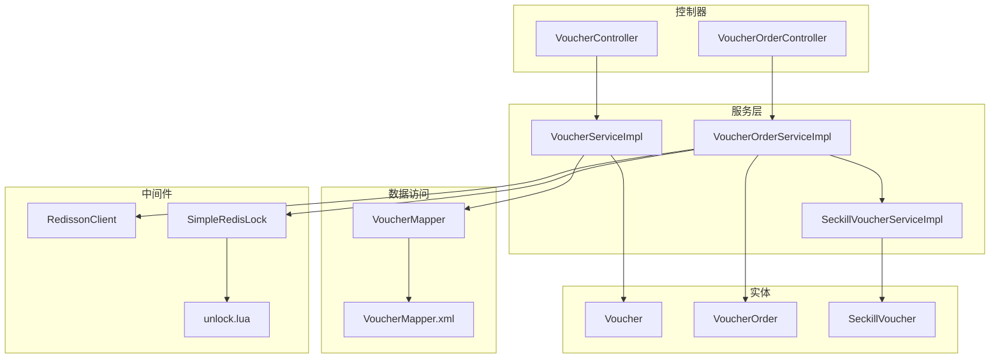
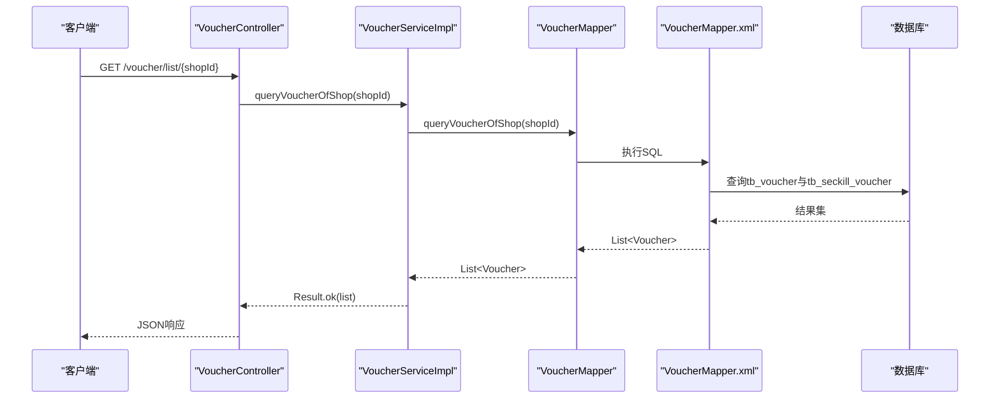
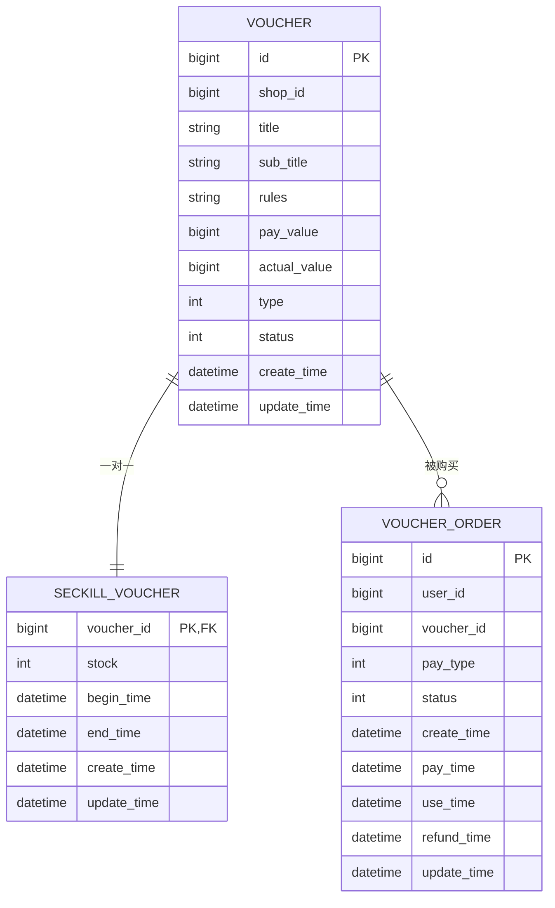
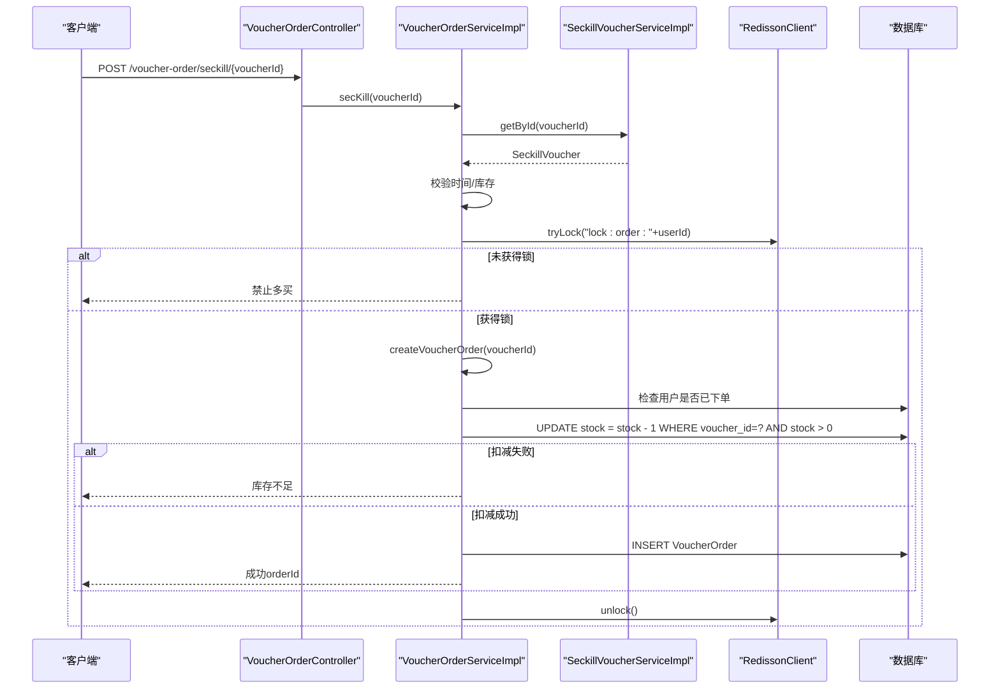
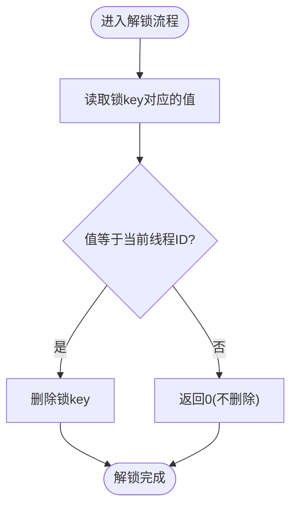
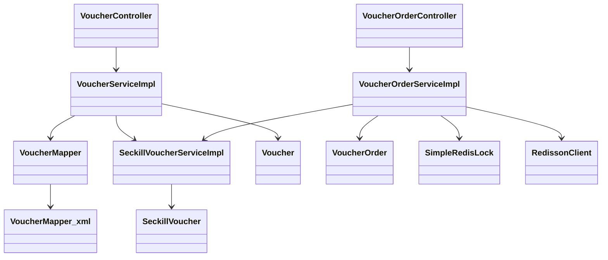

# 优惠券系统接口

<cite>
**本文引用的文件**   
- [VoucherController.java](file://src/main/java/com/hmdp/controller/VoucherController.java)
- [VoucherOrderController.java](file://src/main/java/com/hmdp/controller/VoucherOrderController.java)
- [VoucherServiceImpl.java](file://src/main/java/com/hmdp/service/impl/VoucherServiceImpl.java)
- [VoucherOrderServiceImpl.java](file://src/main/java/com/hmdp/service/impl/VoucherOrderServiceImpl.java)
- [SeckillVoucherServiceImpl.java](file://src/main/java/com/hmdp/service/impl/SeckillVoucherServiceImpl.java)
- [VoucherMapper.java](file://src/main/java/com/hmdp/mapper/VoucherMapper.java)
- [VoucherMapper.xml](file://src/main/resources/mapper/VoucherMapper.xml)
- [Voucher.java](file://src/main/java/com/hmdp/entity/Voucher.java)
- [VoucherOrder.java](file://src/main/java/com/hmdp/entity/VoucherOrder.java)
- [SeckillVoucher.java](file://src/main/java/com/hmdp/entity/SeckillVoucher.java)
- [SimpleRedisLock.java](file://src/main/java/com/hmdp/utils/SimpleRedisLock.java)
- [unlock.lua](file://src/main/resources/unlock.lua)
- [RedissonConfig.java](file://src/main/java/com/hmdp/config/RedissonConfig.java)
</cite>

## 目录
1. [简介](#简介)
2. [项目结构](#项目结构)
3. [核心组件](#核心组件)
4. [架构总览](#架构总览)
5. [详细组件分析](#详细组件分析)
6. [依赖关系分析](#依赖关系分析)
7. [性能与高并发方案](#性能与高并发方案)
8. [故障排查指南](#故障排查指南)
9. [结论](#结论)
10. [附录：API 规范](#附录api-规范)

## 简介
本文件为优惠券系统的全面 API 接口文档，覆盖普通券管理、秒杀券管理、优惠券领取（下单）、订单查询等能力。重点说明秒杀场景的高并发处理方案，包括分布式锁实现原理、库存预减机制、Lua 脚本在原子操作中的应用，以及实体关系、事务策略与防超卖机制。文末提供完整业务流程示例与性能调优建议。

## 项目结构
本项目采用分层架构：
- Controller 层：对外暴露 HTTP 接口
- Service 层：业务逻辑与事务控制
- Mapper/XML：数据访问与 SQL 映射
- Entity：领域模型
- Utils/Config：通用工具与中间件配置（如 Redis、Redisson）

图表来源
- [VoucherController.java:1-58](file://src/main/java/com/hmdp/controller/VoucherController.java#L1-L58)
- [VoucherOrderController.java:1-34](file://src/main/java/com/hmdp/controller/VoucherOrderController.java#L1-L34)
- [VoucherServiceImpl.java:1-52](file://src/main/java/com/hmdp/service/impl/VoucherServiceImpl.java#L1-L52)
- [VoucherOrderServiceImpl.java:1-105](file://src/main/java/com/hmdp/service/impl/VoucherOrderServiceImpl.java#L1-L105)
- [SeckillVoucherServiceImpl.java:1-22](file://src/main/java/com/hmdp/service/impl/SeckillVoucherServiceImpl.java#L1-L22)
- [VoucherMapper.java:1-21](file://src/main/java/com/hmdp/mapper/VoucherMapper.java#L1-L21)
- [VoucherMapper.xml:1-14](file://src/main/resources/mapper/VoucherMapper.xml#L1-L14)
- [Voucher.java:1-106](file://src/main/java/com/hmdp/entity/Voucher.java#L1-L106)
- [VoucherOrder.java:1-82](file://src/main/java/com/hmdp/entity/VoucherOrder.java#L1-L82)
- [SeckillVoucher.java:1-62](file://src/main/java/com/hmdp/entity/SeckillVoucher.java#L1-L62)
- [SimpleRedisLock.java:1-56](file://src/main/java/com/hmdp/utils/SimpleRedisLock.java#L1-L56)
- [unlock.lua:1-5](file://src/main/resources/unlock.lua#L1-L5)

章节来源
- [VoucherController.java:1-58](file://src/main/java/com/hmdp/controller/VoucherController.java#L1-L58)
- [VoucherOrderController.java:1-34](file://src/main/java/com/hmdp/controller/VoucherOrderController.java#L1-L34)

## 核心组件
- 普通券管理
  - 新增普通券：POST /voucher
  - 查询店铺优惠券列表：GET /voucher/list/{shopId}
- 秒杀券管理
  - 新增秒杀券：POST /voucher/seckill
- 优惠券领取（下单）
  - 秒杀下单：POST /voucher-order/seckill/{id}

关键职责划分：
- Controller 负责参数接收与结果封装
- Service 负责业务编排、事务与并发控制
- Mapper/XML 负责 SQL 执行
- Utils/Config 提供分布式锁与 ID 生成等基础设施

章节来源
- [VoucherController.java:26-56](file://src/main/java/com/hmdp/controller/VoucherController.java#L26-L56)
- [VoucherOrderController.java:27-33](file://src/main/java/com/hmdp/controller/VoucherOrderController.java#L27-L33)
- [VoucherServiceImpl.java:30-50](file://src/main/java/com/hmdp/service/impl/VoucherServiceImpl.java#L30-L50)
- [VoucherOrderServiceImpl.java:46-103](file://src/main/java/com/hmdp/service/impl/VoucherOrderServiceImpl.java#L46-L103)

## 架构总览
下图展示从请求到落库的调用链，以及秒杀下单的关键并发控制点。

图表来源
- [VoucherController.java:53-56](file://src/main/java/com/hmdp/controller/VoucherController.java#L53-L56)
- [VoucherServiceImpl.java:31-36](file://src/main/java/com/hmdp/service/impl/VoucherServiceImpl.java#L31-L36)
- [VoucherMapper.java:19](file://src/main/java/com/hmdp/mapper/VoucherMapper.java#L19)
- [VoucherMapper.xml:5-12](file://src/main/resources/mapper/VoucherMapper.xml#L5-L12)

## 详细组件分析

### 实体关系与数据模型
- Voucher：普通券主表，包含标题、规则、价格、类型、状态、创建/更新时间等字段；stock、beginTime、endTime 为非持久化字段，用于返回给前端展示。
- SeckillVoucher：秒杀券扩展表，与 Voucher 一对一，包含 stock、beginTime、endTime 等。
- VoucherOrder：订单表，记录用户、券、支付信息、状态及时间戳。

图表来源
- [Voucher.java:22-106](file://src/main/java/com/hmdp/entity/Voucher.java#L22-L106)
- [SeckillVoucher.java:21-62](file://src/main/java/com/hmdp/entity/SeckillVoucher.java#L21-L62)
- [VoucherOrder.java:21-82](file://src/main/java/com/hmdp/entity/VoucherOrder.java#L21-L82)

章节来源
- [Voucher.java:22-106](file://src/main/java/com/hmdp/entity/Voucher.java#L22-L106)
- [SeckillVoucher.java:21-62](file://src/main/java/com/hmdp/entity/SeckillVoucher.java#L21-L62)
- [VoucherOrder.java:21-82](file://src/main/java/com/hmdp/entity/VoucherOrder.java#L21-L82)

### 普通券管理接口
- 新增普通券
  - 方法：POST /voucher
  - 入参：Voucher 对象（不含秒杀相关字段）
  - 行为：直接保存至 tb_voucher
  - 返回：Result.ok(voucher.id)
- 查询店铺优惠券列表
  - 方法：GET /voucher/list/{shopId}
  - 行为：通过 MyBatis 关联查询 tb_voucher 与 tb_seckill_voucher，返回包含 stock、beginTime、endTime 的 DTO 视图
  - 返回：Result.ok(List<Voucher>)

章节来源
- [VoucherController.java:31-35](file://src/main/java/com/hmdp/controller/VoucherController.java#L31-L35)
- [VoucherController.java:53-56](file://src/main/java/com/hmdp/controller/VoucherController.java#L53-L56)
- [VoucherServiceImpl.java:31-36](file://src/main/java/com/hmdp/service/impl/VoucherServiceImpl.java#L31-L36)
- [VoucherMapper.java:19](file://src/main/java/com/hmdp/mapper/VoucherMapper.java#L19)
- [VoucherMapper.xml:5-12](file://src/main/resources/mapper/VoucherMapper.xml#L5-L12)

### 秒杀券管理接口
- 新增秒杀券
  - 方法：POST /voucher/seckill
  - 入参：Voucher 对象（需包含 stock、beginTime、endTime）
  - 行为：开启事务，先保存 Voucher，再保存 SeckillVoucher（voucher_id=新券id，stock=传入stock，时间区间一致）
  - 返回：Result.ok(voucher.id)

章节来源
- [VoucherController.java:42-46](file://src/main/java/com/hmdp/controller/VoucherController.java#L42-L46)
- [VoucherServiceImpl.java:39-50](file://src/main/java/com/hmdp/service/impl/VoucherServiceImpl.java#L39-L50)

### 优惠券领取（秒杀下单）接口
- 秒杀下单
  - 方法：POST /voucher-order/seckill/{id}
  - 入参：路径参数 id（即 voucherId）
  - 行为：
    - 校验活动是否开始/结束
    - 校验库存是否大于 0
    - 获取当前用户 userId
    - 基于 Redisson 对“用户维度”加锁，防止同一用户重复下单
    - 通过 AOP 代理调用 createVoucherOrder，确保 @Transactional 生效
    - 在事务内：
      - 检查用户是否已对该券下单（幂等）
      - 使用 SQL 原子扣减库存：set stock = stock - 1 where voucher_id=? and stock > 0
      - 生成全局唯一订单号（RedisIdWorker）
      - 写入订单表
  - 返回：成功返回 orderId，失败返回错误码与消息

图表来源
- [VoucherOrderController.java:29-32](file://src/main/java/com/hmdp/controller/VoucherOrderController.java#L29-L32)
- [VoucherOrderServiceImpl.java:47-75](file://src/main/java/com/hmdp/service/impl/VoucherOrderServiceImpl.java#L47-L75)
- [VoucherOrderServiceImpl.java:77-103](file://src/main/java/com/hmdp/service/impl/VoucherOrderServiceImpl.java#L77-L103)
- [SeckillVoucherServiceImpl.java:18](file://src/main/java/com/hmdp/service/impl/SeckillVoucherServiceImpl.java#L18)
- [RedissonConfig.java:12-16](file://src/main/java/com/hmdp/config/RedissonConfig.java#L12-L16)

章节来源
- [VoucherOrderController.java:29-32](file://src/main/java/com/hmdp/controller/VoucherOrderController.java#L29-L32)
- [VoucherOrderServiceImpl.java:47-103](file://src/main/java/com/hmdp/service/impl/VoucherOrderServiceImpl.java#L47-L103)

### 分布式锁与 Lua 原子解锁
- 锁实现
  - SimpleRedisLock：基于 StringRedisTemplate 的 setIfAbsent + 过期时间实现互斥；unlock 使用 Lua 脚本保证“仅释放自己持有的锁”。
  - Redisson：可重入、看门狗自动续期，项目中秒杀下单使用 Redisson 的 RLock 进行用户级互斥。
- Lua 脚本
  - unlock.lua：比较 key 的值与传入的 threadId，相等则删除 key，否则返回 0，避免误删他人锁。

图表来源
- [SimpleRedisLock.java:39-44](file://src/main/java/com/hmdp/utils/SimpleRedisLock.java#L39-L44)
- [unlock.lua:1-5](file://src/main/resources/unlock.lua#L1-L5)

章节来源
- [SimpleRedisLock.java:11-56](file://src/main/java/com/hmdp/utils/SimpleRedisLock.java#L11-L56)
- [unlock.lua:1-5](file://src/main/resources/unlock.lua#L1-L5)
- [RedissonConfig.java:12-16](file://src/main/java/com/hmdp/config/RedissonConfig.java#L12-L16)

## 依赖关系分析
- Controller 依赖 Service
- Service 依赖 Mapper 与外部中间件（Redis、Redisson）
- 秒杀下单强依赖分布式锁与数据库原子更新
- 查询接口依赖 MyBatis XML 的 JOIN 查询

图表来源
- [VoucherController.java:23-25](file://src/main/java/com/hmdp/controller/VoucherController.java#L23-L25)
- [VoucherOrderController.java:27-31](file://src/main/java/com/hmdp/controller/VoucherOrderController.java#L27-L31)
- [VoucherServiceImpl.java:27-28](file://src/main/java/com/hmdp/service/impl/VoucherServiceImpl.java#L27-L28)
- [VoucherOrderServiceImpl.java:34-44](file://src/main/java/com/hmdp/service/impl/VoucherOrderServiceImpl.java#L34-L44)
- [VoucherMapper.java:17-20](file://src/main/java/com/hmdp/mapper/VoucherMapper.java#L17-L20)
- [VoucherMapper.xml:5-12](file://src/main/resources/mapper/VoucherMapper.xml#L5-L12)
- [Voucher.java:22-106](file://src/main/java/com/hmdp/entity/Voucher.java#L22-L106)
- [VoucherOrder.java:21-82](file://src/main/java/com/hmdp/entity/VoucherOrder.java#L21-L82)
- [SeckillVoucher.java:21-62](file://src/main/java/com/hmdp/entity/SeckillVoucher.java#L21-L62)
- [SimpleRedisLock.java:11-56](file://src/main/java/com/hmdp/utils/SimpleRedisLock.java#L11-L56)
- [RedissonConfig.java:12-16](file://src/main/java/com/hmdp/config/RedissonConfig.java#L12-L16)

章节来源
- [VoucherServiceImpl.java:27-28](file://src/main/java/com/hmdp/service/impl/VoucherServiceImpl.java#L27-L28)
- [VoucherOrderServiceImpl.java:34-44](file://src/main/java/com/hmdp/service/impl/VoucherOrderServiceImpl.java#L34-L44)

## 性能与高并发方案
- 高并发要点
  - 用户级互斥：以“lock:order:{userId}”为锁粒度，避免同一用户重复下单，同时允许不同用户并发下单。
  - 数据库原子扣减：使用 set stock = stock - 1 where stock > 0 保证最终一致性，避免超卖。
  - 幂等保障：下单前按“user_id + voucher_id”计数判断，防止重复提交。
  - 事务边界：createVoucherOrder 使用 @Transactional，确保“扣库存 + 写订单”原子性。
  - 分布式锁选择：Redisson 支持看门狗自动续期与可重入，适合长耗时业务；SimpleRedisLock 配合 Lua 解锁适用于简单场景。
- 库存预减机制
  - 当前实现将库存预减放在数据库层（UPDATE ... SET stock = stock - 1），属于“数据库侧预减”，具备强一致性与防超卖特性。
  - 若需进一步削峰，可在 Redis 中维护热点券库存并做快速预扣，再通过异步队列落库，但需引入补偿与对账机制。
- Lua 脚本应用
  - unlock.lua 保证“仅释放持有者锁”，避免跨线程误删导致的并发问题。
- 索引与 SQL 优化建议
  - 建议在 tb_seckill_voucher.voucher_id 上建立索引，加速按券查询与扣减。
  - 查询列表接口已使用 JOIN，注意统计与分页时的索引命中情况。
- 超时与重试
  - 合理设置锁过期时间与业务超时，避免死锁；对网络抖动进行有限次重试。
- 监控与告警
  - 关注库存归零速率、锁竞争率、事务回滚率、慢查询日志。

[本节为通用性能指导，不直接分析具体文件]

## 故障排查指南
- 常见问题
  - 重复下单：检查用户级锁是否生效，确认锁键名与线程标识正确；核对幂等判断逻辑。
  - 超卖：确认数据库扣减条件 stock > 0 是否命中；检查是否存在并发绕过锁的情况。
  - 锁无法释放：检查 Lua 脚本返回值与线程ID匹配；确认 Redisson 锁是否被其他线程持有。
  - 事务未生效：确认通过 AOP 代理调用 createVoucherOrder，避免自调用导致事务失效。
- 定位手段
  - 查看 Redis 锁键与过期时间
  - 观察 MySQL 慢查询与锁等待
  - 打印关键分支日志（时间校验、库存校验、锁获取、扣减结果）

章节来源
- [VoucherOrderServiceImpl.java:62-74](file://src/main/java/com/hmdp/service/impl/VoucherOrderServiceImpl.java#L62-L74)
- [VoucherOrderServiceImpl.java:77-103](file://src/main/java/com/hmdp/service/impl/VoucherOrderServiceImpl.java#L77-L103)
- [SimpleRedisLock.java:39-44](file://src/main/java/com/hmdp/utils/SimpleRedisLock.java#L39-L44)
- [unlock.lua:1-5](file://src/main/resources/unlock.lua#L1-L5)

## 结论
本系统通过“用户级分布式锁 + 数据库原子扣减 + 幂等校验 + 事务包裹”的组合，实现了秒杀券下单的防超卖与一致性保障。结合 Lua 脚本的原子解锁与 Redisson 的可靠性，整体在高并发场景下具备较好的稳定性与可扩展性。后续可考虑引入缓存预扣与异步落库进一步提升吞吐，但需配套完善的补偿与对账机制。

[本节为总结性内容，不直接分析具体文件]

## 附录：API 规范

- 新增普通券
  - 路径：POST /voucher
  - 请求体：Voucher 对象（不含秒杀字段）
  - 响应：Result.ok(voucher.id)
  - 参考实现
    - [VoucherController.java:31-35](file://src/main/java/com/hmdp/controller/VoucherController.java#L31-L35)

- 新增秒杀券
  - 路径：POST /voucher/seckill
  - 请求体：Voucher 对象（需包含 stock、beginTime、endTime）
  - 响应：Result.ok(voucher.id)
  - 参考实现
    - [VoucherController.java:42-46](file://src/main/java/com/hmdp/controller/VoucherController.java#L42-L46)
    - [VoucherServiceImpl.java:39-50](file://src/main/java/com/hmdp/service/impl/VoucherServiceImpl.java#L39-L50)

- 查询店铺优惠券列表
  - 路径：GET /voucher/list/{shopId}
  - 路径参数：shopId
  - 响应：Result.ok(List<Voucher>)，包含 stock、beginTime、endTime
  - 参考实现
    - [VoucherController.java:53-56](file://src/main/java/com/hmdp/controller/VoucherController.java#L53-L56)
    - [VoucherServiceImpl.java:31-36](file://src/main/java/com/hmdp/service/impl/VoucherServiceImpl.java#L31-L36)
    - [VoucherMapper.java:19](file://src/main/java/com/hmdp/mapper/VoucherMapper.java#L19)
    - [VoucherMapper.xml:5-12](file://src/main/resources/mapper/VoucherMapper.xml#L5-L12)

- 秒杀下单
  - 路径：POST /voucher-order/seckill/{id}
  - 路径参数：id（即 voucherId）
  - 响应：成功返回 orderId，失败返回错误信息
  - 参考实现
    - [VoucherOrderController.java:29-32](file://src/main/java/com/hmdp/controller/VoucherOrderController.java#L29-L32)
    - [VoucherOrderServiceImpl.java:47-103](file://src/main/java/com/hmdp/service/impl/VoucherOrderServiceImpl.java#L47-L103)