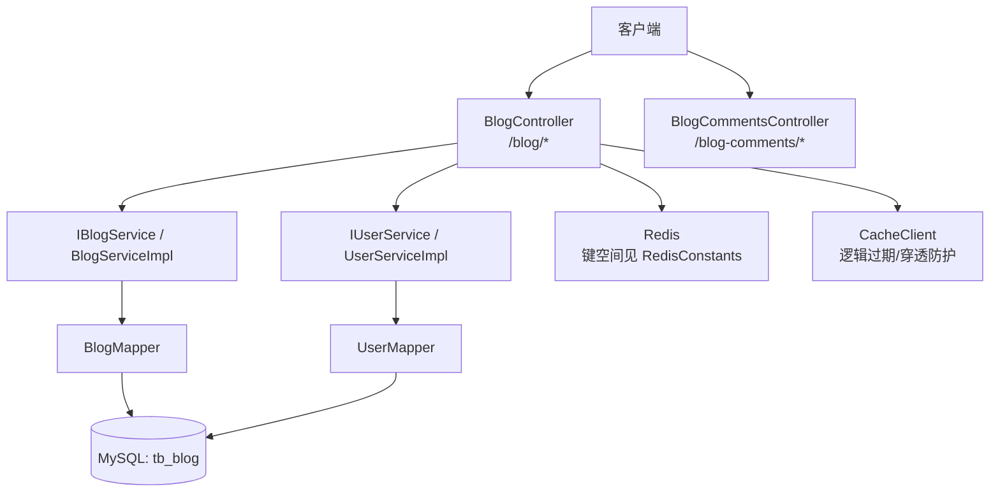
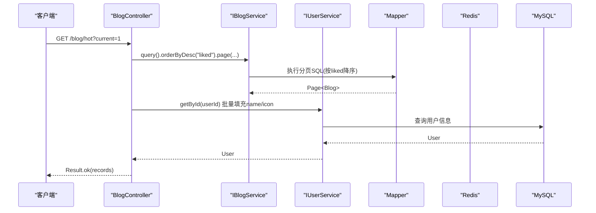
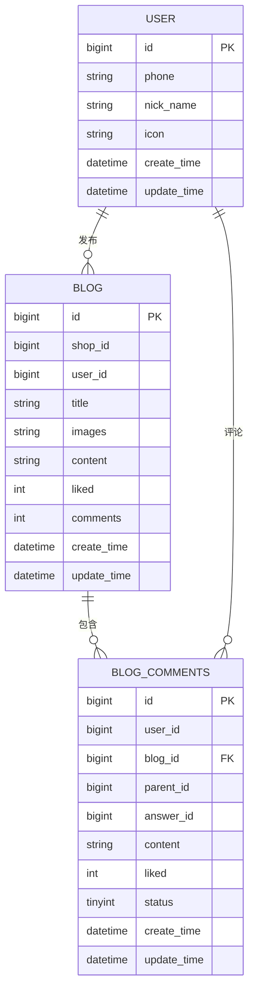
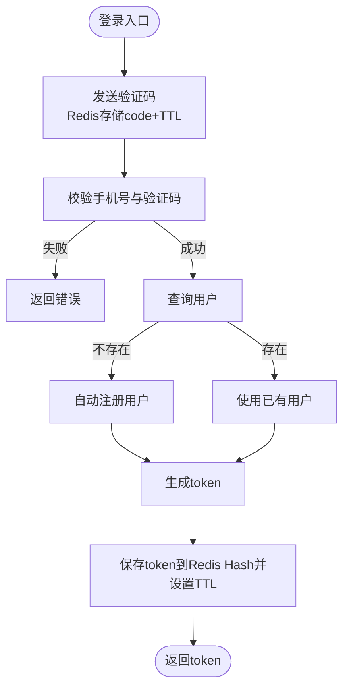
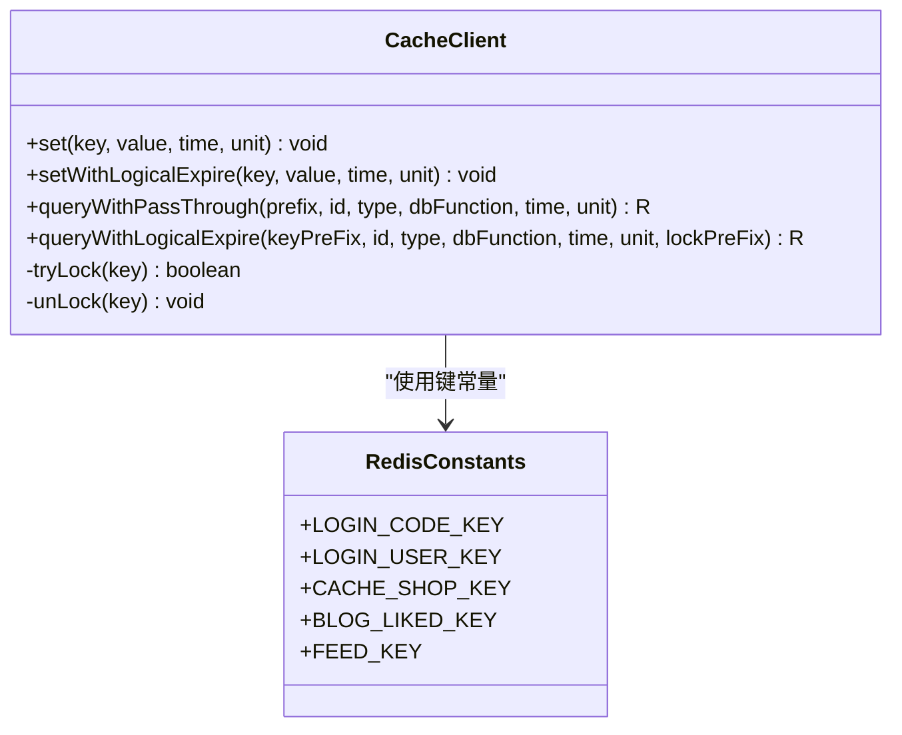
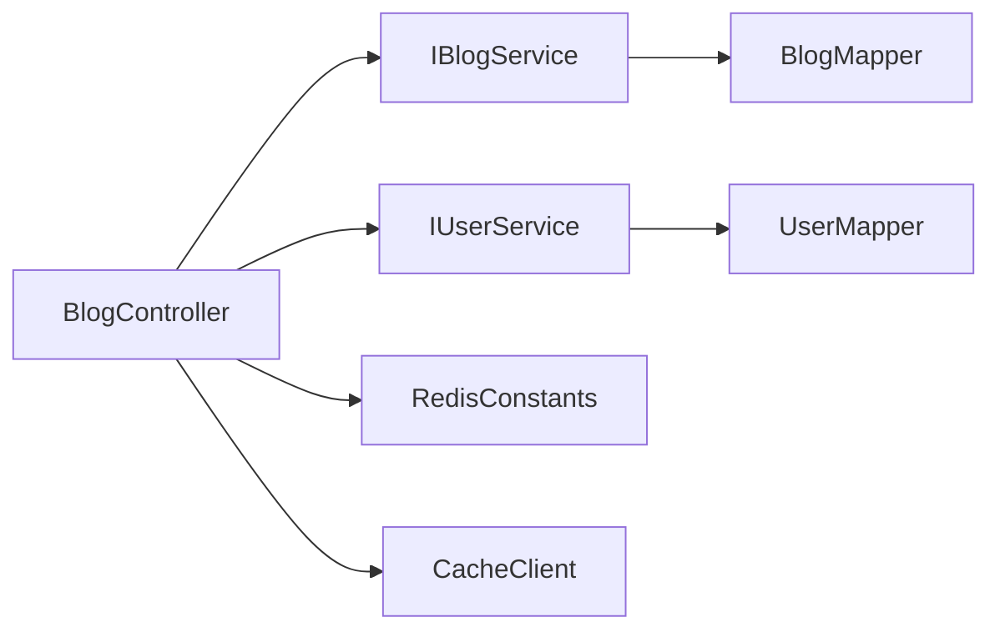

# 博客内容接口

<cite>
**本文引用的文件**   
- [BlogController.java](file://src/main/java/com/hmdp/controller/BlogController.java)
- [BlogCommentsController.java](file://src/main/java/com/hmdp/controller/BlogCommentsController.java)
- [Blog.java](file://src/main/java/com/hmdp/entity/Blog.java)
- [BlogComments.java](file://src/main/java/com/hmdp/entity/BlogComments.java)
- [IBlogService.java](file://src/main/java/com/hmdp/service/IBlogService.java)
- [BlogServiceImpl.java](file://src/main/java/com/hmdp/service/impl/BlogServiceImpl.java)
- [IBlogCommentsService.java](file://src/main/java/com/hmdp/service/IBlogCommentsService.java)
- [BlogCommentsServiceImpl.java](file://src/main/java/com/hmdp/service/impl/BlogCommentsServiceImpl.java)
- [IUserService.java](file://src/main/java/com/hmdp/service/IUserService.java)
- [UserServiceImpl.java](file://src/main/java/com/hmdp/service/impl/UserServiceImpl.java)
- [User.java](file://src/main/java/com/hmdp/entity/User.java)
- [Result.java](file://src/main/java/com/hmdp/dto/Result.java)
- [UserDTO.java](file://src/main/java/com/hmdp/dto/UserDTO.java)
- [RedisConstants.java](file://src/main/java/com/hmdp/utils/RedisConstants.java)
- [CacheClient.java](file://src/main/java/com/hmdp/utils/CacheClient.java)
- [hmdp.sql](file://src/main/resources/db/hmdp.sql)
</cite>

## 目录
1. [简介](#简介)
2. [项目结构](#项目结构)
3. [核心组件](#核心组件)
4. [架构总览](#架构总览)
5. [详细组件分析](#详细组件分析)
6. [依赖关系分析](#依赖关系分析)
7. [性能与高并发方案](#性能与高并发方案)
8. [故障排查指南](#故障排查指南)
9. [结论](#结论)
10. [附录：接口规范与示例](#附录接口规范与示例)

## 简介
本文件为“博客内容模块”的API接口文档，覆盖博文发布、点赞、热门博文展示、个人博文列表、评论管理等能力。文档同时说明 Blog 与 BlogComments 实体关系、Redis 缓存使用策略、分页与排序规则、权限验证实现细节，并提供完整的CRUD操作示例、缓存一致性保证与性能优化建议。

## 项目结构
该模块采用典型的分层架构：
- Controller 层：对外暴露REST接口，负责参数校验、上下文获取（登录用户）、调用服务层并返回统一结果。
- Service 层：业务逻辑封装，当前以MyBatis-Plus的IService为主，便于快速扩展。
- Entity 层：数据模型映射数据库表。
- Utils 层：通用工具，包括Redis常量、缓存客户端等。
- DTO 层：统一响应体与用户信息传输对象。

图表来源
- [BlogController.java:1-84](file://src/main/java/com/hmdp/controller/BlogController.java#L1-L84)
- [BlogCommentsController.java:1-21](file://src/main/java/com/hmdp/controller/BlogCommentsController.java#L1-L21)
- [IBlogService.java:1-17](file://src/main/java/com/hmdp/service/IBlogService.java#L1-L17)
- [BlogServiceImpl.java:1-21](file://src/main/java/com/hmdp/service/impl/BlogServiceImpl.java#L1-L21)
- [IUserService.java:1-25](file://src/main/java/com/hmdp/service/IUserService.java#L1-L25)
- [UserServiceImpl.java:1-110](file://src/main/java/com/hmdp/service/impl/UserServiceImpl.java#L1-L110)
- [RedisConstants.java:1-25](file://src/main/java/com/hmdp/utils/RedisConstants.java#L1-L25)
- [CacheClient.java:1-140](file://src/main/java/com/hmdp/utils/CacheClient.java#L1-L140)
- [hmdp.sql:24-62](file://src/main/resources/db/hmdp.sql#L24-L62)

章节来源
- [BlogController.java:1-84](file://src/main/java/com/hmdp/controller/BlogController.java#L1-L84)
- [BlogCommentsController.java:1-21](file://src/main/java/com/hmdp/controller/BlogCommentsController.java#L1-L21)
- [IBlogService.java:1-17](file://src/main/java/com/hmdp/service/IBlogService.java#L1-L17)
- [BlogServiceImpl.java:1-21](file://src/main/java/com/hmdp/service/impl/BlogServiceImpl.java#L1-L21)
- [IUserService.java:1-25](file://src/main/java/com/hmdp/service/IUserService.java#L1-L25)
- [UserServiceImpl.java:1-110](file://src/main/java/com/hmdp/service/impl/UserServiceImpl.java#L1-L110)
- [RedisConstants.java:1-25](file://src/main/java/com/hmdp/utils/RedisConstants.java#L1-L25)
- [CacheClient.java:1-140](file://src/main/java/com/hmdp/utils/CacheClient.java#L1-L140)
- [hmdp.sql:24-62](file://src/main/resources/db/hmdp.sql#L24-L62)

## 核心组件
- 控制器
  - BlogController：提供发布、点赞、个人博文列表、热门博文接口。
  - BlogCommentsController：预留评论管理接口路径，当前未实现具体方法。
- 服务层
  - IBlogService/BlogServiceImpl：基于MyBatis-Plus的通用CRUD能力。
  - IBlogCommentsService/BlogCommentsServiceImpl：同上，用于评论数据访问。
  - IUserService/UserServiceImpl：用户登录、验证码、用户信息查询等。
- 实体
  - Blog：对应tb_blog，包含标题、图片、内容、点赞数、评论数、时间戳等字段；额外包含非持久化字段icon/name/isLike用于前端展示。
  - BlogComments：对应tb_blog_comments，支持一级评论与回复关系（parentId/answerId）。
- 工具与常量
  - RedisConstants：定义Redis键前缀与TTL常量，如 blog:liked:、feed: 等。
  - CacheClient：提供带逻辑过期的缓存读写、空值缓存、分布式锁辅助方法。
- 统一响应
  - Result：统一返回结构，包含成功标志、错误信息、数据与总数。

章节来源
- [BlogController.java:1-84](file://src/main/java/com/hmdp/controller/BlogController.java#L1-L84)
- [BlogCommentsController.java:1-21](file://src/main/java/com/hmdp/controller/BlogCommentsController.java#L1-L21)
- [IBlogService.java:1-17](file://src/main/java/com/hmdp/service/IBlogService.java#L1-L17)
- [BlogServiceImpl.java:1-21](file://src/main/java/com/hmdp/service/impl/BlogServiceImpl.java#L1-L21)
- [IBlogCommentsService.java:1-17](file://src/main/java/com/hmdp/service/IBlogCommentsService.java#L1-L17)
- [BlogCommentsServiceImpl.java:1-21](file://src/main/java/com/hmdp/service/impl/BlogCommentsServiceImpl.java#L1-L21)
- [IUserService.java:1-25](file://src/main/java/com/hmdp/service/IUserService.java#L1-L25)
- [UserServiceImpl.java:1-110](file://src/main/java/com/hmdp/service/impl/UserServiceImpl.java#L1-L110)
- [Blog.java:1-96](file://src/main/java/com/hmdp/entity/Blog.java#L1-L96)
- [BlogComments.java:1-82](file://src/main/java/com/hmdp/entity/BlogComments.java#L1-L82)
- [RedisConstants.java:1-25](file://src/main/java/com/hmdp/utils/RedisConstants.java#L1-L25)
- [CacheClient.java:1-140](file://src/main/java/com/hmdp/utils/CacheClient.java#L1-L140)
- [Result.java:1-31](file://src/main/java/com/hmdp/dto/Result.java#L1-L31)

## 架构总览
整体流程遵循“请求进入 -> 鉴权 -> 业务处理 -> 缓存/DB -> 统一响应”。其中：
- 鉴权通过拦截器从Redis中读取用户信息（由登录流程生成），并以UserHolder注入到请求上下文。
- 热门博文按点赞数降序分页查询，并在返回前填充作者昵称与头像。
- 点赞接口直接原子自增数据库字段，避免应用层计数不一致。
- 评论管理接口已预留路径，后续可在此扩展。

图表来源
- [BlogController.java:66-82](file://src/main/java/com/hmdp/controller/BlogController.java#L66-L82)
- [BlogServiceImpl.java:1-21](file://src/main/java/com/hmdp/service/impl/BlogServiceImpl.java#L1-L21)
- [IUserService.java:1-25](file://src/main/java/com/hmdp/service/IUserService.java#L1-L25)
- [UserServiceImpl.java:1-110](file://src/main/java/com/hmdp/service/impl/UserServiceImpl.java#L1-L110)
- [hmdp.sql:24-36](file://src/main/resources/db/hmdp.sql#L24-L36)

## 详细组件分析

### 实体关系与数据模型
- Blog 与 BlogComments 的关系
  - 一对多：一个Blog可拥有多条BlogComments（通过blog_id关联）。
  - 评论层级：BlogComments支持一级评论与二级回复，通过parentId与answerId表达。
- 字段要点
  - Blog：id、shopId、userId、title、images、content、liked、comments、createTime、updateTime；非持久化字段icon/name/isLink用于展示。
  - BlogComments：id、userId、blogId、parentId、answerId、content、liked、status、createTime、updateTime。

图表来源
- [Blog.java:1-96](file://src/main/java/com/hmdp/entity/Blog.java#L1-L96)
- [BlogComments.java:1-82](file://src/main/java/com/hmdp/entity/BlogComments.java#L1-L82)
- [User.java:1-67](file://src/main/java/com/hmdp/entity/User.java#L1-L67)
- [hmdp.sql:24-62](file://src/main/resources/db/hmdp.sql#L24-L62)

章节来源
- [Blog.java:1-96](file://src/main/java/com/hmdp/entity/Blog.java#L1-L96)
- [BlogComments.java:1-82](file://src/main/java/com/hmdp/entity/BlogComments.java#L1-L82)
- [User.java:1-67](file://src/main/java/com/hmdp/entity/User.java#L1-L67)
- [hmdp.sql:24-62](file://src/main/resources/db/hmdp.sql#L24-L62)

### 认证与权限
- 登录流程
  - 发送验证码：将验证码存入Redis，设置过期时间。
  - 登录校验：校验手机号与验证码，若用户不存在则自动注册，成功后生成token并写入Redis Hash，设置过期时间。
- 上下文持有
  - 登录成功后，token作为会话标识，后续请求通过拦截器从Redis加载用户信息至UserHolder，供Controller使用。
- 权限控制
  - 需要登录的接口（如发布、点赞）通过UserHolder.getUser()获取当前用户ID，未登录时抛出异常或返回错误。

图表来源
- [UserServiceImpl.java:47-100](file://src/main/java/com/hmdp/service/impl/UserServiceImpl.java#L47-L100)
- [RedisConstants.java:4-7](file://src/main/java/com/hmdp/utils/RedisConstants.java#L4-L7)

章节来源
- [UserServiceImpl.java:47-100](file://src/main/java/com/hmdp/service/impl/UserServiceImpl.java#L47-L100)
- [RedisConstants.java:4-7](file://src/main/java/com/hmdp/utils/RedisConstants.java#L4-L7)

### 接口规范与示例

#### 发布博文
- 接口
  - POST /blog
- 鉴权
  - 需要登录（从UserHolder获取userId并写入博文记录）
- 请求体
  - 参考Blog实体字段：title、images、content、shopId等
- 响应
  - Result.ok(blog.id)
- 示例
  - 请求：{"title":"...","images":"...","content":"...","shopId":1}
  - 响应：{"success":true,"data":123}

章节来源
- [BlogController.java:35-44](file://src/main/java/com/hmdp/controller/BlogController.java#L35-L44)
- [Blog.java:1-96](file://src/main/java/com/hmdp/entity/Blog.java#L1-L96)
- [Result.java:1-31](file://src/main/java/com/hmdp/dto/Result.java#L1-L31)

#### 点赞博文
- 接口
  - PUT /blog/like/{id}
- 鉴权
  - 需要登录（当前实现未检查是否重复点赞，仅原子自增）
- 行为
  - 对数据库字段liked进行原子自增
- 响应
  - Result.ok()
- 示例
  - 请求：无body
  - 响应：{"success":true}

章节来源
- [BlogController.java:46-52](file://src/main/java/com/hmdp/controller/BlogController.java#L46-L52)

#### 个人博文列表
- 接口
  - GET /blog/of/me?current=1
- 鉴权
  - 需要登录（从UserHolder获取userId）
- 分页
  - current：页码，默认1
  - pageSize：由SystemConstants.MAX_PAGE_SIZE决定
- 响应
  - Result.ok(List<Blog>)
- 示例
  - 请求：/blog/of/me?current=1
  - 响应：{"success":true,"data":[...]}

章节来源
- [BlogController.java:54-64](file://src/main/java/com/hmdp/controller/BlogController.java#L54-L64)

#### 热门博文列表
- 接口
  - GET /blog/hot?current=1
- 排序
  - 按liked降序
- 分页
  - current：页码，默认1
  - pageSize：由SystemConstants.MAX_PAGE_SIZE决定
- 附加信息
  - 遍历结果，根据userId查询用户信息并填充name与icon
- 响应
  - Result.ok(List<Blog>)
- 示例
  - 请求：/blog/hot?current=1
  - 响应：{"success":true,"data":[{"id":...,"name":"...","icon":"...","liked":...},...]}

章节来源
- [BlogController.java:66-82](file://src/main/java/com/hmdp/controller/BlogController.java#L66-L82)
- [UserServiceImpl.java:1-110](file://src/main/java/com/hmdp/service/impl/UserServiceImpl.java#L1-L110)

#### 评论管理（预留）
- 接口路径
  - /blog-comments/*
- 状态
  - 控制器已创建，但未实现具体方法，后续可扩展：新增评论、删除评论、点赞评论、分页查询等
- 建议
  - 结合BlogComments实体与Redis键空间（如blog:liked:）设计评论点赞与统计

章节来源
- [BlogCommentsController.java:1-21](file://src/main/java/com/hmdp/controller/BlogCommentsController.java#L1-L21)
- [BlogComments.java:1-82](file://src/main/java/com/hmdp/entity/BlogComments.java#L1-L82)
- [RedisConstants.java:20-21](file://src/main/java/com/hmdp/utils/RedisConstants.java#L20-L21)

### 缓存策略与一致性
- 键空间
  - blog:liked: 用于记录某博文的点赞集合（适合判断是否已点赞）
  - feed: 可用于构建关注用户的动态流
  - 其他键见RedisConstants
- 缓存客户端
  - CacheClient提供：
    - 普通set/get（JSON序列化）
    - 逻辑过期：在value中嵌入过期时间，过期后异步重建缓存
    - 空值缓存：防止缓存穿透
    - 简单分布式锁：基于SETNX
- 使用建议
  - 热门博文列表可采用逻辑过期缓存，降低DB压力
  - 点赞集合使用Redis Set维护，原子操作提升并发性能
  - 写多读少场景优先落库，再异步更新缓存

图表来源
- [CacheClient.java:1-140](file://src/main/java/com/hmdp/utils/CacheClient.java#L1-L140)
- [RedisConstants.java:1-25](file://src/main/java/com/hmdp/utils/RedisConstants.java#L1-L25)

章节来源
- [CacheClient.java:1-140](file://src/main/java/com/hmdp/utils/CacheClient.java#L1-L140)
- [RedisConstants.java:1-25](file://src/main/java/com/hmdp/utils/RedisConstants.java#L1-L25)

## 依赖关系分析
- 控制器依赖服务层，服务层依赖Mapper与外部系统（Redis/MySQL）
- 热门博文接口依赖用户服务以填充作者信息
- 登录流程依赖Redis存储验证码与用户token

图表来源
- [BlogController.java:1-84](file://src/main/java/com/hmdp/controller/BlogController.java#L1-L84)
- [IBlogService.java:1-17](file://src/main/java/com/hmdp/service/IBlogService.java#L1-L17)
- [IUserService.java:1-25](file://src/main/java/com/hmdp/service/IUserService.java#L1-L25)
- [RedisConstants.java:1-25](file://src/main/java/com/hmdp/utils/RedisConstants.java#L1-L25)
- [CacheClient.java:1-140](file://src/main/java/com/hmdp/utils/CacheClient.java#L1-L140)

章节来源
- [BlogController.java:1-84](file://src/main/java/com/hmdp/controller/BlogController.java#L1-L84)
- [IBlogService.java:1-17](file://src/main/java/com/hmdp/service/IBlogService.java#L1-L17)
- [IUserService.java:1-25](file://src/main/java/com/hmdp/service/IUserService.java#L1-L25)
- [RedisConstants.java:1-25](file://src/main/java/com/hmdp/utils/RedisConstants.java#L1-L25)
- [CacheClient.java:1-140](file://src/main/java/com/hmdp/utils/CacheClient.java#L1-L140)

## 性能与高并发方案
- 分页与排序
  - 使用MyBatis-Plus Page进行分页，热门博文按liked降序，注意大表排序的性能开销，建议在数据库层面建立索引（如按user_id、liked等常用查询条件）
- 原子自增
  - 点赞采用数据库字段自增，避免应用层计数不一致，减少竞争
- 缓存策略
  - 逻辑过期：热点数据（如热门博文）采用逻辑过期，避免雪崩
  - 空值缓存：对不存在的数据设置短TTL，防止穿透
  - 分布式锁：在缓存重建时使用简单锁，避免并发重建
- 并发优化
  - 使用Redis Set维护点赞集合，原子操作提升并发性能
  - 批量填充用户信息（如热门博文列表）可减少多次网络往返
- 一致性保障
  - 先写库再异步更新缓存，或采用延迟双删策略
  - 对于强一致场景，优先读库，必要时引入版本号或时间戳校验

章节来源
- [BlogController.java:66-82](file://src/main/java/com/hmdp/controller/BlogController.java#L66-L82)
- [CacheClient.java:1-140](file://src/main/java/com/hmdp/utils/CacheClient.java#L1-L140)
- [RedisConstants.java:1-25](file://src/main/java/com/hmdp/utils/RedisConstants.java#L1-L25)

## 故障排查指南
- 登录相关
  - 验证码错误或过期：检查Redis中验证码键是否存在且未过期
  - token无效：检查Redis中用户token键是否存在且未过期
- 热门博文为空
  - 检查数据库是否有数据，确认排序字段liked是否正确
  - 检查用户信息填充逻辑是否因userId缺失导致
- 点赞不生效
  - 检查数据库字段是否允许自增，确认接口是否被正确调用
- 缓存问题
  - 逻辑过期未触发：检查RedisData中的过期时间字段
  - 空值缓存命中：确认空值TTL是否合理

章节来源
- [UserServiceImpl.java:47-100](file://src/main/java/com/hmdp/service/impl/UserServiceImpl.java#L47-L100)
- [BlogController.java:66-82](file://src/main/java/com/hmdp/controller/BlogController.java#L66-L82)
- [CacheClient.java:1-140](file://src/main/java/com/hmdp/utils/CacheClient.java#L1-L140)

## 结论
本模块提供了博文发布、点赞、热门博文展示与个人博文列表的核心能力，并通过Redis与逻辑过期策略提升性能与稳定性。评论管理接口已预留路径，后续可在此基础上完善评论CRUD与互动功能。在高并发场景下，建议结合Redis Set、原子自增与缓存一致性策略进一步优化体验。

## 附录：接口规范与示例

### 统一响应体
- 字段
  - success：布尔，表示是否成功
  - errorMsg：字符串，错误信息
  - data：任意类型，业务数据
  - total：长整型，总数（可选）

章节来源
- [Result.java:1-31](file://src/main/java/com/hmdp/dto/Result.java#L1-L31)

### 分页与排序
- 分页参数
  - current：页码，默认1
  - pageSize：每页大小，由SystemConstants.MAX_PAGE_SIZE决定
- 排序规则
  - 热门博文：按liked降序

章节来源
- [BlogController.java:54-82](file://src/main/java/com/hmdp/controller/BlogController.java#L54-L82)

### 权限验证
- 登录流程
  - 发送验证码、校验、生成token并保存到Redis
- 上下文获取
  - 通过UserHolder.getUser()获取当前用户信息

章节来源
- [UserServiceImpl.java:47-100](file://src/main/java/com/hmdp/service/impl/UserServiceImpl.java#L47-L100)