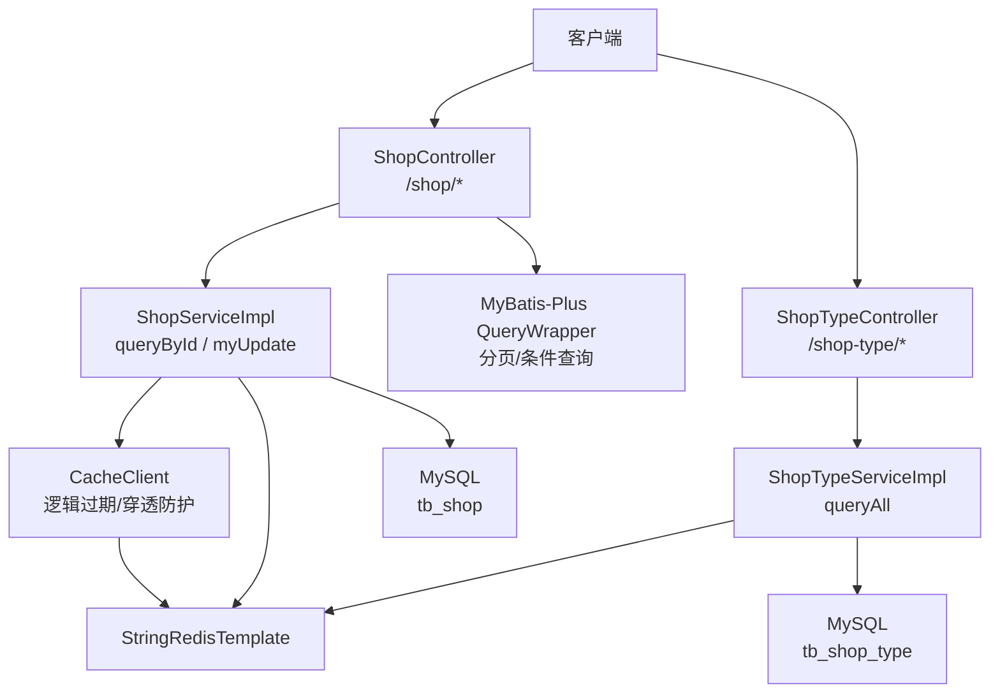
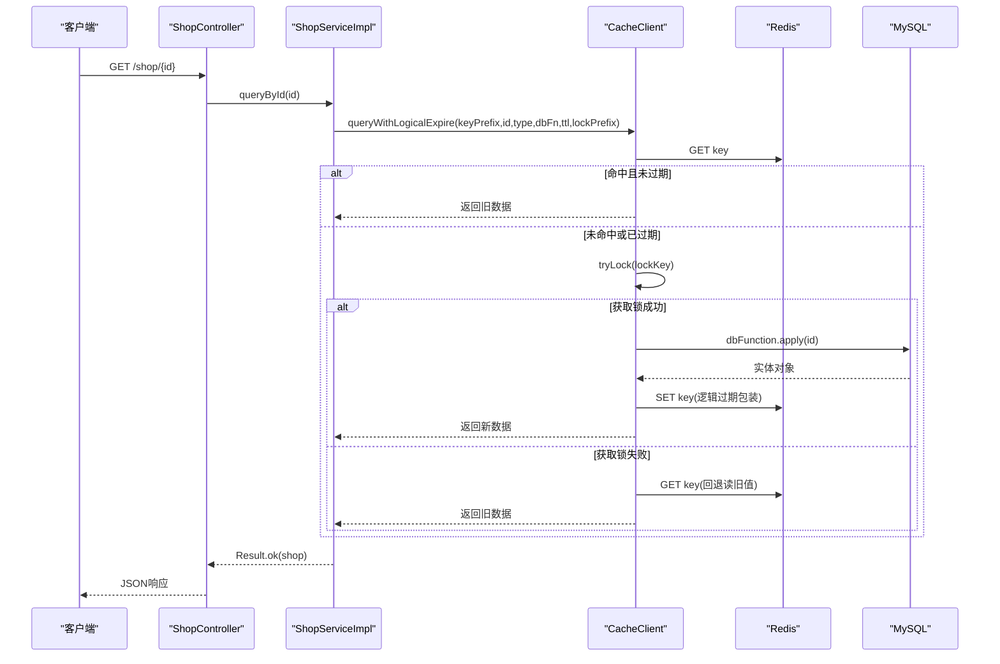
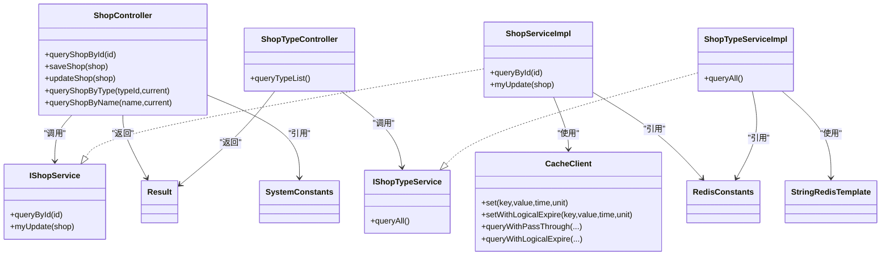
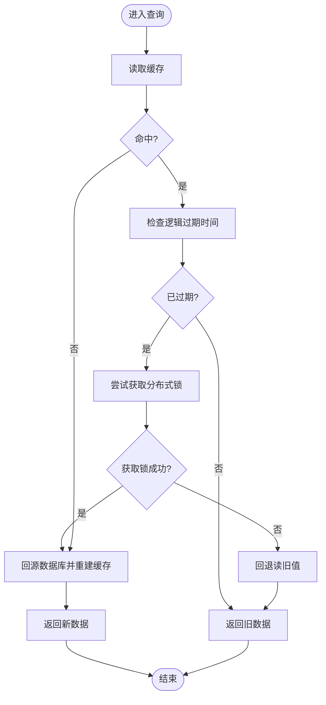

# 商户管理接口

<cite>
**本文引用的文件**   
- [ShopController.java](file://src/main/java/com/hmdp/controller/ShopController.java)
- [ShopTypeController.java](file://src/main/java/com/hmdp/controller/ShopTypeController.java)
- [IShopService.java](file://src/main/java/com/hmdp/service/IShopService.java)
- [ShopServiceImpl.java](file://src/main/java/com/hmdp/service/impl/ShopServiceImpl.java)
- [IShopTypeService.java](file://src/main/java/com/hmdp/service/IShopTypeService.java)
- [ShopTypeServiceImpl.java](file://src/main/java/com/hmdp/service/impl/ShopTypeServiceImpl.java)
- [Shop.java](file://src/main/java/com/hmdp/entity/Shop.java)
- [ShopType.java](file://src/main/java/com/hmdp/entity/ShopType.java)
- [CacheClient.java](file://src/main/java/com/hmdp/utils/CacheClient.java)
- [RedisConstants.java](file://src/main/java/com/hmdp/utils/RedisConstants.java)
- [SystemConstants.java](file://src/main/java/com/hmdp/utils/SystemConstants.java)
- [Result.java](file://src/main/java/com/hmdp/dto/Result.java)
</cite>

## 目录
1. [简介](#简介)
2. [项目结构](#项目结构)
3. [核心组件](#核心组件)
4. [架构总览](#架构总览)
5. [详细接口说明](#详细接口说明)
6. [依赖关系分析](#依赖关系分析)
7. [性能与缓存策略](#性能与缓存策略)
8. [常见问题与排障](#常见问题与排障)
9. [结论](#结论)
10. [附录：数据模型与常量](#附录数据模型与常量)

## 简介
本文件为“商户管理模块”的API接口文档，覆盖以下能力：
- 商铺信息查询（按ID）
- 分页查询（按类型、按名称关键字）
- 商铺类型列表查询
- 缓存策略与一致性保障（逻辑过期+互斥锁）
- Redis在商户信息展示中的应用（含地理键空间预留）
- 分页参数规范、精度控制建议、缓存穿透防护机制
- 请求/响应示例、性能优化技巧与常见问题解决方案

## 项目结构
该模块采用典型的分层架构：
- Controller层：暴露HTTP接口，负责参数校验与结果封装
- Service层：业务逻辑实现，包含缓存读写、数据库访问
- Utils层：通用工具（缓存客户端、常量定义等）
- Entity层：领域实体映射数据库表
- DTO层：统一返回体封装

图示来源
- [ShopController.java:22-100](file://src/main/java/com/hmdp/controller/ShopController.java#L22-L100)
- [ShopTypeController.java:24-36](file://src/main/java/com/hmdp/controller/ShopTypeController.java#L24-L36)
- [ShopServiceImpl.java:28-60](file://src/main/java/com/hmdp/service/impl/ShopServiceImpl.java#L28-L60)
- [ShopTypeServiceImpl.java:26-48](file://src/main/java/com/hmdp/service/impl/ShopTypeServiceImpl.java#L26-L48)
- [CacheClient.java:17-139](file://src/main/java/com/hmdp/utils/CacheClient.java#L17-L139)
- [RedisConstants.java:1-25](file://src/main/java/com/hmdp/utils/RedisConstants.java#L1-L25)

章节来源
- [ShopController.java:22-100](file://src/main/java/com/hmdp/controller/ShopController.java#L22-L100)
- [ShopTypeController.java:24-36](file://src/main/java/com/hmdp/controller/ShopTypeController.java#L24-L36)
- [ShopServiceImpl.java:28-60](file://src/main/java/com/hmdp/service/impl/ShopServiceImpl.java#L28-L60)
- [ShopTypeServiceImpl.java:26-48](file://src/main/java/com/hmdp/service/impl/ShopTypeServiceImpl.java#L26-L48)
- [CacheClient.java:17-139](file://src/main/java/com/hmdp/utils/CacheClient.java#L17-L139)
- [RedisConstants.java:1-25](file://src/main/java/com/hmdp/utils/RedisConstants.java#L1-L25)

## 核心组件
- ShopController：提供商铺CRUD与分页查询接口
- ShopTypeController：提供商铺类型列表接口
- IShopService/ShopServiceImpl：实现商铺详情查询（带缓存）、更新（带缓存失效）
- IShopTypeService/ShopTypeServiceImpl：实现商铺类型列表（带缓存）
- CacheClient：封装缓存读取、逻辑过期、穿透防护、分布式锁
- Result：统一返回体
- SystemConstants：分页大小等系统常量
- RedisConstants：Redis Key前缀与TTL常量

章节来源
- [ShopController.java:22-100](file://src/main/java/com/hmdp/controller/ShopController.java#L22-L100)
- [ShopTypeController.java:24-36](file://src/main/java/com/hmdp/controller/ShopTypeController.java#L24-L36)
- [IShopService.java:15-20](file://src/main/java/com/hmdp/service/IShopService.java#L15-L20)
- [ShopServiceImpl.java:28-60](file://src/main/java/com/hmdp/service/impl/ShopServiceImpl.java#L28-L60)
- [IShopTypeService.java:15-18](file://src/main/java/com/hmdp/service/IShopTypeService.java#L15-L18)
- [ShopTypeServiceImpl.java:26-48](file://src/main/java/com/hmdp/service/impl/ShopTypeServiceImpl.java#L26-L48)
- [CacheClient.java:17-139](file://src/main/java/com/hmdp/utils/CacheClient.java#L17-L139)
- [Result.java:9-30](file://src/main/java/com/hmdp/dto/Result.java#L9-L30)
- [SystemConstants.java:3-8](file://src/main/java/com/hmdp/utils/SystemConstants.java#L3-L8)
- [RedisConstants.java:1-25](file://src/main/java/com/hmdp/utils/RedisConstants.java#L1-L25)

## 架构总览
下图展示了“按ID查询商铺详情”的调用链与缓存交互流程。

图示来源
- [ShopController.java:34-37](file://src/main/java/com/hmdp/controller/ShopController.java#L34-L37)
- [ShopServiceImpl.java:36-45](file://src/main/java/com/hmdp/service/impl/ShopServiceImpl.java#L36-L45)
- [CacheClient.java:64-127](file://src/main/java/com/hmdp/utils/CacheClient.java#L64-L127)
- [RedisConstants.java:11-17](file://src/main/java/com/hmdp/utils/RedisConstants.java#L11-L17)

## 详细接口说明

### 1. 根据ID查询商铺详情
- 接口路径：GET /shop/{id}
- 功能：根据商铺ID查询详情，优先从缓存读取；若缓存未命中或逻辑过期，则回源数据库并重建缓存
- 请求参数
  - path参数：id（Long，必填）
- 响应体
  - 成功：data为Shop实体
  - 失败：success=false，errorMsg提示错误信息
- 缓存行为
  - 使用逻辑过期+互斥锁防止缓存击穿
  - 空值不写入缓存（避免穿透）
- 示例
  - 请求：GET /shop/123
  - 响应：{"success":true,"errorMsg":null,"data":{"id":123,"name":"...","typeId":1,...},"total":null}

章节来源
- [ShopController.java:34-37](file://src/main/java/com/hmdp/controller/ShopController.java#L34-L37)
- [ShopServiceImpl.java:36-45](file://src/main/java/com/hmdp/service/impl/ShopServiceImpl.java#L36-L45)
- [CacheClient.java:64-127](file://src/main/java/com/hmdp/utils/CacheClient.java#L64-L127)
- [RedisConstants.java:11-17](file://src/main/java/com/hmdp/utils/RedisConstants.java#L11-L17)
- [Result.java:18-29](file://src/main/java/com/hmdp/dto/Result.java#L18-L29)

### 2. 新增商铺
- 接口路径：POST /shop
- 功能：新增商铺记录，返回生成的商铺ID
- 请求体：Shop实体JSON
- 响应体
  - 成功：data为商铺ID
- 注意：当前实现未对新增操作进行缓存预热，后续可按需补充

章节来源
- [ShopController.java:44-50](file://src/main/java/com/hmdp/controller/ShopController.java#L44-L50)

### 3. 更新商铺
- 接口路径：PUT /shop
- 功能：更新商铺信息，同时删除对应缓存键，保证下次读取时回源重建
- 请求体：Shop实体JSON（必须包含id）
- 响应体
  - 成功：data为更新的Shop实体
  - 失败：success=false，errorMsg提示错误信息
- 缓存策略
  - 先写库，再删缓存（Cache Aside Pattern）

章节来源
- [ShopController.java:57-61](file://src/main/java/com/hmdp/controller/ShopController.java#L57-L61)
- [ShopServiceImpl.java:47-58](file://src/main/java/com/hmdp/service/impl/ShopServiceImpl.java#L47-L58)
- [RedisConstants.java:11-17](file://src/main/java/com/hmdp/utils/RedisConstants.java#L11-L17)

### 4. 按类型分页查询商铺
- 接口路径：GET /shop/of/type
- 功能：根据商铺类型ID分页查询商铺列表
- 请求参数
  - typeId（Integer，必填）
  - current（Integer，可选，默认1）
- 分页大小
  - 固定为系统常量DEFAULT_PAGE_SIZE
- 响应体
  - 成功：data为Shop列表
- 示例
  - 请求：GET /shop/of/type?typeId=1&current=1
  - 响应：{"success":true,"errorMsg":null,"data":[{...},{...},...],"total":null}

章节来源
- [ShopController.java:69-80](file://src/main/java/com/hmdp/controller/ShopController.java#L69-L80)
- [SystemConstants.java:6-7](file://src/main/java/com/hmdp/utils/SystemConstants.java#L6-L7)

### 5. 按名称关键字分页查询商铺
- 接口路径：GET /shop/of/name
- 功能：根据商铺名称关键字模糊匹配分页查询
- 请求参数
  - name（String，可选）
  - current（Integer，可选，默认1）
- 分页大小
  - 固定为系统常量MAX_PAGE_SIZE
- 响应体
  - 成功：data为Shop列表
- 示例
  - 请求：GET /shop/of/name?name=火锅&current=1
  - 响应：{"success":true,"errorMsg":null,"data":[{...}],...}

章节来源
- [ShopController.java:88-99](file://src/main/java/com/hmdp/controller/ShopController.java#L88-L99)
- [SystemConstants.java:6-7](file://src/main/java/com/hmdp/utils/SystemConstants.java#L6-L7)

### 6. 查询商铺类型列表
- 接口路径：GET /shop-type/list
- 功能：查询所有商铺类型，优先从缓存读取；未命中则查库并写入缓存
- 请求参数：无
- 响应体
  - 成功：data为ShopType列表
- 缓存策略
  - 简单缓存（无过期），首次加载后常驻内存

章节来源
- [ShopTypeController.java:32-35](file://src/main/java/com/hmdp/controller/ShopTypeController.java#L32-L35)
- [ShopTypeServiceImpl.java:31-46](file://src/main/java/com/hmdp/service/impl/ShopTypeServiceImpl.java#L31-L46)
- [RedisConstants.java:14](file://src/main/java/com/hmdp/utils/RedisConstants.java#L14)

## 依赖关系分析
- Controller依赖Service，Service依赖Mapper与缓存客户端
- 缓存客户端依赖Redis模板与Hutool JSON工具
- 常量集中管理于RedisConstants与SystemConstants

图示来源
- [ShopController.java:22-100](file://src/main/java/com/hmdp/controller/ShopController.java#L22-L100)
- [ShopTypeController.java:24-36](file://src/main/java/com/hmdp/controller/ShopTypeController.java#L24-L36)
- [IShopService.java:15-20](file://src/main/java/com/hmdp/service/IShopService.java#L15-L20)
- [ShopServiceImpl.java:28-60](file://src/main/java/com/hmdp/service/impl/ShopServiceImpl.java#L28-L60)
- [IShopTypeService.java:15-18](file://src/main/java/com/hmdp/service/IShopTypeService.java#L15-L18)
- [ShopTypeServiceImpl.java:26-48](file://src/main/java/com/hmdp/service/impl/ShopTypeServiceImpl.java#L26-L48)
- [CacheClient.java:17-139](file://src/main/java/com/hmdp/utils/CacheClient.java#L17-L139)
- [Result.java:9-30](file://src/main/java/com/hmdp/dto/Result.java#L9-L30)
- [SystemConstants.java:3-8](file://src/main/java/com/hmdp/utils/SystemConstants.java#L3-L8)
- [RedisConstants.java:1-25](file://src/main/java/com/hmdp/utils/RedisConstants.java#L1-L25)

## 性能与缓存策略

### 缓存策略概览
- 商铺详情（逻辑过期+互斥锁）
  - 读取流程：先读缓存，未命中或逻辑过期时尝试加锁，成功后回源数据库并重建缓存；其他并发请求直接返回旧值
  - 写入流程：更新数据库后删除缓存键，确保下次读取回源重建
- 商铺类型（简单缓存）
  - 读取流程：先读缓存，未命中则查库并写入缓存（无过期）
- 穿透防护
  - 针对不存在的数据，不写入缓存（避免空值长期占用）

图示来源
- [CacheClient.java:64-127](file://src/main/java/com/hmdp/utils/CacheClient.java#L64-L127)
- [ShopServiceImpl.java:36-45](file://src/main/java/com/hmdp/service/impl/ShopServiceImpl.java#L36-L45)

### 关键设计要点
- 逻辑过期
  - 将过期时间随数据一起存储，读取时判断是否过期，避免Redis TTL带来的并发重建问题
- 互斥锁
  - 基于Redis setIfAbsent实现的短生命周期锁，防止热点Key重建时的并发风暴
- 缓存穿透防护
  - 当数据库查询结果为空时，不写入缓存，避免恶意请求持续打到数据库
- 更新策略
  - 采用“先写库，再删缓存”，保证最终一致性

章节来源
- [CacheClient.java:64-127](file://src/main/java/com/hmdp/utils/CacheClient.java#L64-L127)
- [ShopServiceImpl.java:47-58](file://src/main/java/com/hmdp/service/impl/ShopServiceImpl.java#L47-L58)
- [RedisConstants.java:11-17](file://src/main/java/com/hmdp/utils/RedisConstants.java#L11-L17)

### 分页参数与限制
- 按类型分页
  - 页码：current（默认1）
  - 每页大小：DEFAULT_PAGE_SIZE（固定）
- 按名称分页
  - 页码：current（默认1）
  - 每页大小：MAX_PAGE_SIZE（固定）
- 建议
  - 前端合理设置current，避免过大导致响应缓慢
  - 如需动态调整每页大小，可在Controller中增加参数校验与上限控制

章节来源
- [ShopController.java:69-80](file://src/main/java/com/hmdp/controller/ShopController.java#L69-L80)
- [ShopController.java:88-99](file://src/main/java/com/hmdp/controller/ShopController.java#L88-L99)
- [SystemConstants.java:6-7](file://src/main/java/com/hmdp/utils/SystemConstants.java#L6-L7)

### 地理位置搜索与精度控制
- 现状
  - 代码中存在地理相关常量SHOP_GEO_KEY，但当前控制器与服务层未实现GEO查询接口
- 建议方案（概念性）
  - 使用Redis GEO数据结构维护商铺经纬度
  - 通过GEORADIUS/GEOSEARCH实现附近商户检索
  - 精度控制
    - 半径单位：米/千米
    - 排序：距离升序
    - 返回字段：基础信息+distance（由后端计算或Redis返回）
- 注意事项
  - 坐标精度保留小数点后多位，避免误差累积
  - 大数据量场景下，结合数据库索引与分页游标提升性能

[本节为概念性说明，不直接分析具体源码文件]

## 常见问题与排障

- 缓存穿透
  - 现象：大量不存在ID的请求持续打到数据库
  - 处理：空值不写入缓存；必要时可引入布隆过滤器
- 缓存击穿
  - 现象：热点Key过期瞬间大量并发请求直达数据库
  - 处理：逻辑过期+互斥锁，仅一个线程重建缓存，其余返回旧值
- 缓存雪崩
  - 现象：大量Key在同一时间过期
  - 处理：为过期时间添加随机抖动；分片部署Redis
- 更新不一致
  - 现象：更新后仍读到旧数据
  - 处理：采用“先写库，再删缓存”；必要时引入延迟双删或消息队列异步清理
- 分页异常
  - 现象：current为负数或过大
  - 处理：增加参数校验与边界保护

章节来源
- [CacheClient.java:64-127](file://src/main/java/com/hmdp/utils/CacheClient.java#L64-L127)
- [ShopServiceImpl.java:47-58](file://src/main/java/com/hmdp/service/impl/ShopServiceImpl.java#L47-L58)

## 结论
本模块提供了完整的商铺查询与类型列表接口，并通过逻辑过期与互斥锁实现了高可用的缓存策略。当前未实现地理搜索接口，但已预留Redis GEO键空间。建议在后续迭代中完善地理查询、动态分页大小、以及更完善的缓存一致性保障。

## 附录：数据模型与常量

### 实体：Shop
- 主要字段
  - id：主键
  - name：商铺名称
  - typeId：类型ID
  - images：图片集合（逗号分隔）
  - area：商圈
  - address：地址
  - x：经度
  - y：纬度
  - avgPrice：均价（整数）
  - sold：销量
  - comments：评论数量
  - score：评分（1~5分×10）
  - openHours：营业时间
  - createTime：创建时间
  - updateTime：更新时间
  - distance：非持久化字段，用于距离计算

章节来源
- [Shop.java:26-109](file://src/main/java/com/hmdp/entity/Shop.java#L26-L109)

### 实体：ShopType
- 主要字段
  - id：主键
  - name：类型名称
  - icon：图标
  - sort：顺序
  - createTime：创建时间（序列化忽略）
  - updateTime：更新时间（序列化忽略）

章节来源
- [ShopType.java:26-64](file://src/main/java/com/hmdp/entity/ShopType.java#L26-L64)

### 常量：Redis键与TTL
- 商铺缓存键前缀：cache:shop:
- 商铺类型缓存键：cache:shop_type:
- 商铺锁键前缀：lock:shop:
- 商铺地理键前缀：shop:geo:
- 商铺缓存TTL：30秒（常量存在，实际逻辑过期时间为20秒）

章节来源
- [RedisConstants.java:11-22](file://src/main/java/com/hmdp/utils/RedisConstants.java#L11-L22)
- [ShopServiceImpl.java:39-40](file://src/main/java/com/hmdp/service/impl/ShopServiceImpl.java#L39-L40)

### 常量：分页大小
- DEFAULT_PAGE_SIZE：默认每页条数
- MAX_PAGE_SIZE：最大每页条数

章节来源
- [SystemConstants.java:6-7](file://src/main/java/com/hmdp/utils/SystemConstants.java#L6-L7)