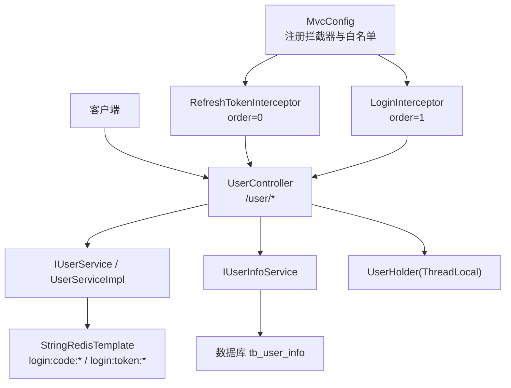
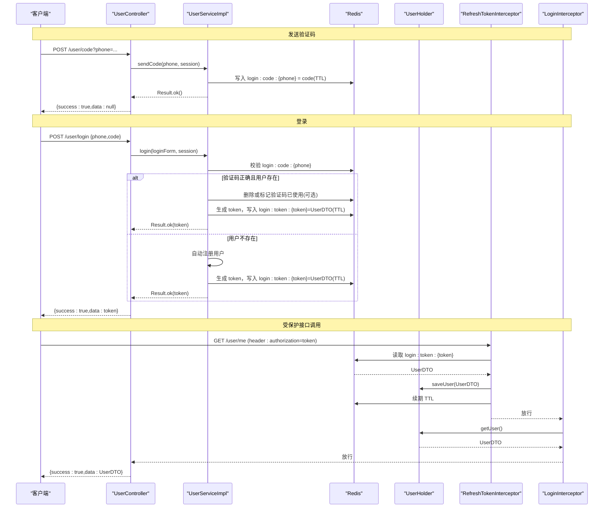
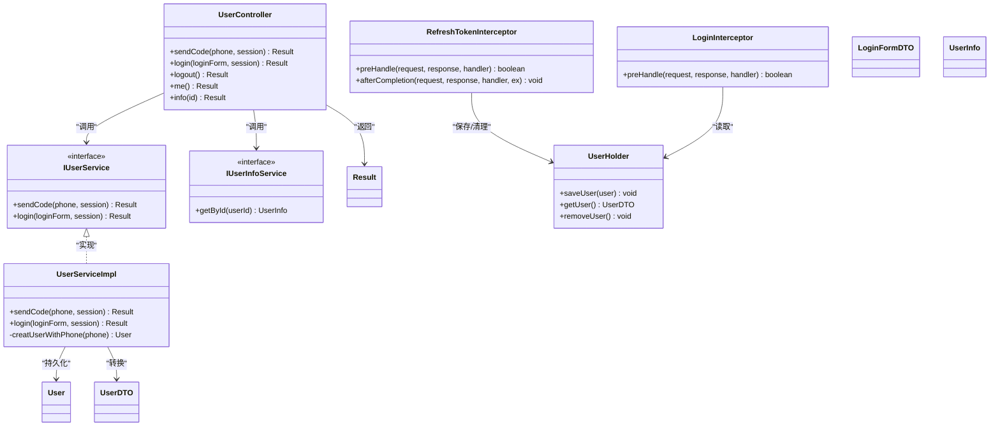
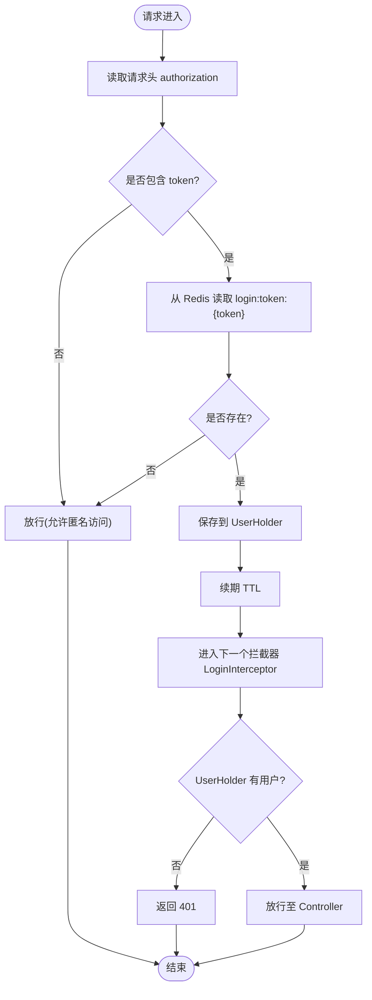

# 用户认证接口

<cite>
**本文引用的文件**
- [UserController.java](file://src/main/java/com/hmdp/controller/UserController.java)
- [IUserService.java](file://src/main/java/com/hmdp/service/IUserService.java)
- [UserServiceImpl.java](file://src/main/java/com/hmdp/service/impl/UserServiceImpl.java)
- [LoginFormDTO.java](file://src/main/java/com/hmdp/dto/LoginFormDTO.java)
- [UserDTO.java](file://src/main/java/com/hmdp/dto/UserDTO.java)
- [Result.java](file://src/main/java/com/hmdp/dto/Result.java)
- [MvcConfig.java](file://src/main/java/com/hmdp/config/MvcConfig.java)
- [LoginInterceptor.java](file://src/main/java/com/hmdp/utils/LoginInterceptor.java)
- [RefreshTokenInterceptor.java](file://src/main/java/com/hmdp/utils/RefreshTokenInterceptor.java)
- [RedisConstants.java](file://src/main/java/com/hmdp/utils/RedisConstants.java)
- [UserHolder.java](file://src/main/java/com/hmdp/utils/UserHolder.java)
- [User.java](file://src/main/java/com/hmdp/entity/User.java)
- [UserInfo.java](file://src/main/java/com/hmdp/entity/UserInfo.java)
</cite>

## 目录
1. [简介](#简介)
2. [项目结构](#项目结构)
3. [核心组件](#核心组件)
4. [架构总览](#架构总览)
5. [详细接口规范](#详细接口规范)
6. [依赖与关系分析](#依赖与关系分析)
7. [性能与缓存](#性能与缓存)
8. [安全与最佳实践](#安全与最佳实践)
9. [故障排查指南](#故障排查指南)
10. [结论](#结论)

## 简介
本文件为用户认证模块的API接口文档，覆盖以下能力：
- 手机号验证码发送
- 用户登录（基于手机验证码）
- 登出（当前未实现）
- 获取当前登录用户信息
- 查询用户详情

同时说明Session与Token认证的实现细节、拦截器工作原理、常见错误处理策略与安全建议。

## 项目结构
认证相关代码主要分布在控制器、服务实现、DTO、拦截器与配置类中：
- 控制器：暴露HTTP接口
- 服务层：业务逻辑（验证码校验、登录、自动注册等）
- DTO：请求与响应数据模型
- 拦截器：鉴权与刷新令牌
- 配置：拦截器注册与路径白名单
- 常量：Redis键名与过期时间

图表来源
- [UserController.java:1-86](file://src/main/java/com/hmdp/controller/UserController.java#L1-L86)
- [IUserService.java:1-25](file://src/main/java/com/hmdp/service/IUserService.java#L1-L25)
- [UserServiceImpl.java:1-110](file://src/main/java/com/hmdp/service/impl/UserServiceImpl.java#L1-L110)
- [MvcConfig.java:1-34](file://src/main/java/com/hmdp/config/MvcConfig.java#L1-L34)
- [RefreshTokenInterceptor.java:1-51](file://src/main/java/com/hmdp/utils/RefreshTokenInterceptor.java#L1-L51)
- [LoginInterceptor.java:1-31](file://src/main/java/com/hmdp/utils/LoginInterceptor.java#L1-L31)
- [UserHolder.java:1-20](file://src/main/java/com/hmdp/utils/UserHolder.java#L1-L20)

章节来源
- [UserController.java:1-86](file://src/main/java/com/hmdp/controller/UserController.java#L1-L86)
- [MvcConfig.java:1-34](file://src/main/java/com/hmdp/config/MvcConfig.java#L1-L34)

## 核心组件
- 统一响应体 Result：包含 success、errorMsg、data、total 字段，提供 ok/fail 静态方法构造响应。
- 登录表单 LoginFormDTO：包含 phone、code、password 三个字段。
- 用户信息 UserDTO：包含 id、nickName、icon 三个字段，用于返回当前用户基本信息。
- 用户实体 User：对应数据库表 tb_user，包含 id、phone、password、nickName、icon、createTime、updateTime。
- 用户详情 UserInfo：对应数据库表 tb_user_info，包含 userId、city、introduce、fans、followee、gender、birthday、credits、level、createTime、updateTime。
- 用户上下文 UserHolder：基于 ThreadLocal 保存当前线程的用户信息。
- 拦截器：
  - RefreshTokenInterceptor：从请求头读取 token，加载用户到上下文并续期。
  - LoginInterceptor：检查上下文是否有用户，无则拒绝访问。
- 配置 MvcConfig：注册拦截器顺序与白名单路径。

章节来源
- [Result.java:1-31](file://src/main/java/com/hmdp/dto/Result.java#L1-L31)
- [LoginFormDTO.java:1-11](file://src/main/java/com/hmdp/dto/LoginFormDTO.java#L1-L11)
- [UserDTO.java:1-11](file://src/main/java/com/hmdp/dto/UserDTO.java#L1-L11)
- [User.java:1-67](file://src/main/java/com/hmdp/entity/User.java#L1-L67)
- [UserInfo.java:1-88](file://src/main/java/com/hmdp/entity/UserInfo.java#L1-L88)
- [UserHolder.java:1-20](file://src/main/java/com/hmdp/utils/UserHolder.java#L1-L20)
- [RefreshTokenInterceptor.java:1-51](file://src/main/java/com/hmdp/utils/RefreshTokenInterceptor.java#L1-L51)
- [LoginInterceptor.java:1-31](file://src/main/java/com/hmdp/utils/LoginInterceptor.java#L1-L31)
- [MvcConfig.java:1-34](file://src/main/java/com/hmdp/config/MvcConfig.java#L1-L34)

## 架构总览
认证流程采用“验证码登录 + Token”方案：
- 发送验证码：服务端生成6位数字验证码，存入Redis，设置过期时间。
- 登录：校验验证码后，若用户不存在则自动注册；生成随机Token，将用户信息以Hash形式存入Redis，并返回Token给客户端。
- 鉴权：后续请求携带 authorization 请求头，RefreshTokenInterceptor 解析Token并填充用户上下文，LoginInterceptor 校验上下文是否存在用户。
- 获取当前用户：从 UserHolder 取出当前用户信息。
- 查询用户详情：根据用户ID查询 tb_user_info。

图表来源
- [UserController.java:39-70](file://src/main/java/com/hmdp/controller/UserController.java#L39-L70)
- [UserServiceImpl.java:47-100](file://src/main/java/com/hmdp/service/impl/UserServiceImpl.java#L47-L100)
- [RefreshTokenInterceptor.java:25-42](file://src/main/java/com/hmdp/utils/RefreshTokenInterceptor.java#L25-L42)
- [LoginInterceptor.java:22-28](file://src/main/java/com/hmdp/utils/LoginInterceptor.java#L22-L28)
- [UserHolder.java:8-14](file://src/main/java/com/hmdp/utils/UserHolder.java#L8-L14)
- [RedisConstants.java:4-7](file://src/main/java/com/hmdp/utils/RedisConstants.java#L4-L7)

## 详细接口规范

### 通用约定
- 基础路径：/user
- 统一响应体：Result
  - 字段：success(Boolean)、errorMsg(String)、data(Object)、total(Long)
  - 成功时 success=true，data 为具体数据；失败时 success=false，errorMsg 描述错误原因
- 认证方式：
  - 需要认证的接口需在请求头携带 authorization=token
  - 登录成功后返回 token，后续请求使用该 token
- 状态码：
  - 鉴权失败时直接返回 HTTP 401（由拦截器设置）
  - 其他业务错误通过 Result.fail 返回，HTTP 200，success=false

章节来源
- [Result.java:1-31](file://src/main/java/com/hmdp/dto/Result.java#L1-L31)
- [LoginInterceptor.java:22-28](file://src/main/java/com/hmdp/utils/LoginInterceptor.java#L22-L28)

### 发送手机验证码
- 接口：POST /user/code
- 请求参数
  - 查询参数：phone(String)，必填，手机号格式需合法
- 响应
  - 成功：{success:true, data:null}
  - 失败：{success:false, errorMsg:"手机格式错误！"}
- 行为说明
  - 服务端生成6位数字验证码
  - 将验证码以 key="login:code:{phone}" 存入Redis，TTL=2分钟
  - 不依赖HttpSession存储验证码（注释掉的session逻辑）
- 示例
  - 请求
    - URL: POST /user/code?phone=13800138000
  - 响应
    - {success:true, data:null}

章节来源
- [UserController.java:39-43](file://src/main/java/com/hmdp/controller/UserController.java#L39-L43)
- [UserServiceImpl.java:47-60](file://src/main/java/com/hmdp/service/impl/UserServiceImpl.java#L47-L60)
- [RedisConstants.java:4-5](file://src/main/java/com/hmdp/utils/RedisConstants.java#L4-L5)

### 用户登录
- 接口：POST /user/login
- 请求体：LoginFormDTO
  - phone(String)：必填，手机号
  - code(String)：必填，验证码
  - password(String)：可选，当前登录流程未使用
- 响应
  - 成功：{success:true, data:token}
  - 失败：
    - {success:false, errorMsg:"手机格式错误！"}
    - {success:false, errorMsg:"手机号或验证码错误！"}
- 行为说明
  - 校验手机号格式
  - 从Redis读取验证码并比对
  - 若用户不存在，自动创建用户（昵称前缀+随机数）
  - 生成随机Token，将用户信息以Hash形式存入Redis，key="login:token:{token}"，TTL=36000秒
  - 返回Token给客户端
- 示例
  - 请求体
    - {phone:"13800138000", code:"123456"}
  - 响应
    - {success:true, data:"a1b2c3d4-e5f6-..."}

章节来源
- [UserController.java:49-53](file://src/main/java/com/hmdp/controller/UserController.java#L49-L53)
- [UserServiceImpl.java:63-100](file://src/main/java/com/hmdp/service/impl/UserServiceImpl.java#L63-L100)
- [RedisConstants.java:6-7](file://src/main/java/com/hmdp/utils/RedisConstants.java#L6-L7)
- [LoginFormDTO.java:1-11](file://src/main/java/com/hmdp/dto/LoginFormDTO.java#L1-L11)

### 登出
- 接口：POST /user/logout
- 请求参数：无
- 响应
  - 当前返回：{success:false, errorMsg:"功能未完成"}
- 行为说明
  - 该接口尚未实现，实际登出应删除Redis中的 token 记录并清理上下文

章节来源
- [UserController.java:59-63](file://src/main/java/com/hmdp/controller/UserController.java#L59-L63)

### 获取当前用户信息
- 接口：GET /user/me
- 认证要求：需要 authorization=token
- 响应
  - 成功：{success:true, data:UserDTO}
  - 失败：HTTP 401（未登录或token无效）
- 行为说明
  - 从 UserHolder 获取当前用户信息
  - UserDTO 包含 id、nickName、icon
- 示例
  - 请求头：authorization=a1b2c3d4-e5f6-...
  - 响应
    - {success:true, data:{id:123, nickName:"虎哥_1234567", icon:""}}

章节来源
- [UserController.java:65-70](file://src/main/java/com/hmdp/controller/UserController.java#L65-L70)
- [UserDTO.java:1-11](file://src/main/java/com/hmdp/dto/UserDTO.java#L1-L11)
- [UserHolder.java:12-14](file://src/main/java/com/hmdp/utils/UserHolder.java#L12-L14)

### 查询用户详情
- 接口：GET /user/info/{id}
- 认证要求：不需要（未在拦截器白名单排除，但当前实现未强制鉴权）
- 路径参数
  - id(Long)：用户ID
- 响应
  - 成功：{success:true, data:UserInfo}
  - 若无详情：{success:true, data:null}
- 行为说明
  - 根据用户ID查询 tb_user_info
  - 返回时去除 createTime 和 updateTime 字段
- 示例
  - 请求：GET /user/info/123
  - 响应
    - {success:true, data:{userId:123, city:"上海", introduce:"...", fans:0, followee:0, gender:false, birthday:"1990-01-01", credits:0, level:false}}

章节来源
- [UserController.java:72-84](file://src/main/java/com/hmdp/controller/UserController.java#L72-L84)
- [UserInfo.java:1-88](file://src/main/java/com/hmdp/entity/UserInfo.java#L1-L88)

## 依赖与关系分析

### 类关系图

图表来源
- [UserController.java:1-86](file://src/main/java/com/hmdp/controller/UserController.java#L1-L86)
- [IUserService.java:1-25](file://src/main/java/com/hmdp/service/IUserService.java#L1-L25)
- [UserServiceImpl.java:1-110](file://src/main/java/com/hmdp/service/impl/UserServiceImpl.java#L1-L110)
- [LoginInterceptor.java:1-31](file://src/main/java/com/hmdp/utils/LoginInterceptor.java#L1-L31)
- [RefreshTokenInterceptor.java:1-51](file://src/main/java/com/hmdp/utils/RefreshTokenInterceptor.java#L1-L51)
- [UserHolder.java:1-20](file://src/main/java/com/hmdp/utils/UserHolder.java#L1-L20)
- [Result.java:1-31](file://src/main/java/com/hmdp/dto/Result.java#L1-L31)
- [LoginFormDTO.java:1-11](file://src/main/java/com/hmdp/dto/LoginFormDTO.java#L1-L11)
- [UserDTO.java:1-11](file://src/main/java/com/hmdp/dto/UserDTO.java#L1-L11)
- [User.java:1-67](file://src/main/java/com/hmdp/entity/User.java#L1-L67)
- [UserInfo.java:1-88](file://src/main/java/com/hmdp/entity/UserInfo.java#L1-L88)

### 拦截器工作流

图表来源
- [RefreshTokenInterceptor.java:25-42](file://src/main/java/com/hmdp/utils/RefreshTokenInterceptor.java#L25-L42)
- [LoginInterceptor.java:22-28](file://src/main/java/com/hmdp/utils/LoginInterceptor.java#L22-L28)
- [UserHolder.java:8-18](file://src/main/java/com/hmdp/utils/UserHolder.java#L8-L18)
- [RedisConstants.java:6-7](file://src/main/java/com/hmdp/utils/RedisConstants.java#L6-L7)

## 性能与缓存
- 验证码缓存
  - Key：login:code:{phone}
  - TTL：2分钟
  - 作用：避免频繁短信发送，限制重试频率
- 用户会话缓存
  - Key：login:token:{token}
  - TTL：36000秒（约10小时）
  - 结构：Hash，存储 UserDTO 字段
  - 作用：分布式环境下共享登录态，支持横向扩展
- 续期机制
  - 每次带 token 的请求都会续期，提升活跃用户的体验
- 潜在优化点
  - 验证码使用后立即失效，防止重放攻击
  - 对高频接口增加限流与风控策略
  - 考虑将敏感字段（如密码）从返回对象中剔除

章节来源
- [RedisConstants.java:4-7](file://src/main/java/com/hmdp/utils/RedisConstants.java#L4-L7)
- [UserServiceImpl.java:90-99](file://src/main/java/com/hmdp/service/impl/UserServiceImpl.java#L90-L99)
- [RefreshTokenInterceptor.java:36-41](file://src/main/java/com/hmdp/utils/RefreshTokenInterceptor.java#L36-L41)

## 安全与最佳实践
- 传输安全
  - 所有接口建议使用HTTPS，防止Token在传输中被窃听
- 令牌安全
  - Token长度足够且不可预测（当前使用UUID）
  - 服务端定期清理过期Token
  - 建议增加签名或绑定设备指纹，降低泄露风险
- 验证码安全
  - 严格校验手机号格式
  - 验证码仅一次有效，使用后应立即失效
  - 增加发送频率限制与IP级限流
- 鉴权策略
  - 明确白名单路径，最小化开放范围
  - 对敏感接口增加二次校验（如操作确认）
- 日志与审计
  - 记录登录、登出、异常事件，便于追踪与审计
- 数据脱敏
  - 对外返回的数据不包含敏感字段（如密码）

[本节为通用安全建议，不直接分析具体文件]

## 故障排查指南
- 常见问题
  - 401 未授权：检查请求头是否包含正确的 authorization，确认Token未过期
  - 验证码错误：确认验证码未过期且未被使用过
  - 手机号格式错误：检查输入是否符合中国大陆手机号格式
  - 用户详情为空：确认用户是否存在 tb_user_info 记录
- 定位步骤
  - 查看Redis中是否存在 login:code:{phone} 与 login:token:{token}
  - 检查拦截器执行顺序与白名单配置是否正确
  - 核对UserHolder在当前线程中是否有用户上下文
- 参考实现位置
  - 验证码发送与校验：[UserServiceImpl.java:47-80](file://src/main/java/com/hmdp/service/impl/UserServiceImpl.java#L47-L80)
  - 登录与Token生成：[UserServiceImpl.java:90-99](file://src/main/java/com/hmdp/service/impl/UserServiceImpl.java#L90-L99)
  - 拦截器鉴权：[LoginInterceptor.java:22-28](file://src/main/java/com/hmdp/utils/LoginInterceptor.java#L22-L28)
  - 拦截器续期：[RefreshTokenInterceptor.java:36-41](file://src/main/java/com/hmdp/utils/RefreshTokenInterceptor.java#L36-L41)
  - 白名单配置：[MvcConfig.java:21-31](file://src/main/java/com/hmdp/config/MvcConfig.java#L21-L31)

章节来源
- [UserServiceImpl.java:47-99](file://src/main/java/com/hmdp/service/impl/UserServiceImpl.java#L47-L99)
- [LoginInterceptor.java:22-28](file://src/main/java/com/hmdp/utils/LoginInterceptor.java#L22-L28)
- [RefreshTokenInterceptor.java:36-41](file://src/main/java/com/hmdp/utils/RefreshTokenInterceptor.java#L36-L41)
- [MvcConfig.java:21-31](file://src/main/java/com/hmdp/config/MvcConfig.java#L21-L31)

## 结论
本认证模块采用“验证码登录 + Redis Token”的方案，具备分布式友好、易于扩展的特点。通过拦截器链完成鉴权与续期，配合白名单控制公开接口范围。建议在现有基础上完善登出接口、验证码一次性使用、限流与风控策略，并加强日志审计与传输安全，以提升整体安全性与可维护性。