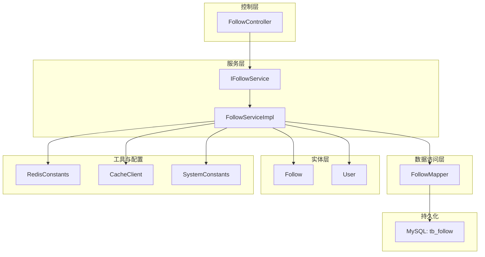
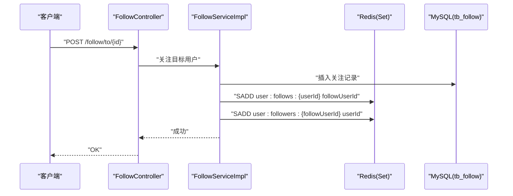
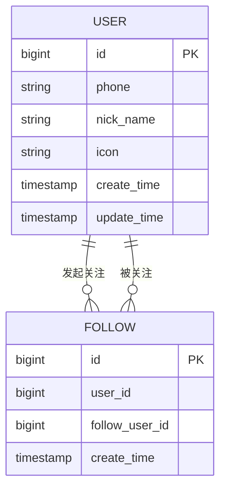
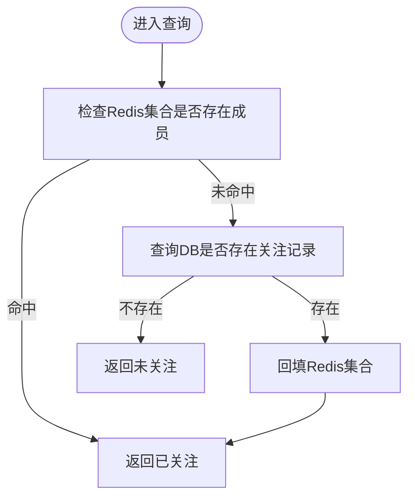
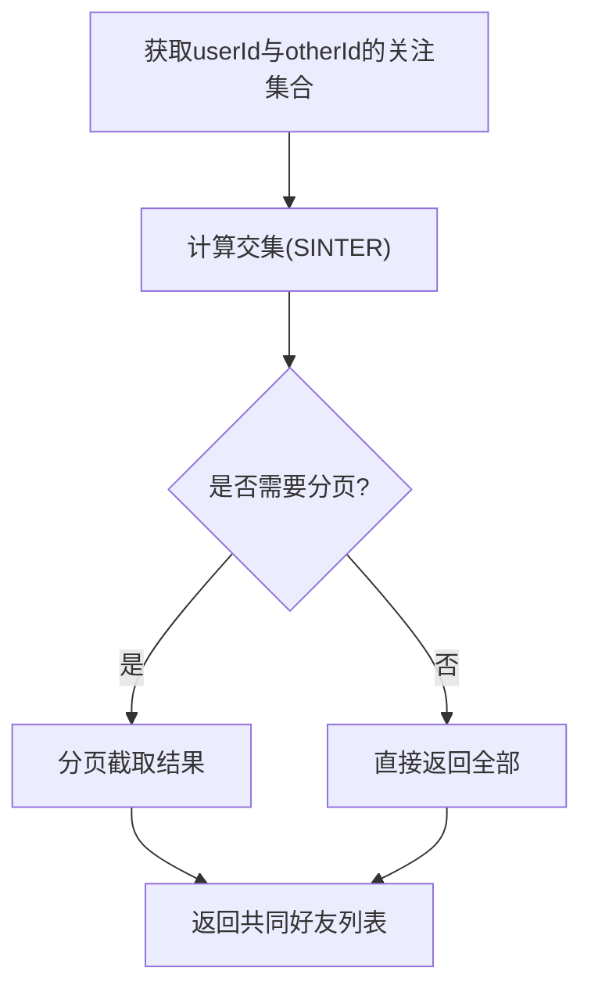
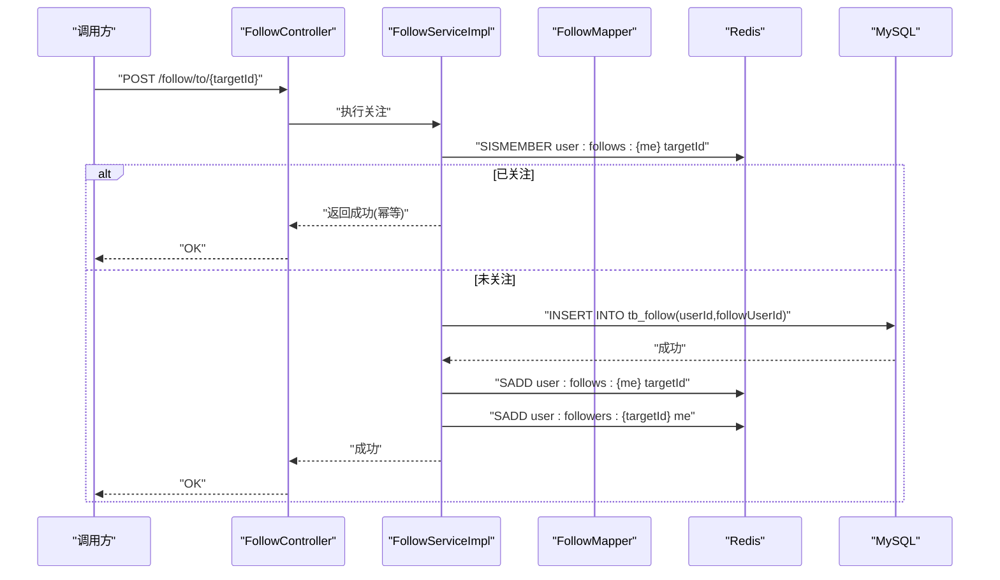
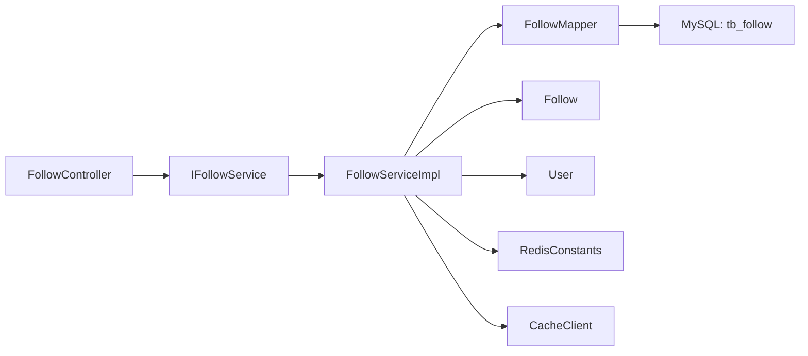

# 社交互动接口

<cite>
**本文引用的文件**
- [Follow.java](file://src/main/java/com/hmdp/entity/Follow.java)
- [FollowController.java](file://src/main/java/com/hmdp/controller/FollowController.java)
- [IFollowService.java](file://src/main/java/com/hmdp/service/IFollowService.java)
- [FollowServiceImpl.java](file://src/main/java/com/hmdp/service/impl/FollowServiceImpl.java)
- [FollowMapper.java](file://src/main/java/com/hmdp/mapper/FollowMapper.java)
- [hmdp.sql](file://src/main/resources/db/hmdp.sql)
- [RedisConstants.java](file://src/main/java/com/hmdp/utils/RedisConstants.java)
- [CacheClient.java](file://src/main/java/com/hmdp/utils/CacheClient.java)
- [UserDTO.java](file://src/main/java/com/hmdp/dto/UserDTO.java)
- [SystemConstants.java](file://src/main/java/com/hmdp/utils/SystemConstants.java)
</cite>

## 目录
1. [简介](#简介)
2. [项目结构](#项目结构)
3. [核心组件](#核心组件)
4. [架构总览](#架构总览)
5. [详细组件分析](#详细组件分析)
6. [依赖关系分析](#依赖关系分析)
7. [性能考虑](#性能考虑)
8. [故障排查指南](#故障排查指南)
9. [结论](#结论)
10. [附录](#附录)

## 简介
本文件为“社交互动模块”的API接口文档，聚焦用户关注、取消关注、查看关注列表与粉丝列表等能力。文档基于现有代码仓库中的实体、服务与工具类进行设计说明，给出：
- Follow实体的设计与存储模型
- Redis集合在关注关系存储中的应用方案
- 双向关注关系的维护策略
- 关注状态查询、互关判断、共同好友计算的业务逻辑
- 完整的关注流程示例（含缓存更新策略与性能优化技巧）

注意：当前仓库中FollowController为空控制器，FollowServiceImpl仅继承通用CRUD实现，未包含业务方法。本文档在严格依据现有代码的前提下，提供可落地的接口规范与实现建议，便于后续扩展。

## 项目结构
围绕社交互动模块的相关代码组织如下：
- 实体层：Follow（关注关系）、User（用户）
- 控制层：FollowController（待补充接口）
- 服务层：IFollowService、FollowServiceImpl（待补充业务）
- 数据访问层：FollowMapper（MyBatis-Plus基础映射）
- 配置与常量：RedisConstants（Redis键名与TTL常量）、SystemConstants（系统常量）
- 缓存工具：CacheClient（通用缓存封装）
- 数据库脚本：hmdp.sql（tb_follow表定义）

图表来源
- [FollowController.java:1-21](file://src/main/java/com/hmdp/controller/FollowController.java#L1-L21)
- [IFollowService.java:1-17](file://src/main/java/com/hmdp/service/IFollowService.java#L1-L17)
- [FollowServiceImpl.java:1-21](file://src/main/java/com/hmdp/service/impl/FollowServiceImpl.java#L1-L21)
- [FollowMapper.java:1-17](file://src/main/java/com/hmdp/mapper/FollowMapper.java#L1-L17)
- [Follow.java:1-52](file://src/main/java/com/hmdp/entity/Follow.java#L1-L52)
- [User.java:1-67](file://src/main/java/com/hmdp/entity/User.java#L1-L67)
- [RedisConstants.java:1-25](file://src/main/java/com/hmdp/utils/RedisConstants.java#L1-L25)
- [CacheClient.java:1-140](file://src/main/java/com/hmdp/utils/CacheClient.java#L1-L140)
- [SystemConstants.java:1-9](file://src/main/java/com/hmdp/utils/SystemConstants.java#L1-L9)

章节来源
- [FollowController.java:1-21](file://src/main/java/com/hmdp/controller/FollowController.java#L1-L21)
- [IFollowService.java:1-17](file://src/main/java/com/hmdp/service/IFollowService.java#L1-L17)
- [FollowServiceImpl.java:1-21](file://src/main/java/com/hmdp/service/impl/FollowServiceImpl.java#L1-L21)
- [FollowMapper.java:1-17](file://src/main/java/com/hmdp/mapper/FollowMapper.java#L1-L17)
- [Follow.java:1-52](file://src/main/java/com/hmdp/entity/Follow.java#L1-L52)
- [User.java:1-67](file://src/main/java/com/hmdp/entity/User.java#L1-L67)
- [RedisConstants.java:1-25](file://src/main/java/com/hmdp/utils/RedisConstants.java#L1-L25)
- [CacheClient.java:1-140](file://src/main/java/com/hmdp/utils/CacheClient.java#L1-L140)
- [SystemConstants.java:1-9](file://src/main/java/com/hmdp/utils/SystemConstants.java#L1-L9)

## 核心组件
- Follow实体：表示“用户A关注用户B”的关系记录，包含主键、userId、followUserId、createTime。
- FollowController：REST控制器基座，路径前缀为/follow，具体接口待实现。
- IFollowService/FollowServiceImpl：服务接口与默认实现，当前仅提供基础CRUD能力，关注业务需在此扩展。
- FollowMapper：MyBatis-Plus Mapper，用于tb_follow表的增删改查。
- RedisConstants：集中管理Redis键名前缀与过期时间等常量，可作为关注相关键名的统一入口。
- CacheClient：通用缓存封装，提供带逻辑过期与分布式锁的查询模式，可用于热点关注数据的缓存重建。
- SystemConstants：系统级常量，如分页大小等，可在关注列表分页场景复用。

章节来源
- [Follow.java:1-52](file://src/main/java/com/hmdp/entity/Follow.java#L1-L52)
- [FollowController.java:1-21](file://src/main/java/com/hmdp/controller/FollowController.java#L1-L21)
- [IFollowService.java:1-17](file://src/main/java/com/hmdp/service/IFollowService.java#L1-L17)
- [FollowServiceImpl.java:1-21](file://src/main/java/com/hmdp/service/impl/FollowServiceImpl.java#L1-L21)
- [FollowMapper.java:1-17](file://src/main/java/com/hmdp/mapper/FollowMapper.java#L1-L17)
- [RedisConstants.java:1-25](file://src/main/java/com/hmdp/utils/RedisConstants.java#L1-L25)
- [CacheClient.java:1-140](file://src/main/java/com/hmdp/utils/CacheClient.java#L1-L140)
- [SystemConstants.java:1-9](file://src/main/java/com/hmdp/utils/SystemConstants.java#L1-L9)

## 架构总览
关注功能采用“数据库+Redis集合”的双写架构：
- 数据库：tb_follow作为权威持久化存储，保证一致性与审计能力。
- Redis：使用Set集合维护“用户已关注的人”和“关注该用户的粉丝”，支持O(1)成员存在性检查与高效交集运算（共同好友）。
- 一致性：通过事务或可靠消息机制保证DB与Redis双写；读多写少场景优先走Redis，必要时回源DB并重建缓存。

图表来源
- [FollowController.java:1-21](file://src/main/java/com/hmdp/controller/FollowController.java#L1-L21)
- [FollowServiceImpl.java:1-21](file://src/main/java/com/hmdp/service/impl/FollowServiceImpl.java#L1-L21)
- [FollowMapper.java:1-17](file://src/main/java/com/hmdp/mapper/FollowMapper.java#L1-L17)
- [hmdp.sql:69-78](file://src/main/resources/db/hmdp.sql#L69-L78)
- [RedisConstants.java:1-25](file://src/main/java/com/hmdp/utils/RedisConstants.java#L1-L25)

## 详细组件分析

### 数据模型与实体设计
- Follow实体字段
  - id：自增主键
  - userId：关注者ID
  - followUserId：被关注者ID
  - createTime：创建时间
- 数据库表tb_follow
  - 唯一约束建议：对(userId, followUserId)建立唯一索引，避免重复关注
  - 索引建议：按userId建普通索引，加速“我的关注列表”查询

图表来源
- [Follow.java:1-52](file://src/main/java/com/hmdp/entity/Follow.java#L1-L52)
- [User.java:1-67](file://src/main/java/com/hmdp/entity/User.java#L1-L67)
- [hmdp.sql:69-78](file://src/main/resources/db/hmdp.sql#L69-L78)

章节来源
- [Follow.java:1-52](file://src/main/java/com/hmdp/entity/Follow.java#L1-L52)
- [hmdp.sql:69-78](file://src/main/resources/db/hmdp.sql#L69-L78)

### API接口规范（建议）
以下接口为推荐设计，结合现有控制器路径前缀/follow与服务层扩展点。

- 关注用户
  - 请求：POST /follow/to/{id}
  - 参数：路径参数id=被关注用户ID
  - 响应：统一结果对象Result
  - 行为：写入tb_follow；同步更新Redis集合user:follows:{userId}与user:followers:{followUserId}
  - 幂等：若已关注则返回成功（不重复写入）

- 取消关注
  - 请求：DELETE /follow/to/{id}
  - 参数：路径参数id=被取消关注的用户ID
  - 响应：统一结果对象Result
  - 行为：删除tb_follow记录；从Redis集合移除对应成员

- 查看我的关注列表
  - 请求：GET /follow/myfollows
  - 参数：page=页码，size=每页条数（可复用SystemConstants.DEFAULT_PAGE_SIZE）
  - 响应：分页的用户信息列表（可关联UserDTO）
  - 行为：优先从Redis Set读取，再按需分页；必要时回源DB

- 查看我的粉丝列表
  - 请求：GET /follow/myfollowers
  - 参数：page=页码，size=每页条数
  - 响应：分页的用户信息列表
  - 行为：优先从Redis Set读取，再按需分页

- 是否已关注
  - 请求：GET /follow/isfollow/{id}
  - 参数：路径参数id=目标用户ID
  - 响应：布尔值或状态码
  - 行为：检查Redis集合是否存在，不存在则回源DB校验并回填缓存

- 是否互关
  - 请求：GET /follow/ismutual/{id}
  - 参数：路径参数id=目标用户ID
  - 响应：布尔值或状态码
  - 行为：先判是否已关注，再反向检查对方是否也关注了我

- 共同好友数量
  - 请求：GET /follow/common/{id}
  - 参数：路径参数id=目标用户ID
  - 响应：共同好友数量
  - 行为：取双方关注集合的交集大小（SCARD/SINTERCARD）

- 共同好友列表
  - 请求：GET /follow/common/list/{id}
  - 参数：路径参数id=目标用户ID，page、size可选
  - 响应：共同好友用户列表
  - 行为：取交集后分页返回

说明：
- 所有写操作需确保幂等与一致性，失败时回滚DB与Redis变更。
- 读操作遵循“先缓存后数据库”的策略，空值缓存防穿透。

章节来源
- [FollowController.java:1-21](file://src/main/java/com/hmdp/controller/FollowController.java#L1-L21)
- [SystemConstants.java:1-9](file://src/main/java/com/hmdp/utils/SystemConstants.java#L1-L9)
- [UserDTO.java:1-11](file://src/main/java/com/hmdp/dto/UserDTO.java#L1-L11)

### Redis集合设计与键命名
- 键命名建议（可纳入RedisConstants统一管理）
  - 用户关注集合：user:follows:{userId}
  - 用户粉丝集合：user:followers:{followUserId}
- 集合操作
  - 新增关注：SADD user:follows:{userId} followUserId；SADD user:followers:{followUserId} userId
  - 取消关注：SREM user:follows:{userId} followUserId；SREM user:followers:{followUserId} userId
  - 是否关注：SISMEMBER user:follows:{userId} followUserId
  - 共同好友：SINTER user:follows:{userId} user:follows:{otherId}
- TTL策略
  - 关注集合通常不设过期时间，或设置较长TTL，避免频繁重建
  - 如需热数据保护，可配合逻辑过期与后台重建（参考CacheClient）

章节来源
- [RedisConstants.java:1-25](file://src/main/java/com/hmdp/utils/RedisConstants.java#L1-L25)
- [CacheClient.java:1-140](file://src/main/java/com/hmdp/utils/CacheClient.java#L1-L140)

### 双向关注关系维护策略
- 原子性与一致性
  - 写路径：先写DB，再写Redis；任一失败需补偿（重试或回滚）
  - 幂等：写前先判重（DB唯一约束+Redis SISMEMBER），避免重复写入
- 反查与一致性修复
  - 定时任务扫描不一致数据，以DB为准修正Redis集合
- 并发安全
  - 针对同一用户的关注/取消操作加分布式锁（可按userId维度）
  - 读写分离：读优先走Redis，必要时回源DB并回填

章节来源
- [FollowServiceImpl.java:1-21](file://src/main/java/com/hmdp/service/impl/FollowServiceImpl.java#L1-L21)
- [CacheClient.java:1-140](file://src/main/java/com/hmdp/utils/CacheClient.java#L1-L140)

### 业务逻辑细节

#### 关注状态查询与互关判断
- 是否已关注：检查user:follows:{userId}中是否存在followUserId
- 是否互关：在已关注基础上，检查user:follows:{followUserId}中是否存在userId
- 回源策略：当Redis缺失或异常时，回源DB查询tb_follow记录，并回填Redis

图表来源
- [FollowServiceImpl.java:1-21](file://src/main/java/com/hmdp/service/impl/FollowServiceImpl.java#L1-L21)
- [FollowMapper.java:1-17](file://src/main/java/com/hmdp/mapper/FollowMapper.java#L1-L17)
- [RedisConstants.java:1-25](file://src/main/java/com/hmdp/utils/RedisConstants.java#L1-L25)

#### 共同好友计算
- 算法：取双方关注集合的交集，统计元素个数或返回列表
- 复杂度：取决于Redis底层实现，通常为O(N)（N为较小集合的大小）
- 分页：对交集结果进行分页，避免一次性返回大量数据

图表来源
- [RedisConstants.java:1-25](file://src/main/java/com/hmdp/utils/RedisConstants.java#L1-L25)

### 完整关注流程示例（含缓存更新）

图表来源
- [FollowController.java:1-21](file://src/main/java/com/hmdp/controller/FollowController.java#L1-L21)
- [FollowServiceImpl.java:1-21](file://src/main/java/com/hmdp/service/impl/FollowServiceImpl.java#L1-L21)
- [FollowMapper.java:1-17](file://src/main/java/com/hmdp/mapper/FollowMapper.java#L1-L17)
- [hmdp.sql:69-78](file://src/main/resources/db/hmdp.sql#L69-L78)
- [RedisConstants.java:1-25](file://src/main/java/com/hmdp/utils/RedisConstants.java#L1-L25)

## 依赖关系分析
- 控制层到服务层：FollowController依赖IFollowService/FollowServiceImpl
- 服务层到数据访问层：FollowServiceImpl依赖FollowMapper
- 服务层到实体层：FollowServiceImpl操作Follow与User
- 服务层到工具与配置：使用RedisConstants与CacheClient进行缓存与键管理
- 数据访问层到数据库：FollowMapper映射tb_follow表

图表来源
- [FollowController.java:1-21](file://src/main/java/com/hmdp/controller/FollowController.java#L1-L21)
- [IFollowService.java:1-17](file://src/main/java/com/hmdp/service/IFollowService.java#L1-L17)
- [FollowServiceImpl.java:1-21](file://src/main/java/com/hmdp/service/impl/FollowServiceImpl.java#L1-L21)
- [FollowMapper.java:1-17](file://src/main/java/com/hmdp/mapper/FollowMapper.java#L1-L17)
- [Follow.java:1-52](file://src/main/java/com/hmdp/entity/Follow.java#L1-L52)
- [User.java:1-67](file://src/main/java/com/hmdp/entity/User.java#L1-L67)
- [RedisConstants.java:1-25](file://src/main/java/com/hmdp/utils/RedisConstants.java#L1-L25)
- [CacheClient.java:1-140](file://src/main/java/com/hmdp/utils/CacheClient.java#L1-L140)

章节来源
- [FollowController.java:1-21](file://src/main/java/com/hmdp/controller/FollowController.java#L1-L21)
- [IFollowService.java:1-17](file://src/main/java/com/hmdp/service/IFollowService.java#L1-L17)
- [FollowServiceImpl.java:1-21](file://src/main/java/com/hmdp/service/impl/FollowServiceImpl.java#L1-L21)
- [FollowMapper.java:1-17](file://src/main/java/com/hmdp/mapper/FollowMapper.java#L1-L17)
- [Follow.java:1-52](file://src/main/java/com/hmdp/entity/Follow.java#L1-L52)
- [User.java:1-67](file://src/main/java/com/hmdp/entity/User.java#L1-L67)
- [RedisConstants.java:1-25](file://src/main/java/com/hmdp/utils/RedisConstants.java#L1-L25)
- [CacheClient.java:1-140](file://src/main/java/com/hmdp/utils/CacheClient.java#L1-L140)

## 性能考虑
- 读路径优化
  - 优先从Redis集合读取，减少DB压力
  - 使用逻辑过期与后台重建（参考CacheClient）提升热点数据可用性
- 写路径优化
  - 幂等检查前置，避免重复写入
  - 批量操作：关注/取消关注时尽量合并Redis命令
- 一致性保障
  - 写DB成功后再写Redis；失败时补偿
  - 定期一致性校验任务，以DB为准修复Redis
- 分页与限流
  - 关注/粉丝列表分页返回，限制最大size
  - 对高频接口做限流与熔断保护

[本节为通用性能建议，无需特定文件引用]

## 故障排查指南
- 常见错误
  - 重复关注：检查DB唯一约束与Redis SISMEMBER逻辑
  - 关注状态不一致：对比DB与Redis集合差异，以DB为准修复
  - 缓存击穿：启用逻辑过期与分布式锁，防止热点Key同时重建
- 定位手段
  - 日志：记录关注/取消关注的关键步骤与异常
  - 监控：关注集合大小、命中率、DB慢查询
  - 补偿任务：发现不一致自动修复

章节来源
- [CacheClient.java:1-140](file://src/main/java/com/hmdp/utils/CacheClient.java#L1-L140)
- [RedisConstants.java:1-25](file://src/main/java/com/hmdp/utils/RedisConstants.java#L1-L25)

## 结论
本方案以Follow实体为核心，结合Redis集合实现高效的关注/粉丝关系管理与查询，并通过幂等、一致性补偿与逻辑过期等手段保障高可用与高性能。建议在FollowServiceImpl中逐步落地上述接口与策略，并在FollowController中暴露REST端点，形成完整的社交互动能力。

[本节为总结性内容，无需特定文件引用]

## 附录
- 统一返回对象：Result（项目中已有，用于标准化响应）
- 用户信息DTO：UserDTO（用于返回用户基本信息）
- 系统常量：SystemConstants.DEFAULT_PAGE_SIZE等（用于分页）

章节来源
- [UserDTO.java:1-11](file://src/main/java/com/hmdp/dto/UserDTO.java#L1-L11)
- [SystemConstants.java:1-9](file://src/main/java/com/hmdp/utils/SystemConstants.java#L1-L9)