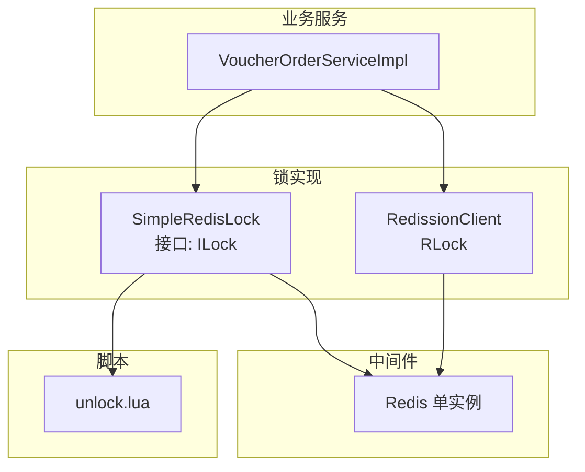
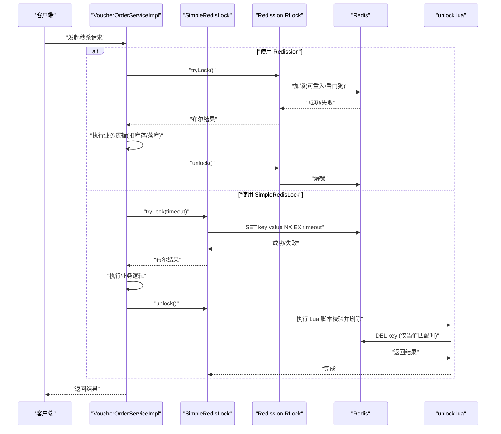
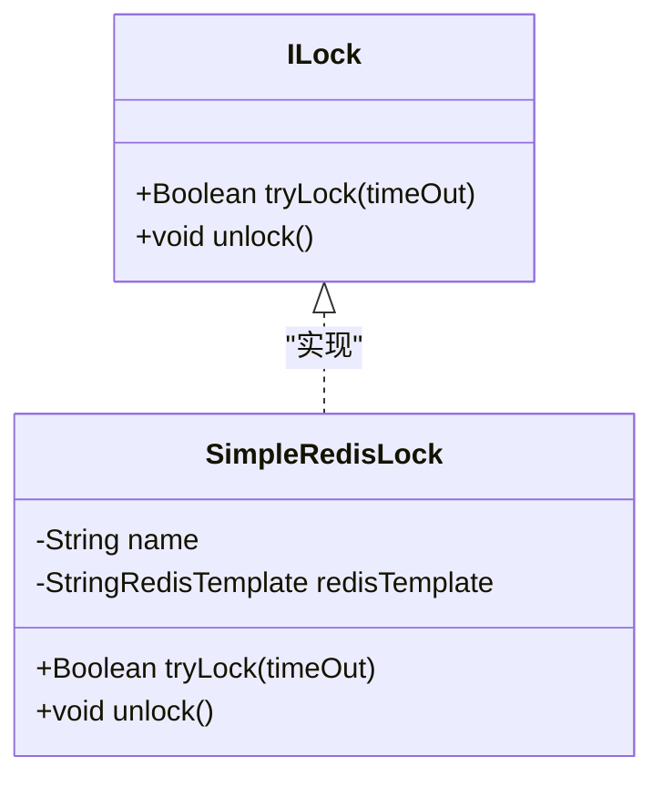
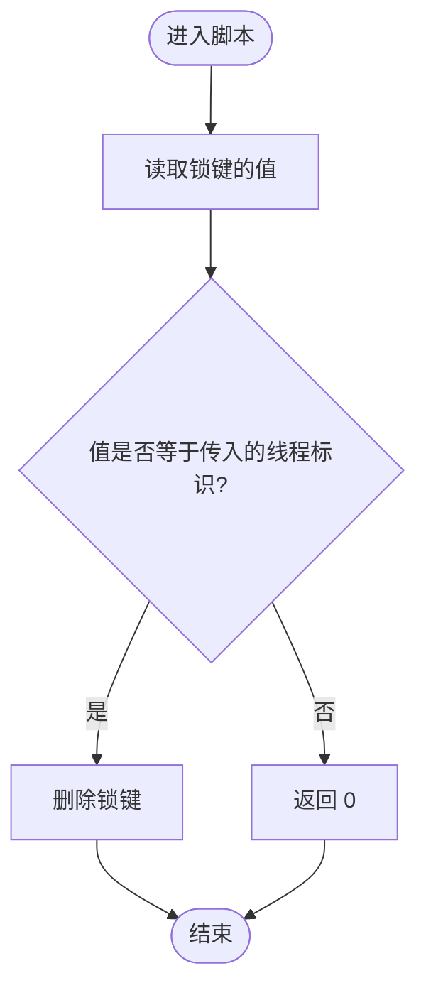
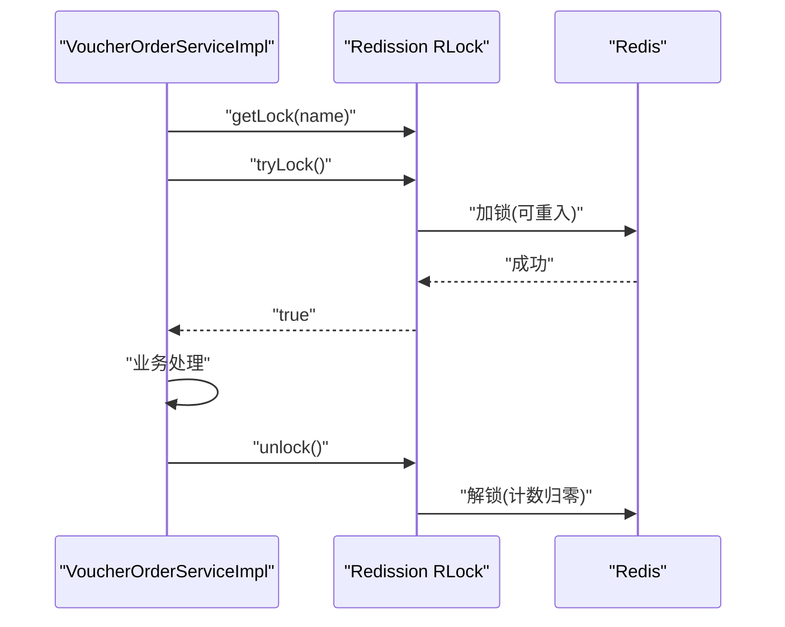
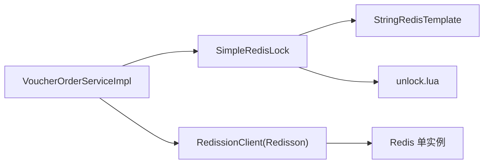

# 分布式锁实现

<cite>
**本文引用的文件**   
- [SimpleRedisLock.java](file://src/main/java/com/hmdp/utils/SimpleRedisLock.java)
- [ILock.java](file://src/main/java/com/hmdp/utils/ILock.java)
- [unlock.lua](file://src/main/resources/unlock.lua)
- [VoucherOrderServiceImpl.java](file://src/main/java/com/hmdp/service/impl/VoucherOrderServiceImpl.java)
- [RedissonConfig.java](file://src/main/java/com/hmdp/config/RedissonConfig.java)
- [RedisConstants.java](file://src/main/java/com/hmdp/utils/RedisConstants.java)
- [HmDianPingApplicationTests.java](file://src/test/java/com/hmdp/HmDianPingApplicationTests.java)
</cite>

## 目录
1. [简介](#简介)
2. [项目结构](#项目结构)
3. [核心组件](#核心组件)
4. [架构总览](#架构总览)
5. [详细组件分析](#详细组件分析)
6. [依赖关系分析](#依赖关系分析)
7. [性能与可用性考量](#性能与可用性考量)
8. [故障排查指南](#故障排查指南)
9. [结论](#结论)
10. [附录：使用示例与最佳实践](#附录使用示例与最佳实践)

## 简介
本文件围绕 my-hbdp 项目的分布式锁实现进行系统化文档化，重点覆盖以下方面：
- 基于 Redis 的分布式锁原理与 SimpleRedisLock 的具体实现
- RedLock 算法在本项目中的现状与建议
- 锁粒度控制与死锁预防机制
- Lua 脚本在原子操作中的作用
- 锁的获取、释放流程与看门狗机制（含 Redission 自动续期）
- 配置项、超时设置与异常处理策略
- 具体使用示例与最佳实践

## 项目结构
本项目将分布式锁能力分为两类：
- 自研轻量锁：SimpleRedisLock，基于 Redis SETNX + TTL + Lua 原子释放
- 生产级锁：Redission RLock，具备可重入、看门狗自动续期等特性

图表来源
- [VoucherOrderServiceImpl.java:46-75](file://src/main/java/com/hmdp/service/impl/VoucherOrderServiceImpl.java#L46-L75)
- [SimpleRedisLock.java:11-44](file://src/main/java/com/hmdp/utils/SimpleRedisLock.java#L11-L44)
- [unlock.lua:1-5](file://src/main/resources/unlock.lua#L1-L5)
- [RedissonConfig.java:10-17](file://src/main/java/com/hmdp/config/RedissonConfig.java#L10-L17)

章节来源
- [VoucherOrderServiceImpl.java:46-75](file://src/main/java/com/hmdp/service/impl/VoucherOrderServiceImpl.java#L46-L75)
- [SimpleRedisLock.java:11-44](file://src/main/java/com/hmdp/utils/SimpleRedisLock.java#L11-L44)
- [unlock.lua:1-5](file://src/main/resources/unlock.lua#L1-L5)
- [RedissonConfig.java:10-17](file://src/main/java/com/hmdp/config/RedissonConfig.java#L10-L17)

## 核心组件
- 接口定义：ILock，提供 tryLock(timeOut) 与 unlock() 两个方法
- 轻量实现：SimpleRedisLock，基于 StringRedisTemplate 的 setIfAbsent + TTL 与 Lua 原子删除
- 生产实现：Redission RLock，通过 RedissonClient 获取，支持可重入与看门狗自动续期
- 常量与键空间：RedisConstants 中定义了部分锁相关键前缀与默认 TTL（如 LOCK_SHOP_KEY 与 LOCK_SHOP_TTL）

章节来源
- [ILock.java:1-7](file://src/main/java/com/hmdp/utils/ILock.java#L1-L7)
- [SimpleRedisLock.java:11-44](file://src/main/java/com/hmdp/utils/SimpleRedisLock.java#L11-L44)
- [RedisConstants.java:16-17](file://src/main/java/com/hmdp/utils/RedisConstants.java#L16-L17)

## 架构总览
下图展示了两种锁在秒杀下单场景中的调用路径与数据流向。

图表来源
- [VoucherOrderServiceImpl.java:46-75](file://src/main/java/com/hmdp/service/impl/VoucherOrderServiceImpl.java#L46-L75)
- [SimpleRedisLock.java:31-44](file://src/main/java/com/hmdp/utils/SimpleRedisLock.java#L31-L44)
- [unlock.lua:1-5](file://src/main/resources/unlock.lua#L1-L5)
- [RedissonConfig.java:10-17](file://src/main/java/com/hmdp/config/RedissonConfig.java#L10-L17)

## 详细组件分析

### 组件一：ILock 接口
- 职责：抽象分布式锁的基本能力
- 方法：
  - tryLock(Long timeOut)：尝试获取锁，timeOut 为锁过期时间（秒）
  - unlock()：释放锁

章节来源
- [ILock.java:1-7](file://src/main/java/com/hmdp/utils/ILock.java#L1-L7)

### 组件二：SimpleRedisLock 实现
- 设计要点
  - 锁键命名：以固定前缀 + name 构成唯一键
  - 线程标识：采用“随机前缀 + 当前线程ID”作为锁值，避免误删
  - 加锁：使用 SET IF NOT EXISTS + EX 原子操作，确保带超时的互斥
  - 解锁：通过 Lua 脚本原子判断并删除，防止跨进程/线程误删
- 关键流程
  - 加锁：setIfAbsent(key, threadId, timeout, SECONDS)
  - 解锁：execute(LuaScript, keys=[key], args=[threadId])
- 复杂度
  - 时间复杂度：O(1)
  - 空间复杂度：O(1)
- 错误处理
  - 非所有者无法解锁（Lua 条件不满足则不删除）
  - 锁过期后若被其他线程持有，原线程解锁不会误删
- 局限
  - 不支持可重入
  - 无自动续期（看门狗），需业务侧合理设置超时

图表来源
- [ILock.java:1-7](file://src/main/java/com/hmdp/utils/ILock.java#L1-L7)
- [SimpleRedisLock.java:11-44](file://src/main/java/com/hmdp/utils/SimpleRedisLock.java#L11-L44)

章节来源
- [SimpleRedisLock.java:11-44](file://src/main/java/com/hmdp/utils/SimpleRedisLock.java#L11-L44)

### 组件三：unlock.lua 脚本
- 功能：原子性读取锁值并与传入的线程标识比较，相等则删除键，否则返回 0
- 作用：保证“判断+删除”的原子性，避免并发下误删他人持有的锁

图表来源
- [unlock.lua:1-5](file://src/main/resources/unlock.lua#L1-L5)

章节来源
- [unlock.lua:1-5](file://src/main/resources/unlock.lua#L1-L5)

### 组件四：Redission 集成与看门狗
- 配置：RedissonConfig 创建 RedissonClient，指向本地 Redis 单实例
- 使用：VoucherOrderServiceImpl 中使用 RLock 对“用户维度”的订单进行互斥
- 看门狗：Redission 默认开启看门狗，自动续期，无需手动维护 TTL
- 可重入：同一线程多次获取同一把锁不会阻塞

图表来源
- [VoucherOrderServiceImpl.java:62-74](file://src/main/java/com/hmdp/service/impl/VoucherOrderServiceImpl.java#L62-L74)
- [RedissonConfig.java:10-17](file://src/main/java/com/hmdp/config/RedissonConfig.java#L10-L17)

章节来源
- [VoucherOrderServiceImpl.java:62-74](file://src/main/java/com/hmdp/service/impl/VoucherOrderServiceImpl.java#L62-L74)
- [RedissonConfig.java:10-17](file://src/main/java/com/hmdp/config/RedissonConfig.java#L10-L17)

### 组件五：锁粒度与键空间管理
- 键空间约定
  - SimpleRedisLock：统一前缀 lock: + name
  - 业务常量：RedisConstants 中定义了 shop 维度的锁键前缀与默认 TTL
- 粒度建议
  - 资源级：如店铺、优惠券、商品
  - 用户级：如用户下单、用户余额更新
  - 热点键级：如库存、计数器
- 冲突规避
  - 不同业务域使用不同前缀，避免键冲突
  - 结合业务主键细化到记录级，降低锁竞争

章节来源
- [SimpleRedisLock.java:22-23](file://src/main/java/com/hmdp/utils/SimpleRedisLock.java#L22-L23)
- [RedisConstants.java:16-17](file://src/main/java/com/hmdp/utils/RedisConstants.java#L16-L17)

## 依赖关系分析
- SimpleRedisLock 依赖
  - StringRedisTemplate：用于 SETNX + EX 与 Lua 执行
  - unlock.lua：原子解锁脚本
- VoucherOrderServiceImpl 依赖
  - SimpleRedisLock（注释示例）
  - RedissionClient：生产级锁
- RedissonConfig 负责 RedissonClient 的装配

图表来源
- [VoucherOrderServiceImpl.java:46-75](file://src/main/java/com/hmdp/service/impl/VoucherOrderServiceImpl.java#L46-L75)
- [SimpleRedisLock.java:11-44](file://src/main/java/com/hmdp/utils/SimpleRedisLock.java#L11-L44)
- [unlock.lua:1-5](file://src/main/resources/unlock.lua#L1-L5)
- [RedissonConfig.java:10-17](file://src/main/java/com/hmdp/config/RedissonConfig.java#L10-L17)

章节来源
- [VoucherOrderServiceImpl.java:46-75](file://src/main/java/com/hmdp/service/impl/VoucherOrderServiceImpl.java#L46-L75)
- [SimpleRedisLock.java:11-44](file://src/main/java/com/hmdp/utils/SimpleRedisLock.java#L11-L44)
- [RedissonConfig.java:10-17](file://src/main/java/com/hmdp/config/RedissonConfig.java#L10-L17)

## 性能与可用性考量
- 原子性与网络往返
  - SimpleRedisLock 加锁一次 RTT；解锁一次 RTT（Lua 内完成判断+删除）
  - Redission 默认看门狗会周期性续期，增加少量心跳开销
- 锁粒度与竞争
  - 越细粒度竞争越小，但需要更复杂的键设计与一致性保障
- 超时与重试
  - 合理设置锁超时，避免长事务导致锁长期占用
  - 对于幂等业务，可在获取锁失败时快速失败或退避重试
- 高可用
  - 单实例 Redis 存在单点风险；生产建议使用集群或哨兵模式
  - Redission 支持多节点 RedLock 变体，但需谨慎评估 CAP 权衡

[本节为通用指导，不直接分析具体文件]

## 故障排查指南
- 常见问题
  - 锁未释放：检查是否在 finally 分支释放；确认业务异常路径是否提前返回
  - 误删他人锁：确认线程标识唯一且 Lua 校验生效
  - 锁过期过早：缩短业务耗时或改用 Redission 看门狗
  - 重复下单：确认锁粒度是否覆盖“用户+券”维度
- 定位手段
  - 查看 Redis 键是否存在及剩余 TTL
  - 打印线程标识与锁键，核对是否一致
  - 使用单元测试复现并发场景

章节来源
- [HmDianPingApplicationTests.java:84-160](file://src/test/java/com/hmdp/HmDianPingApplicationTests.java#L84-L160)

## 结论
- SimpleRedisLock 适合轻量、短临界区的互斥场景，具备原子加锁与原子解锁能力
- Redission RLock 更适合生产环境，具备可重入与看门狗自动续期，简化运维
- 合理的锁粒度与键空间设计是避免锁风暴与死锁的关键
- Lua 脚本在保证“判断+删除”原子性方面至关重要

[本节为总结性内容，不直接分析具体文件]

## 附录：使用示例与最佳实践

### 使用示例
- 使用 SimpleRedisLock
  - 构造锁对象：new SimpleRedisLock("order:" + userId, stringRedisTemplate)
  - 加锁：boolean ok = lock.tryLock(超时秒数)
  - 释放：finally 中 lock.unlock()
- 使用 Redission RLock
  - 获取锁：RLock lock = redissonClient.getLock("lock:order:" + userId)
  - 加锁：boolean ok = lock.tryLock()
  - 释放：finally 中 lock.unlock()

章节来源
- [HmDianPingApplicationTests.java:84-121](file://src/test/java/com/hmdp/HmDianPingApplicationTests.java#L84-L121)
- [VoucherOrderServiceImpl.java:62-74](file://src/main/java/com/hmdp/service/impl/VoucherOrderServiceImpl.java#L62-L74)

### 最佳实践
- 锁粒度
  - 优先按“用户+资源”组合键，避免全局粗粒度锁
- 超时设置
  - 根据业务最长执行时间设置锁超时，预留余量
  - 长事务优先使用 Redission 看门狗
- 幂等与补偿
  - 加锁失败快速失败或指数退避重试
  - 业务幂等设计，避免重复提交
- 监控与告警
  - 统计加锁成功率、平均等待时长、锁持有时间分布
  - 对长时间持有锁的键进行告警
- 高可用
  - Redis 使用哨兵或集群
  - 应用侧多副本部署时，注意锁键的唯一性与隔离

[本节为通用指导，不直接分析具体文件]