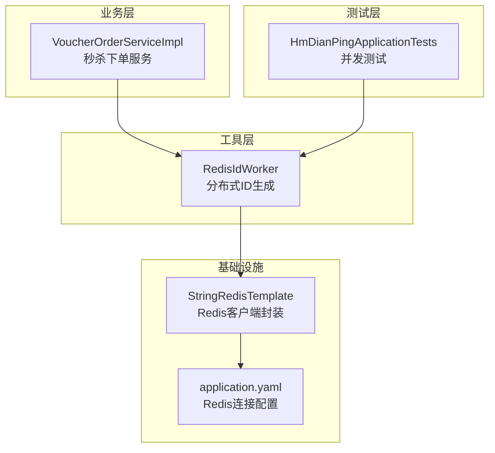
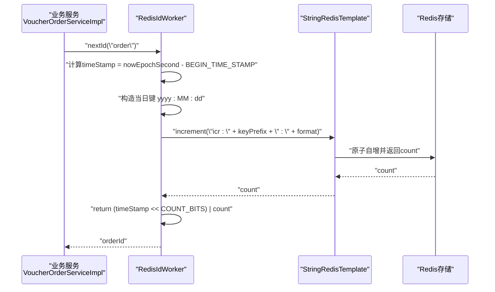
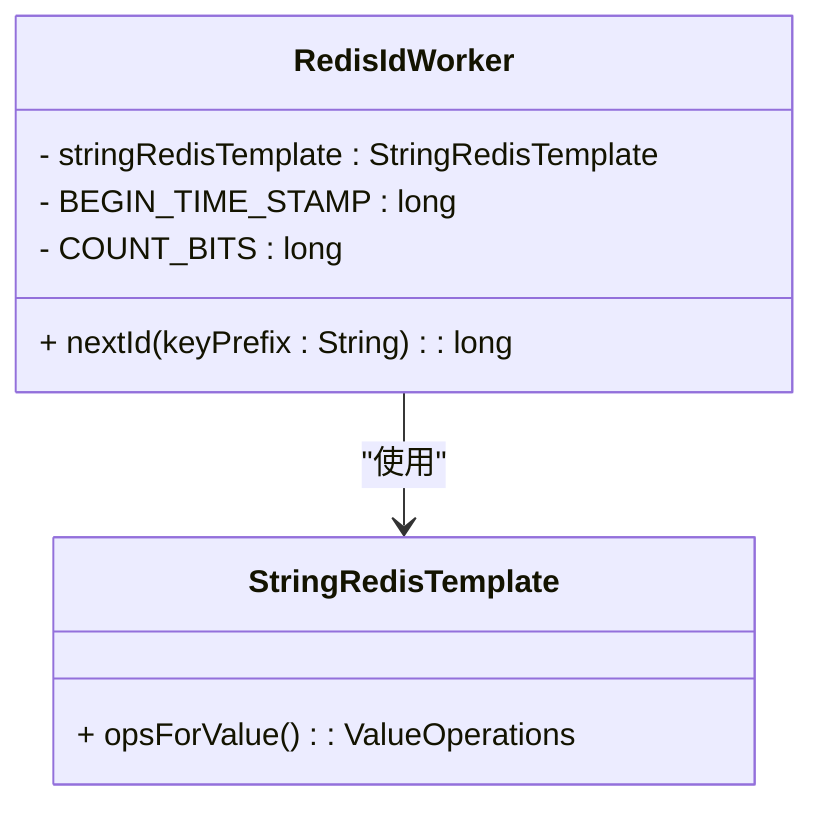
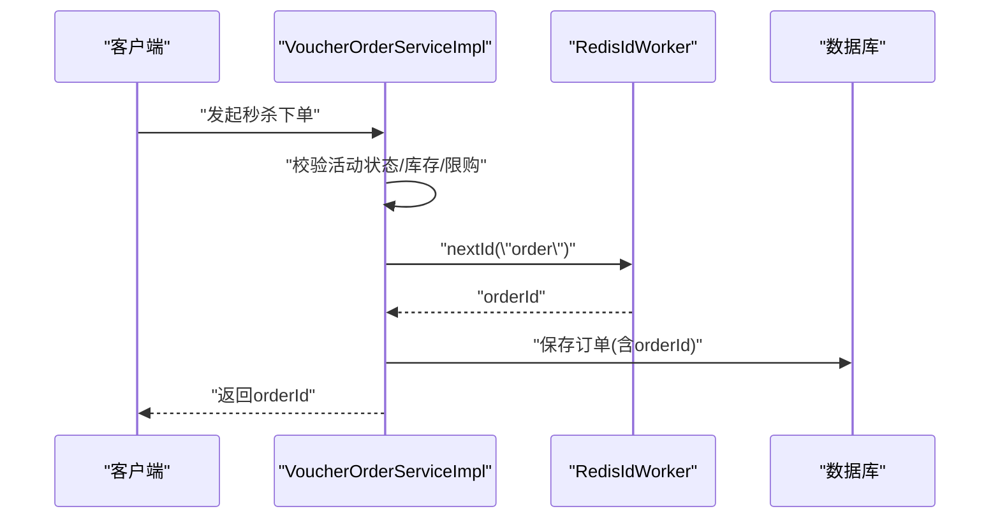
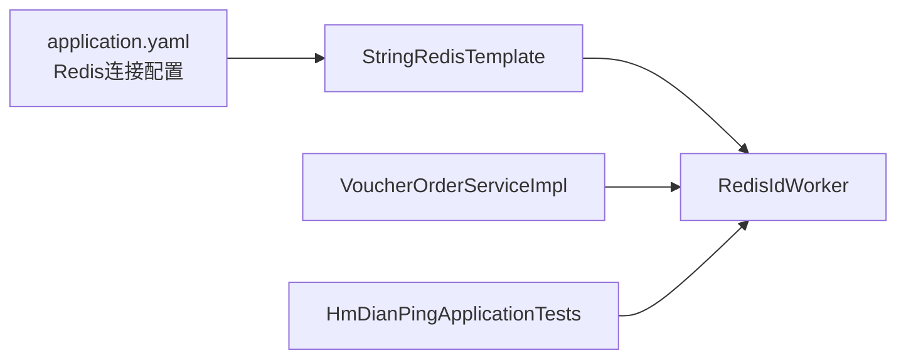

# RedisID生成器

<cite>
**本文引用的文件**   
- [RedisIdWorker.java](file://src/main/java/com/hmdp/utils/RedisIdWorker.java)
- [VoucherOrderServiceImpl.java](file://src/main/java/com/hmdp/service/impl/VoucherOrderServiceImpl.java)
- [HmDianPingApplicationTests.java](file://src/test/java/com/hmdp/HmDianPingApplicationTests.java)
- [application.yaml](file://src/main/resources/application.yaml)
</cite>

## 目录
1. [简介](#简介)
2. [项目结构](#项目结构)
3. [核心组件](#核心组件)
4. [架构总览](#架构总览)
5. [详细组件分析](#详细组件分析)
6. [依赖关系分析](#依赖关系分析)
7. [性能与并发特性](#性能与并发特性)
8. [故障排查指南](#故障排查指南)
9. [结论](#结论)
10. [附录：使用示例与最佳实践](#附录使用示例与最佳实践)

## 简介
本文件围绕分布式ID生成工具类“RedisID生成器”进行系统化文档说明，重点解释其实现原理、时间戳位与序列号位的分配策略、基准时间戳与位数配置的原因、nextId方法的参数keyPrefix作用与返回值格式、线程安全保证与高并发场景下的性能表现，并提供ID解析方法与最佳实践建议。

## 项目结构
该工具位于utils包中，作为Spring组件对外提供ID生成能力；在业务服务层（如订单服务）中被注入使用；测试用例中包含多线程并发调用验证。

图表来源
- [RedisIdWorker.java:1-39](file://src/main/java/com/hmdp/utils/RedisIdWorker.java#L1-L39)
- [VoucherOrderServiceImpl.java:1-105](file://src/main/java/com/hmdp/service/impl/VoucherOrderServiceImpl.java#L1-L105)
- [HmDianPingApplicationTests.java:1-162](file://src/test/java/com/hmdp/HmDianPingApplicationTests.java#L1-L162)
- [application.yaml:1-28](file://src/main/resources/application.yaml#L1-L28)

章节来源
- [RedisIdWorker.java:1-39](file://src/main/java/com/hmdp/utils/RedisIdWorker.java#L1-L39)
- [VoucherOrderServiceImpl.java:1-105](file://src/main/java/com/hmdp/service/impl/VoucherOrderServiceImpl.java#L1-L105)
- [HmDianPingApplicationTests.java:1-162](file://src/test/java/com/hmdp/HmDianPingApplicationTests.java#L1-L162)
- [application.yaml:1-28](file://src/main/resources/application.yaml#L1-L28)

## 核心组件
- RedisIdWorker：基于Redis原子自增的分布式ID生成器，采用“时间戳+序列号”拼接方式，按天重置序列号，确保全局唯一且有序。
- 关键常量
  - BEGIN_TIME_STAMP：基准时间戳，用于将当前UTC秒数转换为相对偏移，避免高位占用过大。
  - COUNT_BITS：序列号占用的位数，决定单日内最大可生成的ID数量。
- nextId(keyPrefix)：根据业务前缀和当天日期生成唯一ID，返回值为long类型。

章节来源
- [RedisIdWorker.java:19-31](file://src/main/java/com/hmdp/utils/RedisIdWorker.java#L19-L31)

## 架构总览
下图展示了从业务侧调用到Redis原子自增再到最终ID组装的完整流程。

图表来源
- [RedisIdWorker.java:21-31](file://src/main/java/com/hmdp/utils/RedisIdWorker.java#L21-L31)
- [VoucherOrderServiceImpl.java:93-100](file://src/main/java/com/hmdp/service/impl/VoucherOrderServiceImpl.java#L93-L100)

## 详细组件分析

### 组件：RedisIdWorker
- 职责
  - 获取当前UTC秒数并减去基准时间戳得到timeStamp。
  - 以“yyyy:MM:dd”为维度，对“icr:{keyPrefix}:{format}”执行原子自增，得到当日序号count。
  - 将timeStamp左移COUNT_BITS位后与count按位或，形成最终ID。
- 关键设计点
  - 时间戳位：使用UTC秒级时间戳相对偏移，减少高位占用，提升ID整体有序性。
  - 序列号位：COUNT_BITS=32，理论上单日最多支持约42亿次自增，满足绝大多数业务需求。
  - 分片键：通过keyPrefix区分不同业务域（如“order”），结合日期维度，天然具备日切重置能力。
- 线程安全
  - 依赖Redis的INCR原子操作，跨进程/节点均安全。
- 返回值格式
  - long类型，高32位为timeStamp，低32位为当日自增序号。

图表来源
- [RedisIdWorker.java:10-31](file://src/main/java/com/hmdp/utils/RedisIdWorker.java#L10-L31)

章节来源
- [RedisIdWorker.java:19-31](file://src/main/java/com/hmdp/utils/RedisIdWorker.java#L19-L31)

### 组件：VoucherOrderServiceImpl（使用示例）
- 在创建订单时调用nextId("order")生成订单ID，随后持久化入库。
- 该用法体现了“业务前缀”的使用方式：不同业务模块传入不同的keyPrefix即可隔离各自的序列空间。

图表来源
- [VoucherOrderServiceImpl.java:77-103](file://src/main/java/com/hmdp/service/impl/VoucherOrderServiceImpl.java#L77-L103)
- [RedisIdWorker.java:21-31](file://src/main/java/com/hmdp/utils/RedisIdWorker.java#L21-L31)

章节来源
- [VoucherOrderServiceImpl.java:93-100](file://src/main/java/com/hmdp/service/impl/VoucherOrderServiceImpl.java#L93-L100)

### 组件：HmDianPingApplicationTests（并发验证）
- 使用固定大小线程池并发调用nextId("order")，验证在高并发下ID的唯一性与可用性。
- 该测试可作为压测参考，观察Redis INCR的性能与稳定性。

章节来源
- [HmDianPingApplicationTests.java:52-69](file://src/test/java/com/hmdp/HmDianPingApplicationTests.java#L52-L69)

## 依赖关系分析
- RedisIdWorker依赖StringRedisTemplate访问Redis，完成原子自增。
- application.yaml提供Redis连接信息（host、port、密码等）。
- 业务服务通过Spring注入使用RedisIdWorker。

图表来源
- [application.yaml:11-21](file://src/main/resources/application.yaml#L11-L21)
- [RedisIdWorker.java:10-17](file://src/main/java/com/hmdp/utils/RedisIdWorker.java#L10-L17)
- [VoucherOrderServiceImpl.java:37-38](file://src/main/java/com/hmdp/service/impl/VoucherOrderServiceImpl.java#L37-L38)
- [HmDianPingApplicationTests.java:41-42](file://src/test/java/com/hmdp/HmDianPingApplicationTests.java#L41-L42)

章节来源
- [application.yaml:11-21](file://src/main/resources/application.yaml#L11-L21)
- [RedisIdWorker.java:10-17](file://src/main/java/com/hmdp/utils/RedisIdWorker.java#L10-L17)
- [VoucherOrderServiceImpl.java:37-38](file://src/main/java/com/hmdp/service/impl/VoucherOrderServiceImpl.java#L37-L38)
- [HmDianPingApplicationTests.java:41-42](file://src/test/java/com/hmdp/HmDianPingApplicationTests.java#L41-L42)

## 性能与并发特性
- 原子性与一致性
  - 通过Redis INCR保证同一key的自增是原子的，跨JVM实例也安全。
- 吞吐与延迟
  - 单次nextId包含一次网络往返（INCR），延迟主要取决于Redis响应时间与网络开销。
  - 32位序列号位理论上限约42亿/天，足以支撑高QPS场景。
- 时间窗口与溢出
  - 若系统运行超过2^32秒（约136年），timeStamp会溢出；COUNT_BITS=32意味着单日自增不会溢出。
- 时钟回拨
  - 使用UTC秒级时间戳，若发生时钟回拨，可能导致timeStamp变小，从而产生重复ID风险。建议在部署环境启用NTP并确保时钟同步。
- 水平扩展
  - 多实例共享同一Redis命名空间，天然支持横向扩展。

[本节为通用性能讨论，不直接分析具体代码文件]

## 故障排查指南
- 现象：生成的ID出现重复
  - 可能原因：Redis INCR未生效（连接异常）、时钟回拨导致timeStamp减小。
  - 排查要点：检查Redis连通性与时钟同步；确认是否跨实例使用了相同keyPrefix且同一天内超量。
- 现象：ID增长缓慢或超时
  - 可能原因：Redis负载过高、网络抖动、连接池配置不当。
  - 排查要点：查看Redis监控指标、调整连接池参数（见application.yaml中的pool配置）。
- 现象：业务侧无法获取ID
  - 可能原因：StringRedisTemplate未正确注入或Redis配置错误。
  - 排查要点：核对application.yaml中redis.host/port/password是否正确。

章节来源
- [application.yaml:11-21](file://src/main/resources/application.yaml#L11-L21)
- [RedisIdWorker.java:21-31](file://src/main/java/com/hmdp/utils/RedisIdWorker.java#L21-L31)

## 结论
RedisIdWorker以“时间戳+序列号”的方式实现了简单高效的分布式ID生成方案。通过按天重置序列号，既保证了全局唯一性，又具备良好的单调递增特性。配合合理的COUNT_BITS与基准时间戳设置，可在高并发场景下稳定输出ID。生产环境中需关注时钟同步与Redis健康度，必要时可增加ID解析方法以辅助运维与排障。

[本节为总结性内容，不直接分析具体代码文件]

## 附录：使用示例与最佳实践

### 使用示例
- 订单模块
  - 在创建订单处调用nextId("order")，并将返回的long作为订单主键。
  - 参考路径：[VoucherOrderServiceImpl.java:93-100](file://src/main/java/com/hmdp/service/impl/VoucherOrderServiceImpl.java#L93-L100)
- 并发测试
  - 使用多线程循环调用nextId("order")，验证唯一性与可用性。
  - 参考路径：[HmDianPingApplicationTests.java:52-69](file://src/test/java/com/hmdp/HmDianPingApplicationTests.java#L52-L69)

### ID解析方法（建议）
- 目标
  - 从生成的long中提取timeStamp与count，便于日志记录、审计与问题定位。
- 思路
  - 提取timeStamp：将ID右移COUNT_BITS位。
  - 提取count：将ID与(1<<COUNT_BITS)-1进行按位与。
  - 将timeStamp加上BEGIN_TIME_STAMP还原为UTC秒数，再转换为可读时间。
- 注意
  - 该方法为建议实现，仓库中未提供现成解析函数，可按上述思路自行封装。

### 最佳实践
- 合理选择keyPrefix
  - 不同业务域使用不同前缀（如“order”、“user”、“blog”），避免相互干扰。
- 控制COUNT_BITS
  - 32位可满足绝大多数场景；若业务确需更高并发，可评估增大COUNT_BITS并相应缩减timeStamp位。
- 基准时间戳设置
  - BEGIN_TIME_STAMP应设置为一个较早但合理的UTC秒数，使timeStamp尽量小，降低高位占用。
- 时钟同步
  - 确保服务器使用UTC时间并保持NTP同步，防止时钟回拨引发重复ID。
- 监控与告警
  - 监控Redis INCR耗时与错误率；当接近单日容量上限时触发扩容或切换策略。

[本节为通用指导与建议，不直接分析具体代码文件]