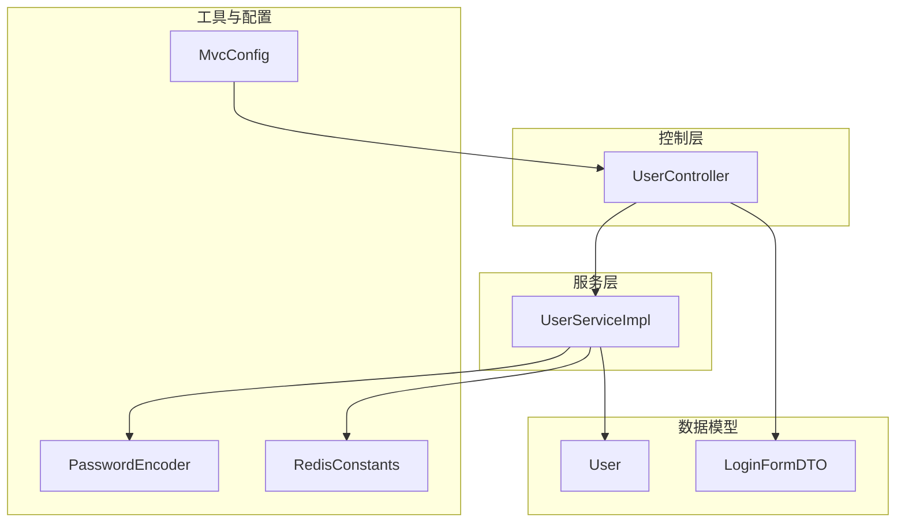
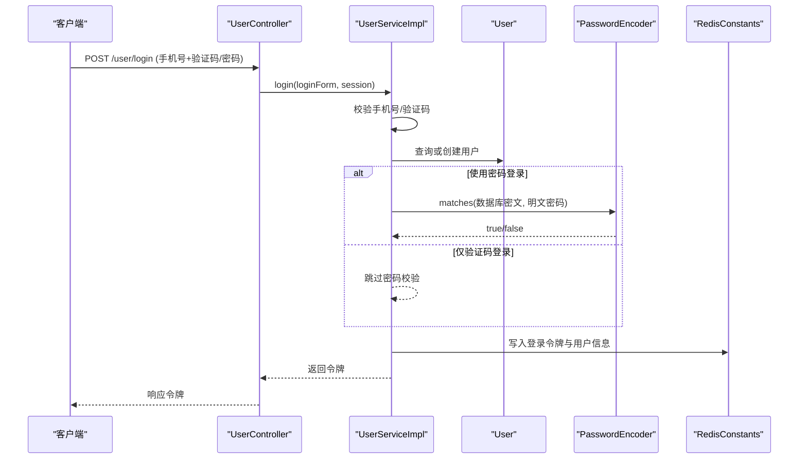
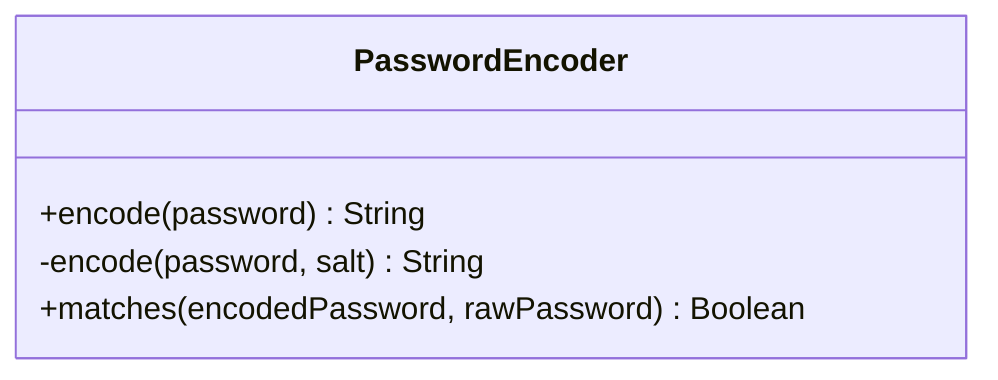
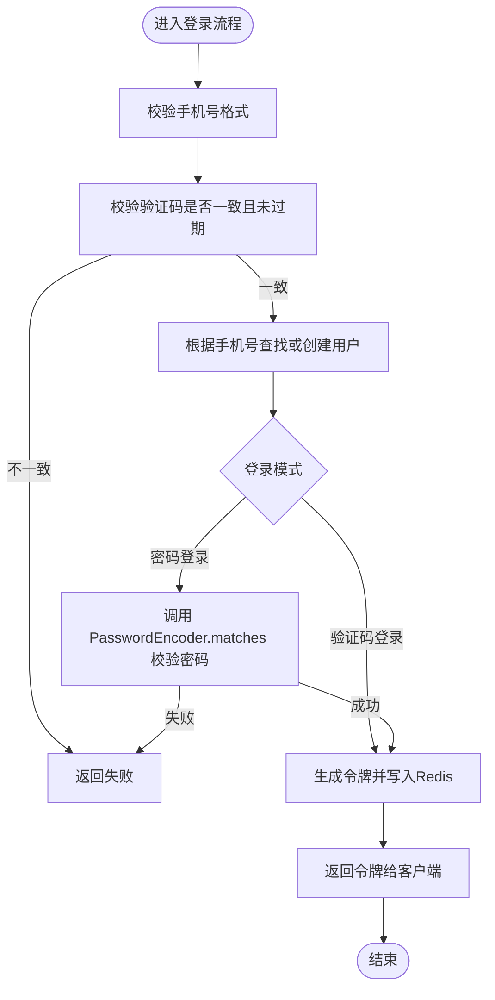
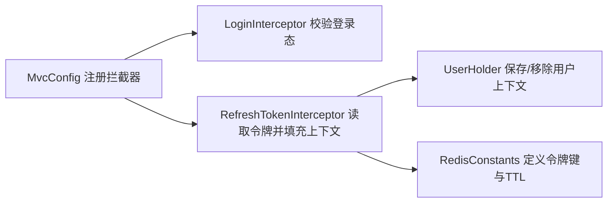
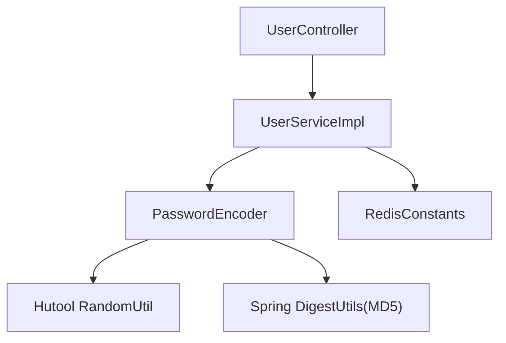

# 密码加密器

<cite>
**本文引用的文件**   
- [PasswordEncoder.java](file://src/main/java/com/hmdp/utils/PasswordEncoder.java)
- [User.java](file://src/main/java/com/hmdp/entity/User.java)
- [LoginFormDTO.java](file://src/main/java/com/hmdp/dto/LoginFormDTO.java)
- [UserController.java](file://src/main/java/com/hmdp/controller/UserController.java)
- [UserServiceImpl.java](file://src/main/java/com/hmdp/service/impl/UserServiceImpl.java)
- [MvcConfig.java](file://src/main/java/com/hmdp/config/MvcConfig.java)
- [RedisConstants.java](file://src/main/java/com/hmdp/utils/RedisConstants.java)
</cite>

## 目录
1. [简介](#简介)
2. [项目结构](#项目结构)
3. [核心组件](#核心组件)
4. [架构总览](#架构总览)
5. [详细组件分析](#详细组件分析)
6. [依赖关系分析](#依赖关系分析)
7. [性能与安全考量](#性能与安全考量)
8. [故障排查指南](#故障排查指南)
9. [结论](#结论)
10. [附录](#附录)

## 简介
本文件围绕“密码加密器工具类”进行系统化文档化，重点覆盖以下方面：
- 算法选择与安全评估：当前实现采用 MD5 加盐方案，存在已知安全风险，建议迁移至现代抗碰撞、抗彩虹表的算法（如 BCrypt、SCrypt、Argon2）。
- 使用方式与接口说明：提供 encode/matches 的调用约定、参数校验与异常处理策略。
- 盐值生成与强度配置：记录随机盐长度、编码字符集及可扩展性建议。
- 注册与登录集成示例：结合用户实体与登录流程，给出端到端的使用路径。
- 与其他认证组件的集成：与拦截器、Redis 会话管理、统一返回体的协作方式。
- 安全最佳实践与防护方案：输入校验、常量时间比较、速率限制、审计日志等。

## 项目结构
本项目为 Spring Boot 应用，包含控制器、服务、实体、工具类等模块。密码加密相关代码集中在 utils 包中，并在用户领域模型与登录流程中体现其使用位置。

图表来源
- [UserController.java:1-86](file://src/main/java/com/hmdp/controller/UserController.java#L1-L86)
- [UserServiceImpl.java:1-110](file://src/main/java/com/hmdp/service/impl/UserServiceImpl.java#L1-L110)
- [User.java:1-67](file://src/main/java/com/hmdp/entity/User.java#L1-L67)
- [LoginFormDTO.java:1-11](file://src/main/java/com/hmdp/dto/LoginFormDTO.java#L1-L11)
- [PasswordEncoder.java:1-35](file://src/main/java/com/hmdp/utils/PasswordEncoder.java#L1-L35)
- [MvcConfig.java:1-33](file://src/main/java/com/hmdp/config/MvcConfig.java#L1-L33)
- [RedisConstants.java:1-24](file://src/main/java/com/hmdp/utils/RedisConstants.java#L1-L24)

章节来源
- [UserController.java:1-86](file://src/main/java/com/hmdp/controller/UserController.java#L1-L86)
- [UserServiceImpl.java:1-110](file://src/main/java/com/hmdp/service/impl/UserServiceImpl.java#L1-L110)
- [User.java:1-67](file://src/main/java/com/hmdp/entity/User.java#L1-L67)
- [LoginFormDTO.java:1-11](file://src/main/java/com/hmdp/dto/LoginFormDTO.java#L1-L11)
- [PasswordEncoder.java:1-35](file://src/main/java/com/hmdp/utils/PasswordEncoder.java#L1-L35)
- [MvcConfig.java:1-33](file://src/main/java/com/hmdp/config/MvcConfig.java#L1-L33)
- [RedisConstants.java:1-24](file://src/main/java/com/hmdp/utils/RedisConstants.java#L1-L24)

## 核心组件
- 密码加密器 PasswordEncoder
  - 职责：提供密码加密与匹配能力；内部负责盐值生成、拼接与摘要计算。
  - 关键方法：
    - encode(String): 生成随机盐并返回“盐@摘要”格式密文。
    - matches(String, String): 从密文中解析盐，重新计算摘要并与原密文比对。
  - 依赖：
    - 随机字符串生成：RandomUtil.randomString(20)。
    - 摘要算法：MD5（通过 DigestUtils.md5DigestAsHex）。
    - 字符集：UTF-8。
  - 返回值与异常：
    - matches 在密文格式不合法时抛出运行时异常。
    - 空参直接返回 false。

章节来源
- [PasswordEncoder.java:1-35](file://src/main/java/com/hmdp/utils/PasswordEncoder.java#L1-L35)

## 架构总览
下图展示了密码加密器在用户登录流程中的参与点，以及与之相关的控制器、服务、实体和配置。

图表来源
- [UserController.java:49-53](file://src/main/java/com/hmdp/controller/UserController.java#L49-L53)
- [UserServiceImpl.java:63-100](file://src/main/java/com/hmdp/service/impl/UserServiceImpl.java#L63-L100)
- [User.java:41-43](file://src/main/java/com/hmdp/entity/User.java#L41-L43)
- [PasswordEncoder.java:21-33](file://src/main/java/com/hmdp/utils/PasswordEncoder.java#L21-L33)
- [RedisConstants.java:4-7](file://src/main/java/com/hmdp/utils/RedisConstants.java#L4-L7)

## 详细组件分析

### 密码加密器 PasswordEncoder 分析
- 设计要点
  - 静态工具类，无状态，便于在各层直接调用。
  - 密文格式约定：“盐@摘要”，便于验证阶段提取盐。
  - 盐长度固定为 20 个随机字符，字符集由底层随机源决定。
  - 摘要算法为 MD5，编码 UTF-8。
- 复杂度与性能
  - 时间复杂度：O(n)，n 为密码长度。
  - 空间复杂度：O(n)，用于构建待摘要字符串与结果。
  - MD5 计算开销低，但安全性不足，易受彩虹表与碰撞攻击。
- 错误处理
  - 空参：matches 直接返回 false。
  - 密文格式非法：抛出运行时异常，提示“密码格式不正确”。
- 可改进点
  - 将 MD5 替换为 BCrypt/SCrypt/Argon2。
  - 引入常量时间比较，避免时序侧信道。
  - 支持可配置的迭代次数/内存成本参数。
  - 对密文格式增加版本前缀，便于未来算法升级。

图表来源
- [PasswordEncoder.java:9-34](file://src/main/java/com/hmdp/utils/PasswordEncoder.java#L9-L34)

章节来源
- [PasswordEncoder.java:1-35](file://src/main/java/com/hmdp/utils/PasswordEncoder.java#L1-L35)

### 用户实体与登录表单
- User 实体包含 password 字段，注释表明“密码，加密存储”，应与 PasswordEncoder 配合使用。
- LoginFormDTO 同时支持 phone/code/password 字段，可用于验证码登录或密码登录两种模式。

章节来源
- [User.java:41-43](file://src/main/java/com/hmdp/entity/User.java#L41-L43)
- [LoginFormDTO.java:6-10](file://src/main/java/com/hmdp/dto/LoginFormDTO.java#L6-L10)

### 控制器与服务层集成
- UserController 暴露 /user/login 接口，委托 UserServiceImpl 完成业务逻辑。
- UserServiceImpl 当前主要实现基于手机验证码的登录流程，未直接使用 PasswordEncoder。若需支持密码登录，可在该处集成 matches 校验。

图表来源
- [UserController.java:49-53](file://src/main/java/com/hmdp/controller/UserController.java#L49-L53)
- [UserServiceImpl.java:63-100](file://src/main/java/com/hmdp/service/impl/UserServiceImpl.java#L63-L100)
- [PasswordEncoder.java:21-33](file://src/main/java/com/hmdp/utils/PasswordEncoder.java#L21-L33)

章节来源
- [UserController.java:49-53](file://src/main/java/com/hmdp/controller/UserController.java#L49-L53)
- [UserServiceImpl.java:63-100](file://src/main/java/com/hmdp/service/impl/UserServiceImpl.java#L63-L100)

### 与认证组件的集成
- MVC 拦截器
  - MvcConfig 注册了登录检查与刷新令牌两个拦截器，排除公开接口（包括 /user/login），保证登录入口无需鉴权。
- Redis 会话
  - RedisConstants 定义了登录令牌键前缀与过期时间，服务层在登录成功后将用户信息以 Hash 形式存入 Redis，并以令牌作为 key。
- 线程上下文
  - 后续请求可通过拦截器将用户信息放入 ThreadLocal，供业务层获取当前用户。

图表来源
- [MvcConfig.java:20-32](file://src/main/java/com/hmdp/config/MvcConfig.java#L20-L32)
- [RedisConstants.java:4-7](file://src/main/java/com/hmdp/utils/RedisConstants.java#L4-L7)

章节来源
- [MvcConfig.java:1-33](file://src/main/java/com/hmdp/config/MvcConfig.java#L1-L33)
- [RedisConstants.java:1-24](file://src/main/java/com/hmdp/utils/RedisConstants.java#L1-L24)

## 依赖关系分析
- 内部依赖
  - PasswordEncoder 依赖 Hutool 的随机字符串生成与 Spring 的 MD5 摘要工具。
  - 服务层依赖 Redis 模板与常量配置。
- 外部依赖
  - Hutool、Spring Web、MyBatis-Plus、Redis。
- 耦合与内聚
  - PasswordEncoder 为纯工具类，内聚度高、耦合度低，易于替换算法实现。
  - 服务层与工具类解耦良好，便于扩展多种登录方式。

图表来源
- [PasswordEncoder.java:4-5](file://src/main/java/com/hmdp/utils/PasswordEncoder.java#L4-L5)
- [UserServiceImpl.java:1-110](file://src/main/java/com/hmdp/service/impl/UserServiceImpl.java#L1-L110)
- [RedisConstants.java:1-24](file://src/main/java/com/hmdp/utils/RedisConstants.java#L1-L24)
- [UserController.java:1-86](file://src/main/java/com/hmdp/controller/UserController.java#L1-L86)

章节来源
- [PasswordEncoder.java:1-35](file://src/main/java/com/hmdp/utils/PasswordEncoder.java#L1-L35)
- [UserServiceImpl.java:1-110](file://src/main/java/com/hmdp/service/impl/UserServiceImpl.java#L1-L110)
- [RedisConstants.java:1-24](file://src/main/java/com/hmdp/utils/RedisConstants.java#L1-L24)
- [UserController.java:1-86](file://src/main/java/com/hmdp/controller/UserController.java#L1-L86)

## 性能与安全考量
- 性能
  - MD5 计算速度快，适合高并发场景，但不具备抗暴力破解能力。
  - 建议在高安全需求场景下使用更慢的哈希算法（BCrypt/SCrypt/Argon2）并通过限流与账户锁定缓解暴力破解。
- 安全
  - 当前实现存在风险：
    - MD5 已被认为不安全，易受碰撞与彩虹表攻击。
    - 未使用常量时间比较，可能存在时序侧信道。
    - 密文格式简单，缺乏版本标识，不利于算法演进。
  - 改进建议：
    - 替换为 BCrypt/SCrypt/Argon2，并配置合适的成本因子。
    - 使用恒定时间比较函数进行密文对比。
    - 为密文增加版本前缀，例如 “v1:salt@hash”，便于平滑升级。
    - 对登录接口实施速率限制、验证码重试上限、账号锁定策略。
    - 对所有敏感输入进行严格校验与脱敏输出。
    - 记录安全审计日志（不记录明文密码），并接入告警。

[本节为通用指导，不涉及具体文件分析]

## 故障排查指南
- 常见问题
  - 密文格式错误：当数据库中密文不包含分隔符时，matches 会抛出运行时异常。应检查历史数据迁移与写入逻辑。
  - 空参导致匹配失败：matches 对空参返回 false，上层需做好判空与友好提示。
  - 登录失败：确认验证码是否正确、是否过期；若启用密码登录，确认密文是否为当前算法生成。
- 定位步骤
  - 检查 PasswordEncoder.matches 抛出的异常信息与堆栈。
  - 核对密文字段是否符合“盐@摘要”格式。
  - 查看 Redis 中登录令牌是否存在且未过期。
  - 确认拦截器是否放行登录接口。

章节来源
- [PasswordEncoder.java:21-33](file://src/main/java/com/hmdp/utils/PasswordEncoder.java#L21-L33)
- [RedisConstants.java:4-7](file://src/main/java/com/hmdp/utils/RedisConstants.java#L4-L7)
- [MvcConfig.java:20-32](file://src/main/java/com/hmdp/config/MvcConfig.java#L20-L32)

## 结论
- 当前密码加密器实现了基础的加盐 MD5 方案，满足教学与演示用途，但在生产环境不建议直接使用。
- 建议尽快迁移到现代抗暴力破解的哈希算法，并完善常量时间比较、版本兼容、速率限制与审计机制。
- 在现有架构基础上，只需在服务层集成 PasswordEncoder 即可快速支持密码登录；同时保持与拦截器、Redis 会话管理的协同。

[本节为总结性内容，不涉及具体文件分析]

## 附录

### 使用示例（概念性说明）
- 用户注册时密码加密
  - 接收用户提交的明文密码。
  - 调用 PasswordEncoder.encode 生成密文。
  - 将密文持久化到用户实体的 password 字段。
- 用户登录时密码验证
  - 接收用户提交的明文密码。
  - 根据用户名或手机号查询用户实体，获取密文。
  - 调用 PasswordEncoder.matches(密文, 明文) 进行校验。
  - 校验通过后，生成令牌并写入 Redis，返回给客户端。

[本节为概念性说明，不涉及具体文件分析]