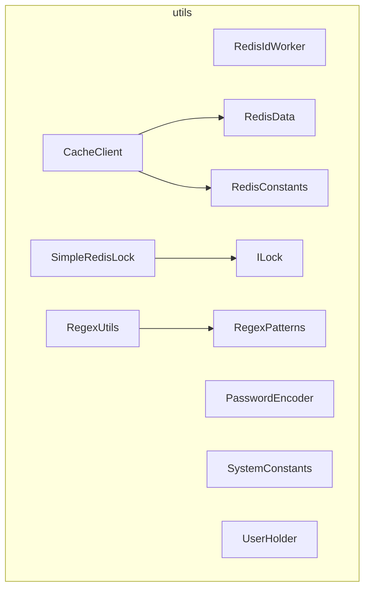
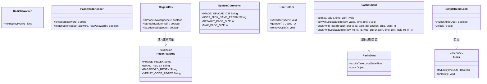
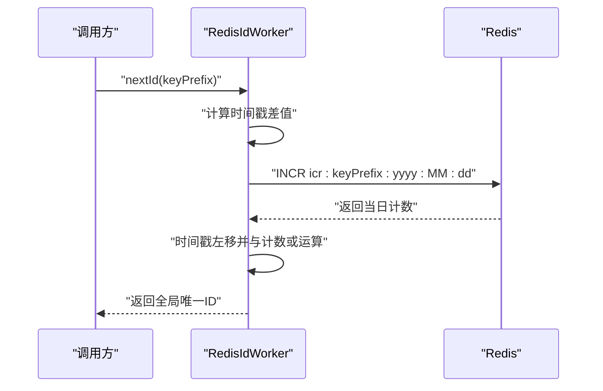
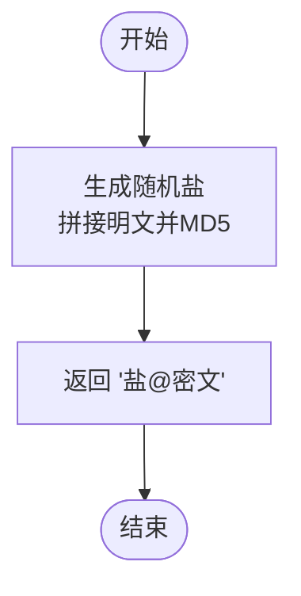
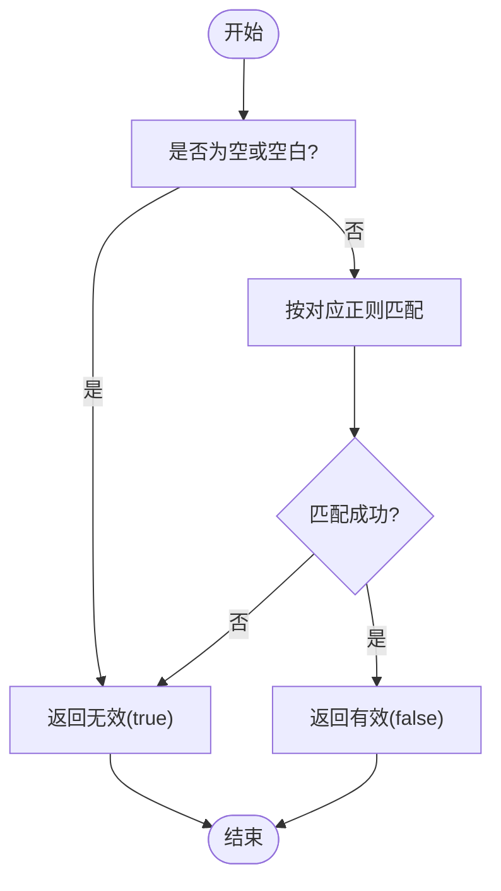
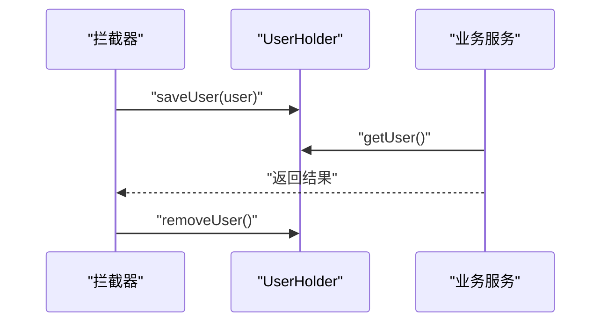
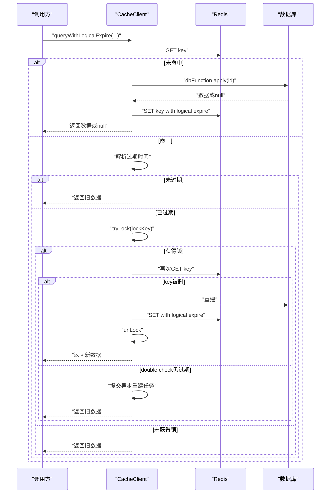
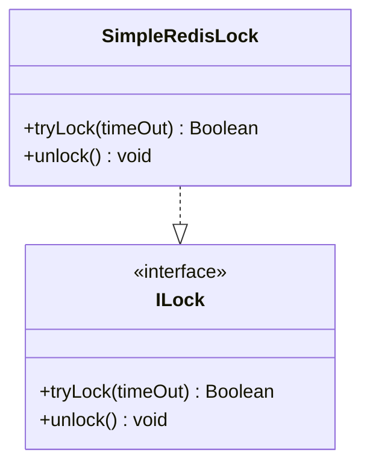
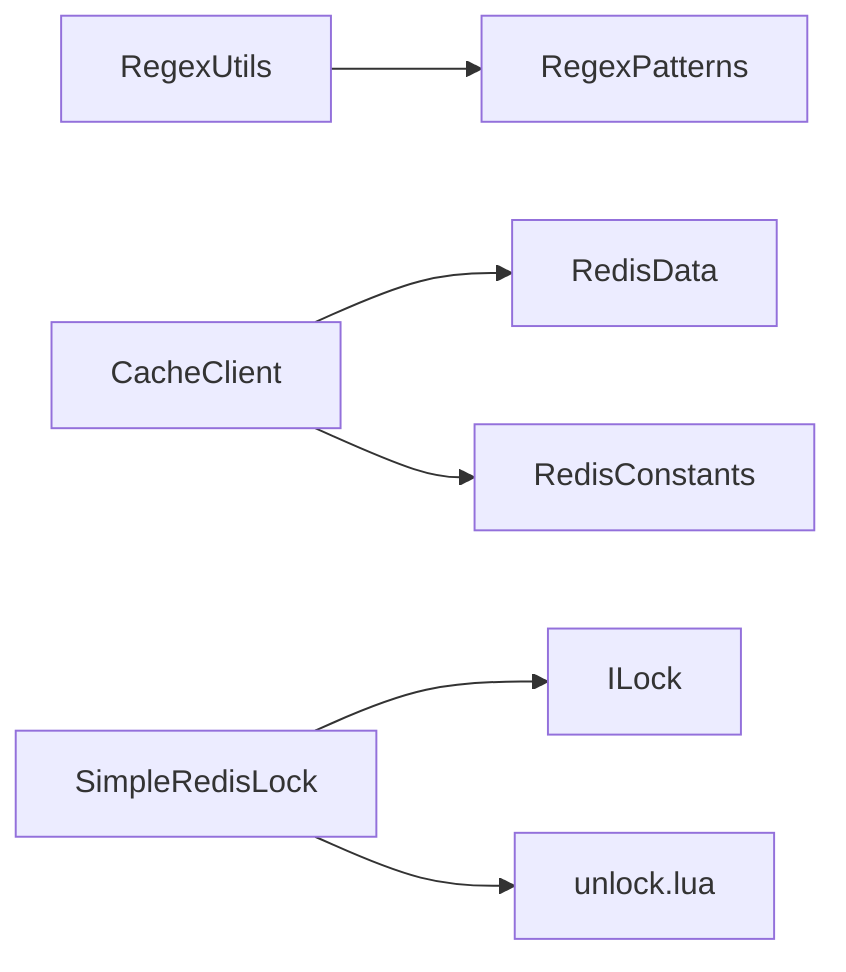

# 工具类和通用组件

<cite>
**本文引用的文件**   
- [RedisIdWorker.java](file://src/main/java/com/hmdp/utils/RedisIdWorker.java)
- [PasswordEncoder.java](file://src/main/java/com/hmdp/utils/PasswordEncoder.java)
- [RegexPatterns.java](file://src/main/java/com/hmdp/utils/RegexPatterns.java)
- [RegexUtils.java](file://src/main/java/com/hmdp/utils/RegexUtils.java)
- [SystemConstants.java](file://src/main/java/com/hmdp/utils/SystemConstants.java)
- [UserHolder.java](file://src/main/java/com/hmdp/utils/UserHolder.java)
- [RedisConstants.java](file://src/main/java/com/hmdp/utils/RedisConstants.java)
- [CacheClient.java](file://src/main/java/com/hmdp/utils/CacheClient.java)
- [SimpleRedisLock.java](file://src/main/java/com/hmdp/utils/SimpleRedisLock.java)
- [ILock.java](file://src/main/java/com/hmdp/utils/ILock.java)
- [RedisData.java](file://src/main/java/com/hmdp/utils/RedisData.java)
</cite>

## 目录
1. [简介](#简介)
2. [项目结构](#项目结构)
3. [核心组件](#核心组件)
4. [架构总览](#架构总览)
5. [详细组件分析](#详细组件分析)
6. [依赖关系分析](#依赖关系分析)
7. [性能与线程安全](#性能与线程安全)
8. [故障排查指南](#故障排查指南)
9. [结论](#结论)
10. [附录：方法签名与使用示例](#附录方法签名与使用示例)

## 简介
本章节聚焦 my-hbdp 项目的工具类与通用组件，围绕以下核心能力进行系统化说明：
- RedisID 生成器：基于时间戳与自增计数的高并发分布式 ID 生成方案。
- 密码加密器：带盐的 MD5 加解密与校验。
- 正则表达式工具：手机号、邮箱、验证码等常用格式校验。
- 系统常量：图片上传路径、分页大小、用户昵称前缀等。
- 用户上下文管理：基于 ThreadLocal 的用户信息存取。
- 缓存与锁辅助：逻辑过期缓存封装、简易 Redis 分布式锁。

这些组件为业务层提供稳定、可复用的基础能力，强调易用性、可扩展性与在并发场景下的健壮性。

## 项目结构
工具类与通用组件位于 utils 包下，按职责划分清晰：
- ID 生成：RedisIdWorker
- 安全：PasswordEncoder
- 校验：RegexPatterns、RegexUtils
- 常量：SystemConstants、RedisConstants
- 上下文：UserHolder
- 缓存与锁：CacheClient、RedisData、SimpleRedisLock、ILock

图表来源
- [RedisIdWorker.java:1-39](file://src/main/java/com/hmdp/utils/RedisIdWorker.java#L1-L39)
- [PasswordEncoder.java:1-35](file://src/main/java/com/hmdp/utils/PasswordEncoder.java#L1-L35)
- [RegexPatterns.java:1-25](file://src/main/java/com/hmdp/utils/RegexPatterns.java#L1-L25)
- [RegexUtils.java:1-43](file://src/main/java/com/hmdp/utils/RegexUtils.java#L1-L43)
- [SystemConstants.java:1-9](file://src/main/java/com/hmdp/utils/SystemConstants.java#L1-L9)
- [RedisConstants.java:1-25](file://src/main/java/com/hmdp/utils/RedisConstants.java#L1-L25)
- [UserHolder.java:1-20](file://src/main/java/com/hmdp/utils/UserHolder.java#L1-L20)
- [CacheClient.java:1-140](file://src/main/java/com/hmdp/utils/CacheClient.java#L1-L140)
- [RedisData.java:1-12](file://src/main/java/com/hmdp/utils/RedisData.java#L1-L12)
- [SimpleRedisLock.java:1-56](file://src/main/java/com/hmdp/utils/SimpleRedisLock.java#L1-L56)
- [ILock.java:1-7](file://src/main/java/com/hmdp/utils/ILock.java#L1-L7)

章节来源
- [RedisIdWorker.java:1-39](file://src/main/java/com/hmdp/utils/RedisIdWorker.java#L1-L39)
- [PasswordEncoder.java:1-35](file://src/main/java/com/hmdp/utils/PasswordEncoder.java#L1-L35)
- [RegexPatterns.java:1-25](file://src/main/java/com/hmdp/utils/RegexPatterns.java#L1-L25)
- [RegexUtils.java:1-43](file://src/main/java/com/hmdp/utils/RegexUtils.java#L1-L43)
- [SystemConstants.java:1-9](file://src/main/java/com/hmdp/utils/SystemConstants.java#L1-L9)
- [RedisConstants.java:1-25](file://src/main/java/com/hmdp/utils/RedisConstants.java#L1-L25)
- [UserHolder.java:1-20](file://src/main/java/com/hmdp/utils/UserHolder.java#L1-L20)
- [CacheClient.java:1-140](file://src/main/java/com/hmdp/utils/CacheClient.java#L1-L140)
- [RedisData.java:1-12](file://src/main/java/com/hmdp/utils/RedisData.java#L1-L12)
- [SimpleRedisLock.java:1-56](file://src/main/java/com/hmdp/utils/SimpleRedisLock.java#L1-L56)
- [ILock.java:1-7](file://src/main/java/com/hmdp/utils/ILock.java#L1-L7)

## 核心组件
本节对关键工具类进行概览式解读，后续章节将深入展开每个组件的实现细节、调用流程、线程安全与性能特性。

- RedisIdWorker：通过“UTC 秒级时间戳 + 每日自增序列”组合生成全局唯一 ID，适合高并发场景。
- PasswordEncoder：随机盐 + MD5 的密码编码与匹配，保证相同明文在不同时间产生不同密文。
- RegexPatterns/RegexUtils：集中定义常用正则并提供便捷校验方法，统一输入合法性判断。
- SystemConstants：集中管理系统级常量，避免硬编码。
- UserHolder：基于 ThreadLocal 保存当前请求用户上下文，简化跨层传递。
- CacheClient：封装常见缓存读写模式（穿透保护、逻辑过期），并内置简单分布式锁用于并发重建。
- SimpleRedisLock：基于 Lua 脚本的原子解锁实现，支持超时自动释放。
- ILock：锁接口抽象，便于扩展不同的锁实现。
- RedisData：逻辑过期缓存的数据包装体，包含数据与过期时间。

章节来源
- [RedisIdWorker.java:1-39](file://src/main/java/com/hmdp/utils/RedisIdWorker.java#L1-L39)
- [PasswordEncoder.java:1-35](file://src/main/java/com/hmdp/utils/PasswordEncoder.java#L1-L35)
- [RegexPatterns.java:1-25](file://src/main/java/com/hmdp/utils/RegexPatterns.java#L1-L25)
- [RegexUtils.java:1-43](file://src/main/java/com/hmdp/utils/RegexUtils.java#L1-L43)
- [SystemConstants.java:1-9](file://src/main/java/com/hmdp/utils/SystemConstants.java#L1-L9)
- [UserHolder.java:1-20](file://src/main/java/com/hmdp/utils/UserHolder.java#L1-L20)
- [CacheClient.java:1-140](file://src/main/java/com/hmdp/utils/CacheClient.java#L1-L140)
- [SimpleRedisLock.java:1-56](file://src/main/java/com/hmdp/utils/SimpleRedisLock.java#L1-L56)
- [ILock.java:1-7](file://src/main/java/com/hmdp/utils/ILock.java#L1-L7)
- [RedisData.java:1-12](file://src/main/java/com/hmdp/utils/RedisData.java#L1-L12)

## 架构总览
下图展示了工具类之间的协作关系与对外暴露的能力边界。

图表来源
- [RedisIdWorker.java:1-39](file://src/main/java/com/hmdp/utils/RedisIdWorker.java#L1-L39)
- [PasswordEncoder.java:1-35](file://src/main/java/com/hmdp/utils/PasswordEncoder.java#L1-L35)
- [RegexPatterns.java:1-25](file://src/main/java/com/hmdp/utils/RegexPatterns.java#L1-L25)
- [RegexUtils.java:1-43](file://src/main/java/com/hmdp/utils/RegexUtils.java#L1-L43)
- [SystemConstants.java:1-9](file://src/main/java/com/hmdp/utils/SystemConstants.java#L1-L9)
- [UserHolder.java:1-20](file://src/main/java/com/hmdp/utils/UserHolder.java#L1-L20)
- [CacheClient.java:1-140](file://src/main/java/com/hmdp/utils/CacheClient.java#L1-L140)
- [RedisData.java:1-12](file://src/main/java/com/hmdp/utils/RedisData.java#L1-L12)
- [ILock.java:1-7](file://src/main/java/com/hmdp/utils/ILock.java#L1-L7)
- [SimpleRedisLock.java:1-56](file://src/main/java/com/hmdp/utils/SimpleRedisLock.java#L1-L56)

## 详细组件分析

### RedisID 生成器（RedisIdWorker）
- 设计思路
  - 使用时间戳作为高位，确保整体有序；以日期维度在 Redis 中维护自增计数器，作为低位，保证同一天内唯一。
  - 通过位运算拼接时间戳与计数值，形成全局唯一 ID。
- 关键方法与行为
  - nextId(keyPrefix)：根据前缀生成当日唯一 ID。内部计算 UTC 秒级时间戳差值，并以“icr:前缀:yyyy:MM:dd”键做原子递增。
- 线程安全
  - 依赖 Redis 的原子递增操作，具备分布式线程安全。
- 性能特性
  - 单次 Redis 写入，O(1) 复杂度；时间戳与计数拼接为 O(1)。
- 注意事项
  - BEGIN_TIME_STAMP 固定基准时间，需确保应用启动后不会回退。
  - COUNT_BITS 决定计数位宽，影响最大日增量上限。
- 与其他组件集成
  - 可与 CacheClient、业务 Service 配合，为订单、帖子等实体生成主键。

图表来源
- [RedisIdWorker.java:19-31](file://src/main/java/com/hmdp/utils/RedisIdWorker.java#L19-L31)

章节来源
- [RedisIdWorker.java:1-39](file://src/main/java/com/hmdp/utils/RedisIdWorker.java#L1-L39)

### 密码加密器（PasswordEncoder）
- 设计思路
  - 每次编码生成随机盐，拼接明文后进行 MD5，最终存储“盐@密文”。
  - 校验时从密文中解析盐，重新计算并比较。
- 关键方法与行为
  - encode(password)：生成随机盐并返回“盐@密文”。
  - matches(encodedPassword, rawPassword)：校验明文与密文是否一致。
- 线程安全
  - 无状态工具类，方法均为静态，线程安全。
- 性能特性
  - 随机字符串生成与 MD5 哈希开销较低，适合登录等高频场景。
- 注意事项
  - 若密文不含分隔符，校验会抛出运行时异常，需确保入库格式正确。
- 与其他组件集成
  - 常用于用户注册、登录流程中的密码处理。

图表来源
- [PasswordEncoder.java:11-20](file://src/main/java/com/hmdp/utils/PasswordEncoder.java#L11-L20)
- [PasswordEncoder.java:21-33](file://src/main/java/com/hmdp/utils/PasswordEncoder.java#L21-L33)

章节来源
- [PasswordEncoder.java:1-35](file://src/main/java/com/hmdp/utils/PasswordEncoder.java#L1-L35)

### 正则表达式工具（RegexPatterns、RegexUtils）
- 设计思路
  - RegexPatterns 集中定义常用正则常量（手机号、邮箱、密码、验证码）。
  - RegexUtils 提供便捷校验方法，统一空值与匹配逻辑。
- 关键方法与行为
  - isPhoneInvalid(phone)、isEmailInvalid(email)、isCodeInvalid(code)：返回 true 表示无效。
- 线程安全
  - 无状态工具类，线程安全。
- 性能特性
  - 正则匹配开销低，适合参数校验前置。
- 注意事项
  - 空串或空白字符直接判定为无效，避免脏数据进入下游。
- 与其他组件集成
  - 在 Controller 入参校验、Service 层二次校验中使用。

图表来源
- [RegexPatterns.java:10-22](file://src/main/java/com/hmdp/utils/RegexPatterns.java#L10-L22)
- [RegexUtils.java:14-41](file://src/main/java/com/hmdp/utils/RegexUtils.java#L14-L41)

章节来源
- [RegexPatterns.java:1-25](file://src/main/java/com/hmdp/utils/RegexPatterns.java#L1-L25)
- [RegexUtils.java:1-43](file://src/main/java/com/hmdp/utils/RegexUtils.java#L1-L43)

### 系统常量（SystemConstants）
- 作用
  - 集中管理图片上传目录、用户昵称前缀、分页默认与最大值等配置项。
- 使用建议
  - 所有涉及路径、分页大小的地方引用该常量，避免硬编码。
- 线程安全
  - 常量类，线程安全。

章节来源
- [SystemConstants.java:1-9](file://src/main/java/com/hmdp/utils/SystemConstants.java#L1-L9)

### 用户上下文管理（UserHolder）
- 设计思路
  - 基于 ThreadLocal 保存当前请求的用户对象，便于在 Service/Mapper 层获取当前用户。
- 关键方法与行为
  - saveUser(user)：设置当前线程用户。
  - getUser()：获取当前线程用户。
  - removeUser()：清理当前线程用户，防止内存泄漏。
- 线程安全
  - 每个线程独立空间，线程安全；但需在请求结束时主动 remove。
- 注意事项
  - 务必在拦截器或过滤器中完成 save/remove，避免线程池复用导致污染。
- 与其他组件集成
  - 常与登录拦截器、刷新令牌拦截器配合使用。

图表来源
- [UserHolder.java:6-18](file://src/main/java/com/hmdp/utils/UserHolder.java#L6-L18)

章节来源
- [UserHolder.java:1-20](file://src/main/java/com/hmdp/utils/UserHolder.java#L1-L20)

### 缓存客户端（CacheClient）
- 设计思路
  - 封装常见的缓存读写模式：
    - 穿透保护：查询不到时写入空值短 TTL。
    - 逻辑过期：缓存中包含数据与过期时间，过期后异步重建。
- 关键方法与行为
  - set(key, value, time, unit)：序列化后写入。
  - setWithLogicalExpire(key, value, time, unit)：写入带过期时间的包装对象。
  - queryWithPassThrough(...)：先查缓存，未命中则回源数据库，必要时写空值。
  - queryWithLogicalExpire(...)：命中则检查逻辑过期；过期则尝试加锁并异步重建。
- 线程安全
  - tryLock/unLock 使用 Redis 原子操作；异步重建使用固定线程池。
- 性能特性
  - 减少热点数据对数据库的压力；逻辑过期避免缓存雪崩。
- 注意事项
  - 需要合理设置 TTL 与锁超时；注意 JSON 序列化开销。
- 与其他组件集成
  - 结合 RedisConstants 提供的 Key 前缀与 TTL；与 SimpleRedisLock 可替换使用更复杂的锁策略。

图表来源
- [CacheClient.java:64-127](file://src/main/java/com/hmdp/utils/CacheClient.java#L64-L127)
- [CacheClient.java:129-136](file://src/main/java/com/hmdp/utils/CacheClient.java#L129-L136)
- [RedisData.java:1-12](file://src/main/java/com/hmdp/utils/RedisData.java#L1-L12)

章节来源
- [CacheClient.java:1-140](file://src/main/java/com/hmdp/utils/CacheClient.java#L1-L140)
- [RedisData.java:1-12](file://src/main/java/com/hmdp/utils/RedisData.java#L1-L12)

### 分布式锁（ILock、SimpleRedisLock）
- 设计思路
  - ILock 定义统一锁接口；SimpleRedisLock 基于 Redis SETNX 与 Lua 脚本实现原子解锁。
- 关键方法与行为
  - tryLock(timeOut)：设置带超时的键，标识线程 ID。
  - unlock()：执行 Lua 脚本仅当值为当前线程 ID 时删除。
- 线程安全
  - 基于 Redis 原子操作，具备分布式线程安全。
- 性能特性
  - 加锁/解锁为 O(1)；Lua 脚本保证原子性，降低竞态条件风险。
- 注意事项
  - 锁超时时间需大于临界区执行时间；避免死锁。
- 与其他组件集成
  - 可用于热点资源更新、库存扣减等场景；也可与 CacheClient 的逻辑过期重建配合。

图表来源
- [ILock.java:1-7](file://src/main/java/com/hmdp/utils/ILock.java#L1-L7)
- [SimpleRedisLock.java:11-44](file://src/main/java/com/hmdp/utils/SimpleRedisLock.java#L11-L44)

章节来源
- [ILock.java:1-7](file://src/main/java/com/hmdp/utils/ILock.java#L1-L7)
- [SimpleRedisLock.java:1-56](file://src/main/java/com/hmdp/utils/SimpleRedisLock.java#L1-L56)

## 依赖关系分析
- 外部依赖
  - Spring Data Redis：StringRedisTemplate 用于键值操作与脚本执行。
  - Hutool：随机字符串、JSON 序列化、布尔工具等。
  - Spring：ClassPathResource 加载 Lua 脚本。
- 内部依赖
  - RegexUtils 依赖 RegexPatterns。
  - CacheClient 依赖 RedisData 与 RedisConstants（Key/TTL 命名约定）。
  - SimpleRedisLock 依赖 ILock 接口与 Lua 脚本。

图表来源
- [RegexUtils.java:1-43](file://src/main/java/com/hmdp/utils/RegexUtils.java#L1-L43)
- [RegexPatterns.java:1-25](file://src/main/java/com/hmdp/utils/RegexPatterns.java#L1-L25)
- [CacheClient.java:1-140](file://src/main/java/com/hmdp/utils/CacheClient.java#L1-L140)
- [RedisData.java:1-12](file://src/main/java/com/hmdp/utils/RedisData.java#L1-L12)
- [RedisConstants.java:1-25](file://src/main/java/com/hmdp/utils/RedisConstants.java#L1-L25)
- [SimpleRedisLock.java:1-56](file://src/main/java/com/hmdp/utils/SimpleRedisLock.java#L1-L56)
- [ILock.java:1-7](file://src/main/java/com/hmdp/utils/ILock.java#L1-L7)

章节来源
- [RegexUtils.java:1-43](file://src/main/java/com/hmdp/utils/RegexUtils.java#L1-L43)
- [RegexPatterns.java:1-25](file://src/main/java/com/hmdp/utils/RegexPatterns.java#L1-L25)
- [CacheClient.java:1-140](file://src/main/java/com/hmdp/utils/CacheClient.java#L1-L140)
- [RedisData.java:1-12](file://src/main/java/com/hmdp/utils/RedisData.java#L1-L12)
- [RedisConstants.java:1-25](file://src/main/java/com/hmdp/utils/RedisConstants.java#L1-L25)
- [SimpleRedisLock.java:1-56](file://src/main/java/com/hmdp/utils/SimpleRedisLock.java#L1-L56)
- [ILock.java:1-7](file://src/main/java/com/hmdp/utils/ILock.java#L1-L7)

## 性能与线程安全
- RedisIdWorker
  - 并发安全：由 Redis INCR 保障。
  - 性能：单写一次 Redis，位运算拼接，极低 CPU 开销。
  - 扩展点：COUNT_BITS 与 BEGIN_TIME_STAMP 可按业务需求调整。
- PasswordEncoder
  - 并发安全：无状态，线程安全。
  - 性能：MD5 计算快，适合常规认证场景。
- RegexUtils/RegexPatterns
  - 并发安全：无状态，线程安全。
  - 性能：正则匹配开销小，建议在入口尽早失败。
- UserHolder
  - 并发安全：ThreadLocal 隔离，线程安全；必须及时 remove。
  - 性能：内存访问极快。
- CacheClient
  - 并发安全：加锁与解锁基于 Redis 原子操作；异步重建使用线程池。
  - 性能：逻辑过期避免雪崩；JSON 序列化有额外开销，应控制对象体积。
- SimpleRedisLock
  - 并发安全：SETNX + Lua 原子解锁，防误删。
  - 性能：加锁/解锁为 O(1)，网络往返为主要成本。

[本节为通用指导，不直接分析具体文件]

## 故障排查指南
- 密码校验异常
  - 现象：校验抛运行时异常，提示密码格式不正确。
  - 原因：密文缺少分隔符。
  - 解决：确保入库密文为“盐@密文”格式。
  - 参考
    - [PasswordEncoder.java:21-33](file://src/main/java/com/hmdp/utils/PasswordEncoder.java#L21-L33)
- 缓存重建竞争
  - 现象：热点数据过期时出现多次重建或重复回源。
  - 原因：未正确使用锁或锁超时过短。
  - 解决：增大锁超时时间；确保 double-check 逻辑；监控异步任务异常。
  - 参考
    - [CacheClient.java:88-127](file://src/main/java/com/hmdp/utils/CacheClient.java#L88-L127)
- 用户上下文泄漏
  - 现象：线程复用导致用户信息错乱。
  - 原因：未在请求结束时 remove。
  - 解决：在拦截器 finally 块中调用 removeUser。
  - 参考
    - [UserHolder.java:16-18](file://src/main/java/com/hmdp/utils/UserHolder.java#L16-L18)
- 分布式锁误删
  - 现象：其他线程误删锁。
  - 原因：非原子判断与删除。
  - 解决：使用 Lua 脚本原子解锁。
  - 参考
    - [SimpleRedisLock.java:39-44](file://src/main/java/com/hmdp/utils/SimpleRedisLock.java#L39-L44)

章节来源
- [PasswordEncoder.java:21-33](file://src/main/java/com/hmdp/utils/PasswordEncoder.java#L21-L33)
- [CacheClient.java:88-127](file://src/main/java/com/hmdp/utils/CacheClient.java#L88-L127)
- [UserHolder.java:16-18](file://src/main/java/com/hmdp/utils/UserHolder.java#L16-L18)
- [SimpleRedisLock.java:39-44](file://src/main/java/com/hmdp/utils/SimpleRedisLock.java#L39-L44)

## 结论
上述工具类与通用组件构成了 my-hbdp 的基础设施层，覆盖了 ID 生成、安全、校验、常量、上下文、缓存与锁等关键领域。它们在设计上注重简洁与可复用，并通过合理的并发与性能考量支撑业务高可用。建议在实际使用中遵循最佳实践，严格管理生命周期与异常分支，以获得稳定高效的运行效果。

[本节为总结性内容，不直接分析具体文件]

## 附录：方法签名与使用示例

- RedisIdWorker
  - 方法：nextId(String keyPrefix) -> long
  - 参数：keyPrefix 用于区分不同业务的日期自增键前缀
  - 返回：全局唯一 ID
  - 使用示例：在创建订单或服务时调用，传入业务前缀如“order”、“blog”
  - 参考
    - [RedisIdWorker.java:21-31](file://src/main/java/com/hmdp/utils/RedisIdWorker.java#L21-L31)

- PasswordEncoder
  - 方法：encode(String password) -> String
  - 参数：明文密码
  - 返回：盐@密文
  - 方法：matches(String encodedPassword, String rawPassword) -> Boolean
  - 参数：已编码密码、明文密码
  - 返回：是否匹配
  - 使用示例：注册时 encode，登录时 matches
  - 参考
    - [PasswordEncoder.java:11-20](file://src/main/java/com/hmdp/utils/PasswordEncoder.java#L11-L20)
    - [PasswordEncoder.java:21-33](file://src/main/java/com/hmdp/utils/PasswordEncoder.java#L21-L33)

- RegexUtils
  - 方法：isPhoneInvalid(String phone) -> boolean
  - 方法：isEmailInvalid(String email) -> boolean
  - 方法：isCodeInvalid(String code) -> boolean
  - 使用示例：在 Controller 入参校验中快速失败
  - 参考
    - [RegexUtils.java:14-33](file://src/main/java/com/hmdp/utils/RegexUtils.java#L14-L33)

- SystemConstants
  - 常量：IMAGE_UPLOAD_DIR、USER_NICK_NAME_PREFIX、DEFAULT_PAGE_SIZE、MAX_PAGE_SIZE
  - 使用示例：文件上传路径、分页大小限制
  - 参考
    - [SystemConstants.java:4-7](file://src/main/java/com/hmdp/utils/SystemConstants.java#L4-L7)

- UserHolder
  - 方法：saveUser(UserDTO user) -> void
  - 方法：getUser() -> UserDTO
  - 方法：removeUser() -> void
  - 使用示例：登录成功后 saveUser，请求结束 removeUser
  - 参考
    - [UserHolder.java:8-18](file://src/main/java/com/hmdp/utils/UserHolder.java#L8-L18)

- CacheClient
  - 方法：set(String key, Object value, Long time, TimeUnit unit) -> void
  - 方法：setWithLogicalExpire(String key, Object value, Long time, TimeUnit unit) -> void
  - 方法：queryWithPassThrough(String preFix, ID id, Class<R> type, Function<ID,R> dbFunction, Long time, TimeUnit unit) -> R
  - 方法：queryWithLogicalExpire(String keyPreFix, ID id, Class<R> type, Function<ID,R> dbFunction, Long time, TimeUnit unit, String lockPreFix) -> R
  - 使用示例：商品详情、首页 feed 列表等热点数据缓存
  - 参考
    - [CacheClient.java:25-34](file://src/main/java/com/hmdp/utils/CacheClient.java#L25-L34)
    - [CacheClient.java:36-60](file://src/main/java/com/hmdp/utils/CacheClient.java#L36-L60)
    - [CacheClient.java:64-127](file://src/main/java/com/hmdp/utils/CacheClient.java#L64-L127)

- SimpleRedisLock / ILock
  - 方法：tryLock(Long timeOut) -> Boolean
  - 方法：unlock() -> void
  - 使用示例：库存扣减、优惠券发放等临界区保护
  - 参考
    - [SimpleRedisLock.java:32-44](file://src/main/java/com/hmdp/utils/SimpleRedisLock.java#L32-L44)
    - [ILock.java:3-6](file://src/main/java/com/hmdp/utils/ILock.java#L3-L6)