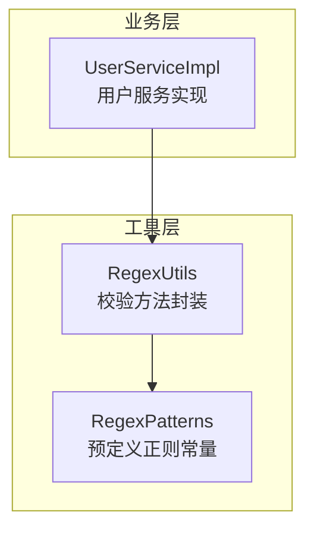
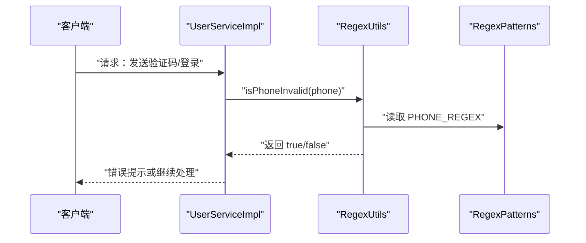
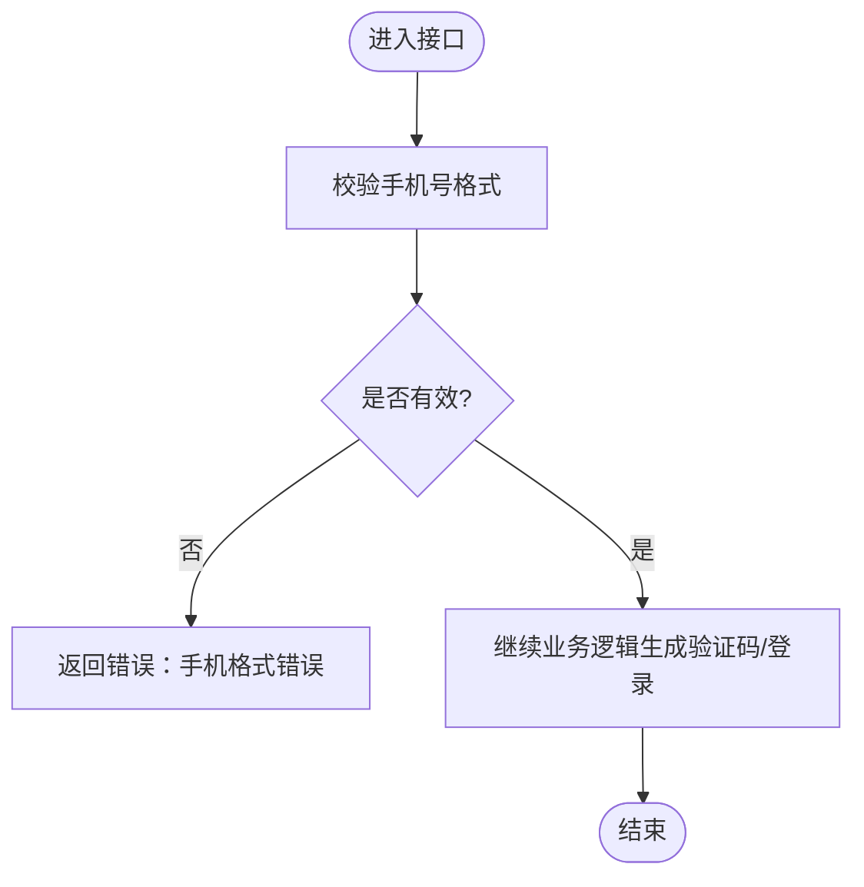
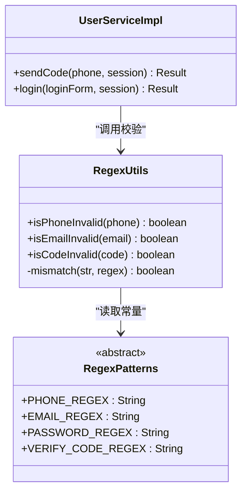

# 正则表达式工具

<cite>
**本文引用的文件**   
- [RegexPatterns.java](file://src/main/java/com/hmdp/utils/RegexPatterns.java)
- [RegexUtils.java](file://src/main/java/com/hmdp/utils/RegexUtils.java)
- [UserServiceImpl.java](file://src/main/java/com/hmdp/service/impl/UserServiceImpl.java)
</cite>

## 目录
1. [简介](#简介)
2. [项目结构](#项目结构)
3. [核心组件](#核心组件)
4. [架构总览](#架构总览)
5. [详细组件分析](#详细组件分析)
6. [依赖关系分析](#依赖关系分析)
7. [性能与优化](#性能与优化)
8. [常见问题排查](#常见问题排查)
9. [结论](#结论)
10. [附录：使用示例与扩展指南](#附录使用示例与扩展指南)

## 简介
本文件围绕项目中的“正则表达式工具”进行系统化文档化，重点覆盖以下方面：
- 预定义的正则模式（手机号、邮箱、验证码等）及其匹配规则与适用场景
- 工具类方法的使用方式与调用流程
- 在业务中的实际应用场景（如表单验证、数据清洗）
- 性能优化技巧与常见问题排查
- 自定义正则的编写指南与测试方法

## 项目结构
正则相关代码位于 utils 包下，包含两类职责清晰的组件：
- 模式常量集中管理：RegexPatterns
- 校验方法封装：RegexUtils
- 业务层使用示例：UserServiceImpl（登录与发送验证码流程中校验手机号）

图表来源
- [RegexPatterns.java:1-25](file://src/main/java/com/hmdp/utils/RegexPatterns.java#L1-L25)
- [RegexUtils.java:1-43](file://src/main/java/com/hmdp/utils/RegexUtils.java#L1-L43)
- [UserServiceImpl.java:47-70](file://src/main/java/com/hmdp/service/impl/UserServiceImpl.java#L47-L70)

章节来源
- [RegexPatterns.java:1-25](file://src/main/java/com/hmdp/utils/RegexPatterns.java#L1-L25)
- [RegexUtils.java:1-43](file://src/main/java/com/hmdp/utils/RegexUtils.java#L1-L43)
- [UserServiceImpl.java:47-70](file://src/main/java/com/hmdp/service/impl/UserServiceImpl.java#L47-L70)

## 核心组件
- RegexPatterns：以静态常量形式提供常用正则表达式，便于统一管理与复用。当前包含：
  - 手机号正则
  - 邮箱正则
  - 密码正则（长度与字符集限制）
  - 验证码正则（固定长度与字符集）
- RegexUtils：对字符串进行空值快速判断后，委托 Java 标准库的匹配能力完成校验，并提供语义化的布尔返回值方法（如“是否无效”）。

章节来源
- [RegexPatterns.java:1-25](file://src/main/java/com/hmdp/utils/RegexPatterns.java#L1-L25)
- [RegexUtils.java:1-43](file://src/main/java/com/hmdp/utils/RegexUtils.java#L1-L43)

## 架构总览
从调用链看，业务层通过工具类完成输入校验，工具类再引用模式常量完成匹配。整体为“薄封装 + 常量集中管理”的轻量设计。

图表来源
- [UserServiceImpl.java:47-70](file://src/main/java/com/hmdp/service/impl/UserServiceImpl.java#L47-L70)
- [RegexUtils.java:14-16](file://src/main/java/com/hmdp/utils/RegexUtils.java#L14-L16)
- [RegexPatterns.java:10](file://src/main/java/com/hmdp/utils/RegexPatterns.java#L10)

## 详细组件分析

### 组件一：RegexPatterns（预定义正则常量）
- 设计要点
  - 将常用正则抽取为静态常量，避免散落在业务代码中，提升可维护性与一致性
  - 当前提供的模式覆盖常见身份与通信字段：手机号、邮箱、验证码；另提供密码复杂度约束
- 各模式说明与适用场景
  - 手机号：用于注册、登录、短信验证码等场景的前端/后端双重校验
  - 邮箱：用于账号绑定、通知邮件等场景
  - 验证码：用于短信/图形验证码的格式校验
  - 密码：用于注册/修改密码时的基础强度校验
- 注意事项
  - 该实现未包含中国大陆身份证号码校验模式，如需支持可在本类中新增常量并补充对应工具方法

章节来源
- [RegexPatterns.java:1-25](file://src/main/java/com/hmdp/utils/RegexPatterns.java#L1-L25)

### 组件二：RegexUtils（校验方法封装）
- 设计要点
  - 对外暴露语义化方法：isPhoneInvalid、isEmailInvalid、isCodeInvalid，返回“是否无效”，便于在业务中进行“失败即拒绝”的快速路径
  - 内部统一走 mismatch 逻辑：先判空（空白串视为无效），再进行正则匹配
- 关键行为
  - 空值短路：若输入为空或空白，直接判定为无效，避免无谓的正则计算
  - 匹配策略：基于 Java 标准库的匹配能力，确保全量匹配（非部分匹配）
- 可扩展性
  - 新增校验类型时，建议在 RegexPatterns 中新增常量，并在 RegexUtils 中增加对应 isXxxInvalid 方法，保持风格一致

章节来源
- [RegexUtils.java:1-43](file://src/main/java/com/hmdp/utils/RegexUtils.java#L1-L43)

### 组件三：业务集成示例（UserServiceImpl）
- 典型流程
  - 发送验证码：先校验手机号格式，通过后生成验证码并缓存
  - 登录：先校验手机号格式，再校验验证码一致性，随后查询/注册用户并签发令牌
- 错误处理
  - 当手机号格式不合法时，直接返回错误响应，阻断后续流程，减少不必要的资源消耗

图表来源
- [UserServiceImpl.java:47-70](file://src/main/java/com/hmdp/service/impl/UserServiceImpl.java#L47-L70)

章节来源
- [UserServiceImpl.java:47-70](file://src/main/java/com/hmdp/service/impl/UserServiceImpl.java#L47-L70)

## 依赖关系分析
- 组件耦合
  - RegexUtils 依赖 RegexPatterns 的模式常量
  - UserServiceImpl 依赖 RegexUtils 的校验方法
- 外部依赖
  - 使用 Hutool 的空值判断工具进行快速短路
  - 使用 Java 标准库的字符串匹配能力完成正则校验

图表来源
- [RegexPatterns.java:1-25](file://src/main/java/com/hmdp/utils/RegexPatterns.java#L1-L25)
- [RegexUtils.java:1-43](file://src/main/java/com/hmdp/utils/RegexUtils.java#L1-L43)
- [UserServiceImpl.java:47-70](file://src/main/java/com/hmdp/service/impl/UserServiceImpl.java#L47-L70)

章节来源
- [RegexPatterns.java:1-25](file://src/main/java/com/hmdp/utils/RegexPatterns.java#L1-L25)
- [RegexUtils.java:1-43](file://src/main/java/com/hmdp/utils/RegexUtils.java#L1-L43)
- [UserServiceImpl.java:47-70](file://src/main/java/com/hmdp/service/impl/UserServiceImpl.java#L47-L70)

## 性能与优化
- 空值短路优先
  - 在真正执行正则前，先判断是否为空或空白，避免不必要的正则编译与回溯开销
- 全量匹配
  - 采用全量匹配策略，避免误匹配带来的二次校验成本
- 常量集中管理
  - 将正则作为常量统一管理，有利于后续替换为更高效的实现（例如预编译 Pattern）而不影响上层调用
- 建议的进一步优化方向
  - 在高并发场景下，可将正则表达式预编译为不可变对象，减少重复解析开销
  - 对热点字段（如手机号）可考虑前置简单规则（长度、首号段）快速过滤，再进入正则校验

[本节为通用性能建议，不直接分析具体文件]

## 常见问题排查
- 问题：手机号总是被判定为无效
  - 排查点：确认传入的手机号是否为空或包含空白字符；检查是否符合预定义模式的号段范围
- 问题：邮箱校验过于严格或宽松
  - 排查点：根据业务需求调整邮箱正则，注意域名后缀与特殊字符的支持范围
- 问题：验证码长度或字符集不符合预期
  - 排查点：确认验证码生成规则与正则要求一致（长度、字母数字组合）
- 问题：性能抖动
  - 排查点：是否存在大量空串反复进入正则匹配；是否可以在入口层做更严格的格式拦截

章节来源
- [RegexUtils.java:36-41](file://src/main/java/com/hmdp/utils/RegexUtils.java#L36-L41)

## 结论
本项目中的正则工具采用“常量集中 + 薄封装”的设计，既保证了易用性，又具备良好的扩展空间。当前已覆盖手机号、邮箱、验证码等高频场景，并已在用户服务中落地使用。后续可按需扩展更多常用格式（如身份证、URL、IP 等），并结合预编译与前置规则进一步提升性能与稳定性。

[本节为总结性内容，不直接分析具体文件]

## 附录：使用示例与扩展指南

### 使用示例（概念性说明）
- 表单提交前的前端/后端双重校验
  - 在控制器或服务层接收参数后，立即调用工具方法进行格式校验，非法则快速返回错误信息
- 数据清洗
  - 在入库前对文本字段进行规范化（去除首尾空白、统一大小写等），再结合正则进行合法性校验

章节来源
- [UserServiceImpl.java:47-70](file://src/main/java/com/hmdp/service/impl/UserServiceImpl.java#L47-L70)

### 自定义正则的编写指南
- 步骤
  - 在 RegexPatterns 中新增常量，命名遵循现有风格（如 XXX_REGEX）
  - 在 RegexUtils 中新增对应的 isXxxInvalid 方法，保持“是否无效”的语义
  - 在业务层按需调用新方法
- 建议
  - 尽量使用锚点限定边界，避免部分匹配导致的误判
  - 对复杂模式进行分步拆分与注释，便于后期维护
  - 针对热点路径，评估是否需要预编译以提升性能

章节来源
- [RegexPatterns.java:1-25](file://src/main/java/com/hmdp/utils/RegexPatterns.java#L1-L25)
- [RegexUtils.java:1-43](file://src/main/java/com/hmdp/utils/RegexUtils.java#L1-L43)

### 测试方法（概念性说明）
- 单元测试
  - 构造多组边界用例（空串、超长、非法号段、特殊字符等），覆盖正常与异常分支
- 回归验证
  - 在集成测试中模拟真实请求，验证工具方法在不同环境下的表现一致性
- 性能基准
  - 对热点校验方法建立简单的基准测试，观察在大批量输入下的耗时变化

[本节为通用测试建议，不直接分析具体文件]