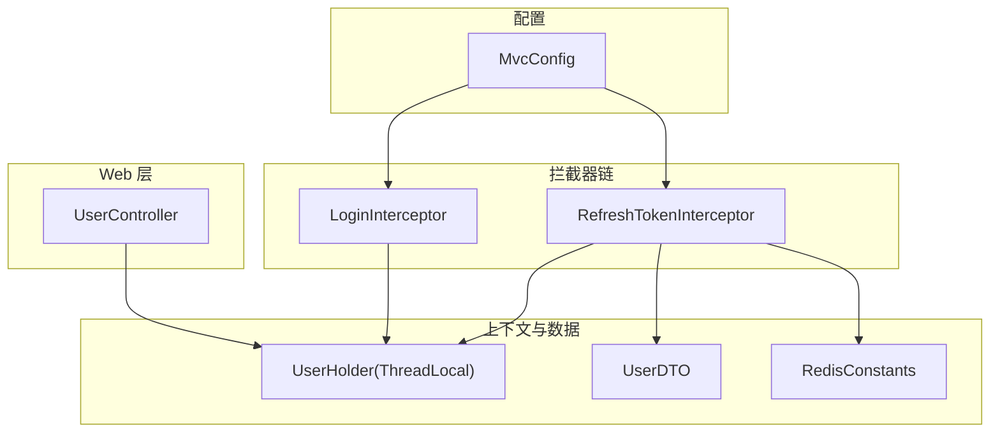
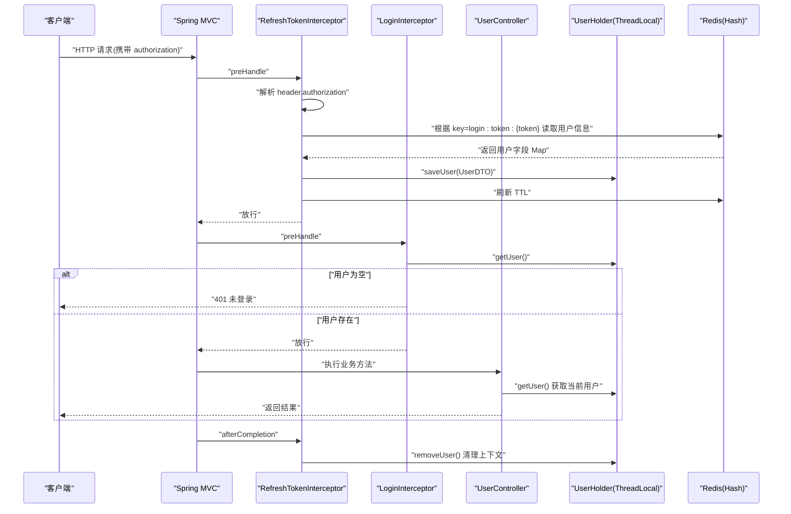
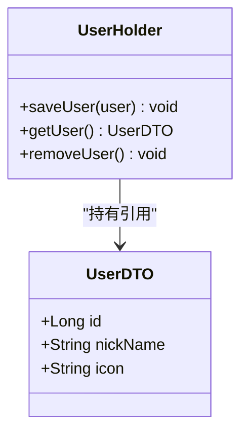
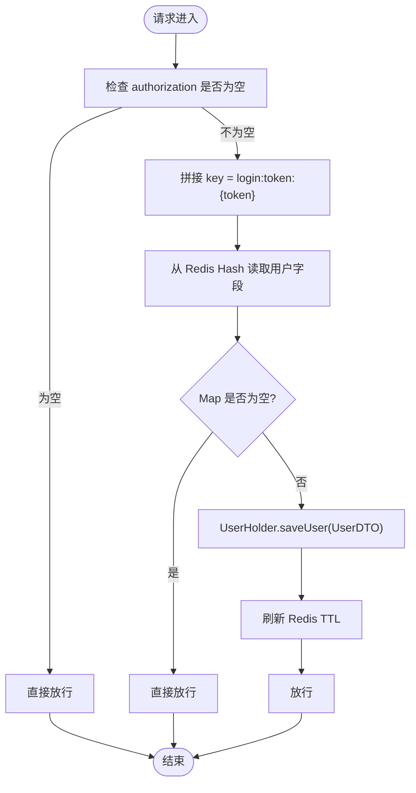
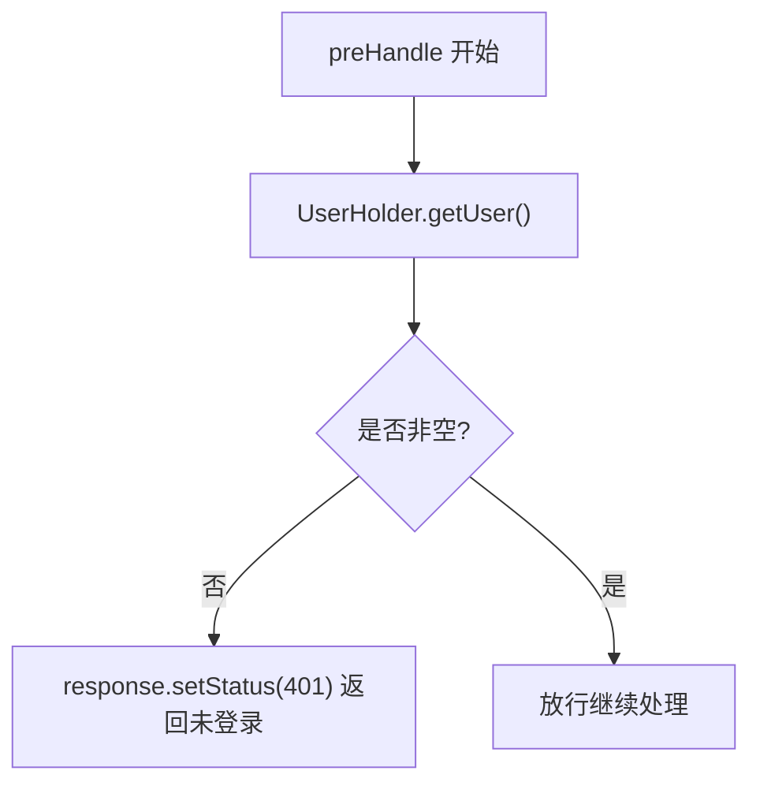
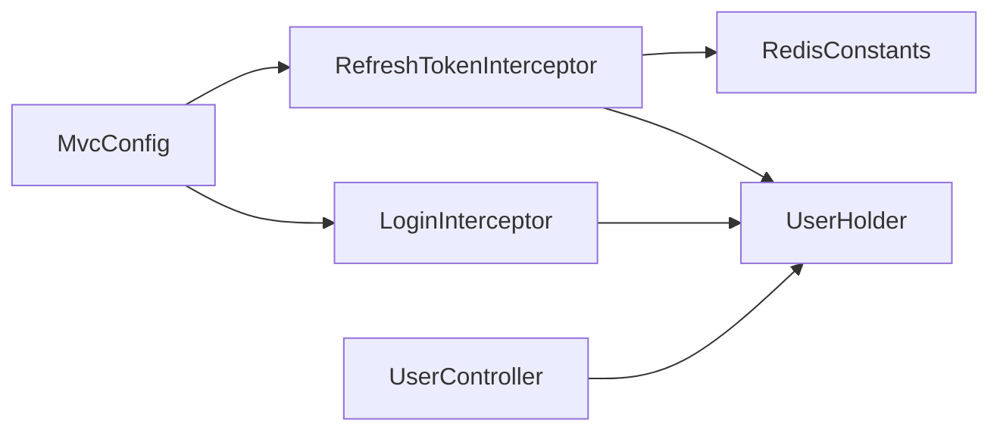

# 用户上下文管理

<cite>
**本文引用的文件**
- [UserHolder.java](file://src/main/java/com/hmdp/utils/UserHolder.java)
- [UserDTO.java](file://src/main/java/com/hmdp/dto/UserDTO.java)
- [RefreshTokenInterceptor.java](file://src/main/java/com/hmdp/utils/RefreshTokenInterceptor.java)
- [LoginInterceptor.java](file://src/main/java/com/hmdp/utils/LoginInterceptor.java)
- [MvcConfig.java](file://src/main/java/com/hmdp/config/MvcConfig.java)
- [UserController.java](file://src/main/java/com/hmdp/controller/UserController.java)
- [RedisConstants.java](file://src/main/java/com/hmdp/utils/RedisConstants.java)
</cite>

## 目录
1. [简介](#简介)
2. [项目结构](#项目结构)
3. [核心组件](#核心组件)
4. [架构总览](#架构总览)
5. [详细组件分析](#详细组件分析)
6. [依赖关系分析](#依赖关系分析)
7. [性能与线程安全](#性能与线程安全)
8. [故障排查指南](#故障排查指南)
9. [结论](#结论)
10. [附录：使用示例路径](#附录使用示例路径)

## 简介
本文件围绕“用户上下文管理”展开，聚焦于在 Web 请求链路中如何基于 ThreadLocal 存储当前用户信息，并通过拦截器完成用户信息的设置、校验与清理。文档将解释以下要点：
- ThreadLocal 的线程隔离机制与内存泄漏防护
- 用户信息的设置、获取与清理方法
- UserDTO 的数据结构与用户会话生命周期
- 拦截器与 UserHolder 的协作方式及请求处理流程
- 认证状态检查与服务层获取当前用户的实践建议
- 常见问题的定位与优化建议

## 项目结构
与用户上下文相关的代码主要分布在 utils、dto、config、controller 四个包中：
- utils：包含用户上下文持有者、拦截器、常量定义等
- dto：包含用户数据传输对象
- config：注册拦截器并配置访问控制白名单
- controller：演示如何在控制器中读取当前用户

图表来源
- [MvcConfig.java:19-32](file://src/main/java/com/hmdp/config/MvcConfig.java#L19-L32)
- [RefreshTokenInterceptor.java:25-42](file://src/main/java/com/hmdp/utils/RefreshTokenInterceptor.java#L25-L42)
- [LoginInterceptor.java:21-28](file://src/main/java/com/hmdp/utils/LoginInterceptor.java#L21-L28)
- [UserHolder.java:5-18](file://src/main/java/com/hmdp/utils/UserHolder.java#L5-L18)
- [UserController.java:65-70](file://src/main/java/com/hmdp/controller/UserController.java#L65-L70)
- [RedisConstants.java:4-7](file://src/main/java/com/hmdp/utils/RedisConstants.java#L4-L7)

章节来源
- [MvcConfig.java:19-32](file://src/main/java/com/hmdp/config/MvcConfig.java#L19-L32)
- [RefreshTokenInterceptor.java:25-42](file://src/main/java/com/hmdp/utils/RefreshTokenInterceptor.java#L25-L42)
- [LoginInterceptor.java:21-28](file://src/main/java/com/hmdp/utils/LoginInterceptor.java#L21-L28)
- [UserHolder.java:5-18](file://src/main/java/com/hmdp/utils/UserHolder.java#L5-L18)
- [UserController.java:65-70](file://src/main/java/com/hmdp/controller/UserController.java#L65-L70)
- [RedisConstants.java:4-7](file://src/main/java/com/hmdp/utils/RedisConstants.java#L4-L7)

## 核心组件
- UserHolder：基于 ThreadLocal 保存当前线程的用户信息，提供 saveUser/getUser/removeUser 三个静态方法
- RefreshTokenInterceptor：从请求头解析 token，查询 Redis 中的用户信息并写入 UserHolder，同时刷新 TTL；在 afterCompletion 中清理 ThreadLocal
- LoginInterceptor：在 preHandle 阶段检查 UserHolder 是否已存在当前用户，未登录则返回 401
- MvcConfig：注册两个拦截器，并指定执行顺序与排除路径
- UserDTO：承载用户基本信息（id、昵称、头像）
- RedisConstants：定义登录相关键前缀与过期时间

章节来源
- [UserHolder.java:5-18](file://src/main/java/com/hmdp/utils/UserHolder.java#L5-L18)
- [RefreshTokenInterceptor.java:25-42](file://src/main/java/com/hmdp/utils/RefreshTokenInterceptor.java#L25-L42)
- [LoginInterceptor.java:21-28](file://src/main/java/com/hmdp/utils/LoginInterceptor.java#L21-L28)
- [MvcConfig.java:19-32](file://src/main/java/com/hmdp/config/MvcConfig.java#L19-L32)
- [UserDTO.java:5-10](file://src/main/java/com/hmdp/dto/UserDTO.java#L5-L10)
- [RedisConstants.java:4-7](file://src/main/java/com/hmdp/utils/RedisConstants.java#L4-L7)

## 架构总览
下图展示了带 Token 的请求进入后，如何通过拦截器链完成用户上下文装配、业务处理与上下文清理的全过程。

图表来源
- [RefreshTokenInterceptor.java:25-42](file://src/main/java/com/hmdp/utils/RefreshTokenInterceptor.java#L25-L42)
- [RefreshTokenInterceptor.java:47-49](file://src/main/java/com/hmdp/utils/RefreshTokenInterceptor.java#L47-L49)
- [LoginInterceptor.java:21-28](file://src/main/java/com/hmdp/utils/LoginInterceptor.java#L21-L28)
- [UserController.java:65-70](file://src/main/java/com/hmdp/controller/UserController.java#L65-L70)
- [RedisConstants.java:4-7](file://src/main/java/com/hmdp/utils/RedisConstants.java#L4-L7)

## 详细组件分析

### UserHolder：ThreadLocal 上下文容器
- 职责：为每个线程维护一个独立的 UserDTO 引用，避免多线程共享导致的并发问题
- 关键方法：
  - saveUser：将当前用户写入 ThreadLocal
  - getUser：从当前线程取出用户
  - removeUser：请求结束后清理，防止内存泄漏
- 线程安全说明：ThreadLocal 天然保证线程隔离，但必须确保在请求结束时调用 removeUser，否则线程池复用线程会导致旧引用残留

图表来源
- [UserHolder.java:5-18](file://src/main/java/com/hmdp/utils/UserHolder.java#L5-L18)
- [UserDTO.java:5-10](file://src/main/java/com/hmdp/dto/UserDTO.java#L5-L10)

章节来源
- [UserHolder.java:5-18](file://src/main/java/com/hmdp/utils/UserHolder.java#L5-L18)
- [UserDTO.java:5-10](file://src/main/java/com/hmdp/dto/UserDTO.java#L5-L10)

### RefreshTokenInterceptor：上下文装配与续期
- 前置处理 preHandle：
  - 若请求头无 authorization，直接放行
  - 若有 token，则以 login:token:{token} 为 key 从 Redis Hash 中读取用户字段，填充到 UserDTO 并保存到 UserHolder
  - 刷新该 key 的过期时间，实现滑动续期
- 后置处理 afterCompletion：
  - 无论成功或异常，均调用 UserHolder.removeUser() 清理上下文，避免线程复用导致的数据污染和内存泄漏

图表来源
- [RefreshTokenInterceptor.java:25-42](file://src/main/java/com/hmdp/utils/RefreshTokenInterceptor.java#L25-L42)
- [RedisConstants.java:4-7](file://src/main/java/com/hmdp/utils/RedisConstants.java#L4-L7)

章节来源
- [RefreshTokenInterceptor.java:25-42](file://src/main/java/com/hmdp/utils/RefreshTokenInterceptor.java#L25-L42)
- [RefreshTokenInterceptor.java:47-49](file://src/main/java/com/hmdp/utils/RefreshTokenInterceptor.java#L47-L49)
- [RedisConstants.java:4-7](file://src/main/java/com/hmdp/utils/RedisConstants.java#L4-L7)

### LoginInterceptor：认证状态检查
- 在 preHandle 中通过 UserHolder.getUser() 判断当前线程是否存在用户
- 若不存在，直接返回 401 终止后续处理
- 适用于需要登录才能访问的资源保护

图表来源
- [LoginInterceptor.java:21-28](file://src/main/java/com/hmdp/utils/LoginInterceptor.java#L21-L28)

章节来源
- [LoginInterceptor.java:21-28](file://src/main/java/com/hmdp/utils/LoginInterceptor.java#L21-L28)

### MvcConfig：拦截器注册与白名单
- 注册 RefreshTokenInterceptor（order=0），优先执行以完成上下文装配
- 注册 LoginInterceptor（order=1），在上下文装配后进行鉴权
- 对公开接口进行 excludePathPatterns 排除，如 shop、voucher、blog/hot、user/code、user/login 等

章节来源
- [MvcConfig.java:19-32](file://src/main/java/com/hmdp/config/MvcConfig.java#L19-L32)

### UserController：读取当前用户示例
- /user/me 接口通过 UserHolder.getUser() 获取当前用户并返回
- 展示服务层/控制器层如何便捷地获取当前用户

章节来源
- [UserController.java:65-70](file://src/main/java/com/hmdp/controller/UserController.java#L65-L70)

## 依赖关系分析
- RefreshTokenInterceptor 依赖：
  - StringRedisTemplate：读写 Redis 中的用户信息
  - RedisConstants：定义登录相关键前缀与 TTL
  - UserHolder：写入当前用户上下文
- LoginInterceptor 依赖：
  - UserHolder：读取当前用户上下文
- MvcConfig 依赖：
  - 两个拦截器实例，并注入 StringRedisTemplate 给 RefreshTokenInterceptor
- 控制器依赖：
  - UserHolder：获取当前用户

图表来源
- [MvcConfig.java:19-32](file://src/main/java/com/hmdp/config/MvcConfig.java#L19-L32)
- [RefreshTokenInterceptor.java:25-42](file://src/main/java/com/hmdp/utils/RefreshTokenInterceptor.java#L25-L42)
- [LoginInterceptor.java:21-28](file://src/main/java/com/hmdp/utils/LoginInterceptor.java#L21-L28)
- [UserController.java:65-70](file://src/main/java/com/hmdp/controller/UserController.java#L65-L70)
- [RedisConstants.java:4-7](file://src/main/java/com/hmdp/utils/RedisConstants.java#L4-L7)

章节来源
- [MvcConfig.java:19-32](file://src/main/java/com/hmdp/config/MvcConfig.java#L19-L32)
- [RefreshTokenInterceptor.java:25-42](file://src/main/java/com/hmdp/utils/RefreshTokenInterceptor.java#L25-L42)
- [LoginInterceptor.java:21-28](file://src/main/java/com/hmdp/utils/LoginInterceptor.java#L21-L28)
- [UserController.java:65-70](file://src/main/java/com/hmdp/controller/UserController.java#L65-L70)
- [RedisConstants.java:4-7](file://src/main/java/com/hmdp/utils/RedisConstants.java#L4-L7)

## 性能与线程安全
- 线程安全
  - ThreadLocal 保证每个线程独立存储，避免并发写冲突
  - 必须在请求结束时清理，避免线程池复用导致上下文污染
- 性能特性
  - 每次请求都会访问 Redis 一次用于加载用户信息与续期，属于典型“读多写少”场景
  - 可通过合理设置 TTL 与缓存策略降低 Redis 压力
- 内存泄漏防护
  - 务必在 afterCompletion 中调用 removeUser
  - 若自定义异步任务或线程池，需在任务边界显式传递并清理上下文

章节来源
- [RefreshTokenInterceptor.java:47-49](file://src/main/java/com/hmdp/utils/RefreshTokenInterceptor.java#L47-L49)
- [UserHolder.java:16-18](file://src/main/java/com/hmdp/utils/UserHolder.java#L16-L18)

## 故障排查指南
- 现象：接口返回 401 未登录
  - 可能原因：未携带 authorization 头、token 无效或已过期、Redis 中无对应用户信息
  - 排查步骤：
    - 确认请求是否携带正确的 authorization 头
    - 检查 Redis 中是否存在 login:token:{token} 对应的 Hash 且未过期
    - 确认拦截器顺序是否正确（RefreshTokenInterceptor 应在 LoginInterceptor 之前）
- 现象：用户信息错乱或跨请求泄露
  - 可能原因：未在 afterCompletion 清理 ThreadLocal
  - 排查步骤：
    - 确认 RefreshTokenInterceptor.afterCompletion 是否调用了 UserHolder.removeUser
    - 检查是否有自定义线程池或异步任务未正确清理上下文
- 现象：频繁访问 Redis 造成延迟
  - 可能原因：TTL 过短或热点用户集中续期
  - 优化建议：
    - 调整 LOGIN_USER_TTL 至合理值
    - 考虑本地缓存热点用户信息（注意一致性）

章节来源
- [LoginInterceptor.java:21-28](file://src/main/java/com/hmdp/utils/LoginInterceptor.java#L21-L28)
- [RefreshTokenInterceptor.java:25-42](file://src/main/java/com/hmdp/utils/RefreshTokenInterceptor.java#L25-L42)
- [RefreshTokenInterceptor.java:47-49](file://src/main/java/com/hmdp/utils/RefreshTokenInterceptor.java#L47-L49)
- [RedisConstants.java:4-7](file://src/main/java/com/hmdp/utils/RedisConstants.java#L4-L7)

## 结论
本项目通过“拦截器装配 + ThreadLocal 上下文 + Redis 会话”的组合，实现了轻量且线程安全的用户上下文管理方案。其优点在于：
- 简单直观：UserHolder 提供统一的存取入口
- 线程安全：ThreadLocal 隔离上下文，配合 afterCompletion 清理避免泄漏
- 可扩展：可在拦截器中扩展权限校验、审计日志等功能

最佳实践要点：
- 始终在请求结束时清理 ThreadLocal
- 明确拦截器顺序，先装配上下文再鉴权
- 合理设置 Redis TTL，兼顾安全性与性能
- 在异步场景中谨慎传递上下文，必要时显式清理

## 附录：使用示例路径
- 在服务层获取当前用户
  - 参考路径：[UserController.java:65-70](file://src/main/java/com/hmdp/controller/UserController.java#L65-L70)
- 认证状态检查（未登录返回 401）
  - 参考路径：[LoginInterceptor.java:21-28](file://src/main/java/com/hmdp/utils/LoginInterceptor.java#L21-L28)
- 用户上下文装配与续期
  - 参考路径：[RefreshTokenInterceptor.java:25-42](file://src/main/java/com/hmdp/utils/RefreshTokenInterceptor.java#L25-L42)
- 上下文清理（防内存泄漏）
  - 参考路径：[RefreshTokenInterceptor.java:47-49](file://src/main/java/com/hmdp/utils/RefreshTokenInterceptor.java#L47-L49)
- 拦截器注册与白名单
  - 参考路径：[MvcConfig.java:19-32](file://src/main/java/com/hmdp/config/MvcConfig.java#L19-L32)
- 用户数据结构
  - 参考路径：[UserDTO.java:5-10](file://src/main/java/com/hmdp/dto/UserDTO.java#L5-L10)
- 登录相关常量
  - 参考路径：[RedisConstants.java:4-7](file://src/main/java/com/hmdp/utils/RedisConstants.java#L4-L7)