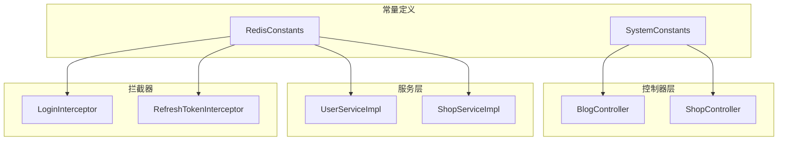
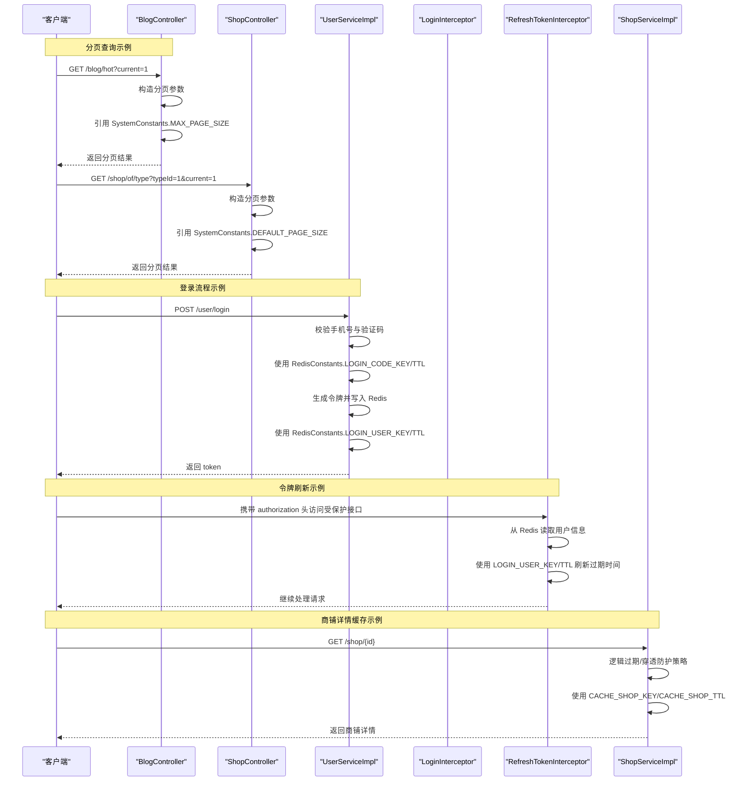
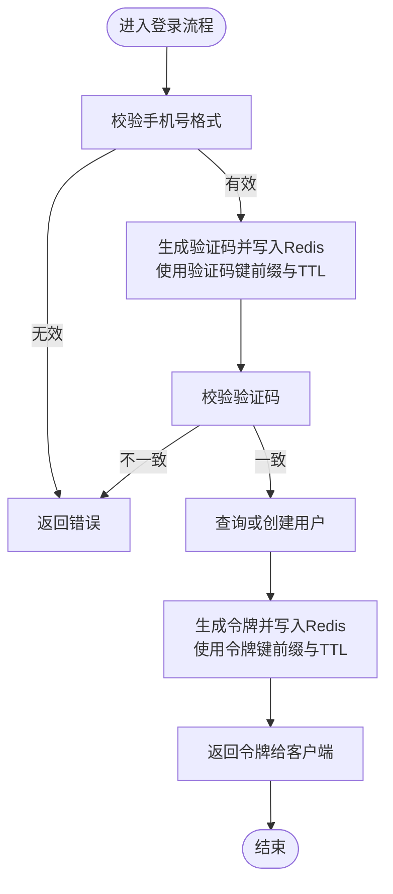
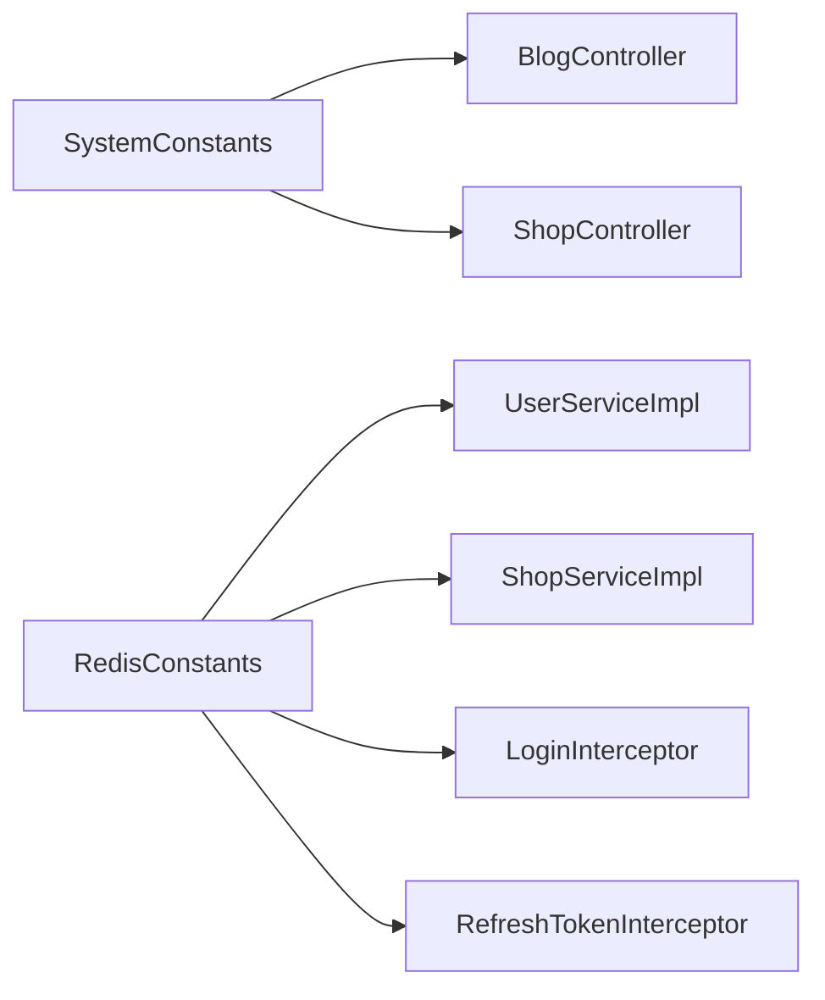

# 系统常量定义

<cite>
**本文引用的文件**   
- [SystemConstants.java](file://src/main/java/com/hmdp/utils/SystemConstants.java)
- [RedisConstants.java](file://src/main/java/com/hmdp/utils/RedisConstants.java)
- [BlogController.java](file://src/main/java/com/hmdp/controller/BlogController.java)
- [ShopController.java](file://src/main/java/com/hmdp/controller/ShopController.java)
- [UserServiceImpl.java](file://src/main/java/com/hmdp/service/impl/UserServiceImpl.java)
- [LoginInterceptor.java](file://src/main/java/com/hmdp/utils/LoginInterceptor.java)
- [RefreshTokenInterceptor.java](file://src/main/java/com/hmdp/utils/RefreshTokenInterceptor.java)
- [ShopServiceImpl.java](file://src/main/java/com/hmdp/service/impl/ShopServiceImpl.java)
</cite>

## 目录
1. [引言](#引言)
2. [项目结构](#项目结构)
3. [核心组件](#核心组件)
4. [架构总览](#架构总览)
5. [详细组件分析](#详细组件分析)
6. [依赖分析](#依赖分析)
7. [性能考虑](#性能考虑)
8. [故障排查指南](#故障排查指南)
9. [结论](#结论)
10. [附录](#附录)

## 引言
本文件聚焦于系统中的“常量集中管理”实践，围绕系统级与业务级常量的设计原则、命名规范、配置项说明、使用场景与维护建议展开。通过梳理分页大小、缓存过期时间、默认值等关键常量，解释其背后的业务规则与性能考量，并提供新增常量的规范与代码审查要点，帮助团队避免“魔法数字”，提升可维护性与一致性。

## 项目结构
常量定义位于 utils 包下，分为两类：
- 系统通用常量：SystemConstants（如图片上传路径、用户昵称前缀、分页大小）
- Redis 相关常量：RedisConstants（登录验证码、登录令牌、各类缓存键与 TTL、分布式锁键等）

这些常量被 Controller、Service、拦截器等广泛引用，形成统一的配置入口。

图表来源
- [SystemConstants.java:1-9](file://src/main/java/com/hmdp/utils/SystemConstants.java#L1-L9)
- [RedisConstants.java:1-25](file://src/main/java/com/hmdp/utils/RedisConstants.java#L1-L25)
- [BlogController.java:1-84](file://src/main/java/com/hmdp/controller/BlogController.java#L1-L84)
- [ShopController.java:1-101](file://src/main/java/com/hmdp/controller/ShopController.java#L1-L101)
- [UserServiceImpl.java:1-110](file://src/main/java/com/hmdp/service/impl/UserServiceImpl.java#L1-L110)
- [LoginInterceptor.java:1-31](file://src/main/java/com/hmdp/utils/LoginInterceptor.java#L1-L31)
- [RefreshTokenInterceptor.java:1-51](file://src/main/java/com/hmdp/utils/RefreshTokenInterceptor.java#L1-L51)
- [ShopServiceImpl.java:1-61](file://src/main/java/com/hmdp/service/impl/ShopServiceImpl.java#L1-L61)

章节来源
- [SystemConstants.java:1-9](file://src/main/java/com/hmdp/utils/SystemConstants.java#L1-L9)
- [RedisConstants.java:1-25](file://src/main/java/com/hmdp/utils/RedisConstants.java#L1-L25)

## 核心组件
本节对两个常量类进行系统性解读，涵盖字段含义、类型选择、命名约定、使用范围及注意事项。

### SystemConstants（系统通用常量）
- 设计目标
  - 统一系统级默认值与边界值，避免在业务代码中散落硬编码。
  - 为分页、资源路径、默认前缀等提供单一事实来源。
- 关键字段与用途
  - 图片上传目录：用于静态资源存储路径的统一配置，便于环境切换与部署迁移。
  - 用户昵称前缀：新用户注册时生成默认昵称的前缀，保证一致性与可读性。
  - 默认分页大小：列表接口默认每页条数，兼顾体验与性能。
  - 最大分页大小：限制单页上限，防止恶意或误用导致的大查询。
- 类型与命名
  - 使用 int 表示数量型阈值，语义清晰且易于比较。
  - 采用全大写加下划线的常量命名风格，符合 Java 常量规范。
- 使用位置
  - 博客与商铺的分页接口均引用该类的分页常量，确保行为一致。

章节来源
- [SystemConstants.java:1-9](file://src/main/java/com/hmdp/utils/SystemConstants.java#L1-L9)
- [BlogController.java:54-82](file://src/main/java/com/hmdp/controller/BlogController.java#L54-L82)
- [ShopController.java:69-99](file://src/main/java/com/hmdp/controller/ShopController.java#L69-L99)

### RedisConstants（Redis 相关常量）
- 设计目标
  - 将登录流程、缓存键、锁键、TTL 等与 Redis 相关的配置集中管理，降低耦合与出错概率。
- 分类与用途
  - 登录验证码：键前缀与过期时间，控制验证码有效期。
  - 登录令牌：键前缀与过期时间，控制用户会话的存活时长。
  - 空值缓存 TTL：针对不存在数据的短 TTL，避免缓存穿透放大。
  - 商铺缓存：键前缀与过期时间，支撑热点数据读取。
  - 商铺类型缓存：独立键空间，便于按维度清理与统计。
  - 商铺锁：分布式锁键前缀与 TTL，保障并发更新安全。
  - 秒杀库存：库存计数键前缀，支撑高并发扣减。
  - 博文点赞集合：记录点赞用户的集合键前缀。
  - 信息流键：动态 feed 数据键前缀。
  - 地理位置索引：基于地理空间的商铺索引键前缀。
  - 用户签到：签到状态键前缀。
- 类型与命名
  - 字符串键使用冒号分隔的层级命名，体现领域与实体的层次关系。
  - TTL 使用 Long 并配合 TimeUnit 明确单位，避免歧义。
- 使用位置
  - 登录流程（发送验证码、登录成功写入令牌）、令牌刷新拦截器、商铺缓存读写与更新等。

章节来源
- [RedisConstants.java:1-25](file://src/main/java/com/hmdp/utils/RedisConstants.java#L1-L25)
- [UserServiceImpl.java:46-100](file://src/main/java/com/hmdp/service/impl/UserServiceImpl.java#L46-L100)
- [RefreshTokenInterceptor.java:25-42](file://src/main/java/com/hmdp/utils/RefreshTokenInterceptor.java#L25-L42)
- [ShopServiceImpl.java:36-58](file://src/main/java/com/hmdp/service/impl/ShopServiceImpl.java#L36-L58)

## 架构总览
下图展示常量在各层的引用关系与典型调用链，突出“常量集中管理”如何贯穿请求处理链路。

图表来源
- [BlogController.java:66-82](file://src/main/java/com/hmdp/controller/BlogController.java#L66-L82)
- [ShopController.java:69-99](file://src/main/java/com/hmdp/controller/ShopController.java#L69-L99)
- [UserServiceImpl.java:46-100](file://src/main/java/com/hmdp/service/impl/UserServiceImpl.java#L46-L100)
- [RefreshTokenInterceptor.java:25-42](file://src/main/java/com/hmdp/utils/RefreshTokenInterceptor.java#L25-L42)
- [ShopServiceImpl.java:36-58](file://src/main/java/com/hmdp/service/impl/ShopServiceImpl.java#L36-L58)

## 详细组件分析

### 分页查询常量与使用
- 默认分页大小
  - 作用：作为列表接口的默认每页条数，平衡用户体验与数据库压力。
  - 使用位置：商铺类型分页接口。
- 最大分页大小
  - 作用：限制单页上限，防止大查询导致性能问题。
  - 使用位置：我的博客、热门博客分页接口。
- 最佳实践
  - 所有分页接口应统一从常量获取 pageSize，禁止在业务方法内硬编码。
  - 前端传参需做边界校验，必要时以常量为上限进行截断。

章节来源
- [SystemConstants.java:5-7](file://src/main/java/com/hmdp/utils/SystemConstants.java#L5-L7)
- [ShopController.java:69-79](file://src/main/java/com/hmdp/controller/ShopController.java#L69-L79)
- [BlogController.java:54-82](file://src/main/java/com/hmdp/controller/BlogController.java#L54-L82)

### 缓存过期时间与键命名
- 登录验证码
  - 键前缀：login:code:
  - TTL：分钟级，适合一次性验证码场景。
- 登录令牌
  - 键前缀：login:token:
  - TTL：秒级，结合拦截器在每次访问时刷新，实现滑动过期。
- 商铺缓存
  - 键前缀：cache:shop:
  - TTL：秒级，适用于热点读多写少场景；更新时需删除对应键。
- 其他键
  - 商铺类型、锁、秒杀库存、点赞集合、信息流、地理索引、签到等，均以冒号分层命名，便于监控与清理。

章节来源
- [RedisConstants.java:4-23](file://src/main/java/com/hmdp/utils/RedisConstants.java#L4-L23)
- [UserServiceImpl.java:56-98](file://src/main/java/com/hmdp/service/impl/UserServiceImpl.java#L56-L98)
- [RefreshTokenInterceptor.java:25-42](file://src/main/java/com/hmdp/utils/RefreshTokenInterceptor.java#L25-L42)
- [ShopServiceImpl.java:36-58](file://src/main/java/com/hmdp/service/impl/ShopServiceImpl.java#L36-L58)

### 默认值与业务规则
- 用户昵称前缀
  - 作用：为新注册用户生成默认昵称，保持格式一致。
  - 使用位置：用户注册流程中自动生成昵称。
- 图片上传目录
  - 作用：集中管理静态资源路径，便于部署与环境切换。
  - 注意：生产环境建议使用可配置化方式（如配置文件），而非硬编码路径。

章节来源
- [SystemConstants.java:4-6](file://src/main/java/com/hmdp/utils/SystemConstants.java#L4-L6)
- [UserServiceImpl.java:102-108](file://src/main/java/com/hmdp/service/impl/UserServiceImpl.java#L102-L108)

### 登录与令牌刷新流程中的常量使用
- 登录流程
  - 发送验证码：使用验证码键前缀与 TTL。
  - 登录成功：生成令牌并写入 Redis，设置令牌 TTL。
- 令牌刷新
  - 拦截器在请求到达时读取用户信息，若存在则刷新 TTL，实现滑动过期。
- 权限校验
  - 前置拦截器检查当前上下文是否已加载用户，未登录直接拒绝。

图表来源
- [UserServiceImpl.java:46-100](file://src/main/java/com/hmdp/service/impl/UserServiceImpl.java#L46-L100)
- [RedisConstants.java:4-7](file://src/main/java/com/hmdp/utils/RedisConstants.java#L4-L7)

章节来源
- [UserServiceImpl.java:46-100](file://src/main/java/com/hmdp/service/impl/UserServiceImpl.java#L46-L100)
- [RefreshTokenInterceptor.java:25-42](file://src/main/java/com/hmdp/utils/RefreshTokenInterceptor.java#L25-L42)
- [LoginInterceptor.java:21-28](file://src/main/java/com/hmdp/utils/LoginInterceptor.java#L21-L28)

## 依赖分析
- 低耦合与高内聚
  - 常量类仅负责声明与暴露，不引入业务逻辑，职责单一。
  - 各层通过静态导入或直接引用常量，减少重复定义与不一致风险。
- 潜在循环依赖
  - 常量类无外部依赖，不会引发循环依赖问题。
- 外部集成点
  - Redis 键与 TTL 由 RedisConstants 统一管理，便于后续迁移到配置中心或环境变量。

图表来源
- [SystemConstants.java:1-9](file://src/main/java/com/hmdp/utils/SystemConstants.java#L1-L9)
- [RedisConstants.java:1-25](file://src/main/java/com/hmdp/utils/RedisConstants.java#L1-L25)
- [BlogController.java:1-84](file://src/main/java/com/hmdp/controller/BlogController.java#L1-L84)
- [ShopController.java:1-101](file://src/main/java/com/hmdp/controller/ShopController.java#L1-L101)
- [UserServiceImpl.java:1-110](file://src/main/java/com/hmdp/service/impl/UserServiceImpl.java#L1-L110)
- [LoginInterceptor.java:1-31](file://src/main/java/com/hmdp/utils/LoginInterceptor.java#L1-L31)
- [RefreshTokenInterceptor.java:1-51](file://src/main/java/com/hmdp/utils/RefreshTokenInterceptor.java#L1-L51)
- [ShopServiceImpl.java:1-61](file://src/main/java/com/hmdp/service/impl/ShopServiceImpl.java#L1-L61)

章节来源
- [SystemConstants.java:1-9](file://src/main/java/com/hmdp/utils/SystemConstants.java#L1-L9)
- [RedisConstants.java:1-25](file://src/main/java/com/hmdp/utils/RedisConstants.java#L1-L25)

## 性能考虑
- 分页大小
  - 合理设置默认与最大分页大小，避免大查询导致的 CPU、内存与 IO 抖动。
- 缓存 TTL
  - 根据数据热度和变更频率设定 TTL，平衡一致性与性能。
  - 对空值设置较短 TTL，缓解缓存穿透带来的数据库压力。
- 令牌刷新
  - 滑动过期机制提升用户体验，但需注意高频刷新对 Redis 的压力，必要时可引入批量或异步刷新策略。

[本节为通用指导，无需具体文件分析]

## 故障排查指南
- 登录失败
  - 检查验证码键是否存在且未过期，确认验证码与手机号匹配。
  - 核对令牌键是否正确写入以及 TTL 是否生效。
- 令牌失效
  - 确认拦截器是否在请求中正确刷新 TTL。
  - 检查客户端是否正确携带 authorization 头。
- 商铺缓存异常
  - 确认缓存键前缀与 ID 拼接是否正确。
  - 更新后是否及时删除对应缓存键，避免脏读。

章节来源
- [UserServiceImpl.java:56-98](file://src/main/java/com/hmdp/service/impl/UserServiceImpl.java#L56-L98)
- [RefreshTokenInterceptor.java:25-42](file://src/main/java/com/hmdp/utils/RefreshTokenInterceptor.java#L25-L42)
- [ShopServiceImpl.java:47-58](file://src/main/java/com/hmdp/service/impl/ShopServiceImpl.java#L47-L58)

## 结论
通过将系统级与业务级常量集中管理，项目实现了以下收益：
- 消除魔法数字与硬编码，提升可读性与可维护性。
- 统一命名与类型约定，降低跨模块沟通成本。
- 便于统一调整与灰度发布，提高系统稳定性。
建议持续完善常量治理，逐步将路径等敏感配置迁移至外部化配置，并建立常量添加与审查规范。

[本节为总结性内容，无需具体文件分析]

## 附录

### 常量扩展最佳实践与维护建议
- 设计原则
  - 单一事实来源：同一概念只在一个常量类中定义。
  - 语义清晰：名称准确表达业务含义，避免缩写歧义。
  - 类型合适：数值型使用 int/long，时间单位配合 TimeUnit 明确。
  - 分组管理：按领域或子系统划分常量类，避免单体过大。
- 命名规范
  - 全大写加下划线，如 DEFAULT_PAGE_SIZE、CACHE_SHOP_TTL。
  - 键名采用冒号分层，如 login:token:、cache:shop:。
- 配置外化
  - 对于易变的环境相关值（如路径、端口、超时），优先使用配置文件或配置中心。
- 文档与注释
  - 每个常量应有简短注释说明用途、单位与约束。
- 测试覆盖
  - 对涉及阈值的逻辑（如分页上限、TTL）编写单元测试，验证边界行为。

### 新常量添加规范与代码审查要点
- 新增步骤
  - 确定所属领域与常量类，避免随意新建类。
  - 定义常量并补充注释，说明业务含义与使用场景。
  - 在需要处替换硬编码，确保全局一致。
- 审查要点
  - 是否消除了魔法数字？
  - 命名是否符合规范？
  - 类型与单位是否明确？
  - 是否影响现有功能（回归测试）？
  - 是否需要配置外化或版本兼容方案？

[本节为通用指导，无需具体文件分析]