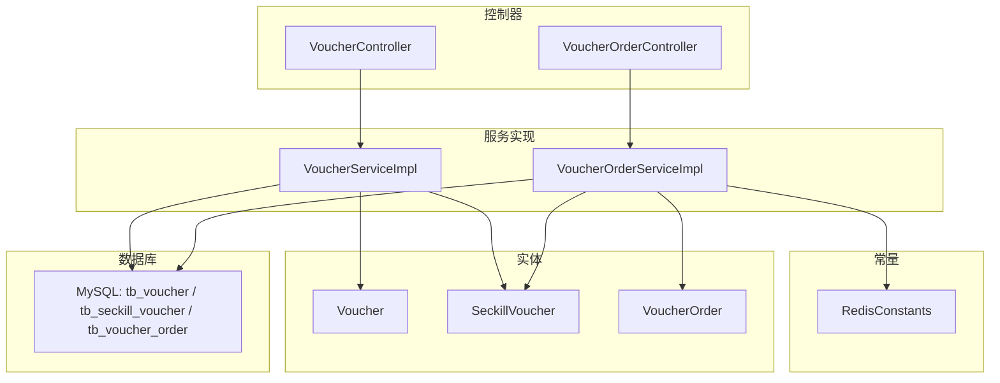
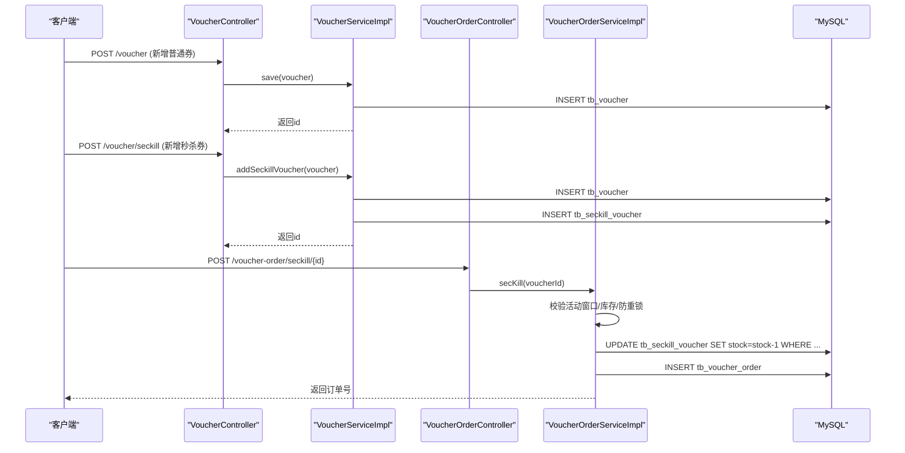
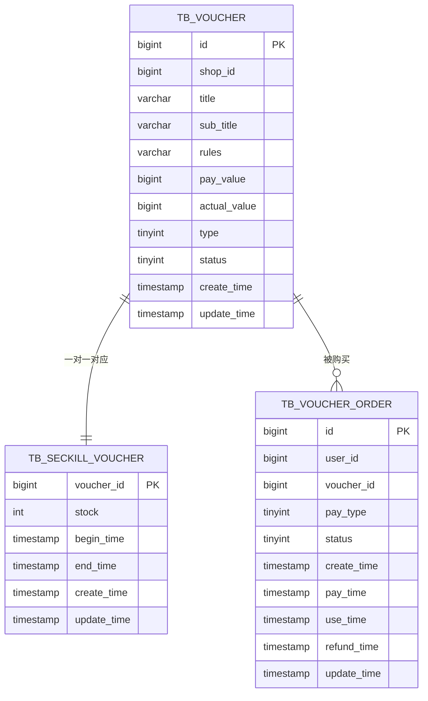
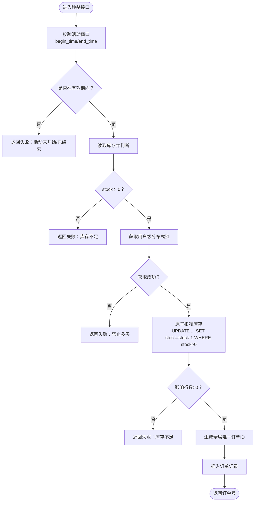
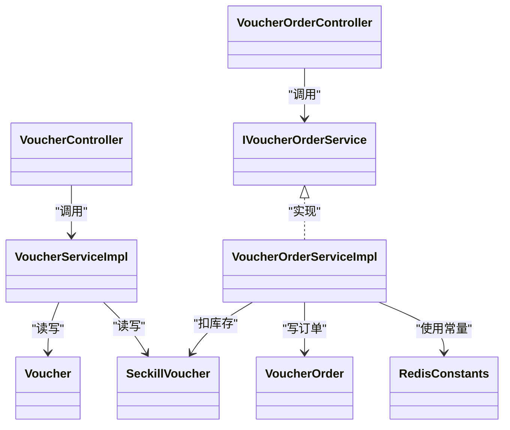

# 优惠券数据模型

<cite>
**本文引用的文件列表**
- [Voucher.java](file://src/main/java/com/hmdp/entity/Voucher.java)
- [SeckillVoucher.java](file://src/main/java/com/hmdp/entity/SeckillVoucher.java)
- [VoucherOrder.java](file://src/main/java/com/hmdp/entity/VoucherOrder.java)
- [hmdp.sql](file://src/main/resources/db/hmdp.sql)
- [VoucherController.java](file://src/main/java/com/hmdp/controller/VoucherController.java)
- [VoucherServiceImpl.java](file://src/main/java/com/hmdp/service/impl/VoucherServiceImpl.java)
- [VoucherOrderController.java](file://src/main/java/com/hmdp/controller/VoucherOrderController.java)
- [IVoucherOrderService.java](file://src/main/java/com/hmdp/service/IVoucherOrderService.java)
- [VoucherOrderServiceImpl.java](file://src/main/java/com/hmdp/service/impl/VoucherOrderServiceImpl.java)
- [RedisConstants.java](file://src/main/java/com/hmdp/utils/RedisConstants.java)
</cite>

## 目录
1. [引言](#引言)
2. [项目结构](#项目结构)
3. [核心组件](#核心组件)
4. [架构总览](#架构总览)
5. [详细组件分析](#详细组件分析)
6. [依赖关系分析](#依赖关系分析)
7. [性能与高并发设计](#性能与高并发设计)
8. [故障排查指南](#故障排查指南)
9. [结论](#结论)
10. [附录](#附录)

## 引言
本文件围绕优惠券模块的数据模型进行系统化说明，重点覆盖以下三张表：
- tb_voucher（普通券）
- tb_seckill_voucher（秒杀券）
- tb_voucher_order（订单）

文档将详细说明字段定义、数据类型与业务含义；解释普通券与秒杀券的区别设计、库存管理机制与订单处理流程；阐述发放策略、使用限制与有效期控制；并给出高并发场景下的库存扣减方案、事务一致性与幂等性保证建议。同时提供数据统计分析与报表支持思路，以及数据归档与历史数据管理策略。

## 项目结构
优惠券相关代码采用分层组织：
- 实体层：Voucher、SeckillVoucher、VoucherOrder
- 控制器层：VoucherController、VoucherOrderController
- 服务层：VoucherServiceImpl、IVoucherOrderService、VoucherOrderServiceImpl
- 常量与工具：RedisConstants（包含秒杀库存键名）
- 数据库脚本：hmdp.sql（含三张核心表的建表语句）

图表来源
- [VoucherController.java:1-57](file://src/main/java/com/hmdp/controller/VoucherController.java#L1-L57)
- [VoucherOrderController.java:1-33](file://src/main/java/com/hmdp/controller/VoucherOrderController.java#L1-L33)
- [VoucherServiceImpl.java:1-51](file://src/main/java/com/hmdp/service/impl/VoucherServiceImpl.java#L1-L51)
- [VoucherOrderServiceImpl.java:1-105](file://src/main/java/com/hmdp/service/impl/VoucherOrderServiceImpl.java#L1-L105)
- [RedisConstants.java:1-24](file://src/main/java/com/hmdp/utils/RedisConstants.java#L1-L24)
- [hmdp.sql:1239-1278](file://src/main/resources/db/hmdp.sql#L1239-L1278)

章节来源
- [VoucherController.java:1-57](file://src/main/java/com/hmdp/controller/VoucherController.java#L1-L57)
- [VoucherOrderController.java:1-33](file://src/main/java/com/hmdp/controller/VoucherOrderController.java#L1-L33)
- [VoucherServiceImpl.java:1-51](file://src/main/java/com/hmdp/service/impl/VoucherServiceImpl.java#L1-L51)
- [VoucherOrderServiceImpl.java:1-105](file://src/main/java/com/hmdp/service/impl/VoucherOrderServiceImpl.java#L1-L105)
- [RedisConstants.java:1-24](file://src/main/java/com/hmdp/utils/RedisConstants.java#L1-L24)
- [hmdp.sql:1239-1278](file://src/main/resources/db/hmdp.sql#L1239-L1278)

## 核心组件
本节聚焦三张核心表及其对应的实体类，梳理字段、类型与业务语义。

### 表：tb_voucher（普通券）
- id：主键，自增
- shop_id：关联商铺ID
- title：代金券标题
- sub_title：副标题
- rules：使用规则
- pay_value：支付金额（单位分）
- actual_value：抵扣金额（单位分）
- type：类型（0=普通券；1=秒杀券）
- status：状态（1=上架；2=下架；3=过期）
- create_time：创建时间
- update_time：更新时间

对应实体字段与注解映射见：
- [Voucher.java:1-106](file://src/main/java/com/hmdp/entity/Voucher.java#L1-L106)
- [hmdp.sql 中 tb_voucher 定义:1239-1255](file://src/main/resources/db/hmdp.sql#L1239-L1255)

业务要点
- 通过 type 区分普通券与秒杀券，便于统一展示与查询。
- status 用于生命周期控制（上架/下架/过期），配合前端展示与可用性校验。

章节来源
- [Voucher.java:1-106](file://src/main/java/com/hmdp/entity/Voucher.java#L1-L106)
- [hmdp.sql:1239-1255](file://src/main/resources/db/hmdp.sql#L1239-L1255)

### 表：tb_seckill_voucher（秒杀券）
- voucher_id：主键，与 tb_voucher.id 一对一
- stock：库存
- begin_time：生效时间
- end_time：失效时间
- create_time：创建时间
- update_time：更新时间

对应实体字段与注解映射见：
- [SeckillVoucher.java:1-62](file://src/main/java/com/hmdp/entity/SeckillVoucher.java#L1-L62)
- [hmdp.sql 中 tb_seckill_voucher 定义:85-96](file://src/main/resources/db/hmdp.sql#L85-L96)

业务要点
- 独立维护库存与活动窗口，避免与普通券混用导致超卖或误判。
- 与 tb_voucher 通过 voucher_id 建立一对一关系，便于统一查询与扩展。

章节来源
- [SeckillVoucher.java:1-62](file://src/main/java/com/hmdp/entity/SeckillVoucher.java#L1-L62)
- [hmdp.sql:85-96](file://src/main/resources/db/hmdp.sql#L85-L96)

### 表：tb_voucher_order（订单）
- id：主键（由分布式ID生成器生成）
- user_id：下单用户ID
- voucher_id：购买的代金券ID
- pay_type：支付方式（1=余额；2=支付宝；3=微信）
- status：订单状态（1=未支付；2=已支付；3=已核销；4=已取消；5=退款中；6=已退款）
- create_time：下单时间
- pay_time：支付时间
- use_time：核销时间
- refund_time：退款时间
- update_time：更新时间

对应实体字段与注解映射见：
- [VoucherOrder.java:1-82](file://src/main/java/com/hmdp/entity/VoucherOrder.java#L1-L82)
- [hmdp.sql 中 tb_voucher_order 定义:1263-1278](file://src/main/resources/db/hmdp.sql#L1263-L1278)

业务要点
- 订单状态机完整覆盖购买、支付、核销、退款全链路。
- 使用分布式ID确保全局唯一，避免重复下单。

章节来源
- [VoucherOrder.java:1-82](file://src/main/java/com/hmdp/entity/VoucherOrder.java#L1-L82)
- [hmdp.sql:1263-1278](file://src/main/resources/db/hmdp.sql#L1263-L1278)

## 架构总览
优惠券模块的调用路径如下：
- 新增普通券：VoucherController.addVoucher → VoucherServiceImpl.save → MySQL
- 新增秒杀券：VoucherController.addSeckillVoucher → VoucherServiceImpl.addSeckillVoucher（事务内写入 tb_voucher 与 tb_seckill_voucher）
- 秒杀下单：VoucherOrderController.seckillVoucher → IVoucherOrderService.secKill → VoucherOrderServiceImpl.createVoucherOrder（检查活动窗口、库存、防重锁、扣库存、落库订单）

图表来源
- [VoucherController.java:1-57](file://src/main/java/com/hmdp/controller/VoucherController.java#L1-L57)
- [VoucherServiceImpl.java:1-51](file://src/main/java/com/hmdp/service/impl/VoucherServiceImpl.java#L1-L51)
- [VoucherOrderController.java:1-33](file://src/main/java/com/hmdp/controller/VoucherOrderController.java#L1-L33)
- [VoucherOrderServiceImpl.java:1-105](file://src/main/java/com/hmdp/service/impl/VoucherOrderServiceImpl.java#L1-L105)
- [hmdp.sql:85-96](file://src/main/resources/db/hmdp.sql#L85-L96)
- [hmdp.sql:1239-1278](file://src/main/resources/db/hmdp.sql#L1239-L1278)

## 详细组件分析

### 数据模型与关系图

图表来源
- [hmdp.sql:85-96](file://src/main/resources/db/hmdp.sql#L85-L96)
- [hmdp.sql:1239-1278](file://src/main/resources/db/hmdp.sql#L1239-L1278)

### 普通券 vs 秒杀券的设计差异
- 普通券：仅记录在 tb_voucher，无独立库存字段，通常不限制数量或采用其他策略。
- 秒杀券：在 tb_voucher.type=1 标记为秒杀券，并在 tb_seckill_voucher 维护 stock、begin_time、end_time，严格限流与限时限量。

章节来源
- [Voucher.java:1-106](file://src/main/java/com/hmdp/entity/Voucher.java#L1-L106)
- [SeckillVoucher.java:1-62](file://src/main/java/com/hmdp/entity/SeckillVoucher.java#L1-L62)
- [hmdp.sql:1239-1255](file://src/main/resources/db/hmdp.sql#L1239-L1255)
- [hmdp.sql:85-96](file://src/main/resources/db/hmdp.sql#L85-L96)

### 库存管理机制
- 库存存储：tb_seckill_voucher.stock
- 扣减方式：基于数据库行级条件更新，防止超卖
  - 参考实现位置：[VoucherOrderServiceImpl.createVoucherOrder:77-103](file://src/main/java/com/hmdp/service/impl/VoucherOrderServiceImpl.java#L77-L103)
- 活动窗口校验：begin_time/end_time 判断是否可参与秒杀
  - 参考实现位置：[VoucherOrderServiceImpl.secKill:47-75](file://src/main/java/com/hmdp/service/impl/VoucherOrderServiceImpl.java#L47-L75)

章节来源
- [VoucherOrderServiceImpl.java:47-103](file://src/main/java/com/hmdp/service/impl/VoucherOrderServiceImpl.java#L47-L103)
- [SeckillVoucher.java:1-62](file://src/main/java/com/hmdp/entity/SeckillVoucher.java#L1-L62)

### 订单处理流程
- 入口：POST /voucher-order/seckill/{id}
- 关键步骤：
  1) 获取当前用户ID
  2) 校验活动窗口与库存
  3) 加分布式锁（按用户维度）防止重复下单
  4) 原子扣减库存（stock > 0 条件）
  5) 生成全局唯一订单ID并落库
- 参考实现位置：
  - [VoucherOrderController.seckillVoucher:29-32](file://src/main/java/com/hmdp/controller/VoucherOrderController.java#L29-L32)
  - [IVoucherOrderService.secKill/createVoucherOrder:15-18](file://src/main/java/com/hmdp/service/IVoucherOrderService.java#L15-L18)
  - [VoucherOrderServiceImpl.secKill/createVoucherOrder:47-103](file://src/main/java/com/hmdp/service/impl/VoucherOrderServiceImpl.java#L47-L103)

图表来源
- [VoucherOrderServiceImpl.java:47-103](file://src/main/java/com/hmdp/service/impl/VoucherOrderServiceImpl.java#L47-L103)

### 发放策略、使用限制与有效期控制
- 发放策略
  - 普通券：直接入库 tb_voucher，type=0
  - 秒杀券：事务内同时写入 tb_voucher（type=1）与 tb_seckill_voucher（stock、begin_time、end_time）
    - 参考实现位置：[VoucherServiceImpl.addSeckillVoucher:38-50](file://src/main/java/com/hmdp/service/impl/VoucherServiceImpl.java#L38-L50)
- 使用限制
  - 同一用户同一券不可重复下单（基于用户+券ID计数判断）
    - 参考实现位置：[VoucherOrderServiceImpl.createVoucherOrder:77-103](file://src/main/java/com/hmdp/service/impl/VoucherOrderServiceImpl.java#L77-L103)
- 有效期控制
  - 秒杀券以 begin_time/end_time 控制活动窗口
    - 参考实现位置：[VoucherOrderServiceImpl.secKill:47-75](file://src/main/java/com/hmdp/service/impl/VoucherOrderServiceImpl.java#L47-L75)

章节来源
- [VoucherServiceImpl.java:38-50](file://src/main/java/com/hmdp/service/impl/VoucherServiceImpl.java#L38-L50)
- [VoucherOrderServiceImpl.java:47-103](file://src/main/java/com/hmdp/service/impl/VoucherOrderServiceImpl.java#L47-L103)

### 高并发库存扣减方案、事务一致性与幂等性保证
- 库存扣减
  - 使用数据库条件更新：stock = stock - 1 AND stock > 0，避免超卖
    - 参考实现位置：[VoucherOrderServiceImpl.createVoucherOrder:85-92](file://src/main/java/com/hmdp/service/impl/VoucherOrderServiceImpl.java#L85-L92)
- 事务一致性
  - 新增秒杀券时，写入 tb_voucher 与 tb_seckill_voucher 使用 @Transactional 保证原子性
    - 参考实现位置：[VoucherServiceImpl.addSeckillVoucher:38-50](file://src/main/java/com/hmdp/service/impl/VoucherServiceImpl.java#L38-L50)
  - 下单扣库存与写订单在同一事务内（方法上标注事务）
    - 参考实现位置：[VoucherOrderServiceImpl.createVoucherOrder:77-103](file://src/main/java/com/hmdp/service/impl/VoucherOrderServiceImpl.java#L77-L103)
- 幂等性
  - 用户级分布式锁（lock:order:{userId}）防止同一用户重复提交
    - 参考实现位置：[VoucherOrderServiceImpl.secKill:62-74](file://src/main/java/com/hmdp/service/impl/VoucherOrderServiceImpl.java#L62-L74)
  - 业务层幂等：同一用户同一券只允许一次下单（计数判断）
    - 参考实现位置：[VoucherOrderServiceImpl.createVoucherOrder:77-83](file://src/main/java/com/hmdp/service/impl/VoucherOrderServiceImpl.java#L77-L83)
- Redis 常量
  - 秒杀库存键名常量：SECKILL_STOCK_KEY
    - 参考实现位置：[RedisConstants.java:19-19](file://src/main/java/com/hmdp/utils/RedisConstants.java#L19-L19)

章节来源
- [VoucherServiceImpl.java:38-50](file://src/main/java/com/hmdp/service/impl/VoucherServiceImpl.java#L38-L50)
- [VoucherOrderServiceImpl.java:47-103](file://src/main/java/com/hmdp/service/impl/VoucherOrderServiceImpl.java#L47-L103)
- [RedisConstants.java:1-24](file://src/main/java/com/hmdp/utils/RedisConstants.java#L1-L24)

### 数据统计分析与报表生成支持
- 可用维度
  - 按店铺统计：结合 tb_voucher.shop_id 聚合销量、收入
  - 按券类型统计：type=0/1 分别统计领取/购买量
  - 按时间段统计：create_time/pay_time/use_time 做趋势分析
  - 按用户维度：user_id 统计复购率、活跃度
- 建议指标
  - 领取量、核销率、退款率、ROI（pay_value 与 actual_value 对比）
  - 库存周转：stock 变化速率
- 实现建议
  - 基于现有表字段编写聚合SQL或视图，定期导出报表
  - 对高频查询字段建立索引（如 shop_id、status、create_time）

[本节为通用分析建议，不直接引用具体代码文件]

### 数据归档策略与历史数据管理
- 归档目标
  - 将长期未使用的订单与券信息迁移至历史表或归档库，降低热表压力
- 归档策略
  - 按时间分区：依据 create_time/use_time 划分月度/季度分区
  - 冷热分离：超过一定时间的“已退款/已取消”订单迁移到归档库
  - 保留策略：根据合规要求保留最小必要周期
- 实施建议
  - 使用定时任务批量迁移，注意分批与事务边界
  - 归档后保留必要索引与审计字段，便于追溯

[本节为通用策略建议，不直接引用具体代码文件]

## 依赖关系分析
- 控制器与服务
  - VoucherController 依赖 VoucherServiceImpl
  - VoucherOrderController 依赖 IVoucherOrderService 的实现 VoucherOrderServiceImpl
- 服务与实体/数据库
  - VoucherServiceImpl 操作 tb_voucher 与 tb_seckill_voucher
  - VoucherOrderServiceImpl 操作 tb_seckill_voucher 与 tb_voucher_order
- 常量与中间件
  - RedisConstants 提供秒杀库存键名常量
  - 分布式锁与ID生成器在服务实现中使用

图表来源
- [VoucherController.java:1-57](file://src/main/java/com/hmdp/controller/VoucherController.java#L1-L57)
- [VoucherServiceImpl.java:1-51](file://src/main/java/com/hmdp/service/impl/VoucherServiceImpl.java#L1-L51)
- [VoucherOrderController.java:1-33](file://src/main/java/com/hmdp/controller/VoucherOrderController.java#L1-L33)
- [IVoucherOrderService.java:1-18](file://src/main/java/com/hmdp/service/IVoucherOrderService.java#L1-L18)
- [VoucherOrderServiceImpl.java:1-105](file://src/main/java/com/hmdp/service/impl/VoucherOrderServiceImpl.java#L1-L105)
- [RedisConstants.java:1-24](file://src/main/java/com/hmdp/utils/RedisConstants.java#L1-L24)

章节来源
- [VoucherController.java:1-57](file://src/main/java/com/hmdp/controller/VoucherController.java#L1-L57)
- [VoucherServiceImpl.java:1-51](file://src/main/java/com/hmdp/service/impl/VoucherServiceImpl.java#L1-L51)
- [VoucherOrderController.java:1-33](file://src/main/java/com/hmdp/controller/VoucherOrderController.java#L1-L33)
- [IVoucherOrderService.java:1-18](file://src/main/java/com/hmdp/service/IVoucherOrderService.java#L1-L18)
- [VoucherOrderServiceImpl.java:1-105](file://src/main/java/com/hmdp/service/impl/VoucherOrderServiceImpl.java#L1-L105)
- [RedisConstants.java:1-24](file://src/main/java/com/hmdp/utils/RedisConstants.java#L1-L24)

## 性能与高并发设计
- 库存扣减
  - 使用数据库条件更新减少竞争与超卖风险
  - 建议在 stock 列建立合适索引以提升更新效率
- 分布式锁
  - 用户级锁避免重复提交，提升幂等性
- 事务边界
  - 新增秒杀券与下单扣库存均置于事务中，保障一致性
- 缓存与常量
  - 利用 RedisConstants 统一管理键名，便于后续引入缓存预热与限流

[本节为通用性能建议，不直接引用具体代码文件]

## 故障排查指南
- 常见问题定位
  - 活动未开始/已结束：检查 begin_time/end_time 与当前时间
    - 参考实现位置：[VoucherOrderServiceImpl.secKill:47-75](file://src/main/java/com/hmdp/service/impl/VoucherOrderServiceImpl.java#L47-L75)
  - 库存不足：检查 stock 是否为0或扣减失败
    - 参考实现位置：[VoucherOrderServiceImpl.createVoucherOrder:85-92](file://src/main/java/com/hmdp/service/impl/VoucherOrderServiceImpl.java#L85-L92)
  - 重复下单：检查用户级锁与业务幂等逻辑
    - 参考实现位置：[VoucherOrderServiceImpl.secKill:62-74](file://src/main/java/com/hmdp/service/impl/VoucherOrderServiceImpl.java#L62-L74)
- 日志与监控
  - 建议在关键分支增加日志输出，记录用户ID、券ID、库存变化与结果码
  - 监控数据库慢查询与锁等待，优化索引与事务范围

章节来源
- [VoucherOrderServiceImpl.java:47-103](file://src/main/java/com/hmdp/service/impl/VoucherOrderServiceImpl.java#L47-L103)

## 结论
本数据模型通过 tb_voucher 与 tb_seckill_voucher 的解耦设计，清晰区分了普通券与秒杀券的业务特性；借助 tb_voucher_order 完整记录了订单生命周期。在高并发场景下，通过数据库条件更新、分布式锁与事务控制，实现了库存安全与幂等性保障。在此基础上，可进一步扩展统计分析、报表生成与数据归档能力，以满足运营与合规需求。

## 附录
- 核心表DDL参考
  - tb_seckill_voucher：[hmdp.sql:85-96](file://src/main/resources/db/hmdp.sql#L85-L96)
  - tb_voucher：[hmdp.sql:1239-1255](file://src/main/resources/db/hmdp.sql#L1239-L1255)
  - tb_voucher_order：[hmdp.sql:1263-1278](file://src/main/resources/db/hmdp.sql#L1263-L1278)

章节来源
- [hmdp.sql:85-96](file://src/main/resources/db/hmdp.sql#L85-L96)
- [hmdp.sql:1239-1278](file://src/main/resources/db/hmdp.sql#L1239-L1278)