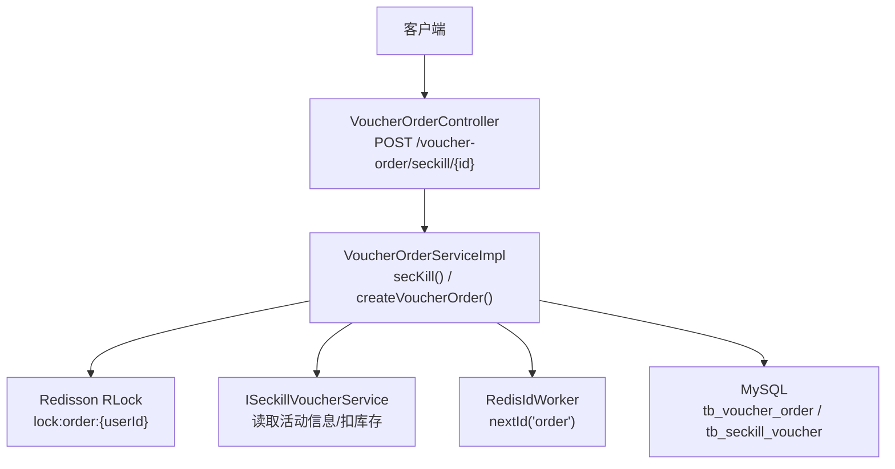
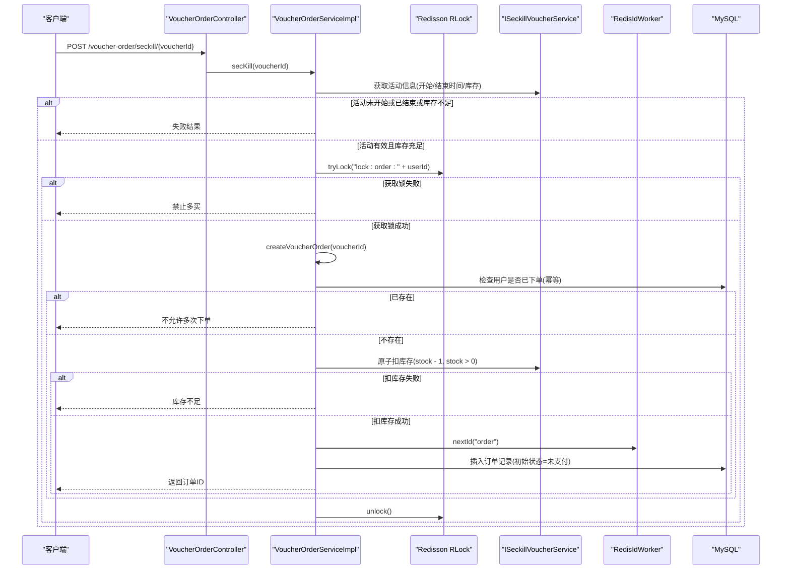
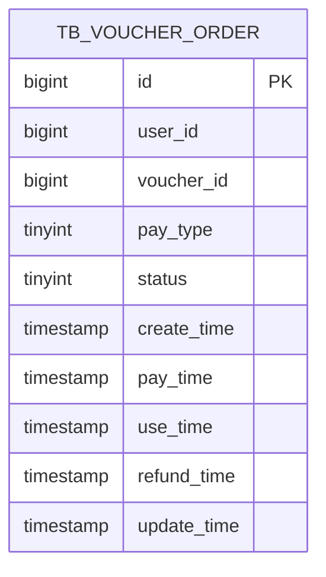
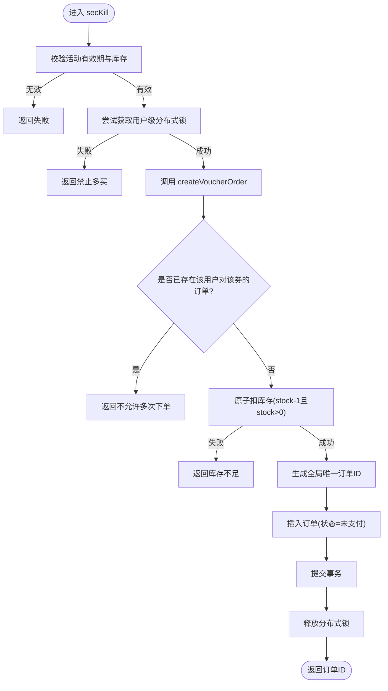
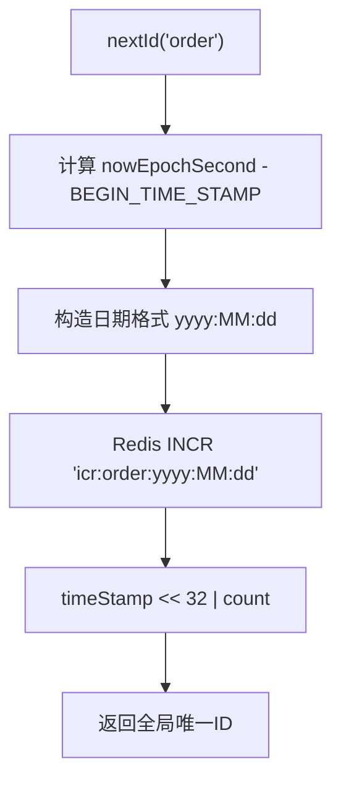
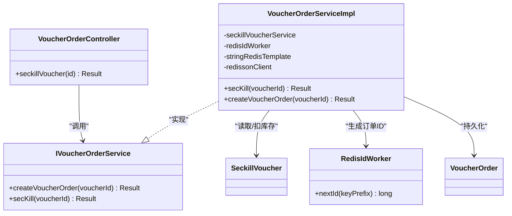

# 优惠券订单模型

<cite>
**本文引用的文件**   
- [VoucherOrder.java](file://src/main/java/com/hmdp/entity/VoucherOrder.java)
- [VoucherOrderServiceImpl.java](file://src/main/java/com/hmdp/service/impl/VoucherOrderServiceImpl.java)
- [IVoucherOrderService.java](file://src/main/java/com/hmdp/service/IVoucherOrderService.java)
- [VoucherOrderController.java](file://src/main/java/com/hmdp/controller/VoucherOrderController.java)
- [RedisIdWorker.java](file://src/main/java/com/hmdp/utils/RedisIdWorker.java)
- [SeckillVoucher.java](file://src/main/java/com/hmdp/entity/SeckillVoucher.java)
- [hmdp.sql](file://src/main/resources/db/hmdp.sql)
</cite>

## 目录
1. [简介](#简介)
2. [项目结构](#项目结构)
3. [核心组件](#核心组件)
4. [架构总览](#架构总览)
5. [详细组件分析](#详细组件分析)
6. [依赖关系分析](#依赖关系分析)
7. [性能与可扩展性](#性能与可扩展性)
8. [故障排查指南](#故障排查指南)
9. [结论](#结论)
10. [附录](#附录)

## 简介
本文件围绕优惠券订单表 tb_voucher_order 的数据模型与业务实现，系统化说明订单生命周期、状态流转、事务处理、创建流程、支付集成点、退款处理、去重与幂等、异常补偿、查询优化与分页、统计分析、归档策略与审计日志、订单号生成策略、用户/商户/优惠券关联关系及一致性保证。文档同时给出关键流程图与时序图，帮助读者快速理解并落地扩展。

## 项目结构
围绕优惠券订单的核心代码分布在以下位置：
- 实体层：订单实体映射到 tb_voucher_order
- 控制层：提供秒杀下单接口
- 服务层：封装下单、库存扣减、幂等校验、分布式锁、事务边界
- 工具层：分布式唯一ID生成器
- 数据层：MySQL 表结构与索引定义

图表来源
- [VoucherOrderController.java](file://src/main/java/com/hmdp/controller/VoucherOrderController.java)
- [VoucherOrderServiceImpl.java](file://src/main/java/com/hmdp/service/impl/VoucherOrderServiceImpl.java)
- [RedisIdWorker.java](file://src/main/java/com/hmdp/utils/RedisIdWorker.java)
- [SeckillVoucher.java](file://src/main/java/com/hmdp/entity/SeckillVoucher.java)
- [hmdp.sql](file://src/main/resources/db/hmdp.sql)

章节来源
- [VoucherOrderController.java](file://src/main/java/com/hmdp/controller/VoucherOrderController.java)
- [VoucherOrderServiceImpl.java](file://src/main/java/com/hmdp/service/impl/VoucherOrderServiceImpl.java)
- [RedisIdWorker.java](file://src/main/java/com/hmdp/utils/RedisIdWorker.java)
- [SeckillVoucher.java](file://src/main/java/com/hmdp/entity/SeckillVoucher.java)
- [hmdp.sql](file://src/main/resources/db/hmdp.sql)

## 核心组件
- 订单实体 VoucherOrder：映射 tb_voucher_order，包含主键、用户ID、券ID、支付方式、订单状态、各阶段时间戳等字段。
- 订单服务 VoucherOrderServiceImpl：实现 secKill（秒杀入口）与 createVoucherOrder（下单落库），包含幂等校验、库存扣减、分布式锁、事务边界。
- 控制器 VoucherOrderController：暴露 POST /voucher-order/seckill/{id} 接口。
- 唯一ID生成 RedisIdWorker：基于“时间戳+序列号”的分布式ID生成策略。
- 秒杀券 SeckillVoucher：与优惠券一对一，维护库存与活动时间。

章节来源
- [VoucherOrder.java](file://src/main/java/com/hmdp/entity/VoucherOrder.java)
- [VoucherOrderServiceImpl.java](file://src/main/java/com/hmdp/service/impl/VoucherOrderServiceImpl.java)
- [VoucherOrderController.java](file://src/main/java/com/hmdp/controller/VoucherOrderController.java)
- [RedisIdWorker.java](file://src/main/java/com/hmdp/utils/RedisIdWorker.java)
- [SeckillVoucher.java](file://src/main/java/com/hmdp/entity/SeckillVoucher.java)

## 架构总览
订单创建时序如下：

图表来源
- [VoucherOrderController.java](file://src/main/java/com/hmdp/controller/VoucherOrderController.java)
- [VoucherOrderServiceImpl.java](file://src/main/java/com/hmdp/service/impl/VoucherOrderServiceImpl.java)
- [RedisIdWorker.java](file://src/main/java/com/hmdp/utils/RedisIdWorker.java)
- [SeckillVoucher.java](file://src/main/java/com/hmdp/entity/SeckillVoucher.java)
- [hmdp.sql](file://src/main/resources/db/hmdp.sql)

## 详细组件分析

### 数据模型与字段语义
- 表名：tb_voucher_order
- 主键：id（bigint，非自增，由应用侧生成）
- 用户维度：user_id（下单用户ID）
- 券维度：voucher_id（购买的代金券ID）
- 支付维度：pay_type（1余额；2支付宝；3微信）
- 状态维度：status（1未支付；2已支付；3已核销；4已取消；5退款中；6已退款）
- 时间维度：create_time/pay_time/use_time/refund_time/update_time

图表来源
- [hmdp.sql](file://src/main/resources/db/hmdp.sql)

章节来源
- [VoucherOrder.java](file://src/main/java/com/hmdp/entity/VoucherOrder.java)
- [hmdp.sql](file://src/main/resources/db/hmdp.sql)

### 订单状态枚举与转换规则
- 状态值定义
  - 1：未支付
  - 2：已支付
  - 3：已核销
  - 4：已取消
  - 5：退款中
  - 6：已退款
- 典型转换路径
  - 未支付 → 已支付：支付回调成功后更新
  - 已支付 → 已核销：线下核销或线上使用成功后更新
  - 未支付 → 已取消：超时未支付自动取消
  - 已支付 → 退款中：发起退款
  - 退款中 → 已退款：退款完成
  - 已支付 → 已取消：部分场景允许直接取消（需结合业务策略）

注意：当前下单流程仅写入“未支付”状态，后续支付、核销、退款的状态变更需在对应业务流程中更新。

章节来源
- [VoucherOrder.java](file://src/main/java/com/hmdp/entity/VoucherOrder.java)
- [hmdp.sql](file://src/main/resources/db/hmdp.sql)

### 订单创建流程与事务边界
- 入口：POST /voucher-order/seckill/{id}
- 前置校验：活动是否在有效期内、库存是否大于0
- 并发控制：以用户维度加分布式锁 lock:order:{userId}，防止同一用户重复提交
- 幂等校验：按 user_id + voucher_id 计数判断是否已下单
- 库存扣减：通过 ISeckillVoucherService 执行 stock = stock - 1 且 stock > 0 的原子更新
- 订单落库：生成全局唯一订单ID后插入订单记录，初始状态为“未支付”
- 事务范围：createVoucherOrder 方法标注事务注解，确保幂等检查、库存扣减、订单写入的一致性

图表来源
- [VoucherOrderServiceImpl.java](file://src/main/java/com/hmdp/service/impl/VoucherOrderServiceImpl.java)

章节来源
- [VoucherOrderServiceImpl.java](file://src/main/java/com/hmdp/service/impl/VoucherOrderServiceImpl.java)

### 幂等性与去重机制
- 用户级幂等：在 createVoucherOrder 中根据 user_id 与 voucher_id 进行计数判断，若已存在则拒绝重复下单
- 分布式锁：以 lock:order:{userId} 作为用户维度的互斥锁，避免同一用户并发重复提交
- 建议增强：可引入“下单请求ID”或“用户+券+时间窗口”的Redis去重键，进一步抵御网络重试导致的重复

章节来源
- [VoucherOrderServiceImpl.java](file://src/main/java/com/hmdp/service/impl/VoucherOrderServiceImpl.java)

### 订单号生成策略
- 算法：时间戳高位 + 序列号低位拼接
- 时间戳：从固定基准时间起算的秒数，保证单调递增
- 序列号：Redis INCR 按天递增，key 形如 icr:{prefix}:{yyyy:MM:dd}
- 前缀：传入 keyPrefix="order"，最终形成 order 前缀的序列空间
- 位宽：COUNT_BITS=32，将时间戳左移32位后与序列号按位或得到最终ID

图表来源
- [RedisIdWorker.java](file://src/main/java/com/hmdp/utils/RedisIdWorker.java)

章节来源
- [RedisIdWorker.java](file://src/main/java/com/hmdp/utils/RedisIdWorker.java)

### 支付集成与回调
- 当前下单流程不包含真实支付网关交互，仅创建“未支付”订单
- 支付集成建议
  - 支付发起：根据订单ID唤起第三方支付
  - 支付回调：验证签名后，将订单状态由“未支付”更新为“已支付”，并记录 pay_time
  - 幂等保障：回调接口需具备幂等性，依据订单ID与回调流水号去重
  - 对账补偿：定时任务比对支付平台账单与本地订单，修复不一致

章节来源
- [VoucherOrderServiceImpl.java](file://src/main/java/com/hmdp/service/impl/VoucherOrderServiceImpl.java)
- [VoucherOrder.java](file://src/main/java/com/hmdp/entity/VoucherOrder.java)

### 退款处理
- 触发条件：用户申请退款或风控拦截
- 状态流转：已支付 → 退款中 → 已退款
- 关键约束
  - 退款中状态下应阻止再次退款
  - 退款完成后记录 refund_time
  - 退款需与库存/券资源回滚策略配合（视业务而定）

章节来源
- [VoucherOrder.java](file://src/main/java/com/hmdp/entity/VoucherOrder.java)
- [hmdp.sql](file://src/main/resources/db/hmdp.sql)

### 超时取消机制
- 现状：下单时未设置订单过期时间，也未见自动取消逻辑
- 建议方案
  - 在订单表中增加 expire_time 或使用 Redis 缓存订单过期时间
  - 定时任务扫描未支付且超时的订单，将其状态置为“已取消”
  - 取消时需考虑库存回滚与补偿消息

章节来源
- [VoucherOrder.java](file://src/main/java/com/hmdp/entity/VoucherOrder.java)
- [hmdp.sql](file://src/main/resources/db/hmdp.sql)

### 查询优化、分页与统计分析
- 基础查询
  - 按用户查询：WHERE user_id=?
  - 按券查询：WHERE voucher_id=?
  - 按状态查询：WHERE status=?
- 索引建议
  - 复合索引 (user_id, status) 用于用户订单列表与状态筛选
  - 复合索引 (voucher_id, status) 用于券维度统计
  - 单列索引 (create_time) 便于按时间范围查询
- 分页
  - 推荐基于游标的时间分页：last_create_time + limit，避免深翻页性能问题
- 统计分析
  - 日/周/月维度：按 create_time 聚合统计下单量、支付转化率、退款率
  - 券维度：按 voucher_id 统计销量、核销率、退款率
  - 用户维度：按 user_id 统计购买频次、客单价分布

章节来源
- [VoucherOrder.java](file://src/main/java/com/hmdp/entity/VoucherOrder.java)
- [hmdp.sql](file://src/main/resources/db/hmdp.sql)

### 数据归档与审计日志
- 归档策略
  - 冷热分离：超过一定时间（如180天）的历史订单迁移至归档库或冷存储
  - 分区表：按月份或季度对 tb_voucher_order 做水平分区，便于清理与归档
- 审计日志
  - 记录关键事件：创建、支付、核销、取消、退款、状态变更
  - 建议独立审计表或写入日志系统，保留操作人、时间、前后状态快照

章节来源
- [VoucherOrder.java](file://src/main/java/com/hmdp/entity/VoucherOrder.java)
- [hmdp.sql](file://src/main/resources/db/hmdp.sql)

### 关联关系与一致性保证
- 用户关联：user_id 指向 tb_user.id，体现“谁下单”
- 券关联：voucher_id 指向 tb_voucher.id，体现“买了什么券”
- 商户关联：通过券表 tb_voucher.shop_id 间接关联商户
- 一致性保证
  - 下单事务内完成幂等检查、库存扣减、订单写入
  - 库存扣减采用数据库行级条件更新，避免超卖
  - 支付回调与退款回调需幂等，避免重复入账

章节来源
- [VoucherOrder.java](file://src/main/java/com/hmdp/entity/VoucherOrder.java)
- [Voucher.java](file://src/main/java/com/hmdp/entity/Voucher.java)
- [SeckillVoucher.java](file://src/main/java/com/hmdp/entity/SeckillVoucher.java)
- [VoucherOrderServiceImpl.java](file://src/main/java/com/hmdp/service/impl/VoucherOrderServiceImpl.java)
- [hmdp.sql](file://src/main/resources/db/hmdp.sql)

## 依赖关系分析
- 控制器依赖服务接口
- 服务依赖：
  - 秒杀券服务（读取活动信息与扣库存）
  - 分布式锁（Redisson）
  - 唯一ID生成器（Redis）
  - MyBatis-Plus 持久化（订单表）

图表来源
- [VoucherOrderController.java](file://src/main/java/com/hmdp/controller/VoucherOrderController.java)
- [IVoucherOrderService.java](file://src/main/java/com/hmdp/service/IVoucherOrderService.java)
- [VoucherOrderServiceImpl.java](file://src/main/java/com/hmdp/service/impl/VoucherOrderServiceImpl.java)
- [RedisIdWorker.java](file://src/main/java/com/hmdp/utils/RedisIdWorker.java)
- [SeckillVoucher.java](file://src/main/java/com/hmdp/entity/SeckillVoucher.java)
- [VoucherOrder.java](file://src/main/java/com/hmdp/entity/VoucherOrder.java)

章节来源
- [VoucherOrderController.java](file://src/main/java/com/hmdp/controller/VoucherOrderController.java)
- [IVoucherOrderService.java](file://src/main/java/com/hmdp/service/IVoucherOrderService.java)
- [VoucherOrderServiceImpl.java](file://src/main/java/com/hmdp/service/impl/VoucherOrderServiceImpl.java)
- [RedisIdWorker.java](file://src/main/java/com/hmdp/utils/RedisIdWorker.java)
- [SeckillVoucher.java](file://src/main/java/com/hmdp/entity/SeckillVoucher.java)
- [VoucherOrder.java](file://src/main/java/com/hmdp/entity/VoucherOrder.java)

## 性能与可扩展性
- 高并发下单
  - 用户级分布式锁减少热点竞争
  - 库存扣减走数据库条件更新，避免超卖
  - 唯一ID生成基于Redis INCR，具备线性扩展能力
- 读写分离与缓存
  - 读多写少场景可将热门券信息预热至缓存
  - 订单详情可按需缓存，注意失效策略
- 分库分表
  - 当订单量增长到千万级，可按 user_id 或时间维度分片
- 异步化
  - 支付回调、通知、报表统计可异步化处理，降低主链路延迟

[本节为通用指导，无需特定文件引用]

## 故障排查指南
- 重复下单
  - 现象：同一用户多次下单同一券
  - 排查：确认分布式锁是否生效、幂等检查是否命中
- 库存超卖
  - 现象：库存扣成负数
  - 排查：确认扣库存SQL是否为原子更新且带 stock > 0 条件
- 订单号冲突
  - 现象：订单ID重复
  - 排查：确认 RedisIdWorker 的序列号key是否按天隔离、Redis是否可用
- 支付回调重复
  - 现象：订单被重复标记为已支付
  - 排查：回调接口是否幂等，是否基于订单ID与流水号去重
- 超时未取消
  - 现象：长时间未支付订单未被取消
  - 排查：定时任务是否运行、扫描条件是否正确

章节来源
- [VoucherOrderServiceImpl.java](file://src/main/java/com/hmdp/service/impl/VoucherOrderServiceImpl.java)
- [RedisIdWorker.java](file://src/main/java/com/hmdp/utils/RedisIdWorker.java)
- [hmdp.sql](file://src/main/resources/db/hmdp.sql)

## 结论
本模型以简洁的订单表结构支撑了优惠券下单的核心链路，并通过用户级分布式锁与幂等校验保障高并发下的正确性。建议在现有基础上完善支付回调、退款流程、超时取消、索引优化、归档与审计等能力，以满足生产环境的稳定性与可观测性要求。

[本节为总结，无需特定文件引用]

## 附录

### API 定义
- 接口：POST /voucher-order/seckill/{id}
- 功能：秒杀下单
- 入参：路径参数 id（券ID）
- 出参：统一结果对象，包含订单ID或错误信息

章节来源
- [VoucherOrderController.java](file://src/main/java/com/hmdp/controller/VoucherOrderController.java)

### 表结构参考
- 表：tb_voucher_order
- 关键字段：id、user_id、voucher_id、pay_type、status、create_time、pay_time、use_time、refund_time、update_time

章节来源
- [hmdp.sql](file://src/main/resources/db/hmdp.sql)