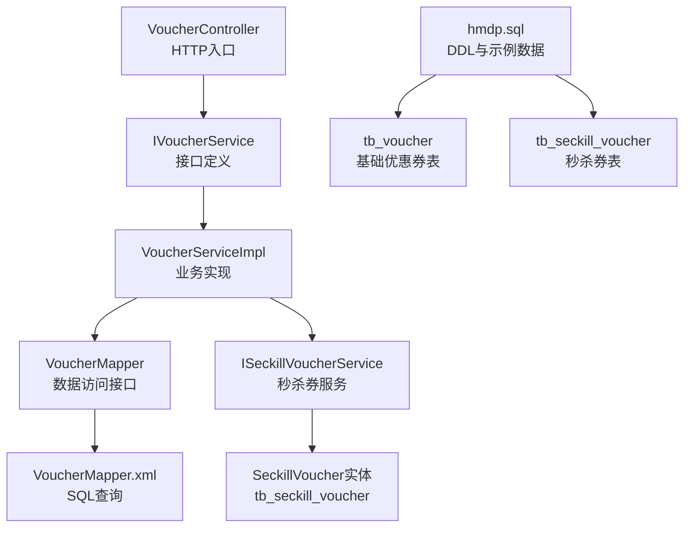
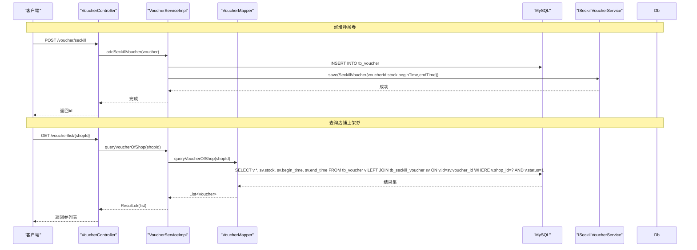
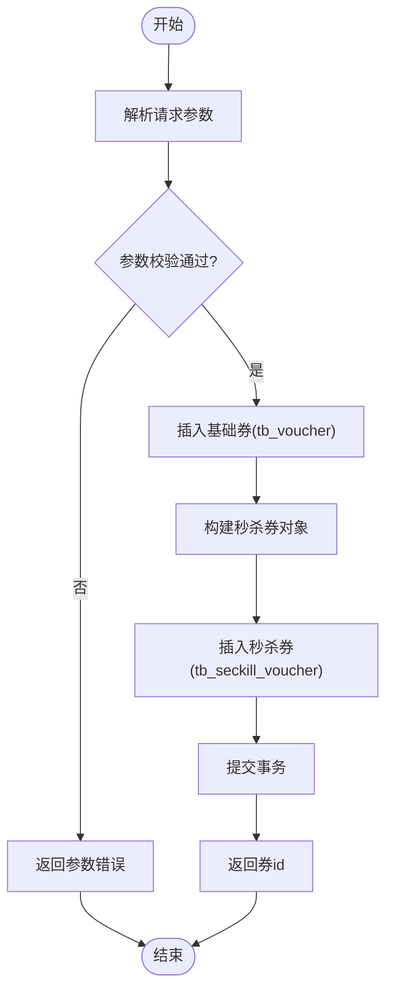
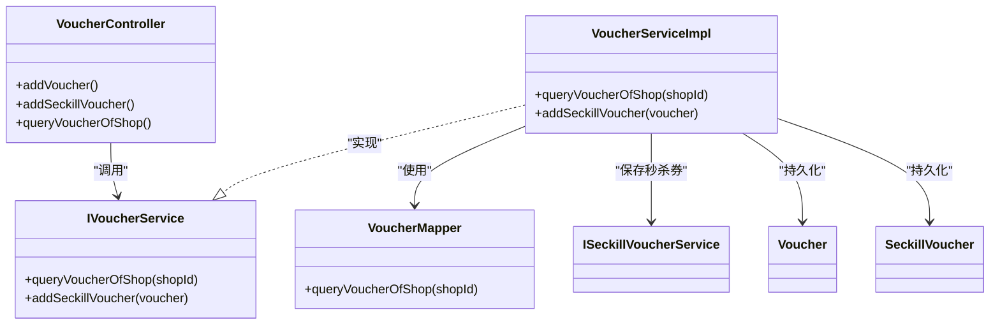

# 基础优惠券模型

<cite>
**本文引用的文件列表**
- [Voucher.java](file://src/main/java/com/hmdp/entity/Voucher.java)
- [SeckillVoucher.java](file://src/main/java/com/hmdp/entity/SeckillVoucher.java)
- [VoucherController.java](file://src/main/java/com/hmdp/controller/VoucherController.java)
- [IVoucherService.java](file://src/main/java/com/hmdp/service/IVoucherService.java)
- [VoucherServiceImpl.java](file://src/main/java/com/hmdp/service/impl/VoucherServiceImpl.java)
- [VoucherMapper.java](file://src/main/java/com/hmdp/mapper/VoucherMapper.java)
- [VoucherMapper.xml](file://src/main/resources/mapper/VoucherMapper.xml)
- [hmdp.sql](file://src/main/resources/db/hmdp.sql)
</cite>

## 目录
1. [简介](#简介)
2. [项目结构](#项目结构)
3. [核心组件](#核心组件)
4. [架构总览](#架构总览)
5. [详细组件分析](#详细组件分析)
6. [依赖关系分析](#依赖关系分析)
7. [性能与缓存策略](#性能与缓存策略)
8. [数据验证与异常处理](#数据验证与异常处理)
9. [结论](#结论)
10. [附录：字段与约束说明](#附录字段与约束说明)

## 简介
本文件围绕基础优惠券表 tb_voucher 的数据模型进行系统化文档化，覆盖以下要点：
- 基本属性、面额设置与使用规则
- 创建流程、编辑机制与上下架管理
- 分类体系与标签管理现状与建议
- 批量导入导出与模板管理现状与建议
- 数据校验规则与异常处理机制
- id 主键设计、shopId 关联关系、title/subTitle 标题字段、rules 使用规则字段、payValue 支付金额、actualValue 抵扣金额、type 类型、status 状态的业务含义与数据约束
- stock 库存、beginTime 生效时间、endTime 失效时间的计算逻辑与缓存策略（含秒杀券扩展）

## 项目结构
围绕优惠券的核心代码分布在实体、控制器、服务、映射器与 SQL 脚本中。下图展示与 tb_voucher 相关的关键文件与职责：

图表来源
- [VoucherController.java:1-57](file://src/main/java/com/hmdp/controller/VoucherController.java#L1-L57)
- [IVoucherService.java:1-21](file://src/main/java/com/hmdp/service/IVoucherService.java#L1-L21)
- [VoucherServiceImpl.java:1-51](file://src/main/java/com/hmdp/service/impl/VoucherServiceImpl.java#L1-L51)
- [VoucherMapper.java:1-20](file://src/main/java/com/hmdp/mapper/VoucherMapper.java#L1-L20)
- [VoucherMapper.xml:1-14](file://src/main/resources/mapper/VoucherMapper.xml#L1-L14)
- [SeckillVoucher.java:1-62](file://src/main/java/com/hmdp/entity/SeckillVoucher.java#L1-L62)
- [hmdp.sql:1239-1285](file://src/main/resources/db/hmdp.sql#L1239-L1285)

章节来源
- [VoucherController.java:1-57](file://src/main/java/com/hmdp/controller/VoucherController.java#L1-L57)
- [VoucherServiceImpl.java:1-51](file://src/main/java/com/hmdp/service/impl/VoucherServiceImpl.java#L1-L51)
- [VoucherMapper.xml:1-14](file://src/main/resources/mapper/VoucherMapper.xml#L1-L14)
- [hmdp.sql:1239-1285](file://src/main/resources/db/hmdp.sql#L1239-L1285)

## 核心组件
- 实体层
  - Voucher：对应 tb_voucher，包含 id、shopId、title、sub_title、rules、pay_value、actual_value、type、status、create_time、update_time；同时声明了非数据库字段 stock、beginTime、endTime，用于在查询时聚合秒杀信息。
  - SeckillVoucher：对应 tb_seckill_voucher，记录秒杀券的库存与有效时间段，并与 Voucher 一对一关联。
- 控制层
  - VoucherController：提供新增普通券、新增秒杀券、按店铺查询上架券等接口。
- 服务层
  - IVoucherService：定义查询店铺券列表与新增秒杀券方法。
  - VoucherServiceImpl：实现上述方法，并在新增秒杀券时将基础券与秒杀券信息一起持久化。
- 数据访问层
  - VoucherMapper + VoucherMapper.xml：提供按 shopId 查询上架券并左连接 tb_seckill_voucher 以返回 stock、beginTime、endTime 的能力。

章节来源
- [Voucher.java:1-106](file://src/main/java/com/hmdp/entity/Voucher.java#L1-L106)
- [SeckillVoucher.java:1-62](file://src/main/java/com/hmdp/entity/SeckillVoucher.java#L1-L62)
- [VoucherController.java:1-57](file://src/main/java/com/hmdp/controller/VoucherController.java#L1-L57)
- [IVoucherService.java:1-21](file://src/main/java/com/hmdp/service/IVoucherService.java#L1-L21)
- [VoucherServiceImpl.java:1-51](file://src/main/java/com/hmdp/service/impl/VoucherServiceImpl.java#L1-L51)
- [VoucherMapper.java:1-20](file://src/main/java/com/hmdp/mapper/VoucherMapper.java#L1-L20)
- [VoucherMapper.xml:1-14](file://src/main/resources/mapper/VoucherMapper.xml#L1-L14)

## 架构总览
下图展示了“新增秒杀券”的调用链与事务边界，以及“按店铺查询上架券”的数据组装过程。

图表来源
- [VoucherController.java:31-56](file://src/main/java/com/hmdp/controller/VoucherController.java#L31-L56)
- [VoucherServiceImpl.java:30-50](file://src/main/java/com/hmdp/service/impl/VoucherServiceImpl.java#L30-L50)
- [VoucherMapper.xml:5-12](file://src/main/resources/mapper/VoucherMapper.xml#L5-L12)

## 详细组件分析

### 数据模型与字段语义
- 主键 id
  - 自增 bigint，作为 tb_voucher 的主键，唯一标识一张优惠券。
- shopId
  - 关联商铺 id，表示该优惠券所属的商户。当前未建立外键约束，但通过业务查询可限定范围。
- title、sub_title
  - 标题与副标题，用于前端展示。长度限制由数据库 varchar 决定。
- rules
  - 使用规则文本，支持多行或结构化描述。
- pay_value、actual_value
  - 支付金额与抵扣金额，单位均为分，避免浮点误差。
- type
  - 优惠券类型：0 普通券；1 秒杀券。
- status
  - 状态：1 上架；2 下架；3 过期。
- create_time、update_time
  - 审计字段，自动维护。
- 非数据库字段（仅用于查询聚合）
  - stock、beginTime、endTime：在查询时通过左连接 tb_seckill_voucher 填充，仅在秒杀券场景下有意义。

章节来源
- [hmdp.sql:1242-1255](file://src/main/resources/db/hmdp.sql#L1242-L1255)
- [Voucher.java:26-106](file://src/main/java/com/hmdp/entity/Voucher.java#L26-L106)
- [SeckillVoucher.java:25-62](file://src/main/java/com/hmdp/entity/SeckillVoucher.java#L25-L62)

### 创建流程与编辑机制
- 新增普通券
  - 接口：POST /voucher
  - 行为：将 Voucher 写入 tb_voucher，返回 id。
- 新增秒杀券
  - 接口：POST /voucher/seckill
  - 行为：在事务内先插入 tb_voucher，再插入 tb_seckill_voucher（包含 stock、beginTime、endTime），二者通过 voucherId 关联。
- 编辑机制
  - 当前未发现针对 tb_voucher 的更新接口。若需支持编辑，可在 Controller/Service 层增加更新方法，并对 type/status 变更做一致性校验。

章节来源
- [VoucherController.java:31-46](file://src/main/java/com/hmdp/controller/VoucherController.java#L31-L46)
- [VoucherServiceImpl.java:38-50](file://src/main/java/com/hmdp/service/impl/VoucherServiceImpl.java#L38-L50)

### 上下架管理与状态流转
- 状态值
  - 1 上架；2 下架；3 过期。
- 查询过滤
  - 查询店铺券列表时，默认只返回 status=1 的上架券。
- 建议
  - 建议在 Service 层对 status 变更增加校验，例如禁止从“已过期”直接改为“上架”，或要求先置为“下架”。

章节来源
- [VoucherMapper.xml:11](file://src/main/resources/mapper/VoucherMapper.xml#L11)
- [hmdp.sql:1251](file://src/main/resources/db/hmdp.sql#L1251)

### 分类体系与标签管理
- 现状
  - 当前模型未定义独立的“分类”和“标签”字段。可通过 rules 文本承载部分规则性信息，但不具备结构化检索能力。
- 建议
  - 引入分类字段（如 category_id）与标签集合（如 tags JSON 或独立中间表），以便后续按类别筛选与多维度统计。

[本节为概念性建议，不直接分析具体文件]

### 批量导入导出与模板管理
- 现状
  - 当前仓库未提供批量导入/导出与模板管理的实现。
- 建议
  - 导入：基于 Excel/CSV 解析，逐条校验后批量插入；失败行输出错误明细。
  - 导出：按条件查询后生成文件，支持分页与异步任务。
  - 模板：提供标准模板下载，内置必填项与枚举值说明。

[本节为概念性建议，不直接分析具体文件]

### 数据验证规则与异常处理
- 数值与格式
  - pay_value、actual_value 为非负整数（分）。
  - type、status 为小整型枚举，取值受数据库默认值与注释约束。
- 业务校验
  - 秒杀券：stock 应大于 0；beginTime 早于 endTime；type=1 时，必须存在对应的秒杀配置。
- 异常处理
  - 当前未见全局异常处理器针对优惠券模块的定制。建议在 Service 层抛出明确业务异常，并由统一异常处理返回友好提示。

章节来源
- [hmdp.sql:1248-1251](file://src/main/resources/db/hmdp.sql#L1248-L1251)
- [VoucherServiceImpl.java:38-50](file://src/main/java/com/hmdp/service/impl/VoucherServiceImpl.java#L38-L50)

### 关键流程时序图（新增秒杀券）

图表来源
- [VoucherController.java:42-46](file://src/main/java/com/hmdp/controller/VoucherController.java#L42-L46)
- [VoucherServiceImpl.java:38-50](file://src/main/java/com/hmdp/service/impl/VoucherServiceImpl.java#L38-L50)

## 依赖关系分析
- 类与接口关系
  - VoucherController 依赖 IVoucherService
  - VoucherServiceImpl 实现 IVoucherService，并依赖 ISeckillVoucherService
  - VoucherServiceImpl 通过 VoucherMapper 执行自定义查询
  - VoucherMapper.xml 定义了按 shopId 查询上架券并聚合秒杀信息的 SQL

图表来源
- [VoucherController.java:1-57](file://src/main/java/com/hmdp/controller/VoucherController.java#L1-L57)
- [IVoucherService.java:1-21](file://src/main/java/com/hmdp/service/IVoucherService.java#L1-L21)
- [VoucherServiceImpl.java:1-51](file://src/main/java/com/hmdp/service/impl/VoucherServiceImpl.java#L1-L51)
- [VoucherMapper.java:1-20](file://src/main/java/com/hmdp/mapper/VoucherMapper.java#L1-L20)

章节来源
- [VoucherController.java:1-57](file://src/main/java/com/hmdp/controller/VoucherController.java#L1-L57)
- [VoucherServiceImpl.java:1-51](file://src/main/java/com/hmdp/service/impl/VoucherServiceImpl.java#L1-L51)
- [VoucherMapper.java:1-20](file://src/main/java/com/hmdp/mapper/VoucherMapper.java#L1-L20)

## 性能与缓存策略
- 查询优化
  - 查询接口已采用单条 SQL 左连接聚合 stock、beginTime、endTime，减少多次往返。
- 缓存建议
  - 热点店铺券列表可考虑 Redis 缓存，key 可按 shopId 组织，设置合理 TTL，并在券状态变更或秒杀库存变化时主动失效。
  - 秒杀库存扣减建议使用 Redis 原子操作预扣，再异步落库，降低数据库压力。
- 索引建议
  - 为 tb_voucher 的 shop_id、status 建立复合索引，提升按店铺查询上架券的性能。

[本节为通用性能建议，不直接分析具体文件]

## 数据验证与异常处理
- 输入校验
  - 金额字段需为非负整数；时间区间需合法；type/status 需在允许范围内。
- 业务校验
  - 秒杀券库存需大于 0；生效时间不得晚于失效时间；type=1 时必须存在秒杀配置。
- 异常处理
  - 建议在 Service 层集中校验并抛出明确异常，再由全局异常处理器统一封装响应体，便于前端处理。

章节来源
- [VoucherServiceImpl.java:38-50](file://src/main/java/com/hmdp/service/impl/VoucherServiceImpl.java#L38-L50)
- [hmdp.sql:1248-1251](file://src/main/resources/db/hmdp.sql#L1248-L1251)

## 结论
- 基础优惠券模型清晰，字段语义明确，满足普通券与秒杀券的基本需求。
- 查询接口已聚合秒杀信息，便于前端展示 stock、beginTime、endTime。
- 建议补充：分类与标签、批量导入导出、编辑接口、状态机校验与全局异常处理，以提升系统可用性与可维护性。

[本节为总结性内容，不直接分析具体文件]

## 附录：字段与约束说明

### 表结构概览（tb_voucher）
- id：主键，自增
- shop_id：商铺 id（无外键）
- title：标题，varchar(255)，非空
- sub_title：副标题，varchar(255)，可为空
- rules：使用规则，varchar(1024)，可为空
- pay_value：支付金额（分），bigint，非空
- actual_value：抵扣金额（分），bigint，非空
- type：类型，tinyint，默认 0（普通券）
- status：状态，tinyint，默认 1（上架）
- create_time/update_time：审计时间戳

章节来源
- [hmdp.sql:1242-1255](file://src/main/resources/db/hmdp.sql#L1242-L1255)

### 秒杀券扩展（tb_seckill_voucher）
- voucher_id：主键，与 tb_voucher.id 一对一
- stock：库存，int，非空
- begin_time/end_time：生效/失效时间，timestamp
- create_time/update_time：审计时间戳

章节来源
- [hmdp.sql:88-96](file://src/main/resources/db/hmdp.sql#L88-L96)

### 非数据库字段（Voucher 实体）
- stock、beginTime、endTime：仅在查询时通过左连接填充，不参与持久化。

章节来源
- [Voucher.java:78-91](file://src/main/java/com/hmdp/entity/Voucher.java#L78-L91)
- [VoucherMapper.xml:5-12](file://src/main/resources/mapper/VoucherMapper.xml#L5-L12)