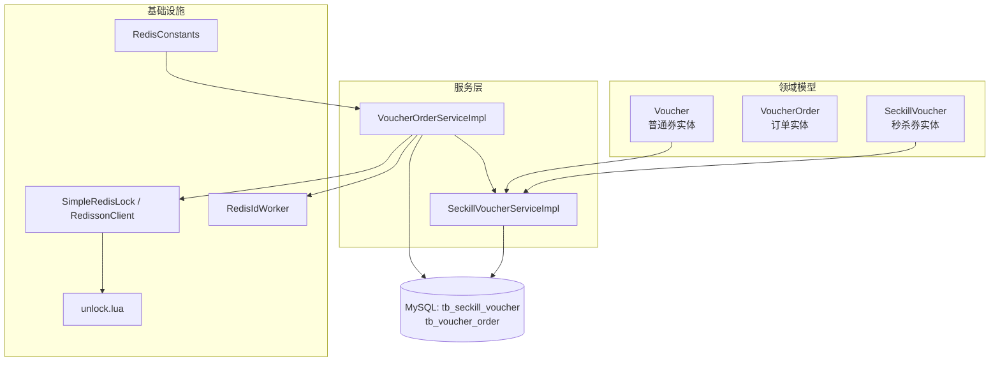
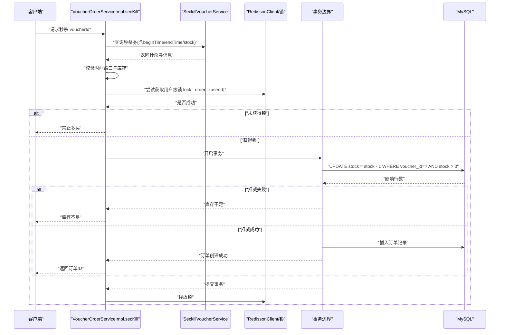
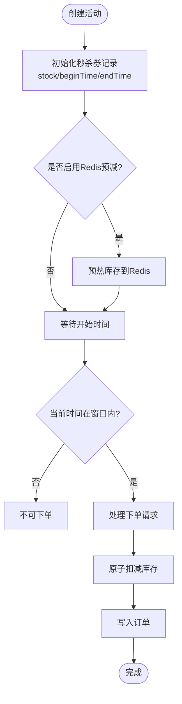
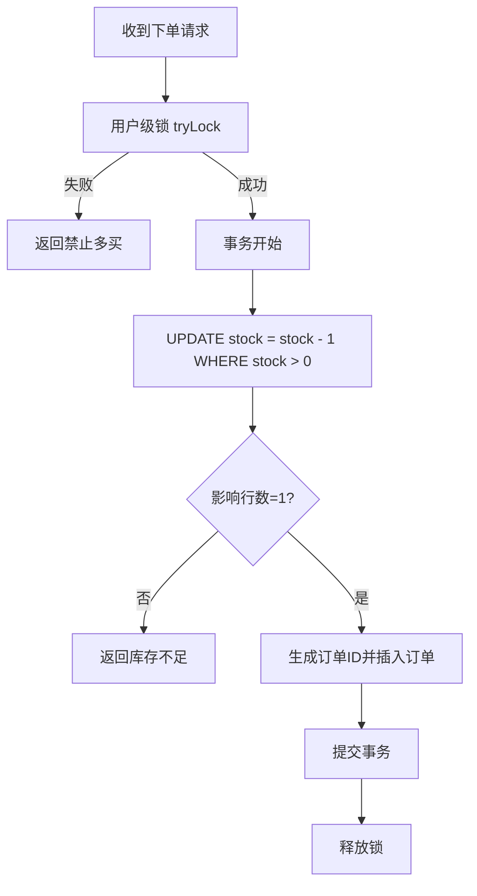
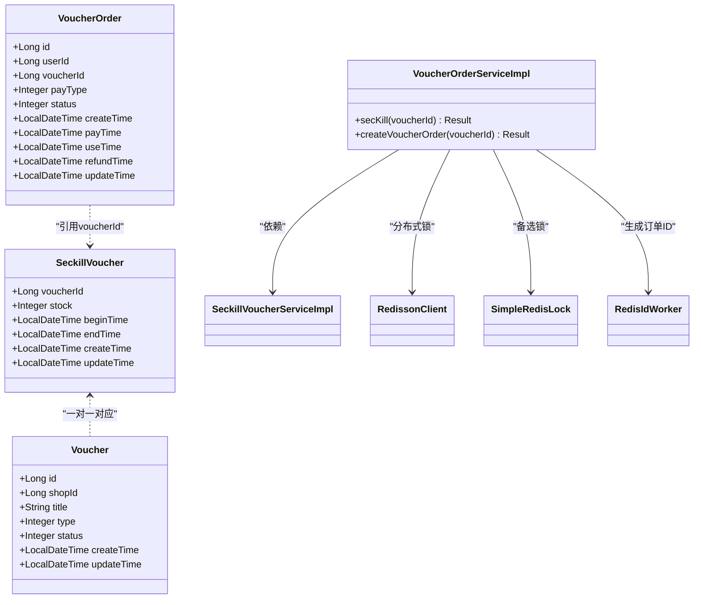

# 秒杀优惠券模型

<cite>
**本文引用的文件列表**
- [SeckillVoucher.java](file://src/main/java/com/hmdp/entity/SeckillVoucher.java)
- [SeckillVoucherMapper.java](file://src/main/java/com/hmdp/mapper/SeckillVoucherMapper.java)
- [ISeckillVoucherService.java](file://src/main/java/com/hmdp/service/ISeckillVoucherService.java)
- [SeckillVoucherServiceImpl.java](file://src/main/java/com/hmdp/service/impl/SeckillVoucherServiceImpl.java)
- [VoucherOrderServiceImpl.java](file://src/main/java/com/hmdp/service/impl/VoucherOrderServiceImpl.java)
- [Voucher.java](file://src/main/java/com/hmdp/entity/Voucher.java)
- [VoucherOrder.java](file://src/main/java/com/hmdp/entity/VoucherOrder.java)
- [hmdp.sql](file://src/main/resources/db/hmdp.sql)
- [RedisConstants.java](file://src/main/java/com/hmdp/utils/RedisConstants.java)
- [SimpleRedisLock.java](file://src/main/java/com/hmdp/utils/SimpleRedisLock.java)
- [RedissonConfig.java](file://src/main/java/com/hmdp/config/RedissonConfig.java)
- [unlock.lua](file://src/main/resources/unlock.lua)
</cite>

## 目录
1. [简介](#简介)
2. [项目结构](#项目结构)
3. [核心组件](#核心组件)
4. [架构总览](#架构总览)
5. [详细组件分析](#详细组件分析)
6. [依赖关系分析](#依赖关系分析)
7. [性能与高并发方案](#性能与高并发方案)
8. [监控指标与可观测性](#监控指标与可观测性)
9. [故障恢复与补偿机制](#故障恢复与补偿机制)
10. [结论](#结论)
11. [附录：数据模型定义](#附录数据模型定义)

## 简介
本文件围绕秒杀优惠券表 tb_seckill_voucher 的数据模型与相关实现，系统化阐述库存管理、时间窗口控制、限流策略、活动配置与预热、熔断保护、超卖防护、回滚与一致性保证、监控指标、性能调优、大促保障方案，以及与普通券的区别设计。文档同时给出关键流程的时序图与流程图，帮助读者快速理解并落地实施。

## 项目结构
本项目采用分层架构：实体层（entity）、持久化层（mapper）、服务层（service/impl）、工具与配置（utils/config），数据库脚本位于 resources/db。秒杀券的核心实体与表映射在 SeckillVoucher 中，订单下单与扣减逻辑集中在 VoucherOrderServiceImpl 中，锁与分布式ID等能力由 utils 提供。

图表来源
- [SeckillVoucher.java:1-62](file://src/main/java/com/hmdp/entity/SeckillVoucher.java#L1-L62)
- [VoucherOrderServiceImpl.java:47-103](file://src/main/java/com/hmdp/service/impl/VoucherOrderServiceImpl.java#L47-L103)
- [RedisConstants.java:1-25](file://src/main/java/com/hmdp/utils/RedisConstants.java#L1-L25)
- [SimpleRedisLock.java:1-56](file://src/main/java/com/hmdp/utils/SimpleRedisLock.java#L1-L56)
- [unlock.lua:1-5](file://src/main/resources/unlock.lua#L1-L5)

章节来源
- [SeckillVoucher.java:1-62](file://src/main/java/com/hmdp/entity/SeckillVoucher.java#L1-L62)
- [VoucherOrderServiceImpl.java:47-103](file://src/main/java/com/hmdp/service/impl/VoucherOrderServiceImpl.java#L47-L103)
- [RedisConstants.java:1-25](file://src/main/java/com/hmdp/utils/RedisConstants.java#L1-L25)

## 核心组件
- 秒杀券实体与表映射：SeckillVoucher 对应 tb_seckill_voucher，包含关联券id、库存、生效/失效时间、创建/更新时间等字段。
- 订单下单与扣减：VoucherOrderServiceImpl 提供 secKill 入口，负责时间窗口校验、库存检查、用户限购、分布式锁、原子扣减与落库。
- 分布式锁与解锁：使用 Redisson 或 SimpleRedisLock + unlock.lua 实现安全加锁与幂等释放。
- 全局唯一ID：RedisIdWorker 基于 Redis 自增生成订单号，避免冲突。
- 常量与键空间：RedisConstants 定义缓存与锁键前缀，便于统一治理。

章节来源
- [SeckillVoucher.java:1-62](file://src/main/java/com/hmdp/entity/SeckillVoucher.java#L1-L62)
- [VoucherOrderServiceImpl.java:47-103](file://src/main/java/com/hmdp/service/impl/VoucherOrderServiceImpl.java#L47-L103)
- [SimpleRedisLock.java:1-56](file://src/main/java/com/hmdp/utils/SimpleRedisLock.java#L1-L56)
- [RedissonConfig.java:1-18](file://src/main/java/com/hmdp/config/RedissonConfig.java#L1-L18)
- [RedisIdWorker.java:1-39](file://src/main/java/com/hmdp/utils/RedisIdWorker.java#L1-L39)
- [RedisConstants.java:1-25](file://src/main/java/com/hmdp/utils/RedisConstants.java#L1-L25)

## 架构总览
秒杀下单主流程如下：客户端调用 secKill -> 读取秒杀券信息 -> 校验时间窗口与库存 -> 获取用户级分布式锁 -> 进入事务执行“原子扣减+写订单” -> 返回结果。

图表来源
- [VoucherOrderServiceImpl.java:47-103](file://src/main/java/com/hmdp/service/impl/VoucherOrderServiceImpl.java#L47-L103)
- [RedissonConfig.java:1-18](file://src/main/java/com/hmdp/config/RedissonConfig.java#L1-L18)

## 详细组件分析

### 秒杀券数据模型与生命周期
- 字段说明
  - voucher_id：关联普通券的主键，作为秒杀券主键，体现一对一关系。
  - stock：库存数量，用于限制可购买总量。
  - begin_time/end_time：活动生效时间窗口，用于下单前置校验。
  - create_time/update_time：审计字段，自动维护。
- 生命周期
  - 创建：通过添加普通券时同步写入秒杀券记录，初始化 stock、begin_time、end_time。
  - 预热：活动开始前将库存预热至 Redis（可选增强点，见后文）。
  - 售卖：活动时间内允许下单，时间外拒绝。
  - 结束：活动结束后不再接受下单，库存冻结。
  - 清理：活动结束后归档或保留历史统计。

图表来源
- [hmdp.sql:88-96](file://src/main/resources/db/hmdp.sql#L88-L96)
- [VoucherServiceImpl.java:40-50](file://src/main/java/com/hmdp/service/impl/VoucherServiceImpl.java#L40-L50)

章节来源
- [SeckillVoucher.java:1-62](file://src/main/java/com/hmdp/entity/SeckillVoucher.java#L1-L62)
- [hmdp.sql:88-96](file://src/main/resources/db/hmdp.sql#L88-L96)
- [VoucherServiceImpl.java:40-50](file://src/main/java/com/hmdp/service/impl/VoucherServiceImpl.java#L40-L50)

### 库存管理与超卖防护
- 数据库侧防超卖：使用 UPDATE ... SET stock = stock - 1 WHERE voucher_id = ? AND stock > 0 的原子更新，确保不会负库存。
- 应用侧防重：同一用户同一券仅允许下一单，重复下单直接拒绝。
- 分布式锁：以用户维度加锁，防止同一用户并发下单导致重复扣减。
- 事务边界：扣减与写订单在同一事务中，保证一致性。

图表来源
- [VoucherOrderServiceImpl.java:77-103](file://src/main/java/com/hmdp/service/impl/VoucherOrderServiceImpl.java#L77-L103)
- [SimpleRedisLock.java:31-44](file://src/main/java/com/hmdp/utils/SimpleRedisLock.java#L31-L44)
- [unlock.lua:1-5](file://src/main/resources/unlock.lua#L1-L5)

章节来源
- [VoucherOrderServiceImpl.java:47-103](file://src/main/java/com/hmdp/service/impl/VoucherOrderServiceImpl.java#L47-L103)
- [SimpleRedisLock.java:1-56](file://src/main/java/com/hmdp/utils/SimpleRedisLock.java#L1-L56)
- [unlock.lua:1-5](file://src/main/resources/unlock.lua#L1-L5)

### 时间窗口控制
- 前置校验：在 secKill 入口处比较当前时间与 begin_time/end_time，不在窗口内直接拒绝。
- 精确控制：使用 LocalDateTime 进行判断，避免时区问题；建议服务端统一使用 UTC 存储与计算。

章节来源
- [VoucherOrderServiceImpl.java:47-58](file://src/main/java/com/hmdp/service/impl/VoucherOrderServiceImpl.java#L47-L58)
- [SeckillVoucher.java:40-58](file://src/main/java/com/hmdp/entity/SeckillVoucher.java#L40-L58)

### 限流与熔断保护
- 限流
  - 用户级限流：通过用户维度的分布式锁天然限制同一用户的并发下单。
  - 接口级限流（建议）：可在网关或控制器层增加令牌桶/滑动窗口限流，结合 Redis 计数器实现。
- 熔断保护（建议）
  - 当库存为0或下游异常比例升高时，快速失败，避免雪崩。
  - 可通过断路器模式对下单链路做降级，返回友好提示。

章节来源
- [VoucherOrderServiceImpl.java:62-74](file://src/main/java/com/hmdp/service/impl/VoucherOrderServiceImpl.java#L62-L74)
- [RedisConstants.java:19-19](file://src/main/java/com/hmdp/utils/RedisConstants.java#L19-L19)

### 秒杀券与普通券的区别设计
- 普通券（Voucher）：描述券的基本属性（标题、规则、面值、类型、状态等），不直接承载库存与时间窗。
- 秒杀券（SeckillVoucher）：与券一对一，承载库存与时间窗，专门用于限时限量抢购场景。
- 新增秒杀券：在保存普通券后，同步写入秒杀券记录，初始化 stock、begin_time、end_time。

章节来源
- [Voucher.java:26-106](file://src/main/java/com/hmdp/entity/Voucher.java#L26-L106)
- [SeckillVoucher.java:21-62](file://src/main/java/com/hmdp/entity/SeckillVoucher.java#L21-L62)
- [VoucherServiceImpl.java:40-50](file://src/main/java/com/hmdp/service/impl/VoucherServiceImpl.java#L40-L50)

### 库存预减方案与一致性保证
- 现状：当前实现直接在数据库原子扣减，未引入 Redis 预减。
- 推荐方案（可选增强）
  - 预热：活动开始前将 stock 预热到 Redis 键 seckill:stock:{voucherId}。
  - 预扣：下单先对 Redis 执行原子减一，成功后再异步或同步落库。
  - 一致性：若 Redis 成功但落库失败，需有补偿任务回补 Redis 库存；若 Redis 失败则直接拒绝。
  - 键空间：参考 RedisConstants.SECKILL_STOCK_KEY 命名规范。

章节来源
- [RedisConstants.java:19-19](file://src/main/java/com/hmdp/utils/RedisConstants.java#L19-L19)
- [VoucherOrderServiceImpl.java:85-92](file://src/main/java/com/hmdp/service/impl/VoucherOrderServiceImpl.java#L85-L92)

### 分布式锁与解锁
- 实现方式
  - Redisson：RLock.tryLock() 非阻塞尝试，适合短临界区。
  - SimpleRedisLock：基于 setIfAbsent + Lua 脚本原子释放，具备过期时间，避免死锁。
- 关键点
  - 锁粒度：用户维度，避免同用户并发下单。
  - 锁超时：合理设置 TTL，避免业务长耗时导致锁提前释放。
  - 解锁脚本：unlock.lua 保证只有持有者能释放。

章节来源
- [VoucherOrderServiceImpl.java:62-74](file://src/main/java/com/hmdp/service/impl/VoucherOrderServiceImpl.java#L62-L74)
- [SimpleRedisLock.java:31-44](file://src/main/java/com/hmdp/utils/SimpleRedisLock.java#L31-L44)
- [unlock.lua:1-5](file://src/main/resources/unlock.lua#L1-L5)
- [RedissonConfig.java:10-16](file://src/main/java/com/hmdp/config/RedissonConfig.java#L10-L16)

### 全局唯一ID生成
- 基于 Redis 自增，按日期分片计数，拼接时间戳与序号形成唯一ID，避免数据库自增瓶颈。
- 适用于订单ID生成，提升吞吐与可扩展性。

章节来源
- [RedisIdWorker.java:19-31](file://src/main/java/com/hmdp/utils/RedisIdWorker.java#L19-L31)
- [VoucherOrderServiceImpl.java:94-100](file://src/main/java/com/hmdp/service/impl/VoucherOrderServiceImpl.java#L94-L100)

## 依赖关系分析
- 实体与表
  - SeckillVoucher <-> tb_seckill_voucher
  - VoucherOrder <-> tb_voucher_order
  - Voucher <-> tb_voucher
- 服务依赖
  - VoucherOrderServiceImpl 依赖 ISeckillVoucherService 进行库存查询与扣减。
  - VoucherServiceImpl 在新增秒杀券时写入 SeckillVoucher。
- 外部依赖
  - Redis：分布式锁、ID生成、常量键空间。
  - MySQL：持久化库存与订单。

图表来源
- [SeckillVoucher.java:1-62](file://src/main/java/com/hmdp/entity/SeckillVoucher.java#L1-L62)
- [VoucherOrder.java:1-82](file://src/main/java/com/hmdp/entity/VoucherOrder.java#L1-L82)
- [Voucher.java:1-106](file://src/main/java/com/hmdp/entity/Voucher.java#L1-L106)
- [VoucherOrderServiceImpl.java:47-103](file://src/main/java/com/hmdp/service/impl/VoucherOrderServiceImpl.java#L47-L103)
- [RedissonConfig.java:10-16](file://src/main/java/com/hmdp/config/RedissonConfig.java#L10-L16)
- [SimpleRedisLock.java:1-56](file://src/main/java/com/hmdp/utils/SimpleRedisLock.java#L1-L56)
- [RedisIdWorker.java:1-39](file://src/main/java/com/hmdp/utils/RedisIdWorker.java#L1-L39)

章节来源
- [VoucherOrderServiceImpl.java:47-103](file://src/main/java/com/hmdp/service/impl/VoucherOrderServiceImpl.java#L47-L103)
- [SeckillVoucher.java:1-62](file://src/main/java/com/hmdp/entity/SeckillVoucher.java#L1-L62)
- [VoucherOrder.java:1-82](file://src/main/java/com/hmdp/entity/VoucherOrder.java#L1-L82)
- [Voucher.java:1-106](file://src/main/java/com/hmdp/entity/Voucher.java#L1-L106)

## 性能与高并发方案
- 热点行优化
  - 当前实现已使用数据库原子更新，避免读后写的竞态条件。
  - 建议：热点券库存可考虑分片或队列削峰（如消息队列串行化扣减）。
- 锁优化
  - 用户级锁粒度合适，避免全局锁带来的瓶颈。
  - 建议：锁TTL与业务耗时匹配，必要时使用看门狗续期（Redisson 支持）。
- 数据库优化
  - 索引：voucher_id 为主键，无需额外索引；关注大事务与慢查询。
  - 连接池与线程池：根据压测调整，避免连接耗尽。
- 缓存与一致性
  - 若引入 Redis 预减，需保证“预扣成功才落库”，失败补偿。
  - 读写分离下注意最终一致性与延迟容忍。

章节来源
- [VoucherOrderServiceImpl.java:85-100](file://src/main/java/com/hmdp/service/impl/VoucherOrderServiceImpl.java#L85-L100)
- [RedissonConfig.java:10-16](file://src/main/java/com/hmdp/config/RedissonConfig.java#L10-L16)

## 监控指标与可观测性
- 业务指标
  - 下单成功率、失败原因分布（时间窗口、库存不足、重复下单、锁竞争）。
  - 库存剩余量、售罄时间、峰值QPS、平均响应时间。
- 系统指标
  - Redis 命中率、锁等待时长、Lua 脚本执行耗时。
  - MySQL QPS、TPS、慢查询、锁等待。
- 告警策略
  - 库存接近售罄阈值告警。
  - 下单失败率突增告警。
  - 锁竞争加剧告警（tryLock 失败率上升）。

章节来源
- [VoucherOrderServiceImpl.java:47-74](file://src/main/java/com/hmdp/service/impl/VoucherOrderServiceImpl.java#L47-L74)
- [RedisConstants.java:19-19](file://src/main/java/com/hmdp/utils/RedisConstants.java#L19-L19)

## 故障恢复与补偿机制
- 幂等性
  - 用户级锁 + 唯一约束（user_id, voucher_id）双重保障，避免重复下单。
- 补偿
  - 若引入 Redis 预减且落库失败，需有定时任务扫描未落库的预扣记录，回补 Redis 库存。
  - 若数据库扣减成功但订单写入失败，需重试或人工介入修复。
- 回滚
  - 事务内操作失败自动回滚，保持库存与订单一致。
- 熔断与降级
  - 库存为0或下游异常时快速失败，避免放大故障面。

章节来源
- [VoucherOrderServiceImpl.java:77-103](file://src/main/java/com/hmdp/service/impl/VoucherOrderServiceImpl.java#L77-L103)
- [SimpleRedisLock.java:31-44](file://src/main/java/com/hmdp/utils/SimpleRedisLock.java#L31-L44)
- [unlock.lua:1-5](file://src/main/resources/unlock.lua#L1-L5)

## 结论
本方案以 tb_seckill_voucher 为核心，结合时间窗口校验、用户级分布式锁与数据库原子扣减，实现了高并发下的库存安全与订单一致性。当前实现未引入 Redis 预减，仍可直接满足中小规模秒杀场景。如需进一步提升吞吐与抗峰值能力，可按本文建议引入 Redis 预减、消息队列削峰与完善的监控补偿体系。

## 附录：数据模型定义

### 表 tb_seckill_voucher 字段说明
- voucher_id：bigint，主键，关联普通券id
- stock：int，库存
- create_time：timestamp，创建时间
- begin_time：timestamp，生效时间
- end_time：timestamp，失效时间
- update_time：timestamp，更新时间

章节来源
- [hmdp.sql:88-96](file://src/main/resources/db/hmdp.sql#L88-L96)
- [SeckillVoucher.java:21-62](file://src/main/java/com/hmdp/entity/SeckillVoucher.java#L21-L62)