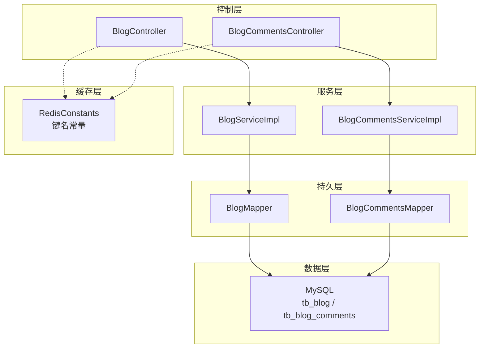
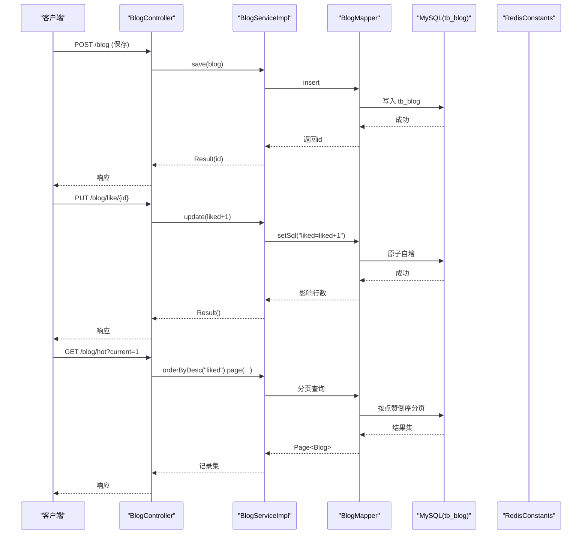
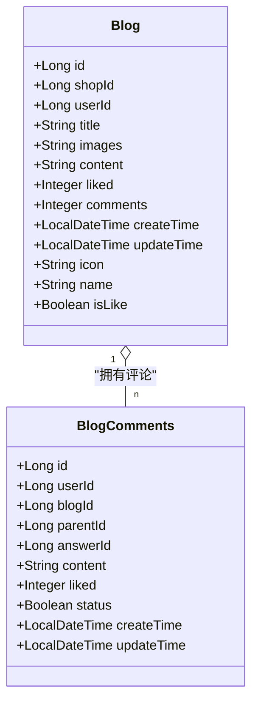
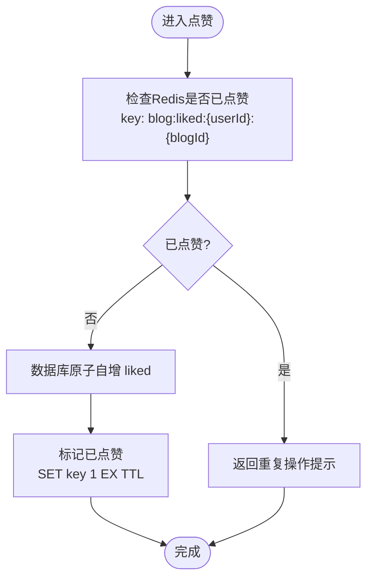
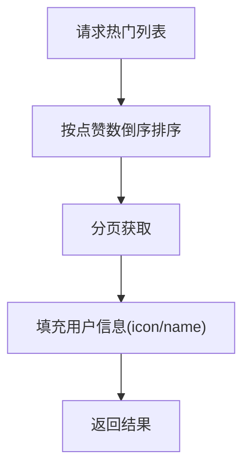
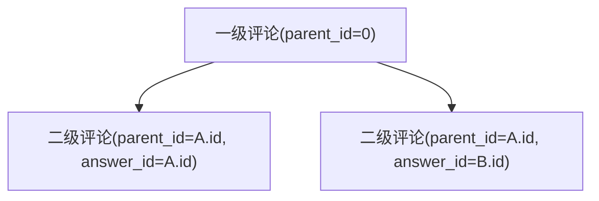
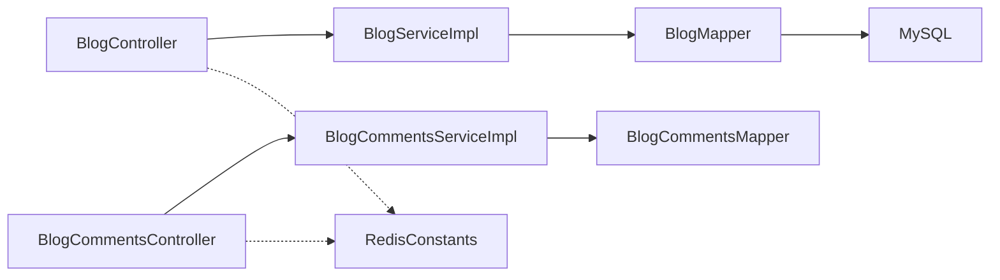

# 博客数据模型

<cite>
**本文引用的文件**   
- [Blog.java](file://src/main/java/com/hmdp/entity/Blog.java)
- [BlogComments.java](file://src/main/java/com/hmdp/entity/BlogComments.java)
- [hmdp.sql](file://src/main/resources/db/hmdp.sql)
- [BlogController.java](file://src/main/java/com/hmdp/controller/BlogController.java)
- [BlogCommentsController.java](file://src/main/java/com/hmdp/controller/BlogCommentsController.java)
- [BlogServiceImpl.java](file://src/main/java/com/hmdp/service/impl/BlogServiceImpl.java)
- [BlogCommentsServiceImpl.java](file://src/main/java/com/hmdp/service/impl/BlogCommentsServiceImpl.java)
- [RedisConstants.java](file://src/main/java/com/hmdp/utils/RedisConstants.java)
</cite>

## 目录
1. [引言](#引言)
2. [项目结构](#项目结构)
3. [核心组件](#核心组件)
4. [架构总览](#架构总览)
5. [详细组件分析](#详细组件分析)
6. [依赖关系分析](#依赖关系分析)
7. [性能考虑](#性能考虑)
8. [故障排查指南](#故障排查指南)
9. [结论](#结论)
10. [附录](#附录)

## 引言
本文件聚焦于博客模块的数据模型与相关实现，围绕 tb_blog 与 tb_blog_comments 两张表进行系统化说明。内容涵盖字段定义、数据类型与业务含义；博客内容存储格式（含图片上传管理）、评论树形结构设计；点赞统计机制、热门内容推荐算法与评论回复关系；全文搜索优化、评论防刷策略与内容审核机制；分页查询优化与缓存策略；以及删除策略与数据清理规则。文档同时给出代码级图示与来源定位，便于读者快速对照源码理解。

## 项目结构
博客模块涉及实体类、控制器、服务实现与数据库脚本等关键位置：
- 实体层：Blog、BlogComments
- 控制层：BlogController、BlogCommentsController
- 服务层：BlogServiceImpl、BlogCommentsServiceImpl
- 配置与常量：RedisConstants（用于缓存键）
- 数据库：hmdp.sql（包含 tb_blog、tb_blog_comments 建表语句）

图表来源
- [BlogController.java:1-84](file://src/main/java/com/hmdp/controller/BlogController.java#L1-L84)
- [BlogCommentsController.java:1-21](file://src/main/java/com/hmdp/controller/BlogCommentsController.java#L1-L21)
- [BlogServiceImpl.java:1-21](file://src/main/java/com/hmdp/service/impl/BlogServiceImpl.java#L1-L21)
- [BlogCommentsServiceImpl.java:1-21](file://src/main/java/com/hmdp/service/impl/BlogCommentsServiceImpl.java#L1-L21)
- [RedisConstants.java:1-24](file://src/main/java/com/hmdp/utils/RedisConstants.java#L1-L24)

章节来源
- [BlogController.java:1-84](file://src/main/java/com/hmdp/controller/BlogController.java#L1-L84)
- [BlogCommentsController.java:1-21](file://src/main/java/com/hmdp/controller/BlogCommentsController.java#L1-L21)
- [BlogServiceImpl.java:1-21](file://src/main/java/com/hmdp/service/impl/BlogServiceImpl.java#L1-L21)
- [BlogCommentsServiceImpl.java:1-21](file://src/main/java/com/hmdp/service/impl/BlogCommentsServiceImpl.java#L1-L21)
- [RedisConstants.java:1-24](file://src/main/java/com/hmdp/utils/RedisConstants.java#L1-L24)

## 核心组件
- 实体 Blog：映射 tb_blog，包含标题、图片集合、正文、点赞数、评论数、创建/更新时间等字段，并扩展了非持久化字段 icon、name、isLike 用于展示。
- 实体 BlogComments：映射 tb_blog_comments，包含用户、博文、父评论、被回复评论、内容、点赞数、状态、时间戳等字段，支撑评论树与回复关系。
- 控制器 BlogController：提供保存博客、点赞、按用户分页、热门排序等接口。
- 控制器 BlogCommentsController：预留评论相关接口占位。
- 服务实现：基于 MyBatis-Plus 的 ServiceImpl，提供基础 CRUD 能力。
- 常量 RedisConstants：集中定义缓存键，如 blog:liked: 等。

章节来源
- [Blog.java:1-96](file://src/main/java/com/hmdp/entity/Blog.java#L1-L96)
- [BlogComments.java:1-82](file://src/main/java/com/hmdp/entity/BlogComments.java#L1-L82)
- [BlogController.java:1-84](file://src/main/java/com/hmdp/controller/BlogController.java#L1-L84)
- [BlogCommentsController.java:1-21](file://src/main/java/com/hmdp/controller/BlogCommentsController.java#L1-L21)
- [BlogServiceImpl.java:1-21](file://src/main/java/com/hmdp/service/impl/BlogServiceImpl.java#L1-L21)
- [BlogCommentsServiceImpl.java:1-21](file://src/main/java/com/hmdp/service/impl/BlogCommentsServiceImpl.java#L1-L21)
- [RedisConstants.java:1-24](file://src/main/java/com/hmdp/utils/RedisConstants.java#L1-L24)

## 架构总览
下图展示了从请求到数据落库与缓存的关键路径，包括点赞与热门列表流程。

图表来源
- [BlogController.java:35-82](file://src/main/java/com/hmdp/controller/BlogController.java#L35-L82)
- [BlogServiceImpl.java:1-21](file://src/main/java/com/hmdp/service/impl/BlogServiceImpl.java#L1-L21)
- [hmdp.sql:24-36](file://src/main/resources/db/hmdp.sql#L24-L36)

## 详细组件分析

### 数据模型：tb_blog
- 主键 id：bigint unsigned，自增
- shop_id：bigint，商户标识
- user_id：bigint unsigned，作者用户标识
- title：varchar(255)，标题
- images：varchar(2048)，多张图片路径，逗号分隔
- content：varchar(2048)，正文内容（示例中可见 HTML 片段）
- liked：int unsigned，默认 0，点赞数量
- comments：int unsigned，评论数量
- create_time：timestamp，创建时间
- update_time：timestamp，更新时间

字段类型与业务含义要点
- images 使用逗号分隔的多 URL 字符串，限制最多 9 张，适合前端直接渲染图片列表。
- content 支持富文本（HTML），便于排版与内联样式，但需配合内容安全过滤。
- liked/comments 为冗余计数字段，提升热点读取性能。

章节来源
- [Blog.java:25-92](file://src/main/java/com/hmdp/entity/Blog.java#L25-L92)
- [hmdp.sql:24-36](file://src/main/resources/db/hmdp.sql#L24-L36)

### 数据模型：tb_blog_comments
- 主键 id：bigint unsigned，自增
- user_id：bigint unsigned，评论者
- blog_id：bigint unsigned，所属博文
- parent_id：bigint unsigned，一级评论 ID，若为顶级评论则为 0
- answer_id：bigint unsigned，被回复的评论 ID
- content：varchar(255)，评论内容
- liked：int unsigned，评论点赞数
- status：tinyint unsigned，状态：0 正常、1 被举报、2 禁止查看
- create_time/update_time：时间戳

树形结构与回复关系
- parent_id 表示“属于哪条一级评论”，构成“博文 -> 一级评论 -> 二级评论”的层级。
- answer_id 表示“回复的是哪条评论”，可用于在 UI 上显示“回复 @xxx”。
- status 用于内容审核与可见性控制。

章节来源
- [BlogComments.java:24-78](file://src/main/java/com/hmdp/entity/BlogComments.java#L24-L78)
- [hmdp.sql:50-62](file://src/main/resources/db/hmdp.sql#L50-L62)

### 实体类关系图

图表来源
- [Blog.java:25-92](file://src/main/java/com/hmdp/entity/Blog.java#L25-L92)
- [BlogComments.java:24-78](file://src/main/java/com/hmdp/entity/BlogComments.java#L24-L78)

### 点赞统计机制
- 当前实现通过 SQL 原子自增更新 liked 字段，避免并发写竞争导致的不一致。
- 建议结合 Redis 做去重与限流：
  - 使用 RedisConstants.BLOG_LIKED_KEY 作为前缀，维护“用户-博文”是否已点赞的集合或 Set。
  - 先查 Redis 判重，再执行数据库自增，保证幂等。
  - 可异步回写或定时同步，降低热点行锁压力。

图表来源
- [BlogController.java:46-52](file://src/main/java/com/hmdp/controller/BlogController.java#L46-L52)
- [RedisConstants.java:20-20](file://src/main/java/com/hmdp/utils/RedisConstants.java#L20-L20)

章节来源
- [BlogController.java:46-52](file://src/main/java/com/hmdp/controller/BlogController.java#L46-L52)
- [RedisConstants.java:1-24](file://src/main/java/com/hmdp/utils/RedisConstants.java#L1-L24)

### 热门内容推荐算法
- 当前实现：按 liked 降序分页，简单有效，适合冷启动与中小规模数据。
- 可扩展方向：
  - 引入时间衰减因子，形成“热度 = f(点赞, 评论, 时间衰减)”的综合评分。
  - 将热门列表预计算并缓存至 Redis，定期刷新，降低数据库压力。
  - 对高热度博文采用独立索引或物化视图加速排序。

图表来源
- [BlogController.java:66-82](file://src/main/java/com/hmdp/controller/BlogController.java#L66-L82)

章节来源
- [BlogController.java:66-82](file://src/main/java/com/hmdp/controller/BlogController.java#L66-L82)

### 评论树形结构与回复关系
- 一级评论：parent_id = 0
- 二级评论：parent_id = 一级评论.id，answer_id = 被回复评论.id
- 展示时可按 parent_id 分组，再以 answer_id 标注“回复 @xxx”

图表来源
- [BlogComments.java:45-53](file://src/main/java/com/hmdp/entity/BlogComments.java#L45-L53)

章节来源
- [BlogComments.java:45-53](file://src/main/java/com/hmdp/entity/BlogComments.java#L45-L53)

### 博客内容存储格式与图片上传管理
- 内容格式：content 字段支持富文本（HTML），便于展示复杂排版。
- 图片格式：images 字段以逗号分隔的 URL 列表，最多 9 张。
- 上传管理建议：
  - 统一由 UploadController 处理上传，返回 CDN/对象存储 URL。
  - 校验图片大小、类型与数量，生成唯一文件名，避免覆盖。
  - 前端按逗号拆分渲染图片轮播或网格。

章节来源
- [Blog.java:64-72](file://src/main/java/com/hmdp/entity/Blog.java#L64-L72)
- [hmdp.sql:28-30](file://src/main/resources/db/hmdp.sql#L28-L30)

### 评论防刷策略
- 频率限制：同一用户对同一博文的评论间隔限制（如 5 秒）。
- 内容长度与敏感词过滤：结合正则工具 RegexUtils 进行基础校验。
- 状态管控：status 字段用于举报/封禁后的不可见控制。
- 幂等与去重：防止重复提交，服务端校验唯一约束或幂等键。

章节来源
- [BlogComments.java:65-68](file://src/main/java/com/hmdp/entity/BlogComments.java#L65-L68)
- [RegexUtils.java:1-42](file://src/main/java/com/hmdp/utils/RegexUtils.java#L1-L42)

### 内容审核机制
- 前置过滤：输入校验、敏感词匹配、图片鉴黄/暴恐检测。
- 后置审核：人工或 AI 审核，通过后 status=0，否则置为 1/2。
- 展示过滤：查询时过滤 status != 0 的记录。

章节来源
- [BlogComments.java:65-68](file://src/main/java/com/hmdp/entity/BlogComments.java#L65-L68)

### 全文搜索优化
- 现状：未内置全文索引。
- 建议方案：
  - MySQL 全文索引：对 title/content 建立 FULLTEXT 索引，使用 MATCH...AGAINST 检索。
  - 外部搜索引擎：Elasticsearch 同步索引，支持分词、高亮与聚合。
  - 读写分离：写时异步构建索引，读时走 ES。

[本节为通用优化建议，不直接分析具体文件]

### 分页查询优化与缓存策略
- 分页：使用 MyBatis-Plus 分页插件，合理设置 page size（SystemConstants.MAX_PAGE_SIZE）。
- 缓存：
  - 热门列表缓存：以 FEED_KEY 为前缀，缓存 JSON 序列化结果，设置 TTL。
  - 空值缓存：CACHE_NULL_TTL 防止缓存穿透。
  - 一致性：更新后失效或延迟双删，确保最终一致。

章节来源
- [BlogController.java:54-73](file://src/main/java/com/hmdp/controller/BlogController.java#L54-L73)
- [RedisConstants.java:9-21](file://src/main/java/com/hmdp/utils/RedisConstants.java#L9-L21)

### 删除策略与数据清理规则
- 软删除：可在实体增加 deleted 字段，逻辑删除，保留审计轨迹。
- 硬删除：对违规内容或长期无访问的冷数据，定期清理。
- 级联清理：删除博文时，清理其评论、点赞记录与缓存项。
- 归档：历史数据迁移至归档库或冷存储，降低热表体积。

[本节为通用策略建议，不直接分析具体文件]

## 依赖关系分析
- 控制层依赖服务层，服务层依赖 Mapper，Mapper 访问数据库。
- 缓存键集中在 RedisConstants，便于统一管理。
- 实体字段与数据库列一一对应，部分展示字段为非持久化字段。

图表来源
- [BlogController.java:1-84](file://src/main/java/com/hmdp/controller/BlogController.java#L1-L84)
- [BlogCommentsController.java:1-21](file://src/main/java/com/hmdp/controller/BlogCommentsController.java#L1-L21)
- [BlogServiceImpl.java:1-21](file://src/main/java/com/hmdp/service/impl/BlogServiceImpl.java#L1-L21)
- [BlogCommentsServiceImpl.java:1-21](file://src/main/java/com/hmdp/service/impl/BlogCommentsServiceImpl.java#L1-L21)
- [RedisConstants.java:1-24](file://src/main/java/com/hmdp/utils/RedisConstants.java#L1-L24)

章节来源
- [BlogController.java:1-84](file://src/main/java/com/hmdp/controller/BlogController.java#L1-L84)
- [BlogCommentsController.java:1-21](file://src/main/java/com/hmdp/controller/BlogCommentsController.java#L1-L21)
- [BlogServiceImpl.java:1-21](file://src/main/java/com/hmdp/service/impl/BlogServiceImpl.java#L1-L21)
- [BlogCommentsServiceImpl.java:1-21](file://src/main/java/com/hmdp/service/impl/BlogCommentsServiceImpl.java#L1-L21)
- [RedisConstants.java:1-24](file://src/main/java/com/hmdp/utils/RedisConstants.java#L1-L24)

## 性能考虑
- 点赞热点：使用 Redis 去重与原子自增，减少数据库行锁竞争。
- 热门列表：预计算与缓存，避免频繁排序扫描。
- 评论树：按 parent_id 批量查询，内存组装树，减少 N+1 查询。
- 内容渲染：富文本输出前进行 XSS 过滤与图片外链安全校验。
- 分页：限制每页大小，避免大偏移量导致的性能退化。

[本节为通用性能建议，不直接分析具体文件]

## 故障排查指南
- 点赞异常：检查 Redis 键是否存在、TTL 是否过期、数据库自增是否生效。
- 热门列表为空：确认排序字段 liked 是否有值、分页参数是否正确、缓存是否命中。
- 评论无法显示：检查 status 是否为 0、parent_id/answer_id 是否正确、是否被过滤。
- 图片不显示：核对 images 中的 URL 是否可达、跨域与防盗链配置。

章节来源
- [BlogController.java:46-82](file://src/main/java/com/hmdp/controller/BlogController.java#L46-L82)
- [BlogComments.java:65-68](file://src/main/java/com/hmdp/entity/BlogComments.java#L65-L68)
- [RedisConstants.java:1-24](file://src/main/java/com/hmdp/utils/RedisConstants.java#L1-L24)

## 结论
博客模块以简洁的数据模型为基础，通过原子自增与分页排序实现了基础的点赞与热门功能。建议在现有基础上完善评论树展示、内容审核、防刷与全文检索，并结合 Redis 缓存与异步任务提升整体性能与稳定性。

[本节为总结性内容，不直接分析具体文件]

## 附录
- 数据库建表参考：
  - tb_blog：[hmdp.sql:24-36](file://src/main/resources/db/hmdp.sql#L24-L36)
  - tb_blog_comments：[hmdp.sql:50-62](file://src/main/resources/db/hmdp.sql#L50-L62)
- 实体字段参考：
  - Blog：[Blog.java:25-92](file://src/main/java/com/hmdp/entity/Blog.java#L25-L92)
  - BlogComments：[BlogComments.java:24-78](file://src/main/java/com/hmdp/entity/BlogComments.java#L24-L78)
- 控制器接口参考：
  - 保存/点赞/热门/我的：[BlogController.java:35-82](file://src/main/java/com/hmdp/controller/BlogController.java#L35-L82)
  - 评论控制器占位：[BlogCommentsController.java:16-20](file://src/main/java/com/hmdp/controller/BlogCommentsController.java#L16-L20)
- 缓存键参考：
  - RedisConstants：[RedisConstants.java:1-24](file://src/main/java/com/hmdp/utils/RedisConstants.java#L1-L24)