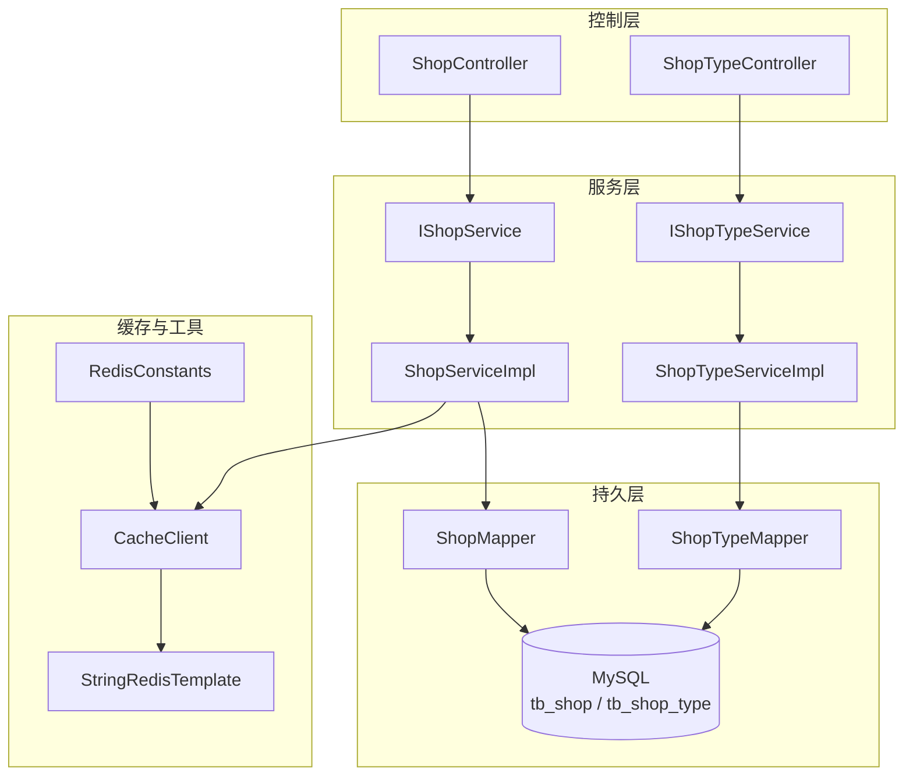
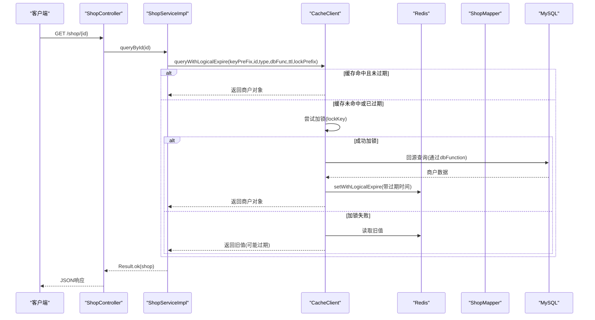
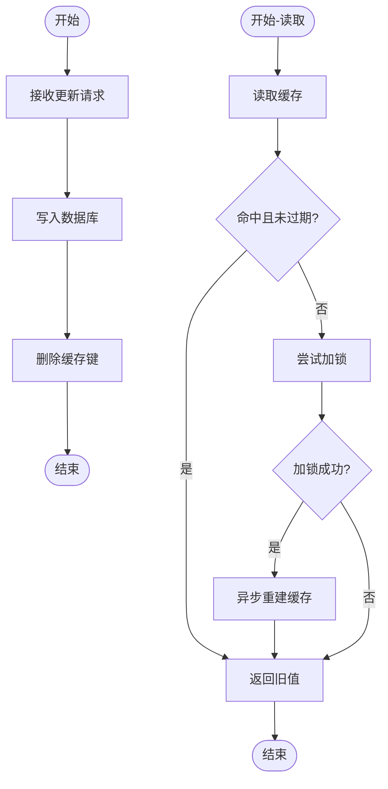
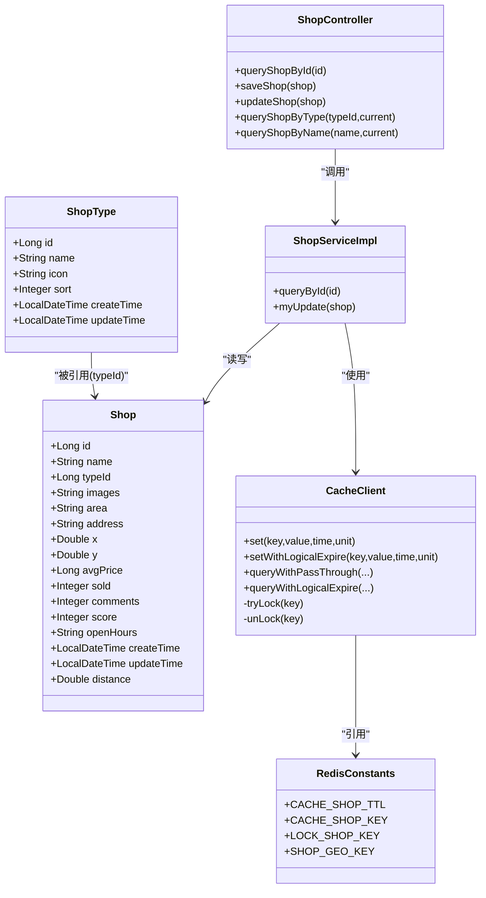

# 商户数据模型

<cite>
**本文引用的文件**   
- [Shop.java](file://src/main/java/com/hmdp/entity/Shop.java)
- [ShopType.java](file://src/main/java/com/hmdp/entity/ShopType.java)
- [hmdp.sql](file://src/main/resources/db/hmdp.sql)
- [IShopService.java](file://src/main/java/com/hmdp/service/IShopService.java)
- [ShopServiceImpl.java](file://src/main/java/com/hmdp/service/impl/ShopServiceImpl.java)
- [ShopController.java](file://src/main/java/com/hmdp/controller/ShopController.java)
- [IShopTypeService.java](file://src/main/java/com/hmdp/service/IShopTypeService.java)
- [ShopTypeServiceImpl.java](file://src/main/java/com/hmdp/service/impl/ShopTypeServiceImpl.java)
- [ShopTypeController.java](file://src/main/java/com/hmdp/controller/ShopTypeController.java)
- [CacheClient.java](file://src/main/java/com/hmdp/utils/CacheClient.java)
- [RedisConstants.java](file://src/main/java/com/hmdp/utils/RedisConstants.java)
</cite>

## 目录
1. [简介](#简介)
2. [项目结构](#项目结构)
3. [核心组件](#核心组件)
4. [架构总览](#架构总览)
5. [详细组件分析](#详细组件分析)
6. [依赖关系分析](#依赖关系分析)
7. [性能考虑](#性能考虑)
8. [故障排查指南](#故障排查指南)
9. [结论](#结论)
10. [附录](#附录)

## 简介
本文件围绕“商户模块”的数据模型与相关实现进行系统化说明，重点覆盖以下方面：
- tb_shop 与 tb_shop_type 表的字段定义、数据类型与业务含义
- 商户地理位置数据存储方案（经纬度）
- 评分计算逻辑与销量统计机制
- 商户分类体系设计与层级关系
- 商户搜索优化、地理空间查询与性能调优策略
- 商户数据更新同步机制与缓存一致性保证
- 商户数据的审核流程与状态管理现状与建议

## 项目结构
商户模块涉及实体、控制器、服务、工具类与数据库脚本等关键位置。下图展示了与商户数据模型相关的代码组织与交互关系。

图表来源
- [ShopController.java:1-101](file://src/main/java/com/hmdp/controller/ShopController.java#L1-L101)
- [ShopTypeController.java:1-37](file://src/main/java/com/hmdp/controller/ShopTypeController.java#L1-L37)
- [IShopService.java:1-21](file://src/main/java/com/hmdp/service/IShopService.java#L1-L21)
- [ShopServiceImpl.java:1-61](file://src/main/java/com/hmdp/service/impl/ShopServiceImpl.java#L1-L61)
- [IShopTypeService.java:1-18](file://src/main/java/com/hmdp/service/IShopTypeService.java#L1-L18)
- [ShopTypeServiceImpl.java:1-49](file://src/main/java/com/hmdp/service/impl/ShopTypeServiceImpl.java#L1-L49)
- [ShopMapper.java:1-16](file://src/main/java/com/hmdp/mapper/ShopMapper.java#L1-L16)
- [ShopTypeMapper.java:1-16](file://src/main/java/com/hmdp/mapper/ShopTypeMapper.java#L1-L16)
- [CacheClient.java:1-140](file://src/main/java/com/hmdp/utils/CacheClient.java#L1-L140)
- [RedisConstants.java:1-25](file://src/main/java/com/hmdp/utils/RedisConstants.java#L1-L25)

章节来源
- [ShopController.java:1-101](file://src/main/java/com/hmdp/controller/ShopController.java#L1-L101)
- [ShopTypeController.java:1-37](file://src/main/java/com/hmdp/controller/ShopTypeController.java#L1-L37)
- [IShopService.java:1-21](file://src/main/java/com/hmdp/service/IShopService.java#L1-L21)
- [ShopServiceImpl.java:1-61](file://src/main/java/com/hmdp/service/impl/ShopServiceImpl.java#L1-L61)
- [IShopTypeService.java:1-18](file://src/main/java/com/hmdp/service/IShopTypeService.java#L1-L18)
- [ShopTypeServiceImpl.java:1-49](file://src/main/java/com/hmdp/service/impl/ShopTypeServiceImpl.java#L1-L49)
- [CacheClient.java:1-140](file://src/main/java/com/hmdp/utils/CacheClient.java#L1-L140)
- [RedisConstants.java:1-25](file://src/main/java/com/hmdp/utils/RedisConstants.java#L1-L25)

## 核心组件
- 实体模型
  - Shop：对应表 tb_shop，包含商户基础信息、地理位置、价格、销量、评论数、评分、营业时间及时间戳等。
  - ShopType：对应表 tb_shop_type，包含类型名称、图标、排序、创建与更新时间。
- 控制器
  - ShopController：提供按ID查询、新增、更新、按类型分页、按名称模糊分页等接口。
  - ShopTypeController：提供获取所有类型的接口。
- 服务
  - IShopService/ShopServiceImpl：封装商户查询与更新逻辑，集成缓存读取与更新后的缓存失效。
  - IShopTypeService/ShopTypeServiceImpl：封装类型列表查询与缓存加载。
- 工具与常量
  - CacheClient：提供透传缓存与逻辑过期两种缓存读取模式，含分布式锁与异步重建。
  - RedisConstants：集中定义缓存键前缀与TTL等常量。

章节来源
- [Shop.java:1-110](file://src/main/java/com/hmdp/entity/Shop.java#L1-L110)
- [ShopType.java:1-65](file://src/main/java/com/hmdp/entity/ShopType.java#L1-L65)
- [ShopController.java:1-101](file://src/main/java/com/hmdp/controller/ShopController.java#L1-L101)
- [ShopTypeController.java:1-37](file://src/main/java/com/hmdp/controller/ShopTypeController.java#L1-L37)
- [IShopService.java:1-21](file://src/main/java/com/hmdp/service/IShopService.java#L1-L21)
- [ShopServiceImpl.java:1-61](file://src/main/java/com/hmdp/service/impl/ShopServiceImpl.java#L1-L61)
- [IShopTypeService.java:1-18](file://src/main/java/com/hmdp/service/IShopTypeService.java#L1-L18)
- [ShopTypeServiceImpl.java:1-49](file://src/main/java/com/hmdp/service/impl/ShopTypeServiceImpl.java#L1-L49)
- [CacheClient.java:1-140](file://src/main/java/com/hmdp/utils/CacheClient.java#L1-L140)
- [RedisConstants.java:1-25](file://src/main/java/com/hmdp/utils/RedisConstants.java#L1-L25)

## 架构总览
下图展示一次“按ID查询商户详情”的调用链路与缓存参与过程。

图表来源
- [ShopController.java:34-37](file://src/main/java/com/hmdp/controller/ShopController.java#L34-L37)
- [ShopServiceImpl.java:37-45](file://src/main/java/com/hmdp/service/impl/ShopServiceImpl.java#L37-L45)
- [CacheClient.java:64-127](file://src/main/java/com/hmdp/utils/CacheClient.java#L64-L127)
- [RedisConstants.java:11-17](file://src/main/java/com/hmdp/utils/RedisConstants.java#L11-L17)

## 详细组件分析

### 数据模型：tb_shop 与 tb_shop_type
- 表结构与字段说明
  - tb_shop
    - id：主键，自增
    - name：商铺名称
    - type_id：关联类型ID
    - images：图片URL集合，逗号分隔
    - area：商圈
    - address：地址
    - x：经度（double）
    - y：纬度（double）
    - avg_price：均价（整数）
    - sold：销量（无符号整型，零填充显示）
    - comments：评论数量（无符号整型，零填充显示）
    - score：评分（1~5分，乘10保存，避免小数）
    - open_hours：营业时间
    - create_time/update_time：时间戳
    - 索引：type_id 外键索引
  - tb_shop_type
    - id：主键，自增
    - name：类型名称
    - icon：图标路径
    - sort：排序顺序
    - create_time/update_time：时间戳
- 业务含义与约束要点
  - 评分以整数形式存储，实际值为 score/10；便于比较与聚合计算。
  - 销量与评论数为整型计数，适合高频累加场景。
  - 经纬度使用 double 存储，支持后续地理空间计算。
  - 类型通过 type_id 关联，当前为扁平分类设计。

章节来源
- [hmdp.sql:103-171](file://src/main/resources/db/hmdp.sql#L103-L171)
- [Shop.java:25-109](file://src/main/java/com/hmdp/entity/Shop.java#L25-L109)
- [ShopType.java:25-65](file://src/main/java/com/hmdp/entity/ShopType.java#L25-L65)

### 地理位置数据存储方案（经纬度）
- 存储方式
  - 在 tb_shop 中直接存储 x（经度）、y（纬度），类型为 double。
  - 实体 Shop 额外提供 distance 字段（非持久化），用于返回距离结果。
- 使用建议
  - 基于 x/y 可在应用层计算欧氏距离或采用 Haversine 公式计算球面距离。
  - 若需高性能范围查询，可引入 Redis GEO 或 MySQL Spatial 扩展（当前仓库仅预留常量 SHOP_GEO_KEY）。

章节来源
- [Shop.java:64-69](file://src/main/java/com/hmdp/entity/Shop.java#L64-L69)
- [Shop.java:107-109](file://src/main/java/com/hmdp/entity/Shop.java#L107-L109)
- [RedisConstants.java:22](file://src/main/java/com/hmdp/utils/RedisConstants.java#L22)

### 评分计算逻辑与销量统计机制
- 评分
  - 字段 score 表示“1~5分乘以10”的整数值，例如 4.5 分存储为 45。
  - 计算时可将 score/10 得到真实评分；聚合时可对 score 求平均后再除以10。
- 销量
  - 字段 sold 为累计销量，适合在高并发下单后做原子递增（如 Redis INCR 或数据库 UPDATE ... SET sold=sold+1）。
  - 当前代码未提供自动累加逻辑，需在订单核销或交易完成后由业务侧更新。

章节来源
- [Shop.java:87-89](file://src/main/java/com/hmdp/entity/Shop.java#L87-L89)
- [Shop.java:77-79](file://src/main/java/com/hmdp/entity/Shop.java#L77-L79)
- [hmdp.sql:116-118](file://src/main/resources/db/hmdp.sql#L116-L118)

### 商户分类体系设计与层级关系
- 当前设计
  - tb_shop_type 为扁平结构，没有 parent_id 等层级字段。
  - Shop.typeId 指向单一类型，不支持多标签或多级分类。
- 扩展建议
  - 如需多级分类，可增加 parent_id 与 level 字段，并维护 sort 顺序。
  - 如需多标签，可引入中间表 shop_tag 与 tag 字典表。

章节来源
- [ShopType.java:33-49](file://src/main/java/com/hmdp/entity/ShopType.java#L33-L49)
- [Shop.java:42-44](file://src/main/java/com/hmdp/entity/Shop.java#L42-L44)
- [hmdp.sql:148-156](file://src/main/resources/db/hmdp.sql#L148-L156)

### 商户搜索优化
- 现有能力
  - 按类型分页：GET /shop/of/type?typeId=...
  - 按名称模糊分页：GET /shop/of/name?name=...
- 优化建议
  - 名称搜索：对 name 建立全文索引或使用搜索引擎（如 Elasticsearch）。
  - 组合筛选：增加 area、avg_price 范围过滤，配合复合索引提升性能。
  - 分页参数：统一最大页大小限制，防止大偏移量导致性能退化。

章节来源
- [ShopController.java:69-99](file://src/main/java/com/hmdp/controller/ShopController.java#L69-L99)

### 地理空间查询
- 现状
  - 实体提供 x/y 与 distance（非持久化），常量中预留 SHOP_GEO_KEY。
- 可选方案
  - 应用层计算：基于 x/y 计算距离并按距离排序。
  - Redis GEO：将商户坐标写入 GEO，利用 georadius/geosearch 实现附近商户检索。
  - MySQL Spatial：启用 spatial 扩展并使用 ST_Distance_Sphere 等函数。

章节来源
- [Shop.java:64-69](file://src/main/java/com/hmdp/entity/Shop.java#L64-L69)
- [Shop.java:107-109](file://src/main/java/com/hmdp/entity/Shop.java#L107-L109)
- [RedisConstants.java:22](file://src/main/java/com/hmdp/utils/RedisConstants.java#L22)

### 数据更新与缓存一致性
- 更新流程
  - 更新接口 PUT /shop：先写库，再删除对应缓存键，下次读时重建。
- 读取流程
  - 优先走逻辑过期缓存：若过期则尝试加锁，后台线程重建缓存，读请求返回旧值，避免雪崩。
- 一致性保障
  - 使用分布式锁（Redis setIfAbsent）避免并发重建。
  - 双检（Double Check）确保在加锁后再次判断是否已被其他线程重建。

图表来源
- [ShopServiceImpl.java:47-58](file://src/main/java/com/hmdp/service/impl/ShopServiceImpl.java#L47-L58)
- [CacheClient.java:64-127](file://src/main/java/com/hmdp/utils/CacheClient.java#L64-L127)
- [RedisConstants.java:11-17](file://src/main/java/com/hmdp/utils/RedisConstants.java#L11-L17)

章节来源
- [ShopServiceImpl.java:47-58](file://src/main/java/com/hmdp/service/impl/ShopServiceImpl.java#L47-L58)
- [CacheClient.java:64-127](file://src/main/java/com/hmdp/utils/CacheClient.java#L64-L127)

### 商户数据审核流程与状态管理
- 现状
  - 当前 tb_shop 与 Shop 实体未包含审核状态字段，也未在控制器或服务中体现审核流程。
- 建议
  - 增加 status 字段（如 0草稿、1待审、2通过、3拒绝），并在创建/更新时设置默认状态。
  - 提供审核接口与权限校验，结合审计日志记录操作人、时间与原因。
  - 对外暴露只读接口时过滤未通过数据。

章节来源
- [Shop.java:25-109](file://src/main/java/com/hmdp/entity/Shop.java#L25-L109)
- [ShopController.java:44-61](file://src/main/java/com/hmdp/controller/ShopController.java#L44-L61)

## 依赖关系分析
- 组件耦合
  - 控制器依赖服务接口，服务实现依赖 MyBatis-Plus 的 BaseMapper 与工具类。
  - 缓存工具类依赖 StringRedisTemplate 与常量定义。
- 外部依赖
  - MySQL 作为持久化存储。
  - Redis 作为缓存与分布式锁载体。
- 潜在风险
  - 更新后直接删除缓存，存在短暂不一致窗口；可通过延迟双删或消息队列补偿降低风险。
  - 逻辑过期模式下，若重建失败会长期返回旧值，需完善异常处理与告警。

图表来源
- [Shop.java:25-109](file://src/main/java/com/hmdp/entity/Shop.java#L25-L109)
- [ShopType.java:25-65](file://src/main/java/com/hmdp/entity/ShopType.java#L25-L65)
- [ShopController.java:22-101](file://src/main/java/com/hmdp/controller/ShopController.java#L22-L101)
- [ShopServiceImpl.java:28-61](file://src/main/java/com/hmdp/service/impl/ShopServiceImpl.java#L28-L61)
- [CacheClient.java:17-140](file://src/main/java/com/hmdp/utils/CacheClient.java#L17-L140)
- [RedisConstants.java:1-25](file://src/main/java/com/hmdp/utils/RedisConstants.java#L1-L25)

章节来源
- [ShopController.java:22-101](file://src/main/java/com/hmdp/controller/ShopController.java#L22-L101)
- [ShopServiceImpl.java:28-61](file://src/main/java/com/hmdp/service/impl/ShopServiceImpl.java#L28-L61)
- [CacheClient.java:17-140](file://src/main/java/com/hmdp/utils/CacheClient.java#L17-L140)
- [RedisConstants.java:1-25](file://src/main/java/com/hmdp/utils/RedisConstants.java#L1-L25)

## 性能考虑
- 缓存策略
  - 使用逻辑过期模式减少热点数据重建时的阻塞，提高吞吐。
  - 合理设置 TTL 与锁超时，避免长时间锁竞争或脏读。
- 数据库优化
  - 针对常用查询条件建立合适索引（如 type_id、area、name 前缀索引）。
  - 分页查询限制最大页大小，避免深分页。
- 地理查询
  - 小范围附近查询建议使用 Redis GEO；大范围或复杂空间运算考虑 MySQL Spatial 或专用搜索引擎。
- 高并发更新
  - 销量与评论数更新建议使用原子操作（Redis INCR 或数据库乐观锁），并结合异步落库或批量合并。

## 故障排查指南
- 常见问题
  - 缓存穿透：空值也写入短 TTL 缓存，避免重复回源。
  - 缓存击穿：热点 key 过期时加锁重建，避免大量请求同时回源。
  - 缓存雪崩：分散 TTL 与随机抖动，避免大规模同时过期。
- 定位方法
  - 检查 Redis 键是否存在与过期时间是否符合预期。
  - 观察更新接口是否执行了缓存删除逻辑。
  - 监控重建线程是否抛出异常并释放锁。

章节来源
- [CacheClient.java:36-60](file://src/main/java/com/hmdp/utils/CacheClient.java#L36-L60)
- [CacheClient.java:64-127](file://src/main/java/com/hmdp/utils/CacheClient.java#L64-L127)
- [ShopServiceImpl.java:47-58](file://src/main/java/com/hmdp/service/impl/ShopServiceImpl.java#L47-L58)

## 结论
- 数据模型清晰，tb_shop 与 tb_shop_type 满足基础商户与分类需求。
- 评分与销量字段设计利于高效计算与统计。
- 缓存读取采用逻辑过期与分布式锁，具备较好的高可用性与一致性保障。
- 建议在后续迭代中完善审核流程、地理空间查询与搜索优化，以提升用户体验与系统可扩展性。

## 附录
- 接口概览
  - 按ID查询：GET /shop/{id}
  - 新增商户：POST /shop
  - 更新商户：PUT /shop
  - 按类型分页：GET /shop/of/type?typeId=&current=
  - 按名称模糊分页：GET /shop/of/name?name=&current=
  - 获取类型列表：GET /shop-type/list

章节来源
- [ShopController.java:34-99](file://src/main/java/com/hmdp/controller/ShopController.java#L34-L99)
- [ShopTypeController.java:32-35](file://src/main/java/com/hmdp/controller/ShopTypeController.java#L32-L35)