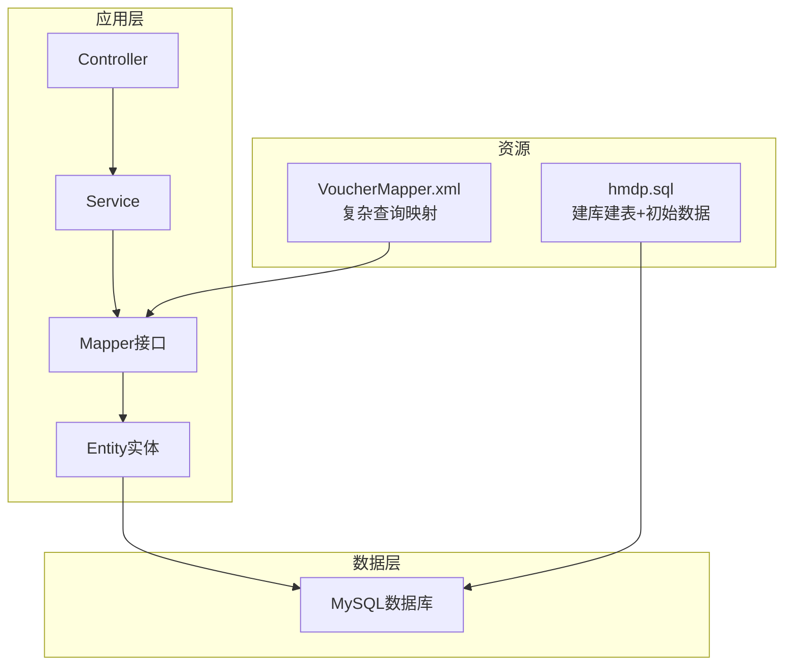
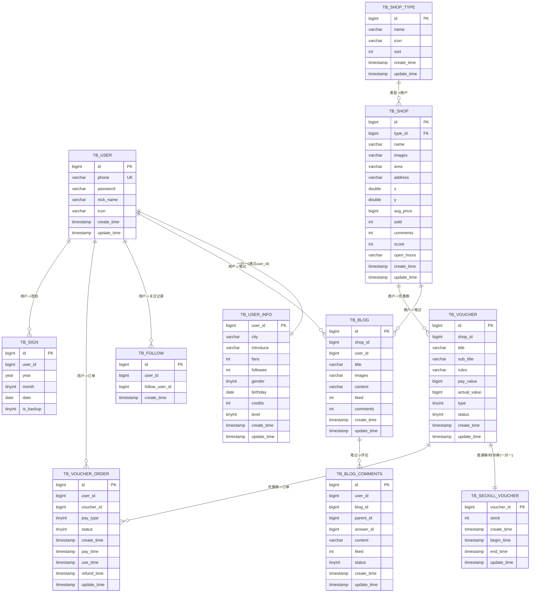
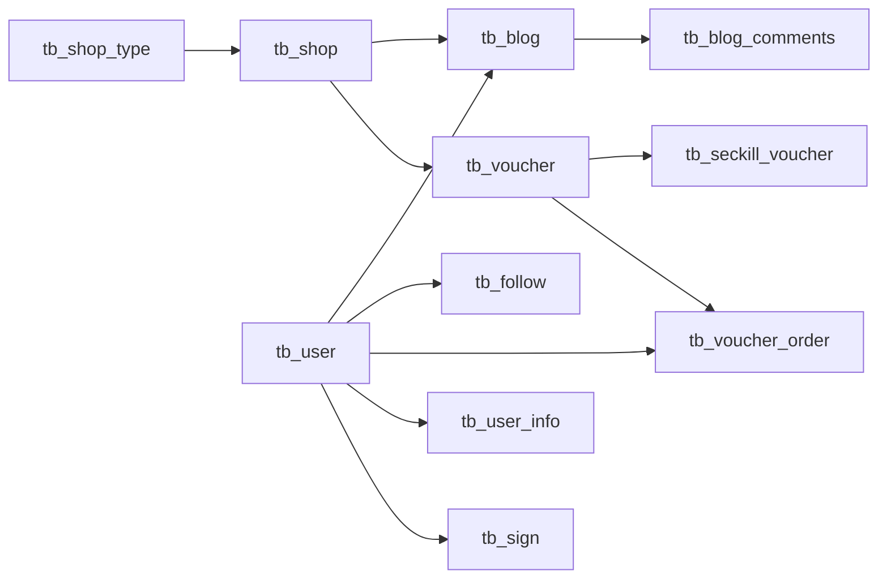

# 数据库架构概览

<cite>
**本文引用的文件**   
- [hmdp.sql](file://src/main/resources/db/hmdp.sql)
- [User.java](file://src/main/java/com/hmdp/entity/User.java)
- [UserInfo.java](file://src/main/java/com/hmdp/entity/UserInfo.java)
- [Shop.java](file://src/main/java/com/hmdp/entity/Shop.java)
- [ShopType.java](file://src/main/java/com/hmdp/entity/ShopType.java)
- [Blog.java](file://src/main/java/com/hmdp/entity/Blog.java)
- [BlogComments.java](file://src/main/java/com/hmdp/entity/BlogComments.java)
- [Follow.java](file://src/main/java/com/hmdp/entity/Follow.java)
- [Voucher.java](file://src/main/java/com/hmdp/entity/Voucher.java)
- [SeckillVoucher.java](file://src/main/java/com/hmdp/entity/SeckillVoucher.java)
- [VoucherOrder.java](file://src/main/java/com/hmdp/entity/VoucherOrder.java)
</cite>

## 目录
1. [简介](#简介)
2. [项目结构](#项目结构)
3. [核心组件](#核心组件)
4. [架构总览](#架构总览)
5. [详细组件分析](#详细组件分析)
6. [依赖关系分析](#依赖关系分析)
7. [性能与扩展性](#性能与扩展性)
8. [版本管理与迁移](#版本管理与迁移)
9. [备份与恢复策略](#备份与恢复策略)
10. [结论](#结论)

## 简介
本文件面向my-hbdp项目的数据库设计与运维，系统性梳理整体数据库设计思路、表结构与实体关系、命名规范、字段设计原则、索引策略，并给出ER图、数据流向说明、性能优化建议与扩展性考虑。文档同时覆盖数据库版本管理、数据迁移方案以及备份恢复策略，帮助读者快速理解并高效维护该项目的数据层。

## 项目结构
本项目采用典型的分层架构：Controller → Service → Mapper → Entity，数据持久化由MyBatis-Plus驱动，SQL脚本集中存放于resources/db下。数据库相关的关键位置如下：
- SQL初始化脚本：src/main/resources/db/hmdp.sql
- 领域实体映射：src/main/java/com/hmdp/entity/*.java
- MyBatis XML映射（示例）：src/main/resources/mapper/VoucherMapper.xml

图表来源
- [hmdp.sql](file://src/main/resources/db/hmdp.sql)
- [VoucherMapper.xml](file://src/main/resources/mapper/VoucherMapper.xml)

章节来源
- [hmdp.sql](file://src/main/resources/db/hmdp.sql)

## 核心组件
围绕“用户-商户-笔记-评论-关注-优惠券-订单”的核心业务域，数据库包含以下关键表：
- 用户域：tb_user、tb_user_info
- 商户域：tb_shop、tb_shop_type
- 内容域：tb_blog、tb_blog_comments
- 社交域：tb_follow
- 交易域：tb_voucher、tb_seckill_voucher、tb_voucher_order
- 签到域：tb_sign

各表均遵循统一的命名与时间戳约定，主键统一为自增或业务ID，常用字段具备注释，便于代码生成与文档化。

章节来源
- [hmdp.sql](file://src/main/resources/db/hmdp.sql)
- [User.java](file://src/main/java/com/hmdp/entity/User.java)
- [UserInfo.java](file://src/main/java/com/hmdp/entity/UserInfo.java)
- [Shop.java](file://src/main/java/com/hmdp/entity/Shop.java)
- [ShopType.java](file://src/main/java/com/hmdp/entity/ShopType.java)
- [Blog.java](file://src/main/java/com/hmdp/entity/Blog.java)
- [BlogComments.java](file://src/main/java/com/hmdp/entity/BlogComments.java)
- [Follow.java](file://src/main/java/com/hmdp/entity/Follow.java)
- [Voucher.java](file://src/main/java/com/hmdp/entity/Voucher.java)
- [SeckillVoucher.java](file://src/main/java/com/hmdp/entity/SeckillVoucher.java)
- [VoucherOrder.java](file://src/main/java/com/hmdp/entity/VoucherOrder.java)

## 架构总览
下图展示核心实体间的ER关系，体现一对多、一对一等关联方式，以及部分冗余字段的设计意图。

图表来源
- [hmdp.sql](file://src/main/resources/db/hmdp.sql)

## 详细组件分析

### 用户域：tb_user 与 tb_user_info
- 设计要点
  - tb_user：存储登录与基础信息，phone唯一约束保障账号唯一性；密码加密存储；创建/更新时间自动维护。
  - tb_user_info：用户画像与社交统计（粉丝数、关注数、积分、等级等），与tb_user通过user_id一对一关联。
- 字段设计原则
  - 敏感字段（如password）使用加密存储；
  - 枚举类状态使用tinyint并附注释；
  - 时间字段统一使用timestamp，默认值与更新触发器保持一致。
- 索引策略
  - phone建立唯一索引，用于登录与注册校验；
  - 若后续有按城市/性别筛选需求，可在city/gender上补充索引。
- 复杂度与扩展
  - 用户画像可继续扩展标签体系；
  - 如需支持手机号登录以外的第三方登录，可在tb_user增加union_id等字段。

章节来源
- [hmdp.sql](file://src/main/resources/db/hmdp.sql)
- [User.java](file://src/main/java/com/hmdp/entity/User.java)
- [UserInfo.java](file://src/main/java/com/hmdp/entity/UserInfo.java)

### 商户域：tb_shop 与 tb_shop_type
- 设计要点
  - tb_shop_type：商户分类字典，含排序字段sort，便于前端展示顺序控制。
  - tb_shop：商户详情，包含经纬度x/y、均价avg_price、销量sold、评分score、营业时间open_hours等。
- 字段设计原则
  - 图片以逗号分隔的字符串存储，适合轻量场景；若图片数量增长，建议拆分为独立图片表。
  - 评分score以整数保存（乘以10避免小数），利于排序与聚合。
- 索引策略
  - type_id已建立外键索引foreign_key_type，提升按类型筛选的性能；
  - 可按area、x/y范围查询需求，考虑添加复合索引或引入空间索引（视MySQL版本与引擎能力）。
- 复杂度与扩展
  - 若商户规模扩大，可引入分库分表策略（如按area或type分片）。

章节来源
- [hmdp.sql](file://src/main/resources/db/hmdp.sql)
- [Shop.java](file://src/main/java/com/hmdp/entity/Shop.java)
- [ShopType.java](file://src/main/java/com/hmdp/entity/ShopType.java)

### 内容域：tb_blog 与 tb_blog_comments
- 设计要点
  - tb_blog：笔记主体，关联shop_id与user_id，记录点赞数liked与评论数comments作为冗余计数，减少实时聚合开销。
  - tb_blog_comments：支持多级评论，parent_id表示父级评论id，answer_id指向被回复的评论id，status用于审核与可见性控制。
- 字段设计原则
  - 冗余字段（如blog.comments）用于读多写少场景下的性能优化，需在写入时同步更新。
  - 评论内容content长度适中，兼顾可读性与存储成本。
- 索引策略
  - 建议在blog_id、user_id上建立索引，加速按笔记查看评论与按用户查看其评论列表。
- 复杂度与扩展
  - 评论树形结构在大数据量下需分页与懒加载策略；
  - 可引入Redis缓存热点笔记与评论。

章节来源
- [hmdp.sql](file://src/main/resources/db/hmdp.sql)
- [Blog.java](file://src/main/java/com/hmdp/entity/Blog.java)
- [BlogComments.java](file://src/main/java/com/hmdp/entity/BlogComments.java)

### 社交域：tb_follow
- 设计要点
  - 记录用户之间的关注关系，userId与followUserId构成关注对。
- 字段设计原则
  - 无多余冗余字段，保持简洁。
- 索引策略
  - 建议为userId与followUserId分别建立索引，加速“我的关注”和“某人的粉丝”查询。
- 复杂度与扩展
  - 大规模关注关系可考虑分表或引入图数据库进行关系计算。

章节来源
- [hmdp.sql](file://src/main/resources/db/hmdp.sql)
- [Follow.java](file://src/main/java/com/hmdp/entity/Follow.java)

### 交易域：tb_voucher、tb_seckill_voucher、tb_voucher_order
- 设计要点
  - tb_voucher：通用优惠券定义，含支付金额pay_value、抵扣金额actual_value、类型type（普通/秒杀）、状态status等。
  - tb_seckill_voucher：与tb_voucher一对一，记录库存stock与生效时间段begin_time/end_time，支撑秒杀逻辑。
  - tb_voucher_order：订单记录，包含支付方式pay_type、状态status及多个时间戳（下单、支付、核销、退款）。
- 字段设计原则
  - 金额单位统一为“分”，避免浮点误差；
  - 状态字段使用tinyint并明确枚举含义。
- 索引策略
  - 建议在voucher_id、user_id上建立索引，加速按券与按用户的订单查询；
  - 秒杀扣减路径应结合Redis原子操作与DB最终一致性。
- 复杂度与扩展
  - 高并发秒杀需引入分布式锁与幂等设计；
  - 订单表随时间增长，可考虑按时间分表归档。

章节来源
- [hmdp.sql](file://src/main/resources/db/hmdp.sql)
- [Voucher.java](file://src/main/java/com/hmdp/entity/Voucher.java)
- [SeckillVoucher.java](file://src/main/java/com/hmdp/entity/SeckillVoucher.java)
- [VoucherOrder.java](file://src/main/java/com/hmdp/entity/VoucherOrder.java)

### 签到域：tb_sign
- 设计要点
  - 记录用户按年月的签到情况，is_backup标记补签。
- 字段设计原则
  - 以year/month/date组合唯一性保证不重复签到。
- 索引策略
  - 建议为(user_id, year, month)建立复合索引，加速按月查询。
- 复杂度与扩展
  - 可结合Redis位图实现高性能签到统计。

章节来源
- [hmdp.sql](file://src/main/resources/db/hmdp.sql)

## 依赖关系分析
- 直接依赖
  - tb_shop.type_id → tb_shop_type.id（外键索引）
  - tb_blog.shop_id → tb_shop.id（逻辑关联）
  - tb_blog.user_id → tb_user.id（逻辑关联）
  - tb_blog_comments.blog_id → tb_blog.id（逻辑关联）
  - tb_follow.user_id/follow_user_id → tb_user.id（逻辑关联）
  - tb_voucher.shop_id → tb_shop.id（逻辑关联）
  - tb_seckill_voucher.voucher_id → tb_voucher.id（一对一）
  - tb_voucher_order.user_id/voucher_id → tb_user.id/tb_voucher.id（逻辑关联）
  - tb_user_info.user_id → tb_user.id（一对一）
- 间接依赖
  - 业务层通过Service编排跨表事务与一致性（如订单创建、库存扣减、状态流转）。
- 潜在循环依赖
  - 当前ER图无循环引用；注意在应用层避免循环调用。

图表来源
- [hmdp.sql](file://src/main/resources/db/hmdp.sql)

## 性能与扩展性

### 索引与查询优化建议
- 高频查询列加索引
  - 用户：phone已有唯一索引；可按nick_name、icon检索需求评估是否加索引。
  - 商户：type_id已有索引；可按area、x/y范围查询建立复合索引或空间索引。
  - 笔记：建议在shop_id、user_id、create_time上建立索引，支持按商户/作者/时间排序。
  - 评论：建议在blog_id、user_id、parentId上建立索引，支持按笔记/作者/层级查询。
  - 关注：建议在userId、followUserId上建立索引。
  - 订单：建议在user_id、voucher_id、status、create_time上建立索引，支持多维筛选与报表。
- 冗余字段的使用
  - blog.comments、shop.sold等冗余字段降低实时聚合压力，但需保证写入一致性。
- 分页与排序
  - 基于时间戳的分页优于offset分页，避免深分页性能问题。
- 读写分离与缓存
  - 热点数据（商户详情、笔记列表）可引入Redis缓存；
  - 秒杀库存优先走Redis原子扣减，再异步落库。

### 扩展性考虑
- 分库分表
  - 订单表按时间分表（如按月/季度）；
  - 笔记与评论按用户或商户维度分片。
- 水平拆分
  - 将用户画像、日志、审计等冷数据迁移至独立库或对象存储。
- 事件驱动
  - 通过消息队列解耦订单、库存、通知等流程，提高系统弹性。

[本节为通用指导，无需具体文件来源]

## 版本管理与迁移

### 现状与问题
- 当前SQL脚本为一次性DDL+大量INSERT初始数据的混合体，未采用增量迁移形式，不利于团队协作与生产环境演进。

### 推荐方案
- 引入数据库迁移工具（如Flyway/Liquibase）
  - 将每次变更拆分为独立的迁移脚本，按版本号递增；
  - 提供回滚脚本，确保发布安全。
- 脚本组织建议
  - V1__init_schema.sql：仅包含建库建表与必要索引；
  - V2__seed_data.sql：仅包含种子数据；
  - V3__alter_table_add_index.sql：结构变更与索引优化；
  - 所有脚本幂等且可重放。
- 环境与分支策略
  - 开发/测试/预发/生产四套环境，迁移脚本在各环境依次执行；
  - 合并前进行回归验证与性能回归。

章节来源
- [hmdp.sql](file://src/main/resources/db/hmdp.sql)

## 备份与恢复策略

### 备份策略
- 全量备份
  - 每日定时全量备份（mysqldump或企业级备份工具），保留N天历史。
- 增量备份
  - 开启binlog，按小时或分钟级增量备份，缩短RPO。
- 异地容灾
  - 备份文件同步至异地对象存储或备份中心。

### 恢复演练
- 定期演练恢复流程，验证RTO/RPO目标；
- 针对大表（如tb_user、tb_voucher_order）制定专项恢复预案。

### 数据安全
- 备份文件加密传输与存储；
- 严格权限管控，最小授权原则。

[本节为通用指导，无需具体文件来源]

## 结论
本项目的数据库设计围绕用户、商户、内容、社交与交易五大域展开，结构清晰、职责分明。通过合理的冗余字段与索引策略，满足了典型读多写少的业务场景。未来可通过引入迁移工具、完善索引、读写分离与缓存机制进一步提升可维护性与性能。在扩展方面，建议逐步推进分库分表与事件驱动架构，以应对更大规模的数据与流量挑战。