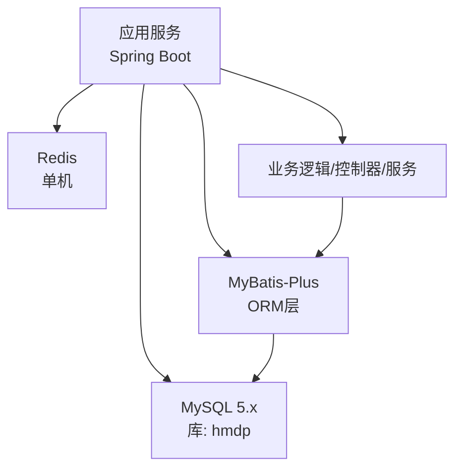
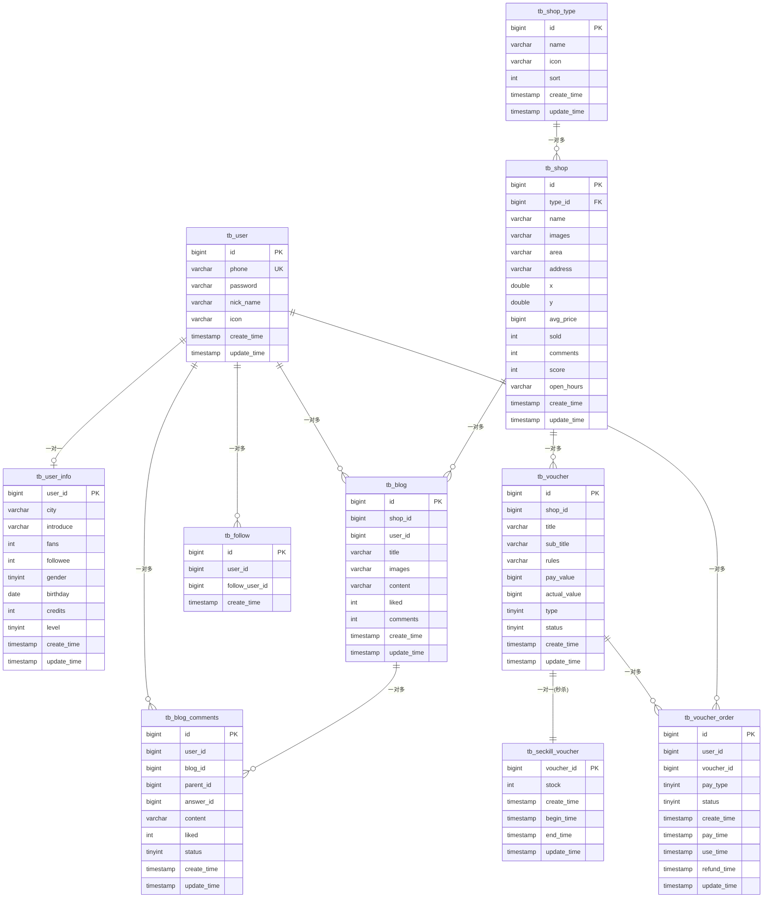
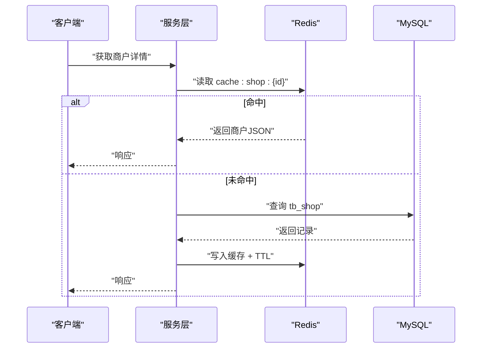

# 数据库设计

<cite>
**本文引用的文件**   
- [hmdp.sql](file://src/main/resources/db/hmdp.sql)
- [application.yaml](file://src/main/resources/application.yaml)
- [User.java](file://src/main/java/com/hmdp/entity/User.java)
- [UserInfo.java](file://src/main/java/com/hmdp/entity/UserInfo.java)
- [Shop.java](file://src/main/java/com/hmdp/entity/Shop.java)
- [ShopType.java](file://src/main/java/com/hmdp/entity/ShopType.java)
- [Blog.java](file://src/main/java/com/hmdp/entity/Blog.java)
- [BlogComments.java](file://src/main/java/com/hmdp/entity/BlogComments.java)
- [Follow.java](file://src/main/java/com/hmdp/entity/Follow.java)
- [Voucher.java](file://src/main/java/com/hmdp/entity/Voucher.java)
- [SeckillVoucher.java](file://src/main/java/com/hmdp/entity/SeckillVoucher.java)
- [VoucherOrder.java](file://src/main/java/com/hmdp/entity/VoucherOrder.java)
- [RedisConstants.java](file://src/main/java/com/hmdp/utils/RedisConstants.java)
</cite>

## 目录
1. [引言](#引言)
2. [项目结构与数据源概览](#项目结构与数据源概览)
3. [核心实体与字段定义](#核心实体与字段定义)
4. [架构总览（ER图）](#架构总览er图)
5. [详细表设计与约束](#详细表设计与约束)
6. [索引与查询优化建议](#索引与查询优化建议)
7. [数据访问模式与缓存策略](#数据访问模式与缓存策略)
8. [业务规则与数据验证](#业务规则与数据验证)
9. [数据安全、隐私与访问控制](#数据安全隐私与访问控制)
10. [数据生命周期、保留与归档](#数据生命周期保留与归档)
11. [迁移路径与版本管理](#迁移路径与版本管理)
12. [性能考量与容量规划](#性能考量与容量规划)
13. [故障排查指南](#故障排查指南)
14. [结论](#结论)

## 引言
本文件面向my-hbdp项目的数据库设计，覆盖实体关系、字段定义、主外键与索引、约束与校验、数据访问与缓存策略、安全与合规、生命周期与归档、迁移与版本管理等。文档基于仓库中的SQL脚本与实体类映射进行梳理，并结合应用配置说明数据源与缓存相关设置。

## 项目结构与数据源概览
- 数据库初始化脚本位于资源目录的SQL文件中，定义了所有表结构及示例数据。
- 应用通过Spring Boot配置连接MySQL与Redis；MyBatis-Plus负责ORM映射。
- 实体类使用注解与表名、字段名一一对应，部分展示字段标记为非持久化字段。

**章节来源**
- [application.yaml:6-21](file://src/main/resources/application.yaml#L6-L21)
- [hmdp.sql:1-15](file://src/main/resources/db/hmdp.sql#L1-L15)

## 核心实体与字段定义
以下按领域分组列出核心实体及其关键字段（类型以DDL为准，Java实体用于辅助理解）。

- 用户域
  - 用户基本信息：id、phone、password、nickName、icon、createTime、updateTime
  - 用户扩展信息：userId、city、introduce、fans、followee、gender、birthday、credits、level、createTime、updateTime
- 商户域
  - 商户类型：id、name、icon、sort、createTime、updateTime
  - 商户：id、name、typeId、images、area、address、x、y、avgPrice、sold、comments、score、openHours、createTime、updateTime
- 内容域
  - 探店博文：id、shopId、userId、title、images、content、liked、comments、createTime、updateTime
  - 博文评论：id、userId、blogId、parentId、answerId、content、liked、status、createTime、updateTime
- 社交域
  - 关注：id、userId、followUserId、createTime
- 营销域
  - 代金券：id、shopId、title、subTitle、rules、payValue、actualValue、type、status、createTime、updateTime
  - 秒杀券库存：voucherId、stock、createTime、beginTime、endTime、updateTime
  - 代金券订单：id、userId、voucherId、payType、status、createTime、payTime、useTime、refundTime、updateTime

**章节来源**
- [User.java:24-66](file://src/main/java/com/hmdp/entity/User.java#L24-L66)
- [UserInfo.java:25-87](file://src/main/java/com/hmdp/entity/UserInfo.java#L25-L87)
- [Shop.java:25-109](file://src/main/java/com/hmdp/entity/Shop.java#L25-L109)
- [ShopType.java:25-64](file://src/main/java/com/hmdp/entity/ShopType.java#L25-L64)
- [Blog.java:25-95](file://src/main/java/com/hmdp/entity/Blog.java#L25-L95)
- [BlogComments.java:25-81](file://src/main/java/com/hmdp/entity/BlogComments.java#L25-L81)
- [Follow.java:24-51](file://src/main/java/com/hmdp/entity/Follow.java#L24-L51)
- [Voucher.java:25-105](file://src/main/java/com/hmdp/entity/Voucher.java#L25-L105)
- [SeckillVoucher.java:24-61](file://src/main/java/com/hmdp/entity/SeckillVoucher.java#L24-L61)
- [VoucherOrder.java:24-81](file://src/main/java/com/hmdp/entity/VoucherOrder.java#L24-L81)

## 架构总览（ER图）
下图展示了主要实体间的关系与关键外键关联。注意：当前DDL未显式声明外键约束，但业务上存在如下关联语义。

**图表来源**
- [hmdp.sql:24-36](file://src/main/resources/db/hmdp.sql#L24-L36)
- [hmdp.sql:50-62](file://src/main/resources/db/hmdp.sql#L50-L62)
- [hmdp.sql:72-78](file://src/main/resources/db/hmdp.sql#L72-L78)
- [hmdp.sql:88-96](file://src/main/resources/db/hmdp.sql#L88-L96)
- [hmdp.sql:106-124](file://src/main/resources/db/hmdp.sql#L106-L124)
- [hmdp.sql:148-156](file://src/main/resources/db/hmdp.sql#L148-L156)
- [hmdp.sql:194-204](file://src/main/resources/db/hmdp.sql#L194-L204)
- [hmdp.sql:1219-1232](file://src/main/resources/db/hmdp.sql#L1219-L1232)
- [hmdp.sql:1242-1255](file://src/main/resources/db/hmdp.sql#L1242-L1255)
- [hmdp.sql:1266-1278](file://src/main/resources/db/hmdp.sql#L1266-L1278)

## 详细表设计与约束
本节对每张表的主键、唯一键、索引、默认值与注释进行归纳，并标注业务含义。

- tb_user（用户）
  - 主键：id（自增）
  - 唯一键：uniqe_key_phone(phone)
  - 其他：密码加密存储；时间戳自动维护
- tb_user_info（用户详情）
  - 主键：user_id（与tb_user.id对应）
  - 备注：性别为tinyint，积分、粉丝等计数字段
- tb_shop_type（商户类型）
  - 主键：id（自增）
  - 排序：sort
- tb_shop（商户）
  - 主键：id（自增）
  - 索引：foreign_key_type(type_id)
  - 评分score采用整数保存（1~5分乘10）
- tb_blog（探店博文）
  - 主键：id（自增）
  - 统计字段：liked、comments
- tb_blog_comments（博文评论）
  - 主键：id（自增）
  - 层级：parentId=0表示一级评论；answerId指向被回复评论
- tb_follow（关注）
  - 主键：id（自增）
  - 语义：userId关注followUserId
- tb_voucher（代金券）
  - 主键：id（自增）
  - 金额单位：分
  - 状态：上架/下架/过期
- tb_seckill_voucher（秒杀券库存）
  - 主键：voucher_id（与tb_voucher.id一对一）
  - 库存：stock
  - 有效期：begin_time、end_time
- tb_voucher_order（代金券订单）
  - 主键：id（非自增，由分布式ID生成器提供）
  - 状态：未支付/已支付/已核销/已取消/退款中/已退款
  - 时间：下单、支付、核销、退款

**章节来源**
- [hmdp.sql:194-204](file://src/main/resources/db/hmdp.sql#L194-L204)
- [hmdp.sql:1219-1232](file://src/main/resources/db/hmdp.sql#L1219-L1232)
- [hmdp.sql:148-156](file://src/main/resources/db/hmdp.sql#L148-L156)
- [hmdp.sql:106-124](file://src/main/resources/db/hmdp.sql#L106-L124)
- [hmdp.sql:24-36](file://src/main/resources/db/hmdp.sql#L24-L36)
- [hmdp.sql:50-62](file://src/main/resources/db/hmdp.sql#L50-L62)
- [hmdp.sql:72-78](file://src/main/resources/db/hmdp.sql#L72-L78)
- [hmdp.sql:1242-1255](file://src/main/resources/db/hmdp.sql#L1242-L1255)
- [hmdp.sql:88-96](file://src/main/resources/db/hmdp.sql#L88-L96)
- [hmdp.sql:1266-1278](file://src/main/resources/db/hmdp.sql#L1266-L1278)

## 索引与查询优化建议
- 已有索引
  - tb_shop.type_id：提升按类型筛选商户的性能
  - tb_user.phone：唯一索引，保障手机号唯一且加速登录/注册查询
- 建议补充索引（结合常见查询场景）
  - tb_blog.shop_id、tb_blog.user_id：按商户或作者检索博文
  - tb_blog.create_time：按时间倒序分页
  - tb_blog_comments.blog_id、tb_blog_comments.parent_id：按博文与父评论快速加载评论树
  - tb_follow.user_id、tb_follow.follow_user_id：双向关注查询
  - tb_voucher_order.user_id、tb_voucher_order.status、tb_voucher_order.create_time：订单列表与状态统计
  - tb_voucher.shop_id、tb_voucher.status：按商户与状态筛选优惠券
  - tb_seckill_voucher.voucher_id：作为主键已具备高效查找能力
- 空间查询
  - 商户经纬度x、y可用于距离计算；若需地理范围查询，可考虑引入空间索引或GeoHash方案

**章节来源**
- [hmdp.sql:106-124](file://src/main/resources/db/hmdp.sql#L106-L124)
- [hmdp.sql:194-204](file://src/main/resources/db/hmdp.sql#L194-L204)

## 数据访问模式与缓存策略
- 数据源与连接
  - MySQL驱动与连接URL在配置中指定，时区UTC，允许公钥检索
- Redis缓存键约定（常量集中管理）
  - 登录验证码、登录令牌、商铺缓存、商铺类型缓存、分布式锁、秒杀库存、博文点赞、动态Feed、地理位置、签到等
- 典型读写模式
  - 读多写少：商户详情、类型列表、热门博文等优先走Redis缓存，DB仅作为权威源
  - 高并发写：秒杀库存扣减采用Redis原子操作+Lua脚本保证一致性，再异步落库
  - 热点Key保护：加分布式锁避免缓存击穿
- 缓存失效与更新
  - 写后更新/删除缓存；空结果短TTL防穿透
  - 定时任务刷新长尾热点数据

**图表来源**
- [RedisConstants.java:1-24](file://src/main/java/com/hmdp/utils/RedisConstants.java#L1-L24)
- [application.yaml:6-21](file://src/main/resources/application.yaml#L6-L21)

**章节来源**
- [application.yaml:6-21](file://src/main/resources/application.yaml#L6-L21)
- [RedisConstants.java:1-24](file://src/main/java/com/hmdp/utils/RedisConstants.java#L1-L24)

## 业务规则与数据验证
- 账号与认证
  - 手机号全局唯一；密码加密存储
  - 登录验证码与令牌分别有独立TTL
- 商户与评分
  - 评分score为整数（1~5分×10），前端展示时需换算
  - 经纬度x、y用于距离计算
- 内容互动
  - 评论支持两级结构（parentId=0为一评，answerId指向被回复评论）
  - 博文与评论均维护点赞数与评论数
- 优惠券与订单
  - 代金券金额单位为“分”
  - 订单状态机：未支付→已支付→已核销；异常分支含已取消、退款中、已退款
  - 秒杀券与普通券分离，秒杀券额外包含库存与有效期
- 关注关系
  - 关注记录包含创建时间，便于排序与审计

**章节来源**
- [hmdp.sql:194-204](file://src/main/resources/db/hmdp.sql#L194-L204)
- [hmdp.sql:106-124](file://src/main/resources/db/hmdp.sql#L106-L124)
- [hmdp.sql:50-62](file://src/main/resources/db/hmdp.sql#L50-L62)
- [hmdp.sql:1242-1255](file://src/main/resources/db/hmdp.sql#L1242-L1255)
- [hmdp.sql:1266-1278](file://src/main/resources/db/hmdp.sql#L1266-L1278)
- [hmdp.sql:88-96](file://src/main/resources/db/hmdp.sql#L88-L96)
- [hmdp.sql:72-78](file://src/main/resources/db/hmdp.sql#L72-L78)

## 数据安全、隐私与访问控制
- 敏感字段
  - 密码字段加密存储，禁止明文入库
  - 手机号具备唯一性约束，避免重复注册
- 传输与存储
  - 建议启用HTTPS；数据库连接开启SSL（当前配置关闭了useSSL，生产环境建议开启）
- 访问控制
  - 接口级拦截器对未公开接口放行白名单，其余需登录态
  - 令牌存储在Redis，具备过期时间
- 合规建议
  - 个人信息最小化采集；生日、城市等可选字段按需收集
  - 日志脱敏，避免输出敏感信息

**章节来源**
- [application.yaml:6-10](file://src/main/resources/application.yaml#L6-L10)
- [MvcConfig.java:20-31](file://src/main/java/com/hmdp/config/MvcConfig.java#L20-L31)
- [RedisConstants.java:4-7](file://src/main/java/com/hmdp/utils/RedisConstants.java#L4-L7)

## 数据生命周期、保留与归档
- 活跃数据
  - 用户、商户、类型、博文、评论、关注、优惠券、订单等为核心活跃数据
- 冷数据与归档
  - 历史订单可按时间分区或归档至历史库
  - 旧博文与评论可压缩存储或转存对象存储，数据库仅留元数据
- 清理策略
  - 登录验证码短TTL自动过期
  - 空结果缓存短TTL防止穿透
  - 长期不活跃的商户/用户可打标签，逐步下线

[本节为通用指导，无需源码引用]

## 迁移路径与版本管理
- 现状
  - 初始脚本位于resources/db/hmdp.sql，包含建表与示例数据
- 建议
  - 引入迁移工具（如Flyway/Liquibase），将DDL拆分为版本化脚本
  - 变更遵循“只增不改”原则，新增列/索引/表通过增量脚本推进
  - 数据字典与变更记录纳入版本库，发布前执行回滚演练

[本节为通用指导，无需源码引用]

## 性能考量与容量规划
- 热点读
  - 商户详情、类型列表、热门博文等强依赖Redis缓存
  - 合理设置TTL与预热策略，降低DB压力
- 热点写
  - 秒杀库存扣减走Redis原子操作，避免行锁竞争
  - 订单落库采用批量插入与异步处理
- 索引与分页
  - 针对高频过滤条件建立复合索引
  - 深分页建议使用游标/延迟关联优化
- 容量估算
  - 根据日活、留存、内容增长趋势预估表大小，预留扩容空间

[本节为通用指导，无需源码引用]

## 故障排查指南
- 常见问题定位
  - 连接失败：检查MySQL地址、端口、用户名密码与时区参数
  - 缓存不一致：核对缓存键命名与TTL，确认写后更新/删除策略
  - 秒杀超卖：检查Redis原子扣减与库存边界判断
  - 慢查询：分析执行计划，补充必要索引
- 监控与日志
  - 开启SQL日志与慢查询日志
  - 记录关键业务链路Trace ID，便于跨组件追踪

**章节来源**
- [application.yaml:6-21](file://src/main/resources/application.yaml#L6-L21)
- [RedisConstants.java:1-24](file://src/main/java/com/hmdp/utils/RedisConstants.java#L1-L24)

## 结论
本项目数据库设计围绕用户、商户、内容、社交与营销五大领域展开，结构清晰、职责明确。当前DDL未显式声明外键，但业务关联语义完整。配合Redis缓存与分布式锁，可有效支撑高并发场景。后续建议完善索引、引入迁移工具、强化安全与合规措施，并建立完善的监控与排障体系。