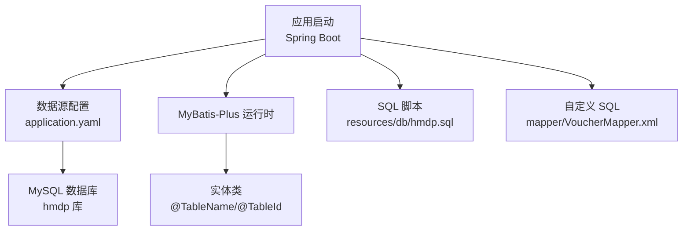
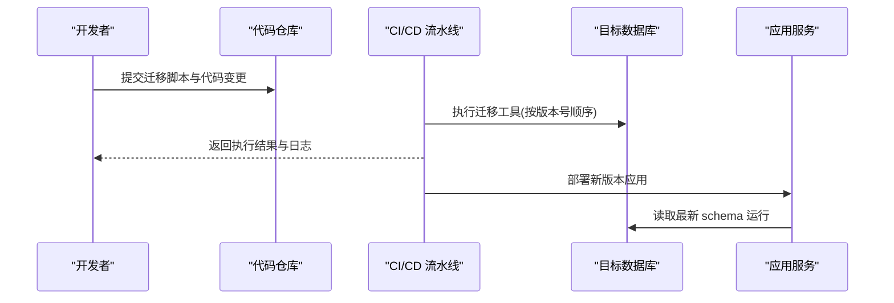
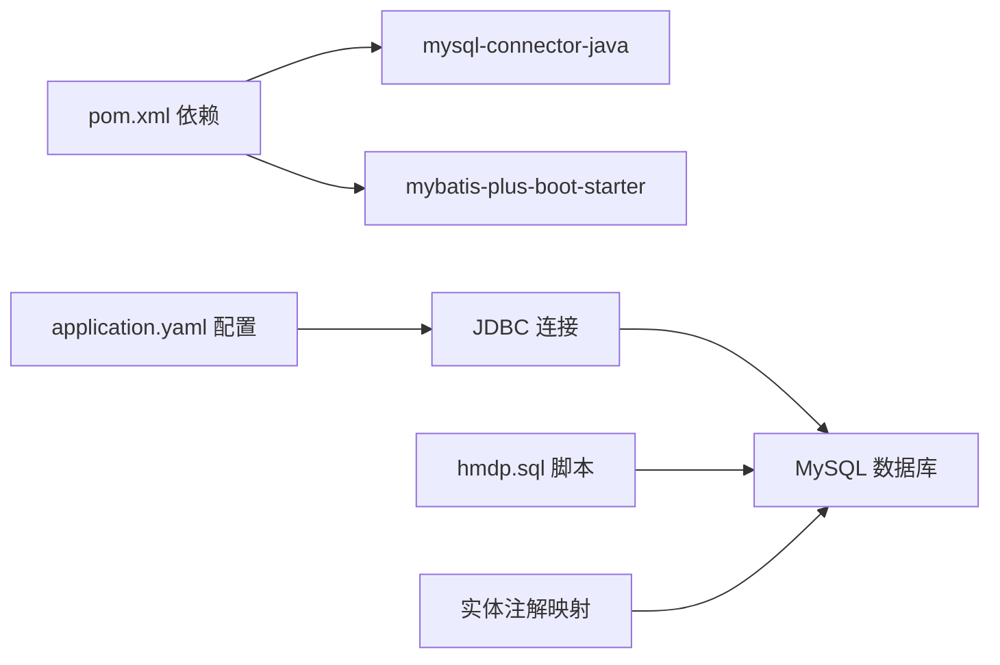

# 数据迁移与版本管理

<cite>
**本文引用的文件列表**
- [hmdp.sql](file://src/main/resources/db/hmdp.sql)
- [application.yaml](file://src/main/resources/application.yaml)
- [pom.xml](file://pom.xml)
- [User.java](file://src/main/java/com/hmdp/entity/User.java)
- [Shop.java](file://src/main/java/com/hmdp/entity/Shop.java)
- [Follow.java](file://src/main/java/com/hmdp/entity/Follow.java)
- [VoucherMapper.xml](file://src/main/resources/mapper/VoucherMapper.xml)
</cite>

## 目录
1. [引言](#引言)
2. [项目结构](#项目结构)
3. [核心组件](#核心组件)
4. [架构总览](#架构总览)
5. [详细组件分析](#详细组件分析)
6. [依赖分析](#依赖分析)
7. [性能考虑](#性能考虑)
8. [故障排查指南](#故障排查指南)
9. [结论](#结论)
10. [附录](#附录)

## 引言
本文件围绕“数据迁移与版本管理”目标，结合仓库现状给出可落地的策略、流程与规范。当前仓库采用单文件全量脚本初始化数据库，未集成自动化迁移工具；实体层使用 MyBatis-Plus 注解映射表结构。本文在尊重现有实现的基础上，提出演进方案：引入 Flyway/Liquibase 进行版本化迁移，完善变更管理、回滚机制、多环境同步、发布流程、测试方法与备份恢复预案。

## 项目结构
与数据迁移相关的资源与配置集中在以下位置：
- 数据库初始脚本：resources/db/hmdp.sql（包含建表与示例数据）
- 应用配置：resources/application.yaml（MySQL 连接信息）
- 构建与依赖：pom.xml（MyBatis-Plus、MySQL 驱动等）
- 实体映射：entity/*.java（通过 @TableName/@TableId 等注解映射到表）
- 自定义 SQL：resources/mapper/VoucherMapper.xml（复杂查询）

图表来源
- [application.yaml:1-28](file://src/main/resources/application.yaml#L1-L28)
- [hmdp.sql:1-1285](file://src/main/resources/db/hmdp.sql#L1-L1285)
- [User.java:1-67](file://src/main/java/com/hmdp/entity/User.java#L1-L67)
- [Shop.java:1-110](file://src/main/java/com/hmdp/entity/Shop.java#L1-L110)
- [Follow.java:1-51](file://src/main/java/com/hmdp/entity/Follow.java#L1-L51)
- [VoucherMapper.xml:1-200](file://src/main/resources/mapper/VoucherMapper.xml#L1-L200)

章节来源
- [application.yaml:1-28](file://src/main/resources/application.yaml#L1-L28)
- [hmdp.sql:1-1285](file://src/main/resources/db/hmdp.sql#L1-L1285)
- [pom.xml:1-96](file://pom.xml#L1-L96)

## 核心组件
- 数据库初始化脚本：hmdp.sql 提供完整的建表语句与示例数据，作为当前环境的基线。
- 应用数据源：application.yaml 中配置 MySQL 连接参数，指向本地 hmdp 库。
- ORM 映射：实体类通过 MyBatis-Plus 注解与表结构对齐，便于后续迁移后保持代码一致性。
- 自定义 SQL：VoucherMapper.xml 存放非标准 SQL，需随迁移脚本协同演进。

章节来源
- [hmdp.sql:1-1285](file://src/main/resources/db/hmdp.sql#L1-L1285)
- [application.yaml:1-28](file://src/main/resources/application.yaml#L1-L28)
- [User.java:1-67](file://src/main/java/com/hmdp/entity/User.java#L1-L67)
- [Shop.java:1-110](file://src/main/java/com/hmdp/entity/Shop.java#L1-L110)
- [Follow.java:1-51](file://src/main/java/com/hmdp/entity/Follow.java#L1-L51)
- [VoucherMapper.xml:1-200](file://src/main/resources/mapper/VoucherMapper.xml#L1-L200)

## 架构总览
当前为“脚本直灌 + 手动执行”的轻量模式。建议演进为“版本化迁移 + 自动化执行”，以支持多环境一致性与可回滚。

[此图为概念性流程图，不直接映射具体源码文件]

## 详细组件分析

### 当前数据库结构与实体映射关系
- 用户域：tb_user、tb_user_info
- 商户域：tb_shop、tb_shop_type
- 内容域：tb_blog、tb_blog_comments
- 关注域：tb_follow
- 券域：tb_voucher、tb_seckill_voucher、tb_voucher_order
- 签到域：tb_sign

实体与表的映射由注解声明，确保迁移后代码与结构保持一致。

```mermaid
erDiagram
TB_USER {
bigint id PK
string phone UK
string password
string nick_name
string icon
timestamp create_time
timestamp update_time
}
TB_USER_INFO {
bigint user_id PK
string city
string introduce
int fans
int followee
tinyint gender
date birthday
int credits
tinyint level
timestamp create_time
timestamp update_time
}
TB_SHOP {
bigint id PK
string name
bigint type_id
string images
string area
string address
double x
double y
bigint avg_price
int sold
int comments
int score
string open_hours
timestamp create_time
timestamp update_time
}
TB_SHOP_TYPE {
bigint id PK
string name
string icon
int sort
timestamp create_time
timestamp update_time
}
TB_BLOG {
bigint id PK
bigint shop_id
bigint user_id
string title
string images
string content
int liked
int comments
timestamp create_time
timestamp update_time
}
TB_BLOG_COMMENTS {
bigint id PK
bigint user_id
bigint blog_id
bigint parent_id
bigint answer_id
string content
int liked
tinyint status
timestamp create_time
timestamp update_time
}
TB_FOLLOW {
bigint id PK
bigint user_id
bigint follow_user_id
timestamp create_time
}
TB_VOUCHER {
bigint id PK
bigint shop_id
string title
string sub_title
string rules
bigint pay_value
bigint actual_value
tinyint type
tinyint status
timestamp create_time
timestamp update_time
}
TB_SECKILL_VOUCHER {
bigint voucher_id PK
int stock
timestamp create_time
timestamp begin_time
timestamp end_time
timestamp update_time
}
TB_VOUCHER_ORDER {
bigint id PK
bigint user_id
bigint voucher_id
tinyint pay_type
tinyint status
timestamp create_time
timestamp pay_time
timestamp use_time
timestamp refund_time
timestamp update_time
}
TB_SIGN {
bigint id PK
bigint user_id
year year
tinyint month
date date
tinyint is_backup
}
```

图表来源
- [hmdp.sql:1-1285](file://src/main/resources/db/hmdp.sql#L1-L1285)

章节来源
- [hmdp.sql:1-1285](file://src/main/resources/db/hmdp.sql#L1-L1285)
- [User.java:1-67](file://src/main/java/com/hmdp/entity/User.java#L1-L67)
- [Shop.java:1-110](file://src/main/java/com/hmdp/entity/Shop.java#L1-L110)
- [Follow.java:1-51](file://src/main/java/com/hmdp/entity/Follow.java#L1-L51)

### 数据迁移工具选择与集成建议
- 推荐工具：Flyway 或 Liquibase（二选一）。两者均支持版本化、幂等执行、回滚与多环境差异化。
- 集成方式：
  - Maven 插件：在 pom.xml 中添加对应插件，绑定生命周期阶段（如 validate、compile、package），在构建时校验或执行迁移。
  - Spring Boot 自动执行：将迁移脚本放入默认路径（如 db/migration），应用启动时自动执行未执行的迁移。
- 命名规范（建议）：
  - V{版本号}__{描述}.sql，例如 V1.0.0__init_schema.sql、V1.0.1__add_user_index.sql
  - 版本号遵循语义化版本，保证严格递增且不可复用。
- 执行顺序：
  - 严格按文件名排序执行，禁止并行执行同一库的迁移。
  - 大表变更拆分为多个小步骤，避免长时间锁表。

章节来源
- [pom.xml:1-96](file://pom.xml#L1-L96)

### 变更管理流程与回滚机制
- 变更提交流程：
  1) 创建分支并新增迁移脚本，附带影响评估与回滚脚本。
  2) 在 PR 中说明变更范围、风险点、回滚策略。
  3) 合并后 CI 自动执行迁移并在测试环境验证。
- 回滚策略：
  - 每个正向迁移尽量配套反向迁移脚本（undo），或在工具中定义回滚逻辑。
  - 生产回滚需先评估数据一致性，必要时先停写再回滚。
- 冲突解决：
  - 多人协作时，若出现同名或重复版本，应调整版本号或拆分变更。
  - 对已执行版本的修改必须通过新的版本号追加，严禁覆盖历史版本。

[本节为通用流程说明，不直接引用具体源码文件]

### 多环境数据库同步方案
- 开发环境：
  - 基于 hmdp.sql 初始化基础库，随后由迁移工具增量推进至最新版本。
- 测试环境：
  - 从生产快照导出脱敏数据，配合迁移脚本达到与生产一致的 schema 与数据基线。
- 生产环境：
  - 灰度发布前先在预发环境执行迁移并回归。
  - 发布窗口内执行迁移，优先执行只读/非阻塞变更，最后执行可能锁表的变更。
- 同步注意事项：
  - 所有环境共享同一套迁移脚本，差异通过环境变量或工具配置区分。
  - 禁止在生产手工执行 SQL，统一由迁移工具执行。

[本节为通用方案说明，不直接引用具体源码文件]

### 自动化部署与发布流程
- CI 阶段：
  - 构建包前执行迁移校验（dry-run），确保脚本语法正确、无冲突。
  - 构建成功后在测试库执行迁移并运行集成测试。
- CD 阶段：
  - 发布任务调用迁移工具执行目标库迁移，成功后滚动重启应用。
  - 失败则触发告警并自动回滚应用版本，必要时执行数据回滚。

[本节为通用流程说明，不直接引用具体源码文件]

### 数据迁移的测试方法
- 单元测试：
  - 针对关键索引、约束、触发器编写断言，验证迁移前后行为一致。
- 集成测试：
  - 使用内存数据库或临时实例，执行完整迁移链路，验证业务接口可用性。
- 数据一致性检查：
  - 对比迁移前后统计信息（行数、空值率、唯一键冲突数）。
  - 对热点表进行抽样比对，确保数据无损。

[本节为通用方法说明，不直接引用具体源码文件]

### 性能影响评估
- 大表变更：
  - 分步添加索引、字段，避免长事务与锁表。
  - 使用在线DDL工具（如 pt-online-schema-change）降低影响。
- 批量更新：
  - 分批提交，控制单次事务大小，避免日志膨胀。
- 监控指标：
  - 观察慢查询、锁等待、复制延迟、CPU/IO 峰值。

[本节为通用指导，不直接引用具体源码文件]

### 生产发布流程（建议）
- 发布前：
  - 完成预发验证与回滚演练。
  - 准备回滚脚本与应急联系人。
- 发布中：
  - 先执行迁移，确认无误后再滚动重启应用。
  - 实时监控关键指标，异常立即回滚。
- 发布后：
  - 观察一段时间，收集性能与错误日志，必要时优化。

[本节为通用流程说明，不直接引用具体源码文件]

### 数据备份恢复策略与灾难恢复预案
- 备份策略：
  - 每日全量备份 + 实时 binlog 增量备份。
  - 异地容灾副本，定期演练恢复。
- 恢复流程：
  - 明确 RTO/RPO 目标，按优先级恢复核心库。
  - 恢复后执行一致性校验与冒烟测试。
- 灾难恢复：
  - 主库不可用时切换只读副本或新实例，重新拉取增量日志追平。
  - 记录恢复过程，复盘改进。

[本节为通用策略说明，不直接引用具体源码文件]

## 依赖分析
- 数据库驱动：MySQL Connector/J（runtime 作用域）
- ORM：MyBatis-Plus（简化 CRUD 与注解映射）
- 配置：application.yaml 指定 JDBC URL、用户名密码等
- 脚本：hmdp.sql 作为初始基线

图表来源
- [pom.xml:1-96](file://pom.xml#L1-L96)
- [application.yaml:1-28](file://src/main/resources/application.yaml#L1-L28)
- [hmdp.sql:1-1285](file://src/main/resources/db/hmdp.sql#L1-L1285)
- [User.java:1-67](file://src/main/java/com/hmdp/entity/User.java#L1-L67)

章节来源
- [pom.xml:1-96](file://pom.xml#L1-L96)
- [application.yaml:1-28](file://src/main/resources/application.yaml#L1-L28)

## 性能考虑
- 迁移脚本应避免一次性大事务，拆分为多次提交。
- 索引重建与数据搬迁建议在低峰期执行。
- 对热点表变更采用双写或影子库过渡，逐步切流。

[本节为通用指导，不直接引用具体源码文件]

## 故障排查指南
- 常见迁移问题：
  - 版本冲突：检查版本号是否重复或乱序。
  - 权限不足：确认迁移账号具备 DDL/DML 权限。
  - 字符集不一致：确保库、表、连接字符集一致。
- 定位手段：
  - 查看迁移工具日志与应用启动日志。
  - 核对数据库版本表（如 flyway_schema_history）记录。
  - 使用 EXPLAIN 分析慢查询，定位索引缺失。

[本节为通用指导，不直接引用具体源码文件]

## 结论
当前仓库以单脚本初始化数据库，适合学习与演示。面向工程化实践，建议尽快引入 Flyway/Liquibase，建立版本化迁移、标准化命名、自动化执行与回滚机制，完善多环境同步与发布流程，并配套备份恢复与灾难恢复预案，从而提升交付质量与系统稳定性。

[本节为总结性内容，不直接引用具体源码文件]

## 附录

### 迁移脚本组织与命名规范（建议）
- 目录结构：db/migration/{version}/
- 命名：V{主版本}.{次版本}.{补丁版本}__{描述}.sql
- 内容：仅包含幂等的增量变更，不包含 DROP DATABASE 等危险操作
- 回滚：配套 U{版本号}__undo.sql 或在工具中声明 undo 逻辑

[本节为通用规范说明，不直接引用具体源码文件]

### 实体与表映射要点
- 使用 @TableName 指定表名，@TableId 指定主键策略，@TableField 标注非持久化字段。
- 迁移后务必同步更新实体注解，避免运行时异常。

章节来源
- [User.java:1-67](file://src/main/java/com/hmdp/entity/User.java#L1-L67)
- [Shop.java:1-110](file://src/main/java/com/hmdp/entity/Shop.java#L1-L110)
- [Follow.java:1-51](file://src/main/java/com/hmdp/entity/Follow.java#L1-L51)