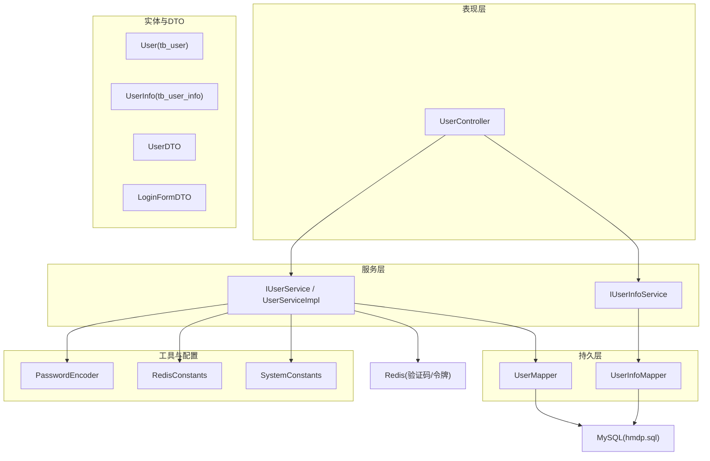
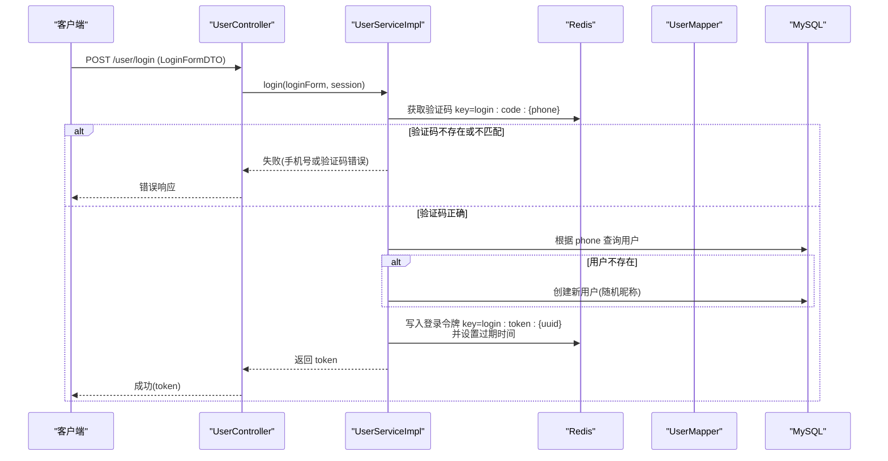
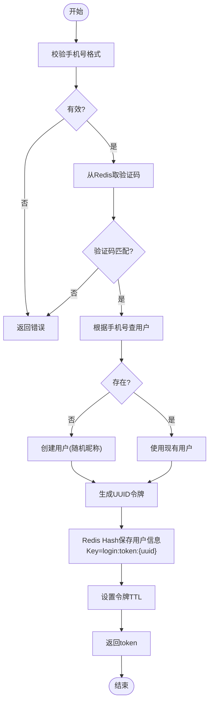
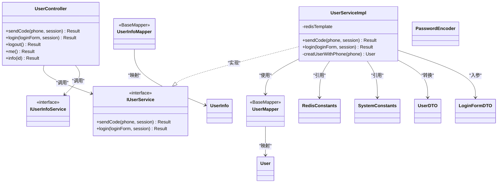

# 用户数据模型

<cite>
**本文引用的文件**   
- [User.java](file://src/main/java/com/hmdp/entity/User.java)
- [UserInfo.java](file://src/main/java/com/hmdp/entity/UserInfo.java)
- [UserDTO.java](file://src/main/java/com/hmdp/dto/UserDTO.java)
- [LoginFormDTO.java](file://src/main/java/com/hmdp/dto/LoginFormDTO.java)
- [UserController.java](file://src/main/java/com/hmdp/controller/UserController.java)
- [IUserService.java](file://src/main/java/com/hmdp/service/IUserService.java)
- [UserServiceImpl.java](file://src/main/java/com/hmdp/service/impl/UserServiceImpl.java)
- [IUserInfoService.java](file://src/main/java/com/hmdp/service/IUserInfoService.java)
- [UserMapper.java](file://src/main/java/com/hmdp/mapper/UserMapper.java)
- [UserInfoMapper.java](file://src/main/java/com/hmdp/mapper/UserInfoMapper.java)
- [PasswordEncoder.java](file://src/main/java/com/hmdp/utils/PasswordEncoder.java)
- [RedisConstants.java](file://src/main/java/com/hmdp/utils/RedisConstants.java)
- [SystemConstants.java](file://src/main/java/com/hmdp/utils/SystemConstants.java)
- [hmdp.sql](file://src/main/resources/db/hmdp.sql)
</cite>

## 目录
1. [简介](#简介)
2. [项目结构](#项目结构)
3. [核心组件](#核心组件)
4. [架构总览](#架构总览)
5. [详细组件分析](#详细组件分析)
6. [依赖关系分析](#依赖关系分析)
7. [性能考虑](#性能考虑)
8. [故障排查指南](#故障排查指南)
9. [结论](#结论)
10. [附录](#附录)

## 简介
本文件为用户模块的数据模型与相关实现文档，聚焦以下目标：
- 明确 tb_user 表的字段定义、数据类型与业务含义
- 记录用户认证信息存储策略、密码加密方式与会话管理机制
- 解释用户信息扩展表 tb_user_info 的设计思路与关联关系
- 说明用户状态管理、权限控制与数据安全考虑
- 描述用户数据访问模式与缓存策略
- 记录用户数据的生命周期管理与隐私保护措施

## 项目结构
围绕用户模块的关键代码组织如下：
- 实体层：User（tb_user）、UserInfo（tb_user_info）
- DTO 层：UserDTO（对外返回的用户基本信息）、LoginFormDTO（登录请求体）
- 控制器层：UserController（登录、验证码、个人信息等接口）
- 服务层：IUserService / UserServiceImpl（登录、注册、验证码、会话令牌生成）；IUserInfoService（用户详情查询）
- 持久层：UserMapper、UserInfoMapper（MyBatis-BaseMapper）
- 工具类：PasswordEncoder（密码加盐与校验）、RedisConstants（Redis Key/TTL 常量）、SystemConstants（系统常量如昵称前缀）
- 数据库脚本：hmdp.sql（包含 tb_user 建表语句）

图表来源
- [UserController.java:1-86](file://src/main/java/com/hmdp/controller/UserController.java#L1-L86)
- [IUserService.java:1-25](file://src/main/java/com/hmdp/service/IUserService.java#L1-L25)
- [UserServiceImpl.java:1-110](file://src/main/java/com/hmdp/service/impl/UserServiceImpl.java#L1-L110)
- [IUserInfoService.java:1-17](file://src/main/java/com/hmdp/service/IUserInfoService.java#L1-L17)
- [UserMapper.java:1-17](file://src/main/java/com/hmdp/mapper/UserMapper.java#L1-L17)
- [UserInfoMapper.java:1-17](file://src/main/java/com/hmdp/mapper/UserInfoMapper.java#L1-L17)
- [User.java:1-67](file://src/main/java/com/hmdp/entity/User.java#L1-L67)
- [UserInfo.java:1-88](file://src/main/java/com/hmdp/entity/UserInfo.java#L1-L88)
- [UserDTO.java:1-11](file://src/main/java/com/hmdp/dto/UserDTO.java#L1-L11)
- [LoginFormDTO.java:1-11](file://src/main/java/com/hmdp/dto/LoginFormDTO.java#L1-L11)
- [PasswordEncoder.java:1-35](file://src/main/java/com/hmdp/utils/PasswordEncoder.java#L1-L35)
- [RedisConstants.java:1-25](file://src/main/java/com/hmdp/utils/RedisConstants.java#L1-L25)
- [SystemConstants.java:1-9](file://src/main/java/com/hmdp/utils/SystemConstants.java#L1-L9)
- [hmdp.sql:191-204](file://src/main/resources/db/hmdp.sql#L191-L204)

章节来源
- [UserController.java:1-86](file://src/main/java/com/hmdp/controller/UserController.java#L1-L86)
- [UserServiceImpl.java:1-110](file://src/main/java/com/hmdp/service/impl/UserServiceImpl.java#L1-L110)
- [hmdp.sql:191-204](file://src/main/resources/db/hmdp.sql#L191-L204)

## 核心组件
- User 实体（映射 tb_user）
  - 主键 id（自增）
  - phone（手机号，唯一索引）
  - password（密码，加密存储）
  - nickName（昵称，默认随机）
  - icon（头像地址）
  - createTime/updateTime（时间戳）
- UserInfo 实体（映射 tb_user_info）
  - userId（主键，即用户 id）
  - city/introduce/fans/followee/gender/birthday/credits/level（个人画像与社交指标）
  - createTime/updateTime（时间戳）
- DTO
  - LoginFormDTO：登录请求（phone/code/password）
  - UserDTO：对外返回的轻量用户信息（id/nickName/icon）
- 工具与常量
  - PasswordEncoder：加盐 MD5 密码编码与匹配
  - RedisConstants：验证码与登录令牌 Key 及 TTL
  - SystemConstants：昵称前缀等系统常量

章节来源
- [User.java:1-67](file://src/main/java/com/hmdp/entity/User.java#L1-L67)
- [UserInfo.java:1-88](file://src/main/java/com/hmdp/entity/UserInfo.java#L1-L88)
- [UserDTO.java:1-11](file://src/main/java/com/hmdp/dto/UserDTO.java#L1-L11)
- [LoginFormDTO.java:1-11](file://src/main/java/com/hmdp/dto/LoginFormDTO.java#L1-L11)
- [PasswordEncoder.java:1-35](file://src/main/java/com/hmdp/utils/PasswordEncoder.java#L1-L35)
- [RedisConstants.java:1-25](file://src/main/java/com/hmdp/utils/RedisConstants.java#L1-L25)
- [SystemConstants.java:1-9](file://src/main/java/com/hmdp/utils/SystemConstants.java#L1-L9)

## 架构总览
用户模块采用典型分层架构：控制器接收请求，服务层编排业务逻辑，持久层通过 MyBatis-Plus 操作数据库，同时使用 Redis 缓存验证码与登录令牌。

图表来源
- [UserController.java:49-53](file://src/main/java/com/hmdp/controller/UserController.java#L49-L53)
- [UserServiceImpl.java:63-100](file://src/main/java/com/hmdp/service/impl/UserServiceImpl.java#L63-L100)
- [RedisConstants.java:4-7](file://src/main/java/com/hmdp/utils/RedisConstants.java#L4-L7)
- [UserMapper.java:14-16](file://src/main/java/com/hmdp/mapper/UserMapper.java#L14-L16)
- [hmdp.sql:191-204](file://src/main/resources/db/hmdp.sql#L191-L204)

## 详细组件分析

### 数据模型与字段定义（tb_user）
- 表名：tb_user
- 字段与类型（依据 SQL 与实体映射）
  - id：bigint unsigned，自增主键，用户唯一标识
  - phone：varchar(11)，手机号，唯一索引 uniqe_key_phone
  - password：varchar(128)，密码，加密存储
  - nick_name：varchar(32)，昵称，默认空（注册时按规则生成）
  - icon：varchar(255)，头像地址，默认空
  - create_time：timestamp，创建时间
  - update_time：timestamp，更新时间
- 业务含义
  - phone 作为用户登录主键之一，具备唯一性约束
  - password 以“盐@密文”形式存储，避免明文泄露风险
  - nick_name 在注册时自动生成，便于匿名体验
  - icon 用于展示用户头像资源路径
  - 时间戳用于审计与追踪

章节来源
- [hmdp.sql:191-204](file://src/main/resources/db/hmdp.sql#L191-L204)
- [User.java:24-66](file://src/main/java/com/hmdp/entity/User.java#L24-L66)

### 数据模型与字段定义（tb_user_info）
- 表名：tb_user_info
- 字段与类型（依据实体映射）
  - user_id：bigint，主键，与 tb_user.id 一一对应
  - city：城市名称
  - introduce：个人介绍（建议不超过 128 字符）
  - fans：粉丝数量
  - followee：关注人数
  - gender：性别（布尔值，约定 0/1 语义）
  - birthday：生日
  - credits：积分
  - level：会员级别（布尔值，约定是否开通会员）
  - create_time/update_time：时间戳
- 设计思路
  - 将非核心认证信息与用户画像拆分至扩展表，降低主表宽度，提升读写性能
  - 通过 user_id 与 tb_user.id 建立一对一关系，便于按需加载

章节来源
- [UserInfo.java:25-87](file://src/main/java/com/hmdp/entity/UserInfo.java#L25-L87)

### 用户认证与会话管理
- 登录流程
  - 支持手机验证码登录：校验手机号格式 -> 从 Redis 读取验证码 -> 匹配后自动注册或登录 -> 生成 UUID 令牌 -> 将用户信息序列化存入 Redis（Hash）-> 返回 token
  - 当前未启用密码登录分支（LoginFormDTO 含 password 字段，但登录实现未使用）
- 令牌存储
  - Key 命名：login:token:{uuid}
  - 数据结构：Hash，存放用户基础信息（由 UserDTO 转换）
  - TTL：固定秒级过期时间
- 验证码存储
  - Key 命名：login:code:{phone}
  - TTL：分钟级过期时间
- 当前线程上下文
  - 提供 UserHolder 基于 ThreadLocal 保存当前用户上下文（当前登录接口未集成拦截器注入）

图表来源
- [UserServiceImpl.java:47-100](file://src/main/java/com/hmdp/service/impl/UserServiceImpl.java#L47-L100)
- [RedisConstants.java:4-7](file://src/main/java/com/hmdp/utils/RedisConstants.java#L4-L7)
- [SystemConstants.java:5](file://src/main/java/com/hmdp/utils/SystemConstants.java#L5)

章节来源
- [UserController.java:49-53](file://src/main/java/com/hmdp/controller/UserController.java#L49-L53)
- [UserServiceImpl.java:63-100](file://src/main/java/com/hmdp/service/impl/UserServiceImpl.java#L63-L100)
- [RedisConstants.java:4-7](file://src/main/java/com/hmdp/utils/RedisConstants.java#L4-L7)
- [UserHolder.java:1-20](file://src/main/java/com/hmdp/utils/UserHolder.java#L1-L20)

### 密码加密策略
- 算法：MD5 + 随机盐
- 存储格式：salt@md5(password+salt)
- 校验：解析 salt，重新计算摘要并与存储值比较
- 注意：当前登录流程未使用该编码器进行密码校验（仅验证码登录），如需启用密码登录需在服务层集成

章节来源
- [PasswordEncoder.java:11-33](file://src/main/java/com/hmdp/utils/PasswordEncoder.java#L11-L33)
- [User.java:42-43](file://src/main/java/com/hmdp/entity/User.java#L42-L43)

### 用户信息扩展表设计与关联
- 一对一关系：tb_user_info.user_id = tb_user.id
- 用途：承载用户画像与社交指标，减少主表 IO 压力
- 访问模式：按需查询，避免每次返回冗余字段

章节来源
- [UserInfo.java:30-34](file://src/main/java/com/hmdp/entity/UserInfo.java#L30-L34)
- [UserController.java:72-84](file://src/main/java/com/hmdp/controller/UserController.java#L72-L84)

### 用户状态管理
- 当前无显式“状态位”字段（如禁用/封禁）。可通过扩展表或新增字段实现
- 建议：在 tb_user_info.level 或新增 status 字段表达活跃/冻结等状态，配合业务规则控制访问

[本节为通用建议，不直接分析具体文件]

### 权限控制与安全
- 当前未实现基于角色的权限控制（RBAC）
- 建议：引入角色/权限表，结合拦截器对敏感接口鉴权
- 安全加固：
  - 传输层强制 HTTPS
  - 令牌定期刷新与黑名单机制
  - 输入校验与防重放（验证码一次性、限频）

[本节为通用建议，不直接分析具体文件]

### 数据安全与隐私保护
- 密码加盐哈希存储，避免明文泄露
- 手机号作为唯一标识，需防止枚举攻击（验证码限频、风控）
- 对外返回最小化用户信息（UserDTO 仅包含必要字段）
- 日志脱敏：避免打印敏感信息（当前实现有 debug 输出验证码，生产环境需关闭）

章节来源
- [UserServiceImpl.java:58](file://src/main/java/com/hmdp/service/impl/UserServiceImpl.java#L58)
- [UserDTO.java:6-10](file://src/main/java/com/hmdp/dto/UserDTO.java#L6-L10)

### 用户数据访问模式与缓存策略
- 读多写少场景：用户基本信息可加入本地/分布式缓存（当前未实现）
- 热点数据：用户详情可按 user_id 缓存，设置合理 TTL 与失效策略
- 一致性：更新用户信息后主动失效缓存或采用延迟双删

章节来源
- [UserServiceImpl.java:90-99](file://src/main/java/com/hmdp/service/impl/UserServiceImpl.java#L90-L99)
- [RedisConstants.java:4-7](file://src/main/java/com/hmdp/utils/RedisConstants.java#L4-L7)

### 用户数据生命周期与清理
- 注册：首次登录自动创建用户记录（随机昵称）
- 登录：生成令牌并设置过期时间
- 登出：当前接口未完成，建议删除 Redis 中的令牌并清理 ThreadLocal
- 注销/删除：需级联清理扩展表与缓存，并遵循合规保留策略

章节来源
- [UserServiceImpl.java:82-108](file://src/main/java/com/hmdp/service/impl/UserServiceImpl.java#L82-L108)
- [UserController.java:59-63](file://src/main/java/com/hmdp/controller/UserController.java#L59-L63)

## 依赖关系分析
- 控制器依赖服务接口
- 服务实现依赖 Redis、MyBatis-Plus BaseMapper、工具类
- 实体与 Mapper 解耦，遵循单一职责
- 常量集中管理，降低耦合度

图表来源
- [UserController.java:1-86](file://src/main/java/com/hmdp/controller/UserController.java#L1-L86)
- [IUserService.java:1-25](file://src/main/java/com/hmdp/service/IUserService.java#L1-L25)
- [UserServiceImpl.java:1-110](file://src/main/java/com/hmdp/service/impl/UserServiceImpl.java#L1-L110)
- [IUserInfoService.java:1-17](file://src/main/java/com/hmdp/service/IUserInfoService.java#L1-L17)
- [UserMapper.java:1-17](file://src/main/java/com/hmdp/mapper/UserMapper.java#L1-L17)
- [UserInfoMapper.java:1-17](file://src/main/java/com/hmdp/mapper/UserInfoMapper.java#L1-L17)
- [User.java:1-67](file://src/main/java/com/hmdp/entity/User.java#L1-L67)
- [UserInfo.java:1-88](file://src/main/java/com/hmdp/entity/UserInfo.java#L1-L88)
- [UserDTO.java:1-11](file://src/main/java/com/hmdp/dto/UserDTO.java#L1-L11)
- [LoginFormDTO.java:1-11](file://src/main/java/com/hmdp/dto/LoginFormDTO.java#L1-L11)
- [RedisConstants.java:1-25](file://src/main/java/com/hmdp/utils/RedisConstants.java#L1-L25)
- [SystemConstants.java:1-9](file://src/main/java/com/hmdp/utils/SystemConstants.java#L1-L9)

章节来源
- [UserController.java:1-86](file://src/main/java/com/hmdp/controller/UserController.java#L1-L86)
- [UserServiceImpl.java:1-110](file://src/main/java/com/hmdp/service/impl/UserServiceImpl.java#L1-L110)

## 性能考虑
- 登录流程优先走 Redis 验证码校验，减少数据库压力
- 令牌以 Hash 存储，便于快速存取用户信息
- 建议：
  - 用户详情增加二级缓存（本地+分布式）
  - 热点用户信息预加载与批量更新
  - 数据库连接池与慢查询优化

[本节为通用建议，不直接分析具体文件]

## 故障排查指南
- 验证码错误
  - 检查 Redis 中是否存在对应 key 且未过期
  - 确认手机号格式校验逻辑
- 登录失败
  - 检查 Redis 令牌是否写入成功及 TTL 是否正确
  - 检查用户是否存在，若不存在是否自动创建
- 日志问题
  - 当前实现包含验证码 debug 输出，生产环境需关闭或脱敏

章节来源
- [UserServiceImpl.java:47-80](file://src/main/java/com/hmdp/service/impl/UserServiceImpl.java#L47-L80)
- [UserServiceImpl.java:90-99](file://src/main/java/com/hmdp/service/impl/UserServiceImpl.java#L90-L99)

## 结论
- 用户主表 tb_user 聚焦认证与基础信息，扩展表 tb_user_info 承载画像与社交指标，结构清晰、可扩展性强
- 当前采用手机验证码登录，令牌存于 Redis，具备高并发友好特性
- 密码已具备加盐存储能力，后续可平滑接入密码登录
- 建议在权限控制、缓存一致性与隐私保护方面进一步完善

[本节为总结性内容，不直接分析具体文件]

## 附录

### 表结构与字段清单（tb_user）
- id：bigint unsigned，自增主键
- phone：varchar(11)，唯一索引
- password：varchar(128)，加密存储
- nick_name：varchar(32)，默认空
- icon：varchar(255)，默认空
- create_time：timestamp
- update_time：timestamp

章节来源
- [hmdp.sql:191-204](file://src/main/resources/db/hmdp.sql#L191-L204)
- [User.java:24-66](file://src/main/java/com/hmdp/entity/User.java#L24-L66)

### 表结构与字段清单（tb_user_info）
- user_id：bigint，主键
- city：字符串
- introduce：字符串（建议长度限制）
- fans：整数
- followee：整数
- gender：布尔
- birthday：日期
- credits：整数
- level：布尔
- create_time/update_time：时间戳

章节来源
- [UserInfo.java:25-87](file://src/main/java/com/hmdp/entity/UserInfo.java#L25-L87)

### 关键常量与 Key 规范
- 验证码 Key：login:code:{phone}，TTL 分钟级
- 令牌 Key：login:token:{uuid}，TTL 秒级
- 昵称前缀：user_

章节来源
- [RedisConstants.java:4-7](file://src/main/java/com/hmdp/utils/RedisConstants.java#L4-L7)
- [SystemConstants.java:5](file://src/main/java/com/hmdp/utils/SystemConstants.java#L5)