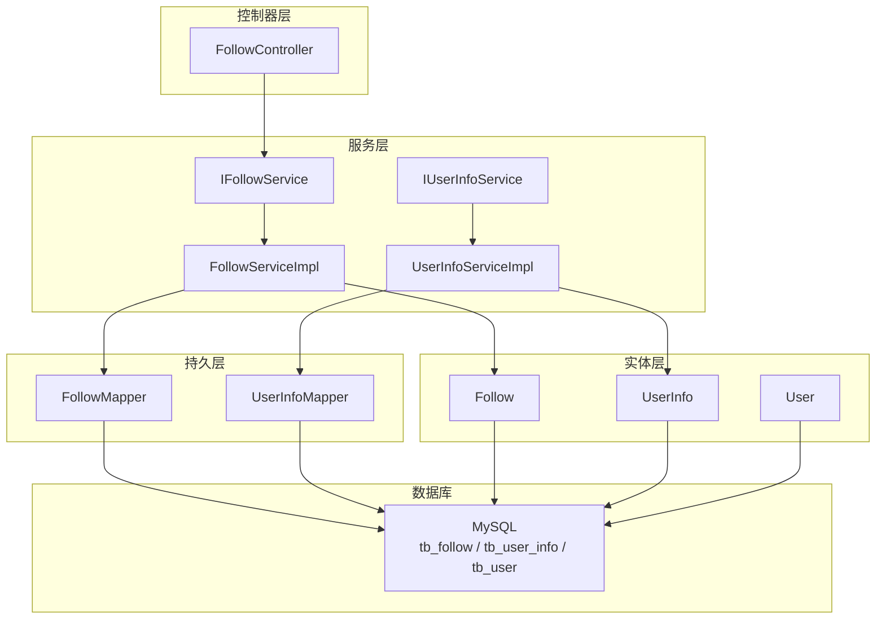
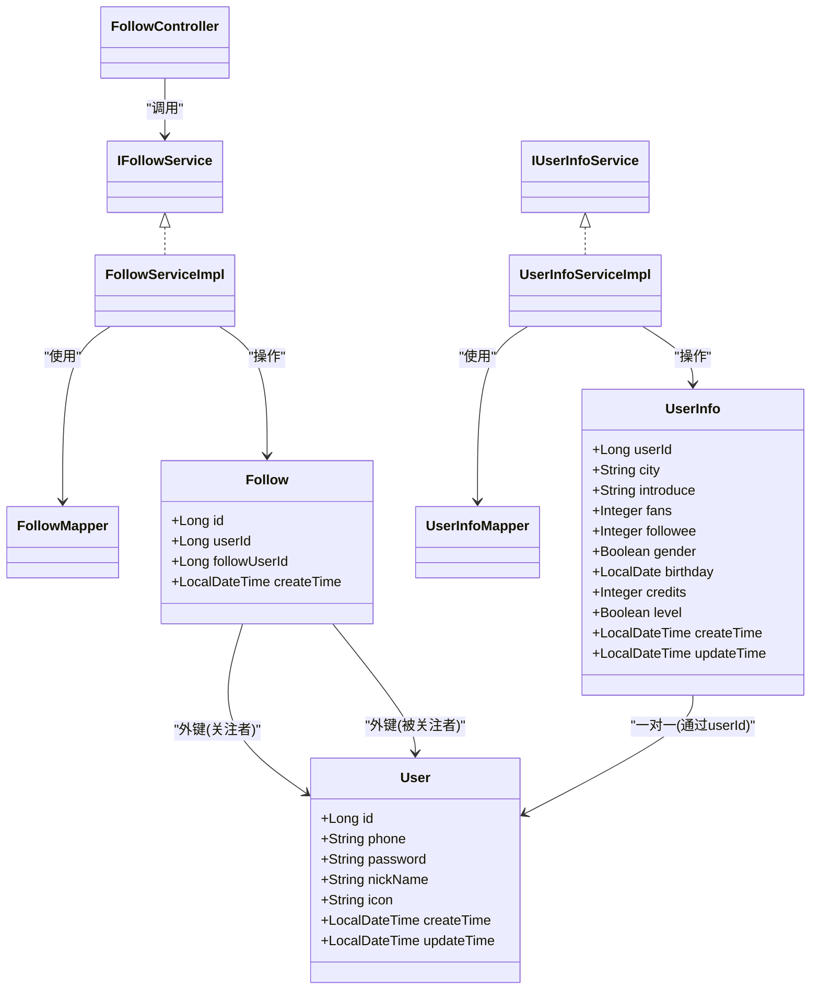
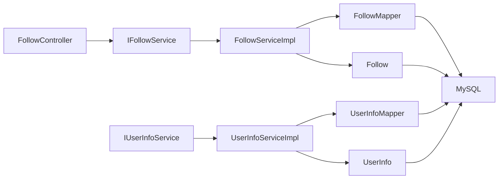
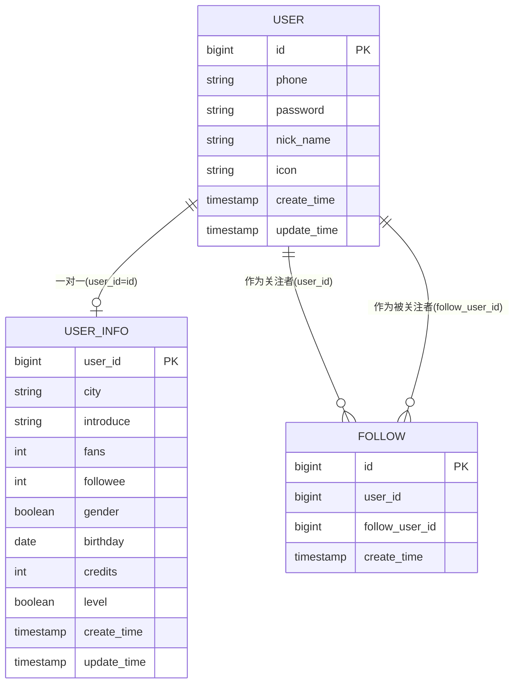
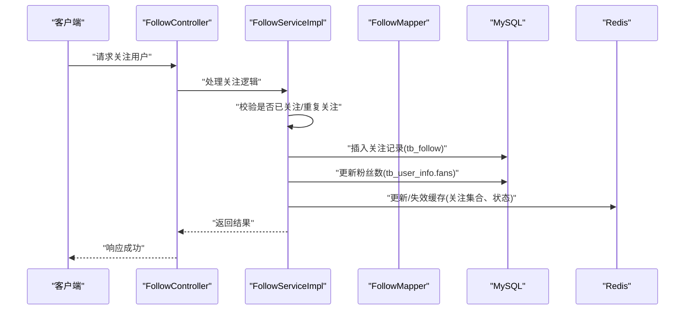

# 社交数据模型

<cite>
**本文引用的文件**   
- [Follow.java](file://src/main/java/com/hmdp/entity/Follow.java)
- [UserInfo.java](file://src/main/java/com/hmdp/entity/UserInfo.java)
- [User.java](file://src/main/java/com/hmdp/entity/User.java)
- [IFollowService.java](file://src/main/java/com/hmdp/service/IFollowService.java)
- [FollowServiceImpl.java](file://src/main/java/com/hmdp/service/impl/FollowServiceImpl.java)
- [IUserInfoService.java](file://src/main/java/com/hmdp/service/IUserInfoService.java)
- [UserInfoServiceImpl.java](file://src/main/java/com/hmdp/service/impl/UserInfoServiceImpl.java)
- [FollowMapper.java](file://src/main/java/com/hmdp/mapper/FollowMapper.java)
- [UserInfoMapper.java](file://src/main/java/com/hmdp/mapper/UserInfoMapper.java)
- [FollowController.java](file://src/main/java/com/hmdp/controller/FollowController.java)
- [hmdp.sql](file://src/main/resources/db/hmdp.sql)
</cite>

## 目录
1. [简介](#简介)
2. [项目结构](#项目结构)
3. [核心组件](#核心组件)
4. [架构总览](#架构总览)
5. [详细组件分析](#详细组件分析)
6. [依赖关系分析](#依赖关系分析)
7. [性能考虑](#性能考虑)
8. [故障排查指南](#故障排查指南)
9. [结论](#结论)
10. [附录](#附录)

## 简介
本文件聚焦于社交模块的数据模型与相关实现，围绕以下目标展开：
- 关注关系表 tb_follow 的结构设计与双向关注、粉丝统计机制
- 用户信息扩展表 tb_user_info 的业务用途与关联关系
- 关注状态维护、关注列表查询优化与推荐算法支持
- 社交数据的缓存策略、实时推送与数据同步机制
- 隐私保护与权限控制方案
- 社交行为数据分析与用户画像构建

## 项目结构
本项目采用分层架构：控制器层、服务层、持久层（MyBatis-Plus）、实体映射与数据库脚本。社交相关的关键代码分布如下：
- 实体层：Follow、UserInfo、User
- 服务层：IFollowService/FollowServiceImpl、IUserInfoService/UserInfoServiceImpl
- 持久层：FollowMapper、UserInfoMapper
- 控制器层：FollowController
- 数据库脚本：hmdp.sql

图表来源
- [FollowController.java](file://src/main/java/com/hmdp/controller/FollowController.java)
- [IFollowService.java](file://src/main/java/com/hmdp/service/IFollowService.java)
- [FollowServiceImpl.java](file://src/main/java/com/hmdp/service/impl/FollowServiceImpl.java)
- [FollowMapper.java](file://src/main/java/com/hmdp/mapper/FollowMapper.java)
- [IUserInfoService.java](file://src/main/java/com/hmdp/service/IUserInfoService.java)
- [UserInfoServiceImpl.java](file://src/main/java/com/hmdp/service/impl/UserInfoServiceImpl.java)
- [UserInfoMapper.java](file://src/main/java/com/hmdp/mapper/UserInfoMapper.java)
- [Follow.java](file://src/main/java/com/hmdp/entity/Follow.java)
- [UserInfo.java](file://src/main/java/com/hmdp/entity/UserInfo.java)
- [User.java](file://src/main/java/com/hmdp/entity/User.java)
- [hmdp.sql](file://src/main/resources/db/hmdp.sql)

章节来源
- [FollowController.java](file://src/main/java/com/hmdp/controller/FollowController.java)
- [IFollowService.java](file://src/main/java/com/hmdp/service/IFollowService.java)
- [FollowServiceImpl.java](file://src/main/java/com/hmdp/service/impl/FollowServiceImpl.java)
- [IUserInfoService.java](file://src/main/java/com/hmdp/service/IUserInfoService.java)
- [UserInfoServiceImpl.java](file://src/main/java/com/hmdp/service/impl/UserInfoServiceImpl.java)
- [FollowMapper.java](file://src/main/java/com/hmdp/mapper/FollowMapper.java)
- [UserInfoMapper.java](file://src/main/java/com/hmdp/mapper/UserInfoMapper.java)
- [Follow.java](file://src/main/java/com/hmdp/entity/Follow.java)
- [UserInfo.java](file://src/main/java/com/hmdp/entity/UserInfo.java)
- [User.java](file://src/main/java/com/hmdp/entity/User.java)
- [hmdp.sql](file://src/main/resources/db/hmdp.sql)

## 核心组件
- 关注关系实体 Follow：表示“用户A关注用户B”的单向关系，包含主键、关注者userId、被关注者followUserId、创建时间。
- 用户信息扩展实体 UserInfo：在基础用户信息之上扩展城市、个人介绍、粉丝数fans、关注数followee、性别、生日、积分、会员级别等字段，并维护更新时间。
- 基础用户实体 User：存储登录认证与基础资料（手机号、密码、昵称、头像、时间戳）。
- 服务接口与实现：IFollowService/FollowServiceImpl 与 IUserInfoService/UserInfoServiceImpl 基于 MyBatis-Plus 提供通用CRUD能力。
- Mapper：FollowMapper、UserInfoMapper 继承 BaseMapper，提供标准数据访问方法。
- 控制器：FollowController 预留社交关注相关接口入口。

章节来源
- [Follow.java](file://src/main/java/com/hmdp/entity/Follow.java)
- [UserInfo.java](file://src/main/java/com/hmdp/entity/UserInfo.java)
- [User.java](file://src/main/java/com/hmdp/entity/User.java)
- [IFollowService.java](file://src/main/java/com/hmdp/service/IFollowService.java)
- [FollowServiceImpl.java](file://src/main/java/com/hmdp/service/impl/FollowServiceImpl.java)
- [IUserInfoService.java](file://src/main/java/com/hmdp/service/IUserInfoService.java)
- [UserInfoServiceImpl.java](file://src/main/java/com/hmdp/service/impl/UserInfoServiceImpl.java)
- [FollowMapper.java](file://src/main/java/com/hmdp/mapper/FollowMapper.java)
- [UserInfoMapper.java](file://src/main/java/com/hmdp/mapper/UserInfoMapper.java)
- [FollowController.java](file://src/main/java/com/hmdp/controller/FollowController.java)

## 架构总览
从数据模型到业务能力的整体视图如下：

图表来源
- [User.java](file://src/main/java/com/hmdp/entity/User.java)
- [UserInfo.java](file://src/main/java/com/hmdp/entity/UserInfo.java)
- [Follow.java](file://src/main/java/com/hmdp/entity/Follow.java)
- [IFollowService.java](file://src/main/java/com/hmdp/service/IFollowService.java)
- [FollowServiceImpl.java](file://src/main/java/com/hmdp/service/impl/FollowServiceImpl.java)
- [IUserInfoService.java](file://src/main/java/com/hmdp/service/IUserInfoService.java)
- [UserInfoServiceImpl.java](file://src/main/java/com/hmdp/service/impl/UserInfoServiceImpl.java)
- [FollowMapper.java](file://src/main/java/com/hmdp/mapper/FollowMapper.java)
- [UserInfoMapper.java](file://src/main/java/com/hmdp/mapper/UserInfoMapper.java)
- [FollowController.java](file://src/main/java/com/hmdp/controller/FollowController.java)

## 详细组件分析

### 关注关系表 tb_follow 设计
- 字段说明
  - id：自增主键
  - user_id：关注者ID
  - follow_user_id：被关注者ID
  - create_time：关注创建时间
- 索引建议
  - 为 user_id 建立索引以加速“我的关注列表”查询
  - 为 follow_user_id 建立索引以加速“某人粉丝列表”查询
  - 联合唯一索引 (user_id, follow_user_id) 防止重复关注
- 双向关注语义
  - 单向记录：A关注B即插入一条 (A,B)
  - 双向关注：当B也关注A时，再插入一条 (B,A)，系统据此判定“互相关注”
- 粉丝统计机制
  - 可基于 tb_user_info.fans 字段进行快速展示
  - 更新策略：新增关注时，对 follow_user_id 对应用户的 fans 计数+1；取消关注时-1
  - 一致性保障：建议在事务中同时写入 tb_follow 与更新 tb_user_info.fans

章节来源
- [hmdp.sql](file://src/main/resources/db/hmdp.sql)
- [Follow.java](file://src/main/java/com/hmdp/entity/Follow.java)
- [UserInfo.java](file://src/main/java/com/hmdp/entity/UserInfo.java)

### 用户信息扩展表 tb_user_info 业务用途
- 字段说明
  - user_id：与 tb_user.id 一对一关联
  - city/introduce/gender/birthday/credits/level：用户画像与展示信息
  - fans/followee：粉丝数与关注数，用于列表页与主页快速展示
  - createTime/updateTime：审计与变更追踪
- 与 tb_user 的关系
  - 一对一：通过 user_id = id 关联
  - 读多写少场景下，将高频展示字段拆分至扩展表，降低主表压力

章节来源
- [UserInfo.java](file://src/main/java/com/hmdp/entity/UserInfo.java)
- [User.java](file://src/main/java/com/hmdp/entity/User.java)
- [hmdp.sql](file://src/main/resources/db/hmdp.sql)

### 关注状态维护与关注列表查询优化
- 关注状态判断
  - 读取当前用户uid与被查看用户vid
  - 查询是否存在 (uid, vid) 记录，存在则“已关注”，否则“未关注”
  - 若需显示“互相关注”，再检查是否存在 (vid, uid)
- 关注列表查询优化
  - 使用 user_id 索引分页查询“我的关注”
  - 使用 follow_user_id 索引分页查询“某人的粉丝”
  - 结合 Redis Set/ZSet 缓存热点用户的关注/粉丝集合，减少DB压力
- 推荐算法支持
  - 利用关注图谱（有向图）计算二度人脉、共同关注、相似兴趣
  - 基于 fans/followee 权重与互动频率生成候选集，排序后返回

章节来源
- [Follow.java](file://src/main/java/com/hmdp/entity/Follow.java)
- [UserInfo.java](file://src/main/java/com/hmdp/entity/UserInfo.java)
- [hmdp.sql](file://src/main/resources/db/hmdp.sql)

### 用户信息扩展表的读写与一致性
- 写路径
  - 修改个人信息：更新 tb_user_info 对应字段
  - 关注/取关：在事务内更新 tb_follow 与 tb_user_info.fans/followee
- 读路径
  - 组合查询：JOIN tb_user 与 tb_user_info，或先查扩展表再补全基础信息
- 一致性策略
  - 短事务保证原子性
  - 失败回滚与重试
  - 异步补偿任务定期校对 fans/followee 与真实关系数量

章节来源
- [UserInfoServiceImpl.java](file://src/main/java/com/hmdp/service/impl/UserInfoServiceImpl.java)
- [FollowServiceImpl.java](file://src/main/java/com/hmdp/service/impl/FollowServiceImpl.java)
- [UserInfo.java](file://src/main/java/com/hmdp/entity/UserInfo.java)
- [Follow.java](file://src/main/java/com/hmdp/entity/Follow.java)

### 缓存策略、实时推送与数据同步
- 缓存策略
  - 关注状态：Redis String/Hash，key=user:follow:{uid}:{vid}，value=0/1
  - 关注/粉丝集合：Redis Set，key=user:following:{uid}、user:fans:{vid}
  - 用户信息：Redis Hash，key=user:info:{uid}，TTL按热度设置
  - 双写一致性：Cache-Aside 模式，先更新DB再删除缓存，或使用延迟双删
- 实时推送
  - 新关注事件：通过消息队列广播，订阅端更新本地缓存与在线用户会话
  - 前端长连接/WebSocket：推送“对方已关注你”等通知
- 数据同步
  - 增量日志：监听数据库变更（如CDC），回放至缓存与搜索索引
  - 定时校对：周期性比对 fans/followee 与真实关系，修复偏差

章节来源
- [FollowServiceImpl.java](file://src/main/java/com/hmdp/service/impl/FollowServiceImpl.java)
- [UserInfoServiceImpl.java](file://src/main/java/com/hmdp/service/impl/UserInfoServiceImpl.java)
- [UserInfo.java](file://src/main/java/com/hmdp/entity/UserInfo.java)
- [Follow.java](file://src/main/java/com/hmdp/entity/Follow.java)

### 隐私保护与权限控制
- 最小可见原则
  - 仅展示必要字段（如昵称、头像、城市），隐藏敏感信息（手机号、密码等）
- 关注可见性
  - 允许用户设置“仅互相关注可见”或“公开可见”
- 鉴权与授权
  - 基于角色的访问控制（RBAC）或基于资源的访问控制（ABAC）
  - 接口级校验：确保只能查看自身或授权范围内的关注/粉丝数据
- 合规与安全
  - 数据脱敏输出
  - 防爬与限流
  - 审计日志留存

[本节为通用方案说明，不直接分析具体文件]

### 社交行为数据分析与用户画像构建
- 指标体系
  - 关注转化率、取关率、活跃关注时长分布
  - 粉丝增长趋势、互动深度（点赞/评论/转发）
- 画像维度
  - 基础属性：性别、生日、城市
  - 行为偏好：关注领域、内容消费偏好
  - 社交影响力：粉丝量、互关比例、中心度
- 数据管道
  - 埋点采集 -> 消息队列 -> 离线/实时计算 -> 画像标签库
  - 与推荐系统联动，形成“关注-内容-商品”闭环

[本节为通用方案说明，不直接分析具体文件]

## 依赖关系分析
- 组件耦合
  - FollowController 依赖 IFollowService
  - FollowServiceImpl 依赖 FollowMapper 与 Follow 实体
  - UserInfoServiceImpl 依赖 UserInfoMapper 与 UserInfo 实体
- 外部依赖
  - MySQL：持久化存储
  - Redis（可选）：缓存与集合运算
  - 消息队列（可选）：事件驱动与实时推送
- 潜在循环依赖
  - 当前分层清晰，未发现循环依赖风险

图表来源
- [FollowController.java](file://src/main/java/com/hmdp/controller/FollowController.java)
- [IFollowService.java](file://src/main/java/com/hmdp/service/IFollowService.java)
- [FollowServiceImpl.java](file://src/main/java/com/hmdp/service/impl/FollowServiceImpl.java)
- [FollowMapper.java](file://src/main/java/com/hmdp/mapper/FollowMapper.java)
- [IUserInfoService.java](file://src/main/java/com/hmdp/service/IUserInfoService.java)
- [UserInfoServiceImpl.java](file://src/main/java/com/hmdp/service/impl/UserInfoServiceImpl.java)
- [UserInfoMapper.java](file://src/main/java/com/hmdp/mapper/UserInfoMapper.java)
- [Follow.java](file://src/main/java/com/hmdp/entity/Follow.java)
- [UserInfo.java](file://src/main/java/com/hmdp/entity/UserInfo.java)
- [hmdp.sql](file://src/main/resources/db/hmdp.sql)

章节来源
- [FollowController.java](file://src/main/java/com/hmdp/controller/FollowController.java)
- [IFollowService.java](file://src/main/java/com/hmdp/service/IFollowService.java)
- [FollowServiceImpl.java](file://src/main/java/com/hmdp/service/impl/FollowServiceImpl.java)
- [IUserInfoService.java](file://src/main/java/com/hmdp/service/IUserInfoService.java)
- [UserInfoServiceImpl.java](file://src/main/java/com/hmdp/service/impl/UserInfoServiceImpl.java)
- [FollowMapper.java](file://src/main/java/com/hmdp/mapper/FollowMapper.java)
- [UserInfoMapper.java](file://src/main/java/com/hmdp/mapper/UserInfoMapper.java)
- [Follow.java](file://src/main/java/com/hmdp/entity/Follow.java)
- [UserInfo.java](file://src/main/java/com/hmdp/entity/UserInfo.java)
- [hmdp.sql](file://src/main/resources/db/hmdp.sql)

## 性能考虑
- 数据库层面
  - 合理索引：user_id、follow_user_id、联合唯一索引
  - 分库分表：按 user_id 哈希分片，缓解单表膨胀
  - 读写分离：读多写少场景下提升吞吐
- 缓存层面
  - 热点用户关注/粉丝集合缓存，避免频繁DB查询
  - 多级缓存：本地缓存 + Redis，缩短延迟
- 并发与一致性
  - 分布式锁保护关键写路径（如首次关注）
  - 幂等设计：防止重复关注
- 查询优化
  - 分页游标替代偏移分页
  - 按需加载：只拉取必要字段

[本节为通用指导，不直接分析具体文件]

## 故障排查指南
- 常见问题
  - 关注状态不一致：核对缓存与DB，执行一致性校对任务
  - 粉丝数异常：对比 fans 与 tb_follow 计数，定位漏更新或并发问题
  - 重复关注：检查唯一约束与去重逻辑
- 定位手段
  - 开启慢查询日志，定位低效SQL
  - 监控缓存命中率与错误率
  - 链路追踪：从控制器到持久层的调用链
- 恢复策略
  - 补偿任务：批量修正 fans/followee
  - 灰度发布与回滚预案

[本节为通用指导，不直接分析具体文件]

## 结论
本方案以 tb_follow 与 tb_user_info 为核心，构建了可扩展的社交数据模型。通过合理的索引与缓存策略、事务一致性与异步补偿机制，兼顾了性能与正确性。在此基础上，可进一步接入实时推送、推荐系统与用户画像，形成完整的社交生态。

[本节为总结性内容，不直接分析具体文件]

## 附录

### 数据模型ER图

图表来源
- [User.java](file://src/main/java/com/hmdp/entity/User.java)
- [UserInfo.java](file://src/main/java/com/hmdp/entity/UserInfo.java)
- [Follow.java](file://src/main/java/com/hmdp/entity/Follow.java)
- [hmdp.sql](file://src/main/resources/db/hmdp.sql)

### 关注流程时序图

图表来源
- [FollowController.java](file://src/main/java/com/hmdp/controller/FollowController.java)
- [FollowServiceImpl.java](file://src/main/java/com/hmdp/service/impl/FollowServiceImpl.java)
- [FollowMapper.java](file://src/main/java/com/hmdp/mapper/FollowMapper.java)
- [Follow.java](file://src/main/java/com/hmdp/entity/Follow.java)
- [UserInfo.java](file://src/main/java/com/hmdp/entity/UserInfo.java)
- [hmdp.sql](file://src/main/resources/db/hmdp.sql)