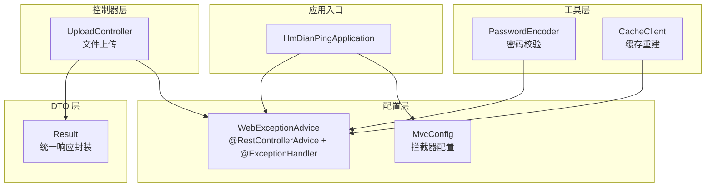
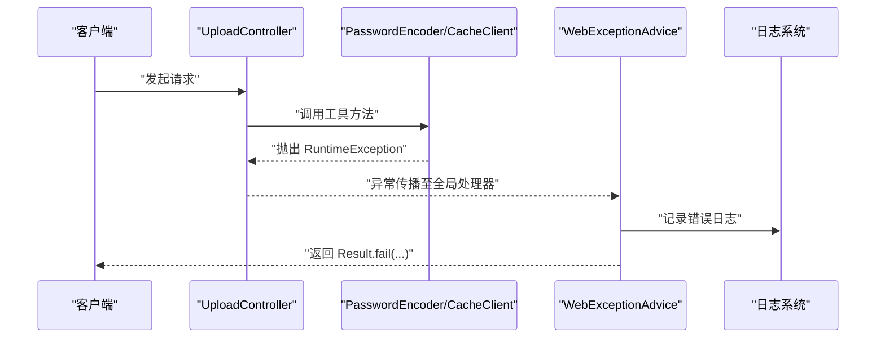
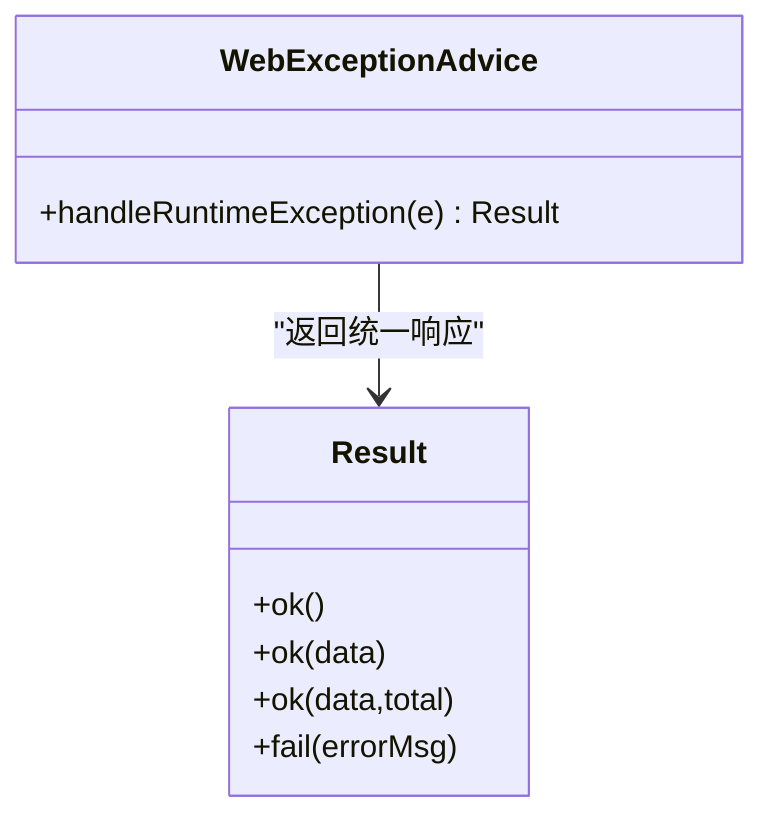
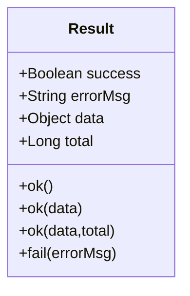
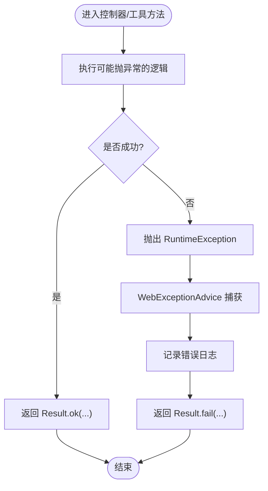
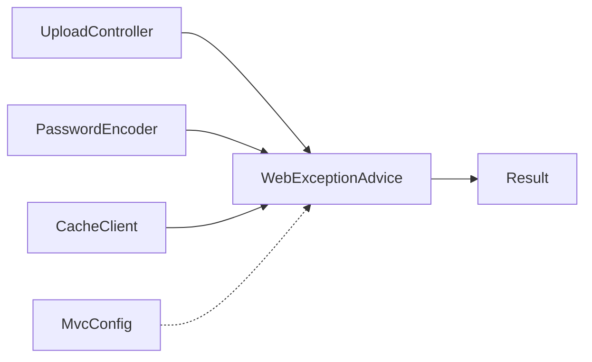

# 全局异常处理

<cite>
**本文引用的文件**
- [WebExceptionAdvice.java](file://src/main/java/com/hmdp/config/WebExceptionAdvice.java)
- [Result.java](file://src/main/java/com/hmdp/dto/Result.java)
- [UploadController.java](file://src/main/java/com/hmdp/controller/UploadController.java)
- [PasswordEncoder.java](file://src/main/java/com/hmdp/utils/PasswordEncoder.java)
- [CacheClient.java](file://src/main/java/com/hmdp/utils/CacheClient.java)
- [MvcConfig.java](file://src/main/java/com/hmdp/config/MvcConfig.java)
- [HmDianPingApplication.java](file://src/main/java/com/hmdp/HmDianPingApplication.java)
</cite>

## 目录
1. [简介](#简介)
2. [项目结构](#项目结构)
3. [核心组件](#核心组件)
4. [架构总览](#架构总览)
5. [详细组件分析](#详细组件分析)
6. [依赖关系分析](#依赖关系分析)
7. [性能与可观测性](#性能与可观测性)
8. [故障排查指南](#故障排查指南)
9. [结论](#结论)
10. [附录：最佳实践与扩展建议](#附录最佳实践与扩展建议)

## 简介
本文件面向 my-hbdp 项目的“全局异常处理”主题，围绕以下目标展开：
- 基于 @ExceptionHandler 的全局异常处理机制说明
- WebExceptionAdvice 的设计原理与异常分类策略
- 统一响应格式 Result 的成功与错误标准化结构
- 异常处理的优先级、自定义异常的定义与使用场景
- 常见异常类型的处理方法与最佳实践

## 项目结构
当前项目中与异常处理直接相关的代码集中在配置层与 DTO 层，并在部分业务控制器和工具类中抛出运行时异常。整体组织方式如下：
- 配置层：全局异常处理器与 MVC 拦截器配置
- DTO 层：统一的响应封装对象
- 控制器层：在业务异常路径上抛出运行时异常
- 工具层：在参数校验失败等场景抛出运行时异常

图表来源
- [HmDianPingApplication.java:1-18](file://src/main/java/com/hmdp/HmDianPingApplication.java#L1-L18)
- [WebExceptionAdvice.java:1-18](file://src/main/java/com/hmdp/config/WebExceptionAdvice.java#L1-L18)
- [MvcConfig.java:1-34](file://src/main/java/com/hmdp/config/MvcConfig.java#L1-L34)
- [Result.java:1-31](file://src/main/java/com/hmdp/dto/Result.java#L1-L31)
- [UploadController.java:1-64](file://src/main/java/com/hmdp/controller/UploadController.java#L1-L64)
- [PasswordEncoder.java:1-35](file://src/main/java/com/hmdp/utils/PasswordEncoder.java#L1-L35)
- [CacheClient.java:110-140](file://src/main/java/com/hmdp/utils/CacheClient.java#L110-L140)

章节来源
- [HmDianPingApplication.java:1-18](file://src/main/java/com/hmdp/HmDianPingApplication.java#L1-L18)
- [WebExceptionAdvice.java:1-18](file://src/main/java/com/hmdp/config/WebExceptionAdvice.java#L1-L18)
- [MvcConfig.java:1-34](file://src/main/java/com/hmdp/config/MvcConfig.java#L1-L34)
- [Result.java:1-31](file://src/main/java/com/hmdp/dto/Result.java#L1-L31)
- [UploadController.java:1-64](file://src/main/java/com/hmdp/controller/UploadController.java#L1-L64)
- [PasswordEncoder.java:1-35](file://src/main/java/com/hmdp/utils/PasswordEncoder.java#L1-L35)
- [CacheClient.java:110-140](file://src/main/java/com/hmdp/utils/CacheClient.java#L110-L140)

## 核心组件
- 全局异常处理器：通过 @RestControllerAdvice 与 @ExceptionHandler 捕获并统一处理异常，返回标准化的 Result 响应体。
- 统一响应体：Result 提供 ok/fail 静态方法，用于构造成功或失败的响应结构，包含 success、errorMsg、data、total 字段。
- 业务抛错点：在控制器与工具类中，遇到不可恢复的错误时抛出 RuntimeException，交由全局异常处理器统一处理。

章节来源
- [WebExceptionAdvice.java:1-18](file://src/main/java/com/hmdp/config/WebExceptionAdvice.java#L1-L18)
- [Result.java:1-31](file://src/main/java/com/hmdp/dto/Result.java#L1-L31)
- [UploadController.java:1-64](file://src/main/java/com/hmdp/controller/UploadController.java#L1-L64)
- [PasswordEncoder.java:1-35](file://src/main/java/com/hmdp/utils/PasswordEncoder.java#L1-L35)
- [CacheClient.java:110-140](file://src/main/java/com/hmdp/utils/CacheClient.java#L110-L140)

## 架构总览
下图展示了请求进入后的异常处理流程：当控制器或工具类抛出运行时异常时，Spring 的 DispatcherServlet 将异常委派给 @RestControllerAdvice 中的 @ExceptionHandler 方法，该方法记录日志并返回统一的 Result 响应。

图表来源
- [UploadController.java:20-35](file://src/main/java/com/hmdp/controller/UploadController.java#L20-L35)
- [PasswordEncoder.java:21-33](file://src/main/java/com/hmdp/utils/PasswordEncoder.java#L21-L33)
- [CacheClient.java:110-127](file://src/main/java/com/hmdp/utils/CacheClient.java#L110-L127)
- [WebExceptionAdvice.java:12-16](file://src/main/java/com/hmdp/config/WebExceptionAdvice.java#L12-L16)

## 详细组件分析

### 全局异常处理器 WebExceptionAdvice
- 设计要点
  - 使用 @RestControllerAdvice 声明为全局异常处理器，作用于所有 @RestController。
  - 使用 @ExceptionHandler(RuntimeException.class) 捕获运行时异常，避免业务逻辑侵入式 try-catch。
  - 在处理器中记录错误日志，便于问题定位与审计。
  - 返回 Result.fail(...) 作为统一错误响应。
- 异常分类策略（现状）
  - 当前仅对 RuntimeException 进行统一处理，未区分业务异常与系统异常。
  - 建议后续引入自定义业务异常类型，按领域或模块进行分类处理，以便返回更精确的错误码与消息。
- 优先级与覆盖范围
  - 若存在多个 @ExceptionHandler，Spring 会优先匹配最具体的异常类型；RuntimeException 属于较宽泛的类型，适合兜底。
  - 可通过 @Order 控制多个 Advice 的执行顺序，或在同一 Advice 内定义多个 @ExceptionHandler 以细化处理。

图表来源
- [WebExceptionAdvice.java:1-18](file://src/main/java/com/hmdp/config/WebExceptionAdvice.java#L1-L18)
- [Result.java:1-31](file://src/main/java/com/hmdp/dto/Result.java#L1-L31)

章节来源
- [WebExceptionAdvice.java:1-18](file://src/main/java/com/hmdp/config/WebExceptionAdvice.java#L1-L18)

### 统一响应格式 Result
- 结构说明
  - success：布尔值，表示是否成功
  - errorMsg：错误信息，失败时填充
  - data：业务数据，成功时填充
  - total：分页总数，列表查询时填充
- 工厂方法
  - ok()/ok(data)/ok(data,total)：构造成功响应
  - fail(errorMsg)：构造失败响应
- 使用建议
  - 控制器与服务层应统一返回 Result，避免直接返回裸对象或字符串。
  - 对于业务校验失败，优先返回 Result.fail(...)，而非抛出异常，以减少不必要的异常栈开销。

图表来源
- [Result.java:1-31](file://src/main/java/com/hmdp/dto/Result.java#L1-L31)

章节来源
- [Result.java:1-31](file://src/main/java/com/hmdp/dto/Result.java#L1-L31)

### 控制器与工具类的异常抛出点
- 文件上传失败
  - 在文件保存过程中发生 IO 异常时，抛出 RuntimeException，由全局异常处理器捕获并返回统一错误响应。
- 密码格式不正确
  - 在密码匹配前进行格式校验，不符合预期时抛出 RuntimeException，触发全局异常处理。
- 缓存重建异常
  - 异步重建缓存时捕获异常并包装为 RuntimeException，确保锁释放与线程安全，同时让上层能感知到异常。

图表来源
- [UploadController.java:20-35](file://src/main/java/com/hmdp/controller/UploadController.java#L20-L35)
- [PasswordEncoder.java:21-33](file://src/main/java/com/hmdp/utils/PasswordEncoder.java#L21-L33)
- [CacheClient.java:110-127](file://src/main/java/com/hmdp/utils/CacheClient.java#L110-L127)
- [WebExceptionAdvice.java:12-16](file://src/main/java/com/hmdp/config/WebExceptionAdvice.java#L12-L16)

章节来源
- [UploadController.java:20-35](file://src/main/java/com/hmdp/controller/UploadController.java#L20-L35)
- [PasswordEncoder.java:21-33](file://src/main/java/com/hmdp/utils/PasswordEncoder.java#L21-L33)
- [CacheClient.java:110-127](file://src/main/java/com/hmdp/utils/CacheClient.java#L110-L127)
- [WebExceptionAdvice.java:12-16](file://src/main/java/com/hmdp/config/WebExceptionAdvice.java#L12-L16)

## 依赖关系分析
- 全局异常处理器依赖统一响应体 Result，用于构造标准错误响应。
- 控制器与工具类通过抛出 RuntimeException 与全局异常处理器解耦，降低耦合度。
- MVC 拦截器与异常处理器职责分离：拦截器负责鉴权与预处理，异常处理器负责错误收敛。

图表来源
- [WebExceptionAdvice.java:1-18](file://src/main/java/com/hmdp/config/WebExceptionAdvice.java#L1-L18)
- [Result.java:1-31](file://src/main/java/com/hmdp/dto/Result.java#L1-L31)
- [UploadController.java:1-64](file://src/main/java/com/hmdp/controller/UploadController.java#L1-L64)
- [PasswordEncoder.java:1-35](file://src/main/java/com/hmdp/utils/PasswordEncoder.java#L1-L35)
- [CacheClient.java:110-140](file://src/main/java/com/hmdp/utils/CacheClient.java#L110-L140)
- [MvcConfig.java:1-34](file://src/main/java/com/hmdp/config/MvcConfig.java#L1-L34)

章节来源
- [WebExceptionAdvice.java:1-18](file://src/main/java/com/hmdp/config/WebExceptionAdvice.java#L1-L18)
- [Result.java:1-31](file://src/main/java/com/hmdp/dto/Result.java#L1-L31)
- [UploadController.java:1-64](file://src/main/java/com/hmdp/controller/UploadController.java#L1-L64)
- [PasswordEncoder.java:1-35](file://src/main/java/com/hmdp/utils/PasswordEncoder.java#L1-L35)
- [CacheClient.java:110-140](file://src/main/java/com/hmdp/utils/CacheClient.java#L110-L140)
- [MvcConfig.java:1-34](file://src/main/java/com/hmdp/config/MvcConfig.java#L1-L34)

## 性能与可观测性
- 日志记录
  - 全局异常处理器在捕获异常后记录错误日志，有助于快速定位问题根因。
- 异常成本
  - 频繁抛出异常会影响性能，建议在可控的业务校验场景优先返回 Result.fail(...)，仅在不可恢复的错误时使用异常。
- 异步异常
  - 在异步任务中抛出异常需特别注意上下文传递与日志记录，避免丢失关键堆栈信息。

[本节为通用指导，不直接分析具体文件]

## 故障排查指南
- 常见问题
  - 文件上传失败：检查文件系统权限、磁盘空间与路径配置，确认异常被全局处理器捕获并返回统一错误响应。
  - 密码格式不正确：检查存储的密码格式是否符合预期，确保匹配逻辑不会误抛异常。
  - 缓存重建异常：关注异步线程中的异常堆栈，确保锁释放与重试策略合理。
- 定位步骤
  - 查看全局异常处理器的错误日志输出，结合请求链路定位异常来源。
  - 在相关控制器或工具类中添加调试日志，确认异常抛出的条件与上下文。
  - 验证 Result 的返回结构是否符合前端期望，避免解析错误。

章节来源
- [WebExceptionAdvice.java:12-16](file://src/main/java/com/hmdp/config/WebExceptionAdvice.java#L12-L16)
- [UploadController.java:20-35](file://src/main/java/com/hmdp/controller/UploadController.java#L20-L35)
- [PasswordEncoder.java:21-33](file://src/main/java/com/hmdp/utils/PasswordEncoder.java#L21-L33)
- [CacheClient.java:110-127](file://src/main/java/com/hmdp/utils/CacheClient.java#L110-L127)

## 结论
当前项目已具备基于 @ExceptionHandler 的全局异常处理能力，并通过 Result 实现了统一的响应格式。为进一步增强可维护性与可观测性，建议：
- 引入自定义业务异常类型，细化异常分类与错误码体系
- 在更多边界场景采用 Result.fail(...) 替代异常，减少异常开销
- 完善日志规范，确保关键上下文信息与错误堆栈完整记录

[本节为总结性内容，不直接分析具体文件]

## 附录：最佳实践与扩展建议
- 自定义异常设计
  - 定义业务异常基类，包含错误码与错误消息，便于前端展示与后端统计。
  - 针对不同领域（如用户、订单、库存）定义细分异常，提升可读性与可维护性。
- 异常优先级
  - 在同一 Advice 中定义多个 @ExceptionHandler，优先匹配更具体的异常类型。
  - 使用 @Order 控制多个 Advice 的执行顺序，确保特定模块的异常处理优先生效。
- 统一错误码
  - 在 Result 中增加 errorCode 字段，配合业务异常实现稳定的错误码约定。
- 参数校验
  - 在控制器或服务层进行前置校验，失败时返回 Result.fail(...)，避免进入异常路径。
- 日志与监控
  - 在全局异常处理器中记录结构化日志，包括请求 ID、用户标识、关键参数摘要等。
  - 对接监控系统，对异常率与错误类型进行告警与趋势分析。

[本节为通用指导，不直接分析具体文件]