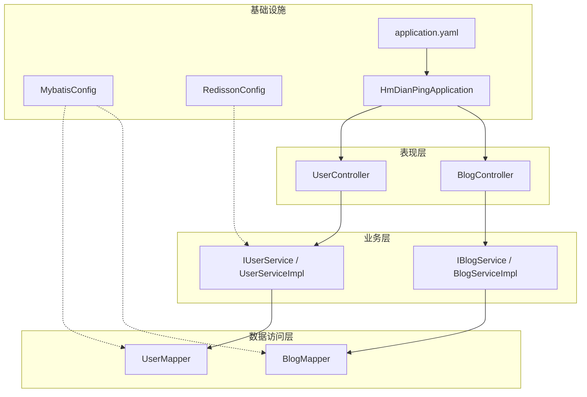
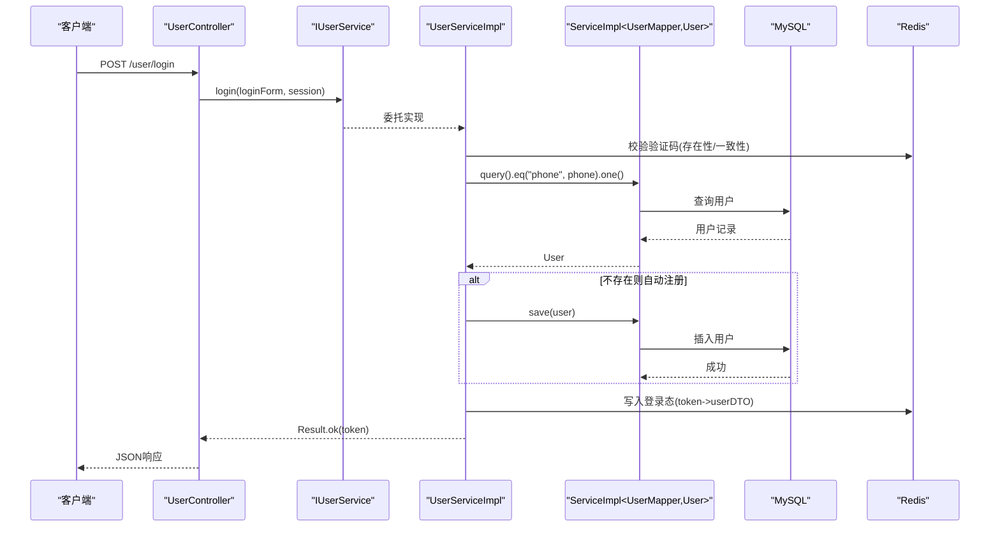
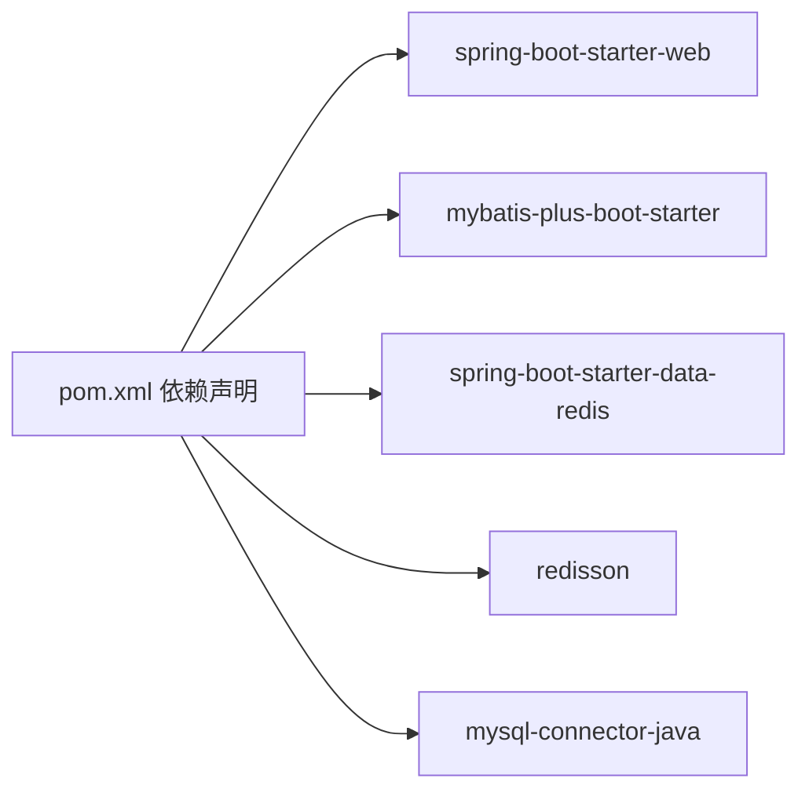

# 分层架构设计

<cite>
**本文引用的文件**   
- [HmDianPingApplication.java](file://src/main/java/com/hmdp/HmDianPingApplication.java)
- [pom.xml](file://pom.xml)
- [application.yaml](file://src/main/resources/application.yaml)
- [UserController.java](file://src/main/java/com/hmdp/controller/UserController.java)
- [BlogController.java](file://src/main/java/com/hmdp/controller/BlogController.java)
- [IUserService.java](file://src/main/java/com/hmdp/service/IUserService.java)
- [UserServiceImpl.java](file://src/main/java/com/hmdp/service/impl/UserServiceImpl.java)
- [IBlogService.java](file://src/main/java/com/hmdp/service/IBlogService.java)
- [BlogServiceImpl.java](file://src/main/java/com/hmdp/service/impl/BlogServiceImpl.java)
- [UserMapper.java](file://src/main/java/com/hmdp/mapper/UserMapper.java)
- [MybatisConfig.java](file://src/main/java/com/hmdp/config/MybatisConfig.java)
- [RedissonConfig.java](file://src/main/java/com/hmdp/config/RedissonConfig.java)
- [Result.java](file://src/main/java/com/hmdp/dto/Result.java)
- [UserHolder.java](file://src/main/java/com/hmdp/utils/UserHolder.java)
- [User.java](file://src/main/java/com/hmdp/entity/User.java)
</cite>

## 目录
1. [引言](#引言)
2. [项目结构](#项目结构)
3. [核心组件](#核心组件)
4. [架构总览](#架构总览)
5. [详细组件分析](#详细组件分析)
6. [依赖分析](#依赖分析)
7. [性能考虑](#性能考虑)
8. [故障排查指南](#故障排查指南)
9. [结论](#结论)
10. [附录](#附录)

## 引言
本文件面向 my-hbdp 项目的分层架构设计与实现，围绕 MVC 三层（Controller、Service、Mapper）的职责划分、接口抽象、依赖注入与数据流转进行系统化说明。文档重点解释：
- 各层职责边界与交互关系
- 基于 Spring 的依赖注入与接口抽象
- 典型业务流程的数据流与控制流
- 分层设计对可维护性与可测试性的提升
- 结合具体代码路径展示最佳实践模式

## 项目结构
项目采用典型的 Spring Boot + MyBatis-Plus 分层组织方式：
- Controller 层：处理 HTTP 请求、参数校验、调用 Service 并返回统一结果
- Service 层：封装业务逻辑，协调缓存、事务、外部资源等
- Mapper 层：基于 MyBatis-Plus 的 BaseMapper 提供数据访问能力
- Config 层：配置数据源、分页插件、分布式锁客户端等
- DTO/Entity/Utils：数据传输对象、实体模型与通用工具

图表来源
- [HmDianPingApplication.java:1-18](file://src/main/java/com/hmdp/HmDianPingApplication.java#L1-L18)
- [MybatisConfig.java:1-18](file://src/main/java/com/hmdp/config/MybatisConfig.java#L1-L18)
- [RedissonConfig.java:1-18](file://src/main/java/com/hmdp/config/RedissonConfig.java#L1-L18)
- [UserController.java:1-86](file://src/main/java/com/hmdp/controller/UserController.java#L1-L86)
- [BlogController.java:1-84](file://src/main/java/com/hmdp/controller/BlogController.java#L1-L84)
- [IUserService.java:1-25](file://src/main/java/com/hmdp/service/IUserService.java#L1-L25)
- [UserServiceImpl.java:1-110](file://src/main/java/com/hmdp/service/impl/UserServiceImpl.java#L1-L110)
- [IBlogService.java:1-17](file://src/main/java/com/hmdp/service/IBlogService.java#L1-L17)
- [BlogServiceImpl.java:1-21](file://src/main/java/com/hmdp/service/impl/BlogServiceImpl.java#L1-L21)
- [UserMapper.java:1-17](file://src/main/java/com/hmdp/mapper/UserMapper.java#L1-L17)
- [application.yaml:1-28](file://src/main/resources/application.yaml#L1-L28)

章节来源
- [HmDianPingApplication.java:1-18](file://src/main/java/com/hmdp/HmDianPingApplication.java#L1-L18)
- [application.yaml:1-28](file://src/main/resources/application.yaml#L1-L28)

## 核心组件
- 启动与扫描
  - 应用入口启用 AOP 代理与 Mapper 扫描，确保 Controller、Service、Mapper 正常装配
- 配置中心
  - 数据库连接、Redis 连接、Jackson 序列化策略、日志级别等通过配置文件集中管理
  - MyBatis-Plus 分页插件在配置类中注册
  - Redisson 客户端在配置类中初始化
- 统一响应体
  - Result 作为统一的 API 响应封装，包含成功标志、错误信息、数据与总数
- 用户上下文
  - UserHolder 使用 ThreadLocal 保存当前登录用户信息，供 Controller/Service 使用

章节来源
- [HmDianPingApplication.java:1-18](file://src/main/java/com/hmdp/HmDianPingApplication.java#L1-L18)
- [MybatisConfig.java:1-18](file://src/main/java/com/hmdp/config/MybatisConfig.java#L1-L18)
- [RedissonConfig.java:1-18](file://src/main/java/com/hmdp/config/RedissonConfig.java#L1-L18)
- [Result.java:1-31](file://src/main/java/com/hmdp/dto/Result.java#L1-L31)
- [UserHolder.java:1-20](file://src/main/java/com/hmdp/utils/UserHolder.java#L1-L20)
- [application.yaml:1-28](file://src/main/resources/application.yaml#L1-L28)

## 架构总览
整体采用“表现层-业务层-数据访问层”的分层模式，配合 Spring 容器完成依赖注入与生命周期管理；MyBatis-Plus 简化数据访问；Redis/Redisson 提供缓存与分布式能力支撑。

图表来源
- [UserController.java:49-53](file://src/main/java/com/hmdp/controller/UserController.java#L49-L53)
- [IUserService.java:18-24](file://src/main/java/com/hmdp/service/IUserService.java#L18-L24)
- [UserServiceImpl.java:62-100](file://src/main/java/com/hmdp/service/impl/UserServiceImpl.java#L62-L100)
- [UserMapper.java:14-16](file://src/main/java/com/hmdp/mapper/UserMapper.java#L14-L16)
- [application.yaml:6-14](file://src/main/resources/application.yaml#L6-L14)

## 详细组件分析

### Controller 层（请求处理）
- 职责
  - 解析请求参数、绑定到 DTO/Entity
  - 从上下文获取当前用户（如 UserHolder）
  - 调用 Service 执行业务逻辑
  - 封装为统一 Result 返回
- 示例路径
  - 登录流程：[UserController.java:49-53](file://src/main/java/com/hmdp/controller/UserController.java#L49-L53)
  - 发送验证码：[UserController.java:39-43](file://src/main/java/com/hmdp/controller/UserController.java#L39-L43)
  - 获取当前用户：[UserController.java:65-70](file://src/main/java/com/hmdp/controller/UserController.java#L65-L70)
  - 博客列表与点赞：[BlogController.java:35-82](file://src/main/java/com/hmdp/controller/BlogController.java#L35-L82)
- 依赖注入
  - 使用 @Resource 注入 Service 接口，遵循面向接口编程
- 最佳实践
  - 仅做参数校验与编排，不写复杂业务逻辑
  - 统一使用 Result 封装响应
  - 使用 UserHolder 获取当前登录用户，避免在 Controller 内自行解析 Token

章节来源
- [UserController.java:1-86](file://src/main/java/com/hmdp/controller/UserController.java#L1-L86)
- [BlogController.java:1-84](file://src/main/java/com/hmdp/controller/BlogController.java#L1-L84)
- [Result.java:1-31](file://src/main/java/com/hmdp/dto/Result.java#L1-L31)
- [UserHolder.java:1-20](file://src/main/java/com/hmdp/utils/UserHolder.java#L1-L20)

### Service 层（业务逻辑）
- 职责
  - 实现领域业务规则与流程编排
  - 协调缓存、事务、外部服务
  - 暴露稳定的接口给上层调用
- 示例路径
  - 验证码发送与登录：[UserServiceImpl.java:46-100](file://src/main/java/com/hmdp/service/impl/UserServiceImpl.java#L46-L100)
  - 基础 CRUD 扩展：[UserServiceImpl.java:102-108](file://src/main/java/com/hmdp/service/impl/UserServiceImpl.java#L102-L108)
  - 博客服务（继承 IService）：[BlogServiceImpl.java:17-20](file://src/main/java/com/hmdp/service/impl/BlogServiceImpl.java#L17-L20)
- 依赖注入
  - 使用 @Autowired/@Resource 注入 StringRedisTemplate、Mapper 等
- 事务与一致性
  - 关键写操作建议加 @Transactional，保证多步操作的原子性
- 最佳实践
  - 面向接口编程：对外暴露 IUserService/IBlogService
  - 复用 MyBatis-Plus 的 IService 能力，减少样板代码
  - 将跨层共享的常量、键前缀放入 Utils/SystemConstants/RedisConstants

章节来源
- [IUserService.java:1-25](file://src/main/java/com/hmdp/service/IUserService.java#L1-L25)
- [UserServiceImpl.java:1-110](file://src/main/java/com/hmdp/service/impl/UserServiceImpl.java#L1-L110)
- [IBlogService.java:1-17](file://src/main/java/com/hmdp/service/IBlogService.java#L1-L17)
- [BlogServiceImpl.java:1-21](file://src/main/java/com/hmdp/service/impl/BlogServiceImpl.java#L1-L21)

### Mapper 层（数据访问）
- 职责
  - 定义实体对应的数据访问接口
  - 借助 MyBatis-Plus 的 BaseMapper 获得常用 CRUD 方法
- 示例路径
  - 用户数据访问接口：[UserMapper.java:14-16](file://src/main/java/com/hmdp/mapper/UserMapper.java#L14-L16)
- 配置要点
  - 启动类开启 @MapperScan 扫描 mapper 包
  - 配置分页插件以支持 Page 查询
- 最佳实践
  - 简单 CRUD 直接复用 BaseMapper
  - 复杂 SQL 使用 XML 或 LambdaQueryWrapper 构建条件

章节来源
- [UserMapper.java:1-17](file://src/main/java/com/hmdp/mapper/UserMapper.java#L1-L17)
- [HmDianPingApplication.java:8-10](file://src/main/java/com/hmdp/HmDianPingApplication.java#L8-L10)
- [MybatisConfig.java:9-17](file://src/main/java/com/hmdp/config/MybatisConfig.java#L9-L17)

### 实体与数据模型
- 用户实体映射
  - 表名、主键策略、字段注解清晰，便于 MyBatis-Plus 自动生成 SQL
- 示例路径
  - 用户实体定义：[User.java:21-66](file://src/main/java/com/hmdp/entity/User.java#L21-L66)

章节来源
- [User.java:1-67](file://src/main/java/com/hmdp/entity/User.java#L1-L67)

### 配置与基础设施
- 数据源与 Redis
  - application.yaml 中配置 MySQL、Redis 连接池与 Jackson 行为
- MyBatis-Plus 分页
  - 通过 MybatisConfig 注册 PaginationInnerInterceptor
- Redisson 分布式锁客户端
  - 通过 RedissonConfig 创建 RedissonClient Bean
- 示例路径
  - 应用配置：[application.yaml:1-28](file://src/main/resources/application.yaml#L1-L28)
  - 分页插件：[MybatisConfig.java:9-17](file://src/main/java/com/hmdp/config/MybatisConfig.java#L9-L17)
  - Redisson 客户端：[RedissonConfig.java:9-17](file://src/main/java/com/hmdp/config/RedissonConfig.java#L9-L17)

章节来源
- [application.yaml:1-28](file://src/main/resources/application.yaml#L1-L28)
- [MybatisConfig.java:1-18](file://src/main/java/com/hmdp/config/MybatisConfig.java#L1-L18)
- [RedissonConfig.java:1-18](file://src/main/java/com/hmdp/config/RedissonConfig.java#L1-L18)

### 依赖注入机制与接口抽象
- 依赖注入
  - Spring 容器负责实例化与装配 Controller、Service、Mapper、配置类 Bean
  - 使用 @Resource/@Autowired 注入接口类型，降低耦合
- 接口抽象
  - Service 层对外暴露 I*Service 接口，实现类位于 impl 包
  - Mapper 层基于 BaseMapper 抽象出通用数据访问能力
- 示例路径
  - Controller 注入 Service：[UserController.java:30-34](file://src/main/java/com/hmdp/controller/UserController.java#L30-L34)
  - Service 接口与实现分离：[IUserService.java:18-24](file://src/main/java/com/hmdp/service/IUserService.java#L18-L24)、[UserServiceImpl.java:39-41](file://src/main/java/com/hmdp/service/impl/UserServiceImpl.java#L39-L41)
  - Mapper 继承 BaseMapper：[UserMapper.java:14-16](file://src/main/java/com/hmdp/mapper/UserMapper.java#L14-L16)

章节来源
- [UserController.java:30-34](file://src/main/java/com/hmdp/controller/UserController.java#L30-L34)
- [IUserService.java:18-24](file://src/main/java/com/hmdp/service/IUserService.java#L18-L24)
- [UserServiceImpl.java:39-41](file://src/main/java/com/hmdp/service/impl/UserServiceImpl.java#L39-L41)
- [UserMapper.java:14-16](file://src/main/java/com/hmdp/mapper/UserMapper.java#L14-L16)

### 数据流转过程（以登录为例）
- 控制流
  - 客户端发起登录请求 -> Controller 接收并调用 Service -> Service 校验验证码、查询/注册用户、写入登录态 -> 返回统一结果
- 数据流
  - 请求体 LoginFormDTO -> Service 内部转换 UserDTO -> 持久化 User -> 缓存 token->userDTO
- 示例路径
  - 登录入口：[UserController.java:49-53](file://src/main/java/com/hmdp/controller/UserController.java#L49-L53)
  - 登录实现：[UserServiceImpl.java:62-100](file://src/main/java/com/hmdp/service/impl/UserServiceImpl.java#L62-L100)

章节来源
- [UserController.java:49-53](file://src/main/java/com/hmdp/controller/UserController.java#L49-L53)
- [UserServiceImpl.java:62-100](file://src/main/java/com/hmdp/service/impl/UserServiceImpl.java#L62-L100)

### 为什么采用分层设计
- 职责清晰
  - Controller 专注请求处理与响应封装；Service 专注业务编排；Mapper 专注数据访问
- 低耦合高内聚
  - 通过接口抽象与依赖注入，层间松耦合，替换实现不影响上层
- 可测试性强
  - 可对 Service/Mapper 单独编写单元测试，Mock 外部依赖（如 Redis、DB）
- 可扩展性好
  - 新增业务只需扩展 Service 与 Mapper，无需改动 Controller 契约

## 依赖分析
- 模块依赖
  - Controller 依赖 Service 接口
  - Service 实现依赖 Mapper 与外部中间件（Redis/Redisson）
  - Mapper 依赖 MyBatis-Plus 与数据库驱动
- 外部依赖
  - Spring Boot Web、MyBatis-Plus、Redis、Redisson、MySQL 连接器
- 示例路径
  - 依赖声明：[pom.xml:20-76](file://pom.xml#L20-L76)
  - 启动类扫描：[HmDianPingApplication.java:8-10](file://src/main/java/com/hmdp/HmDianPingApplication.java#L8-L10)

图表来源
- [pom.xml:20-76](file://pom.xml#L20-L76)

章节来源
- [pom.xml:1-96](file://pom.xml#L1-L96)
- [HmDianPingApplication.java:8-10](file://src/main/java/com/hmdp/HmDianPingApplication.java#L8-L10)

## 性能考虑
- 分页查询
  - 使用 MyBatis-Plus 分页插件，避免全表扫描
- 缓存策略
  - 登录态与验证码落 Redis，缩短热点数据读取路径
- 连接池
  - Redis Lettuce 连接池参数合理设置，避免频繁创建销毁
- 序列化
  - Jackson 忽略非空字段，减小响应体积

章节来源
- [MybatisConfig.java:9-17](file://src/main/java/com/hmdp/config/MybatisConfig.java#L9-L17)
- [application.yaml:15-22](file://src/main/resources/application.yaml#L15-L22)

## 故障排查指南
- 常见定位点
  - 数据库连接失败：检查 application.yaml 中的 datasource 配置
  - Redis 连接失败：检查 redis 配置与密码
  - 分页无效：确认是否注册了 PaginationInnerInterceptor
  - 登录态异常：检查 Redis 中 token 是否存在且未过期
- 相关配置路径
  - 数据源与 Redis：[application.yaml:6-22](file://src/main/resources/application.yaml#L6-L22)
  - 分页插件：[MybatisConfig.java:9-17](file://src/main/java/com/hmdp/config/MybatisConfig.java#L9-L17)
  - Redisson 客户端：[RedissonConfig.java:9-17](file://src/main/java/com/hmdp/config/RedissonConfig.java#L9-L17)

章节来源
- [application.yaml:6-22](file://src/main/resources/application.yaml#L6-L22)
- [MybatisConfig.java:9-17](file://src/main/java/com/hmdp/config/MybatisConfig.java#L9-L17)
- [RedissonConfig.java:9-17](file://src/main/java/com/hmdp/config/RedissonConfig.java#L9-L17)

## 结论
本项目采用清晰的 MVC 三层架构，结合 Spring 依赖注入与 MyBatis-Plus 的能力，实现了高内聚、低耦合的可维护系统。通过接口抽象与分层职责，提升了代码的可读性、可扩展性与可测试性。建议在后续迭代中继续强化：
- 完善异常处理与全局统一错误码
- 引入更完善的鉴权与限流拦截器
- 对热点接口增加缓存与幂等保障
- 完善单元测试与集成测试覆盖

## 附录
- 统一响应体结构
  - 字段：success、errorMsg、data、total
  - 构造方法：ok()/ok(data)/ok(list,total)/fail(errorMsg)
  - 参考路径：[Result.java:1-31](file://src/main/java/com/hmdp/dto/Result.java#L1-L31)
- 用户上下文持有者
  - 使用 ThreadLocal 保存当前登录用户
  - 参考路径：[UserHolder.java:1-20](file://src/main/java/com/hmdp/utils/UserHolder.java#L1-L20)