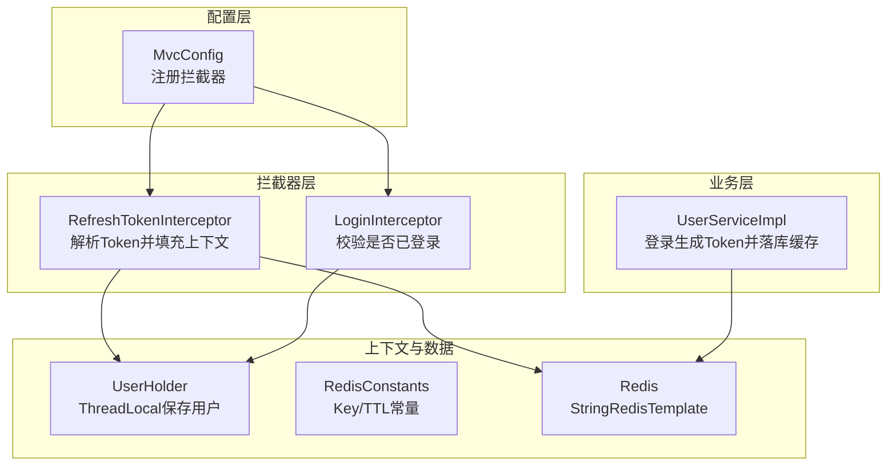
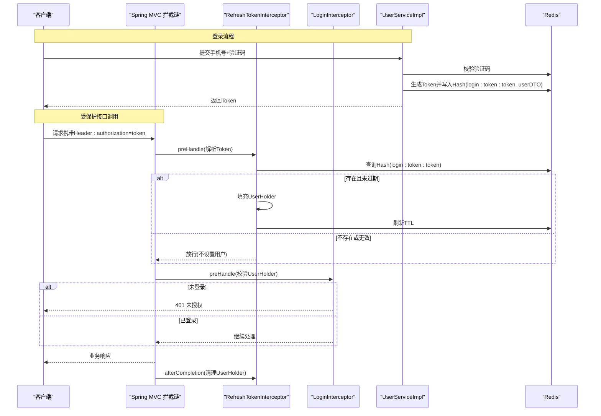
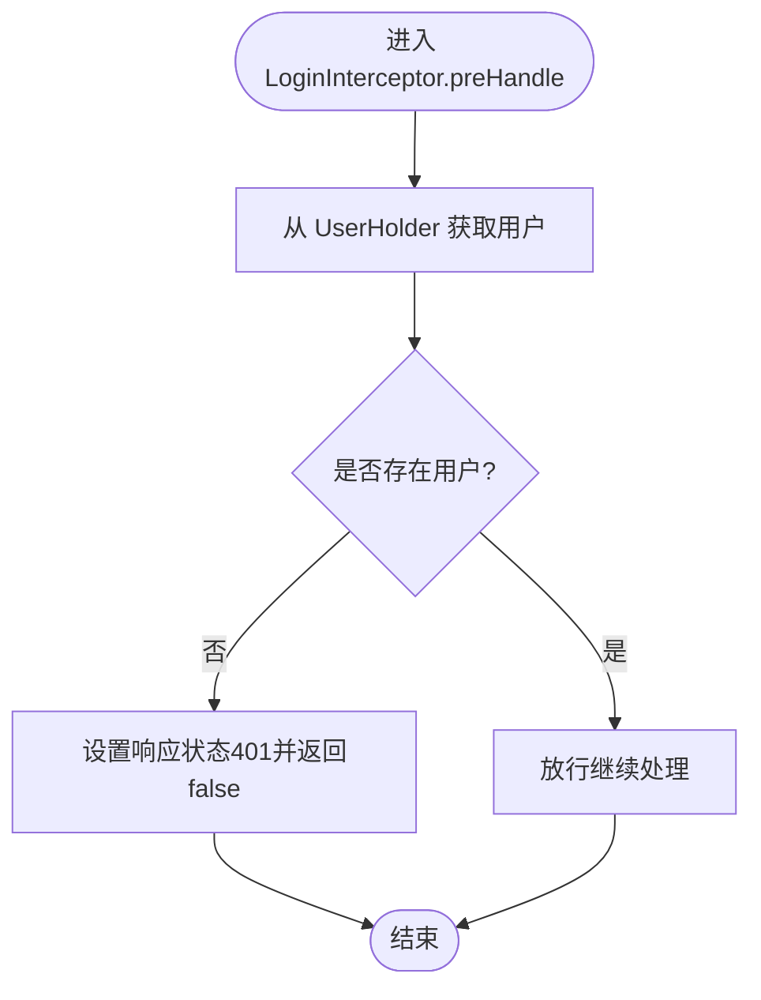
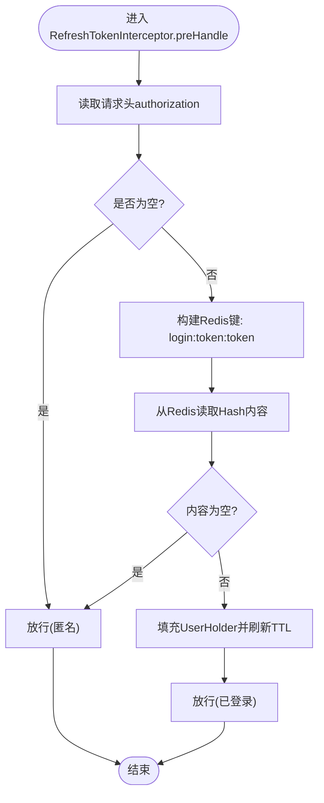
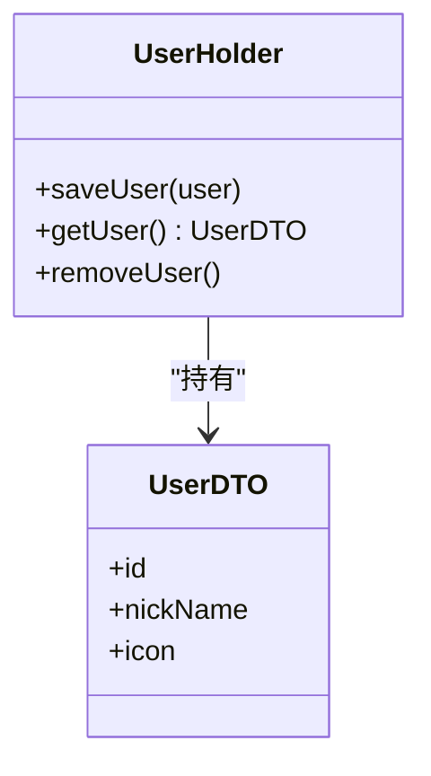
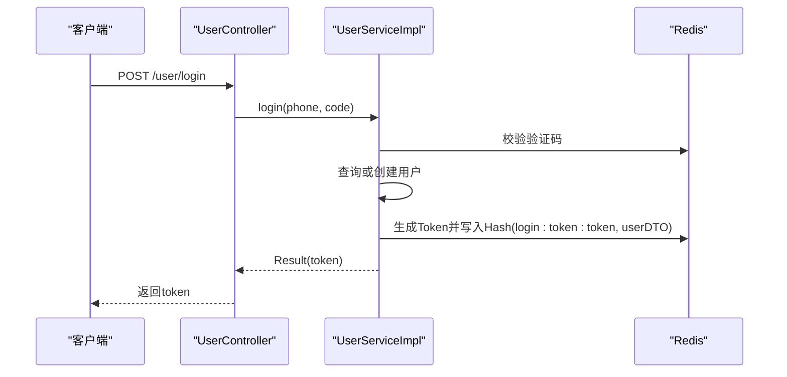
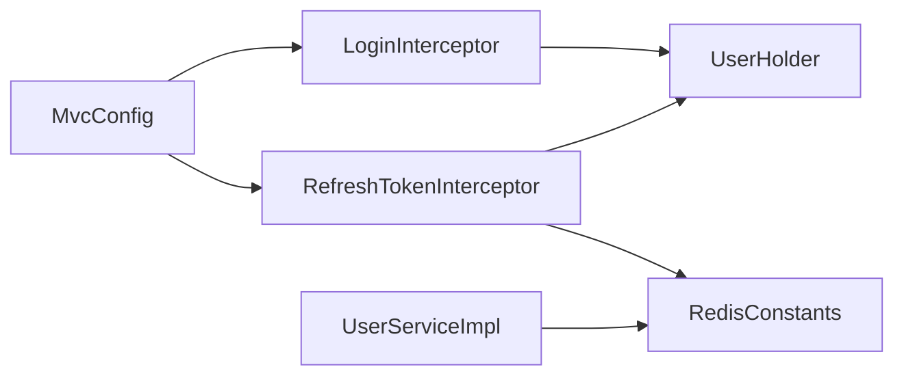

# 拦截器模式设计

<cite>
**本文引用的文件列表**
- [MvcConfig.java](file://src/main/java/com/hmdp/config/MvcConfig.java)
- [LoginInterceptor.java](file://src/main/java/com/hmdp/utils/LoginInterceptor.java)
- [RefreshTokenInterceptor.java](file://src/main/java/com/hmdp/utils/RefreshTokenInterceptor.java)
- [UserHolder.java](file://src/main/java/com/hmdp/utils/UserHolder.java)
- [RedisConstants.java](file://src/main/java/com/hmdp/utils/RedisConstants.java)
- [UserDTO.java](file://src/main/java/com/hmdp/dto/UserDTO.java)
- [UserServiceImpl.java](file://src/main/java/com/hmdp/service/impl/UserServiceImpl.java)
</cite>

## 目录
1. [简介](#简介)
2. [项目结构](#项目结构)
3. [核心组件](#核心组件)
4. [架构总览](#架构总览)
5. [详细组件分析](#详细组件分析)
6. [依赖关系分析](#依赖关系分析)
7. [性能考量](#性能考量)
8. [故障排查指南](#故障排查指南)
9. [结论](#结论)
10. [附录：扩展与自定义指南](#附录扩展与自定义指南)

## 简介
本设计文档围绕 my-hbdp 项目的 Spring MVC 拦截器模式，系统性阐述登录校验与 Token 刷新两大拦截器的实现原理、执行顺序、路径匹配与排除规则，以及无状态认证（基于 Redis 的 Token）的生成、验证与刷新流程。同时提供扩展方法与自定义拦截器的开发指南，帮助读者快速理解并复用该机制。

## 项目结构
本项目将拦截器相关逻辑集中在 utils 包中，并通过配置类统一注册到 Spring MVC 的拦截链中。关键文件包括：
- 配置类：用于注册拦截器、设置执行顺序与路径匹配策略
- 拦截器：负责从请求上下文提取用户信息、校验登录态、刷新会话过期时间
- 工具类：线程本地存储当前用户、常量定义（如 Redis Key 前缀与 TTL）
- DTO：承载用户基本信息，便于在拦截器间传递
- 服务实现：负责登录时生成 Token 并写入 Redis

图表来源
- [MvcConfig.java:1-34](file://src/main/java/com/hmdp/config/MvcConfig.java#L1-L34)
- [RefreshTokenInterceptor.java:1-51](file://src/main/java/com/hmdp/utils/RefreshTokenInterceptor.java#L1-L51)
- [LoginInterceptor.java:1-31](file://src/main/java/com/hmdp/utils/LoginInterceptor.java#L1-L31)
- [UserHolder.java:1-20](file://src/main/java/com/hmdp/utils/UserHolder.java#L1-L20)
- [RedisConstants.java:1-25](file://src/main/java/com/hmdp/utils/RedisConstants.java#L1-L25)
- [UserServiceImpl.java:62-100](file://src/main/java/com/hmdp/service/impl/UserServiceImpl.java#L62-L100)

章节来源
- [MvcConfig.java:1-34](file://src/main/java/com/hmdp/config/MvcConfig.java#L1-L34)
- [LoginInterceptor.java:1-31](file://src/main/java/com/hmdp/utils/LoginInterceptor.java#L1-L31)
- [RefreshTokenInterceptor.java:1-51](file://src/main/java/com/hmdp/utils/RefreshTokenInterceptor.java#L1-L51)
- [UserHolder.java:1-20](file://src/main/java/com/hmdp/utils/UserHolder.java#L1-L20)
- [RedisConstants.java:1-25](file://src/main/java/com/hmdp/utils/RedisConstants.java#L1-L25)
- [UserServiceImpl.java:62-100](file://src/main/java/com/hmdp/service/impl/UserServiceImpl.java#L62-L100)

## 核心组件
- 登录拦截器（LoginInterceptor）
  - 职责：在 preHandle 阶段检查当前线程是否持有已登录用户；若未登录则返回 401 并中断后续处理。
  - 关键点：依赖 UserHolder 获取当前用户，不直接访问 Redis。
- Token 刷新拦截器（RefreshTokenInterceptor）
  - 职责：在 preHandle 阶段从请求头读取 authorization 令牌，若存在且有效则从 Redis 反序列化为用户对象并放入 UserHolder，同时刷新该令牌的过期时间；在 afterCompletion 清理 ThreadLocal。
  - 关键点：使用 StringRedisTemplate 操作 Redis Hash，以“login:token:<token>”为键存储用户信息。
- 用户上下文（UserHolder）
  - 职责：通过 ThreadLocal 在当前请求线程内保存和移除用户信息，避免跨线程污染。
- 常量定义（RedisConstants）
  - 职责：集中管理 Redis Key 前缀与 TTL，例如登录验证码、登录用户令牌等。
- 用户数据传输对象（UserDTO）
  - 职责：携带用户基础信息，供拦截器与服务层之间轻量传输。
- 登录服务（UserServiceImpl）
  - 职责：登录成功后生成随机 Token，将用户信息序列化后存入 Redis，并设置过期时间；返回 Token 给客户端。

章节来源
- [LoginInterceptor.java:19-28](file://src/main/java/com/hmdp/utils/LoginInterceptor.java#L19-L28)
- [RefreshTokenInterceptor.java:25-49](file://src/main/java/com/hmdp/utils/RefreshTokenInterceptor.java#L25-L49)
- [UserHolder.java:5-19](file://src/main/java/com/hmdp/utils/UserHolder.java#L5-L19)
- [RedisConstants.java:4-7](file://src/main/java/com/hmdp/utils/RedisConstants.java#L4-L7)
- [UserDTO.java:5-10](file://src/main/java/com/hmdp/dto/UserDTO.java#L5-L10)
- [UserServiceImpl.java:90-99](file://src/main/java/com/hmdp/service/impl/UserServiceImpl.java#L90-L99)

## 架构总览
下图展示了无状态认证的整体流程：客户端登录后获得 Token，后续请求携带该 Token；RefreshTokenInterceptor 负责解析并刷新过期时间，LoginInterceptor 负责强制校验登录态。

图表来源
- [UserServiceImpl.java:90-99](file://src/main/java/com/hmdp/service/impl/UserServiceImpl.java#L90-L99)
- [RefreshTokenInterceptor.java:25-49](file://src/main/java/com/hmdp/utils/RefreshTokenInterceptor.java#L25-L49)
- [LoginInterceptor.java:21-28](file://src/main/java/com/hmdp/utils/LoginInterceptor.java#L21-L28)
- [RedisConstants.java:6-7](file://src/main/java/com/hmdp/utils/RedisConstants.java#L6-L7)

## 详细组件分析

### 登录拦截器（LoginInterceptor）
- 执行时机：preHandle
- 行为说明：
  - 从 UserHolder 获取当前用户，若为空则返回 401 并终止请求。
  - 若不为空，则放行至后续处理器。
- 设计要点：
  - 仅做鉴权判断，不关心 Token 来源与有效期，由前置拦截器完成上下文装配。
  - 对未登录的请求进行快速失败，减少不必要的业务处理。

图表来源
- [LoginInterceptor.java:21-28](file://src/main/java/com/hmdp/utils/LoginInterceptor.java#L21-L28)
- [UserHolder.java:12-14](file://src/main/java/com/hmdp/utils/UserHolder.java#L12-L14)

章节来源
- [LoginInterceptor.java:19-28](file://src/main/java/com/hmdp/utils/LoginInterceptor.java#L19-L28)

### Token 刷新拦截器（RefreshTokenInterceptor）
- 执行时机：
  - preHandle：解析 Token、加载用户、刷新 TTL
  - afterCompletion：清理 ThreadLocal，防止内存泄漏
- 行为说明：
  - 若请求头不包含 authorization，直接放行（允许匿名访问）。
  - 若包含 token，则以“login:token:<token>”为键查询 Redis Hash。
  - 若存在用户信息，将其转换为 UserDTO 并保存到 UserHolder，同时刷新 TTL。
  - 无论是否找到用户，最终都放行，由后续 LoginInterceptor 决定是否拒绝。
- 设计要点：
  - 采用“先装配上下文，再校验登录态”的分层策略，使鉴权逻辑更清晰。
  - 在 afterCompletion 中清理 ThreadLocal，确保线程复用安全。

图表来源
- [RefreshTokenInterceptor.java:25-42](file://src/main/java/com/hmdp/utils/RefreshTokenInterceptor.java#L25-L42)
- [RedisConstants.java:6-7](file://src/main/java/com/hmdp/utils/RedisConstants.java#L6-L7)

章节来源
- [RefreshTokenInterceptor.java:25-49](file://src/main/java/com/hmdp/utils/RefreshTokenInterceptor.java#L25-L49)

### 用户上下文（UserHolder）
- 作用：通过 ThreadLocal 在当前请求线程内保存用户信息，避免跨线程污染。
- 方法：
  - saveUser：保存用户
  - getUser：获取用户
  - removeUser：移除用户（建议在 afterCompletion 调用）

图表来源
- [UserHolder.java:5-19](file://src/main/java/com/hmdp/utils/UserHolder.java#L5-L19)
- [UserDTO.java:5-10](file://src/main/java/com/hmdp/dto/UserDTO.java#L5-L10)

章节来源
- [UserHolder.java:5-19](file://src/main/java/com/hmdp/utils/UserHolder.java#L5-L19)
- [UserDTO.java:5-10](file://src/main/java/com/hmdp/dto/UserDTO.java#L5-L10)

### 登录服务（UserServiceImpl）
- 职责：
  - 校验验证码
  - 根据手机号查询或创建用户
  - 生成随机 Token
  - 将用户信息序列化后写入 Redis Hash，并设置过期时间
  - 返回 Token 给客户端
- 关键点：
  - Token 作为无状态会话标识，服务端不维护 Session。
  - 使用 Redis Hash 存储用户信息，便于按字段存取与更新。

图表来源
- [UserServiceImpl.java:62-99](file://src/main/java/com/hmdp/service/impl/UserServiceImpl.java#L62-L99)

章节来源
- [UserServiceImpl.java:62-99](file://src/main/java/com/hmdp/service/impl/UserServiceImpl.java#L62-L99)

## 依赖关系分析
- 配置层（MvcConfig）
  - 注册两个拦截器，并指定执行顺序：
    - RefreshTokenInterceptor：order=0（优先执行）
    - LoginInterceptor：order=1（后置执行）
  - 为 LoginInterceptor 配置 excludePathPatterns，排除公开接口路径。
- 拦截器层
  - RefreshTokenInterceptor 依赖 StringRedisTemplate 与 RedisConstants。
  - LoginInterceptor 依赖 UserHolder。
- 上下文与数据
  - UserHolder 提供线程级用户上下文。
  - RedisConstants 提供统一的 Key 前缀与 TTL。
- 业务层
  - UserServiceImpl 负责登录流程与 Token 持久化。

图表来源
- [MvcConfig.java:20-32](file://src/main/java/com/hmdp/config/MvcConfig.java#L20-L32)
- [RefreshTokenInterceptor.java:25-42](file://src/main/java/com/hmdp/utils/RefreshTokenInterceptor.java#L25-L42)
- [LoginInterceptor.java:21-28](file://src/main/java/com/hmdp/utils/LoginInterceptor.java#L21-L28)
- [UserServiceImpl.java:90-99](file://src/main/java/com/hmdp/service/impl/UserServiceImpl.java#L90-L99)

章节来源
- [MvcConfig.java:20-32](file://src/main/java/com/hmdp/config/MvcConfig.java#L20-L32)

## 性能考量
- 拦截器顺序优化
  - 将 RefreshTokenInterceptor 置于最前（order=0），尽早装配上下文并刷新 TTL，避免重复计算。
  - LoginInterceptor 紧随其后（order=1），仅做简单判空，开销极低。
- Redis 操作成本
  - 每次请求可能触发一次 Hash 读取与一次 TTL 刷新，建议合理设置 TTL 与批量策略。
- 线程安全
  - 使用 ThreadLocal 保存用户上下文，必须在 afterCompletion 中清理，避免线程池复用导致的数据泄露。
- 路径匹配与排除
  - 通过 excludePathPatterns 精准排除公开接口，减少不必要的鉴权开销。

[本节为通用性能指导，无需特定文件引用]

## 故障排查指南
- 401 未授权
  - 现象：访问受保护接口返回 401。
  - 排查步骤：
    - 确认请求头是否携带 authorization。
    - 检查 Redis 中对应 Token 是否存在且未过期。
    - 确认 LoginInterceptor 未被错误地排除路径。
- Token 未刷新
  - 现象：频繁需要重新登录。
  - 排查步骤：
    - 检查 RefreshTokenInterceptor 是否正确读取请求头与刷新 TTL。
    - 核对 RedisConstants 中的 TTL 值是否符合预期。
- 上下文未清理
  - 现象：多线程环境下出现用户错乱。
  - 排查步骤：
    - 确认 afterCompletion 是否调用 removeUser。
    - 检查是否有异常分支跳过清理逻辑。

章节来源
- [LoginInterceptor.java:21-28](file://src/main/java/com/hmdp/utils/LoginInterceptor.java#L21-L28)
- [RefreshTokenInterceptor.java:46-49](file://src/main/java/com/hmdp/utils/RefreshTokenInterceptor.java#L46-L49)
- [RedisConstants.java:6-7](file://src/main/java/com/hmdp/utils/RedisConstants.java#L6-L7)

## 结论
本项目通过分层拦截器实现了清晰的无状态认证方案：RefreshTokenInterceptor 负责解析 Token 并装配上下文，LoginInterceptor 负责强制校验登录态。配合 Redis 存储与 TTL 刷新，既保证了安全性又提升了用户体验。通过合理的执行顺序与路径排除策略，系统在功能性与性能之间取得了良好平衡。

[本节为总结性内容，无需特定文件引用]

## 附录：扩展与自定义指南
- 新增公开接口
  - 在 MvcConfig 的 excludePathPatterns 中添加相应路径，避免被 LoginInterceptor 拦截。
- 新增受保护接口
  - 无需额外配置，只要不在 excludePathPatterns 中即可被 LoginInterceptor 保护。
- 自定义拦截器
  - 实现 HandlerInterceptor，并在 MvcConfig 中通过 addInterceptor 注册，合理设置 order。
  - 若涉及用户上下文，建议使用 UserHolder 进行读写，并在 afterCompletion 中清理。
- 扩展 Token 策略
  - 可在 RefreshTokenInterceptor 中增加签名校验、黑名单检查等逻辑。
  - 如需支持多端登录，可结合用户维度 Key 与设备标识进行区分。

章节来源
- [MvcConfig.java:20-32](file://src/main/java/com/hmdp/config/MvcConfig.java#L20-L32)
- [RefreshTokenInterceptor.java:25-49](file://src/main/java/com/hmdp/utils/RefreshTokenInterceptor.java#L25-L49)
- [LoginInterceptor.java:21-28](file://src/main/java/com/hmdp/utils/LoginInterceptor.java#L21-L28)