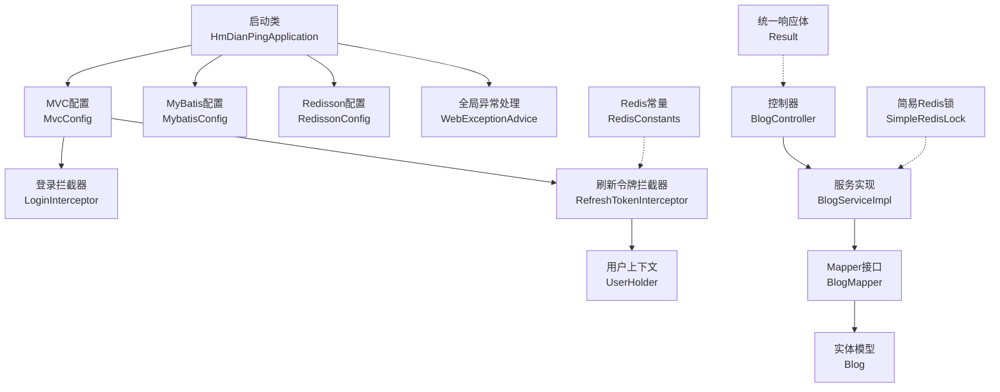
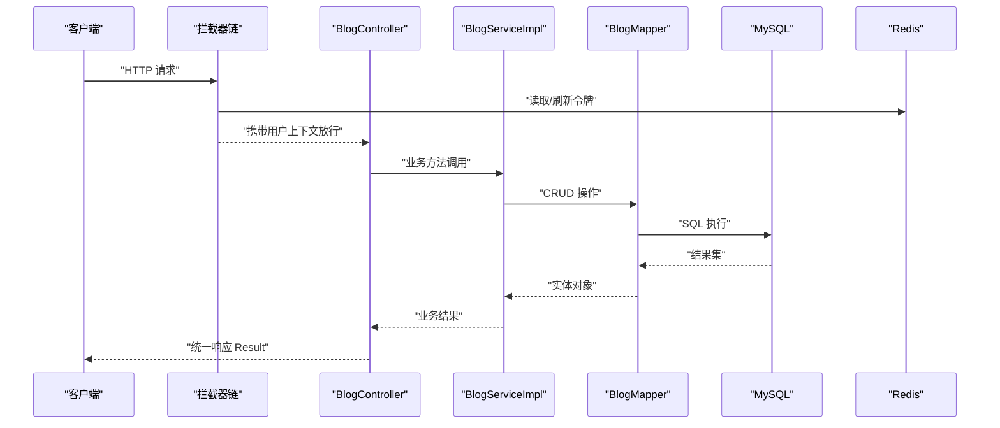
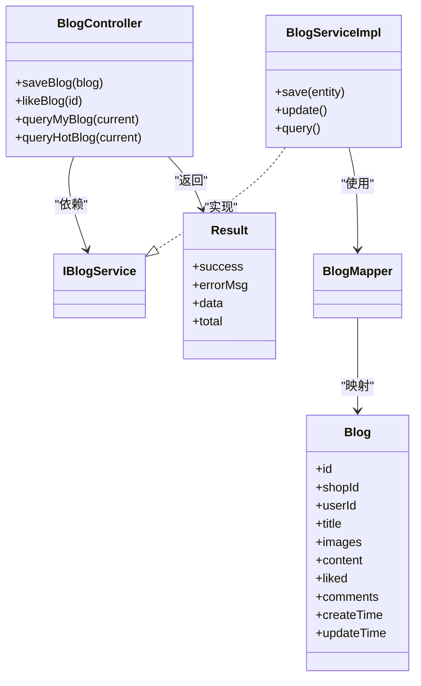
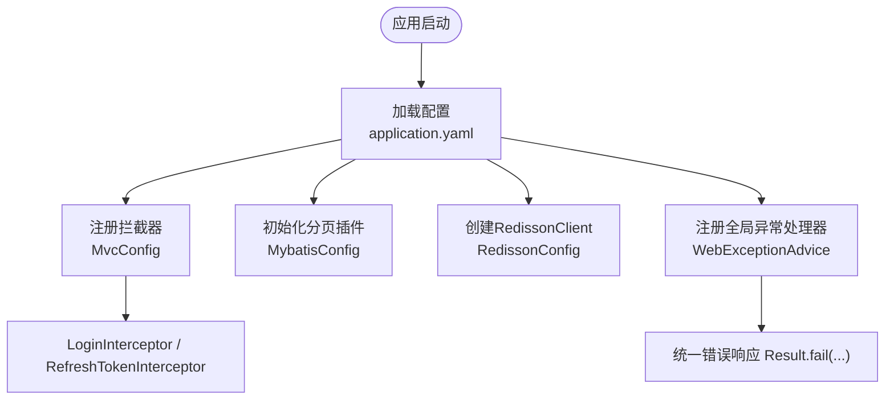
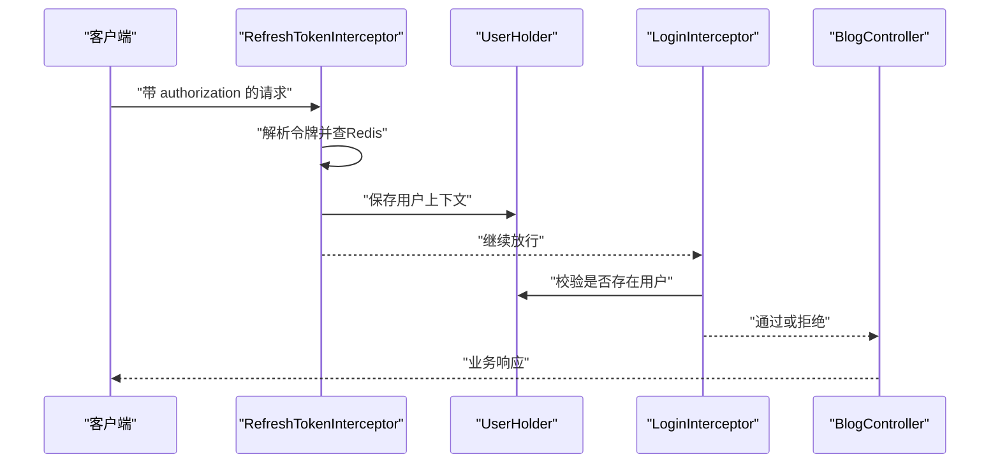
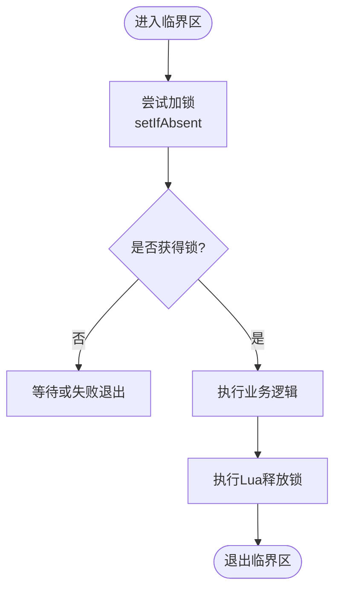
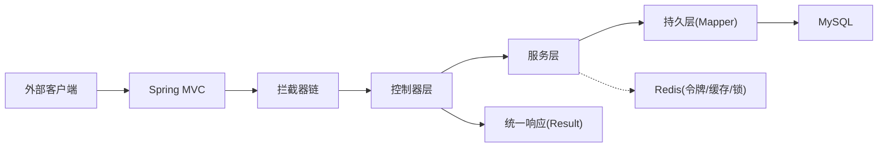
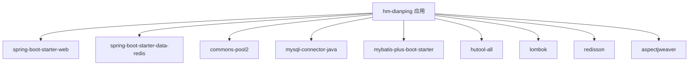

# 架构设计

<cite>
**本文引用的文件**   
- [HmDianPingApplication.java](file://src/main/java/com/hmdp/HmDianPingApplication.java)
- [pom.xml](file://pom.xml)
- [application.yaml](file://src/main/resources/application.yaml)
- [MvcConfig.java](file://src/main/java/com/hmdp/config/MvcConfig.java)
- [RedissonConfig.java](file://src/main/java/com/hmdp/config/RedissonConfig.java)
- [MybatisConfig.java](file://src/main/java/com/hmdp/config/MybatisConfig.java)
- [WebExceptionAdvice.java](file://src/main/java/com/hmdp/config/WebExceptionAdvice.java)
- [BlogController.java](file://src/main/java/com/hmdp/controller/BlogController.java)
- [BlogServiceImpl.java](file://src/main/java/com/hmdp/service/impl/BlogServiceImpl.java)
- [BlogMapper.java](file://src/main/java/com/hmdp/mapper/BlogMapper.java)
- [Blog.java](file://src/main/java/com/hmdp/entity/Blog.java)
- [LoginInterceptor.java](file://src/main/java/com/hmdp/utils/LoginInterceptor.java)
- [RefreshTokenInterceptor.java](file://src/main/java/com/hmdp/utils/RefreshTokenInterceptor.java)
- [UserHolder.java](file://src/main/java/com/hmdp/utils/UserHolder.java)
- [Result.java](file://src/main/java/com/hmdp/dto/Result.java)
- [RedisConstants.java](file://src/main/java/com/hmdp/utils/RedisConstants.java)
- [SimpleRedisLock.java](file://src/main/java/com/hmdp/utils/SimpleRedisLock.java)
</cite>

## 目录
1. [引言](#引言)
2. [项目结构](#项目结构)
3. [核心组件](#核心组件)
4. [架构总览](#架构总览)
5. [详细组件分析](#详细组件分析)
6. [依赖分析](#依赖分析)
7. [性能考虑](#性能考虑)
8. [故障排查指南](#故障排查指南)
9. [结论](#结论)
10. [附录](#附录)

## 引言
本文件为 my-hbdp 项目的架构设计文档，围绕分层架构（Controller-Service-Mapper）、MVC 模式与组件交互关系展开，系统阐述配置管理层（MVC、Redisson 分布式锁、MyBatis、全局异常处理）的设计与技术决策。文档同时给出系统边界、数据流向图与组件分解图，并覆盖横切关注点（安全性、监控、灾难恢复），记录技术栈、第三方依赖与版本兼容性。

## 项目结构
项目采用典型的 Spring Boot 分层组织：
- 启动类负责应用装配与扫描
- config 包集中管理 MVC、数据库、缓存与异常等横切配置
- controller 暴露 REST API，service 封装业务逻辑，mapper 对接持久层
- utils 提供拦截器、锁、常量、上下文等通用能力
- resources 包含应用配置、SQL 脚本与 Lua 脚本

图表来源
- [HmDianPingApplication.java:1-18](file://src/main/java/com/hmdp/HmDianPingApplication.java#L1-L18)
- [MvcConfig.java:1-34](file://src/main/java/com/hmdp/config/MvcConfig.java#L1-L34)
- [MybatisConfig.java:1-18](file://src/main/java/com/hmdp/config/MybatisConfig.java#L1-L18)
- [RedissonConfig.java:1-18](file://src/main/java/com/hmdp/config/RedissonConfig.java#L1-L18)
- [WebExceptionAdvice.java:1-18](file://src/main/java/com/hmdp/config/WebExceptionAdvice.java#L1-L18)
- [BlogController.java:1-84](file://src/main/java/com/hmdp/controller/BlogController.java#L1-L84)
- [BlogServiceImpl.java:1-21](file://src/main/java/com/hmdp/service/impl/BlogServiceImpl.java#L1-L21)
- [BlogMapper.java:1-17](file://src/main/java/com/hmdp/mapper/BlogMapper.java#L1-L17)
- [Blog.java:1-96](file://src/main/java/com/hmdp/entity/Blog.java#L1-L96)
- [LoginInterceptor.java:1-31](file://src/main/java/com/hmdp/utils/LoginInterceptor.java#L1-L31)
- [RefreshTokenInterceptor.java:1-51](file://src/main/java/com/hmdp/utils/RefreshTokenInterceptor.java#L1-L51)
- [UserHolder.java:1-20](file://src/main/java/com/hmdp/utils/UserHolder.java#L1-L20)
- [Result.java:1-31](file://src/main/java/com/hmdp/dto/Result.java#L1-L31)
- [RedisConstants.java:1-25](file://src/main/java/com/hmdp/utils/RedisConstants.java#L1-L25)
- [SimpleRedisLock.java:1-56](file://src/main/java/com/hmdp/utils/SimpleRedisLock.java#L1-L56)

章节来源
- [HmDianPingApplication.java:1-18](file://src/main/java/com/hmdp/HmDianPingApplication.java#L1-L18)
- [application.yaml:1-28](file://src/main/resources/application.yaml#L1-L28)

## 核心组件
- 启动与装配
  - 启动类启用 AOP、扫描 Mapper 包，作为应用入口
- 配置层
  - MVC 配置：注册登录校验与令牌刷新拦截器，定义白名单路径
  - MyBatis 配置：注入分页插件（MySQL）
  - Redisson 配置：创建 RedissonClient Bean
  - 全局异常处理：捕获运行时异常并返回统一错误响应
- 控制器层
  - 以 BlogController 为例，接收请求、调用服务、组装统一响应
- 服务层
  - 基于 MyBatis-Plus 的 ServiceImpl 快速实现 CRUD
- 持久层
  - Mapper 继承 BaseMapper，配合实体注解完成映射
- 通用工具
  - 登录拦截器、令牌刷新拦截器、用户上下文、Redis 常量、简易分布式锁

章节来源
- [HmDianPingApplication.java:1-18](file://src/main/java/com/hmdp/HmDianPingApplication.java#L1-L18)
- [MvcConfig.java:1-34](file://src/main/java/com/hmdp/config/MvcConfig.java#L1-L34)
- [MybatisConfig.java:1-18](file://src/main/java/com/hmdp/config/MybatisConfig.java#L1-L18)
- [RedissonConfig.java:1-18](file://src/main/java/com/hmdp/config/RedissonConfig.java#L1-L18)
- [WebExceptionAdvice.java:1-18](file://src/main/java/com/hmdp/config/WebExceptionAdvice.java#L1-L18)
- [BlogController.java:1-84](file://src/main/java/com/hmdp/controller/BlogController.java#L1-L84)
- [BlogServiceImpl.java:1-21](file://src/main/java/com/hmdp/service/impl/BlogServiceImpl.java#L1-L21)
- [BlogMapper.java:1-17](file://src/main/java/com/hmdp/mapper/BlogMapper.java#L1-L17)
- [Blog.java:1-96](file://src/main/java/com/hmdp/entity/Blog.java#L1-L96)
- [LoginInterceptor.java:1-31](file://src/main/java/com/hmdp/utils/LoginInterceptor.java#L1-L31)
- [RefreshTokenInterceptor.java:1-51](file://src/main/java/com/hmdp/utils/RefreshTokenInterceptor.java#L1-L51)
- [UserHolder.java:1-20](file://src/main/java/com/hmdp/utils/UserHolder.java#L1-L20)
- [Result.java:1-31](file://src/main/java/com/hmdp/dto/Result.java#L1-L31)
- [RedisConstants.java:1-25](file://src/main/java/com/hmdp/utils/RedisConstants.java#L1-L25)
- [SimpleRedisLock.java:1-56](file://src/main/java/com/hmdp/utils/SimpleRedisLock.java#L1-L56)

## 架构总览
整体采用 Controller-Service-Mapper 三层架构，结合 Spring MVC 拦截器链实现横切关注点（鉴权、会话续期）。数据流自上而下：请求进入拦截器 -> 控制器 -> 服务 -> Mapper -> 数据库；响应自下而上返回，经全局异常处理器统一包装。

图表来源
- [MvcConfig.java:1-34](file://src/main/java/com/hmdp/config/MvcConfig.java#L1-L34)
- [RefreshTokenInterceptor.java:1-51](file://src/main/java/com/hmdp/utils/RefreshTokenInterceptor.java#L1-L51)
- [BlogController.java:1-84](file://src/main/java/com/hmdp/controller/BlogController.java#L1-L84)
- [BlogServiceImpl.java:1-21](file://src/main/java/com/hmdp/service/impl/BlogServiceImpl.java#L1-L21)
- [BlogMapper.java:1-17](file://src/main/java/com/hmdp/mapper/BlogMapper.java#L1-L17)
- [application.yaml:1-28](file://src/main/resources/application.yaml#L1-L28)

## 详细组件分析

### 分层架构与 MVC 模式
- 控制器层
  - 负责参数解析、权限判断、调用服务、组装统一响应
  - 示例：博客保存、点赞、分页查询热门博文
- 服务层
  - 基于 MyBatis-Plus 的 ServiceImpl 提供基础 CRUD 扩展点
- 持久层
  - Mapper 继承 BaseMapper，通过实体注解完成表映射
- 统一响应
  - 所有接口返回 Result 对象，便于前端一致化处理

图表来源
- [BlogController.java:1-84](file://src/main/java/com/hmdp/controller/BlogController.java#L1-L84)
- [BlogServiceImpl.java:1-21](file://src/main/java/com/hmdp/service/impl/BlogServiceImpl.java#L1-L21)
- [BlogMapper.java:1-17](file://src/main/java/com/hmdp/mapper/BlogMapper.java#L1-L17)
- [Blog.java:1-96](file://src/main/java/com/hmdp/entity/Blog.java#L1-L96)
- [Result.java:1-31](file://src/main/java/com/hmdp/dto/Result.java#L1-L31)

章节来源
- [BlogController.java:1-84](file://src/main/java/com/hmdp/controller/BlogController.java#L1-L84)
- [BlogServiceImpl.java:1-21](file://src/main/java/com/hmdp/service/impl/BlogServiceImpl.java#L1-L21)
- [BlogMapper.java:1-17](file://src/main/java/com/hmdp/mapper/BlogMapper.java#L1-L17)
- [Blog.java:1-96](file://src/main/java/com/hmdp/entity/Blog.java#L1-L96)
- [Result.java:1-31](file://src/main/java/com/hmdp/dto/Result.java#L1-L31)

### 配置管理层设计
- MVC 配置
  - 注册两个拦截器：登录校验与令牌刷新，设置白名单路径与执行顺序
- Redisson 分布式锁配置
  - 通过单节点模式创建 RedissonClient Bean，供业务使用
- MyBatis 配置
  - 注入分页插件，指定 MySQL 方言
- 全局异常处理
  - 捕获运行时异常，记录日志并返回统一失败响应

图表来源
- [application.yaml:1-28](file://src/main/resources/application.yaml#L1-L28)
- [MvcConfig.java:1-34](file://src/main/java/com/hmdp/config/MvcConfig.java#L1-L34)
- [MybatisConfig.java:1-18](file://src/main/java/com/hmdp/config/MybatisConfig.java#L1-L18)
- [RedissonConfig.java:1-18](file://src/main/java/com/hmdp/config/RedissonConfig.java#L1-L18)
- [WebExceptionAdvice.java:1-18](file://src/main/java/com/hmdp/config/WebExceptionAdvice.java#L1-L18)

章节来源
- [MvcConfig.java:1-34](file://src/main/java/com/hmdp/config/MvcConfig.java#L1-L34)
- [RedissonConfig.java:1-18](file://src/main/java/com/hmdp/config/RedissonConfig.java#L1-L18)
- [MybatisConfig.java:1-18](file://src/main/java/com/hmdp/config/MybatisConfig.java#L1-L18)
- [WebExceptionAdvice.java:1-18](file://src/main/java/com/hmdp/config/WebExceptionAdvice.java#L1-L18)
- [application.yaml:1-28](file://src/main/resources/application.yaml#L1-L28)

### 安全与会话续期
- 登录校验
  - 若上下文中无用户信息则拒绝访问并返回未授权状态
- 令牌刷新
  - 从请求头获取令牌，命中 Redis 则回填用户上下文并续期 TTL
- 用户上下文
  - 基于 ThreadLocal 存储当前线程的用户信息，请求结束后清理

图表来源
- [RefreshTokenInterceptor.java:1-51](file://src/main/java/com/hmdp/utils/RefreshTokenInterceptor.java#L1-L51)
- [LoginInterceptor.java:1-31](file://src/main/java/com/hmdp/utils/LoginInterceptor.java#L1-L31)
- [UserHolder.java:1-20](file://src/main/java/com/hmdp/utils/UserHolder.java#L1-L20)
- [BlogController.java:1-84](file://src/main/java/com/hmdp/controller/BlogController.java#L1-L84)

章节来源
- [LoginInterceptor.java:1-31](file://src/main/java/com/hmdp/utils/LoginInterceptor.java#L1-L31)
- [RefreshTokenInterceptor.java:1-51](file://src/main/java/com/hmdp/utils/RefreshTokenInterceptor.java#L1-L51)
- [UserHolder.java:1-20](file://src/main/java/com/hmdp/utils/UserHolder.java#L1-L20)

### 分布式锁与并发控制
- 简易 Redis 锁
  - 基于 setIfAbsent 加锁，Lua 脚本原子释放，避免误删
  - 适用于热点资源保护与库存扣减等场景
- 常量管理
  - 将键名前缀、TTL 等集中到常量类，便于统一治理

图表来源
- [SimpleRedisLock.java:1-56](file://src/main/java/com/hmdp/utils/SimpleRedisLock.java#L1-L56)
- [RedisConstants.java:1-25](file://src/main/java/com/hmdp/utils/RedisConstants.java#L1-L25)

章节来源
- [SimpleRedisLock.java:1-56](file://src/main/java/com/hmdp/utils/SimpleRedisLock.java#L1-L56)
- [RedisConstants.java:1-25](file://src/main/java/com/hmdp/utils/RedisConstants.java#L1-L25)

### 数据流向与边界
- 系统边界
  - 外部：浏览器/移动端/第三方调用方
  - 内部：Spring MVC 容器、拦截器链、业务服务、持久层、缓存与消息
- 数据流
  - 入站：请求 -> 拦截器 -> 控制器 -> 服务 -> Mapper -> 数据库
  - 出站：数据库 -> Mapper -> 服务 -> 控制器 -> 统一响应
  - 缓存：令牌、热点数据、锁与计数等通过 Redis 支撑

图表来源
- [application.yaml:1-28](file://src/main/resources/application.yaml#L1-L28)
- [MvcConfig.java:1-34](file://src/main/java/com/hmdp/config/MvcConfig.java#L1-L34)
- [BlogController.java:1-84](file://src/main/java/com/hmdp/controller/BlogController.java#L1-L84)
- [BlogServiceImpl.java:1-21](file://src/main/java/com/hmdp/service/impl/BlogServiceImpl.java#L1-L21)
- [BlogMapper.java:1-17](file://src/main/java/com/hmdp/mapper/BlogMapper.java#L1-L17)
- [Result.java:1-31](file://src/main/java/com/hmdp/dto/Result.java#L1-L31)

## 依赖分析
- 构建与运行环境
  - Java 8、Spring Boot 2.3.12
- 关键依赖
  - Web：spring-boot-starter-web
  - 缓存：spring-boot-starter-data-redis + commons-pool2
  - 数据库：mysql-connector-java、mybatis-plus-boot-starter
  - 工具：hutool-all、lombok
  - 分布式锁：redisson
  - AOP：aspectjweaver

图表来源
- [pom.xml:1-90](file://pom.xml#L1-L90)

章节来源
- [pom.xml:1-90](file://pom.xml#L1-L90)

## 性能考虑
- 连接池与序列化
  - Redis Lettuce 连接池参数已配置，建议根据压测调优 max-active/max-idle
  - Jackson 忽略非空字段可减少网络传输体积
- 分页与索引
  - 使用 MyBatis-Plus 分页插件，确保后端分页查询具备合适索引
- 缓存策略
  - 热点数据与令牌缓存降低数据库压力，注意 TTL 与一致性权衡
- 分布式锁
  - 使用 Lua 原子释放锁，避免死锁与误删；合理设置超时时间
- 日志级别
  - 开发环境开启 debug，生产建议调整为 info/warn，减少 IO 开销

[本节为通用指导，不直接分析具体文件]

## 故障排查指南
- 常见异常
  - 运行时异常被全局异常处理器捕获，返回统一失败响应并记录堆栈
- 鉴权问题
  - 未携带令牌或令牌过期会导致登录拦截器拒绝访问
- 令牌刷新失败
  - 检查 Redis 连通性与密码配置，确认 key 前缀与 TTL 常量
- 锁冲突与死锁
  - 核对锁键命名与超时时间，确认 Lua 脚本可用且 Redis 可达

章节来源
- [WebExceptionAdvice.java:1-18](file://src/main/java/com/hmdp/config/WebExceptionAdvice.java#L1-L18)
- [LoginInterceptor.java:1-31](file://src/main/java/com/hmdp/utils/LoginInterceptor.java#L1-L31)
- [RefreshTokenInterceptor.java:1-51](file://src/main/java/com/hmdp/utils/RefreshTokenInterceptor.java#L1-L51)
- [RedisConstants.java:1-25](file://src/main/java/com/hmdp/utils/RedisConstants.java#L1-L25)
- [application.yaml:1-28](file://src/main/resources/application.yaml#L1-L28)

## 结论
本项目采用清晰的分层架构与标准 MVC 模式，借助拦截器实现统一的鉴权与会话续期，结合 MyBatis-Plus 提升开发效率，使用 Redis 与 Redisson 提供高性能缓存与分布式锁能力。配置集中、横切关注点明确，具备良好的可维护性与扩展性。后续可在多活部署、限流熔断、链路追踪等方面进一步增强系统的韧性与可观测性。

[本节为总结性内容，不直接分析具体文件]

## 附录
- 技术栈与版本
  - Java 8
  - Spring Boot 2.3.12
  - MyBatis-Plus 3.4.3
  - Redisson 3.13.6
  - Hutool 5.7.17
  - MySQL Connector/J 5.1.47
- 配置要点
  - 端口、数据源、Redis、Jackson、MyBatis-Plus 别名、日志级别均在 application.yaml 中集中管理
- 系统边界
  - 对外暴露 REST API，对内通过拦截器、服务、持久层与缓存协作完成业务处理

章节来源
- [pom.xml:1-90](file://pom.xml#L1-L90)
- [application.yaml:1-28](file://src/main/resources/application.yaml#L1-L28)