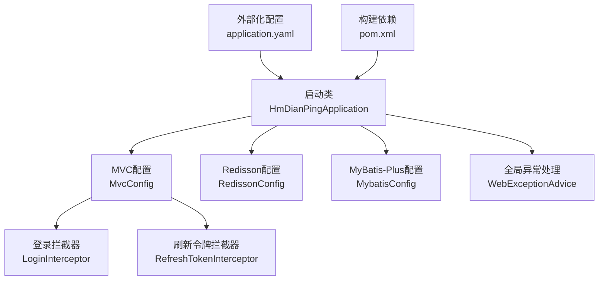
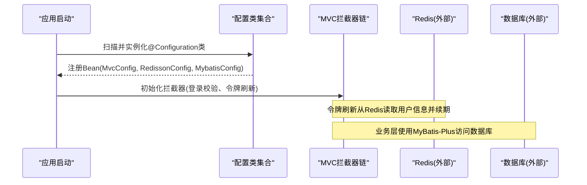
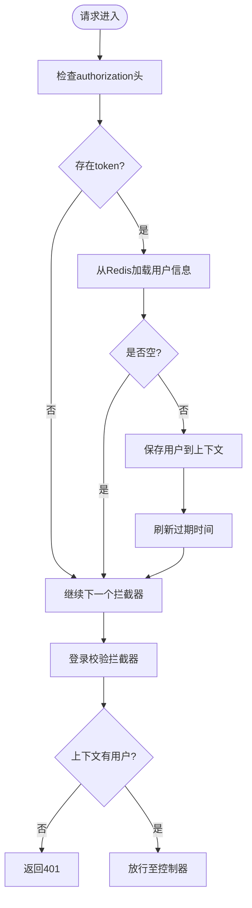
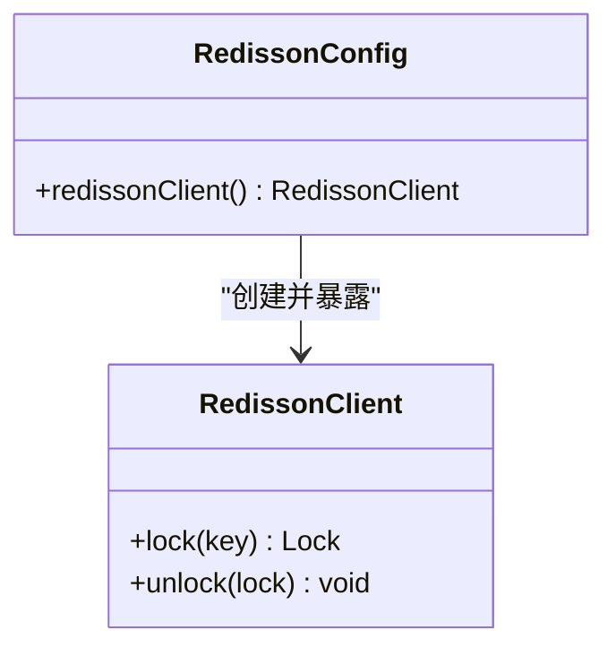
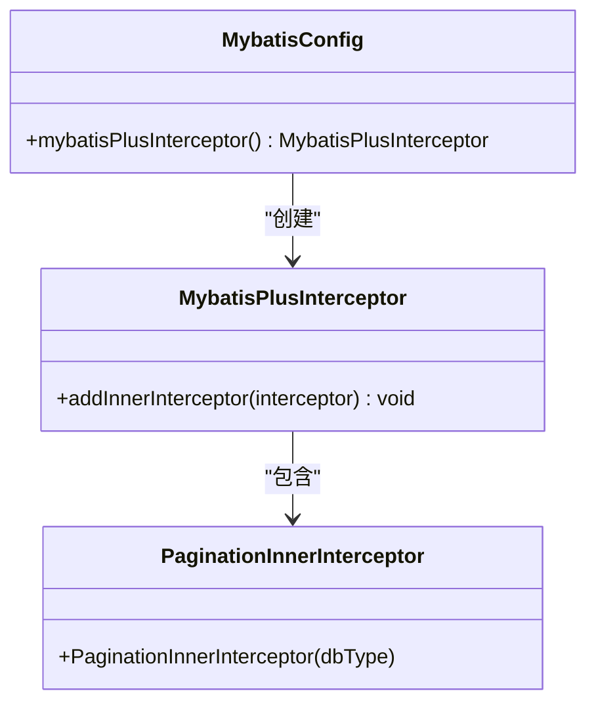
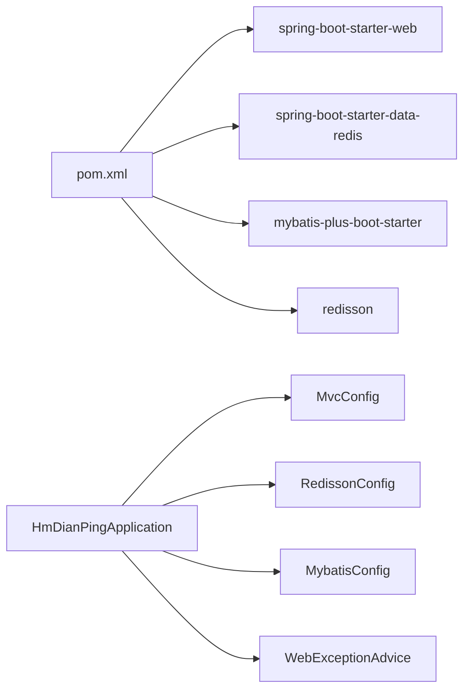

# 配置管理架构

<cite>
**本文引用的文件**
- [HmDianPingApplication.java](file://src/main/java/com/hmdp/HmDianPingApplication.java)
- [MvcConfig.java](file://src/main/java/com/hmdp/config/MvcConfig.java)
- [RedissonConfig.java](file://src/main/java/com/hmdp/config/RedissonConfig.java)
- [MybatisConfig.java](file://src/main/java/com/hmdp/config/MybatisConfig.java)
- [WebExceptionAdvice.java](file://src/main/java/com/hmdp/config/WebExceptionAdvice.java)
- [LoginInterceptor.java](file://src/main/java/com/hmdp/utils/LoginInterceptor.java)
- [RefreshTokenInterceptor.java](file://src/main/java/com/hmdp/utils/RefreshTokenInterceptor.java)
- [application.yaml](file://src/main/resources/application.yaml)
- [pom.xml](file://pom.xml)
</cite>

## 目录
1. [简介](#简介)
2. [项目结构](#项目结构)
3. [核心组件](#核心组件)
4. [架构总览](#架构总览)
5. [详细组件分析](#详细组件分析)
6. [依赖关系分析](#依赖关系分析)
7. [性能与可扩展性](#性能与可扩展性)
8. [故障排查指南](#故障排查指南)
9. [结论](#结论)
10. [附录](#附录)

## 简介
本文件面向 my-hbdp 项目的配置管理，系统性阐述 Spring Boot 的配置机制在该项目中的落地方式。重点覆盖以下方面：
- MVC 拦截器配置（MvcConfig）
- 分布式锁客户端配置（RedissonConfig）
- MyBatis-Plus 分页插件配置（MybatisConfig）
- @Configuration 注解的使用、Bean 注册与管理
- 外部化配置的加载机制与环境隔离方案
- 配置文件结构与自定义配置类的扩展方法

## 项目结构
本项目采用分层组织方式，配置集中在 config 包下，外部化配置集中于 application.yaml；启动类负责应用扫描与基础能力开启。

图表来源
- [HmDianPingApplication.java:1-18](file://src/main/java/com/hmdp/HmDianPingApplication.java#L1-L18)
- [MvcConfig.java:1-34](file://src/main/java/com/hmdp/config/MvcConfig.java#L1-L34)
- [RedissonConfig.java:1-18](file://src/main/java/com/hmdp/config/RedissonConfig.java#L1-L18)
- [MybatisConfig.java:1-18](file://src/main/java/com/hmdp/config/MybatisConfig.java#L1-L18)
- [WebExceptionAdvice.java:1-17](file://src/main/java/com/hmdp/config/WebExceptionAdvice.java#L1-L17)
- [LoginInterceptor.java:1-31](file://src/main/java/com/hmdp/utils/LoginInterceptor.java#L1-L31)
- [RefreshTokenInterceptor.java:1-51](file://src/main/java/com/hmdp/utils/RefreshTokenInterceptor.java#L1-L51)
- [application.yaml:1-28](file://src/main/resources/application.yaml#L1-L28)
- [pom.xml:1-95](file://pom.xml#L1-L95)

章节来源
- [HmDianPingApplication.java:1-18](file://src/main/java/com/hmdp/HmDianPingApplication.java#L1-L18)
- [application.yaml:1-28](file://src/main/resources/application.yaml#L1-L28)
- [pom.xml:1-95](file://pom.xml#L1-L95)

## 核心组件
- MvcConfig：实现 WebMvcConfigurer，注册登录校验与令牌刷新两个拦截器，并设置执行顺序与排除路径。
- RedissonConfig：通过 @Bean 暴露 RedissonClient，用于分布式锁等场景。
- MybatisConfig：通过 @Bean 暴露 MybatisPlusInterceptor，启用分页插件。
- WebExceptionAdvice：统一异常处理，返回标准结果对象。
- LoginInterceptor / RefreshTokenInterceptor：基于请求头与 Redis 的用户会话校验与续期。
- application.yaml：集中承载服务器端口、数据源、Redis、Jackson、MyBatis-Plus、日志级别等外部化配置。

章节来源
- [MvcConfig.java:1-34](file://src/main/java/com/hmdp/config/MvcConfig.java#L1-L34)
- [RedissonConfig.java:1-18](file://src/main/java/com/hmdp/config/RedissonConfig.java#L1-L18)
- [MybatisConfig.java:1-18](file://src/main/java/com/hmdp/config/MybatisConfig.java#L1-L18)
- [WebExceptionAdvice.java:1-17](file://src/main/java/com/hmdp/config/WebExceptionAdvice.java#L1-L17)
- [LoginInterceptor.java:1-31](file://src/main/java/com/hmdp/utils/LoginInterceptor.java#L1-L31)
- [RefreshTokenInterceptor.java:1-51](file://src/main/java/com/hmdp/utils/RefreshTokenInterceptor.java#L1-L51)
- [application.yaml:1-28](file://src/main/resources/application.yaml#L1-L28)

## 架构总览
下图展示了配置类如何被 Spring 容器发现、装配 Bean，以及请求进入时的拦截器链路与外部化配置的作用点。

图表来源
- [HmDianPingApplication.java:1-18](file://src/main/java/com/hmdp/HmDianPingApplication.java#L1-L18)
- [MvcConfig.java:1-34](file://src/main/java/com/hmdp/config/MvcConfig.java#L1-L34)
- [RedissonConfig.java:1-18](file://src/main/java/com/hmdp/config/RedissonConfig.java#L1-L18)
- [MybatisConfig.java:1-18](file://src/main/java/com/hmdp/config/MybatisConfig.java#L1-L18)
- [application.yaml:1-28](file://src/main/resources/application.yaml#L1-L28)

## 详细组件分析

### MVC 拦截器配置（MvcConfig）
- 设计模式
  - 策略模式：将“登录校验”和“令牌刷新”作为可插拔的拦截器策略，按需组合。
  - 模板方法：实现 WebMvcConfigurer 的 addInterceptors 钩子，由框架调用以完成注册。
- Bean 管理与注入
  - 通过 @Resource 注入 StringRedisTemplate，供刷新令牌拦截器使用。
  - 拦截器按 order 排序：先刷新令牌（order=0），再登录校验（order=1）。
- 外部化配置结合点
  - 当前拦截器逻辑未直接读取 application.yaml 字段，但可通过 @Value 或 @ConfigurationProperties 接入。
- 关键流程（请求进入）
  - 若请求携带 authorization 且 Redis 中存在对应键，则刷新 TTL 并将用户上下文写入线程局部变量。
  - 后续拦截器检查用户上下文，缺失则拒绝访问。

图表来源
- [MvcConfig.java:1-34](file://src/main/java/com/hmdp/config/MvcConfig.java#L1-L34)
- [RefreshTokenInterceptor.java:1-51](file://src/main/java/com/hmdp/utils/RefreshTokenInterceptor.java#L1-L51)
- [LoginInterceptor.java:1-31](file://src/main/java/com/hmdp/utils/LoginInterceptor.java#L1-L31)

章节来源
- [MvcConfig.java:1-34](file://src/main/java/com/hmdp/config/MvcConfig.java#L1-L34)
- [RefreshTokenInterceptor.java:1-51](file://src/main/java/com/hmdp/utils/RefreshTokenInterceptor.java#L1-L51)
- [LoginInterceptor.java:1-31](file://src/main/java/com/hmdp/utils/LoginInterceptor.java#L1-L31)

### 分布式锁客户端配置（RedissonConfig）
- 设计模式
  - 工厂模式：通过 @Bean 方法创建并返回 RedissonClient 实例，交由容器统一管理生命周期。
- 外部化配置结合点
  - 当前硬编码了 Redis 地址与密码，建议迁移至 application.yaml 并通过 @Value 或 @ConfigurationProperties 注入，以实现环境隔离。
- 使用场景
  - 为业务提供分布式锁能力，避免多实例并发竞争问题。

图表来源
- [RedissonConfig.java:1-18](file://src/main/java/com/hmdp/config/RedissonConfig.java#L1-L18)

章节来源
- [RedissonConfig.java:1-18](file://src/main/java/com/hmdp/config/RedissonConfig.java#L1-L18)

### 数据库配置（MybatisConfig）
- 设计模式
  - 插件化：通过 MybatisPlusInterceptor 添加 PaginationInnerInterceptor，启用分页功能。
- Bean 管理
  - 以 @Bean 形式暴露拦截器，Spring 自动装配到 MyBatis-Plus 运行期。
- 外部化配置结合点
  - 数据源连接参数来自 application.yaml，MyBatis-Plus 的 type-aliases-package 也在此文件中声明。

图表来源
- [MybatisConfig.java:1-18](file://src/main/java/com/hmdp/config/MybatisConfig.java#L1-L18)

章节来源
- [MybatisConfig.java:1-18](file://src/main/java/com/hmdp/config/MybatisConfig.java#L1-L18)
- [application.yaml:23-25](file://src/main/resources/application.yaml#L23-L25)

### 全局异常处理（WebExceptionAdvice）
- 设计模式
  - 横切关注点：通过 @RestControllerAdvice 统一捕获运行时异常，返回标准化响应体。
- 与配置的关系
  - 属于应用级配置的一部分，便于对外暴露一致的错误格式。

章节来源
- [WebExceptionAdvice.java:1-17](file://src/main/java/com/hmdp/config/WebExceptionAdvice.java#L1-L17)

## 依赖关系分析
- 启动类
  - 使用 @SpringBootApplication 开启自动配置与组件扫描。
  - 使用 @MapperScan 指定 Mapper 接口扫描包。
  - 使用 @EnableAspectJAutoProxy 开启 AOP。
- 配置类
  - 均位于 com.hmdp.config 包下，随组件扫描被自动发现。
- 外部依赖
  - pom.xml 引入 spring-boot-starter-web、spring-boot-starter-data-redis、mybatis-plus-boot-starter、redisson 等。

图表来源
- [pom.xml:1-95](file://pom.xml#L1-L95)
- [HmDianPingApplication.java:1-18](file://src/main/java/com/hmdp/HmDianPingApplication.java#L1-L18)
- [MvcConfig.java:1-34](file://src/main/java/com/hmdp/config/MvcConfig.java#L1-L34)
- [RedissonConfig.java:1-18](file://src/main/java/com/hmdp/config/RedissonConfig.java#L1-L18)
- [MybatisConfig.java:1-18](file://src/main/java/com/hmdp/config/MybatisConfig.java#L1-L18)
- [WebExceptionAdvice.java:1-17](file://src/main/java/com/hmdp/config/WebExceptionAdvice.java#L1-L17)

章节来源
- [pom.xml:1-95](file://pom.xml#L1-L95)
- [HmDianPingApplication.java:1-18](file://src/main/java/com/hmdp/HmDianPingApplication.java#L1-L18)

## 性能与可扩展性
- 拦截器顺序优化
  - 将“刷新令牌”置于“登录校验”之前，减少无效校验开销。
- 连接池与超时
  - Redis 连接池参数在 application.yaml 中定义，可根据压测结果调优 max-active、max-idle、min-idle 等。
- 分页与查询
  - 通过 MyBatis-Plus 分页插件提升大数据量查询性能，注意合理设置页大小。
- 可扩展性建议
  - 将 Redisson 的连接信息外置，支持多环境切换。
  - 对拦截器路径白名单进行外部化配置，便于不同环境差异化控制。

[本节为通用指导，不直接分析具体文件]

## 故障排查指南
- 常见问题定位
  - 401 未登录：检查登录校验拦截器前置条件与用户上下文是否正确设置。
  - 令牌未刷新：确认 Redis 键是否存在、TTL 是否更新成功。
  - 分布式锁不可用：核对 Redisson 连接信息与网络连通性。
  - 分页无效：检查 MybatisPlusInterceptor 是否已正确注册。
- 日志与监控
  - 调整 application.yaml 中日志级别，定位异常堆栈。
  - 借助 Actuator 暴露健康检查端点，观察 Redis、DB 状态。

章节来源
- [LoginInterceptor.java:1-31](file://src/main/java/com/hmdp/utils/LoginInterceptor.java#L1-L31)
- [RefreshTokenInterceptor.java:1-51](file://src/main/java/com/hmdp/utils/RefreshTokenInterceptor.java#L1-L51)
- [application.yaml:25-28](file://src/main/resources/application.yaml#L25-L28)

## 结论
本项目通过 @Configuration 与 @Bean 的组合，清晰地将 MVC 拦截器、分布式锁客户端与 MyBatis-Plus 插件进行解耦与装配；外部化配置集中在 application.yaml，便于统一管理与环境切换。建议在后续迭代中将硬编码配置全面外置，并结合 Profile 或环境变量实现更精细的环境隔离与动态切换。

[本节为总结性内容，不直接分析具体文件]

## 附录

### 外部化配置清单（application.yaml）
- 服务器
  - server.port
- Spring
  - spring.application.name
  - spring.datasource.*（驱动、URL、用户名、密码）
  - spring.redis.*（host、port、password、连接池参数）
  - spring.jackson.default-property-inclusion
- MyBatis-Plus
  - mybatis-plus.type-aliases-package
- 日志
  - logging.level.com.hmdp

章节来源
- [application.yaml:1-28](file://src/main/resources/application.yaml#L1-L28)

### 自定义配置类扩展方法
- 使用 @ConfigurationProperties 绑定配置前缀，集中管理业务相关参数。
- 使用 @Profile 或 @ConditionalOnProperty 实现按环境激活。
- 将敏感配置（如密码）通过环境变量或配置中心注入，避免明文落盘。

[本节为通用指导，不直接分析具体文件]