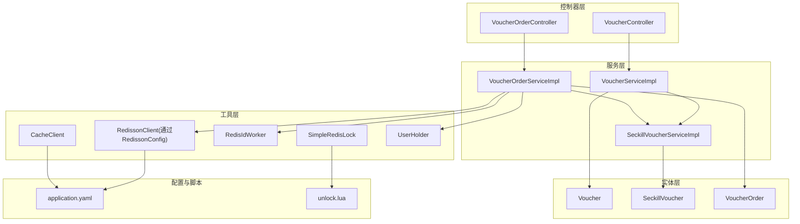
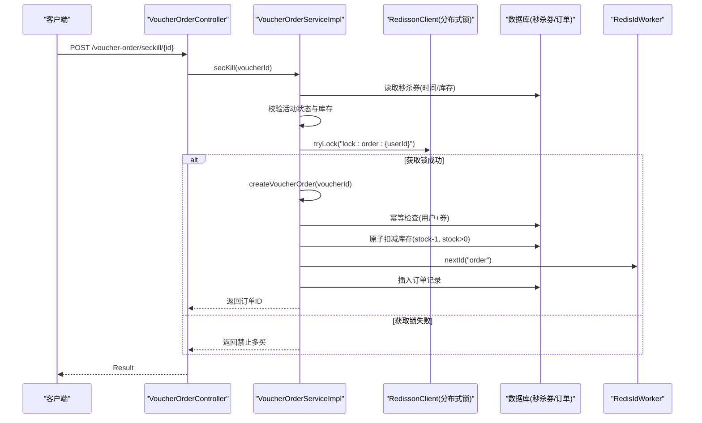
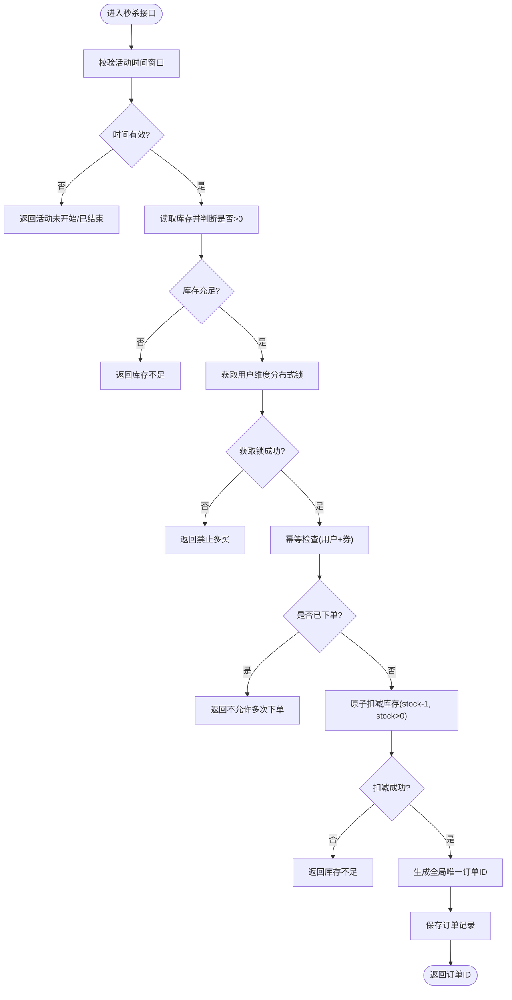
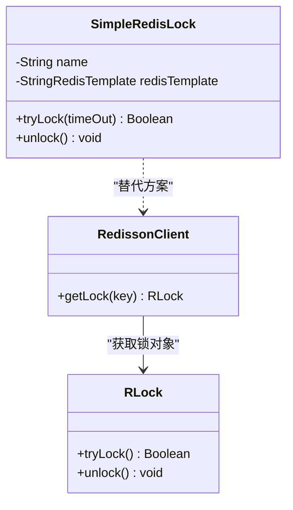
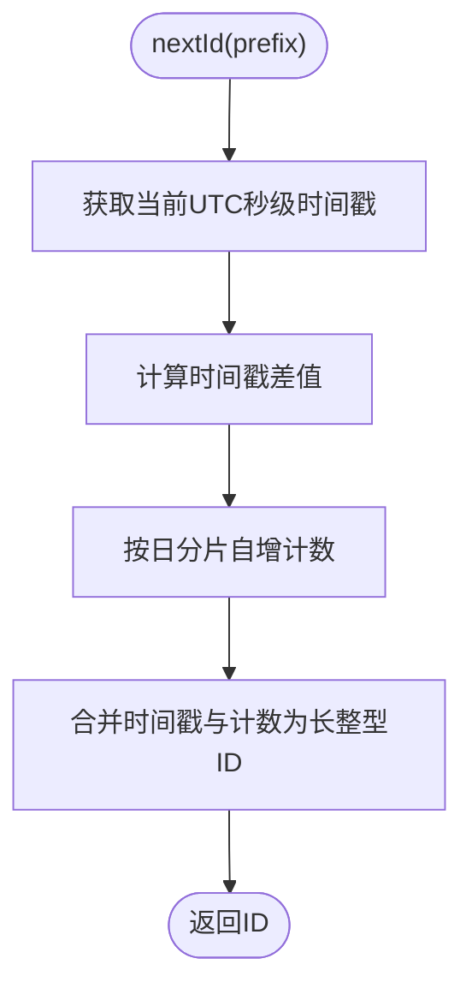
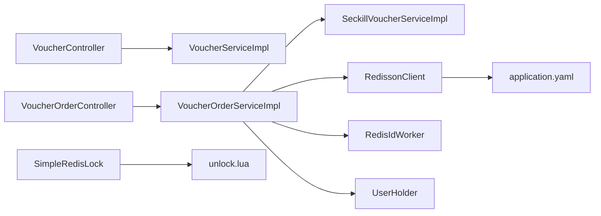

# 优惠券秒杀系统

<cite>
**本文引用的文件**   
- [VoucherController.java](file://src/main/java/com/hmdp/controller/VoucherController.java)
- [VoucherOrderController.java](file://src/main/java/com/hmdp/controller/VoucherOrderController.java)
- [VoucherServiceImpl.java](file://src/main/java/com/hmdp/service/impl/VoucherServiceImpl.java)
- [VoucherOrderServiceImpl.java](file://src/main/java/com/hmdp/service/impl/VoucherOrderServiceImpl.java)
- [SeckillVoucherServiceImpl.java](file://src/main/java/com/hmdp/service/impl/SeckillVoucherServiceImpl.java)
- [SeckillVoucher.java](file://src/main/java/com/hmdp/entity/SeckillVoucher.java)
- [Voucher.java](file://src/main/java/com/hmdp/entity/Voucher.java)
- [VoucherOrder.java](file://src/main/java/com/hmdp/entity/VoucherOrder.java)
- [SimpleRedisLock.java](file://src/main/java/com/hmdp/utils/SimpleRedisLock.java)
- [RedissonConfig.java](file://src/main/java/com/hmdp/config/RedissonConfig.java)
- [RedisIdWorker.java](file://src/main/java/com/hmdp/utils/RedisIdWorker.java)
- [CacheClient.java](file://src/main/java/com/hmdp/utils/CacheClient.java)
- [UserHolder.java](file://src/main/java/com/hmdp/utils/UserHolder.java)
- [application.yaml](file://src/main/resources/application.yaml)
- [unlock.lua](file://src/main/resources/unlock.lua)
</cite>

## 目录
1. [简介](#简介)
2. [项目结构](#项目结构)
3. [核心组件](#核心组件)
4. [架构总览](#架构总览)
5. [详细组件分析](#详细组件分析)
6. [依赖关系分析](#依赖关系分析)
7. [性能与高并发优化](#性能与高并发优化)
8. [故障排查指南](#故障排查指南)
9. [结论](#结论)
10. [附录](#附录)

## 简介
本技术文档围绕“优惠券秒杀系统”的普通券管理与秒杀券设计差异、高并发秒杀场景解决方案进行深入解析。重点覆盖库存预减、分布式锁、幂等性保证、超卖防护、订单创建流程，以及在高并发下的限流降级、监控告警策略与常见问题（库存不一致、重复下单）的解决思路。

## 项目结构
本项目采用分层架构：控制器层负责HTTP接口；服务层实现业务逻辑；实体层定义数据模型；工具层提供缓存、分布式锁、ID生成等通用能力；配置层管理外部依赖。



图表来源
- [VoucherController.java:1-58](file://src/main/java/com/hmdp/controller/VoucherController.java#L1-L58)
- [VoucherOrderController.java:1-34](file://src/main/java/com/hmdp/controller/VoucherOrderController.java#L1-L34)
- [VoucherServiceImpl.java:1-52](file://src/main/java/com/hmdp/service/impl/VoucherServiceImpl.java#L1-L52)
- [VoucherOrderServiceImpl.java:1-105](file://src/main/java/com/hmdp/service/impl/VoucherOrderServiceImpl.java#L1-L105)
- [SeckillVoucherServiceImpl.java:1-22](file://src/main/java/com/hmdp/service/impl/SeckillVoucherServiceImpl.java#L1-L22)
- [Voucher.java:1-106](file://src/main/java/com/hmdp/entity/Voucher.java#L1-L106)
- [SeckillVoucher.java:1-62](file://src/main/java/com/hmdp/entity/SeckillVoucher.java#L1-L62)
- [VoucherOrder.java:1-82](file://src/main/java/com/hmdp/entity/VoucherOrder.java#L1-L82)
- [SimpleRedisLock.java:1-56](file://src/main/java/com/hmdp/utils/SimpleRedisLock.java#L1-L56)
- [RedissonConfig.java:1-18](file://src/main/java/com/hmdp/config/RedissonConfig.java#L1-L18)
- [RedisIdWorker.java:1-39](file://src/main/java/com/hmdp/utils/RedisIdWorker.java#L1-L39)
- [CacheClient.java:1-140](file://src/main/java/com/hmdp/utils/CacheClient.java#L1-L140)
- [UserHolder.java:1-20](file://src/main/java/com/hmdp/utils/UserHolder.java#L1-L20)
- [application.yaml:1-28](file://src/main/resources/application.yaml#L1-L28)
- [unlock.lua:1-5](file://src/main/resources/unlock.lua#L1-L5)

章节来源
- [VoucherController.java:1-58](file://src/main/java/com/hmdp/controller/VoucherController.java#L1-L58)
- [VoucherOrderController.java:1-34](file://src/main/java/com/hmdp/controller/VoucherOrderController.java#L1-L34)
- [VoucherServiceImpl.java:1-52](file://src/main/java/com/hmdp/service/impl/VoucherServiceImpl.java#L1-L52)
- [VoucherOrderServiceImpl.java:1-105](file://src/main/java/com/hmdp/service/impl/VoucherOrderServiceImpl.java#L1-L105)
- [SeckillVoucherServiceImpl.java:1-22](file://src/main/java/com/hmdp/service/impl/SeckillVoucherServiceImpl.java#L1-L22)
- [Voucher.java:1-106](file://src/main/java/com/hmdp/entity/Voucher.java#L1-L106)
- [SeckillVoucher.java:1-62](file://src/main/java/com/hmdp/entity/SeckillVoucher.java#L1-L62)
- [VoucherOrder.java:1-82](file://src/main/java/com/hmdp/entity/VoucherOrder.java#L1-L82)
- [SimpleRedisLock.java:1-56](file://src/main/java/com/hmdp/utils/SimpleRedisLock.java#L1-L56)
- [RedissonConfig.java:1-18](file://src/main/java/com/hmdp/config/RedissonConfig.java#L1-L18)
- [RedisIdWorker.java:1-39](file://src/main/java/com/hmdp/utils/RedisIdWorker.java#L1-L39)
- [CacheClient.java:1-140](file://src/main/java/com/hmdp/utils/CacheClient.java#L1-L140)
- [UserHolder.java:1-20](file://src/main/java/com/hmdp/utils/UserHolder.java#L1-L20)
- [application.yaml:1-28](file://src/main/resources/application.yaml#L1-L28)
- [unlock.lua:1-5](file://src/main/resources/unlock.lua#L1-L5)

## 核心组件
- 普通券与秒杀券的数据模型差异
  - 普通券：基础信息（标题、规则、价格、状态等），库存字段在查询时动态聚合或扩展。
  - 秒杀券：与券一对一关联，包含独立库存、生效时间、失效时间等，用于高并发扣减。
- 秒杀下单流程关键路径
  - 活动有效性校验（开始/结束时间、库存）。
  - 用户维度分布式锁防重。
  - 幂等检查（同一用户同一券仅一次下单）。
  - 原子库存扣减（数据库条件更新）。
  - 全局唯一订单号生成并落库。
- 分布式锁实现
  - Redisson可重入锁（当前实现使用RedissonClient）。
  - 自定义基于Lua脚本的简单锁（具备原子释放能力）。
- 全局ID生成
  - 基于Redis自增的时间戳+序列号组合ID，避免冲突且有序。

章节来源
- [Voucher.java:1-106](file://src/main/java/com/hmdp/entity/Voucher.java#L1-L106)
- [SeckillVoucher.java:1-62](file://src/main/java/com/hmdp/entity/SeckillVoucher.java#L1-L62)
- [VoucherOrder.java:1-82](file://src/main/java/com/hmdp/entity/VoucherOrder.java#L1-L82)
- [VoucherOrderServiceImpl.java:1-105](file://src/main/java/com/hmdp/service/impl/VoucherOrderServiceImpl.java#L1-L105)
- [SimpleRedisLock.java:1-56](file://src/main/java/com/hmdp/utils/SimpleRedisLock.java#L1-L56)
- [RedissonConfig.java:1-18](file://src/main/java/com/hmdp/config/RedissonConfig.java#L1-L18)
- [RedisIdWorker.java:1-39](file://src/main/java/com/hmdp/utils/RedisIdWorker.java#L1-L39)

## 架构总览
下图展示了从请求入口到数据落库的关键调用链，包括锁获取、事务内库存扣减与订单持久化。



图表来源
- [VoucherOrderController.java:1-34](file://src/main/java/com/hmdp/controller/VoucherOrderController.java#L1-L34)
- [VoucherOrderServiceImpl.java:1-105](file://src/main/java/com/hmdp/service/impl/VoucherOrderServiceImpl.java#L1-L105)
- [RedissonConfig.java:1-18](file://src/main/java/com/hmdp/config/RedissonConfig.java#L1-L18)
- [RedisIdWorker.java:1-39](file://src/main/java/com/hmdp/utils/RedisIdWorker.java#L1-L39)

## 详细组件分析

### 普通券 vs 秒杀券设计与差异
- 普通券
  - 关注券的基础信息与展示属性，库存可在查询时聚合或按需加载。
  - 适合非高并发场景，下单链路相对简单。
- 秒杀券
  - 独立库存表，严格的时间窗口控制，强调并发安全与高性能。
  - 下单前需进行活动时间与库存快速判断，减少无效请求进入事务。
- 数据模型关系
  - 券与秒杀券为一对一关系，秒杀券承载库存与时间范围。

```mermaid
classDiagram
class Voucher {
+Long id
+Long shopId
+String title
+String subTitle
+String rules
+Long payValue
+Long actualValue
+Integer type
+Integer status
+LocalDateTime createTime
+LocalDateTime updateTime
}
class SeckillVoucher {
+Long voucherId
+Integer stock
+LocalDateTime beginTime
+LocalDateTime endTime
+LocalDateTime createTime
+LocalDateTime updateTime
}
class VoucherOrder {
+Long id
+Long userId
+Long voucherId
+Integer payType
+Integer status
+LocalDateTime createTime
+LocalDateTime payTime
+LocalDateTime useTime
+LocalDateTime refundTime
+LocalDateTime updateTime
}
Voucher ||--|| SeckillVoucher : "一对一等价映射"
VoucherOrder --> Voucher : "购买"
VoucherOrder --> SeckillVoucher : "核销"
```

图表来源
- [Voucher.java:1-106](file://src/main/java/com/hmdp/entity/Voucher.java#L1-L106)
- [SeckillVoucher.java:1-62](file://src/main/java/com/hmdp/entity/SeckillVoucher.java#L1-L62)
- [VoucherOrder.java:1-82](file://src/main/java/com/hmdp/entity/VoucherOrder.java#L1-L82)

章节来源
- [Voucher.java:1-106](file://src/main/java/com/hmdp/entity/Voucher.java#L1-L106)
- [SeckillVoucher.java:1-62](file://src/main/java/com/hmdp/entity/SeckillVoucher.java#L1-L62)
- [VoucherOrder.java:1-82](file://src/main/java/com/hmdp/entity/VoucherOrder.java#L1-L82)

### 秒杀下单业务流程与超卖防护
- 前置校验
  - 活动未开始/已结束直接拒绝。
  - 库存不足直接拒绝。
- 并发控制
  - 用户维度分布式锁，防止同一用户重复下单。
- 幂等性
  - 同一用户同一券仅允许一次下单，重复请求直接拒绝。
- 库存扣减
  - 使用数据库条件更新（stock-1且stock>0）确保原子性与超卖防护。
- 订单落库
  - 使用全局唯一ID生成器生成订单号，写入订单表。



图表来源
- [VoucherOrderServiceImpl.java:1-105](file://src/main/java/com/hmdp/service/impl/VoucherOrderServiceImpl.java#L1-L105)
- [RedissonConfig.java:1-18](file://src/main/java/com/hmdp/config/RedissonConfig.java#L1-L18)
- [RedisIdWorker.java:1-39](file://src/main/java/com/hmdp/utils/RedisIdWorker.java#L1-L39)

章节来源
- [VoucherOrderServiceImpl.java:1-105](file://src/main/java/com/hmdp/service/impl/VoucherOrderServiceImpl.java#L1-L105)

### 分布式锁实现对比
- Redisson可重入锁
  - 优点：自动续期、可重入、跨进程安全。
  - 适用：生产环境高可靠场景。
- 自定义简单锁（Lua脚本）
  - 优点：轻量、可控性强。
  - 注意：需确保解锁脚本原子执行，避免误删他人锁。



图表来源
- [SimpleRedisLock.java:1-56](file://src/main/java/com/hmdp/utils/SimpleRedisLock.java#L1-L56)
- [RedissonConfig.java:1-18](file://src/main/java/com/hmdp/config/RedissonConfig.java#L1-L18)

章节来源
- [SimpleRedisLock.java:1-56](file://src/main/java/com/hmdp/utils/SimpleRedisLock.java#L1-L56)
- [RedissonConfig.java:1-18](file://src/main/java/com/hmdp/config/RedissonConfig.java#L1-L18)

### 全局ID生成器
- 设计要点
  - 使用时间戳与序列号拼接，保证全局唯一与趋势递增。
  - 以日期为分片键，降低单Key竞争压力。
- 复杂度
  - 单次生成O(1)，依赖Redis自增操作。



图表来源
- [RedisIdWorker.java:1-39](file://src/main/java/com/hmdp/utils/RedisIdWorker.java#L1-L39)

章节来源
- [RedisIdWorker.java:1-39](file://src/main/java/com/hmdp/utils/RedisIdWorker.java#L1-L39)

### 缓存与逻辑过期（可选增强）
- 逻辑过期模式
  - 在缓存中存储数据与过期时间，读命中后判断是否需要异步重建。
  - 适用于热点秒杀券详情读取，降低数据库压力。
- 注意事项
  - 重建过程需加锁，避免缓存击穿。
  - 旧数据优先返回，保障可用性。

章节来源
- [CacheClient.java:1-140](file://src/main/java/com/hmdp/utils/CacheClient.java#L1-L140)

## 依赖关系分析
- 控制器依赖服务层，服务层依赖实体与工具类。
- 秒杀下单强依赖分布式锁与全局ID生成器。
- 配置与脚本支撑锁的原子释放与连接参数。



图表来源
- [VoucherController.java:1-58](file://src/main/java/com/hmdp/controller/VoucherController.java#L1-L58)
- [VoucherOrderController.java:1-34](file://src/main/java/com/hmdp/controller/VoucherOrderController.java#L1-L34)
- [VoucherOrderServiceImpl.java:1-105](file://src/main/java/com/hmdp/service/impl/VoucherOrderServiceImpl.java#L1-L105)
- [SeckillVoucherServiceImpl.java:1-22](file://src/main/java/com/hmdp/service/impl/SeckillVoucherServiceImpl.java#L1-L22)
- [SimpleRedisLock.java:1-56](file://src/main/java/com/hmdp/utils/SimpleRedisLock.java#L1-L56)
- [RedissonConfig.java:1-18](file://src/main/java/com/hmdp/config/RedissonConfig.java#L1-L18)
- [RedisIdWorker.java:1-39](file://src/main/java/com/hmdp/utils/RedisIdWorker.java#L1-L39)
- [UserHolder.java:1-20](file://src/main/java/com/hmdp/utils/UserHolder.java#L1-L20)
- [application.yaml:1-28](file://src/main/resources/application.yaml#L1-L28)
- [unlock.lua:1-5](file://src/main/resources/unlock.lua#L1-L5)

章节来源
- [VoucherController.java:1-58](file://src/main/java/com/hmdp/controller/VoucherController.java#L1-L58)
- [VoucherOrderController.java:1-34](file://src/main/java/com/hmdp/controller/VoucherOrderController.java#L1-L34)
- [VoucherOrderServiceImpl.java:1-105](file://src/main/java/com/hmdp/service/impl/VoucherOrderServiceImpl.java#L1-L105)
- [SeckillVoucherServiceImpl.java:1-22](file://src/main/java/com/hmdp/service/impl/SeckillVoucherServiceImpl.java#L1-L22)
- [SimpleRedisLock.java:1-56](file://src/main/java/com/hmdp/utils/SimpleRedisLock.java#L1-L56)
- [RedissonConfig.java:1-18](file://src/main/java/com/hmdp/config/RedissonConfig.java#L1-L18)
- [RedisIdWorker.java:1-39](file://src/main/java/com/hmdp/utils/RedisIdWorker.java#L1-L39)
- [UserHolder.java:1-20](file://src/main/java/com/hmdp/utils/UserHolder.java#L1-L20)
- [application.yaml:1-28](file://src/main/resources/application.yaml#L1-L28)
- [unlock.lua:1-5](file://src/main/resources/unlock.lua#L1-L5)

## 性能与高并发优化
- 库存预减
  - 将库存预热至Redis，下单时先预减再异步落库，显著降低数据库压力。
  - 建议配合消息队列异步持久化订单，削峰填谷。
- 分布式锁优化
  - 使用Redisson可重入锁，避免死锁与误删。
  - 锁粒度尽量细化（用户维度），提升并发度。
- 幂等性保证
  - 用户+券维度的唯一约束或幂等表，结合数据库条件更新，杜绝重复下单。
- 限流与降级
  - 网关层或应用层令牌桶/漏桶限流，保护后端。
  - 热点券开启熔断降级，返回友好提示。
- 监控与告警
  - 监控指标：QPS、成功率、库存扣减耗时、锁等待时长、错误率。
  - 告警阈值：错误率突增、库存异常波动、锁超时频繁。
- 数据库优化
  - 索引优化：user_id+voucher_id联合索引用于幂等检查。
  - 批量写入与分库分表（未来扩展）。

[本节为通用指导，无需代码来源]

## 故障排查指南
- 常见问题
  - 库存不一致：检查是否存在并发写路径未加锁或条件更新缺失。
  - 重复下单：确认幂等检查与唯一约束是否生效。
  - 锁问题：核对锁key命名空间与解锁脚本原子性。
- 定位步骤
  - 查看接口日志与错误码，确认失败分支。
  - 检查Redis锁状态与Lua脚本执行情况。
  - 核对数据库库存与订单一致性。
- 修复建议
  - 统一使用Redisson锁，避免自定义锁缺陷。
  - 引入消息队列补偿机制，处理异常订单。
  - 增加监控与慢查询告警，快速定位瓶颈。

章节来源
- [SimpleRedisLock.java:1-56](file://src/main/java/com/hmdp/utils/SimpleRedisLock.java#L1-L56)
- [unlock.lua:1-5](file://src/main/resources/unlock.lua#L1-L5)
- [VoucherOrderServiceImpl.java:1-105](file://src/main/java/com/hmdp/service/impl/VoucherOrderServiceImpl.java#L1-L105)

## 结论
本系统在秒杀场景下通过用户维度分布式锁、数据库条件更新与全局ID生成实现了基本的超卖防护与幂等性保证。面向更高并发，建议引入库存预减与消息队列异步化，并结合限流降级与完善监控告警，进一步提升稳定性与吞吐能力。

[本节为总结，无需代码来源]

## 附录
- 配置要点
  - Redis连接池参数与密码配置。
  - Jackson忽略空字段，简化响应体。
- 脚本说明
  - unlock.lua用于原子释放锁，避免误删他人锁。

章节来源
- [application.yaml:1-28](file://src/main/resources/application.yaml#L1-L28)
- [unlock.lua:1-5](file://src/main/resources/unlock.lua#L1-L5)