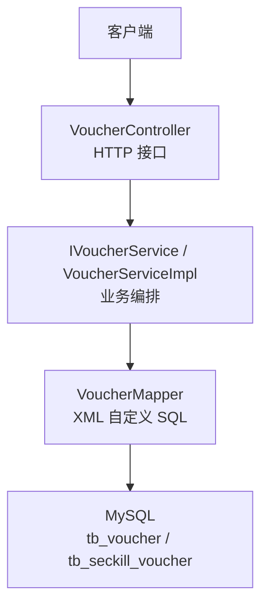
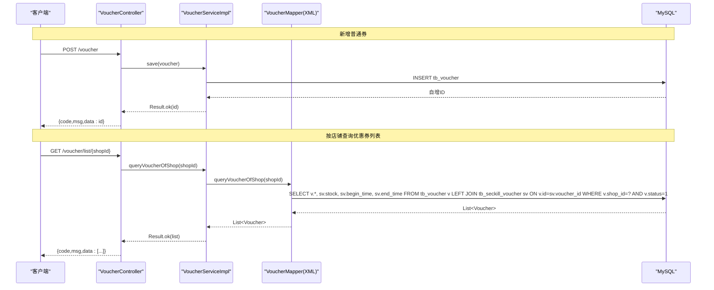
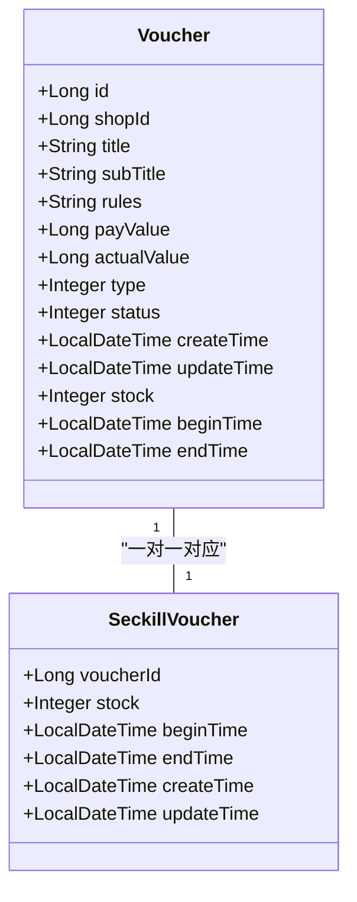
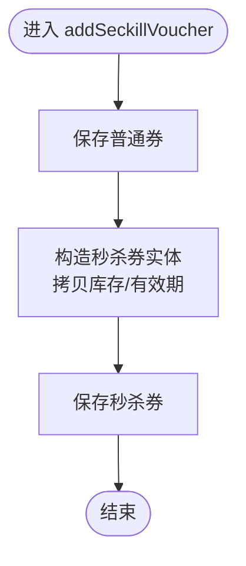
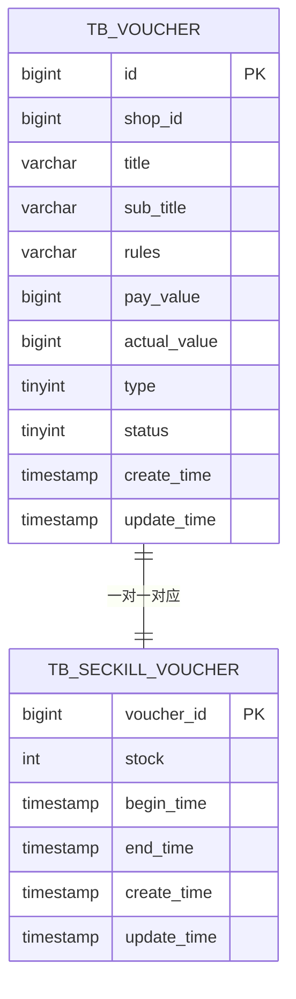
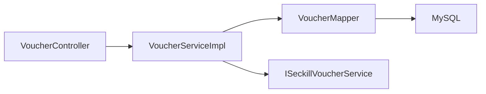

# 普通券管理

<cite>
**本文引用的文件**   
- [VoucherController.java](file://src/main/java/com/hmdp/controller/VoucherController.java)
- [IVoucherService.java](file://src/main/java/com/hmdp/service/IVoucherService.java)
- [VoucherServiceImpl.java](file://src/main/java/com/hmdp/service/impl/VoucherServiceImpl.java)
- [VoucherMapper.java](file://src/main/java/com/hmdp/mapper/VoucherMapper.java)
- [VoucherMapper.xml](file://src/main/resources/mapper/VoucherMapper.xml)
- [Voucher.java](file://src/main/java/com/hmdp/entity/Voucher.java)
- [SeckillVoucher.java](file://src/main/java/com/hmdp/entity/SeckillVoucher.java)
- [ISeckillVoucherService.java](file://src/main/java/com/hmdp/service/ISeckillVoucherService.java)
- [SeckillVoucherServiceImpl.java](file://src/main/java/com/hmdp/service/impl/SeckillVoucherServiceImpl.java)
- [hmdp.sql](file://src/main/resources/db/hmdp.sql)
</cite>

## 目录
1. [简介](#简介)
2. [项目结构](#项目结构)
3. [核心组件](#核心组件)
4. [架构总览](#架构总览)
5. [详细组件分析](#详细组件分析)
6. [依赖关系分析](#依赖关系分析)
7. [性能与优化](#性能与优化)
8. [故障排查指南](#故障排查指南)
9. [结论](#结论)
10. [附录：API 参考与示例](#附录api-参考与示例)

## 简介
本技术文档聚焦“普通券管理”功能，围绕优惠券的创建、查询、列表展示等核心流程展开，详细说明实体设计、业务规则、数据流转、接口契约以及数据库表结构与索引策略。同时给出常见问题（并发更新、数据一致性）的解决思路与最佳实践建议。

## 项目结构
与普通券相关的代码分布在控制器、服务、映射器、实体与 SQL 脚本中，采用典型的分层架构：
- 控制器层：对外暴露 HTTP 接口
- 服务层：封装业务逻辑与事务边界
- 持久层：MyBatis-Plus + XML 自定义 SQL
- 实体层：领域模型与数据库字段映射
- 资源层：SQL 建库脚本与 Mapper XML

图表来源
- [VoucherController.java:1-58](file://src/main/java/com/hmdp/controller/VoucherController.java#L1-L58)
- [IVoucherService.java:1-21](file://src/main/java/com/hmdp/service/IVoucherService.java#L1-L21)
- [VoucherServiceImpl.java:1-52](file://src/main/java/com/hmdp/service/impl/VoucherServiceImpl.java#L1-L52)
- [VoucherMapper.java:1-21](file://src/main/java/com/hmdp/mapper/VoucherMapper.java#L1-L21)
- [VoucherMapper.xml:1-14](file://src/main/resources/mapper/VoucherMapper.xml#L1-L14)
- [hmdp.sql:1239-1255](file://src/main/resources/db/hmdp.sql#L1239-L1255)

章节来源
- [VoucherController.java:1-58](file://src/main/java/com/hmdp/controller/VoucherController.java#L1-L58)
- [IVoucherService.java:1-21](file://src/main/java/com/hmdp/service/IVoucherService.java#L1-L21)
- [VoucherServiceImpl.java:1-52](file://src/main/java/com/hmdp/service/impl/VoucherServiceImpl.java#L1-L52)
- [VoucherMapper.java:1-21](file://src/main/java/com/hmdp/mapper/VoucherMapper.java#L1-L21)
- [VoucherMapper.xml:1-14](file://src/main/resources/mapper/VoucherMapper.xml#L1-L14)
- [hmdp.sql:1239-1255](file://src/main/resources/db/hmdp.sql#L1239-L1255)

## 核心组件
- 控制器：提供新增普通券、新增秒杀券、按店铺查询优惠券列表三个接口
- 服务：实现新增秒杀券的事务性写入；按店铺查询返回包含库存与有效期的聚合结果
- 映射器：通过 XML 定义按店铺查询的 JOIN 语句，关联普通券与秒杀券信息
- 实体：普通券与秒杀券两个实体分别对应两张表，并承载状态、有效期、库存等语义

章节来源
- [VoucherController.java:1-58](file://src/main/java/com/hmdp/controller/VoucherController.java#L1-L58)
- [IVoucherService.java:1-21](file://src/main/java/com/hmdp/service/IVoucherService.java#L1-L21)
- [VoucherServiceImpl.java:1-52](file://src/main/java/com/hmdp/service/impl/VoucherServiceImpl.java#L1-L52)
- [VoucherMapper.java:1-21](file://src/main/java/com/hmdp/mapper/VoucherMapper.java#L1-L21)
- [VoucherMapper.xml:1-14](file://src/main/resources/mapper/VoucherMapper.xml#L1-L14)
- [Voucher.java:1-106](file://src/main/java/com/hmdp/entity/Voucher.java#L1-L106)
- [SeckillVoucher.java:1-62](file://src/main/java/com/hmdp/entity/SeckillVoucher.java#L1-L62)

## 架构总览
下图展示了从请求到数据库的完整调用链，包括普通券创建与按店铺查询的数据流。

图表来源
- [VoucherController.java:26-56](file://src/main/java/com/hmdp/controller/VoucherController.java#L26-L56)
- [VoucherServiceImpl.java:30-36](file://src/main/java/com/hmdp/service/impl/VoucherServiceImpl.java#L30-L36)
- [VoucherMapper.xml:5-12](file://src/main/resources/mapper/VoucherMapper.xml#L5-L12)
- [hmdp.sql:1239-1255](file://src/main/resources/db/hmdp.sql#L1239-L1255)
- [hmdp.sql:85-96](file://src/main/resources/db/hmdp.sql#L85-L96)

## 详细组件分析

### 实体设计与业务规则
- 普通券实体（Voucher）
  - 关键字段：主键、商铺ID、标题、副标题、使用规则、支付金额、抵扣金额、类型、状态、创建时间、更新时间
  - 非持久化字段：库存、生效时间、失效时间（用于展示秒杀券的库存与有效期）
  - 业务规则：
    - 类型区分普通券与秒杀券
    - 状态控制上架/下架/过期
    - 支付金额与抵扣金额以分为单位存储
- 秒杀券实体（SeckillVoucher）
  - 与普通券一对一关系，主键为 voucher_id
  - 记录库存、生效时间、失效时间等秒杀相关属性

图表来源
- [Voucher.java:1-106](file://src/main/java/com/hmdp/entity/Voucher.java#L1-L106)
- [SeckillVoucher.java:1-62](file://src/main/java/com/hmdp/entity/SeckillVoucher.java#L1-L62)

章节来源
- [Voucher.java:1-106](file://src/main/java/com/hmdp/entity/Voucher.java#L1-L106)
- [SeckillVoucher.java:1-62](file://src/main/java/com/hmdp/entity/SeckillVoucher.java#L1-L62)

### 控制器接口设计
- 新增普通券
  - 路径：POST /voucher
  - 入参：Voucher 对象
  - 出参：Result.ok(新券ID)
- 新增秒杀券
  - 路径：POST /voucher/seckill
  - 入参：Voucher 对象（含库存与有效期）
  - 行为：在事务内保存普通券与秒杀券
  - 出参：Result.ok(新券ID)
- 查询店铺优惠券列表
  - 路径：GET /voucher/list/{shopId}
  - 行为：仅返回状态为上架的券，并附带库存与有效期（若为秒杀券）
  - 出参：Result.ok(List<Voucher>)

章节来源
- [VoucherController.java:26-56](file://src/main/java/com/hmdp/controller/VoucherController.java#L26-L56)

### 服务层业务逻辑
- 新增秒杀券（事务）
  - 先插入普通券，再根据普通券ID插入秒杀券记录
  - 使用事务保证两表写入的一致性
- 按店铺查询
  - 调用自定义 SQL，LEFT JOIN 秒杀券表，返回包含库存与有效期的券列表

图表来源
- [VoucherServiceImpl.java:38-50](file://src/main/java/com/hmdp/service/impl/VoucherServiceImpl.java#L38-L50)

章节来源
- [VoucherServiceImpl.java:38-50](file://src/main/java/com/hmdp/service/impl/VoucherServiceImpl.java#L38-L50)

### 数据访问与 SQL 设计
- 自定义查询：按店铺获取优惠券列表
  - 条件：v.shop_id = #{shopId} 且 v.status = 1
  - 关联：LEFT JOIN tb_seckill_voucher sv ON v.id = sv.voucher_id
  - 输出：普通券基础字段 + 秒杀券的 stock、begin_time、end_time

图表来源
- [hmdp.sql:1239-1255](file://src/main/resources/db/hmdp.sql#L1239-L1255)
- [hmdp.sql:85-96](file://src/main/resources/db/hmdp.sql#L85-L96)
- [VoucherMapper.xml:5-12](file://src/main/resources/mapper/VoucherMapper.xml#L5-L12)

章节来源
- [VoucherMapper.java:17-19](file://src/main/java/com/hmdp/mapper/VoucherMapper.java#L17-L19)
- [VoucherMapper.xml:5-12](file://src/main/resources/mapper/VoucherMapper.xml#L5-L12)
- [hmdp.sql:1239-1255](file://src/main/resources/db/hmdp.sql#L1239-L1255)
- [hmdp.sql:85-96](file://src/main/resources/db/hmdp.sql#L85-L96)

## 依赖关系分析
- 控制器依赖服务接口
- 服务实现依赖 MyBatis-Plus BaseMapper 与自定义 Mapper
- 自定义 SQL 依赖 MySQL 表结构
- 秒杀券服务独立存在，但被普通券服务在事务中调用

图表来源
- [VoucherController.java:23-24](file://src/main/java/com/hmdp/controller/VoucherController.java#L23-L24)
- [VoucherServiceImpl.java:24-28](file://src/main/java/com/hmdp/service/impl/VoucherServiceImpl.java#L24-L28)
- [VoucherMapper.java:17-19](file://src/main/java/com/hmdp/mapper/VoucherMapper.java#L17-L19)

章节来源
- [VoucherController.java:23-24](file://src/main/java/com/hmdp/controller/VoucherController.java#L23-L24)
- [VoucherServiceImpl.java:24-28](file://src/main/java/com/hmdp/service/impl/VoucherServiceImpl.java#L24-L28)
- [VoucherMapper.java:17-19](file://src/main/java/com/hmdp/mapper/VoucherMapper.java#L17-L19)

## 性能与优化
- 查询优化
  - 当前查询已限定 shop_id 与 status=1，建议在 tb_voucher 上建立 (shop_id, status) 联合索引以提升过滤效率
  - 对 tb_seckill_voucher.voucher_id 已有主键索引，JOIN 性能良好
- 读写分离与缓存
  - 列表查询可考虑引入 Redis 缓存，按 shopId 维度缓存结果，设置合理过期时间
  - 写多读少场景下，避免频繁刷新缓存
- 批量操作
  - 后台导入或初始化时可使用批量插入减少往返开销
- 连接池与慢查询
  - 监控慢查询日志，关注 LEFT JOIN 的执行计划，必要时调整索引或拆分查询

[本节为通用性能建议，不直接分析具体文件]

## 故障排查指南
- 新增秒杀券失败
  - 检查事务是否回滚，确认普通券插入成功后再插入秒杀券
  - 校验传入的库存与有效期是否为空或非法值
- 列表查询为空
  - 确认 shopId 是否正确
  - 确认券的 status 是否为上架状态
  - 检查是否存在对应的秒杀券记录（若无则为普通券，stock 可能为 null）
- 库存与有效期不一致
  - 确认秒杀券记录的 begin_time/end_time 是否与业务预期一致
  - 注意前端展示时对 null 的处理

章节来源
- [VoucherServiceImpl.java:38-50](file://src/main/java/com/hmdp/service/impl/VoucherServiceImpl.java#L38-L50)
- [VoucherMapper.xml:5-12](file://src/main/resources/mapper/VoucherMapper.xml#L5-L12)

## 结论
普通券管理模块采用清晰的分层架构，结合 MyBatis-Plus 与自定义 SQL 实现了灵活的查询能力。通过事务保障秒杀券创建的原子性，并通过 LEFT JOIN 将库存与有效期聚合至统一 VO 返回。后续可在索引、缓存与幂等性方面进一步优化，提升高并发下的稳定性与性能。

[本节为总结性内容，不直接分析具体文件]

## 附录：API 参考与示例

### 接口清单
- 新增普通券
  - 方法：POST
  - 路径：/voucher
  - 请求体：Voucher 对象
  - 响应：Result.ok(新券ID)
- 新增秒杀券
  - 方法：POST
  - 路径：/voucher/seckill
  - 请求体：Voucher 对象（需包含库存与有效期）
  - 响应：Result.ok(新券ID)
- 查询店铺优惠券列表
  - 方法：GET
  - 路径：/voucher/list/{shopId}
  - 路径参数：shopId
  - 响应：Result.ok(List<Voucher>)

章节来源
- [VoucherController.java:26-56](file://src/main/java/com/hmdp/controller/VoucherController.java#L26-L56)

### 调用示例（说明）
- 新增普通券
  - 请求示例：提交包含标题、副标题、规则、支付金额、抵扣金额、类型、状态的 JSON
  - 成功响应：返回新券 ID
- 新增秒杀券
  - 请求示例：除普通券字段外，还需包含库存与生效/失效时间
  - 成功响应：返回新券 ID
- 查询店铺优惠券列表
  - 请求示例：GET /voucher/list/1
  - 成功响应：返回该店铺上架的券列表，秒杀券附带库存与有效期

[本节为接口使用说明，不直接分析具体文件]