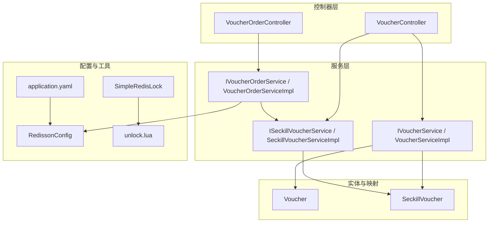
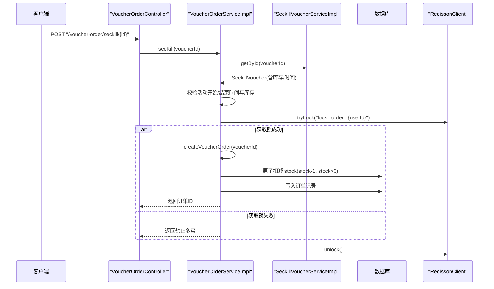
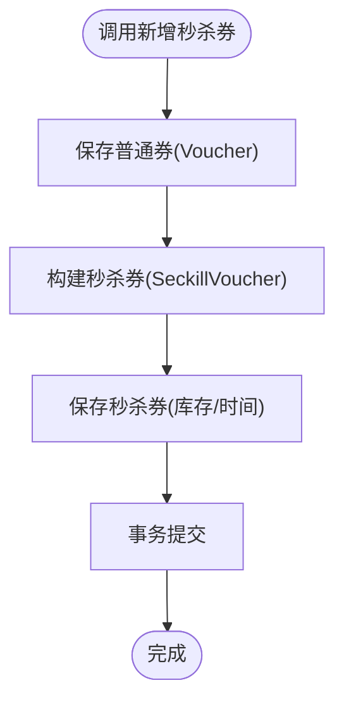
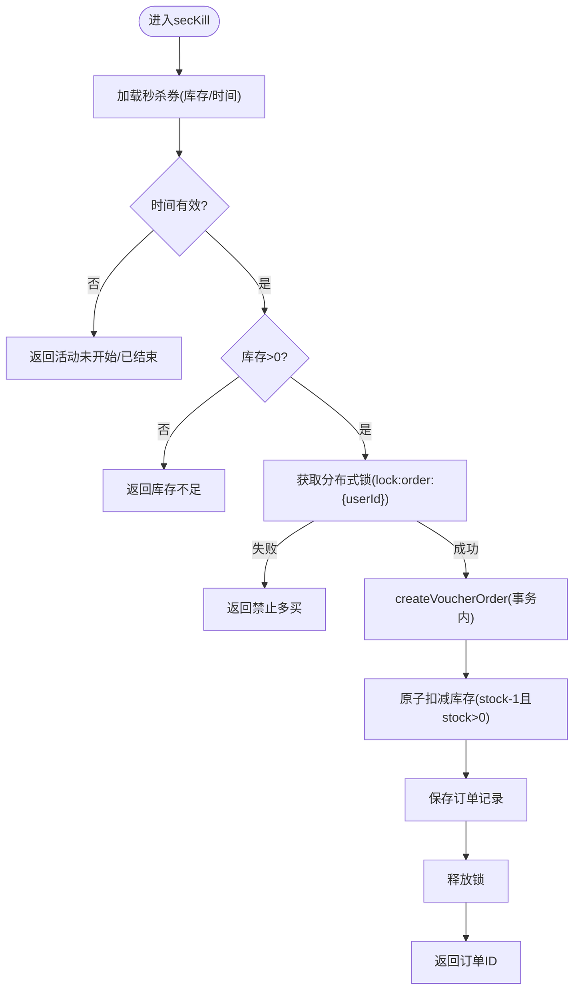
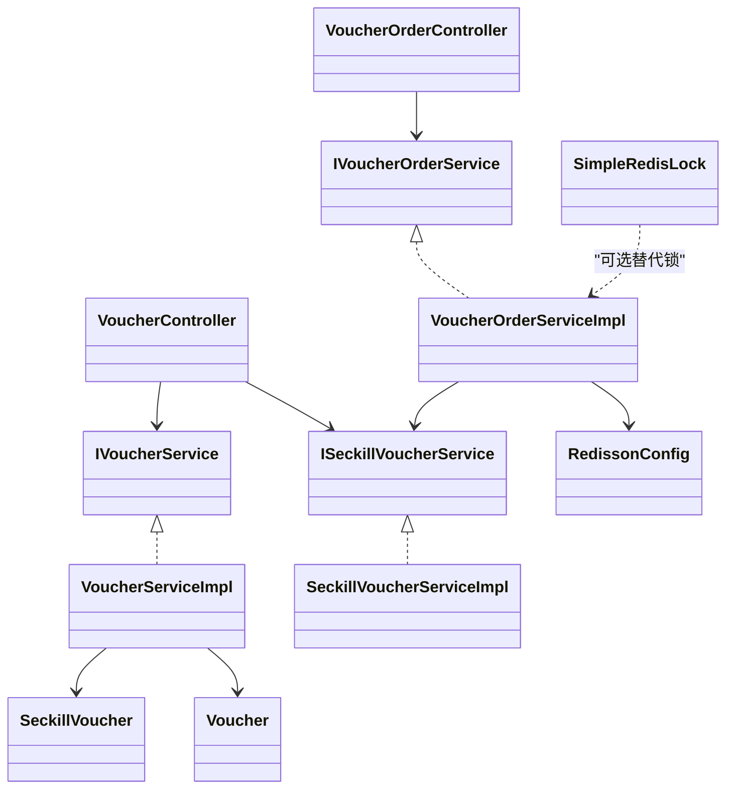
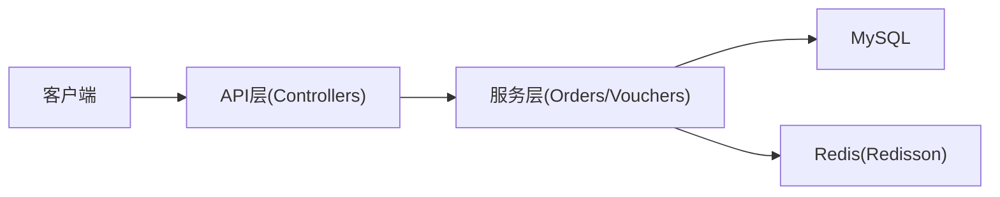

# 秒杀券系统

<cite>
**本文引用的文件**   
- [SeckillVoucher.java](file://src/main/java/com/hmdp/entity/SeckillVoucher.java)
- [Voucher.java](file://src/main/java/com/hmdp/entity/Voucher.java)
- [ISeckillVoucherService.java](file://src/main/java/com/hmdp/service/ISeckillVoucherService.java)
- [SeckillVoucherServiceImpl.java](file://src/main/java/com/hmdp/service/impl/SeckillVoucherServiceImpl.java)
- [IVoucherService.java](file://src/main/java/com/hmdp/service/IVoucherService.java)
- [VoucherServiceImpl.java](file://src/main/java/com/hmdp/service/impl/VoucherServiceImpl.java)
- [VoucherController.java](file://src/main/java/com/hmdp/controller/VoucherController.java)
- [VoucherOrderController.java](file://src/main/java/com/hmdp/controller/VoucherOrderController.java)
- [IVoucherOrderService.java](file://src/main/java/com/hmdp/service/IVoucherOrderService.java)
- [VoucherOrderServiceImpl.java](file://src/main/java/com/hmdp/service/impl/VoucherOrderServiceImpl.java)
- [RedissonConfig.java](file://src/main/java/com/hmdp/config/RedissonConfig.java)
- [SimpleRedisLock.java](file://src/main/java/com/hmdp/utils/SimpleRedisLock.java)
- [unlock.lua](file://src/main/resources/unlock.lua)
- [application.yaml](file://src/main/resources/application.yaml)
</cite>

## 目录
1. [简介](#简介)
2. [项目结构](#项目结构)
3. [核心组件](#核心组件)
4. [架构总览](#架构总览)
5. [详细组件分析](#详细组件分析)
6. [依赖关系分析](#依赖关系分析)
7. [性能与高并发优化](#性能与高并发优化)
8. [故障排查指南](#故障排查指南)
9. [结论](#结论)
10. [附录](#附录)

## 简介
本技术文档围绕“秒杀券系统”展开，重点解释秒杀券与普通券的差异、实体设计要点、高并发下单流程、库存预减与原子扣减、分布式锁实现原理（含 Redisson 与 Lua 脚本）、时间窗口控制、超卖防护策略，以及缓存预热、限流降级、监控指标等工程化方案。文档同时给出关键流程图与类图，帮助读者快速理解并落地实施。

## 项目结构
本项目采用分层架构：控制器层负责路由与参数校验；服务层封装业务逻辑；数据访问层基于 MyBatis-Plus；配置层提供 Redisson 客户端与全局异常处理；工具层包含自定义分布式锁与通用常量。



图表来源
- [VoucherController.java:1-58](file://src/main/java/com/hmdp/controller/VoucherController.java#L1-L58)
- [VoucherOrderController.java:1-34](file://src/main/java/com/hmdp/controller/VoucherOrderController.java#L1-L34)
- [IVoucherService.java:1-21](file://src/main/java/com/hmdp/service/IVoucherService.java#L1-L21)
- [VoucherServiceImpl.java:1-52](file://src/main/java/com/hmdp/service/impl/VoucherServiceImpl.java#L1-L52)
- [ISeckillVoucherService.java:1-19](file://src/main/java/com/hmdp/service/ISeckillVoucherService.java#L1-L19)
- [SeckillVoucherServiceImpl.java:1-22](file://src/main/java/com/hmdp/service/impl/SeckillVoucherServiceImpl.java#L1-L22)
- [IVoucherOrderService.java:1-19](file://src/main/java/com/hmdp/service/IVoucherOrderService.java#L1-L19)
- [VoucherOrderServiceImpl.java:1-105](file://src/main/java/com/hmdp/service/impl/VoucherOrderServiceImpl.java#L1-L105)
- [RedissonConfig.java:1-18](file://src/main/java/com/hmdp/config/RedissonConfig.java#L1-L18)
- [SimpleRedisLock.java:1-56](file://src/main/java/com/hmdp/utils/SimpleRedisLock.java#L1-L56)
- [unlock.lua:1-5](file://src/main/resources/unlock.lua#L1-L5)
- [application.yaml:1-28](file://src/main/resources/application.yaml#L1-L28)

章节来源
- [VoucherController.java:1-58](file://src/main/java/com/hmdp/controller/VoucherController.java#L1-L58)
- [VoucherOrderController.java:1-34](file://src/main/java/com/hmdp/controller/VoucherOrderController.java#L1-L34)
- [VoucherServiceImpl.java:1-52](file://src/main/java/com/hmdp/service/impl/VoucherServiceImpl.java#L1-L52)
- [VoucherOrderServiceImpl.java:1-105](file://src/main/java/com/hmdp/service/impl/VoucherOrderServiceImpl.java#L1-L105)
- [RedissonConfig.java:1-18](file://src/main/java/com/hmdp/config/RedissonConfig.java#L1-L18)
- [SimpleRedisLock.java:1-56](file://src/main/java/com/hmdp/utils/SimpleRedisLock.java#L1-L56)
- [unlock.lua:1-5](file://src/main/resources/unlock.lua#L1-L5)
- [application.yaml:1-28](file://src/main/resources/application.yaml#L1-L28)

## 核心组件
- 普通券与秒杀券差异
  - 普通券：由 Voucher 描述，无独立库存字段，通常用于常规发放与领取。
  - 秒杀券：通过 SeckillVoucher 与 Voucher 一对一关联，额外维护 stock、beginTime、endTime 等秒杀属性，强调限时限量与高并发安全。
- 秒杀券实体设计
  - 关键字段包括：关联的优惠券 id、库存、创建/生效/失效/更新时间。
  - 该设计将“券元信息”和“秒杀库存与时间窗”解耦，便于复用券基础能力并扩展秒杀特性。
- 秒杀下单入口
  - 控制器暴露新增普通券、新增秒杀券、查询店铺券列表、秒杀下单接口。
  - 秒杀下单路径最终进入订单服务，进行时间窗口校验、防重与库存扣减。

章节来源
- [Voucher.java:1-106](file://src/main/java/com/hmdp/entity/Voucher.java#L1-L106)
- [SeckillVoucher.java:1-62](file://src/main/java/com/hmdp/entity/SeckillVoucher.java#L1-L62)
- [VoucherController.java:1-58](file://src/main/java/com/hmdp/controller/VoucherController.java#L1-L58)
- [VoucherOrderController.java:1-34](file://src/main/java/com/hmdp/controller/VoucherOrderController.java#L1-L34)

## 架构总览
下图展示从请求进入到落库的关键交互，突出分布式锁与数据库原子更新的使用位置。



图表来源
- [VoucherOrderController.java:1-34](file://src/main/java/com/hmdp/controller/VoucherOrderController.java#L1-L34)
- [VoucherOrderServiceImpl.java:1-105](file://src/main/java/com/hmdp/service/impl/VoucherOrderServiceImpl.java#L1-L105)
- [SeckillVoucherServiceImpl.java:1-22](file://src/main/java/com/hmdp/service/impl/SeckillVoucherServiceImpl.java#L1-L22)
- [RedissonConfig.java:1-18](file://src/main/java/com/hmdp/config/RedissonConfig.java#L1-L18)

## 详细组件分析

### 秒杀券与普通券对比
- 普通券（Voucher）
  - 主要承载券的基础信息与状态，不包含独立的库存字段。
- 秒杀券（SeckillVoucher）
  - 与 Voucher 一对一绑定，增加 stock、beginTime、endTime 等字段，支撑限时限量抢购。
- 业务影响
  - 秒杀场景需对库存与时间进行强一致性保障，普通券无需此约束。

章节来源
- [Voucher.java:1-106](file://src/main/java/com/hmdp/entity/Voucher.java#L1-L106)
- [SeckillVoucher.java:1-62](file://src/main/java/com/hmdp/entity/SeckillVoucher.java#L1-L62)

### 秒杀券创建流程
- 入口：新增秒杀券接口接收券信息，内部保存券与秒杀信息到两张表，保证事务一致性。
- 关键点
  - 券主表与秒杀表在同一事务中写入，避免数据不一致。
  - 秒杀库存初始值来源于传入的券库存字段。



图表来源
- [VoucherController.java:1-58](file://src/main/java/com/hmdp/controller/VoucherController.java#L1-L58)
- [VoucherServiceImpl.java:1-52](file://src/main/java/com/hmdp/service/impl/VoucherServiceImpl.java#L1-L52)

章节来源
- [VoucherController.java:1-58](file://src/main/java/com/hmdp/controller/VoucherController.java#L1-L58)
- [VoucherServiceImpl.java:1-52](file://src/main/java/com/hmdp/service/impl/VoucherServiceImpl.java#L1-L52)

### 高并发下单与库存扣减
- 时间窗口控制
  - 在下单前检查当前时间是否在 beginTime 与 endTime 之间，否则直接拒绝。
- 防重与限流
  - 使用分布式锁按用户维度加锁，防止同一用户重复下单。
  - 下单成功后再次校验是否已存在同券同用户的订单，避免幂等问题。
- 库存扣减原子性
  - 使用数据库条件更新：stock = stock - 1 AND stock > 0，确保并发下不会超卖。
- 事务边界
  - 扣减库存与写订单置于同一事务，保证数据一致性。



图表来源
- [VoucherOrderController.java:1-34](file://src/main/java/com/hmdp/controller/VoucherOrderController.java#L1-L34)
- [VoucherOrderServiceImpl.java:1-105](file://src/main/java/com/hmdp/service/impl/VoucherOrderServiceImpl.java#L1-L105)

章节来源
- [VoucherOrderServiceImpl.java:1-105](file://src/main/java/com/hmdp/service/impl/VoucherOrderServiceImpl.java#L1-L105)

### 分布式锁实现原理
- Redisson 客户端
  - 通过配置类初始化 RedissonClient，连接 Redis 实例。
- 锁粒度与键空间
  - 以“lock:order:{userId}”为锁键，保证同一用户并发下单串行化。
- 解锁机制
  - 代码中使用 Redisson 提供的 unlock 方法；同时项目中提供了基于 Lua 脚本的简单锁实现（SimpleRedisLock），其解锁脚本位于 unlock.lua，具备原子判断与删除能力。
- 适用建议
  - 秒杀下单建议使用 Redisson 的看门狗与可重入锁特性，提升可靠性；若使用自研锁，务必保证解锁脚本的原子性与超时设置合理。

```mermaid
classDiagram
class RedissonConfig {
+redissonClient() RedissonClient
}
class SimpleRedisLock {
-name String
-redisTemplate StringRedisTemplate
+tryLock(timeOut) Boolean
+unlock() void
}
class LuaScript {
<<script>>
"unlock.lua"
}
RedissonConfig --> RedissonClient : "创建客户端"
SimpleRedisLock --> LuaScript : "执行解锁脚本"
```

图表来源
- [RedissonConfig.java:1-18](file://src/main/java/com/hmdp/config/RedissonConfig.java#L1-L18)
- [SimpleRedisLock.java:1-56](file://src/main/java/com/hmdp/utils/SimpleRedisLock.java#L1-L56)
- [unlock.lua:1-5](file://src/main/resources/unlock.lua#L1-L5)

章节来源
- [RedissonConfig.java:1-18](file://src/main/java/com/hmdp/config/RedissonConfig.java#L1-L18)
- [SimpleRedisLock.java:1-56](file://src/main/java/com/hmdp/utils/SimpleRedisLock.java#L1-L56)
- [unlock.lua:1-5](file://src/main/resources/unlock.lua#L1-L5)

### 类关系概览


图表来源
- [VoucherController.java:1-58](file://src/main/java/com/hmdp/controller/VoucherController.java#L1-L58)
- [VoucherOrderController.java:1-34](file://src/main/java/com/hmdp/controller/VoucherOrderController.java#L1-L34)
- [IVoucherService.java:1-21](file://src/main/java/com/hmdp/service/IVoucherService.java#L1-L21)
- [VoucherServiceImpl.java:1-52](file://src/main/java/com/hmdp/service/impl/VoucherServiceImpl.java#L1-L52)
- [ISeckillVoucherService.java:1-19](file://src/main/java/com/hmdp/service/ISeckillVoucherService.java#L1-L19)
- [SeckillVoucherServiceImpl.java:1-22](file://src/main/java/com/hmdp/service/impl/SeckillVoucherServiceImpl.java#L1-L22)
- [IVoucherOrderService.java:1-19](file://src/main/java/com/hmdp/service/IVoucherOrderService.java#L1-L19)
- [VoucherOrderServiceImpl.java:1-105](file://src/main/java/com/hmdp/service/impl/VoucherOrderServiceImpl.java#L1-L105)
- [RedissonConfig.java:1-18](file://src/main/java/com/hmdp/config/RedissonConfig.java#L1-L18)
- [SimpleRedisLock.java:1-56](file://src/main/java/com/hmdp/utils/SimpleRedisLock.java#L1-L56)
- [Voucher.java:1-106](file://src/main/java/com/hmdp/entity/Voucher.java#L1-L106)
- [SeckillVoucher.java:1-62](file://src/main/java/com/hmdp/entity/SeckillVoucher.java#L1-L62)

## 依赖关系分析
- 外部依赖
  - Redis：用于分布式锁与可能的缓存（当前下单路径未直接使用缓存）。
  - MySQL：持久化券与订单数据。
  - Redisson：提供分布式锁客户端。
- 模块耦合
  - 订单服务依赖秒杀券服务读取库存与时间；秒杀券服务仅做基础 CRUD。
  - 控制器与服务层职责清晰，遵循典型分层模式。
- 潜在风险
  - 当前下单路径未引入 Redis 缓存预热与 Lua 原子扣减，热点券在高并发下压力集中在数据库。
  - 锁键空间与过期时间需结合业务评估，避免死锁或锁冲突。



图表来源
- [application.yaml:1-28](file://src/main/resources/application.yaml#L1-L28)
- [RedissonConfig.java:1-18](file://src/main/java/com/hmdp/config/RedissonConfig.java#L1-L18)

章节来源
- [application.yaml:1-28](file://src/main/resources/application.yaml#L1-L28)

## 性能与高并发优化
- 缓存预热
  - 建议在活动开始前将秒杀券库存与时间预热至 Redis，下单时优先读缓存，减少数据库压力。
- 原子扣减
  - 使用 Lua 脚本在 Redis 中执行“检查库存+预扣减”，再异步落库，降低热点行竞争。
- 分布式锁
  - 使用 Redisson 的可重入锁与看门狗，避免锁过期导致的数据不一致；锁粒度建议细化到“券+用户”。
- 限流与降级
  - 网关层或服务层增加令牌桶/漏桶限流；当后端不可用时快速失败或返回排队提示。
- 幂等与去重
  - 订单号唯一（如雪花算法），并在数据库建立唯一索引；下单前查询是否已存在同券同用户订单。
- 监控指标
  - 关注 QPS、P99 延迟、错误率、库存剩余、锁等待时长、Lua 执行耗时、数据库慢查询等。
- 雪崩防护
  - 缓存键设置随机过期时间；热点资源采用本地缓存+多级缓存；数据库侧分库分表与读写分离。

[本节为通用优化建议，不直接分析具体文件]

## 故障排查指南
- 常见问题定位
  - 活动未开始/已结束：检查 SeckillVoucher 的时间字段与系统时钟同步。
  - 库存不足：确认数据库 stock 字段与并发扣减逻辑是否正确。
  - 重复下单：检查分布式锁键空间与幂等校验是否生效。
  - 锁无法释放：核对解锁脚本与锁持有者标识是否一致。
- 日志与追踪
  - 开启应用 debug 日志，记录关键步骤（加锁、扣减、落库）与异常堆栈。
- 回滚与补偿
  - 若出现部分成功，可通过订单状态机与定时任务进行对账与补偿。

章节来源
- [VoucherOrderServiceImpl.java:1-105](file://src/main/java/com/hmdp/service/impl/VoucherOrderServiceImpl.java#L1-L105)
- [SimpleRedisLock.java:1-56](file://src/main/java/com/hmdp/utils/SimpleRedisLock.java#L1-L56)
- [unlock.lua:1-5](file://src/main/resources/unlock.lua#L1-L5)

## 结论
本系统在秒杀券与普通券的模型设计上实现了关注点分离，下单流程通过时间窗口校验、分布式锁与数据库原子更新共同保障高并发下的正确性。为进一步应对极端流量，建议引入 Redis 缓存预热与 Lua 原子预扣减、完善限流降级与监控告警体系，从而全面提升系统的稳定性与吞吐能力。

## 附录
- 关键配置
  - Redis 连接与池化参数、Jackson 序列化策略、MyBatis-Plus 别名扫描等均在 application.yaml 中配置。
- 相关接口
  - 新增普通券、新增秒杀券、查询店铺券列表、秒杀下单。

章节来源
- [application.yaml:1-28](file://src/main/resources/application.yaml#L1-L28)
- [VoucherController.java:1-58](file://src/main/java/com/hmdp/controller/VoucherController.java#L1-L58)
- [VoucherOrderController.java:1-34](file://src/main/java/com/hmdp/controller/VoucherOrderController.java#L1-L34)