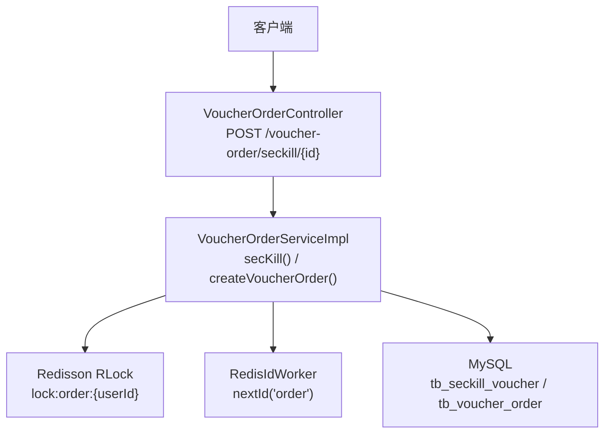
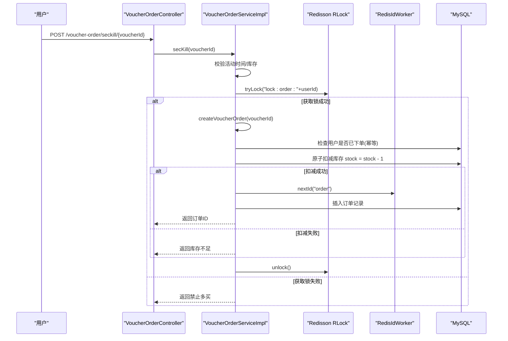
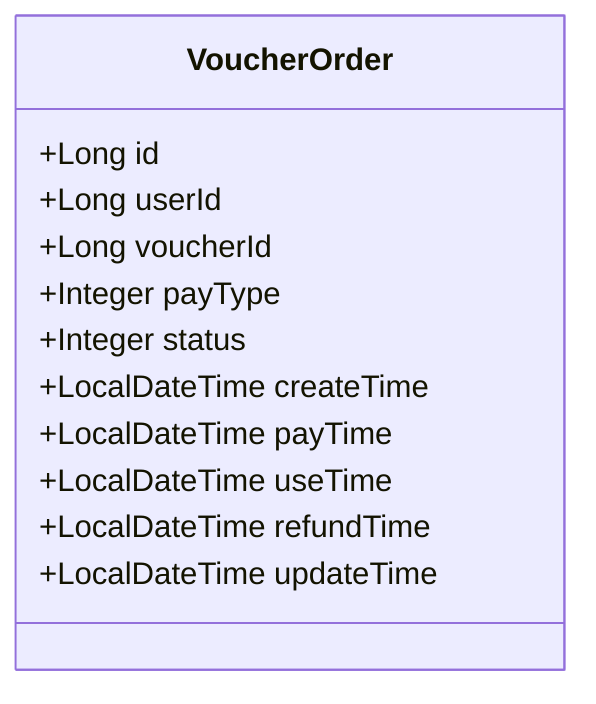
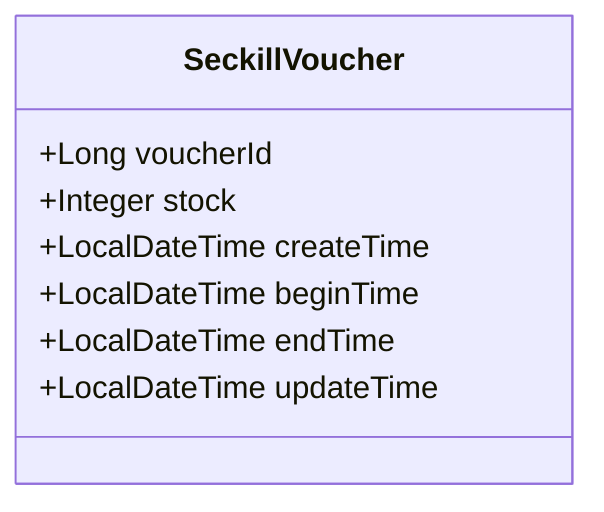
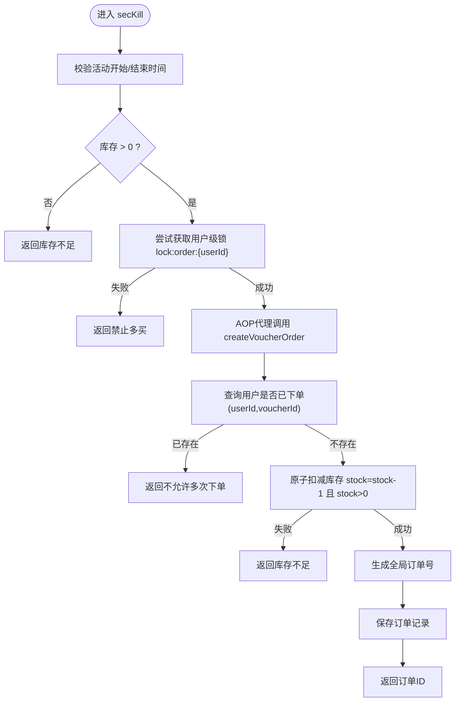
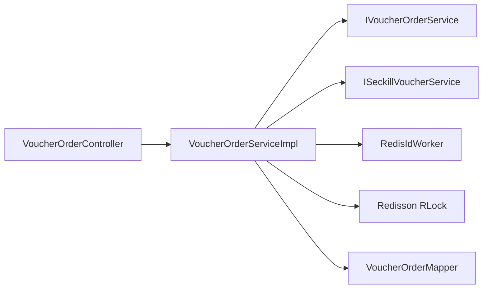

# 秒杀订单处理

<cite>
**本文引用的文件列表**
- [VoucherOrderController.java](file://src/main/java/com/hmdp/controller/VoucherOrderController.java)
- [IVoucherOrderService.java](file://src/main/java/com/hmdp/service/IVoucherOrderService.java)
- [VoucherOrderServiceImpl.java](file://src/main/java/com/hmdp/service/impl/VoucherOrderServiceImpl.java)
- [VoucherOrderMapper.java](file://src/main/java/com/hmdp/mapper/VoucherOrderMapper.java)
- [VoucherOrder.java](file://src/main/java/com/hmdp/entity/VoucherOrder.java)
- [SeckillVoucher.java](file://src/main/java/com/hmdp/entity/SeckillVoucher.java)
- [ISeckillVoucherService.java](file://src/main/java/com/hmdp/service/ISeckillVoucherService.java)
- [SeckillVoucherServiceImpl.java](file://src/main/java/com/hmdp/service/impl/SeckillVoucherServiceImpl.java)
- [RedisIdWorker.java](file://src/main/java/com/hmdp/utils/RedisIdWorker.java)
- [SimpleRedisLock.java](file://src/main/java/com/hmdp/utils/SimpleRedisLock.java)
- [unlock.lua](file://src/main/resources/unlock.lua)
- [RedissonConfig.java](file://src/main/java/com/hmdp/config/RedissonConfig.java)
- [hmdp.sql](file://src/main/resources/db/hmdp.sql)
</cite>

## 目录
1. [简介](#简介)
2. [项目结构](#项目结构)
3. [核心组件](#核心组件)
4. [架构总览](#架构总览)
5. [详细组件分析](#详细组件分析)
6. [依赖关系分析](#依赖关系分析)
7. [性能与高并发优化](#性能与高并发优化)
8. [故障排查指南](#故障排查指南)
9. [结论](#结论)
10. [附录](#附录)

## 简介
本技术文档围绕“秒杀订单处理”展开，系统性梳理从用户下单到订单落库的完整流程，重点说明：
- VoucherOrder 实体设计与字段语义
- 订单状态机定义与扩展建议
- 幂等性保证机制（用户维度去重）
- 库存扣减与订单生成的事务一致性
- 防刷与限购策略
- 订单查询、状态同步、超时订单处理的实现思路
- 高并发场景下的锁与分布式ID方案
- 常见问题定位与恢复策略

## 项目结构
本项目采用分层架构：
- Controller 层暴露 HTTP 接口
- Service 层承载业务逻辑（含事务边界）
- Mapper 层对接数据库
- Utils 提供分布式 ID、分布式锁等通用能力
- Config 提供 Redisson 客户端配置
- resources/db 提供数据表结构

图表来源
- [VoucherOrderController.java:23-33](file://src/main/java/com/hmdp/controller/VoucherOrderController.java#L23-L33)
- [VoucherOrderServiceImpl.java:46-103](file://src/main/java/com/hmdp/service/impl/VoucherOrderServiceImpl.java#L46-L103)
- [RedissonConfig.java:10-17](file://src/main/java/com/hmdp/config/RedissonConfig.java#L10-L17)
- [RedisIdWorker.java:21-31](file://src/main/java/com/hmdp/utils/RedisIdWorker.java#L21-L31)
- [hmdp.sql:85-96](file://src/main/resources/db/hmdp.sql#L85-L96)

章节来源
- [VoucherOrderController.java:23-33](file://src/main/java/com/hmdp/controller/VoucherOrderController.java#L23-L33)
- [VoucherOrderServiceImpl.java:46-103](file://src/main/java/com/hmdp/service/impl/VoucherOrderServiceImpl.java#L46-L103)
- [RedissonConfig.java:10-17](file://src/main/java/com/hmdp/config/RedissonConfig.java#L10-L17)
- [RedisIdWorker.java:21-31](file://src/main/java/com/hmdp/utils/RedisIdWorker.java#L21-L31)
- [hmdp.sql:85-96](file://src/main/resources/db/hmdp.sql#L85-L96)

## 核心组件
- 控制器：接收秒杀下单请求，转发至服务层。
- 服务层：实现秒杀下单主流程，包含活动校验、用户维度锁、库存扣减、订单生成与落库。
- 实体：
  - VoucherOrder：订单模型，包含用户、券、支付类型、状态、时间戳等。
  - SeckillVoucher：秒杀券库存与活动时间信息。
- 工具：
  - RedisIdWorker：基于 Redis 的分布式 ID 生成器。
  - SimpleRedisLock：基于 Redis + Lua 的可重入安全解锁实现（当前未在主流程使用）。
  - RedissonClient：分布式锁客户端，用于用户维度串行化下单。
- 配置：Redisson 客户端初始化。

章节来源
- [VoucherOrderController.java:23-33](file://src/main/java/com/hmdp/controller/VoucherOrderController.java#L23-L33)
- [VoucherOrderServiceImpl.java:46-103](file://src/main/java/com/hmdp/service/impl/VoucherOrderServiceImpl.java#L46-L103)
- [VoucherOrder.java:25-81](file://src/main/java/com/hmdp/entity/VoucherOrder.java#L25-L81)
- [SeckillVoucher.java:25-61](file://src/main/java/com/hmdp/entity/SeckillVoucher.java#L25-L61)
- [RedisIdWorker.java:21-31](file://src/main/java/com/hmdp/utils/RedisIdWorker.java#L21-L31)
- [SimpleRedisLock.java:31-44](file://src/main/java/com/hmdp/utils/SimpleRedisLock.java#L31-L44)
- [RedissonConfig.java:10-17](file://src/main/java/com/hmdp/config/RedissonConfig.java#L10-L17)

## 架构总览
下图展示了秒杀下单的关键调用链与资源交互：

图表来源
- [VoucherOrderController.java:23-33](file://src/main/java/com/hmdp/controller/VoucherOrderController.java#L23-L33)
- [VoucherOrderServiceImpl.java:46-103](file://src/main/java/com/hmdp/service/impl/VoucherOrderServiceImpl.java#L46-L103)
- [RedissonConfig.java:10-17](file://src/main/java/com/hmdp/config/RedissonConfig.java#L10-L17)
- [RedisIdWorker.java:21-31](file://src/main/java/com/hmdp/utils/RedisIdWorker.java#L21-L31)
- [hmdp.sql:85-96](file://src/main/resources/db/hmdp.sql#L85-L96)

## 详细组件分析

### 实体设计：VoucherOrder
- 主键 id：由外部分配（分布式 ID），避免自增瓶颈。
- userId：下单用户标识，用于幂等与限购判断。
- voucherId：关联的优惠券/商品标识。
- payType：支付方式枚举（余额/支付宝/微信）。
- status：订单状态（未支付/已支付/已核销/已取消/退款中/已退款）。
- createTime/payTime/useTime/refundTime/updateTime：关键时间戳，便于对账与超时处理。

图表来源
- [VoucherOrder.java:25-81](file://src/main/java/com/hmdp/entity/VoucherOrder.java#L25-L81)

章节来源
- [VoucherOrder.java:25-81](file://src/main/java/com/hmdp/entity/VoucherOrder.java#L25-L81)

### 实体设计：SeckillVoucher
- voucherId：与优惠券一对一。
- stock：剩余库存。
- beginTime/endTime：活动生效时间段。

图表来源
- [SeckillVoucher.java:25-61](file://src/main/java/com/hmdp/entity/SeckillVoucher.java#L25-L61)

章节来源
- [SeckillVoucher.java:25-61](file://src/main/java/com/hmdp/entity/SeckillVoucher.java#L25-L61)

### 控制器：VoucherOrderController
- 暴露 POST /voucher-order/seckill/{id} 接口，将 voucherId 传入服务层。

章节来源
- [VoucherOrderController.java:23-33](file://src/main/java/com/hmdp/controller/VoucherOrderController.java#L23-L33)

### 服务层：VoucherOrderServiceImpl
- secKill(voucherId)：
  - 读取秒杀券信息并校验活动起止时间与库存。
  - 以用户维度加锁（lock:order:{userId}），防止同一用户并发重复下单。
  - 通过 AOP 代理调用 createVoucherOrder，确保事务生效。
- createVoucherOrder(voucherId)：
  - 幂等检查：按 userId + voucherId 统计已有订单数，若大于 0 则拒绝。
  - 原子扣减库存：使用 setSql("stock = stock - 1") 配合 gt("stock", 0) 条件更新，保证超卖防护。
  - 生成全局唯一订单号：调用 RedisIdWorker.nextId("order")。
  - 写入订单记录：保存 VoucherOrder。
  - 返回订单 ID。

图表来源
- [VoucherOrderServiceImpl.java:46-103](file://src/main/java/com/hmdp/service/impl/VoucherOrderServiceImpl.java#L46-L103)

章节来源
- [VoucherOrderServiceImpl.java:46-103](file://src/main/java/com/hmdp/service/impl/VoucherOrderServiceImpl.java#L46-L103)

### 分布式锁：Redisson 与 SimpleRedisLock
- Redisson 客户端在配置类中初始化，服务层使用 RLock 对用户维度进行串行化控制。
- SimpleRedisLock 提供了基于 Redis + Lua 的原子解锁能力（当前未在秒杀主流程使用，可作为备选或扩展点）。

章节来源
- [RedissonConfig.java:10-17](file://src/main/java/com/hmdp/config/RedissonConfig.java#L10-L17)
- [VoucherOrderServiceImpl.java:62-74](file://src/main/java/com/hmdp/service/impl/VoucherOrderServiceImpl.java#L62-L74)
- [SimpleRedisLock.java:31-44](file://src/main/java/com/hmdp/utils/SimpleRedisLock.java#L31-L44)
- [unlock.lua:1-5](file://src/main/resources/unlock.lua#L1-L5)

### 分布式 ID：RedisIdWorker
- 基于 Redis INCR 与时间戳拼接生成全局唯一 ID，前缀为 keyPrefix（如 "order"）。
- 适用于高并发下单场景，避免数据库自增瓶颈。

章节来源
- [RedisIdWorker.java:21-31](file://src/main/java/com/hmdp/utils/RedisIdWorker.java#L21-L31)

### 数据表结构（节选）
- tb_seckill_voucher：存储秒杀券库存与活动时间。
- tb_voucher_order：存储订单明细与状态、时间戳。

章节来源
- [hmdp.sql:85-96](file://src/main/resources/db/hmdp.sql#L85-L96)

## 依赖关系分析
- 控制器依赖服务接口 IVoucherOrderService。
- 服务实现依赖：
  - ISeckillVoucherService（读取秒杀券信息）
  - RedisIdWorker（生成订单号）
  - RedissonClient（分布式锁）
  - MyBatis-Plus BaseMapper（订单持久化）

图表来源
- [VoucherOrderController.java:23-33](file://src/main/java/com/hmdp/controller/VoucherOrderController.java#L23-L33)
- [IVoucherOrderService.java:15-18](file://src/main/java/com/hmdp/service/IVoucherOrderService.java#L15-L18)
- [VoucherOrderServiceImpl.java:33-45](file://src/main/java/com/hmdp/service/impl/VoucherOrderServiceImpl.java#L33-L45)
- [VoucherOrderMapper.java:14-16](file://src/main/java/com/hmdp/mapper/VoucherOrderMapper.java#L14-L16)

章节来源
- [VoucherOrderController.java:23-33](file://src/main/java/com/hmdp/controller/VoucherOrderController.java#L23-L33)
- [IVoucherOrderService.java:15-18](file://src/main/java/com/hmdp/service/IVoucherOrderService.java#L15-L18)
- [VoucherOrderServiceImpl.java:33-45](file://src/main/java/com/hmdp/service/impl/VoucherOrderServiceImpl.java#L33-L45)
- [VoucherOrderMapper.java:14-16](file://src/main/java/com/hmdp/mapper/VoucherOrderMapper.java#L14-L16)

## 性能与高并发优化
- 用户维度串行化：通过 Redisson RLock 锁定用户维度，避免同一用户并发重复下单。
- 原子扣减库存：使用数据库行级条件更新（stock > 0）保障超卖防护。
- 分布式 ID：RedisIdWorker 降低数据库压力，提升写吞吐。
- 事务边界：createVoucherOrder 方法标注事务，确保库存扣减与订单落库的一致性。
- 可扩展方向（建议）：
  - 引入消息队列异步落库，削峰填谷。
  - 预扣库存至 Redis，再异步同步数据库，进一步降低热点行竞争。
  - 分库分表：按 userId 或 voucherId 哈希分片，缓解单表热点。
  - 限流与熔断：网关层或服务层增加令牌桶/漏桶限流，保护后端。

[本节为通用性能建议，不直接分析具体文件]

## 故障排查指南
- 重复下单
  - 现象：同一用户多次下单成功。
  - 排查：确认用户维度锁是否生效；检查幂等查询是否命中。
  - 参考路径：
    - [VoucherOrderServiceImpl.java:62-74](file://src/main/java/com/hmdp/service/impl/VoucherOrderServiceImpl.java#L62-L74)
    - [VoucherOrderServiceImpl.java:78-83](file://src/main/java/com/hmdp/service/impl/VoucherOrderServiceImpl.java#L78-L83)
- 库存超卖
  - 现象：库存扣减为负或出现负库存。
  - 排查：确认原子扣减条件 stock > 0 是否生效；观察并发下更新结果。
  - 参考路径：
    - [VoucherOrderServiceImpl.java:85-92](file://src/main/java/com/hmdp/service/impl/VoucherOrderServiceImpl.java#L85-L92)
- 订单丢失
  - 现象：扣减成功但无订单记录。
  - 排查：检查事务是否回滚；确认 save 操作是否执行。
  - 参考路径：
    - [VoucherOrderServiceImpl.java:94-102](file://src/main/java/com/hmdp/service/impl/VoucherOrderServiceImpl.java#L94-L102)
- 状态不一致
  - 现象：库存与订单数量不一致。
  - 排查：核对事务边界与异常分支；必要时引入补偿任务。
  - 参考路径：
    - [VoucherOrderServiceImpl.java:77-103](file://src/main/java/com/hmdp/service/impl/VoucherOrderServiceImpl.java#L77-L103)
- 锁相关问题
  - 现象：死锁或锁未释放。
  - 排查：确认 finally 块中 unlock 是否执行；评估锁粒度与持有时间。
  - 参考路径：
    - [VoucherOrderServiceImpl.java:62-74](file://src/main/java/com/hmdp/service/impl/VoucherOrderServiceImpl.java#L62-L74)
    - [SimpleRedisLock.java:31-44](file://src/main/java/com/hmdp/utils/SimpleRedisLock.java#L31-L44)
    - [unlock.lua:1-5](file://src/main/resources/unlock.lua#L1-L5)

章节来源
- [VoucherOrderServiceImpl.java:62-103](file://src/main/java/com/hmdp/service/impl/VoucherOrderServiceImpl.java#L62-L103)
- [SimpleRedisLock.java:31-44](file://src/main/java/com/hmdp/utils/SimpleRedisLock.java#L31-L44)
- [unlock.lua:1-5](file://src/main/resources/unlock.lua#L1-L5)

## 结论
本实现通过用户维度分布式锁、原子库存扣减与分布式 ID 生成，构建了基础的秒杀下单链路，具备幂等性与超卖防护能力。面向更高并发与稳定性，可进一步引入消息队列异步化、缓存预扣、限流熔断与分库分表等策略，并结合完善的监控与补偿机制，形成端到端的高可用订单系统。

[本节为总结性内容，不直接分析具体文件]

## 附录

### 订单状态机
- 状态定义：未支付(1)、已支付(2)、已核销(3)、已取消(4)、退款中(5)、已退款(6)。
- 状态流转建议：
  - 创建后默认未支付。
  - 支付成功后转为已支付。
  - 核销后转为已核销。
  - 超时未支付自动取消。
  - 申请退款后进入退款中，最终可能已退款或回退至已支付。

章节来源
- [VoucherOrder.java:50-53](file://src/main/java/com/hmdp/entity/VoucherOrder.java#L50-L53)

### 幂等性与防刷
- 幂等性：基于 userId + voucherId 的订单计数判断，防止重复下单。
- 防刷：用户维度锁串行化下单；可在网关层增加 IP/设备指纹限频。
- 限购：当前实现限制同一用户同一券仅一次下单，如需更复杂规则（如每日上限），可结合 Redis 计数器与过期策略。

章节来源
- [VoucherOrderServiceImpl.java:78-83](file://src/main/java/com/hmdp/service/impl/VoucherOrderServiceImpl.java#L78-L83)
- [VoucherOrderServiceImpl.java:62-74](file://src/main/java/com/hmdp/service/impl/VoucherOrderServiceImpl.java#L62-L74)

### 超时订单处理（建议）
- 方案一：定时任务扫描未支付订单，超过阈值自动取消并回滚库存。
- 方案二：利用延迟队列（如 Redis ZSET/TTL 或 MQ 延迟消息）触发取消。
- 注意：取消时需幂等处理，避免重复回滚库存。

[本节为概念性建议，不直接分析具体文件]

### 订单查询接口（建议）
- 提供 GET /voucher-order/{orderId} 查询订单详情。
- 提供分页查询用户历史订单接口，支持按状态筛选。

[本节为概念性建议，不直接分析具体文件]