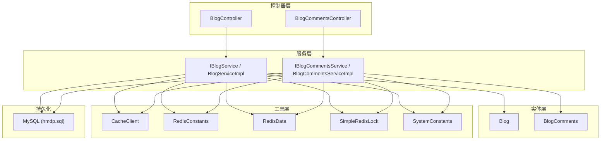
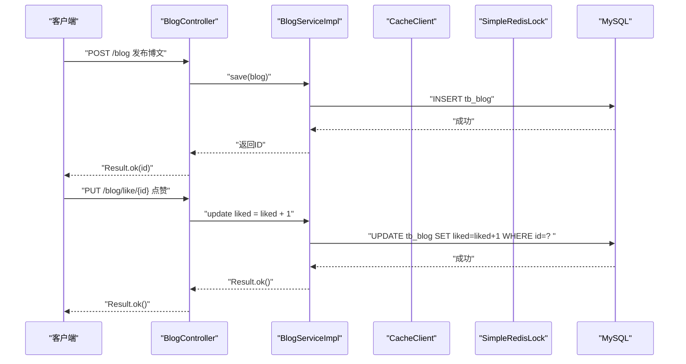
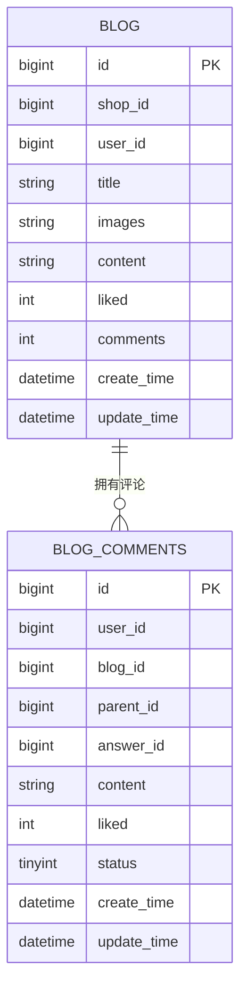
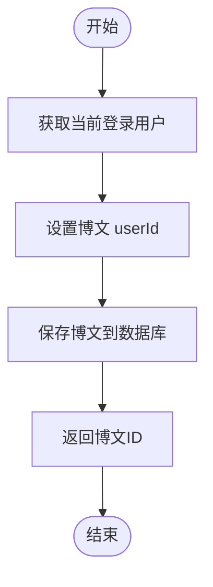
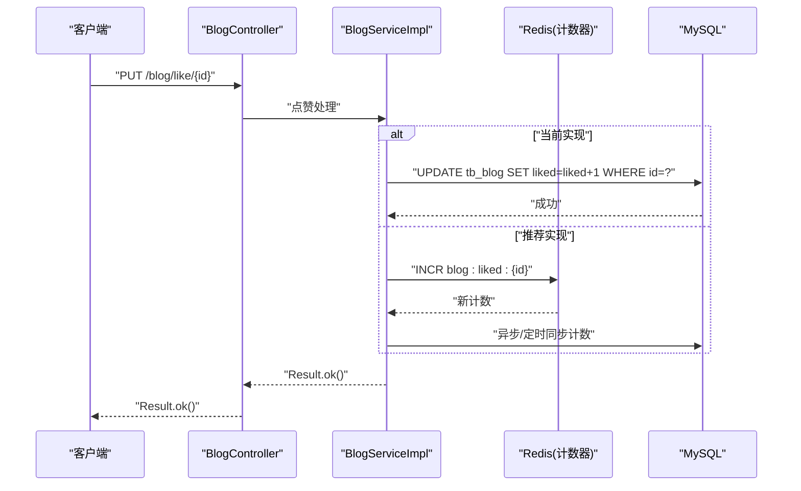
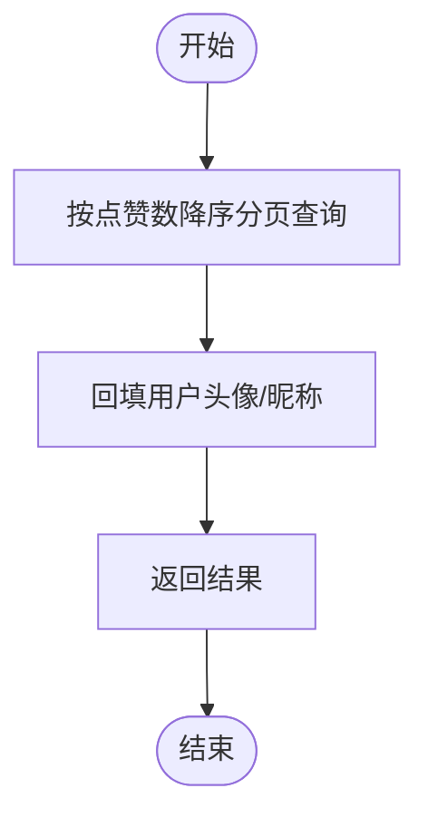
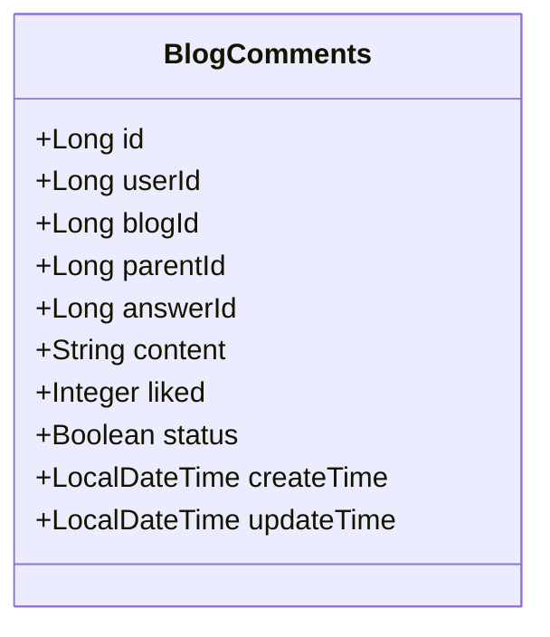
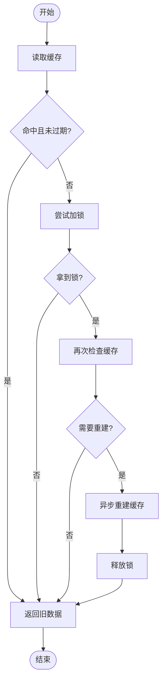
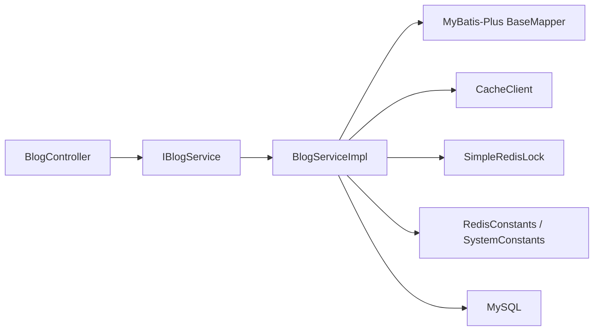

# 博客内容系统

<cite>
**本文引用的文件**   
- [Blog.java](file://src/main/java/com/hmdp/entity/Blog.java)
- [BlogComments.java](file://src/main/java/com/hmdp/entity/BlogComments.java)
- [BlogController.java](file://src/main/java/com/hmdp/controller/BlogController.java)
- [BlogServiceImpl.java](file://src/main/java/com/hmdp/service/impl/BlogServiceImpl.java)
- [IBlogService.java](file://src/main/java/com/hmdp/service/IBlogService.java)
- [BlogCommentsController.java](file://src/main/java/com/hmdp/controller/BlogCommentsController.java)
- [BlogCommentsServiceImpl.java](file://src/main/java/com/hmdp/service/impl/BlogCommentsServiceImpl.java)
- [IBlogCommentsService.java](file://src/main/java/com/hmdp/service/IBlogCommentsService.java)
- [CacheClient.java](file://src/main/java/com/hmdp/utils/CacheClient.java)
- [RedisConstants.java](file://src/main/java/com/hmdp/utils/RedisConstants.java)
- [RedisData.java](file://src/main/java/com/hmdp/utils/RedisData.java)
- [SimpleRedisLock.java](file://src/main/java/com/hmdp/utils/SimpleRedisLock.java)
- [SystemConstants.java](file://src/main/java/com/hmdp/utils/SystemConstants.java)
- [hmdp.sql](file://src/main/resources/db/hmdp.sql)
</cite>

## 目录
1. [简介](#简介)
2. [项目结构](#项目结构)
3. [核心组件](#核心组件)
4. [架构总览](#架构总览)
5. [详细组件分析](#详细组件分析)
6. [依赖关系分析](#依赖关系分析)
7. [性能与一致性优化](#性能与一致性优化)
8. [故障排查指南](#故障排查指南)
9. [结论](#结论)
10. [附录](#附录)

## 简介
本文件面向“博客内容系统”的博文发布、点赞统计、热门博文展示、评论回复等核心能力，提供从数据模型到服务实现、缓存与锁机制、高并发一致性与性能优化的完整技术文档。重点覆盖：
- 博文发布流程与数据落库
- 点赞计数器的设计与原子性保证（含 Redis 方案）
- 热门博文排序与展示策略
- 评论系统的层级结构设计
- 缓存更新机制与一致性保障
- 高并发场景下的数据一致性问题与解决方案

## 项目结构
本项目采用分层架构：控制器层暴露 REST API，服务层封装业务逻辑，实体层映射数据库表，工具层提供缓存、锁、常量等通用能力。

图表来源
- [BlogController.java:1-84](file://src/main/java/com/hmdp/controller/BlogController.java#L1-L84)
- [BlogCommentsController.java:1-21](file://src/main/java/com/hmdp/controller/BlogCommentsController.java#L1-L21)
- [BlogServiceImpl.java:1-21](file://src/main/java/com/hmdp/service/impl/BlogServiceImpl.java#L1-L21)
- [BlogCommentsServiceImpl.java:1-21](file://src/main/java/com/hmdp/service/impl/BlogCommentsServiceImpl.java#L1-L21)
- [Blog.java:1-96](file://src/main/java/com/hmdp/entity/Blog.java#L1-L96)
- [BlogComments.java:1-82](file://src/main/java/com/hmdp/entity/BlogComments.java#L1-L82)
- [CacheClient.java:1-140](file://src/main/java/com/hmdp/utils/CacheClient.java#L1-L140)
- [RedisConstants.java:1-25](file://src/main/java/com/hmdp/utils/RedisConstants.java#L1-L25)
- [RedisData.java:1-12](file://src/main/java/com/hmdp/utils/RedisData.java#L1-L12)
- [SimpleRedisLock.java:1-56](file://src/main/java/com/hmdp/utils/SimpleRedisLock.java#L1-L56)
- [SystemConstants.java:1-9](file://src/main/java/com/hmdp/utils/SystemConstants.java#L1-L9)
- [hmdp.sql:24-62](file://src/main/resources/db/hmdp.sql#L24-L62)

章节来源
- [BlogController.java:1-84](file://src/main/java/com/hmdp/controller/BlogController.java#L1-L84)
- [BlogServiceImpl.java:1-21](file://src/main/java/com/hmdp/service/impl/BlogServiceImpl.java#L1-L21)
- [Blog.java:1-96](file://src/main/java/com/hmdp/entity/Blog.java#L1-L96)
- [BlogComments.java:1-82](file://src/main/java/com/hmdp/entity/BlogComments.java#L1-L82)
- [hmdp.sql:24-62](file://src/main/resources/db/hmdp.sql#L24-L62)

## 核心组件
- 博文实体与数据表
  - 字段包含标题、图片、内容、点赞数、评论数、时间戳等；对外返回时补充用户头像与昵称等非持久化字段。
- 评论实体与数据表
  - 支持一级评论与二级回复，通过 parent_id 与 answer_id 表达层级关系。
- 控制器与服务
  - 博文控制器提供发布、点赞、个人博文列表、热门博文列表接口；评论控制器预留扩展点。
- 缓存与锁
  - 提供带逻辑过期时间的缓存查询、空值缓存、分布式锁等通用能力。

章节来源
- [Blog.java:1-96](file://src/main/java/com/hmdp/entity/Blog.java#L1-L96)
- [BlogComments.java:1-82](file://src/main/java/com/hmdp/entity/BlogComments.java#L1-L82)
- [BlogController.java:1-84](file://src/main/java/com/hmdp/controller/BlogController.java#L1-L84)
- [BlogServiceImpl.java:1-21](file://src/main/java/com/hmdp/service/impl/BlogServiceImpl.java#L1-L21)
- [BlogCommentsController.java:1-21](file://src/main/java/com/hmdp/controller/BlogCommentsController.java#L1-L21)
- [BlogCommentsServiceImpl.java:1-21](file://src/main/java/com/hmdp/service/impl/BlogCommentsServiceImpl.java#L1-L21)
- [CacheClient.java:1-140](file://src/main/java/com/hmdp/utils/CacheClient.java#L1-L140)
- [RedisConstants.java:1-25](file://src/main/java/com/hmdp/utils/RedisConstants.java#L1-L25)
- [RedisData.java:1-12](file://src/main/java/com/hmdp/utils/RedisData.java#L1-L12)
- [SimpleRedisLock.java:1-56](file://src/main/java/com/hmdp/utils/SimpleRedisLock.java#L1-L56)

## 架构总览
下图展示了从请求进入、业务处理、缓存与锁、到数据库落库的整体交互。

图表来源
- [BlogController.java:35-52](file://src/main/java/com/hmdp/controller/BlogController.java#L35-L52)
- [BlogServiceImpl.java:17-20](file://src/main/java/com/hmdp/service/impl/BlogServiceImpl.java#L17-L20)
- [hmdp.sql:24-36](file://src/main/resources/db/hmdp.sql#L24-L36)

## 详细组件分析

### 数据模型设计
- 博文表 tb_blog
  - 主键 id、商户 shop_id、用户 user_id、标题 title、图片 images、内容 content、点赞数 liked、评论数 comments、创建/更新时间。
- 评论表 tb_blog_comments
  - 主键 id、用户 user_id、博文 blog_id、父级评论 parent_id、被回复评论 answer_id、内容 content、点赞数 liked、状态 status、创建/更新时间。

图表来源
- [hmdp.sql:24-36](file://src/main/resources/db/hmdp.sql#L24-L36)
- [hmdp.sql:49-62](file://src/main/resources/db/hmdp.sql#L49-L62)

章节来源
- [Blog.java:1-96](file://src/main/java/com/hmdp/entity/Blog.java#L1-L96)
- [BlogComments.java:1-82](file://src/main/java/com/hmdp/entity/BlogComments.java#L1-L82)
- [hmdp.sql:24-36](file://src/main/resources/db/hmdp.sql#L24-L36)
- [hmdp.sql:49-62](file://src/main/resources/db/hmdp.sql#L49-L62)

### 博文发布流程
- 入口：POST /blog
- 步骤
  - 从上下文获取当前登录用户 ID，写入博文对象
  - 调用服务层保存至数据库
  - 返回博文 ID
- 关键点
  - 用户身份由拦截器注入上下文后，通过工具类获取
  - 发布成功后可结合后续功能（如热点预热、索引构建）进行扩展

图表来源
- [BlogController.java:35-44](file://src/main/java/com/hmdp/controller/BlogController.java#L35-L44)
- [BlogServiceImpl.java:17-20](file://src/main/java/com/hmdp/service/impl/BlogServiceImpl.java#L17-L20)

章节来源
- [BlogController.java:35-44](file://src/main/java/com/hmdp/controller/BlogController.java#L35-L44)
- [BlogServiceImpl.java:17-20](file://src/main/java/com/hmdp/service/impl/BlogServiceImpl.java#L17-L20)

### 点赞统计与原子性保证
- 现有实现
  - 直接对数据库执行自增更新，利用 SQL 原子性保证计数器安全。
- 高并发优化建议（推荐）
  - 使用 Redis 作为点赞计数器，基于 INCR 或 Lua 脚本实现原子自增，降低数据库压力。
  - 定期将 Redis 中的点赞数同步回 MySQL，避免数据丢失。
  - 如需去重（同一用户多次点赞），可使用 Redis Set 记录已点赞用户集合，配合事务或 Lua 保证幂等。

图表来源
- [BlogController.java:46-52](file://src/main/java/com/hmdp/controller/BlogController.java#L46-L52)
- [BlogServiceImpl.java:17-20](file://src/main/java/com/hmdp/service/impl/BlogServiceImpl.java#L17-L20)
- [RedisConstants.java:20-20](file://src/main/java/com/hmdp/utils/RedisConstants.java#L20-L20)

章节来源
- [BlogController.java:46-52](file://src/main/java/com/hmdp/controller/BlogController.java#L46-L52)
- [BlogServiceImpl.java:17-20](file://src/main/java/com/hmdp/service/impl/BlogServiceImpl.java#L17-L20)
- [RedisConstants.java:20-20](file://src/main/java/com/hmdp/utils/RedisConstants.java#L20-L20)

### 热门博文展示
- 当前实现
  - 按 liked 降序分页查询，并回填用户头像与昵称。
- 优化建议
  - 引入 Redis ZSET 维护热门排行，以点赞数为分数，定期刷新或增量更新。
  - 查询时优先读 Redis 排行榜，再按需填充用户信息。

图表来源
- [BlogController.java:66-82](file://src/main/java/com/hmdp/controller/BlogController.java#L66-L82)

章节来源
- [BlogController.java:66-82](file://src/main/java/com/hmdp/controller/BlogController.java#L66-L82)

### 评论系统层级结构设计
- 数据结构
  - 一级评论：parent_id = 0
  - 二级回复：answer_id 指向被回复的一级评论 id
- 查询与展示
  - 先查一级评论，再根据 answer_id 聚合二级回复，形成树形结构
- 扩展点
  - 可在服务层增加评论 CRUD、点赞、审核状态控制等

图表来源
- [BlogComments.java:1-82](file://src/main/java/com/hmdp/entity/BlogComments.java#L1-L82)

章节来源
- [BlogComments.java:1-82](file://src/main/java/com/hmdp/entity/BlogComments.java#L1-L82)
- [BlogCommentsController.java:1-21](file://src/main/java/com/hmdp/controller/BlogCommentsController.java#L1-L21)
- [BlogCommentsServiceImpl.java:1-21](file://src/main/java/com/hmdp/service/impl/BlogCommentsServiceImpl.java#L1-L21)
- [IBlogCommentsService.java:1-17](file://src/main/java/com/hmdp/service/IBlogCommentsService.java#L1-L17)

### 缓存与锁机制
- 逻辑过期缓存
  - 在缓存中存储数据与逻辑过期时间，读取时判断是否过期；若过期则尝试加锁重建缓存，避免缓存击穿。
- 分布式锁
  - 基于 Redis setIfAbsent 加锁，Lua 脚本原子释放，防止误删其他线程持有的锁。
- 常量定义
  - 统一缓存键前缀、锁键前缀、TTL 等常量，便于管理与复用。

图表来源
- [CacheClient.java:64-127](file://src/main/java/com/hmdp/utils/CacheClient.java#L64-L127)
- [SimpleRedisLock.java:31-44](file://src/main/java/com/hmdp/utils/SimpleRedisLock.java#L31-L44)
- [RedisConstants.java:1-25](file://src/main/java/com/hmdp/utils/RedisConstants.java#L1-L25)

章节来源
- [CacheClient.java:1-140](file://src/main/java/com/hmdp/utils/CacheClient.java#L1-L140)
- [SimpleRedisLock.java:1-56](file://src/main/java/com/hmdp/utils/SimpleRedisLock.java#L1-L56)
- [RedisConstants.java:1-25](file://src/main/java/com/hmdp/utils/RedisConstants.java#L1-L25)
- [RedisData.java:1-12](file://src/main/java/com/hmdp/utils/RedisData.java#L1-L12)

## 依赖关系分析
- 控制器依赖服务接口与工具类
- 服务实现依赖 MyBatis-Plus 基础服务与数据库
- 工具类提供缓存、锁、常量等横切能力
- 数据库表结构与实体一一对应

图表来源
- [BlogController.java:1-84](file://src/main/java/com/hmdp/controller/BlogController.java#L1-L84)
- [BlogServiceImpl.java:1-21](file://src/main/java/com/hmdp/service/impl/BlogServiceImpl.java#L1-L21)
- [CacheClient.java:1-140](file://src/main/java/com/hmdp/utils/CacheClient.java#L1-L140)
- [SimpleRedisLock.java:1-56](file://src/main/java/com/hmdp/utils/SimpleRedisLock.java#L1-L56)
- [RedisConstants.java:1-25](file://src/main/java/com/hmdp/utils/RedisConstants.java#L1-L25)
- [SystemConstants.java:1-9](file://src/main/java/com/hmdp/utils/SystemConstants.java#L1-L9)

章节来源
- [BlogController.java:1-84](file://src/main/java/com/hmdp/controller/BlogController.java#L1-L84)
- [BlogServiceImpl.java:1-21](file://src/main/java/com/hmdp/service/impl/BlogServiceImpl.java#L1-L21)
- [CacheClient.java:1-140](file://src/main/java/com/hmdp/utils/CacheClient.java#L1-L140)
- [SimpleRedisLock.java:1-56](file://src/main/java/com/hmdp/utils/SimpleRedisLock.java#L1-L56)
- [RedisConstants.java:1-25](file://src/main/java/com/hmdp/utils/RedisConstants.java#L1-L25)
- [SystemConstants.java:1-9](file://src/main/java/com/hmdp/utils/SystemConstants.java#L1-L9)

## 性能与一致性优化
- 点赞计数器
  - 使用 Redis INCR/Lua 原子自增，降低数据库写放大
  - 定时任务将 Redis 计数合并回 MySQL，确保最终一致性
  - 如需去重，使用 Set 记录已点赞用户，配合 Lua 实现幂等
- 热门内容推荐
  - 使用 Redis ZSET 维护排行榜，按点赞数排序，减少数据库排序开销
  - 增量更新：每次点赞后更新 ZSET 分数
- 缓存更新机制
  - 逻辑过期 + 分布式锁，避免缓存击穿
  - 空值缓存，防止缓存穿透
- 分页与查询优化
  - 合理设置每页大小，避免大偏移量导致性能下降
  - 热点数据预加载与延迟双检，提升命中率

[本节为通用指导，不直接分析具体文件]

## 故障排查指南
- 常见问题
  - 点赞重复：检查是否实现幂等（Set 去重 + Lua 原子操作）
  - 计数不一致：核对 Redis 与 MySQL 同步策略与频率
  - 缓存击穿：确认逻辑过期与分布式锁是否正确生效
  - 锁误删：确保解锁脚本仅删除当前线程持有的锁
- 定位方法
  - 查看 Redis 键空间分布与 TTL
  - 监控数据库慢查询与锁等待
  - 日志记录关键路径（加锁、解锁、缓存重建）

章节来源
- [CacheClient.java:129-136](file://src/main/java/com/hmdp/utils/CacheClient.java#L129-L136)
- [SimpleRedisLock.java:31-44](file://src/main/java/com/hmdp/utils/SimpleRedisLock.java#L31-L44)
- [RedisConstants.java:1-25](file://src/main/java/com/hmdp/utils/RedisConstants.java#L1-L25)

## 结论
本系统围绕博文发布、点赞、热门展示与评论展开，具备清晰的层次结构与可扩展的服务边界。针对高并发点赞与热点查询，建议引入 Redis 原子计数与 ZSET 排行榜，并结合逻辑过期与分布式锁保障缓存一致性。通过合理的缓存更新与同步策略，可在保证一致性的同时显著提升系统吞吐与响应速度。

[本节为总结性内容，不直接分析具体文件]

## 附录
- 相关常量与键名
  - 登录、商铺、秒杀、博文点赞、动态流等键前缀与 TTL 定义
- 分页常量
  - 默认与最大分页大小配置

章节来源
- [RedisConstants.java:1-25](file://src/main/java/com/hmdp/utils/RedisConstants.java#L1-L25)
- [SystemConstants.java:1-9](file://src/main/java/com/hmdp/utils/SystemConstants.java#L1-L9)