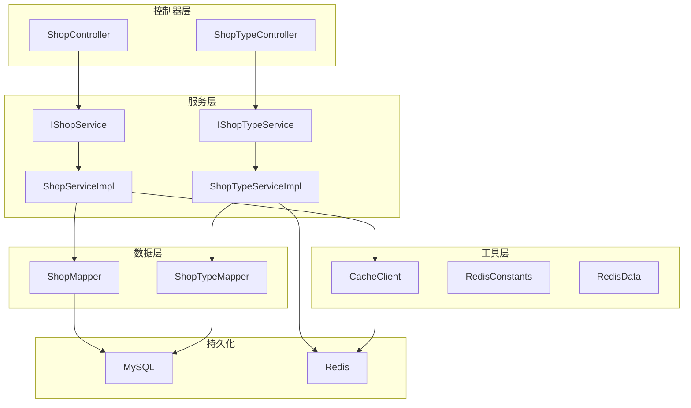
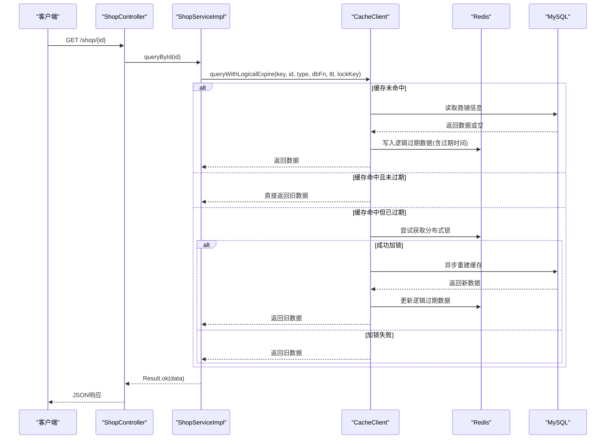
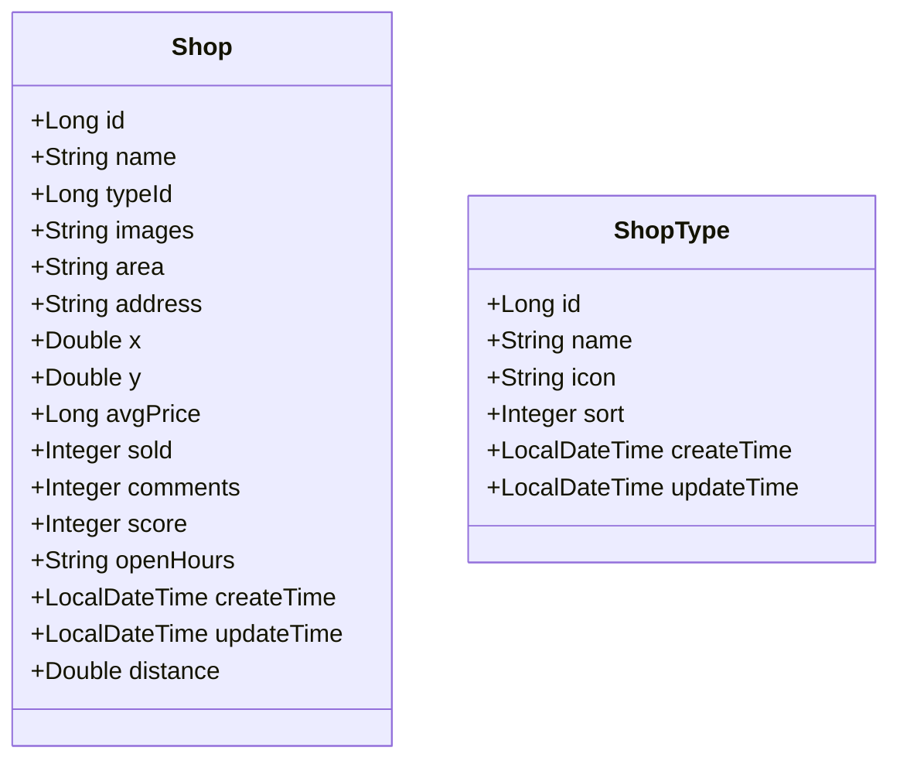
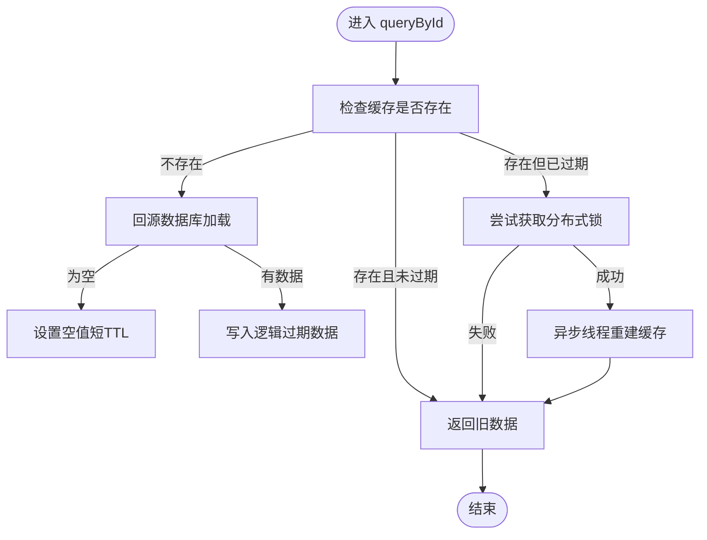
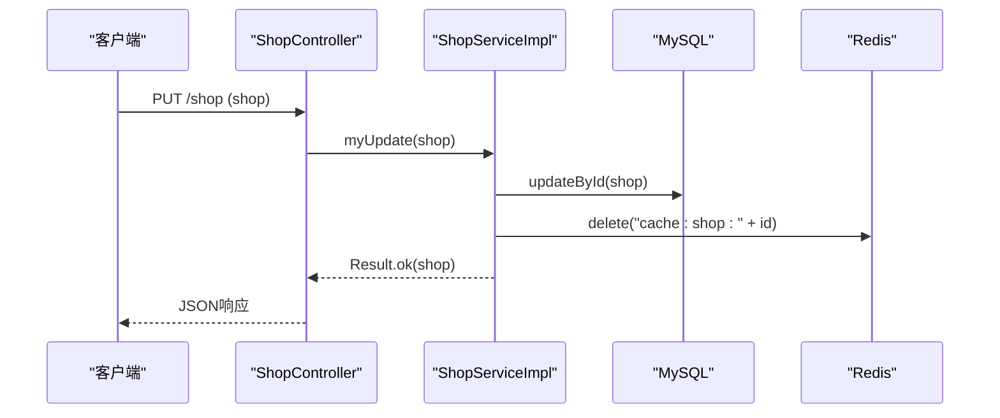
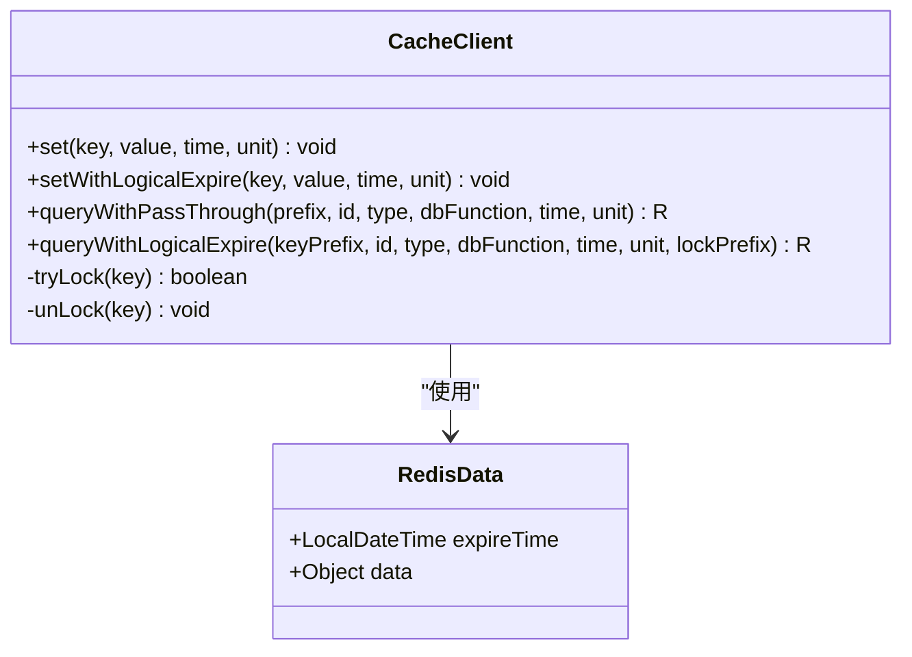
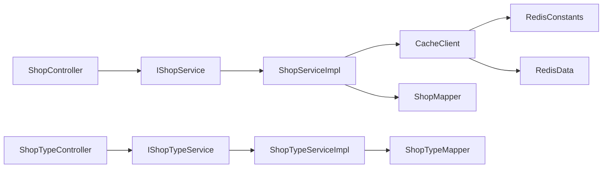

# 商户管理系统

<cite>
**本文引用的文件**   
- [Shop.java](file://src/main/java/com/hmdp/entity/Shop.java)
- [ShopType.java](file://src/main/java/com/hmdp/entity/ShopType.java)
- [ShopController.java](file://src/main/java/com/hmdp/controller/ShopController.java)
- [ShopTypeController.java](file://src/main/java/com/hmdp/controller/ShopTypeController.java)
- [IShopService.java](file://src/main/java/com/hmdp/service/IShopService.java)
- [ShopServiceImpl.java](file://src/main/java/com/hmdp/service/impl/ShopServiceImpl.java)
- [IShopTypeService.java](file://src/main/java/com/hmdp/service/IShopTypeService.java)
- [ShopTypeServiceImpl.java](file://src/main/java/com/hmdp/service/impl/ShopTypeServiceImpl.java)
- [CacheClient.java](file://src/main/java/com/hmdp/utils/CacheClient.java)
- [RedisConstants.java](file://src/main/java/com/hmdp/utils/RedisConstants.java)
- [RedisData.java](file://src/main/java/com/hmdp/utils/RedisData.java)
- [hmdp.sql](file://src/main/resources/db/hmdp.sql)
</cite>

## 目录
1. [简介](#简介)
2. [项目结构](#项目结构)
3. [核心组件](#核心组件)
4. [架构总览](#架构总览)
5. [详细组件分析](#详细组件分析)
6. [依赖关系分析](#依赖关系分析)
7. [性能考量](#性能考量)
8. [故障排查指南](#故障排查指南)
9. [结论](#结论)
10. [附录](#附录)

## 简介
本系统为“商户管理系统”，围绕商铺信息与分类管理提供完整的 CRUD、分页与筛选能力，并引入 Redis 缓存与逻辑过期策略提升查询性能。数据模型包含商铺经纬度字段，预留距离计算字段用于后续地理位置搜索与排序扩展。当前实现覆盖：
- 商铺详情查询（带缓存）
- 商铺新增与更新（更新后清理缓存）
- 按类型分页查询
- 按名称模糊分页查询
- 商铺类型列表查询（带缓存）

## 项目结构
本项目采用典型的分层架构：
- 控制器层：接收请求，参数校验与结果封装
- 服务层：业务逻辑与缓存策略
- 数据访问层：MyBatis-Plus 的 Mapper 接口
- 实体层：数据库表映射
- 工具层：缓存客户端、常量定义等

图表来源
- [ShopController.java:1-101](file://src/main/java/com/hmdp/controller/ShopController.java#L1-L101)
- [ShopTypeController.java:1-37](file://src/main/java/com/hmdp/controller/ShopTypeController.java#L1-L37)
- [IShopService.java:1-21](file://src/main/java/com/hmdp/service/IShopService.java#L1-L21)
- [ShopServiceImpl.java:1-61](file://src/main/java/com/hmdp/service/impl/ShopServiceImpl.java#L1-L61)
- [IShopTypeService.java:1-19](file://src/main/java/com/hmdp/service/IShopTypeService.java#L1-L19)
- [ShopTypeServiceImpl.java:1-49](file://src/main/java/com/hmdp/service/impl/ShopTypeServiceImpl.java#L1-L49)
- [CacheClient.java:1-140](file://src/main/java/com/hmdp/utils/CacheClient.java#L1-L140)
- [RedisConstants.java:1-25](file://src/main/java/com/hmdp/utils/RedisConstants.java#L1-L25)
- [RedisData.java:1-12](file://src/main/java/com/hmdp/utils/RedisData.java#L1-L12)

章节来源
- [ShopController.java:1-101](file://src/main/java/com/hmdp/controller/ShopController.java#L1-L101)
- [ShopTypeController.java:1-37](file://src/main/java/com/hmdp/controller/ShopTypeController.java#L1-L37)
- [IShopService.java:1-21](file://src/main/java/com/hmdp/service/IShopService.java#L1-L21)
- [ShopServiceImpl.java:1-61](file://src/main/java/com/hmdp/service/impl/ShopServiceImpl.java#L1-L61)
- [IShopTypeService.java:1-19](file://src/main/java/com/hmdp/service/IShopTypeService.java#L1-L19)
- [ShopTypeServiceImpl.java:1-49](file://src/main/java/com/hmdp/service/impl/ShopTypeServiceImpl.java#L1-L49)
- [CacheClient.java:1-140](file://src/main/java/com/hmdp/utils/CacheClient.java#L1-L140)
- [RedisConstants.java:1-25](file://src/main/java/com/hmdp/utils/RedisConstants.java#L1-L25)
- [RedisData.java:1-12](file://src/main/java/com/hmdp/utils/RedisData.java#L1-L12)

## 核心组件
- 商铺实体与类型实体：定义数据模型与字段约束，支持经纬度与距离字段扩展
- 控制器：暴露 REST 接口，处理分页与筛选
- 服务层：封装业务逻辑与缓存策略（穿透、逻辑过期）
- 缓存工具：统一封装 Redis 读写、逻辑过期与分布式锁
- 常量：集中管理缓存键前缀与 TTL

章节来源
- [Shop.java:1-110](file://src/main/java/com/hmdp/entity/Shop.java#L1-L110)
- [ShopType.java:1-65](file://src/main/java/com/hmdp/entity/ShopType.java#L1-L65)
- [ShopController.java:1-101](file://src/main/java/com/hmdp/controller/ShopController.java#L1-L101)
- [ShopTypeController.java:1-37](file://src/main/java/com/hmdp/controller/ShopTypeController.java#L1-L37)
- [IShopService.java:1-21](file://src/main/java/com/hmdp/service/IShopService.java#L1-L21)
- [ShopServiceImpl.java:1-61](file://src/main/java/com/hmdp/service/impl/ShopServiceImpl.java#L1-L61)
- [IShopTypeService.java:1-19](file://src/main/java/com/hmdp/service/IShopTypeService.java#L1-L19)
- [ShopTypeServiceImpl.java:1-49](file://src/main/java/com/hmdp/service/impl/ShopTypeServiceImpl.java#L1-L49)
- [CacheClient.java:1-140](file://src/main/java/com/hmdp/utils/CacheClient.java#L1-L140)
- [RedisConstants.java:1-25](file://src/main/java/com/hmdp/utils/RedisConstants.java#L1-L25)
- [RedisData.java:1-12](file://src/main/java/com/hmdp/utils/RedisData.java#L1-L12)

## 架构总览
下图展示了从请求到响应的主要路径，包括缓存命中、回源数据库、缓存重建与锁控制。

图表来源
- [ShopController.java:34-37](file://src/main/java/com/hmdp/controller/ShopController.java#L34-L37)
- [ShopServiceImpl.java:36-45](file://src/main/java/com/hmdp/service/impl/ShopServiceImpl.java#L36-L45)
- [CacheClient.java:64-127](file://src/main/java/com/hmdp/utils/CacheClient.java#L64-L127)

## 详细组件分析

### 数据模型设计
- 商铺实体
  - 主键、名称、类型ID、图片集合、商圈、地址
  - 经纬度 x/y（用于地理计算）
  - 均价、销量、评论数、评分（整数化存储）
  - 营业时间、创建/更新时间
  - 非持久化字段 distance（用于距离排序展示）
- 商铺类型实体
  - 主键、名称、图标、排序顺序、创建/更新时间

图表来源
- [Shop.java:1-110](file://src/main/java/com/hmdp/entity/Shop.java#L1-L110)
- [ShopType.java:1-65](file://src/main/java/com/hmdp/entity/ShopType.java#L1-L65)

章节来源
- [Shop.java:1-110](file://src/main/java/com/hmdp/entity/Shop.java#L1-L110)
- [ShopType.java:1-65](file://src/main/java/com/hmdp/entity/ShopType.java#L1-L65)
- [hmdp.sql:103-171](file://src/main/resources/db/hmdp.sql#L103-L171)

### 商铺信息查询接口（详情）
- 路由：GET /shop/{id}
- 功能：根据 ID 查询商铺详情，优先走缓存；若缓存过期则异步重建
- 缓存策略：逻辑过期 + 分布式锁，避免热点 key 重建风暴
- 返回：统一 Result 包装

图表来源
- [ShopServiceImpl.java:36-45](file://src/main/java/com/hmdp/service/impl/ShopServiceImpl.java#L36-L45)
- [CacheClient.java:64-127](file://src/main/java/com/hmdp/utils/CacheClient.java#L64-L127)

章节来源
- [ShopController.java:34-37](file://src/main/java/com/hmdp/controller/ShopController.java#L34-L37)
- [ShopServiceImpl.java:36-45](file://src/main/java/com/hmdp/service/impl/ShopServiceImpl.java#L36-L45)
- [CacheClient.java:64-127](file://src/main/java/com/hmdp/utils/CacheClient.java#L64-L127)

### 商铺新增与更新
- 新增：POST /shop，保存后返回店铺 ID
- 更新：PUT /shop，更新成功后删除对应缓存键，保证下次查询回源刷新

图表来源
- [ShopController.java:57-61](file://src/main/java/com/hmdp/controller/ShopController.java#L57-L61)
- [ShopServiceImpl.java:47-58](file://src/main/java/com/hmdp/service/impl/ShopServiceImpl.java#L47-L58)

章节来源
- [ShopController.java:44-61](file://src/main/java/com/hmdp/controller/ShopController.java#L44-L61)
- [ShopServiceImpl.java:47-58](file://src/main/java/com/hmdp/service/impl/ShopServiceImpl.java#L47-L58)

### 按类型分页查询
- 路由：GET /shop/of/type?typeId=...&current=...
- 功能：按类型过滤，使用 MyBatis-Plus 分页插件
- 注意：当前实现未启用缓存，适合低频或读多写少的场景

章节来源
- [ShopController.java:69-80](file://src/main/java/com/hmdp/controller/ShopController.java#L69-L80)

### 按名称模糊分页查询
- 路由：GET /shop/of/name?name=...&current=...
- 功能：可选名称关键字模糊匹配，限制最大页大小

章节来源
- [ShopController.java:88-99](file://src/main/java/com/hmdp/controller/ShopController.java#L88-L99)

### 商铺类型列表查询
- 路由：GET /shop-type/list
- 功能：优先从 Redis 获取类型列表，未命中则查库并按 sort 升序，再写入缓存
- 缓存格式：JSON 字符串数组

章节来源
- [ShopTypeController.java:32-35](file://src/main/java/com/hmdp/controller/ShopTypeController.java#L32-L35)
- [ShopTypeServiceImpl.java:31-46](file://src/main/java/com/hmdp/service/impl/ShopTypeServiceImpl.java#L31-L46)

### 缓存策略与数据结构
- 缓存客户端
  - 通用 set：序列化对象为 JSON 并设置 TTL
  - 逻辑过期 set：将数据与过期时间一起存入，读取时判断是否过期
  - 穿透保护：对空值设置短 TTL，防止缓存击穿
  - 逻辑过期查询：命中即返回旧数据；过期则尝试加锁，异步重建
- 数据结构
  - RedisData：包含 expireTime 与 data 两个字段，用于逻辑过期

图表来源
- [CacheClient.java:1-140](file://src/main/java/com/hmdp/utils/CacheClient.java#L1-L140)
- [RedisData.java:1-12](file://src/main/java/com/hmdp/utils/RedisData.java#L1-L12)

章节来源
- [CacheClient.java:1-140](file://src/main/java/com/hmdp/utils/CacheClient.java#L1-L140)
- [RedisData.java:1-12](file://src/main/java/com/hmdp/utils/RedisData.java#L1-L12)
- [RedisConstants.java:1-25](file://src/main/java/com/hmdp/utils/RedisConstants.java#L1-L25)

## 依赖关系分析
- 控制器依赖服务接口，服务实现依赖缓存工具与数据库访问
- 缓存工具依赖 Redis 模板与 JSON 工具
- 常量类集中管理缓存键前缀与 TTL，便于统一配置

图表来源
- [ShopController.java:1-101](file://src/main/java/com/hmdp/controller/ShopController.java#L1-L101)
- [IShopService.java:1-21](file://src/main/java/com/hmdp/service/IShopService.java#L1-L21)
- [ShopServiceImpl.java:1-61](file://src/main/java/com/hmdp/service/impl/ShopServiceImpl.java#L1-L61)
- [ShopTypeController.java:1-37](file://src/main/java/com/hmdp/controller/ShopTypeController.java#L1-L37)
- [IShopTypeService.java:1-19](file://src/main/java/com/hmdp/service/IShopTypeService.java#L1-L19)
- [ShopTypeServiceImpl.java:1-49](file://src/main/java/com/hmdp/service/impl/ShopTypeServiceImpl.java#L1-L49)
- [CacheClient.java:1-140](file://src/main/java/com/hmdp/utils/CacheClient.java#L1-L140)
- [RedisConstants.java:1-25](file://src/main/java/com/hmdp/utils/RedisConstants.java#L1-L25)
- [RedisData.java:1-12](file://src/main/java/com/hmdp/utils/RedisData.java#L1-L12)

章节来源
- [ShopController.java:1-101](file://src/main/java/com/hmdp/controller/ShopController.java#L1-L101)
- [ShopTypeController.java:1-37](file://src/main/java/com/hmdp/controller/ShopTypeController.java#L1-L37)
- [IShopService.java:1-21](file://src/main/java/com/hmdp/service/IShopService.java#L1-L21)
- [ShopServiceImpl.java:1-61](file://src/main/java/com/hmdp/service/impl/ShopServiceImpl.java#L1-L61)
- [IShopTypeService.java:1-19](file://src/main/java/com/hmdp/service/IShopTypeService.java#L1-L19)
- [ShopTypeServiceImpl.java:1-49](file://src/main/java/com/hmdp/service/impl/ShopTypeServiceImpl.java#L1-L49)
- [CacheClient.java:1-140](file://src/main/java/com/hmdp/utils/CacheClient.java#L1-L140)
- [RedisConstants.java:1-25](file://src/main/java/com/hmdp/utils/RedisConstants.java#L1-L25)
- [RedisData.java:1-12](file://src/main/java/com/hmdp/utils/RedisData.java#L1-L12)

## 性能考量
- 缓存命中率优化
  - 热点商铺使用逻辑过期 + 分布式锁，避免并发重建导致雪崩
  - 空值短 TTL 防穿透
- 更新一致性
  - 更新后主动删除缓存键，确保下次查询回源刷新
- 分页与筛选
  - 类型分页与名称模糊分页基于 MyBatis-Plus，建议对常用查询列建立索引
- 高并发场景
  - 合理设置 TTL 与锁超时，避免长时间阻塞
  - 异步重建减少主链路延迟
- 可扩展性
  - 预留 distance 字段，便于后续在应用层进行距离计算与排序

[本节为通用性能指导，不直接分析具体文件]

## 故障排查指南
- 查询返回错误
  - 检查 queryById 中缓存未命中时的回源逻辑与空值处理
  - 确认 Redis 连接与键空间是否正常
- 更新后数据不一致
  - 确认更新接口是否正确删除对应缓存键
- 类型列表缓存异常
  - 检查 JSON 序列化与反序列化过程
  - 确认 Redis 中缓存键是否存在与格式正确

章节来源
- [ShopServiceImpl.java:36-45](file://src/main/java/com/hmdp/service/impl/ShopServiceImpl.java#L36-L45)
- [ShopServiceImpl.java:47-58](file://src/main/java/com/hmdp/service/impl/ShopServiceImpl.java#L47-L58)
- [ShopTypeServiceImpl.java:31-46](file://src/main/java/com/hmdp/service/impl/ShopTypeServiceImpl.java#L31-L46)

## 结论
本系统通过清晰的层次划分与统一的缓存策略，实现了商铺与类型的高效管理与查询。当前已具备完善的 CRUD、分页与筛选能力，并为地理位置搜索与距离排序预留了数据模型与扩展点。建议在后续迭代中：
- 完善地理位置搜索接口（基于经纬度与距离计算）
- 对高频查询增加缓存层
- 结合索引与分页优化提升整体性能

[本节为总结性内容，不直接分析具体文件]

## 附录

### API 使用示例
- 查询商铺详情
  - 方法：GET
  - 路径：/shop/{id}
  - 说明：返回商铺详细信息，优先从缓存读取
- 新增商铺
  - 方法：POST
  - 路径：/shop
  - 说明：提交商铺数据，返回店铺 ID
- 更新商铺
  - 方法：PUT
  - 路径：/shop
  - 说明：提交包含 id 的商铺数据，更新后清理缓存
- 按类型分页查询
  - 方法：GET
  - 路径：/shop/of/type?typeId={typeId}&current={page}
  - 说明：按类型过滤并分页
- 按名称模糊分页查询
  - 方法：GET
  - 路径：/shop/of/name?name={keyword}&current={page}
  - 说明：按名称关键字模糊匹配并分页
- 查询商铺类型列表
  - 方法：GET
  - 路径：/shop-type/list
  - 说明：返回所有类型，优先从缓存读取

章节来源
- [ShopController.java:34-99](file://src/main/java/com/hmdp/controller/ShopController.java#L34-L99)
- [ShopTypeController.java:32-35](file://src/main/java/com/hmdp/controller/ShopTypeController.java#L32-L35)

### 数据库表结构要点
- tb_shop
  - 包含商铺基本信息、经纬度、评分、销量、评论数、营业时间等
  - 外键索引：type_id
- tb_shop_type
  - 包含类型名称、图标、排序顺序等

章节来源
- [hmdp.sql:103-171](file://src/main/resources/db/hmdp.sql#L103-L171)