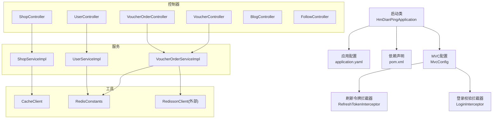
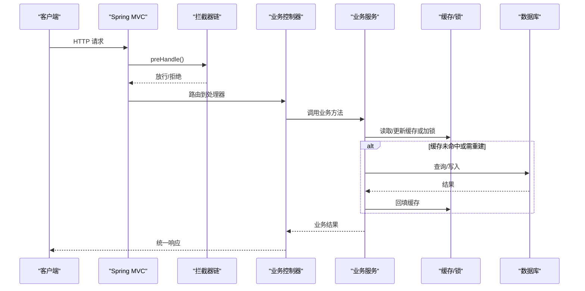
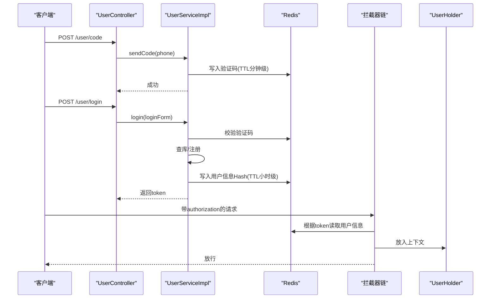
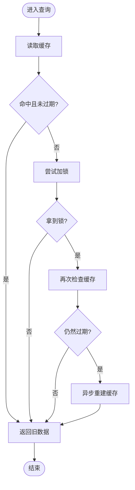
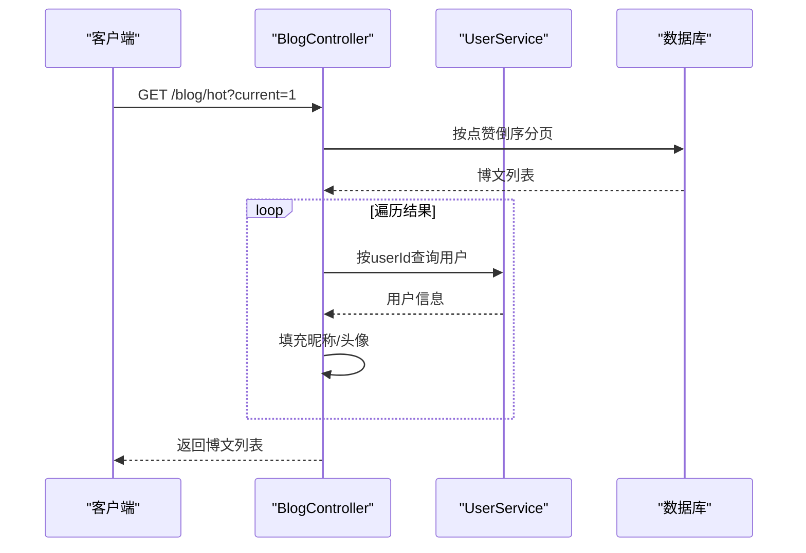
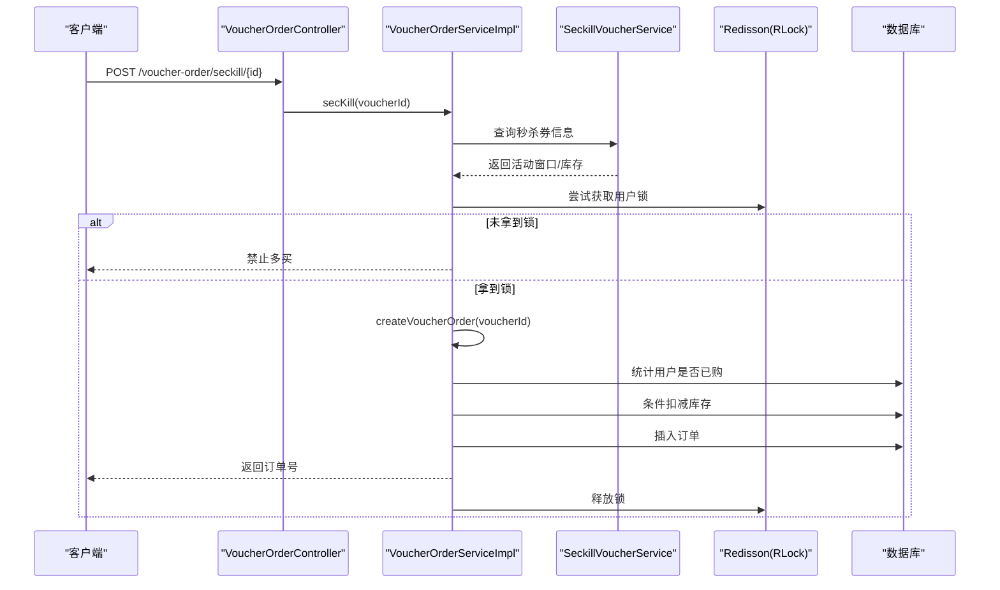
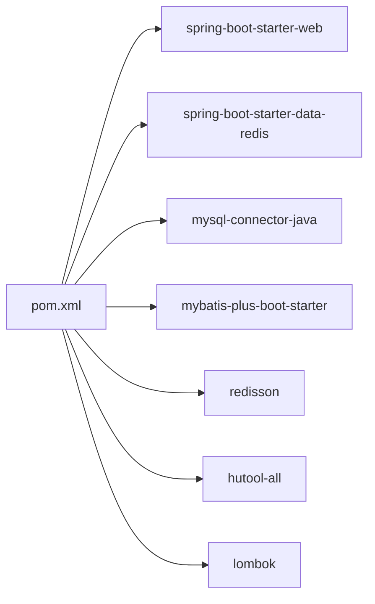

# 核心功能模块

<cite>
**本文引用的文件**   
- [HmDianPingApplication.java](file://src/main/java/com/hmdp/HmDianPingApplication.java)
- [pom.xml](file://pom.xml)
- [application.yaml](file://src/main/resources/application.yaml)
- [MvcConfig.java](file://src/main/java/com/hmdp/config/MvcConfig.java)
- [RefreshTokenInterceptor.java](file://src/main/java/com/hmdp/utils/RefreshTokenInterceptor.java)
- [LoginInterceptor.java](file://src/main/java/com/hmdp/utils/LoginInterceptor.java)
- [RedisConstants.java](file://src/main/java/com/hmdp/utils/RedisConstants.java)
- [CacheClient.java](file://src/main/java/com/hmdp/utils/CacheClient.java)
- [UserController.java](file://src/main/java/com/hmdp/controller/UserController.java)
- [UserServiceImpl.java](file://src/main/java/com/hmdp/service/impl/UserServiceImpl.java)
- [ShopController.java](file://src/main/java/com/hmdp/controller/ShopController.java)
- [ShopServiceImpl.java](file://src/main/java/com/hmdp/service/impl/ShopServiceImpl.java)
- [VoucherController.java](file://src/main/java/com/hmdp/controller/VoucherController.java)
- [VoucherOrderController.java](file://src/main/java/com/hmdp/controller/VoucherOrderController.java)
- [VoucherOrderServiceImpl.java](file://src/main/java/com/hmdp/service/impl/VoucherOrderServiceImpl.java)
- [VoucherMapper.java](file://src/main/java/com/hmdp/mapper/VoucherMapper.java)
- [Voucher.java](file://src/main/java/com/hmdp/entity/Voucher.java)
- [SeckillVoucher.java](file://src/main/java/com/hmdp/entity/SeckillVoucher.java)
- [BlogController.java](file://src/main/java/com/hmdp/controller/BlogController.java)
- [FollowController.java](file://src/main/java/com/hmdp/controller/FollowController.java)
</cite>

## 目录
1. [简介](#简介)
2. [项目结构](#项目结构)
3. [核心组件](#核心组件)
4. [架构总览](#架构总览)
5. [详细组件分析](#详细组件分析)
6. [依赖关系分析](#依赖关系分析)
7. [性能考虑](#性能考虑)
8. [故障排查指南](#故障排查指南)
9. [结论](#结论)
10. [附录](#附录)

## 简介
本文件面向 my-hbdp 项目的核心业务模块，系统性梳理用户认证、商户管理、博客内容、优惠券秒杀与社交互动等功能的实现。文档从系统架构、数据流、组件关系入手，结合具体代码路径说明关键流程、配置项与返回值约定，并提供常见问题定位与优化建议，兼顾初学者可读性与资深开发者的技术深度。

## 项目结构
项目采用典型的 Spring Boot + MyBatis-Plus + Redis 分层架构：
- 启动类负责应用初始化与扫描
- 配置层提供拦截器注册、数据库与缓存连接等
- 控制器层暴露 REST API
- 服务层封装业务逻辑，组合持久化与缓存能力
- 工具层提供通用能力（缓存封装、分布式锁、ID 生成、常量定义）
- 实体与映射层对接数据库

图表来源
- [HmDianPingApplication.java:1-18](file://src/main/java/com/hmdp/HmDianPingApplication.java#L1-L18)
- [MvcConfig.java:1-33](file://src/main/java/com/hmdp/config/MvcConfig.java#L1-L33)
- [RefreshTokenInterceptor.java:1-50](file://src/main/java/com/hmdp/utils/RefreshTokenInterceptor.java#L1-L50)
- [LoginInterceptor.java:1-30](file://src/main/java/com/hmdp/utils/LoginInterceptor.java#L1-L30)
- [application.yaml:1-28](file://src/main/resources/application.yaml#L1-L28)
- [pom.xml:1-96](file://pom.xml#L1-L96)
- [UserController.java:1-86](file://src/main/java/com/hmdp/controller/UserController.java#L1-L86)
- [ShopController.java:1-101](file://src/main/java/com/hmdp/controller/ShopController.java#L1-L101)
- [VoucherController.java:1-57](file://src/main/java/com/hmdp/controller/VoucherController.java#L1-L57)
- [VoucherOrderController.java:1-33](file://src/main/java/com/hmdp/controller/VoucherOrderController.java#L1-L33)
- [UserServiceImpl.java:1-109](file://src/main/java/com/hmdp/service/impl/UserServiceImpl.java#L1-L109)
- [ShopServiceImpl.java:1-43](file://src/main/java/com/hmdp/service/impl/ShopServiceImpl.java#L1-L43)
- [VoucherOrderServiceImpl.java:1-105](file://src/main/java/com/hmdp/service/impl/VoucherOrderServiceImpl.java#L1-L105)
- [CacheClient.java:1-135](file://src/main/java/com/hmdp/utils/CacheClient.java#L1-L135)
- [RedisConstants.java:1-24](file://src/main/java/com/hmdp/utils/RedisConstants.java#L1-L24)

章节来源
- [HmDianPingApplication.java:1-18](file://src/main/java/com/hmdp/HmDianPingApplication.java#L1-L18)
- [application.yaml:1-28](file://src/main/resources/application.yaml#L1-L28)
- [pom.xml:1-96](file://pom.xml#L1-L96)

## 核心组件
- 统一返回体 Result：所有接口以统一结构返回成功或失败信息，便于前端处理与错误码规范。
- 用户上下文 UserHolder：在请求生命周期内持有当前登录用户信息，供各层便捷获取。
- 常量中心 RedisConstants：集中管理 Redis Key 前缀与过期时间，避免硬编码。
- 缓存封装 CacheClient：提供穿透防护、逻辑过期与异步重建等高级缓存策略。
- 分布式锁：基于 Redisson 的 RLock 保障高并发下的幂等与库存扣减安全。
- ID 生成 RedisIdWorker：为订单号等全局唯一标识提供高性能生成方案。

章节来源
- [RedisConstants.java:1-24](file://src/main/java/com/hmdp/utils/RedisConstants.java#L1-L24)
- [CacheClient.java:1-135](file://src/main/java/com/hmdp/utils/CacheClient.java#L1-L135)
- [VoucherOrderServiceImpl.java:1-105](file://src/main/java/com/hmdp/service/impl/VoucherOrderServiceImpl.java#L1-L105)

## 架构总览
整体采用“控制器 -> 服务 -> 持久化/缓存”的分层调用链，并通过拦截器完成无状态鉴权与会话刷新。

图表来源
- [MvcConfig.java:1-33](file://src/main/java/com/hmdp/config/MvcConfig.java#L1-L33)
- [RefreshTokenInterceptor.java:1-50](file://src/main/java/com/hmdp/utils/RefreshTokenInterceptor.java#L1-L50)
- [LoginInterceptor.java:1-30](file://src/main/java/com/hmdp/utils/LoginInterceptor.java#L1-L30)
- [ShopServiceImpl.java:1-43](file://src/main/java/com/hmdp/service/impl/ShopServiceImpl.java#L1-L43)
- [VoucherOrderServiceImpl.java:1-105](file://src/main/java/com/hmdp/service/impl/VoucherOrderServiceImpl.java#L1-L105)

## 详细组件分析

### 用户认证系统
- 功能要点
  - 发送验证码：手机号格式校验后，将验证码存入 Redis，设置短 TTL。
  - 登录：校验验证码，不存在则自动注册，生成 token 并存储用户信息至 Redis Hash，返回 token。
  - 会话刷新：请求携带 authorization 头时，从 Redis 加载用户信息到上下文，并续期。
  - 权限控制：对需要登录的接口进行拦截，未登录直接返回 401。
- 关键数据流
  - 登录成功后，token 作为 key 前缀，用户对象序列化后存入 Redis Hash，TTL 较长。
  - 后续请求通过拦截器读取 token，恢复用户上下文，并在 afterCompletion 清理上下文。
- 使用模式
  - 登录接口无需鉴权；其他受保护接口需在请求头携带 authorization。
  - 获取当前用户：通过上下文工具类直接取用。

图表来源
- [UserController.java:1-86](file://src/main/java/com/hmdp/controller/UserController.java#L1-L86)
- [UserServiceImpl.java:1-109](file://src/main/java/com/hmdp/service/impl/UserServiceImpl.java#L1-L109)
- [RefreshTokenInterceptor.java:1-50](file://src/main/java/com/hmdp/utils/RefreshTokenInterceptor.java#L1-L50)
- [LoginInterceptor.java:1-30](file://src/main/java/com/hmdp/utils/LoginInterceptor.java#L1-L30)
- [RedisConstants.java:1-24](file://src/main/java/com/hmdp/utils/RedisConstants.java#L1-L24)

章节来源
- [UserController.java:1-86](file://src/main/java/com/hmdp/controller/UserController.java#L1-L86)
- [UserServiceImpl.java:1-109](file://src/main/java/com/hmdp/service/impl/UserServiceImpl.java#L1-L109)
- [RefreshTokenInterceptor.java:1-50](file://src/main/java/com/hmdp/utils/RefreshTokenInterceptor.java#L1-L50)
- [LoginInterceptor.java:1-30](file://src/main/java/com/hmdp/utils/LoginInterceptor.java#L1-L30)
- [RedisConstants.java:1-24](file://src/main/java/com/hmdp/utils/RedisConstants.java#L1-L24)

### 商户管理系统
- 功能要点
  - 按 id 查询商铺详情：优先走缓存，支持逻辑过期与后台异步重建，避免雪崩。
  - 新增/更新商铺：直写数据库，必要时可配合缓存失效策略。
  - 分页查询：按类型或名称模糊查询，返回分页记录。
- 缓存策略
  - 逻辑过期：缓存中保存数据与过期时间，读时判断是否过期；若过期则尝试加锁，由后台线程重建缓存，主流程仍返回旧值，保证可用性。
- 关键参数
  - 缓存键前缀、过期时间、锁键前缀均通过常量统一管理。

图表来源
- [ShopController.java:1-101](file://src/main/java/com/hmdp/controller/ShopController.java#L1-L101)
- [ShopServiceImpl.java:1-43](file://src/main/java/com/hmdp/service/impl/ShopServiceImpl.java#L1-L43)
- [CacheClient.java:1-135](file://src/main/java/com/hmdp/utils/CacheClient.java#L1-L135)
- [RedisConstants.java:1-24](file://src/main/java/com/hmdp/utils/RedisConstants.java#L1-L24)

章节来源
- [ShopController.java:1-101](file://src/main/java/com/hmdp/controller/ShopController.java#L1-L101)
- [ShopServiceImpl.java:1-43](file://src/main/java/com/hmdp/service/impl/ShopServiceImpl.java#L1-L43)
- [CacheClient.java:1-135](file://src/main/java/com/hmdp/utils/CacheClient.java#L1-L135)
- [RedisConstants.java:1-24](file://src/main/java/com/hmdp/utils/RedisConstants.java#L1-L24)

### 博客内容系统
- 功能要点
  - 发布博文：从上下文获取当前用户，填充作者信息后入库。
  - 点赞：原子自增点赞数。
  - 我的博文：按当前用户分页查询。
  - 热门博文：按点赞数倒序分页，并回写作者昵称与头像。
- 数据流
  - 热点列表查询会二次关联用户信息，用于展示作者元数据。

图表来源
- [BlogController.java:1-84](file://src/main/java/com/hmdp/controller/BlogController.java#L1-L84)

章节来源
- [BlogController.java:1-84](file://src/main/java/com/hmdp/controller/BlogController.java#L1-L84)

### 优惠券秒杀系统
- 功能要点
  - 新增普通券与秒杀券：秒杀券同时写入券信息与秒杀规则表。
  - 秒杀下单：校验活动窗口与库存，使用分布式锁防重，创建订单并扣减库存。
- 并发控制
  - 基于 Redisson 的 RLock，以用户维度加锁，防止同一用户重复下单。
  - 库存扣减使用 SQL 条件更新，确保最终一致性。
- 全局 ID
  - 订单号通过 RedisIdWorker 生成，避免冲突。

图表来源
- [VoucherOrderController.java:1-33](file://src/main/java/com/hmdp/controller/VoucherOrderController.java#L1-L33)
- [VoucherOrderServiceImpl.java:1-105](file://src/main/java/com/hmdp/service/impl/VoucherOrderServiceImpl.java#L1-L105)
- [VoucherController.java:1-57](file://src/main/java/com/hmdp/controller/VoucherController.java#L1-L57)
- [VoucherMapper.java:1-20](file://src/main/java/com/hmdp/mapper/VoucherMapper.java#L1-L20)
- [Voucher.java:1-106](file://src/main/java/com/hmdp/entity/Voucher.java#L1-L106)
- [SeckillVoucher.java:1-62](file://src/main/java/com/hmdp/entity/SeckillVoucher.java#L1-L62)

章节来源
- [VoucherController.java:1-57](file://src/main/java/com/hmdp/controller/VoucherController.java#L1-L57)
- [VoucherOrderController.java:1-33](file://src/main/java/com/hmdp/controller/VoucherOrderController.java#L1-L33)
- [VoucherOrderServiceImpl.java:1-105](file://src/main/java/com/hmdp/service/impl/VoucherOrderServiceImpl.java#L1-L105)
- [VoucherMapper.java:1-20](file://src/main/java/com/hmdp/mapper/VoucherMapper.java#L1-L20)
- [Voucher.java:1-106](file://src/main/java/com/hmdp/entity/Voucher.java#L1-L106)
- [SeckillVoucher.java:1-62](file://src/main/java/com/hmdp/entity/SeckillVoucher.java#L1-L62)

### 社交互动功能
- 关注模块
  - 当前控制器已预留路由，尚未实现具体逻辑。
- 评论模块
  - 存在评论实体与控制器入口，但未见完整实现细节。
- 建议扩展
  - 关注/取消关注：维护用户关注关系集合，可使用 Redis Set 提升查询效率。
  - 评论树：一级评论与回复评论通过 parentId 组织，可按层级聚合返回。

章节来源
- [FollowController.java:1-21](file://src/main/java/com/hmdp/controller/FollowController.java#L1-L21)

## 依赖关系分析
- 外部依赖
  - Web 框架：Spring Boot Starter Web
  - 缓存：Spring Data Redis + Lettuce 连接池
  - 数据库：MySQL 驱动
  - ORM：MyBatis-Plus
  - 分布式锁：Redisson
  - 工具库：Hutool、Lombok
- 内部耦合
  - 控制器依赖服务接口，服务依赖 Mapper 与工具类
  - 工具类被多处复用（如常量、缓存封装、锁）

图表来源
- [pom.xml:1-96](file://pom.xml#L1-L96)

章节来源
- [pom.xml:1-96](file://pom.xml#L1-L96)

## 性能考虑
- 缓存策略
  - 穿透防护：空值缓存短 TTL，避免恶意探测击穿。
  - 逻辑过期：读路径不阻塞，写路径异步重建，降低热点数据抖动影响。
- 并发控制
  - 分布式锁粒度按用户维度，避免全局锁竞争。
  - 库存扣减使用 SQL 条件更新，减少额外同步开销。
- 连接池
  - Lettuce 连接池大小与空闲回收策略已在配置中设定，可根据压测调优。
- 日志级别
  - 开发环境开启 debug，生产建议调整为 info/warn，减少 IO 压力。

[本节为通用指导，不涉及具体文件分析]

## 故障排查指南
- 登录相关
  - 现象：登录后访问受限接口返回 401
    - 排查：确认请求头是否携带 authorization；检查 Redis 中对应 token 是否存在且未过期。
  - 现象：频繁触发重新登录
    - 排查：检查刷新拦截器是否正确续期；确认 Redis 中用户信息 TTL 配置。
- 商户详情
  - 现象：热点数据更新后长时间未生效
    - 排查：确认逻辑过期时间设置；观察后台重建线程是否执行成功。
- 秒杀下单
  - 现象：提示禁止多买
    - 排查：确认用户锁是否被占用；检查是否短时间内重复提交。
  - 现象：库存不足
    - 排查：核对秒杀券库存与活动时间；查看 SQL 条件更新是否成功。
- 配置问题
  - 现象：无法连接 Redis/MySQL
    - 排查：核对 application.yaml 中的 host/port/password/url 等参数。

章节来源
- [RefreshTokenInterceptor.java:1-50](file://src/main/java/com/hmdp/utils/RefreshTokenInterceptor.java#L1-L50)
- [LoginInterceptor.java:1-30](file://src/main/java/com/hmdp/utils/LoginInterceptor.java#L1-L30)
- [CacheClient.java:1-135](file://src/main/java/com/hmdp/utils/CacheClient.java#L1-L135)
- [VoucherOrderServiceImpl.java:1-105](file://src/main/java/com/hmdp/service/impl/VoucherOrderServiceImpl.java#L1-L105)
- [application.yaml:1-28](file://src/main/resources/application.yaml#L1-L28)

## 结论
本项目围绕用户认证、商户管理、博客内容与优惠券秒杀构建了清晰的分层架构，借助 Redis 与 Redisson 实现了高性能与高可用的关键特性。通过统一的返回体、拦截器与常量管理，提升了系统的可维护性与可扩展性。建议在后续迭代中完善社交互动模块，并对热点场景引入更细粒度的缓存与限流策略。

[本节为总结性内容，不涉及具体文件分析]

## 附录
- 常用配置项
  - 服务器端口：application.yaml 中 server.port
  - 数据库连接：spring.datasource.*
  - Redis 连接与连接池：spring.redis.* 与 lettuce.pool.*
  - Jackson 忽略空字段：spring.jackson.default-property-inclusion
  - MyBatis-Plus 别名包：mybatis-plus.type-aliases-package
- 关键常量
  - 登录验证码 Key/TTL、登录用户 Token Key/TTL、商铺缓存 Key/TTL、锁 Key/TTL、秒杀库存 Key、点赞集合 Key、动态 Feed Key、地理索引 Key、签到 Key 等，均在常量类中集中定义。

章节来源
- [application.yaml:1-28](file://src/main/resources/application.yaml#L1-L28)
- [RedisConstants.java:1-24](file://src/main/java/com/hmdp/utils/RedisConstants.java#L1-L24)