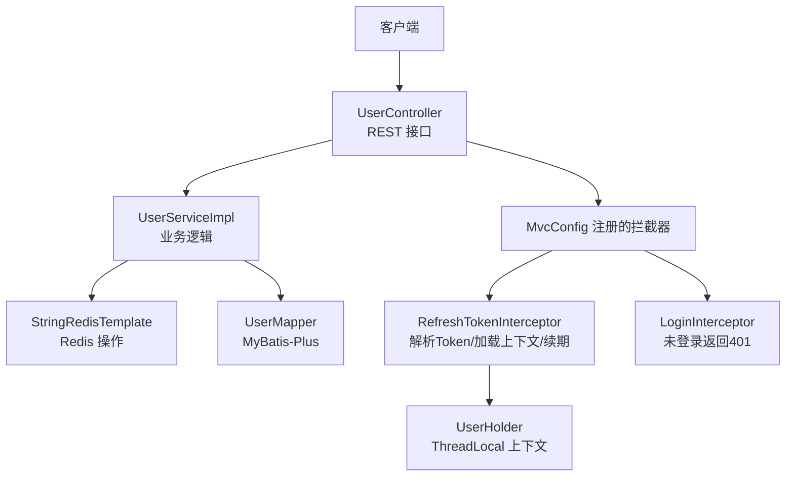
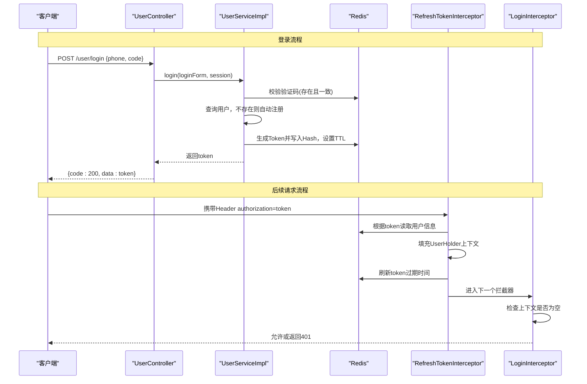
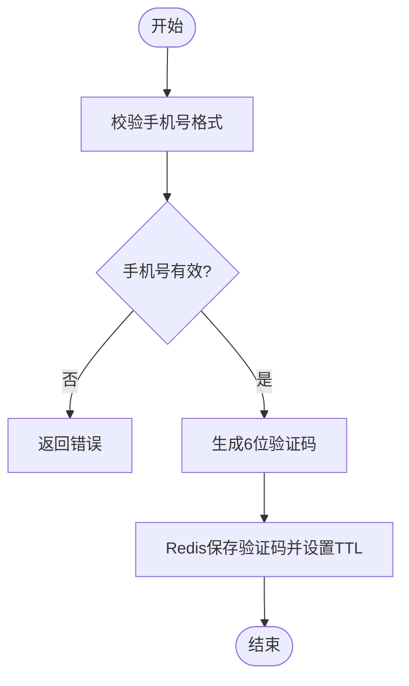
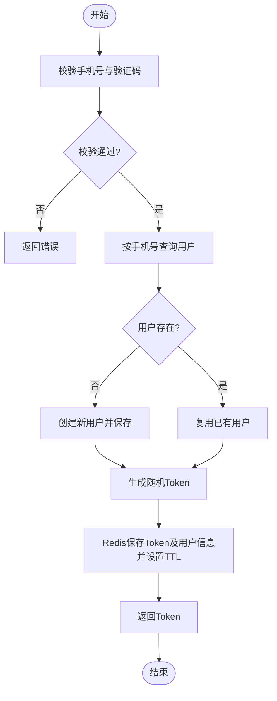
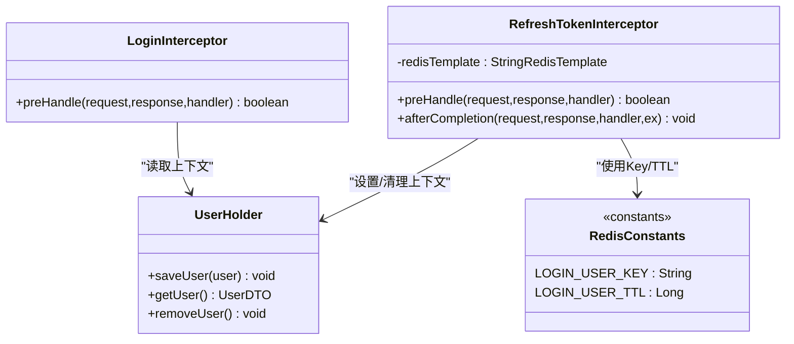
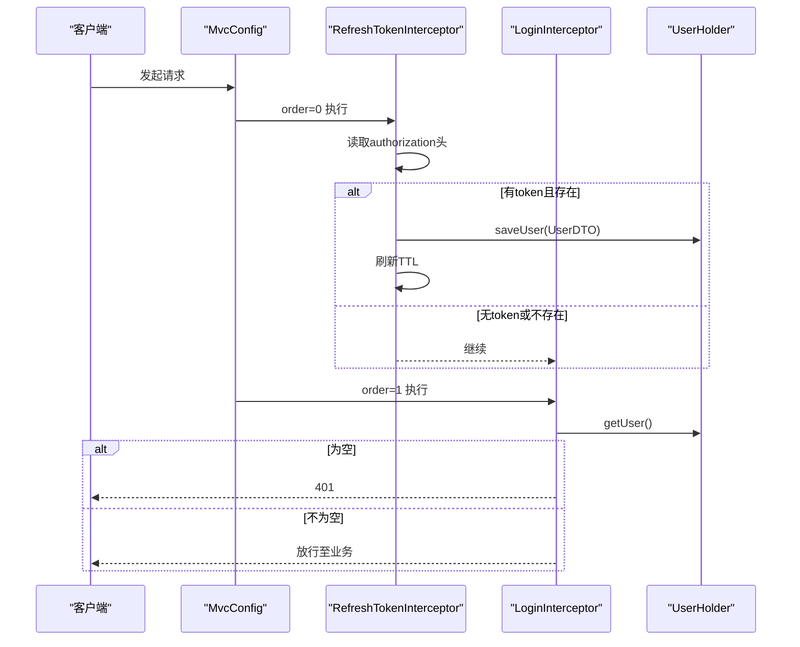
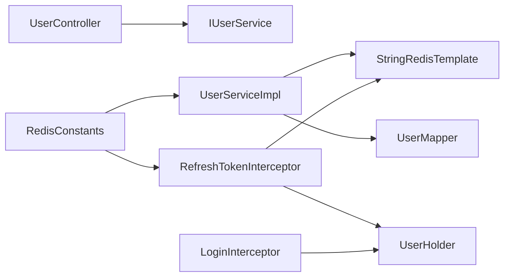

# 用户认证系统

<cite>
**本文引用的文件**   
- [UserController.java](file://src/main/java/com/hmdp/controller/UserController.java)
- [UserServiceImpl.java](file://src/main/java/com/hmdp/service/impl/UserServiceImpl.java)
- [IUserService.java](file://src/main/java/com/hmdp/service/IUserService.java)
- [MvcConfig.java](file://src/main/java/com/hmdp/config/MvcConfig.java)
- [LoginInterceptor.java](file://src/main/java/com/hmdp/utils/LoginInterceptor.java)
- [RefreshTokenInterceptor.java](file://src/main/java/com/hmdp/utils/RefreshTokenInterceptor.java)
- [UserHolder.java](file://src/main/java/com/hmdp/utils/UserHolder.java)
- [RedisConstants.java](file://src/main/java/com/hmdp/utils/RedisConstants.java)
- [LoginFormDTO.java](file://src/main/java/com/hmdp/dto/LoginFormDTO.java)
- [UserDTO.java](file://src/main/java/com/hmdp/dto/UserDTO.java)
- [User.java](file://src/main/java/com/hmdp/entity/User.java)
- [application.yaml](file://src/main/resources/application.yaml)
</cite>

## 目录
1. [简介](#简介)
2. [项目结构](#项目结构)
3. [核心组件](#核心组件)
4. [架构总览](#架构总览)
5. [详细组件分析](#详细组件分析)
6. [依赖关系分析](#依赖关系分析)
7. [性能考虑](#性能考虑)
8. [故障排查指南](#故障排查指南)
9. [结论](#结论)
10. [附录：接口与使用示例](#附录接口与使用示例)

## 简介
本文件围绕用户认证子系统，系统性梳理手机号验证码登录、用户信息管理、会话（Token）管理的实现细节。重点覆盖以下主题：
- 手机号验证码发送与校验流程
- 用户注册与登录流程（无状态 Token 方案）
- 基于 Redis 的 Token 存储与会话续期
- 拦截器链与用户上下文管理
- 常见认证问题定位与优化建议
- 安全最佳实践与性能优化要点

说明：当前实现采用“随机字符串作为 Token”的方案，并非 JWT。文档将如实描述现有实现，并在“安全与演进建议”中给出迁移到标准 JWT 的实践路径。

## 项目结构
认证相关代码主要分布在控制器、服务实现、拦截器配置、工具类与常量定义中：
- 控制器层：暴露验证码发送、登录、获取当前用户、查询用户信息等接口
- 服务层：封装验证码生成与缓存、登录校验、自动注册、Token 生成与持久化
- 拦截器：请求前加载用户上下文并续期；对受保护接口进行鉴权
- 上下文：ThreadLocal 保存当前线程的用户信息
- 常量：Redis Key 前缀与过期时间等

图表来源
- [UserController.java:1-86](file://src/main/java/com/hmdp/controller/UserController.java#L1-L86)
- [UserServiceImpl.java:1-110](file://src/main/java/com/hmdp/service/impl/UserServiceImpl.java#L1-L110)
- [MvcConfig.java:1-34](file://src/main/java/com/hmdp/config/MvcConfig.java#L1-L34)
- [RefreshTokenInterceptor.java:1-51](file://src/main/java/com/hmdp/utils/RefreshTokenInterceptor.java#L1-L51)
- [LoginInterceptor.java:1-31](file://src/main/java/com/hmdp/utils/LoginInterceptor.java#L1-L31)
- [UserHolder.java:1-20](file://src/main/java/com/hmdp/utils/UserHolder.java#L1-L20)
- [UserMapper.java:1-17](file://src/main/java/com/hmdp/mapper/UserMapper.java#L1-L17)

章节来源
- [UserController.java:1-86](file://src/main/java/com/hmdp/controller/UserController.java#L1-L86)
- [UserServiceImpl.java:1-110](file://src/main/java/com/hmdp/service/impl/UserServiceImpl.java#L1-L110)
- [MvcConfig.java:1-34](file://src/main/java/com/hmdp/config/MvcConfig.java#L1-L34)

## 核心组件
- 控制器：提供 /user/code、/user/login、/user/me、/user/info/{id} 等接口
- 服务：实现验证码发送、登录校验、自动注册、Token 生成与存储
- 拦截器：
  - RefreshTokenInterceptor：从请求头读取 Token，加载用户到上下文，并对 Token 续期
  - LoginInterceptor：若上下文无用户则拒绝访问（返回 401）
- 上下文：UserHolder 通过 ThreadLocal 维护当前线程用户信息
- 常量：Redis 键名与 TTL 统一在 RedisConstants 中定义
- DTO/Entity：LoginFormDTO、UserDTO、User 用于数据传输与持久化

章节来源
- [UserController.java:1-86](file://src/main/java/com/hmdp/controller/UserController.java#L1-L86)
- [IUserService.java:1-25](file://src/main/java/com/hmdp/service/IUserService.java#L1-L25)
- [UserServiceImpl.java:1-110](file://src/main/java/com/hmdp/service/impl/UserServiceImpl.java#L1-L110)
- [LoginInterceptor.java:1-31](file://src/main/java/com/hmdp/utils/LoginInterceptor.java#L1-L31)
- [RefreshTokenInterceptor.java:1-51](file://src/main/java/com/hmdp/utils/RefreshTokenInterceptor.java#L1-L51)
- [UserHolder.java:1-20](file://src/main/java/com/hmdp/utils/UserHolder.java#L1-L20)
- [RedisConstants.java:1-25](file://src/main/java/com/hmdp/utils/RedisConstants.java#L1-L25)
- [LoginFormDTO.java:1-11](file://src/main/java/com/hmdp/dto/LoginFormDTO.java#L1-L11)
- [UserDTO.java:1-11](file://src/main/java/com/hmdp/dto/UserDTO.java#L1-L11)
- [User.java:1-67](file://src/main/java/com/hmdp/entity/User.java#L1-L67)

## 架构总览
整体采用“无状态 Token + Redis 存储”的会话方案：
- 登录成功后生成随机 Token，并将用户信息以 Hash 形式存入 Redis，附带过期时间
- 每次请求由 RefreshTokenInterceptor 解析 Token，恢复用户上下文，并刷新过期时间
- 受保护接口由 LoginInterceptor 校验上下文是否存在，不存在则拒绝

图表来源
- [UserController.java:49-70](file://src/main/java/com/hmdp/controller/UserController.java#L49-L70)
- [UserServiceImpl.java:63-100](file://src/main/java/com/hmdp/service/impl/UserServiceImpl.java#L63-L100)
- [RefreshTokenInterceptor.java:25-42](file://src/main/java/com/hmdp/utils/RefreshTokenInterceptor.java#L25-L42)
- [LoginInterceptor.java:22-28](file://src/main/java/com/hmdp/utils/LoginInterceptor.java#L22-L28)

## 详细组件分析

### 验证码发送与校验
- 发送验证码
  - 校验手机号格式
  - 生成6位数字验证码
  - 以 key = "login:code:" + phone 存入 Redis，设置短 TTL
- 登录时校验
  - 从请求体获取 phone 与 code
  - 校验手机号格式
  - 从 Redis 读取对应验证码并比对
  - 不一致则拒绝登录

图表来源
- [UserServiceImpl.java:47-60](file://src/main/java/com/hmdp/service/impl/UserServiceImpl.java#L47-L60)
- [RedisConstants.java:4-7](file://src/main/java/com/hmdp/utils/RedisConstants.java#L4-L7)

章节来源
- [UserServiceImpl.java:47-60](file://src/main/java/com/hmdp/service/impl/UserServiceImpl.java#L47-L60)
- [RedisConstants.java:1-25](file://src/main/java/com/hmdp/utils/RedisConstants.java#L1-L25)

### 登录与自动注册
- 登录流程
  - 校验手机号与验证码
  - 按手机号查询用户，不存在则创建新用户（自动生成昵称）
  - 生成随机 Token，将用户信息转为 Map 后以 Hash 形式写入 Redis，Key 为 "login:token:" + token，设置较长 TTL
  - 返回 Token 给客户端
- 注意
  - 当前实现未使用密码字段，仅支持手机号+验证码登录
  - 自动注册时不设置密码字段

图表来源
- [UserServiceImpl.java:63-100](file://src/main/java/com/hmdp/service/impl/UserServiceImpl.java#L63-L100)
- [UserServiceImpl.java:102-108](file://src/main/java/com/hmdp/service/impl/UserServiceImpl.java#L102-L108)
- [RedisConstants.java:6-7](file://src/main/java/com/hmdp/utils/RedisConstants.java#L6-L7)

章节来源
- [UserServiceImpl.java:63-100](file://src/main/java/com/hmdp/service/impl/UserServiceImpl.java#L63-L100)
- [UserServiceImpl.java:102-108](file://src/main/java/com/hmdp/service/impl/UserServiceImpl.java#L102-L108)
- [User.java:25-67](file://src/main/java/com/hmdp/entity/User.java#L25-L67)

### Token 会话管理与续期
- 存储结构
  - Key 前缀："login:token:"
  - Value：Hash，包含用户基本信息（如 id、nickName、icon）
  - TTL：秒级，默认较长
- 续期策略
  - 每次请求经 RefreshTokenInterceptor 时，若 Token 存在则刷新 TTL
- 登出
  - 当前登出接口未实现，需删除 Redis 中的 Token 记录

图表来源
- [RefreshTokenInterceptor.java:1-51](file://src/main/java/com/hmdp/utils/RefreshTokenInterceptor.java#L1-L51)
- [LoginInterceptor.java:1-31](file://src/main/java/com/hmdp/utils/LoginInterceptor.java#L1-L31)
- [UserHolder.java:1-20](file://src/main/java/com/hmdp/utils/UserHolder.java#L1-L20)
- [RedisConstants.java:6-7](file://src/main/java/com/hmdp/utils/RedisConstants.java#L6-L7)

章节来源
- [RefreshTokenInterceptor.java:25-42](file://src/main/java/com/hmdp/utils/RefreshTokenInterceptor.java#L25-L42)
- [RefreshTokenInterceptor.java:47-49](file://src/main/java/com/hmdp/utils/RefreshTokenInterceptor.java#L47-L49)
- [LoginInterceptor.java:22-28](file://src/main/java/com/hmdp/utils/LoginInterceptor.java#L22-L28)
- [UserHolder.java:8-18](file://src/main/java/com/hmdp/utils/UserHolder.java#L8-L18)
- [RedisConstants.java:6-7](file://src/main/java/com/hmdp/utils/RedisConstants.java#L6-L7)

### 拦截器链与用户上下文
- 拦截器顺序
  - order=0：RefreshTokenInterceptor，负责解析 Token、加载上下文、续期
  - order=1：LoginInterceptor，负责鉴权，未登录返回 401
- 白名单
  - 通过 excludePathPatterns 放行公开接口，如 /user/code、/user/login、/shop/** 等
- 上下文生命周期
  - preHandle：加载用户到 UserHolder
  - afterCompletion：清理 UserHolder，避免内存泄漏

图表来源
- [MvcConfig.java:20-32](file://src/main/java/com/hmdp/config/MvcConfig.java#L20-L32)
- [RefreshTokenInterceptor.java:25-42](file://src/main/java/com/hmdp/utils/RefreshTokenInterceptor.java#L25-L42)
- [LoginInterceptor.java:22-28](file://src/main/java/com/hmdp/utils/LoginInterceptor.java#L22-L28)
- [UserHolder.java:8-18](file://src/main/java/com/hmdp/utils/UserHolder.java#L8-L18)

章节来源
- [MvcConfig.java:20-32](file://src/main/java/com/hmdp/config/MvcConfig.java#L20-L32)
- [RefreshTokenInterceptor.java:25-42](file://src/main/java/com/hmdp/utils/RefreshTokenInterceptor.java#L25-L42)
- [LoginInterceptor.java:22-28](file://src/main/java/com/hmdp/utils/LoginInterceptor.java#L22-L28)
- [UserHolder.java:8-18](file://src/main/java/com/hmdp/utils/UserHolder.java#L8-L18)

### 用户信息管理
- 获取当前用户
  - 接口 /user/me 直接从 UserHolder 取当前用户信息返回
- 查询用户详情
  - 接口 /user/info/{id} 通过 UserInfoService 查询详情，首次查看可能返回空对象

章节来源
- [UserController.java:65-84](file://src/main/java/com/hmdp/controller/UserController.java#L65-L84)

## 依赖关系分析
- 控制器依赖服务接口 IUserService
- 服务实现依赖：
  - StringRedisTemplate 读写 Redis
  - MyBatis-Plus BaseMapper<User> 访问数据库
- 拦截器依赖：
  - StringRedisTemplate 读取/续期 Token
  - UserHolder 存取上下文
- 常量集中管理 Redis Key 与 TTL

图表来源
- [UserController.java:1-86](file://src/main/java/com/hmdp/controller/UserController.java#L1-L86)
- [UserServiceImpl.java:1-110](file://src/main/java/com/hmdp/service/impl/UserServiceImpl.java#L1-L110)
- [RefreshTokenInterceptor.java:1-51](file://src/main/java/com/hmdp/utils/RefreshTokenInterceptor.java#L1-L51)
- [LoginInterceptor.java:1-31](file://src/main/java/com/hmdp/utils/LoginInterceptor.java#L1-L31)
- [RedisConstants.java:1-25](file://src/main/java/com/hmdp/utils/RedisConstants.java#L1-L25)

章节来源
- [UserController.java:1-86](file://src/main/java/com/hmdp/controller/UserController.java#L1-L86)
- [UserServiceImpl.java:1-110](file://src/main/java/com/hmdp/service/impl/UserServiceImpl.java#L1-L110)
- [RefreshTokenInterceptor.java:1-51](file://src/main/java/com/hmdp/utils/RefreshTokenInterceptor.java#L1-L51)
- [LoginInterceptor.java:1-31](file://src/main/java/com/hmdp/utils/LoginInterceptor.java#L1-L31)
- [RedisConstants.java:1-25](file://src/main/java/com/hmdp/utils/RedisConstants.java#L1-L25)

## 性能考虑
- Redis 连接池
  - 应用配置了 Lettuce 连接池参数，建议根据 QPS 调整 max-active/max-idle/min-idle
- 热点 Key 与过期抖动
  - 验证码 TTL 较短，登录 Token TTL 较长，注意避免集中过期导致的雪崩
- 上下文清理
  - afterCompletion 中移除 ThreadLocal，防止线程复用导致的数据污染
- 序列化与字段过滤
  - 全局 Jackson 忽略非空字段，减少响应体积

章节来源
- [application.yaml:11-22](file://src/main/resources/application.yaml#L11-L22)
- [RefreshTokenInterceptor.java:47-49](file://src/main/java/com/hmdp/utils/RefreshTokenInterceptor.java#L47-L49)

## 故障排查指南
- 401 未授权
  - 检查是否携带 authorization 头
  - 确认 Token 未被删除或过期
  - 确认 LoginInterceptor 未被误加入白名单
- 登录失败
  - 验证码错误或已过期：检查 Redis 中验证码 Key 是否存在且一致
  - 手机号格式错误：检查前端传参
- 上下文为空
  - 确认 RefreshTokenInterceptor 先于 LoginInterceptor 执行
  - 确认 afterCompletion 正常清理，避免跨请求污染
- 并发登录
  - 当前实现未限制同一用户多设备登录，如需限制可在登录时检查并踢出旧会话（删除旧 Token）
- 登出不生效
  - 当前登出接口未实现，需在服务端删除 Redis 中的 Token 记录

章节来源
- [LoginInterceptor.java:22-28](file://src/main/java/com/hmdp/utils/LoginInterceptor.java#L22-L28)
- [RefreshTokenInterceptor.java:25-42](file://src/main/java/com/hmdp/utils/RefreshTokenInterceptor.java#L25-L42)
- [UserServiceImpl.java:63-100](file://src/main/java/com/hmdp/service/impl/UserServiceImpl.java#L63-L100)

## 结论
该认证系统采用“手机号验证码 + 随机 Token + Redis 存储”的轻量方案，具备以下特点：
- 简洁易扩展：无需复杂签名算法，适合快速迭代
- 会话可续期：每次请求刷新 TTL，提升用户体验
- 上下文清晰：通过拦截器与 ThreadLocal 解耦业务与鉴权

建议在后续版本中：
- 引入标准 JWT 或更完善的 Token 体系，增强安全性与可审计性
- 完善登出、黑名单、设备绑定与并发登录控制
- 增加限流与风控策略，防范短信轰炸与暴力破解

## 附录：接口与使用示例

### 接口清单
- 发送验证码
  - 方法：POST
  - 路径：/user/code
  - 参数：phone（表单参数）
  - 返回：统一结果对象
- 登录
  - 方法：POST
  - 路径：/user/login
  - 请求体：LoginFormDTO（phone、code）
  - 返回：统一结果对象，data 为 Token
- 获取当前用户
  - 方法：GET
  - 路径：/user/me
  - 头部：authorization=Token
  - 返回：统一结果对象，data 为用户信息
- 查询用户详情
  - 方法：GET
  - 路径：/user/info/{id}
  - 返回：统一结果对象，data 为用户详情（可能为空）

章节来源
- [UserController.java:39-84](file://src/main/java/com/hmdp/controller/UserController.java#L39-L84)
- [LoginFormDTO.java:1-11](file://src/main/java/com/hmdp/dto/LoginFormDTO.java#L1-L11)
- [UserDTO.java:1-11](file://src/main/java/com/hmdp/dto/UserDTO.java#L1-L11)

### 调用示例（概念性步骤）
- 发送验证码
  - 向 /user/code 提交 phone，后端校验并生成验证码存入 Redis
- 登录
  - 向 /user/login 提交 {phone, code}，后端校验通过后返回 Token
- 访问受保护接口
  - 在请求头添加 authorization=Token，后端自动续期并注入用户上下文
- 获取当前用户
  - 调用 /user/me，后端从上下文返回当前用户信息

章节来源
- [UserServiceImpl.java:47-100](file://src/main/java/com/hmdp/service/impl/UserServiceImpl.java#L47-L100)
- [RefreshTokenInterceptor.java:25-42](file://src/main/java/com/hmdp/utils/RefreshTokenInterceptor.java#L25-L42)
- [UserController.java:65-70](file://src/main/java/com/hmdp/controller/UserController.java#L65-L70)

### 安全与演进建议
- 令牌安全
  - 当前为随机字符串，建议升级为标准 JWT 或带签名的短期 Token + 刷新机制
- 传输安全
  - 全站启用 HTTPS，避免 Token 明文传输
- 防刷与风控
  - 对验证码接口实施频率限制与图形验证码
  - 对登录失败次数进行限制与告警
- 会话管理
  - 支持单点登录与多端互踢
  - 完善登出与黑名单机制
- 数据脱敏
  - 日志与响应中避免输出敏感信息

[本节为通用建议，不直接分析具体文件]