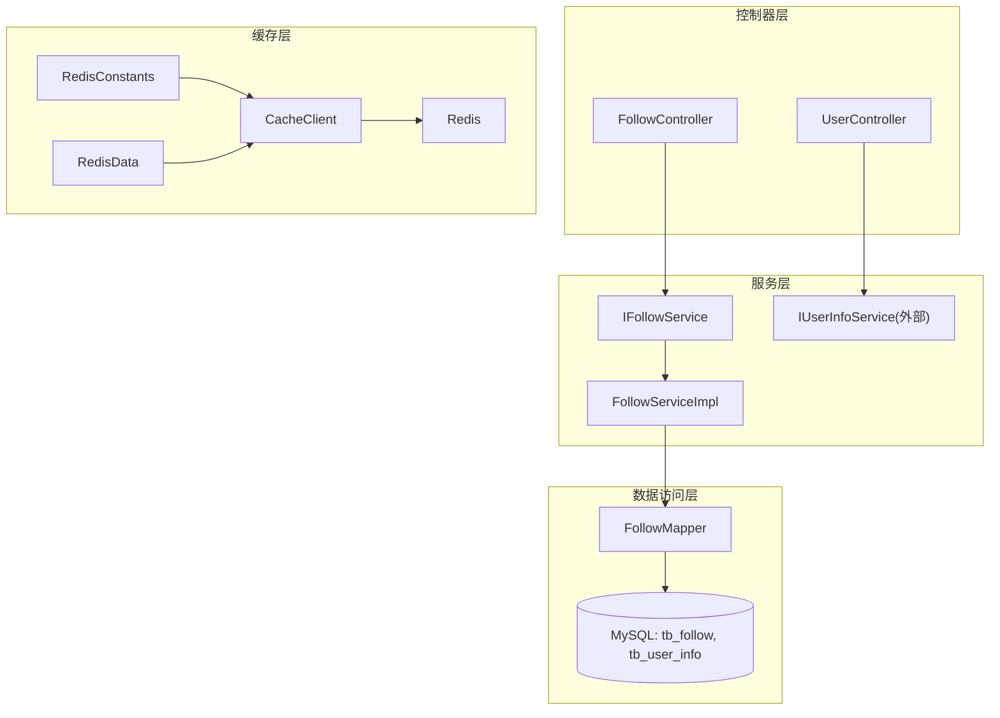
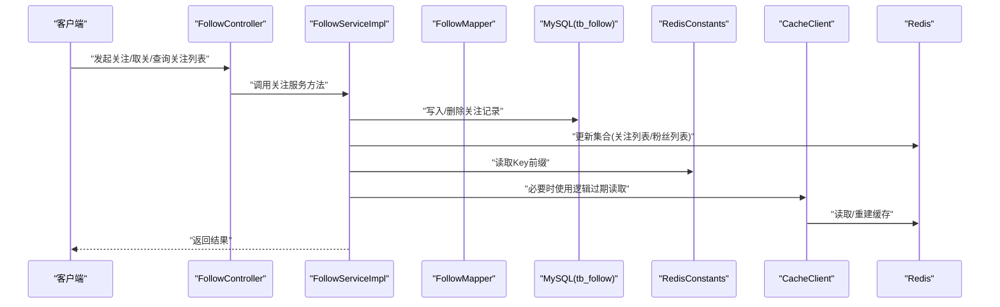
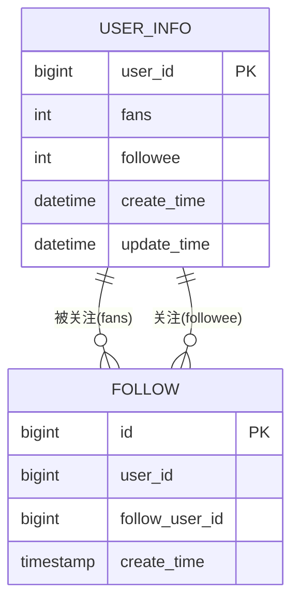
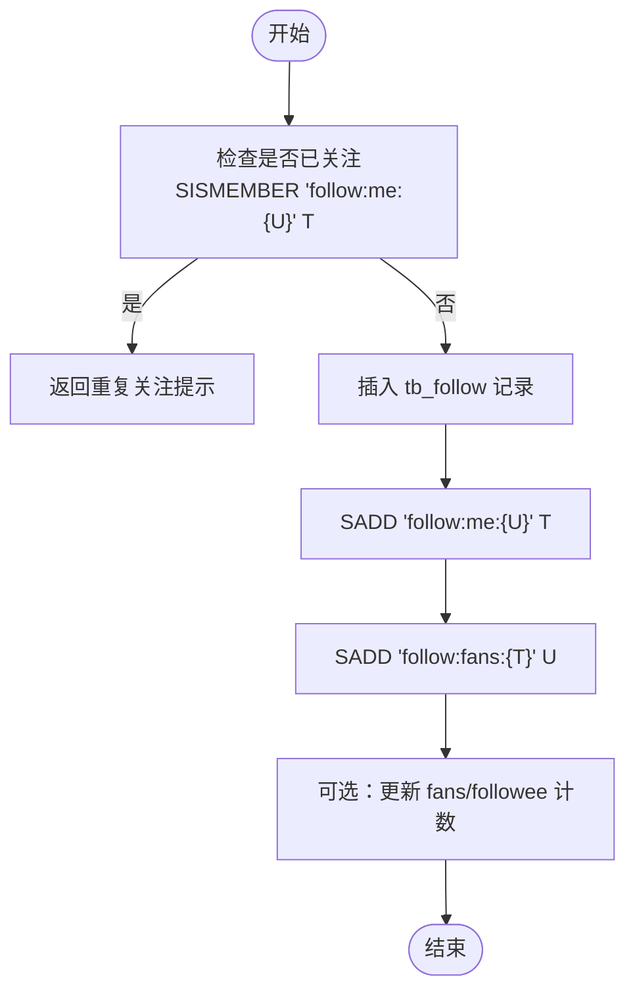
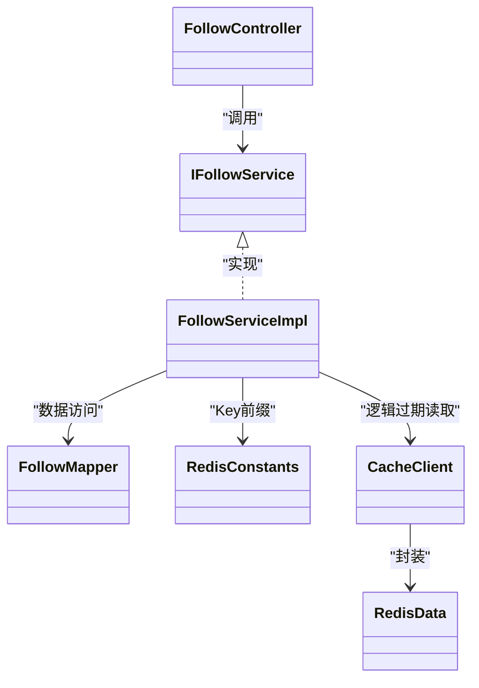

# 社交互动功能

<cite>
**本文引用的文件**   
- [Follow.java](file://src/main/java/com/hmdp/entity/Follow.java)
- [FollowMapper.java](file://src/main/java/com/hmdp/mapper/FollowMapper.java)
- [IFollowService.java](file://src/main/java/com/hmdp/service/IFollowService.java)
- [FollowServiceImpl.java](file://src/main/java/com/hmdp/service/impl/FollowServiceImpl.java)
- [FollowController.java](file://src/main/java/com/hmdp/controller/FollowController.java)
- [UserInfo.java](file://src/main/java/com/hmdp/entity/UserInfo.java)
- [UserController.java](file://src/main/java/com/hmdp/controller/UserController.java)
- [RedisConstants.java](file://src/main/java/com/hmdp/utils/RedisConstants.java)
- [CacheClient.java](file://src/main/java/com/hmdp/utils/CacheClient.java)
- [RedisData.java](file://src/main/java/com/hmdp/utils/RedisData.java)
- [hmdp.sql](file://src/main/resources/db/hmdp.sql)
</cite>

## 目录
1. [简介](#简介)
2. [项目结构](#项目结构)
3. [核心组件](#核心组件)
4. [架构总览](#架构总览)
5. [详细组件分析](#详细组件分析)
6. [依赖分析](#依赖分析)
7. [性能考虑](#性能考虑)
8. [故障排查指南](#故障排查指南)
9. [结论](#结论)
10. [附录](#附录)

## 简介
本文件围绕“社交互动”能力，聚焦用户关注关系的管理、关注列表查询、粉丝动态推送的实现原理与优化方案。结合现有代码与数据库设计，给出：
- 关注关系的数据模型设计与索引策略
- Redis 集合操作与缓存策略（含逻辑过期与异步重建）
- 关注/取消关注的完整流程与一致性保障
- 共同好友计算与推荐关注的算法思路
- 大规模关系网络下的查询性能优化与实时性机制

## 项目结构
本项目采用分层架构：控制器层暴露 REST API，服务层封装业务逻辑，数据访问层基于 MyBatis-Plus，缓存层使用 Spring Data Redis 提供的 StringRedisTemplate，并通过通用工具 CacheClient 提供带逻辑过期的缓存读写模式。

图表来源
- [FollowController.java:1-21](file://src/main/java/com/hmdp/controller/FollowController.java#L1-L21)
- [IFollowService.java:1-17](file://src/main/java/com/hmdp/service/IFollowService.java#L1-L17)
- [FollowServiceImpl.java:1-21](file://src/main/java/com/hmdp/service/impl/FollowServiceImpl.java#L1-L21)
- [FollowMapper.java:1-17](file://src/main/java/com/hmdp/mapper/FollowMapper.java#L1-L17)
- [RedisConstants.java:1-25](file://src/main/java/com/hmdp/utils/RedisConstants.java#L1-L25)
- [CacheClient.java:1-140](file://src/main/java/com/hmdp/utils/CacheClient.java#L1-L140)
- [RedisData.java:1-12](file://src/main/java/com/hmdp/utils/RedisData.java#L1-L12)

章节来源
- [FollowController.java:1-21](file://src/main/java/com/hmdp/controller/FollowController.java#L1-L21)
- [IFollowService.java:1-17](file://src/main/java/com/hmdp/service/IFollowService.java#L1-L17)
- [FollowServiceImpl.java:1-21](file://src/main/java/com/hmdp/service/impl/FollowServiceImpl.java#L1-L21)
- [FollowMapper.java:1-17](file://src/main/java/com/hmdp/mapper/FollowMapper.java#L1-L17)
- [RedisConstants.java:1-25](file://src/main/java/com/hmdp/utils/RedisConstants.java#L1-L25)
- [CacheClient.java:1-140](file://src/main/java/com/hmdp/utils/CacheClient.java#L1-L140)
- [RedisData.java:1-12](file://src/main/java/com/hmdp/utils/RedisData.java#L1-L12)

## 核心组件
- 关注实体与持久化
  - Follow 实体映射到 tb_follow 表，包含主键、userId、followUserId、createTime。
- 关注服务与 Mapper
  - IFollowService 继承 IService<Follow>，FollowServiceImpl 基于 ServiceImpl 提供基础 CRUD。
- 用户信息与统计字段
  - UserInfo 包含 fans、followee 等统计字段，便于快速展示关注数与粉丝数。
- 常量与缓存工具
  - RedisConstants 定义社交相关 Key 前缀（如 blog:liked、feed）。
  - CacheClient 提供带逻辑过期的缓存读取与异步重建能力，适用于热点数据的读多写少场景。

章节来源
- [Follow.java:1-52](file://src/main/java/com/hmdp/entity/Follow.java#L1-L52)
- [FollowServiceImpl.java:1-21](file://src/main/java/com/hmdp/service/impl/FollowServiceImpl.java#L1-L21)
- [UserInfo.java:1-87](file://src/main/java/com/hmdp/entity/UserInfo.java#L1-L87)
- [RedisConstants.java:1-25](file://src/main/java/com/hmdp/utils/RedisConstants.java#L1-L25)
- [CacheClient.java:1-140](file://src/main/java/com/hmdp/utils/CacheClient.java#L1-L140)

## 架构总览
下图展示了关注关系在系统中的关键路径：控制层接收请求，服务层调用 Mapper 更新 MySQL，同时通过 Redis 维护高频的集合视图（如关注列表、粉丝列表、Feed 流），并使用 CacheClient 的通用缓存模式保证热点数据的一致性与可用性。

图表来源
- [FollowController.java:1-21](file://src/main/java/com/hmdp/controller/FollowController.java#L1-L21)
- [FollowServiceImpl.java:1-21](file://src/main/java/com/hmdp/service/impl/FollowServiceImpl.java#L1-L21)
- [FollowMapper.java:1-17](file://src/main/java/com/hmdp/mapper/FollowMapper.java#L1-L17)
- [RedisConstants.java:1-25](file://src/main/java/com/hmdp/utils/RedisConstants.java#L1-L25)
- [CacheClient.java:1-140](file://src/main/java/com/hmdp/utils/CacheClient.java#L1-L140)

## 详细组件分析

### 数据模型与索引设计
- 关注关系表 tb_follow
  - 字段：id、user_id、follow_user_id、create_time
  - 建议索引：
    - 按 user_id 建立索引，用于“我关注的人”列表查询
    - 按 follow_user_id 建立索引，用于“我的粉丝”列表查询
    - 联合索引 (user_id, follow_user_id) 用于唯一性约束与去重判断
- 用户信息表 tb_user_info
  - 字段：fans、followee 等计数字段，适合做前端展示的秒级近似值，避免每次聚合计算

图表来源
- [hmdp.sql:69-78](file://src/main/resources/db/hmdp.sql#L69-L78)
- [UserInfo.java:1-87](file://src/main/java/com/hmdp/entity/UserInfo.java#L1-L87)

章节来源
- [hmdp.sql:69-78](file://src/main/resources/db/hmdp.sql#L69-L78)
- [UserInfo.java:1-87](file://src/main/java/com/hmdp/entity/UserInfo.java#L1-L87)

### Redis 集合与 Key 设计
- 关注集合
  - 我关注的人：key = "follow:me:{userId}"，set/fetch/srem
  - 我的粉丝：key = "follow:fans:{userId}"，sadd/smembers/srem
- 共同好友
  - key = "common:{userIdA}:{userIdB}"，sinter
- Feed 流
  - key = "feed:{userId}"，zset（score=发布时间），用于拉取最近动态
- 点赞集合（参考已有常量）
  - blog:liked:{blogId}，用于判断是否已点赞

章节来源
- [RedisConstants.java:1-25](file://src/main/java/com/hmdp/utils/RedisConstants.java#L1-L25)

### 关注/取消关注流程
- 关注
  1) 校验幂等：检查集合中是否存在目标用户
  2) 事务内写入 tb_follow
  3) 同步更新 Redis：
     - sadd "follow:me:{当前用户}" 目标用户
     - sadd "follow:fans:{目标用户}" 当前用户
  4) 可选：增量更新 tb_user_info.followee/fans（允许最终一致）
- 取消关注
  1) 校验存在性
  2) 删除 tb_follow 记录
  3) srem 对应集合
  4) 可选：回滚计数

图表来源
- [FollowServiceImpl.java:1-21](file://src/main/java/com/hmdp/service/impl/FollowServiceImpl.java#L1-L21)
- [FollowMapper.java:1-17](file://src/main/java/com/hmdp/mapper/FollowMapper.java#L1-L17)
- [RedisConstants.java:1-25](file://src/main/java/com/hmdp/utils/RedisConstants.java#L1-L25)

章节来源
- [FollowServiceImpl.java:1-21](file://src/main/java/com/hmdp/service/impl/FollowServiceImpl.java#L1-L21)
- [FollowMapper.java:1-17](file://src/main/java/com/hmdp/mapper/FollowMapper.java#L1-L17)
- [RedisConstants.java:1-25](file://src/main/java/com/hmdp/utils/RedisConstants.java#L1-L25)

### 关注列表与粉丝列表查询
- 读路径优先走 Redis：
  - SMEMBERS "follow:me:{userId}" / "follow:fans:{userId}"
- 降级路径：
  - 若集合缺失或为空，从 tb_follow 按 user_id/follow_user_id 查询并回填集合
- 分页与游标：
  - 对大集合使用 SSORT + 分页，或改用 ZSET 以时间排序

章节来源
- [RedisConstants.java:1-25](file://src/main/java/com/hmdp/utils/RedisConstants.java#L1-L25)

### 共同好友计算
- 使用 SINTER 计算两个用户的交集
- 结果可缓存为 "common:{A}:{B}"，设置较短 TTL，避免频繁计算

章节来源
- [RedisConstants.java:1-25](file://src/main/java/com/hmdp/utils/RedisConstants.java#L1-L25)

### 推荐关注算法
- 冷启动：热门用户、同城用户、同兴趣标签用户
- 协同过滤：基于共同关注集合的相似度（Jaccard）
- 图遍历：二跳扩展（关注的人的关注者），限制候选集规模
- 特征打分：活跃度、内容质量、互动率、距离等
- 在线/离线混合：离线批量生成候选，在线实时微调

### 粉丝动态推送（Feed 流）
- 推拉结合
  - 写扩散（Push）：发布时向粉丝的 feed:{userId} zset 追加
  - 拉取（Pull）：用户打开首页时从自己的 feed 拉取
- 大 V 优化：对超大粉丝量账号采用 Pull 为主，减少 fanout 成本
- 去重与合并：按 userId+blogId 去重，保留最新一条
- 分页：基于 score 的时间戳进行范围查询

章节来源
- [RedisConstants.java:1-25](file://src/main/java/com/hmdp/utils/RedisConstants.java#L1-L25)

### 缓存策略与一致性
- 逻辑过期与异步重建
  - 使用 CacheClient.queryWithLogicalExpire 实现“读时检测过期 + 后台线程重建”，避免雪崩
- 双写一致性
  - 先写库再删/更新缓存；或采用延迟双删
  - 对集合类操作，确保原子性（SADD/SREM）
- 容错与降级
  - 缓存不可用时回源 DB；集合为空时从 DB 回填

章节来源
- [CacheClient.java:1-140](file://src/main/java/com/hmdp/utils/CacheClient.java#L1-L140)
- [RedisData.java:1-12](file://src/main/java/com/hmdp/utils/RedisData.java#L1-L12)

### 接口与入口
- FollowController 预留了 /follow 路由，后续可在其中实现关注、取关、列表、共同好友、推荐等接口
- UserController 提供了用户信息与登录态获取，可作为社交功能的鉴权上下文

章节来源
- [FollowController.java:1-21](file://src/main/java/com/hmdp/controller/FollowController.java#L1-L21)
- [UserController.java:1-86](file://src/main/java/com/hmdp/controller/UserController.java#L1-L86)

## 依赖分析
- 模块耦合
  - FollowController 仅作为路由入口，无具体实现
  - FollowServiceImpl 继承通用 ServiceImpl，依赖 FollowMapper 访问数据库
  - 缓存相关由 RedisConstants 与 CacheClient 提供统一支撑
- 外部依赖
  - Spring Data Redis（StringRedisTemplate）
  - MyBatis-Plus（BaseMapper/IService）

图表来源
- [FollowController.java:1-21](file://src/main/java/com/hmdp/controller/FollowController.java#L1-L21)
- [IFollowService.java:1-17](file://src/main/java/com/hmdp/service/IFollowService.java#L1-L17)
- [FollowServiceImpl.java:1-21](file://src/main/java/com/hmdp/service/impl/FollowServiceImpl.java#L1-L21)
- [FollowMapper.java:1-17](file://src/main/java/com/hmdp/mapper/FollowMapper.java#L1-L17)
- [RedisConstants.java:1-25](file://src/main/java/com/hmdp/utils/RedisConstants.java#L1-L25)
- [CacheClient.java:1-140](file://src/main/java/com/hmdp/utils/CacheClient.java#L1-L140)
- [RedisData.java:1-12](file://src/main/java/com/hmdp/utils/RedisData.java#L1-L12)

## 性能考虑
- 读多写少场景优先走 Redis 集合，降低 DB 压力
- 大 V 用户采用 Pull 模式构建 Feed，避免 Fan-out 爆炸
- 使用 ZSET 存储 Feed，支持按时间高效分页
- 对热点集合设置合理 TTL，并结合逻辑过期与异步重建提升可用性
- 关注/取关操作尽量原子化，避免并发导致集合不一致
- 计数字段 fans/followee 允许最终一致，避免强一致带来的写放大

## 故障排查指南
- 关注状态不一致
  - 核对 Redis 集合与 DB 记录是否一致，必要时执行回填脚本
- 关注列表为空
  - 检查集合 Key 是否存在，确认是否被误删或过期
- 推荐/共同好友计算慢
  - 评估集合规模，必要时限制候选集或使用布隆过滤器预筛
- 缓存雪崩
  - 检查逻辑过期配置与后台重建线程池大小，避免集中重建

章节来源
- [CacheClient.java:1-140](file://src/main/java/com/hmdp/utils/CacheClient.java#L1-L140)
- [RedisConstants.java:1-25](file://src/main/java/com/hmdp/utils/RedisConstants.java#L1-L25)

## 结论
通过将关注关系的核心集合落盘于 Redis，并以 MySQL 作为权威持久化，配合逻辑过期与异步重建的缓存策略，可以在高并发下获得低延迟的社交体验。针对大 V 与海量关系网络，采用推拉结合的 Feed 流与合理的索引与 Key 设计，可有效缓解查询与写入瓶颈。后续可在 FollowController 中补齐关注、取关、列表、共同好友与推荐等接口，形成完整的社交闭环。

## 附录
- 常用 Key 命名建议
  - follow:me:{userId}
  - follow:fans:{userId}
  - common:{userIdA}:{userIdB}
  - feed:{userId}
  - blog:liked:{blogId}

章节来源
- [RedisConstants.java:1-25](file://src/main/java/com/hmdp/utils/RedisConstants.java#L1-L25)