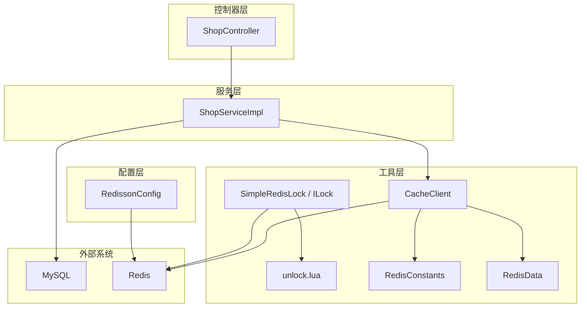
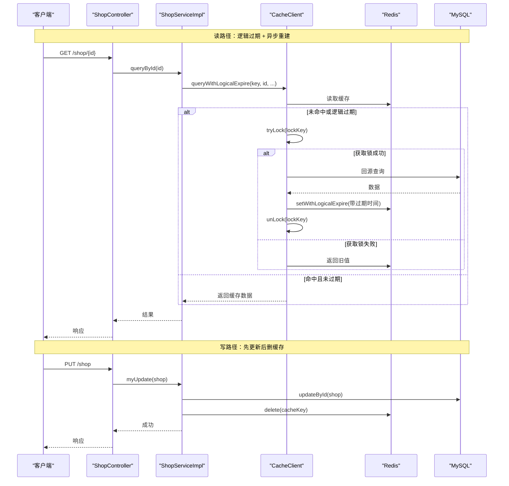
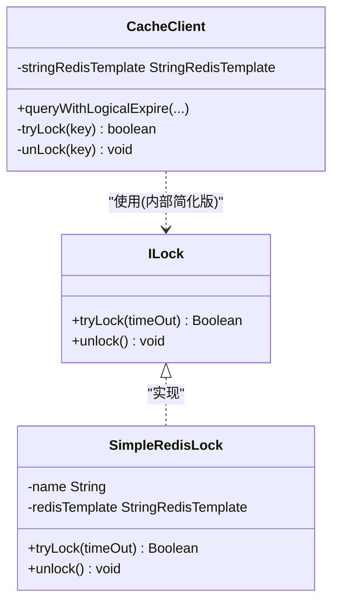
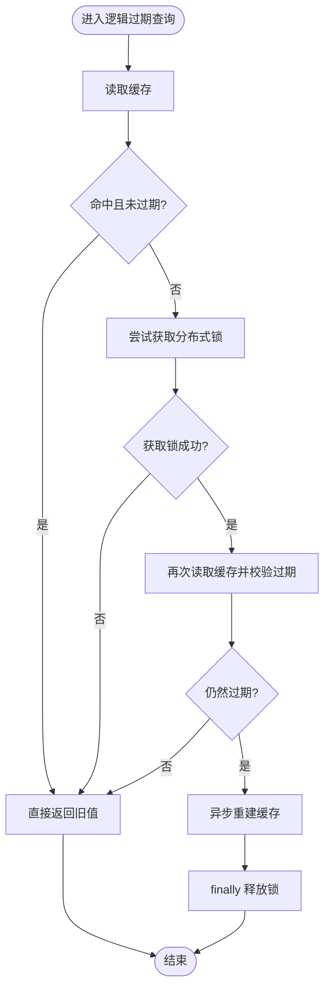
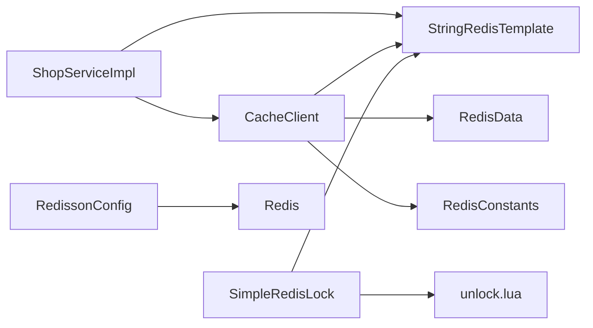

# 缓存一致性保障

<cite>
**本文引用的文件列表**
- [CacheClient.java](file://src/main/java/com/hmdp/utils/CacheClient.java)
- [SimpleRedisLock.java](file://src/main/java/com/hmdp/utils/SimpleRedisLock.java)
- [ILock.java](file://src/main/java/com/hmdp/utils/ILock.java)
- [ShopServiceImpl.java](file://src/main/java/com/hmdp/service/impl/ShopServiceImpl.java)
- [ShopController.java](file://src/main/java/com/hmdp/controller/ShopController.java)
- [IShopService.java](file://src/main/java/com/hmdp/service/IShopService.java)
- [unlock.lua](file://src/main/resources/unlock.lua)
- [RedisConstants.java](file://src/main/java/com/hmdp/utils/RedisConstants.java)
- [RedisData.java](file://src/main/java/com/hmdp/utils/RedisData.java)
- [RedissonConfig.java](file://src/main/java/com/hmdp/config/RedissonConfig.java)
</cite>

## 目录
1. [简介](#简介)
2. [项目结构](#项目结构)
3. [核心组件](#核心组件)
4. [架构总览](#架构总览)
5. [详细组件分析](#详细组件分析)
6. [依赖关系分析](#依赖关系分析)
7. [性能考量](#性能考量)
8. [故障排查指南](#故障排查指南)
9. [结论](#结论)
10. [附录](#附录)

## 简介
本文件围绕 my-hbdp 项目的缓存一致性保障机制展开，重点说明分布式锁在缓存更新中的应用、先删缓存还是先更新数据库的策略选择、缓存更新的时序问题与解决方案、最终一致性模型在项目中的落地方式，并提供事务处理与补偿机制的实现方案。文档以仓库中现有实现为依据，结合代码级图示进行讲解，帮助读者快速理解并正确扩展相关能力。

## 项目结构
本项目采用分层架构：控制器层接收请求，服务层封装业务逻辑，工具层提供缓存与分布式锁能力，配置层管理 Redis/Redisson 客户端。与缓存一致性相关的核心位置如下：
- 工具层：缓存读写与逻辑过期、分布式锁（基于 Redis 的简单实现）
- 服务层：商铺查询与更新流程，体现“先更新后删缓存”的一致性策略
- 配置层：Redisson 客户端初始化（为后续更完善的锁能力预留）

图表来源
- [ShopController.java:1-101](file://src/main/java/com/hmdp/controller/ShopController.java#L1-L101)
- [ShopServiceImpl.java:1-61](file://src/main/java/com/hmdp/service/impl/ShopServiceImpl.java#L1-L61)
- [CacheClient.java:1-140](file://src/main/java/com/hmdp/utils/CacheClient.java#L1-L140)
- [SimpleRedisLock.java:1-56](file://src/main/java/com/hmdp/utils/SimpleRedisLock.java#L1-L56)
- [unlock.lua:1-5](file://src/main/resources/unlock.lua#L1-L5)
- [RedisConstants.java:1-25](file://src/main/java/com/hmdp/utils/RedisConstants.java#L1-L25)
- [RedisData.java:1-12](file://src/main/java/com/hmdp/utils/RedisData.java#L1-L12)
- [RedissonConfig.java:1-18](file://src/main/java/com/hmdp/config/RedissonConfig.java#L1-L18)

章节来源
- [ShopController.java:1-101](file://src/main/java/com/hmdp/controller/ShopController.java#L1-L101)
- [ShopServiceImpl.java:1-61](file://src/main/java/com/hmdp/service/impl/ShopServiceImpl.java#L1-L61)
- [CacheClient.java:1-140](file://src/main/java/com/hmdp/utils/CacheClient.java#L1-L140)
- [SimpleRedisLock.java:1-56](file://src/main/java/com/hmdp/utils/SimpleRedisLock.java#L1-L56)
- [unlock.lua:1-5](file://src/main/resources/unlock.lua#L1-L5)
- [RedisConstants.java:1-25](file://src/main/java/com/hmdp/utils/RedisConstants.java#L1-L25)
- [RedisData.java:1-12](file://src/main/java/com/hmdp/utils/RedisData.java#L1-L12)
- [RedissonConfig.java:1-18](file://src/main/java/com/hmdp/config/RedissonConfig.java#L1-L18)

## 核心组件
- 缓存客户端 CacheClient
  - 提供透传式查询与逻辑过期查询两种模式；后者通过“逻辑过期 + 后台重建 + 轻量分布式锁”避免缓存击穿。
  - 内部使用 tryLock/unLock 方法保护热点数据重建过程。
- 分布式锁 SimpleRedisLock
  - 基于 Redis SETNX + Lua 脚本的原子性释放，具备线程归属标识，防止误删他人锁。
  - 接口 ILock 定义 tryLock/unlock 契约。
- 商铺服务 ShopServiceImpl
  - 读路径：调用 CacheClient 的逻辑过期查询。
  - 写路径：先更新数据库，再删除对应缓存键，形成“先更新后删缓存”的最终一致性策略。
- 常量与数据结构
  - RedisConstants 集中定义缓存键前缀与超时时间。
  - RedisData 用于包装逻辑过期时间与实际数据。
- 配置 RedissonConfig
  - 初始化 Redisson 客户端，便于未来引入更高级的锁特性（如看门狗）。

章节来源
- [CacheClient.java:1-140](file://src/main/java/com/hmdp/utils/CacheClient.java#L1-L140)
- [SimpleRedisLock.java:1-56](file://src/main/java/com/hmdp/utils/SimpleRedisLock.java#L1-L56)
- [ILock.java:1-7](file://src/main/java/com/hmdp/utils/ILock.java#L1-L7)
- [ShopServiceImpl.java:1-61](file://src/main/java/com/hmdp/service/impl/ShopServiceImpl.java#L1-L61)
- [RedisConstants.java:1-25](file://src/main/java/com/hmdp/utils/RedisConstants.java#L1-L25)
- [RedisData.java:1-12](file://src/main/java/com/hmdp/utils/RedisData.java#L1-L12)
- [RedissonConfig.java:1-18](file://src/main/java/com/hmdp/config/RedissonConfig.java#L1-L18)

## 架构总览
下图展示了读路径（逻辑过期 + 异步重建）与写路径（先更新后删缓存）的整体交互。

图表来源
- [ShopController.java:34-61](file://src/main/java/com/hmdp/controller/ShopController.java#L34-L61)
- [ShopServiceImpl.java:36-58](file://src/main/java/com/hmdp/service/impl/ShopServiceImpl.java#L36-L58)
- [CacheClient.java:64-127](file://src/main/java/com/hmdp/utils/CacheClient.java#L64-L127)
- [CacheClient.java:129-136](file://src/main/java/com/hmdp/utils/CacheClient.java#L129-L136)

## 详细组件分析

### 分布式锁实现与使用
- 接口与实现
  - ILock 定义 tryLock/unlock 两个方法。
  - SimpleRedisLock 使用 Redis SETNX 设置带过期时间的锁，并以线程唯一 ID 作为锁值；解锁通过 Lua 脚本原子判断并删除，避免误删其他线程持有的锁。
- 在缓存重建中的应用
  - CacheClient.queryWithLogicalExpire 在检测到逻辑过期时尝试获取锁，成功后执行双检（Double-Check），若仍过期则提交异步任务重建缓存，并在 finally 中释放锁。
  - 该设计有效缓解热点数据失效时的并发重建压力，同时保证只由一个线程真正执行重建。

图表来源
- [ILock.java:1-7](file://src/main/java/com/hmdp/utils/ILock.java#L1-L7)
- [SimpleRedisLock.java:1-56](file://src/main/java/com/hmdp/utils/SimpleRedisLock.java#L1-L56)
- [CacheClient.java:129-136](file://src/main/java/com/hmdp/utils/CacheClient.java#L129-L136)

章节来源
- [ILock.java:1-7](file://src/main/java/com/hmdp/utils/ILock.java#L1-L7)
- [SimpleRedisLock.java:1-56](file://src/main/java/com/hmdp/utils/SimpleRedisLock.java#L1-L56)
- [unlock.lua:1-5](file://src/main/resources/unlock.lua#L1-L5)
- [CacheClient.java:64-127](file://src/main/java/com/hmdp/utils/CacheClient.java#L64-L127)

### 缓存更新策略：先删还是先更？
- 当前实现
  - 写路径采用“先更新数据库，再删除缓存”的策略。
  - 读路径采用“逻辑过期 + 异步重建”，当缓存逻辑过期时，由持有锁的线程从数据库重建并写入新缓存。
- 为什么选择“先更新后删”
  - 在高并发场景下，“先删后更”存在脏读风险：A 线程删除缓存后，B 线程读到空缓存回源得到旧数据写入缓存，随后 A 才完成数据库更新，导致缓存长期不一致。
  - “先更新后删”能最大限度降低不一致窗口，但仍有极端时序下的短暂不一致可能，因此需要配合“逻辑过期 + 异步重建”来兜底。
- 何时考虑“先删后更”
  - 对强一致要求极高且可接受更高延迟的场景，可在事务内先删缓存，再更新数据库，并通过消息队列重试确保删除成功。但需评估幂等与重复删除的影响。

章节来源
- [ShopServiceImpl.java:47-58](file://src/main/java/com/hmdp/service/impl/ShopServiceImpl.java#L47-L58)
- [CacheClient.java:64-127](file://src/main/java/com/hmdp/utils/CacheClient.java#L64-L127)

### 缓存更新的时序问题与解决方案
- 典型时序问题
  - 并发重建：多个线程同时发现逻辑过期，若无锁保护，将产生多次回源与覆盖写入。
  - 锁误删：普通删除无法区分锁持有者，可能导致提前释放他人锁。
  - 过期抖动：大量热点数据在同一时刻过期，引发雪崩。
- 解决方案
  - 逻辑过期：在缓存中记录逻辑过期时间，读时判断是否过期，不依赖 Redis 物理 TTL。
  - 分布式锁：仅允许一个线程执行重建，其余线程返回旧值，避免雪崩与重复回源。
  - 双检机制：获取锁后再次检查缓存状态，避免重复工作。
  - 异步重建：使用线程池异步执行重建，缩短主链路延迟。
  - 原子解锁：Lua 脚本保证“判等+删除”的原子性，避免误删。

图表来源
- [CacheClient.java:64-127](file://src/main/java/com/hmdp/utils/CacheClient.java#L64-L127)
- [CacheClient.java:129-136](file://src/main/java/com/hmdp/utils/CacheClient.java#L129-L136)

章节来源
- [CacheClient.java:64-127](file://src/main/java/com/hmdp/utils/CacheClient.java#L64-L127)
- [CacheClient.java:129-136](file://src/main/java/com/hmdp/utils/CacheClient.java#L129-L136)

### 最终一致性模型在项目中的应用
- 读路径
  - 逻辑过期使缓存具备“软过期”能力，即使物理 TTL 未到，也可按业务语义触发重建。
  - 异步重建保证高可用与低延迟，短期不一致被容忍。
- 写路径
  - 先更新数据库，再删除缓存，使得下一次读能够拉取最新数据。
  - 若删除失败，可通过重试或补偿机制恢复。
- 适用场景
  - 对实时性要求不高、可接受秒级不一致的业务（如店铺详情、商品详情等）。

章节来源
- [ShopServiceImpl.java:36-58](file://src/main/java/com/hmdp/service/impl/ShopServiceImpl.java#L36-L58)
- [CacheClient.java:64-127](file://src/main/java/com/hmdp/utils/CacheClient.java#L64-L127)

### 代码示例路径（不同一致性策略）
- 先更新后删（当前实现）
  - 更新入口与服务实现：[ShopController.java:57-61](file://src/main/java/com/hmdp/controller/ShopController.java#L57-L61)、[ShopServiceImpl.java:47-58](file://src/main/java/com/hmdp/service/impl/ShopServiceImpl.java#L47-L58)
  - 读路径（逻辑过期 + 异步重建）：[CacheClient.java:64-127](file://src/main/java/com/hmdp/utils/CacheClient.java#L64-L127)
- 先删后更（建议参考思路）
  - 建议在事务内先删除缓存，再更新数据库；若删除失败，通过消息队列重试删除，确保最终一致性。
  - 注意幂等性与重复删除的安全性。

章节来源
- [ShopController.java:57-61](file://src/main/java/com/hmdp/controller/ShopController.java#L57-L61)
- [ShopServiceImpl.java:47-58](file://src/main/java/com/hmdp/service/impl/ShopServiceImpl.java#L47-L58)
- [CacheClient.java:64-127](file://src/main/java/com/hmdp/utils/CacheClient.java#L64-L127)

### 事务处理与补偿机制
- 本地事务 + 异步删除
  - 在数据库事务提交后，发送“删除缓存”事件到消息队列，消费者负责删除缓存。
  - 优点：解耦、可重试、可观测。
  - 注意：需保证幂等与顺序性，避免重复删除造成抖动。
- 事务消息（如 RocketMQ）
  - 半消息 + 本地事务 + 回调确认，确保“数据库变更”和“删除缓存”两阶段最终一致。
- 补偿任务
  - 定时扫描不一致数据（例如比对缓存与数据库版本字段），主动修复。
- 异常与重试
  - 删除失败应纳入监控与告警，支持指数退避重试。
  - 对于关键路径，可增加死信队列与人工介入通道。

[本节为通用方案说明，不直接分析具体文件]

## 依赖关系分析
- 组件耦合
  - ShopServiceImpl 依赖 CacheClient 与 StringRedisTemplate。
  - CacheClient 依赖 StringRedisTemplate、RedisData、RedisConstants。
  - SimpleRedisLock 依赖 StringRedisTemplate 与 unlock.lua。
- 外部依赖
  - Redis：存储缓存与分布式锁。
  - MySQL：持久化数据。
  - Redisson：已配置客户端，可用于替换或增强锁能力（如看门狗自动续期）。

图表来源
- [ShopServiceImpl.java:1-61](file://src/main/java/com/hmdp/service/impl/ShopServiceImpl.java#L1-L61)
- [CacheClient.java:1-140](file://src/main/java/com/hmdp/utils/CacheClient.java#L1-L140)
- [SimpleRedisLock.java:1-56](file://src/main/java/com/hmdp/utils/SimpleRedisLock.java#L1-L56)
- [unlock.lua:1-5](file://src/main/resources/unlock.lua#L1-L5)
- [RedissonConfig.java:1-18](file://src/main/java/com/hmdp/config/RedissonConfig.java#L1-L18)

章节来源
- [ShopServiceImpl.java:1-61](file://src/main/java/com/hmdp/service/impl/ShopServiceImpl.java#L1-L61)
- [CacheClient.java:1-140](file://src/main/java/com/hmdp/utils/CacheClient.java#L1-L140)
- [SimpleRedisLock.java:1-56](file://src/main/java/com/hmdp/utils/SimpleRedisLock.java#L1-L56)
- [RedissonConfig.java:1-18](file://src/main/java/com/hmdp/config/RedissonConfig.java#L1-L18)

## 性能考量
- 读路径优化
  - 逻辑过期避免物理 TTL 带来的抖动与雪崩。
  - 异步重建减少主链路阻塞。
  - 分布式锁避免重复回源。
- 写路径优化
  - 先更新后删减少不一致窗口。
  - 删除操作可加入批量与去重策略。
- 资源控制
  - 合理设置线程池大小，避免过多重建任务导致 Redis 与数据库压力上升。
  - 针对热点 Key 可考虑本地缓存（如 Caffeine）做二级缓存，进一步降低 Redis 压力。

[本节为通用指导，不直接分析具体文件]

## 故障排查指南
- 常见问题
  - 缓存击穿：热点 Key 过期瞬间大量请求回源。检查是否启用分布式锁与双检逻辑。
  - 锁误删：非持有者释放了锁。检查解锁是否使用 Lua 脚本且携带线程标识。
  - 重建失败：异步任务抛异常导致缓存未更新。检查线程池异常捕获与日志。
  - 删除失败：写路径删除缓存失败导致不一致。接入重试与监控。
- 定位手段
  - 查看 Redis 键是否存在及 TTL。
  - 观察应用日志中 tryLock/unLock 与重建任务的执行情况。
  - 对比数据库与缓存数据，验证最终一致性。

章节来源
- [CacheClient.java:64-127](file://src/main/java/com/hmdp/utils/CacheClient.java#L64-L127)
- [CacheClient.java:129-136](file://src/main/java/com/hmdp/utils/CacheClient.java#L129-L136)
- [SimpleRedisLock.java:31-44](file://src/main/java/com/hmdp/utils/SimpleRedisLock.java#L31-L44)
- [unlock.lua:1-5](file://src/main/resources/unlock.lua#L1-L5)

## 结论
本项目通过“逻辑过期 + 分布式锁 + 异步重建”的组合，实现了高性能与高可用的读路径；写路径采用“先更新后删缓存”的最终一致性策略，兼顾一致性与性能。对于更高一致性的需求，可引入事务消息与补偿机制，进一步提升可靠性。Redisson 客户端已就绪，便于后续引入更强大的锁特性。

[本节为总结，不直接分析具体文件]

## 附录
- 关键常量与数据结构
  - 缓存键前缀与超时：[RedisConstants.java:11-17](file://src/main/java/com/hmdp/utils/RedisConstants.java#L11-L17)
  - 逻辑过期数据结构：[RedisData.java:7-11](file://src/main/java/com/hmdp/utils/RedisData.java#L7-L11)
- 配置信息
  - Redisson 客户端地址与密码：[RedissonConfig.java:12-16](file://src/main/java/com/hmdp/config/RedissonConfig.java#L12-L16)

章节来源
- [RedisConstants.java:11-17](file://src/main/java/com/hmdp/utils/RedisConstants.java#L11-L17)
- [RedisData.java:7-11](file://src/main/java/com/hmdp/utils/RedisData.java#L7-L11)
- [RedissonConfig.java:12-16](file://src/main/java/com/hmdp/config/RedissonConfig.java#L12-L16)