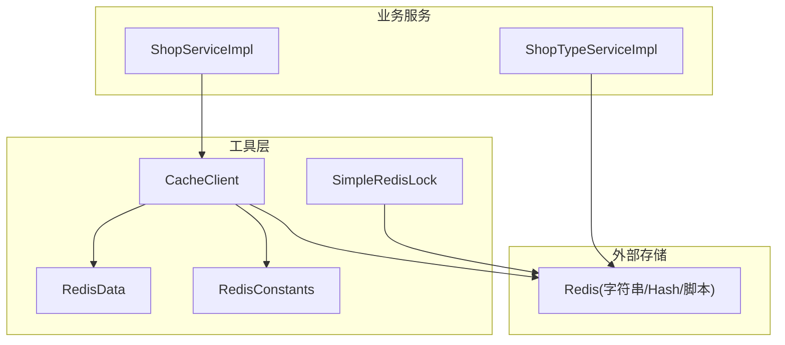
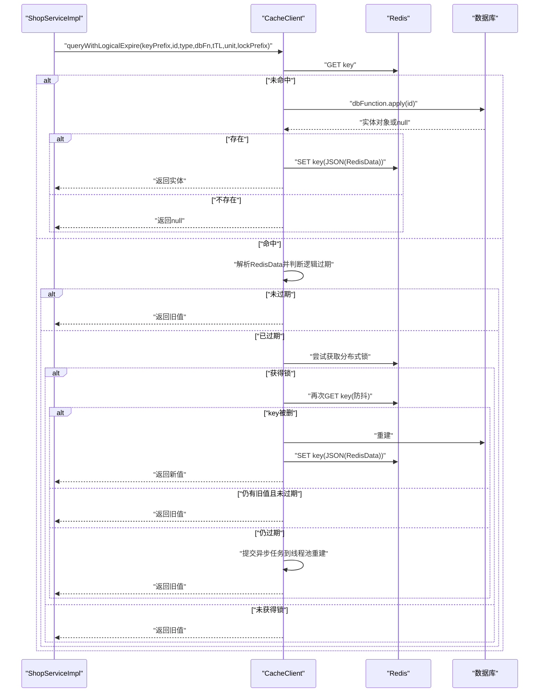
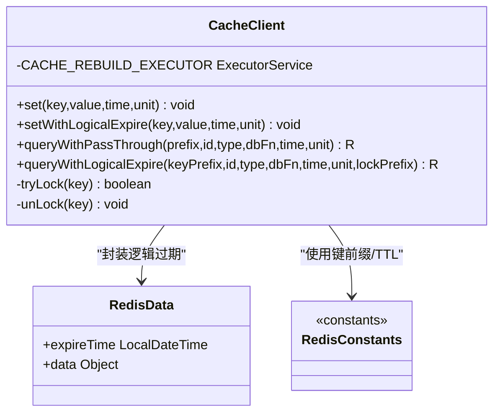
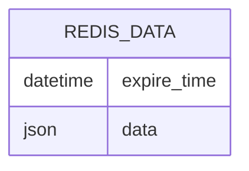
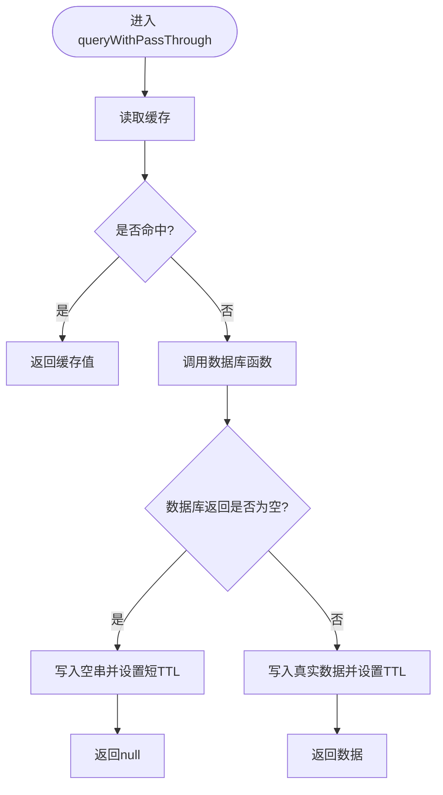
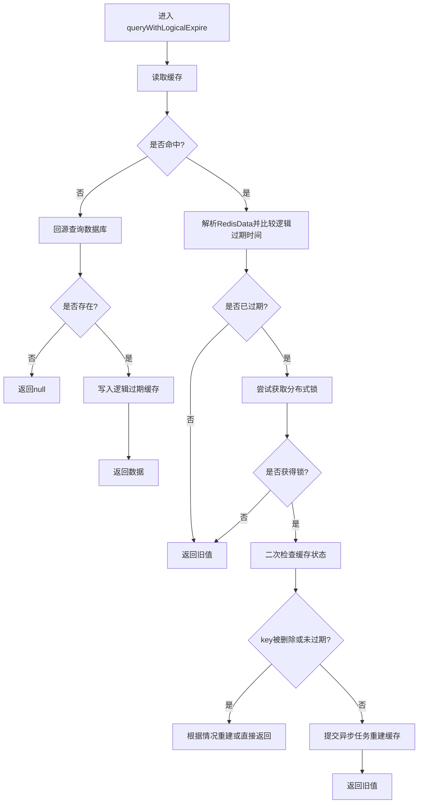
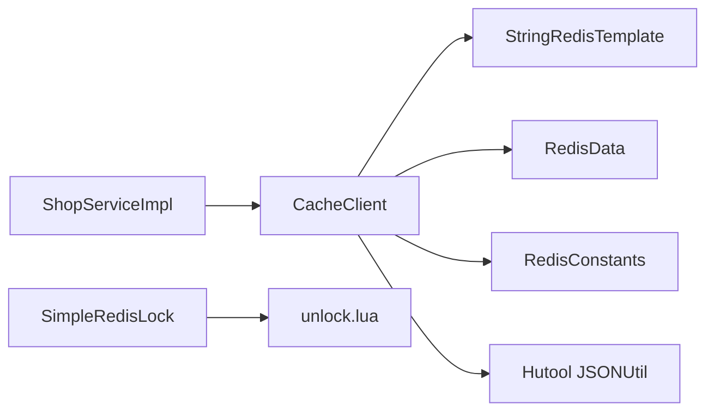

# 缓存客户端架构

<cite>
**本文引用的文件列表**
- [CacheClient.java](file://src/main/java/com/hmdp/utils/CacheClient.java)
- [RedisData.java](file://src/main/java/com/hmdp/utils/RedisData.java)
- [RedisConstants.java](file://src/main/java/com/hmdp/utils/RedisConstants.java)
- [ShopServiceImpl.java](file://src/main/java/com/hmdp/service/impl/ShopServiceImpl.java)
- [ShopTypeServiceImpl.java](file://src/main/java/com/hmdp/service/impl/ShopTypeServiceImpl.java)
- [SimpleRedisLock.java](file://src/main/java/com/hmdp/utils/SimpleRedisLock.java)
- [unlock.lua](file://src/main/resources/unlock.lua)
</cite>

## 目录
1. [简介](#简介)
2. [项目结构](#项目结构)
3. [核心组件](#核心组件)
4. [架构总览](#架构总览)
5. [详细组件分析](#详细组件分析)
6. [依赖关系分析](#依赖关系分析)
7. [性能考量](#性能考量)
8. [故障排查指南](#故障排查指南)
9. [结论](#结论)
10. [附录](#附录)

## 简介
本文件围绕 my-hbdp 项目的缓存客户端架构，系统性梳理 CacheClient 的统一封装设计，包括基础缓存操作、逻辑过期缓存、缓存穿透防护、线程池在缓存重建中的作用与配置、键命名规范与序列化策略，并提供调用示例路径与最佳实践建议。目标是帮助开发者快速理解并正确使用该缓存层，兼顾一致性与性能。

## 项目结构
与缓存客户端相关的核心代码位于 utils 包中，业务服务通过注入 CacheClient 进行统一缓存访问；常量定义集中在 RedisConstants 中，便于统一管理键前缀与 TTL。

图表来源
- [CacheClient.java:17-139](file://src/main/java/com/hmdp/utils/CacheClient.java#L17-L139)
- [RedisData.java:7-11](file://src/main/java/com/hmdp/utils/RedisData.java#L7-L11)
- [RedisConstants.java:3-24](file://src/main/java/com/hmdp/utils/RedisConstants.java#L3-L24)
- [ShopServiceImpl.java:28-45](file://src/main/java/com/hmdp/service/impl/ShopServiceImpl.java#L28-L45)
- [ShopTypeServiceImpl.java:26-46](file://src/main/java/com/hmdp/service/impl/ShopTypeServiceImpl.java#L26-L46)
- [SimpleRedisLock.java:11-36](file://src/main/java/com/hmdp/utils/SimpleRedisLock.java#L11-L36)

章节来源
- [CacheClient.java:17-139](file://src/main/java/com/hmdp/utils/CacheClient.java#L17-L139)
- [RedisConstants.java:3-24](file://src/main/java/com/hmdp/utils/RedisConstants.java#L3-L24)
- [ShopServiceImpl.java:28-45](file://src/main/java/com/hmdp/service/impl/ShopServiceImpl.java#L28-L45)
- [ShopTypeServiceImpl.java:26-46](file://src/main/java/com/hmdp/service/impl/ShopTypeServiceImpl.java#L26-L46)

## 核心组件
- CacheClient：提供统一的缓存读写封装，包含基础 set、逻辑过期写入、穿透防护查询、逻辑过期查询（含异步重建）。
- RedisData：逻辑过期模式下的包装结构，包含数据体与逻辑过期时间。
- RedisConstants：集中管理 Redis 键前缀与默认 TTL，保证键命名一致性。
- SimpleRedisLock：基于 Redis 的分布式锁实现（Lua 原子释放），用于热点 key 重建时的互斥保护。

章节来源
- [CacheClient.java:17-139](file://src/main/java/com/hmdp/utils/CacheClient.java#L17-L139)
- [RedisData.java:7-11](file://src/main/java/com/hmdp/utils/RedisData.java#L7-L11)
- [RedisConstants.java:3-24](file://src/main/java/com/hmdp/utils/RedisConstants.java#L3-L24)
- [SimpleRedisLock.java:11-36](file://src/main/java/com/hmdp/utils/SimpleRedisLock.java#L11-L36)

## 架构总览
CacheClient 作为统一入口，屏蔽了底层 Redis 细节与序列化/反序列化过程，向上暴露简洁 API。业务侧通过常量类维护键空间，避免硬编码导致的命名不一致。

图表来源
- [CacheClient.java:64-127](file://src/main/java/com/hmdp/utils/CacheClient.java#L64-L127)
- [ShopServiceImpl.java:37-45](file://src/main/java/com/hmdp/service/impl/ShopServiceImpl.java#L37-L45)

## 详细组件分析

### CacheClient 统一封装设计
- 基础缓存操作
  - set：将任意对象序列化为 JSON 字符串后写入 Redis，支持 TTL。
  - setWithLogicalExpire：将对象与逻辑过期时间一起封装为 RedisData 再序列化写入，不设置物理过期。
- 缓存穿透防护
  - queryWithPassThrough：先查缓存，若为空则回源查询；当数据库返回 null 时，写入空串并设置短 TTL，防止同一不存在 key 反复击穿至数据库。
- 逻辑过期缓存
  - queryWithLogicalExpire：读取 RedisData，比较逻辑过期时间与当前时间；若过期，则尝试获取分布式锁，并进行“二次检查”，必要时提交异步任务重建缓存，同时始终返回旧值以保证低延迟。
- 线程池与锁
  - 内部使用固定大小线程池执行缓存重建任务。
  - 使用简单的 setIfAbsent 方式加锁，并在 finally 中释放锁，避免死锁。

图表来源
- [CacheClient.java:17-139](file://src/main/java/com/hmdp/utils/CacheClient.java#L17-L139)
- [RedisData.java:7-11](file://src/main/java/com/hmdp/utils/RedisData.java#L7-L11)
- [RedisConstants.java:3-24](file://src/main/java/com/hmdp/utils/RedisConstants.java#L3-L24)

章节来源
- [CacheClient.java:25-60](file://src/main/java/com/hmdp/utils/CacheClient.java#L25-L60)
- [CacheClient.java:64-127](file://src/main/java/com/hmdp/utils/CacheClient.java#L64-L127)
- [CacheClient.java:129-136](file://src/main/java/com/hmdp/utils/CacheClient.java#L129-L136)

### RedisData 数据结构设计与使用
- 字段说明
  - expireTime：逻辑过期时间点，用于判断是否需要重建。
  - data：实际业务数据，以 JSON 形式存储。
- 使用方式
  - 写入：构造 RedisData，填充 data 与 expireTime，整体序列化为 JSON 存入 Redis。
  - 读取：从 Redis 取出 JSON，反序列化为 RedisData，再对 data 字段按目标类型反序列化。

图表来源
- [RedisData.java:7-11](file://src/main/java/com/hmdp/utils/RedisData.java#L7-L11)
- [CacheClient.java:29-34](file://src/main/java/com/hmdp/utils/CacheClient.java#L29-L34)
- [CacheClient.java:78-81](file://src/main/java/com/hmdp/utils/CacheClient.java#L78-L81)

章节来源
- [RedisData.java:7-11](file://src/main/java/com/hmdp/utils/RedisData.java#L7-L11)
- [CacheClient.java:29-34](file://src/main/java/com/hmdp/utils/CacheClient.java#L29-L34)
- [CacheClient.java:78-81](file://src/main/java/com/hmdp/utils/CacheClient.java#L78-L81)

### 缓存键命名规范与序列化策略
- 键命名规范
  - 所有键前缀与 TTL 均定义在 RedisConstants 中，例如 shop 相关键前缀、锁前缀、秒杀库存等。
  - 业务中拼接具体 ID 形成完整键，如 “cache:shop:{id}”、“lock:shop:{id}”。
- 序列化策略
  - 统一使用 JSON 字符串作为 Redis 值类型。
  - 写入：对象 -> JSON 字符串 -> SET。
  - 读取：JSON 字符串 -> 对象（或 RedisData）-> 业务对象。
  - 注意：逻辑过期模式下，data 字段在反序列化时会被解析为 JSONObject，需显式强转后再按目标类型转换。

章节来源
- [RedisConstants.java:3-24](file://src/main/java/com/hmdp/utils/RedisConstants.java#L3-L24)
- [CacheClient.java:25-34](file://src/main/java/com/hmdp/utils/CacheClient.java#L25-L34)
- [CacheClient.java:78-81](file://src/main/java/com/hmdp/utils/CacheClient.java#L78-L81)

### 缓存穿透防护流程
- 流程要点
  - 先读缓存，命中直接返回。
  - 未命中则回源查询数据库。
  - 若数据库返回 null，写入空串并设置较短 TTL，避免后续请求持续击穿。
  - 若数据库返回有效数据，正常写入缓存并返回。

图表来源
- [CacheClient.java:36-60](file://src/main/java/com/hmdp/utils/CacheClient.java#L36-L60)

章节来源
- [CacheClient.java:36-60](file://src/main/java/com/hmdp/utils/CacheClient.java#L36-L60)

### 逻辑过期与异步重建流程
- 流程要点
  - 读取 RedisData，对比逻辑过期时间。
  - 若未过期，直接返回旧值。
  - 若已过期，尝试获取分布式锁；成功后进行二次检查，必要时提交异步任务重建缓存。
  - 无论是否成功重建，都返回旧值，保障响应时延。

图表来源
- [CacheClient.java:64-127](file://src/main/java/com/hmdp/utils/CacheClient.java#L64-L127)

章节来源
- [CacheClient.java:64-127](file://src/main/java/com/hmdp/utils/CacheClient.java#L64-L127)

### 线程池在缓存重建中的作用与配置
- 作用
  - 在逻辑过期场景下，避免阻塞主请求线程，异步执行数据库查询与缓存更新。
- 配置
  - 采用固定大小线程池，容量为 10。
  - 建议在业务高峰期结合监控指标动态调整，避免队列堆积或资源争用。

章节来源
- [CacheClient.java:62](file://src/main/java/com/hmdp/utils/CacheClient.java#L62)
- [CacheClient.java:110-122](file://src/main/java/com/hmdp/utils/CacheClient.java#L110-L122)

### 分布式锁与 Lua 脚本
- 简单锁实现
  - 使用 setIfAbsent 设置锁，带过期时间，防止死锁。
  - 解锁通过删除键完成；更严谨的实现可使用 Lua 脚本原子校验与删除。
- Lua 脚本
  - unlock.lua 用于原子性校验并删除锁，确保只有持有者能释放。

章节来源
- [CacheClient.java:129-136](file://src/main/java/com/hmdp/utils/CacheClient.java#L129-L136)
- [SimpleRedisLock.java:11-36](file://src/main/java/com/hmdp/utils/SimpleRedisLock.java#L11-L36)
- [unlock.lua:1-5](file://src/main/resources/unlock.lua#L1-L5)

### 调用示例与使用方式
- 逻辑过期查询（推荐）
  - 在 ShopServiceImpl 中，通过 CacheClient.queryWithLogicalExpire 传入键前缀、ID、类型、数据库查询函数、逻辑过期时间与锁前缀。
  - 参考路径：[ShopServiceImpl.java:37-45](file://src/main/java/com/hmdp/service/impl/ShopServiceImpl.java#L37-L45)
- 穿透防护查询
  - 使用 CacheClient.queryWithPassThrough，传入键前缀、ID、类型、数据库查询函数与 TTL。
  - 参考路径：[CacheClient.java:36-60](file://src/main/java/com/hmdp/utils/CacheClient.java#L36-L60)
- 基础写入
  - 使用 set 或 setWithLogicalExpire 写入缓存。
  - 参考路径：[CacheClient.java:25-34](file://src/main/java/com/hmdp/utils/CacheClient.java#L25-L34)
- 非逻辑过期的批量缓存（示例）
  - ShopTypeServiceImpl 直接使用 StringRedisTemplate 进行集合缓存，适合静态或低频变更的数据。
  - 参考路径：[ShopTypeServiceImpl.java:32-46](file://src/main/java/com/hmdp/service/impl/ShopTypeServiceImpl.java#L32-L46)

章节来源
- [ShopServiceImpl.java:37-45](file://src/main/java/com/hmdp/service/impl/ShopServiceImpl.java#L37-L45)
- [CacheClient.java:25-60](file://src/main/java/com/hmdp/utils/CacheClient.java#L25-L60)
- [ShopTypeServiceImpl.java:32-46](file://src/main/java/com/hmdp/service/impl/ShopTypeServiceImpl.java#L32-L46)

## 依赖关系分析
- 组件耦合
  - CacheClient 依赖 StringRedisTemplate 进行 Redis 操作，依赖 RedisData 封装逻辑过期信息，依赖 RedisConstants 管理键空间。
  - 业务服务仅依赖 CacheClient，降低与 Redis 的直接耦合。
- 外部依赖
  - 使用 Hutool 的 JSONUtil 进行序列化/反序列化。
  - 可选使用 SimpleRedisLock 与 unlock.lua 提供更健壮的锁语义。

图表来源
- [ShopServiceImpl.java:28-45](file://src/main/java/com/hmdp/service/impl/ShopServiceImpl.java#L28-L45)
- [CacheClient.java:17-139](file://src/main/java/com/hmdp/utils/CacheClient.java#L17-L139)
- [RedisData.java:7-11](file://src/main/java/com/hmdp/utils/RedisData.java#L7-L11)
- [RedisConstants.java:3-24](file://src/main/java/com/hmdp/utils/RedisConstants.java#L3-L24)
- [SimpleRedisLock.java:11-36](file://src/main/java/com/hmdp/utils/SimpleRedisLock.java#L11-L36)
- [unlock.lua:1-5](file://src/main/resources/unlock.lua#L1-L5)

章节来源
- [CacheClient.java:17-139](file://src/main/java/com/hmdp/utils/CacheClient.java#L17-L139)
- [ShopServiceImpl.java:28-45](file://src/main/java/com/hmdp/service/impl/ShopServiceImpl.java#L28-L45)

## 性能考量
- 逻辑过期优于物理过期
  - 逻辑过期允许在过期后继续返回旧值，同时后台异步重建，显著降低热点数据的抖动与雪崩风险。
- 减少序列化开销
  - 统一 JSON 序列化，避免嵌套双重序列化；注意 RedisData.data 的反序列化需要显式指定目标类型。
- 合理设置 TTL
  - 穿透防护的空值 TTL 应较短，避免长期占用内存；业务数据 TTL 依据更新频率与一致性要求设定。
- 线程池容量调优
  - 固定线程池容量需结合 QPS、CPU 与 IO 特征评估，避免过大导致上下文切换过多或过小造成重建积压。
- 锁粒度与竞争
  - 锁前缀与 key 维度要精确，避免跨业务干扰；在高并发场景可考虑引入更完善的分布式锁实现。

## 故障排查指南
- 反序列化异常
  - 现象：RedisData.data 反序列化为 JSONObject 导致类型转换失败。
  - 处理：在反序列化时先将 data 强转为 JSONObject，再按目标类型转换。
  - 参考路径：[CacheClient.java:78-81](file://src/main/java/com/hmdp/utils/CacheClient.java#L78-L81)
- 缓存穿透
  - 现象：大量不存在 key 的请求直达数据库。
  - 处理：使用穿透防护方法，对空结果写入短 TTL 空串。
  - 参考路径：[CacheClient.java:36-60](file://src/main/java/com/hmdp/utils/CacheClient.java#L36-L60)
- 锁未释放或死锁
  - 现象：缓存重建过程中锁未被释放。
  - 处理：确保在 finally 中释放锁；或使用 Lua 脚本原子释放。
  - 参考路径：[CacheClient.java:129-136](file://src/main/java/com/hmdp/utils/CacheClient.java#L129-L136), [unlock.lua:1-5](file://src/main/resources/unlock.lua#L1-L5)
- 键命名不一致
  - 现象：不同模块使用不同前缀导致缓存命中率下降。
  - 处理：统一使用 RedisConstants 中的常量。
  - 参考路径：[RedisConstants.java:3-24](file://src/main/java/com/hmdp/utils/RedisConstants.java#L3-L24)

章节来源
- [CacheClient.java:78-81](file://src/main/java/com/hmdp/utils/CacheClient.java#L78-L81)
- [CacheClient.java:36-60](file://src/main/java/com/hmdp/utils/CacheClient.java#L36-L60)
- [CacheClient.java:129-136](file://src/main/java/com/hmdp/utils/CacheClient.java#L129-L136)
- [unlock.lua:1-5](file://src/main/resources/unlock.lua#L1-L5)
- [RedisConstants.java:3-24](file://src/main/java/com/hmdp/utils/RedisConstants.java#L3-L24)

## 结论
CacheClient 提供了统一、易用的缓存访问能力，结合 RedisData 的逻辑过期机制与穿透防护，能在高并发场景下显著提升稳定性与性能。配合 RedisConstants 的键命名规范与 JSON 序列化策略，能有效降低开发复杂度与维护成本。建议在生产环境结合监控指标优化线程池容量与 TTL，并采用更健壮的分布式锁方案以提升可靠性。

## 附录
- 常用键前缀与 TTL 常量
  - 登录验证码、登录用户令牌、店铺缓存、店铺类型、锁、秒杀库存、点赞、动态、地理、签到等。
  - 参考路径：[RedisConstants.java:3-24](file://src/main/java/com/hmdp/utils/RedisConstants.java#L3-L24)
- 典型调用路径
  - 逻辑过期查询：[ShopServiceImpl.java:37-45](file://src/main/java/com/hmdp/service/impl/ShopServiceImpl.java#L37-L45)
  - 穿透防护查询：[CacheClient.java:36-60](file://src/main/java/com/hmdp/utils/CacheClient.java#L36-L60)
  - 基础写入：[CacheClient.java:25-34](file://src/main/java/com/hmdp/utils/CacheClient.java#L25-L34)
  - 批量缓存示例：[ShopTypeServiceImpl.java:32-46](file://src/main/java/com/hmdp/service/impl/ShopTypeServiceImpl.java#L32-L46)