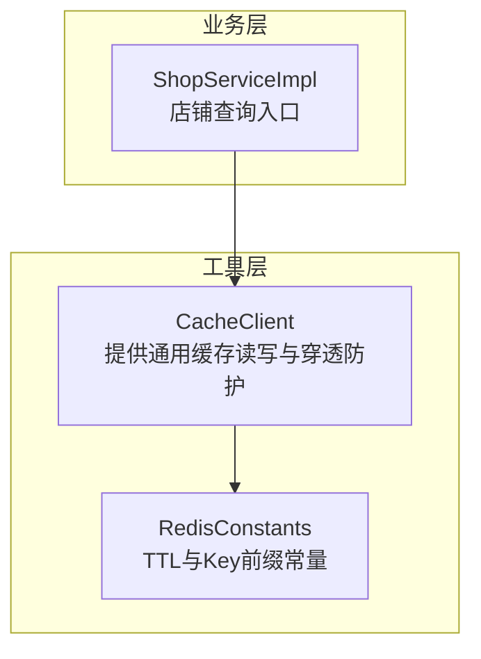
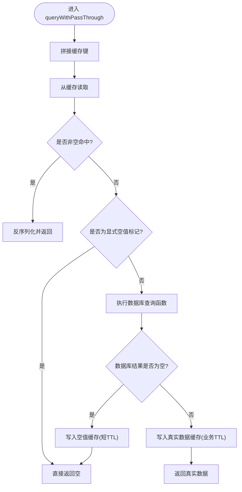
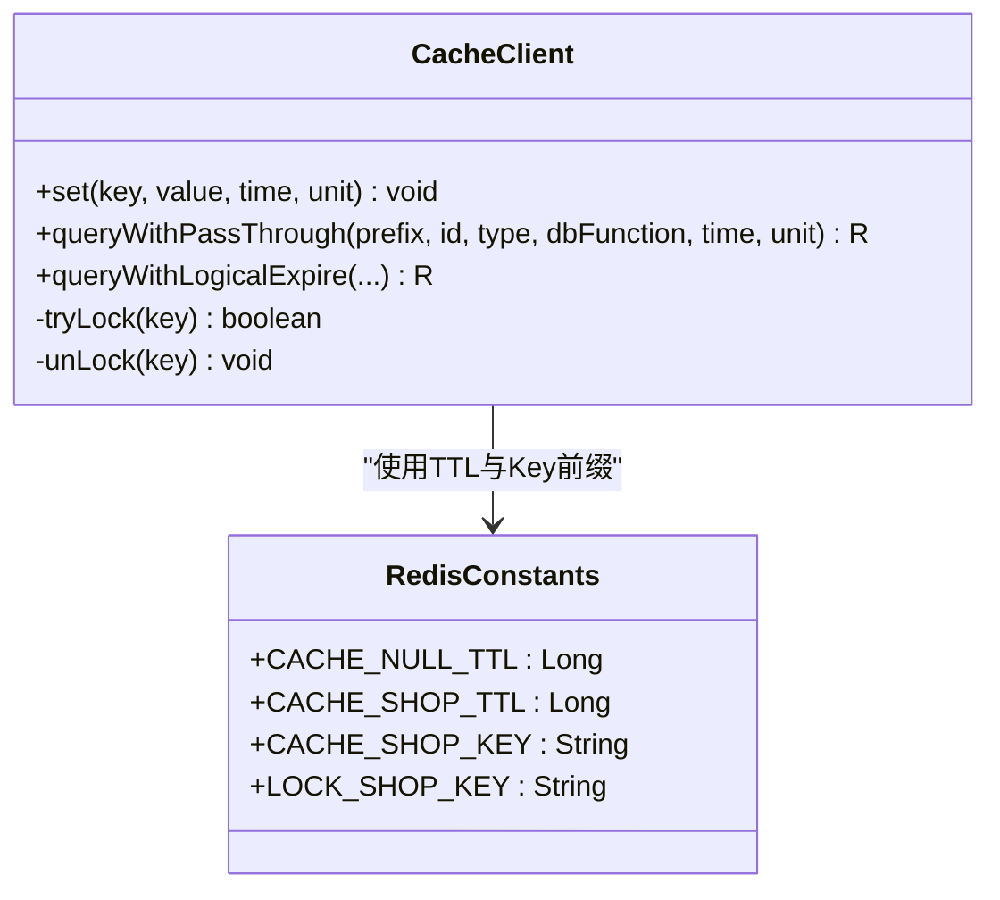
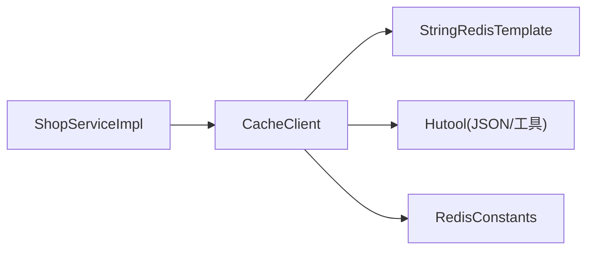

# 缓存穿透防护

<cite>
**本文引用的文件**   
- [CacheClient.java](file://src/main/java/com/hmdp/utils/CacheClient.java)
- [RedisConstants.java](file://src/main/java/com/hmdp/utils/RedisConstants.java)
- [ShopServiceImpl.java](file://src/main/java/com/hmdp/service/impl/ShopServiceImpl.java)
</cite>

## 目录
1. [简介](#简介)
2. [项目结构](#项目结构)
3. [核心组件](#核心组件)
4. [架构总览](#架构总览)
5. [详细组件分析](#详细组件分析)
6. [依赖关系分析](#依赖关系分析)
7. [性能与内存考量](#性能与内存考量)
8. [监控指标与故障排查](#监控指标与故障排查)
9. [结论](#结论)
10. [附录：使用示例与最佳实践](#附录使用示例与最佳实践)

## 简介
本文件聚焦于 my-hbdp 项目的缓存穿透防护机制，围绕 CacheClient.queryWithPassThrough 方法展开，系统阐述其空值缓存策略、适用场景与注意事项。同时补充布隆过滤器在穿透防护中的典型用法与集成建议，并给出与其他缓存策略（如逻辑过期）的组合方式、监控指标与排障指南。

## 项目结构
与缓存穿透防护直接相关的代码位于 utils 层的服务类与常量定义中，业务侧通过 Service 调用该工具方法完成“读多写少”的热点数据访问路径优化。

图示来源
- [CacheClient.java:17-60](file://src/main/java/com/hmdp/utils/CacheClient.java#L17-L60)
- [RedisConstants.java:1-25](file://src/main/java/com/hmdp/utils/RedisConstants.java#L1-L25)
- [ShopServiceImpl.java:28-45](file://src/main/java/com/hmdp/service/impl/ShopServiceImpl.java#L28-L45)

章节来源
- [CacheClient.java:17-60](file://src/main/java/com/hmdp/utils/CacheClient.java#L17-L60)
- [RedisConstants.java:1-25](file://src/main/java/com/hmdp/utils/RedisConstants.java#L1-L25)
- [ShopServiceImpl.java:28-45](file://src/main/java/com/hmdp/service/impl/ShopServiceImpl.java#L28-L45)

## 核心组件
- CacheClient：封装 Redis 读写、逻辑过期重建、以及穿透防护的空值缓存策略。
- RedisConstants：集中管理各类 Key 前缀与 TTL 常量，包括空值缓存的默认 TTL。
- ShopServiceImpl：业务入口示例，演示如何接入缓存策略（当前实现采用逻辑过期方案，但提供了穿透防护方法的注释化调用位置）。

章节来源
- [CacheClient.java:17-60](file://src/main/java/com/hmdp/utils/CacheClient.java#L17-L60)
- [RedisConstants.java:1-25](file://src/main/java/com/hmdp/utils/RedisConstants.java#L1-L25)
- [ShopServiceImpl.java:28-45](file://src/main/java/com/hmdp/service/impl/ShopServiceImpl.java#L28-L45)

## 架构总览
下图展示了 queryWithPassThrough 的整体流程：先查缓存，命中则返回；未命中时回源数据库，若结果为空则写入一个短 TTL 的空值以拦截后续请求，避免穿透到数据库。

图示来源
- [CacheClient.java:36-60](file://src/main/java/com/hmdp/utils/CacheClient.java#L36-L60)

章节来源
- [CacheClient.java:36-60](file://src/main/java/com/hmdp/utils/CacheClient.java#L36-L60)

## 详细组件分析

### 空值缓存策略与 queryWithPassThrough 原理
- 设计目标
  - 防止恶意或异常流量持续穿透缓存直达数据库，造成数据库压力放大甚至雪崩。
  - 对不存在的实体进行短期缓存，降低重复无效查询带来的开销。
- 关键流程
  - 构造缓存键后优先尝试从缓存读取。
  - 若命中且值非空，直接反序列化为业务对象返回。
  - 若命中但值为空字符串，说明之前已记录为“不存在”，直接返回空，不再落库。
  - 若缓存未命中，则调用传入的数据库查询函数。
  - 若数据库返回为空，将空字符串写入缓存并设置较短 TTL，随后返回空。
  - 若数据库返回有效数据，按业务 TTL 写入缓存并返回。
- 时间设置策略
  - 空值缓存 TTL 应显著小于正常数据的 TTL，通常以秒级为单位，用于快速失效，避免长期占用内存。
  - 项目中定义了空值缓存的默认 TTL 常量，便于统一配置与调整。
- 内存占用控制
  - 空值缓存仅存储极小的空字符串，内存占用极低。
  - 通过短 TTL 自动淘汰，避免大量不存在的 key 长期驻留。
- 并发与一致性
  - 该方法本身不包含分布式锁，存在短暂并发下多次回源的可能。
  - 对于高并发场景，可结合分布式锁或异步预热策略进一步保护。

图示来源
- [CacheClient.java:17-60](file://src/main/java/com/hmdp/utils/CacheClient.java#L17-L60)
- [RedisConstants.java:1-25](file://src/main/java/com/hmdp/utils/RedisConstants.java#L1-L25)

章节来源
- [CacheClient.java:36-60](file://src/main/java/com/hmdp/utils/CacheClient.java#L36-L60)
- [RedisConstants.java:1-25](file://src/main/java/com/hmdp/utils/RedisConstants.java#L1-L25)

### 布隆过滤器的使用场景与集成建议
- 适用场景
  - 海量 ID 集合的“是否存在”判断，例如用户ID、商品ID等。
  - 在缓存层之前增加一层布隆过滤器，快速拒绝明显不存在的请求，减少空值缓存与数据库压力。
- 与空值缓存的关系
  - 布隆过滤器作为前置过滤，能大幅降低空值缓存的写入频率与命中率波动。
  - 空值缓存作为兜底，处理布隆误判或数据删除后的不一致情况。
- 集成要点
  - 选择合适的大小与误判率参数，平衡内存占用与准确性。
  - 定期全量重建布隆过滤器，保证与数据库一致。
  - 注意布隆过滤器的误判特性：可能把不存在的元素判定为存在，但不会漏判。
- 本项目现状
  - 当前仓库未包含布隆过滤器实现与集成代码，可在现有架构基础上引入第三方库（如 Guava BloomFilter 或 RedisBloom），并在查询链路最前端加入过滤步骤。

[本节为概念性说明，不涉及具体源码文件]

### 与其他缓存策略的组合使用
- 与逻辑过期组合
  - 逻辑过期适合热点数据的“读多写少”场景，允许旧值短暂返回，后台异步重建。
  - 与空值缓存配合：当数据库返回空时，仍可使用空值缓存避免穿透；当数据库返回非空时，使用逻辑过期提升一致性体验。
- 与分布式锁组合
  - 在高并发下，为避免多个线程同时回源，可在查询前后加锁，确保同一时刻只有一个线程回源重建。
- 与缓存击穿防护组合
  - 针对热点 key 过期瞬间的并发风暴，可通过互斥锁或单飞线程策略限制回源次数。

章节来源
- [CacheClient.java:64-127](file://src/main/java/com/hmdp/utils/CacheClient.java#L64-L127)

## 依赖关系分析
- CacheClient 依赖 Spring 的 StringRedisTemplate 进行 Redis 操作，依赖 Hutool 进行 JSON 序列化与工具方法。
- 业务服务通过注入 CacheClient 完成缓存访问，减少对 Redis 细节的耦合。
- 常量集中管理，便于统一调整 TTL 与 Key 命名规范。

图示来源
- [ShopServiceImpl.java:28-45](file://src/main/java/com/hmdp/service/impl/ShopServiceImpl.java#L28-L45)
- [CacheClient.java:17-60](file://src/main/java/com/hmdp/utils/CacheClient.java#L17-L60)
- [RedisConstants.java:1-25](file://src/main/java/com/hmdp/utils/RedisConstants.java#L1-L25)

章节来源
- [ShopServiceImpl.java:28-45](file://src/main/java/com/hmdp/service/impl/ShopServiceImpl.java#L28-L45)
- [CacheClient.java:17-60](file://src/main/java/com/hmdp/utils/CacheClient.java#L17-L60)
- [RedisConstants.java:1-25](file://src/main/java/com/hmdp/utils/RedisConstants.java#L1-L25)

## 性能与内存考量
- 性能收益
  - 空值缓存能有效阻断大量无效请求直达数据库，降低数据库 QPS 峰值。
  - 短 TTL 的空值缓存具备快速失效能力，兼顾实时性与资源占用。
- 内存占用
  - 空值缓存仅存空字符串，单个 key 占用极小；通过合理 TTL 控制总量。
- 并发影响
  - 无锁情况下，极端并发可能导致短时间多次回源；可结合锁或异步预热缓解。
- 容量规划
  - 预估最大不存在的 key 数量与 TTL，估算内存占用上限，确保 Redis 有足够余量。

[本节为通用指导，不涉及具体源码文件]

## 监控指标与故障排查
- 建议监控指标
  - 缓存命中率（整体与空值命中分开统计）
  - 空值缓存写入速率与存活数量
  - 数据库 QPS 与慢查询比例
  - 布隆过滤器（若启用）误判率与重建耗时
- 常见问题定位
  - 空值缓存未生效：检查空值 TTL 是否过短导致频繁重建，或 key 前缀是否正确。
  - 穿透未缓解：确认是否在查询链路最前端启用了布隆过滤器或空值缓存。
  - 内存增长：检查空值缓存数量是否异常，评估 TTL 与 key 空间分布。
  - 一致性风险：空值缓存与数据库不一致时，需考虑定时任务或监听变更事件进行清理。

[本节为通用指导，不涉及具体源码文件]

## 结论
- queryWithPassThrough 通过“空值缓存”实现对不存在数据的快速拦截，是防御缓存穿透的基础手段。
- 在大规模 ID 场景下，建议叠加布隆过滤器作为前置过滤，进一步降低空值缓存与数据库压力。
- 与逻辑过期、分布式锁等策略组合使用，可构建更稳健的缓存体系。
- 通过合理的 TTL 与监控指标，可有效控制内存占用并及时发现异常。

[本节为总结性内容，不涉及具体源码文件]

## 附录：使用示例与最佳实践

### 正确使用穿透防护方法
- 基本用法
  - 在业务查询入口调用 queryWithPassThrough，传入缓存键前缀、ID、数据类型、数据库查询函数、业务 TTL 与时间单位。
  - 当数据库返回空时，方法会自动写入空值缓存并返回空，避免穿透。
- 示例参考路径
  - 业务入口示例（当前使用逻辑过期，但提供了穿透防护的注释化调用位置）：[ShopServiceImpl.java:37-45](file://src/main/java/com/hmdp/service/impl/ShopServiceImpl.java#L37-L45)
  - 穿透防护方法实现：[CacheClient.java:36-60](file://src/main/java/com/hmdp/utils/CacheClient.java#L36-L60)
  - 空值缓存默认 TTL 常量：[RedisConstants.java:9](file://src/main/java/com/hmdp/utils/RedisConstants.java#L9)

### 与其他策略的组合
- 与逻辑过期组合
  - 对热点数据使用逻辑过期，对空值使用空值缓存，兼顾一致性与穿透防护。
  - 参考实现：[CacheClient.java:64-127](file://src/main/java/com/hmdp/utils/CacheClient.java#L64-L127)
- 与分布式锁组合
  - 在高并发场景下，可在查询前后加锁，避免瞬时回源风暴。
  - 参考锁实现：[SimpleRedisLock.java:31-36](file://src/main/java/com/hmdp/utils/SimpleRedisLock.java#L31-L36)

### 布隆过滤器集成建议
- 选型与参数
  - 根据数据规模与误判率要求选择合适的库与参数。
- 初始化与重建
  - 启动时加载或增量构建布隆过滤器；定期全量重建以保证一致性。
- 查询链路
  - 请求到达后先经布隆过滤器判断，再进入缓存与数据库层。

[本节为概念性说明，不涉及具体源码文件]