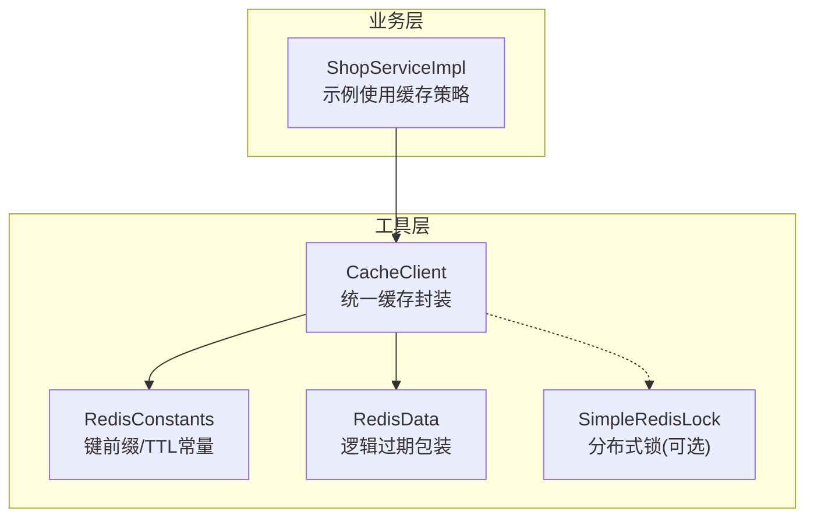
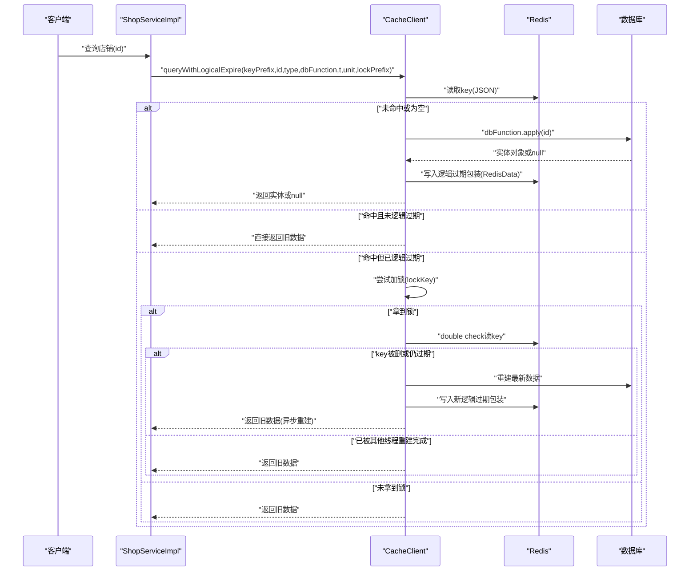
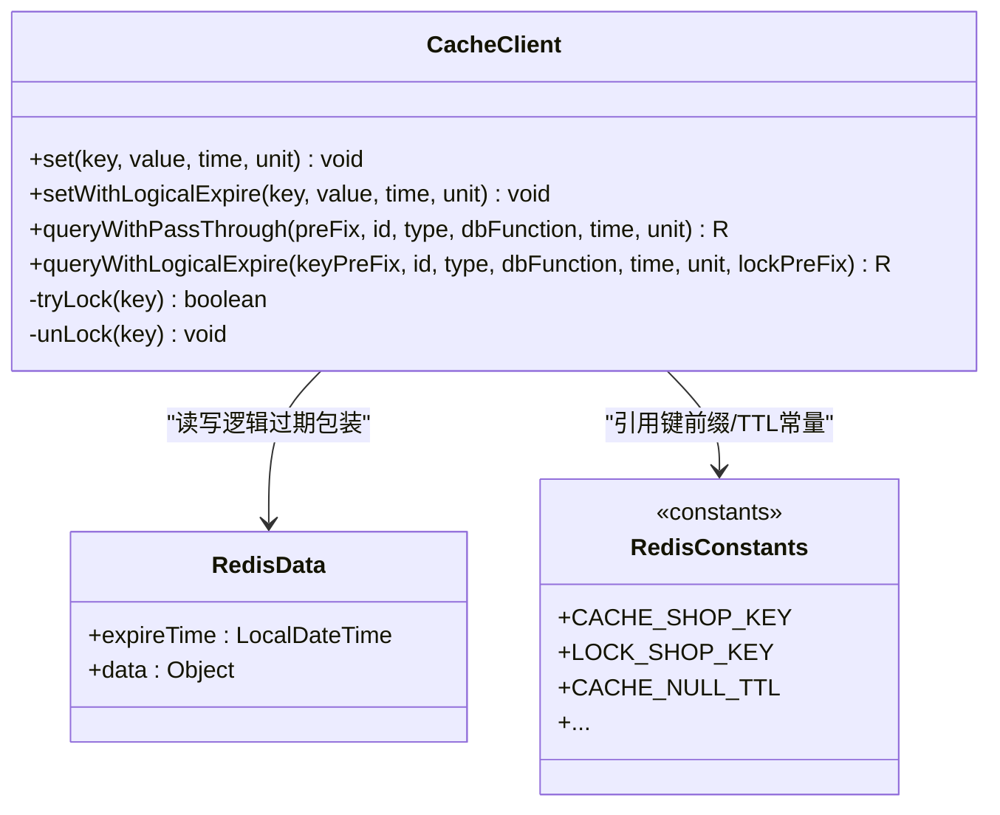
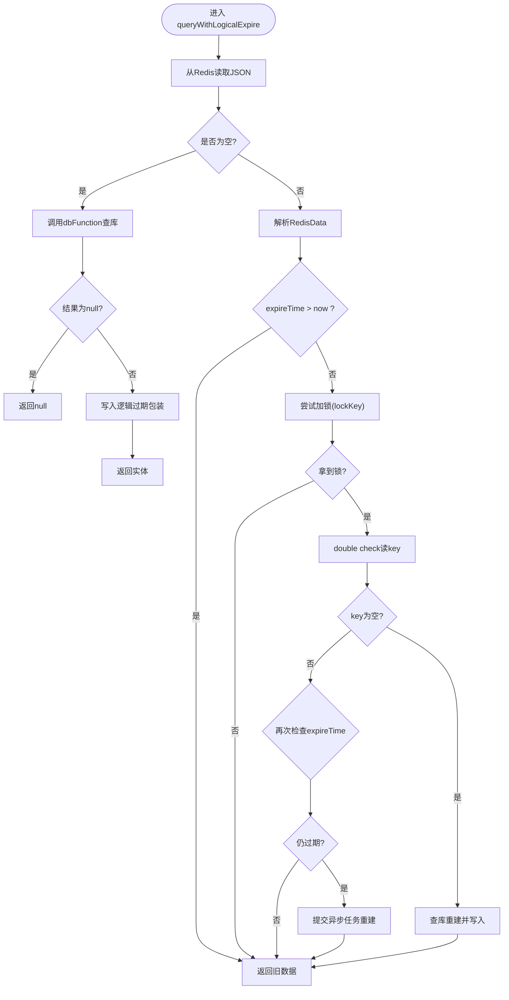
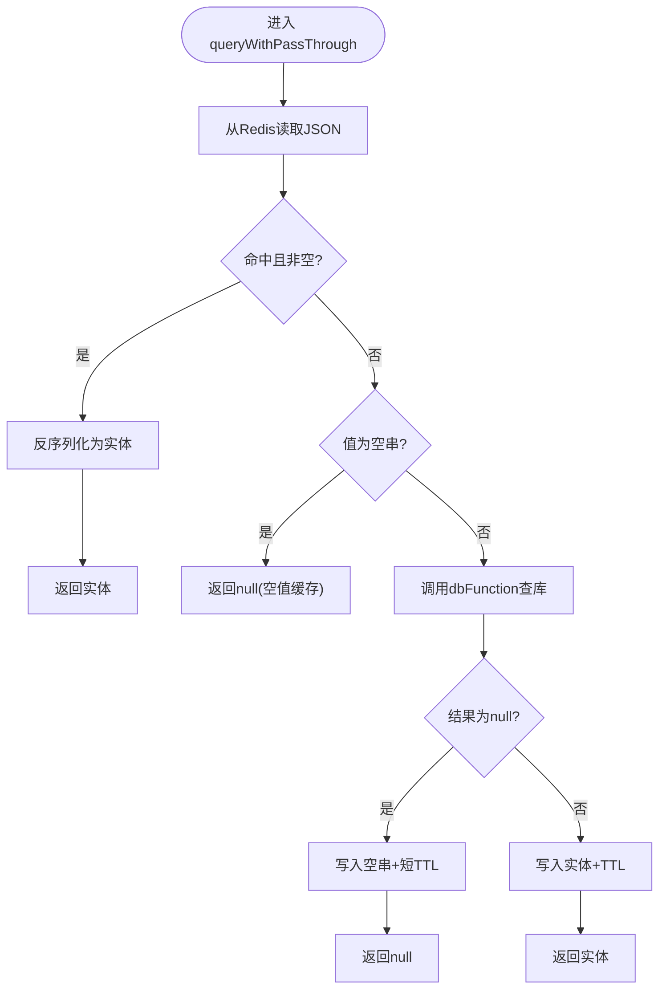
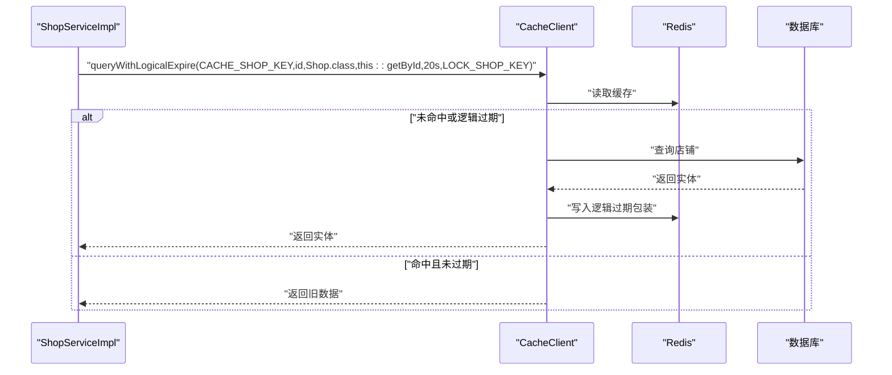
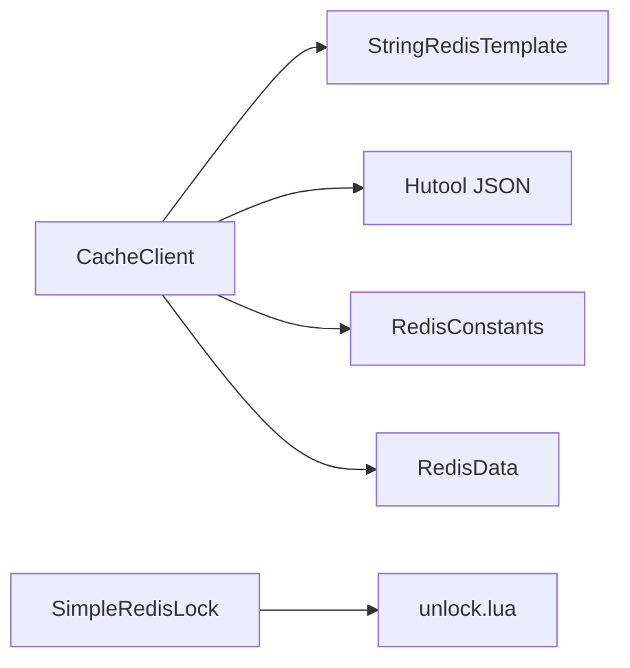

# 缓存策略设计

<cite>
**本文引用的文件**
- [CacheClient.java](file://src/main/java/com/hmdp/utils/CacheClient.java)
- [RedisConstants.java](file://src/main/java/com/hmdp/utils/RedisConstants.java)
- [RedisData.java](file://src/main/java/com/hmdp/utils/RedisData.java)
- [ShopServiceImpl.java](file://src/main/java/com/hmdp/service/impl/ShopServiceImpl.java)
- [SimpleRedisLock.java](file://src/main/java/com/hmdp/utils/SimpleRedisLock.java)
- [unlock.lua](file://src/main/resources/unlock.lua)
</cite>

## 目录
1. [引言](#引言)
2. [项目结构](#项目结构)
3. [核心组件](#核心组件)
4. [架构总览](#架构总览)
5. [详细组件分析](#详细组件分析)
6. [依赖关系分析](#依赖关系分析)
7. [性能考量](#性能考量)
8. [故障排查指南](#故障排查指南)
9. [结论](#结论)
10. [附录](#附录)

## 引言
本文件围绕 my-hbdp 项目的缓存策略进行系统化文档化，重点解释基于 Redis 的缓存架构与统一封装 CacheClient 的设计，覆盖以下主题：
- 统一缓存访问封装与多种缓存策略（穿透防护、逻辑过期防击穿）
- 缓存键命名规范、数据结构与序列化方案
- 逻辑过期策略的设计与实现细节
- 性能优化建议与常见问题排查

## 项目结构
本项目采用分层组织方式，缓存相关能力集中在 utils 层，业务服务在 service.impl 中调用。关键文件如下：
- utils/CacheClient.java：统一的缓存访问与策略封装
- utils/RedisConstants.java：缓存键前缀与 TTL 常量
- utils/RedisData.java：逻辑过期数据包装体
- service.impl/ShopServiceImpl.java：示例业务对缓存策略的使用
- utils/SimpleRedisLock.java：分布式锁实现（可选扩展）
- resources/unlock.lua：解锁 Lua 脚本（配合 SimpleRedisLock）

图表来源
- [CacheClient.java:1-140](file://src/main/java/com/hmdp/utils/CacheClient.java#L1-L140)
- [RedisConstants.java:1-25](file://src/main/java/com/hmdp/utils/RedisConstants.java#L1-L25)
- [RedisData.java:1-12](file://src/main/java/com/hmdp/utils/RedisData.java#L1-L12)
- [ShopServiceImpl.java:1-61](file://src/main/java/com/hmdp/service/impl/ShopServiceImpl.java#L1-L61)
- [SimpleRedisLock.java:1-36](file://src/main/java/com/hmdp/utils/SimpleRedisLock.java#L1-L36)

章节来源
- [CacheClient.java:1-140](file://src/main/java/com/hmdp/utils/CacheClient.java#L1-L140)
- [RedisConstants.java:1-25](file://src/main/java/com/hmdp/utils/RedisConstants.java#L1-L25)
- [RedisData.java:1-12](file://src/main/java/com/hmdp/utils/RedisData.java#L1-L12)
- [ShopServiceImpl.java:1-61](file://src/main/java/com/hmdp/service/impl/ShopServiceImpl.java#L1-L61)

## 核心组件
- CacheClient：提供 set、setWithLogicalExpire、queryWithPassThrough、queryWithLogicalExpire 等统一方法，屏蔽底层 Redis 操作与并发控制细节。
- RedisConstants：集中管理所有缓存键前缀与默认 TTL，保证键命名一致性与可维护性。
- RedisData：用于逻辑过期方案的包装结构，包含 expireTime 与 data 字段。
- ShopServiceImpl：演示如何使用 queryWithLogicalExpire 获取店铺信息，并在更新时删除对应缓存键。

章节来源
- [CacheClient.java:1-140](file://src/main/java/com/hmdp/utils/CacheClient.java#L1-L140)
- [RedisConstants.java:1-25](file://src/main/java/com/hmdp/utils/RedisConstants.java#L1-L25)
- [RedisData.java:1-12](file://src/main/java/com/hmdp/utils/RedisData.java#L1-L12)
- [ShopServiceImpl.java:1-61](file://src/main/java/com/hmdp/service/impl/ShopServiceImpl.java#L1-L61)

## 架构总览
整体缓存架构以 CacheClient 为核心，向上为业务服务提供统一接口，向下通过 StringRedisTemplate 与 Redis 交互。逻辑过期方案通过 RedisData 包装数据与过期时间戳，结合互斥锁与线程池异步重建，避免热点 key 过期时的“缓存击穿”。

图表来源
- [CacheClient.java:64-127](file://src/main/java/com/hmdp/utils/CacheClient.java#L64-L127)
- [ShopServiceImpl.java:37-45](file://src/main/java/com/hmdp/service/impl/ShopServiceImpl.java#L37-L45)

## 详细组件分析

### CacheClient 统一封装
- 功能概览
  - set：通用写入，内部进行 JSON 序列化并设置 TTL。
  - setWithLogicalExpire：写入逻辑过期包装（RedisData），不依赖 Redis TTL，由业务判断是否过期。
  - queryWithPassThrough：穿透防护，空值也缓存短 TTL，避免恶意或异常请求打穿到数据库。
  - queryWithLogicalExpire：逻辑过期 + 互斥锁 + double check + 异步重建，防止热点 key 过期导致的缓存击穿。
- 关键设计点
  - 统一序列化：对外暴露对象参数，内部使用 JSON 工具类序列化，避免调用方重复序列化。
  - 逻辑过期：RedisData.expireTime 记录业务过期时间；读取时比较当前时间与 expireTime 决定是否重建。
  - 互斥锁：简单 SETNX 锁（10s 超时），确保同一 key 只重建一次。
  - Double Check：加锁后再次读取确认状态，避免重复查库。
  - 异步重建：固定大小线程池提交任务，保护数据库不被瞬时高并发压垮。
  - 空值缓存：穿透场景下缓存空串并设置短 TTL，避免永久遮挡真实数据。

图表来源
- [CacheClient.java:1-140](file://src/main/java/com/hmdp/utils/CacheClient.java#L1-L140)
- [RedisData.java:1-12](file://src/main/java/com/hmdp/utils/RedisData.java#L1-L12)
- [RedisConstants.java:1-25](file://src/main/java/com/hmdp/utils/RedisConstants.java#L1-L25)

章节来源
- [CacheClient.java:25-34](file://src/main/java/com/hmdp/utils/CacheClient.java#L25-L34)
- [CacheClient.java:36-60](file://src/main/java/com/hmdp/utils/CacheClient.java#L36-L60)
- [CacheClient.java:64-127](file://src/main/java/com/hmdp/utils/CacheClient.java#L64-L127)
- [CacheClient.java:129-136](file://src/main/java/com/hmdp/utils/CacheClient.java#L129-L136)

### 逻辑过期策略设计与实现
- 设计目标
  - 解决缓存击穿：热点 key 过期瞬间大量请求同时回源，导致数据库压力骤增。
  - 兼顾一致性：允许短暂返回旧数据，后台异步重建最新数据，提升用户体验。
- 实现要点
  - 写入：setWithLogicalExpire 将数据与 expireTime 一起存入 Redis，不设置 Redis TTL。
  - 读取：先判空，再解析 RedisData，比较 expireTime 与当前时间。
  - 过期处理：若逻辑过期，则尝试加锁；成功者负责重建，失败者继续返回旧数据。
  - Double Check：加锁后重新读取，避免重复重建。
  - 异步重建：使用固定大小线程池执行重建任务，释放锁在 finally 中确保。
- 流程图

图表来源
- [CacheClient.java:64-127](file://src/main/java/com/hmdp/utils/CacheClient.java#L64-L127)

章节来源
- [CacheClient.java:29-34](file://src/main/java/com/hmdp/utils/CacheClient.java#L29-L34)
- [CacheClient.java:64-127](file://src/main/java/com/hmdp/utils/CacheClient.java#L64-L127)

### 缓存穿透防护
- 问题描述：恶意或异常请求频繁查询不存在的数据，绕过缓存直达数据库。
- 解决方案：queryWithPassThrough 在数据库返回 null 时，向 Redis 写入空值并设置短 TTL，后续相同请求直接返回 null，避免持续打库。
- 关键点
  - 空值必须设置 TTL，否则会造成“永久遮挡”真实数据。
  - 判空顺序应先判断非空白字符串，再判断非 null，确保空值缓存生效。

图表来源
- [CacheClient.java:36-60](file://src/main/java/com/hmdp/utils/CacheClient.java#L36-L60)

章节来源
- [CacheClient.java:36-60](file://src/main/java/com/hmdp/utils/CacheClient.java#L36-L60)

### 缓存雪崩防护
- 问题描述：大量 key 在同一时刻过期，导致瞬时大量请求回源数据库。
- 现状说明：当前代码未显式实现雪崩防护（如随机 TTL、预热、限流）。建议在业务侧对 TTL 增加随机抖动，或在更高层引入限流与降级策略。
- 建议实践
  - 在 TTL 上叠加随机偏移，避免集中过期。
  - 对热点 key 采用逻辑过期策略，降低瞬时回源风险。
  - 结合网关或服务端限流，保护后端资源。

[本节为通用指导，不直接分析具体文件]

### 业务使用示例：ShopServiceImpl
- 读取路径：调用 cacheClient.queryWithLogicalExpire，传入键前缀、id、类型、数据库查询函数、逻辑过期时长与锁前缀。
- 更新路径：更新数据库后直接删除对应缓存键，下次读取会重建。

图表来源
- [ShopServiceImpl.java:37-45](file://src/main/java/com/hmdp/service/impl/ShopServiceImpl.java#L37-L45)
- [CacheClient.java:64-127](file://src/main/java/com/hmdp/utils/CacheClient.java#L64-L127)

章节来源
- [ShopServiceImpl.java:37-45](file://src/main/java/com/hmdp/service/impl/ShopServiceImpl.java#L37-L45)
- [ShopServiceImpl.java:47-58](file://src/main/java/com/hmdp/service/impl/ShopServiceImpl.java#L47-L58)

## 依赖关系分析
- CacheClient 依赖
  - StringRedisTemplate：与 Redis 交互（通过 Spring 注入）。
  - Hutool JSON 工具：对象与 JSON 之间的序列化/反序列化。
  - RedisConstants：键前缀与 TTL 常量。
  - RedisData：逻辑过期包装结构。
- 可选依赖
  - SimpleRedisLock：分布式锁实现（本项目 CacheClient 使用简单 SETNX 锁，也可替换为基于 Lua 的原子解锁）。
  - unlock.lua：配合 SimpleRedisLock 的原子解锁脚本。

图表来源
- [CacheClient.java:1-140](file://src/main/java/com/hmdp/utils/CacheClient.java#L1-L140)
- [RedisConstants.java:1-25](file://src/main/java/com/hmdp/utils/RedisConstants.java#L1-L25)
- [RedisData.java:1-12](file://src/main/java/com/hmdp/utils/RedisData.java#L1-L12)
- [SimpleRedisLock.java:1-36](file://src/main/java/com/hmdp/utils/SimpleRedisLock.java#L1-L36)
- [unlock.lua](file://src/main/resources/unlock.lua)

章节来源
- [CacheClient.java:1-140](file://src/main/java/com/hmdp/utils/CacheClient.java#L1-L140)
- [SimpleRedisLock.java:1-36](file://src/main/java/com/hmdp/utils/SimpleRedisLock.java#L1-L36)

## 性能考量
- 序列化开销
  - 统一在 CacheClient 内部进行 JSON 序列化，避免调用方重复转换。
- 锁粒度与竞争
  - 以业务 key 为粒度加锁，减少锁冲突范围。
  - 锁持有时间应尽量短，仅包裹重建逻辑。
- 线程池配置
  - 固定大小线程池限制并发重建数量，保护数据库。
  - 根据 QPS 与数据库承载能力调整线程数。
- 过期策略
  - 逻辑过期避免 Redis TTL 失效带来的集中回源。
  - 对 TTL 增加随机抖动，缓解雪崩风险。
- 内存占用
  - 逻辑过期包装会增加少量元数据（expireTime），需评估热点数据的内存成本。

[本节为通用指导，不直接分析具体文件]

## 故障排查指南
- 现象：返回数据始终为空
  - 可能原因：空值缓存 TTL 过短或过长；数据库确实无数据；键名不一致。
  - 排查步骤：核对 RedisConstants 中的键前缀与 TTL；检查 queryWithPassThrough 的空值缓存分支；确认数据库查询结果。
- 现象：热点 key 更新后未及时刷新
  - 可能原因：更新路径未删除缓存键；逻辑过期未触发重建。
  - 排查步骤：检查更新流程是否删除对应缓存键；观察逻辑过期时间与实际更新时间差。
- 现象：重建期间出现多次回源
  - 可能原因：锁未生效或锁粒度不对；double check 未正确执行。
  - 排查步骤：确认 tryLock 返回值与锁 key 唯一性；检查 double check 分支逻辑。
- 现象：线程池任务异常未上报
  - 可能原因：submit 的 Runnable 异常被吞掉。
  - 排查步骤：在异步任务内捕获异常并记录日志；必要时改为 Future 或自定义线程池监听。

章节来源
- [CacheClient.java:36-60](file://src/main/java/com/hmdp/utils/CacheClient.java#L36-L60)
- [CacheClient.java:64-127](file://src/main/java/com/hmdp/utils/CacheClient.java#L64-L127)
- [ShopServiceImpl.java:47-58](file://src/main/java/com/hmdp/service/impl/ShopServiceImpl.java#L47-L58)

## 结论
本项目通过 CacheClient 提供了统一的缓存访问与策略封装，实现了：
- 缓存穿透防护：空值缓存 + 短 TTL
- 缓存击穿防护：逻辑过期 + 互斥锁 + double check + 异步重建
- 可扩展的分布式锁支持（SimpleRedisLock + unlock.lua）
- 一致的键命名与 TTL 管理（RedisConstants）

建议后续补充：
- 缓存雪崩防护（TTL 随机抖动、限流降级）
- 更完善的异常监控与指标采集
- 针对热点数据的预加载与预热机制

[本节为总结性内容，不直接分析具体文件]

## 附录

### 缓存键命名规范
- 规则
  - 使用 RedisConstants 中定义的前缀，保持全局一致。
  - 格式建议：模块:资源:标识（例如 cache:shop:{id}、lock:shop:{id}）。
- 示例
  - 店铺缓存：cache:shop:{id}
  - 店铺锁：lock:shop:{id}
  - 登录令牌：login:token:{token}
  - 秒杀库存：seckill:stock:{voucherId}
  - 点赞集合：blog:liked:{blogId}
  - 推荐流：feed:{userId}
  - 附近商铺：shop:geo:{lng,lat}
  - 用户签到：sign:{userId}:{date}

章节来源
- [RedisConstants.java:1-25](file://src/main/java/com/hmdp/utils/RedisConstants.java#L1-L25)

### 数据结构与序列化方案
- 逻辑过期包装：RedisData
  - 字段：expireTime（LocalDateTime）、data（Object）
  - 用途：存储业务数据与逻辑过期时间，供读取时判断是否重建。
- 序列化
  - 统一使用 JSON 工具类进行对象与字符串的转换。
  - 注意避免双重序列化（调用 set 时传原始对象而非已序列化的字符串）。

章节来源
- [RedisData.java:1-12](file://src/main/java/com/hmdp/utils/RedisData.java#L1-L12)
- [CacheClient.java:25-34](file://src/main/java/com/hmdp/utils/CacheClient.java#L25-L34)

### 最佳实践清单
- 使用统一封装：优先调用 CacheClient 的方法，避免散落的 Redis 操作。
- 合理选择策略：
  - 读多写少且热点明显：逻辑过期 + 互斥锁 + 异步重建。
  - 存在大量无效查询：启用穿透防护（空值缓存）。
- 键与 TTL 管理：
  - 集中定义键前缀与 TTL，避免硬编码。
  - 对 TTL 增加随机抖动，缓解雪崩。
- 并发与锁：
  - 锁粒度尽量小，锁持有时间短。
  - 使用 double check 避免重复重建。
- 更新一致性：
  - 更新数据库后及时删除缓存键，让下次读取重建。
- 监控与告警：
  - 记录重建耗时、命中率、错误率等指标。
  - 对异常进行集中处理与日志输出。

[本节为通用指导，不直接分析具体文件]