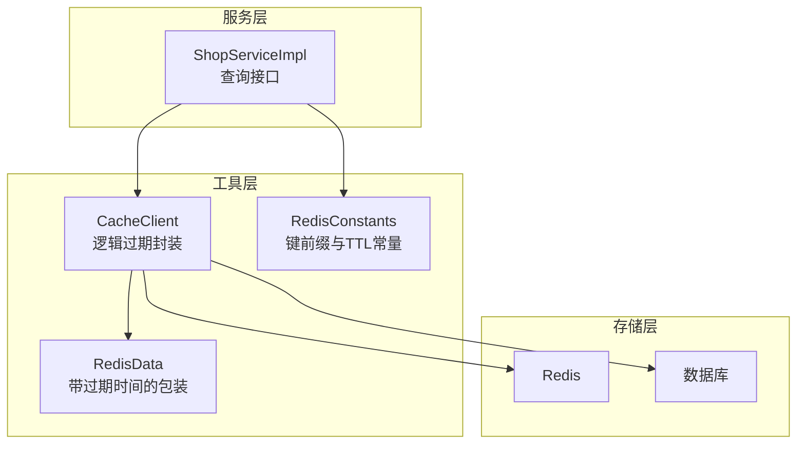
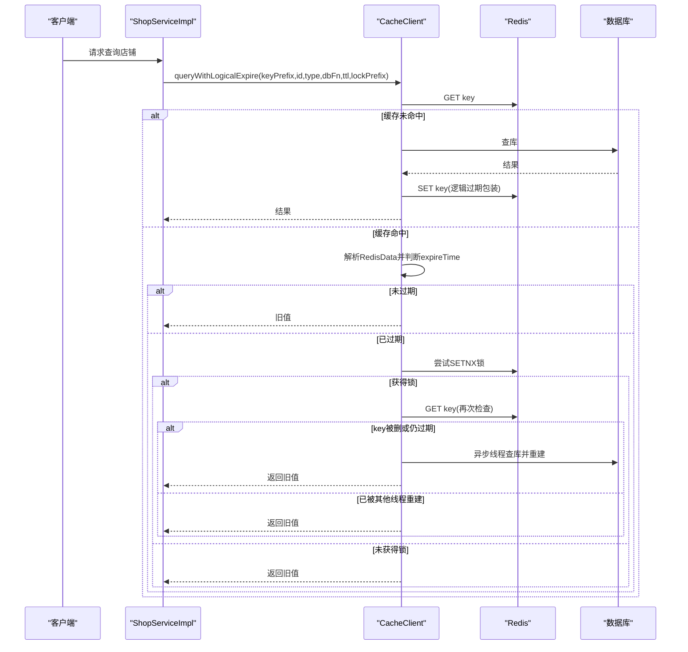
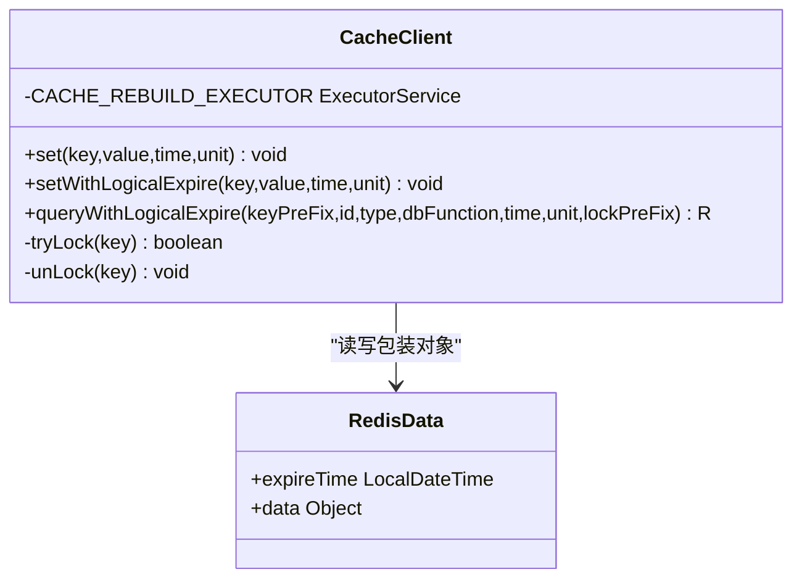
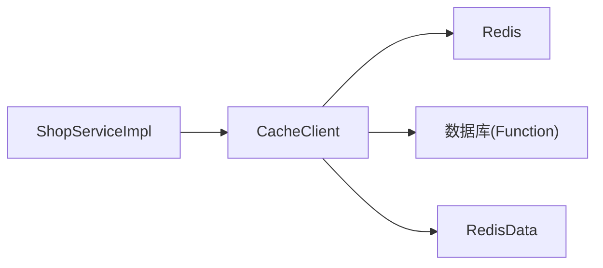

# 逻辑过期策略

<cite>
**本文引用的文件**   
- [CacheClient.java](file://src/main/java/com/hmdp/utils/CacheClient.java)
- [RedisData.java](file://src/main/java/com/hmdp/utils/RedisData.java)
- [ShopServiceImpl.java](file://src/main/java/com/hmdp/service/impl/ShopServiceImpl.java)
- [RedisConstants.java](file://src/main/java/com/hmdp/utils/RedisConstants.java)
</cite>

## 目录
1. [简介](#简介)
2. [项目结构](#项目结构)
3. [核心组件](#核心组件)
4. [架构总览](#架构总览)
5. [详细组件分析](#详细组件分析)
6. [依赖关系分析](#依赖关系分析)
7. [性能考量与调优](#性能考量与调优)
8. [故障排查指南](#故障排查指南)
9. [结论](#结论)
10. [附录：使用示例与最佳实践](#附录使用示例与最佳实践)

## 简介
本文件围绕 my-hbdp 项目的“逻辑过期”缓存策略，系统性解析 queryWithLogicalExpire 的实现原理，包括数据版本管理、异步缓存重建、锁机制与双检锁（Double-Check）在高并发场景下的作用。同时说明 RedisData 中 expireTime 字段的设计与时间戳比较逻辑，并给出线程池在后台缓存重建中的应用方式、性能调优参数与监控建议。

## 项目结构
本项目采用分层组织：
- utils：通用工具与缓存封装（CacheClient、RedisData、常量等）
- service/impl：业务实现（以 ShopServiceImpl 为例演示逻辑过期调用）
- config/mapper/entity/dto/controller 等：应用其他模块

图示来源
- [CacheClient.java:17-139](file://src/main/java/com/hmdp/utils/CacheClient.java#L17-L139)
- [RedisData.java:7-11](file://src/main/java/com/hmdp/utils/RedisData.java#L7-L11)
- [ShopServiceImpl.java:36-45](file://src/main/java/com/hmdp/service/impl/ShopServiceImpl.java#L36-L45)
- [RedisConstants.java:11-17](file://src/main/java/com/hmdp/utils/RedisConstants.java#L11-L17)

章节来源
- [CacheClient.java:17-139](file://src/main/java/com/hmdp/utils/CacheClient.java#L17-L139)
- [ShopServiceImpl.java:36-45](file://src/main/java/com/hmdp/service/impl/ShopServiceImpl.java#L36-L45)
- [RedisConstants.java:11-17](file://src/main/java/com/hmdp/utils/RedisConstants.java#L11-L17)

## 核心组件
- CacheClient：提供 setWithLogicalExpire 与 queryWithLogicalExpire 两个关键方法，封装了逻辑过期、锁、异步重建等能力。
- RedisData：用于在 Redis 中保存业务数据的同时携带逻辑过期时间戳。
- ShopServiceImpl：业务侧通过 queryWithLogicalExpire 访问店铺详情，展示典型用法。
- RedisConstants：集中定义缓存键前缀与锁键前缀等常量。

章节来源
- [CacheClient.java:29-34](file://src/main/java/com/hmdp/utils/CacheClient.java#L29-L34)
- [CacheClient.java:64-127](file://src/main/java/com/hmdp/utils/CacheClient.java#L64-L127)
- [RedisData.java:7-11](file://src/main/java/com/hmdp/utils/RedisData.java#L7-L11)
- [ShopServiceImpl.java:36-45](file://src/main/java/com/hmdp/service/impl/ShopServiceImpl.java#L36-L45)
- [RedisConstants.java:11-17](file://src/main/java/com/hmdp/utils/RedisConstants.java#L11-L17)

## 架构总览
逻辑过期策略的整体流程如下：
- 读路径：优先从 Redis 读取；若命中且未过期则直接返回；若已过期则尝试获取分布式锁，并在持有锁的情况下进行二次检查与异步重建。
- 写路径：更新数据库后删除对应缓存键，使下一次读触发回源与重建。

图示来源
- [CacheClient.java:64-127](file://src/main/java/com/hmdp/utils/CacheClient.java#L64-L127)
- [ShopServiceImpl.java:36-45](file://src/main/java/com/hmdp/service/impl/ShopServiceImpl.java#L36-L45)

## 详细组件分析

### CacheClient 类与方法
- setWithLogicalExpire：将业务对象与逻辑过期时间一起序列化存入 Redis，不依赖 Redis 的 TTL。
- queryWithLogicalExpire：核心逻辑，包含缓存读取、过期判断、锁竞争、双检锁与异步重建。
- tryLock/unLock：基于 Redis SETNX 的简单分布式锁实现，设置短过期时间避免死锁。

图示来源
- [CacheClient.java:17-139](file://src/main/java/com/hmdp/utils/CacheClient.java#L17-L139)
- [RedisData.java:7-11](file://src/main/java/com/hmdp/utils/RedisData.java#L7-L11)

章节来源
- [CacheClient.java:29-34](file://src/main/java/com/hmdp/utils/CacheClient.java#L29-L34)
- [CacheClient.java:64-127](file://src/main/java/com/hmdp/utils/CacheClient.java#L64-L127)
- [CacheClient.java:129-136](file://src/main/java/com/hmdp/utils/CacheClient.java#L129-L136)

### RedisData 设计与时间戳比较
- 设计要点：在 Redis 中保存一个包含 data 与 expireTime 的包装对象，expireTime 为绝对时间点（当前时间+TTL）。
- 比较逻辑：读取后解析 RedisData，用 expireTime 与当前时间比较，决定是否需要重建。
- 优势：不依赖 Redis 原生 TTL，便于在过期时继续返回旧值，同时后台异步刷新，降低延迟抖动。

章节来源
- [RedisData.java:7-11](file://src/main/java/com/hmdp/utils/RedisData.java#L7-L11)
- [CacheClient.java:79-86](file://src/main/java/com/hmdp/utils/CacheClient.java#L79-L86)

### 双检锁（Double-Check）在高并发中的作用
- 第一次检查：判断是否过期，决定是否进入加锁分支。
- 加锁后第二次检查：防止多个线程同时发现过期而重复重建；也兼容外部删除键后的边界情况。
- 仅在确认需要重建时才提交到线程池执行，减少不必要的重建开销。

章节来源
- [CacheClient.java:82-109](file://src/main/java/com/hmdp/utils/CacheClient.java#L82-L109)

### 线程池在后台缓存重建中的应用
- 固定大小线程池：用于异步执行数据库查询与缓存重建，避免阻塞主请求线程。
- 任务内容：在确保锁持有与二次检查通过后，提交重建任务；成功后写入新的逻辑过期包装数据。
- 注意事项：线程池大小需结合 QPS、DB 连接数与 CPU 核数综合评估；异常需在 finally 中释放锁。

章节来源
- [CacheClient.java:62](file://src/main/java/com/hmdp/utils/CacheClient.java#L62)
- [CacheClient.java:110-122](file://src/main/java/com/hmdp/utils/CacheClient.java#L110-L122)

### 锁机制与一致性保障
- 锁粒度：按业务 ID 划分，不同资源互不影响。
- 锁超时：设置较短过期时间，避免极端情况下锁无法释放导致雪崩。
- 解锁时机：在成功重建完成后释放；若 key 被外部删除，则在快速路径中直接重建并释放。

章节来源
- [CacheClient.java:88-100](file://src/main/java/com/hmdp/utils/CacheClient.java#L88-L100)
- [CacheClient.java:129-136](file://src/main/java/com/hmdp/utils/CacheClient.java#L129-L136)

### 写路径与一致性
- 更新数据库后删除缓存键，使下次读走回源路径，保证最终一致性。
- 注意：删除操作应幂等，避免误删其他 key。

章节来源
- [ShopServiceImpl.java:47-58](file://src/main/java/com/hmdp/service/impl/ShopServiceImpl.java#L47-L58)

## 依赖关系分析
- 组件耦合：
  - ShopServiceImpl 依赖 CacheClient 提供的逻辑过期能力。
  - CacheClient 依赖 Redis 与数据库（通过传入的 dbFunction）。
  - RedisData 作为数据载体被 CacheClient 读写。
- 外部依赖：
  - Redis：用于缓存与分布式锁。
  - 数据库：通过 Function<ID,R> 注入具体查询逻辑。

图示来源
- [ShopServiceImpl.java:36-45](file://src/main/java/com/hmdp/service/impl/ShopServiceImpl.java#L36-L45)
- [CacheClient.java:64-127](file://src/main/java/com/hmdp/utils/CacheClient.java#L64-L127)
- [RedisData.java:7-11](file://src/main/java/com/hmdp/utils/RedisData.java#L7-L11)

章节来源
- [ShopServiceImpl.java:36-45](file://src/main/java/com/hmdp/service/impl/ShopServiceImpl.java#L36-L45)
- [CacheClient.java:64-127](file://src/main/java/com/hmdp/utils/CacheClient.java#L64-L127)

## 性能考量与调优
- 线程池规模：根据 QPS、CPU 核数与数据库连接池大小调整，避免过大导致上下文切换与连接耗尽。
- 锁超时时间：过短可能导致重建未完成即被释放，过长可能引发热点 key 长时间阻塞。
- 逻辑过期时间：需权衡一致性与性能，热点数据可设置较长 TTL，降低重建频率。
- 序列化开销：RedisData 包装会增加一次 JSON 编解码成本，建议在热点路径上评估收益。
- 监控指标：
  - 缓存命中率、过期率、重建次数、平均重建耗时、锁等待时长。
  - 关注异常率与慢查询，必要时对热点 key 做限流或降级。

[本节为通用指导，不直接分析具体文件]

## 故障排查指南
- 现象：频繁重建或锁竞争激烈
  - 排查点：锁超时是否过短、TTL 是否过小、热点 key 是否集中。
- 现象：重建失败导致脏数据
  - 排查点：异步任务异常处理与锁释放是否正确；重试与补偿策略是否完善。
- 现象：一致性差
  - 排查点：写路径是否删除缓存；是否存在多写冲突；是否引入版本号或时间戳校验。

章节来源
- [CacheClient.java:110-122](file://src/main/java/com/hmdp/utils/CacheClient.java#L110-L122)
- [ShopServiceImpl.java:47-58](file://src/main/java/com/hmdp/service/impl/ShopServiceImpl.java#L47-L58)

## 结论
逻辑过期策略在不牺牲可用性的前提下，显著降低了热点数据的读延迟抖动。通过 RedisData 的时间戳管理与双检锁配合，既保证了高并发下的正确性，又实现了后台异步重建。合理配置线程池与锁超时，并结合完善的监控与降级策略，可在生产环境稳定落地。

[本节为总结，不直接分析具体文件]

## 附录：使用示例与最佳实践

### 使用示例（代码片段路径）
- 在业务服务中调用逻辑过期查询：
  - [ShopServiceImpl.queryById 调用逻辑过期:36-45](file://src/main/java/com/hmdp/service/impl/ShopServiceImpl.java#L36-L45)
- 常量定义（键前缀与锁前缀）：
  - [RedisConstants 中的缓存与锁键前缀:11-17](file://src/main/java/com/hmdp/utils/RedisConstants.java#L11-L17)

章节来源
- [ShopServiceImpl.java:36-45](file://src/main/java/com/hmdp/service/impl/ShopServiceImpl.java#L36-L45)
- [RedisConstants.java:11-17](file://src/main/java/com/hmdp/utils/RedisConstants.java#L11-L17)

### 最佳实践清单
- 统一封装：将逻辑过期能力收敛至 CacheClient，业务侧仅关注函数式数据源。
- 明确键空间：业务数据与锁使用不同前缀，避免覆盖。
- 写路径清理：更新后删除缓存键，确保下次读回源。
- 监控告警：对重建耗时、锁等待、异常率设置阈值告警。
- 容量规划：线程池与数据库连接池协同规划，避免瓶颈转移。

[本节为通用指导，不直接分析具体文件]