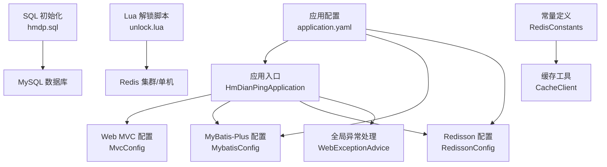
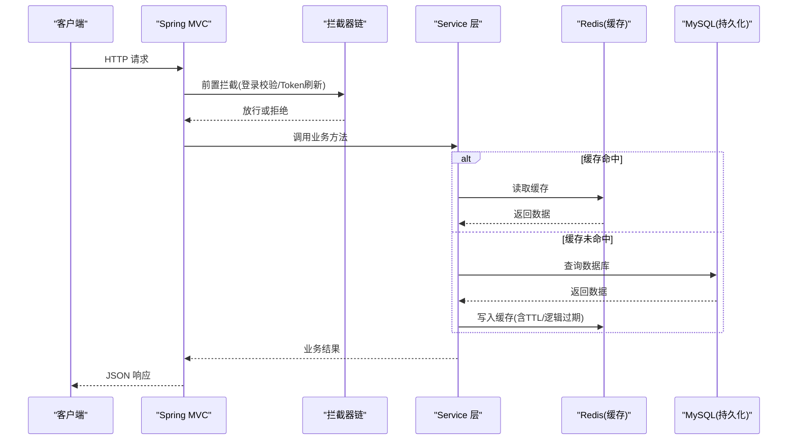
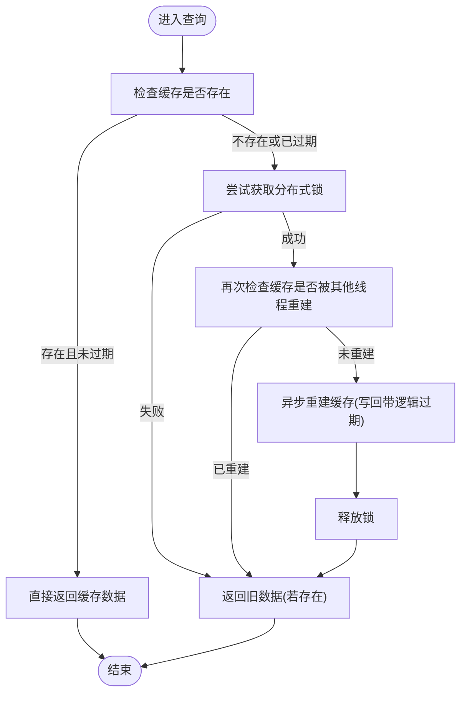
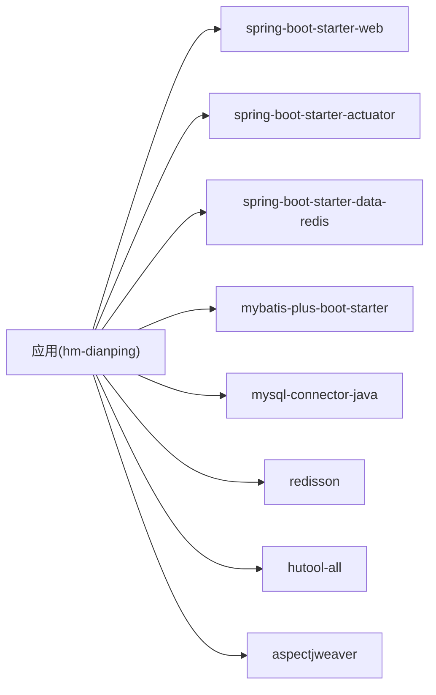

# 部署指南

<cite>
**本文引用的文件**   
- [pom.xml](file://pom.xml)
- [application.yaml](file://src/main/resources/application.yaml)
- [HmDianPingApplication.java](file://src/main/java/com/hmdp/HmDianPingApplication.java)
- [MybatisConfig.java](file://src/main/java/com/hmdp/config/MybatisConfig.java)
- [RedissonConfig.java](file://src/main/java/com/hmdp/config/RedissonConfig.java)
- [MvcConfig.java](file://src/main/java/com/hmdp/config/MvcConfig.java)
- [WebExceptionAdvice.java](file://src/main/java/com/hmdp/config/WebExceptionAdvice.java)
- [CacheClient.java](file://src/main/java/com/hmdp/utils/CacheClient.java)
- [RedisConstants.java](file://src/main/java/com/hmdp/utils/RedisConstants.java)
- [RedisIdWorker.java](file://src/main/java/com/hmdp/utils/RedisIdWorker.java)
- [unlock.lua](file://src/main/resources/unlock.lua)
- [hmdp.sql](file://src/main/resources/db/hmdp.sql)
</cite>

## 目录
1. [简介](#简介)
2. [项目结构](#项目结构)
3. [核心组件](#核心组件)
4. [架构总览](#架构总览)
5. [详细组件分析](#详细组件分析)
6. [依赖关系分析](#依赖关系分析)
7. [性能调优指南](#性能调优指南)
8. [故障排查手册](#故障排查手册)
9. [监控与日志](#监控与日志)
10. [结论](#结论)
11. [附录：本地与生产环境清单](#附录本地与生产环境清单)

## 简介
本指南面向 my-hbdp（hm-dianping）项目的部署与运维，覆盖本地开发环境搭建、生产环境最佳实践（容器化、环境变量管理、依赖服务配置）、性能调优（JVM、数据库连接池、Redis缓存策略）、故障排查、监控指标与日志收集。文档内容严格基于仓库源码与配置文件进行分析与总结，确保可落地执行。

## 项目结构
- 应用入口与启动类位于主包下，启用 AOP 与 MyBatis-Plus Mapper 扫描。
- 配置集中在 resources/application.yaml，包含 Web 端口、数据源、Redis、Jackson、MyBatis-Plus 别名与日志级别。
- 关键配置类包括 MyBatis-Plus 分页插件、Redisson 客户端、MVC 拦截器与全局异常处理。
- 业务层通过 Service 实现访问数据库与 Redis 缓存，使用常量集中管理 Redis Key 与 TTL。
- 资源脚本提供初始化 SQL 与 Lua 解锁脚本。

图表来源
- [HmDianPingApplication.java:1-18](file://src/main/java/com/hmdp/HmDianPingApplication.java#L1-L18)
- [application.yaml:1-28](file://src/main/resources/application.yaml#L1-L28)
- [MybatisConfig.java:1-18](file://src/main/java/com/hmdp/config/MybatisConfig.java#L1-L18)
- [RedissonConfig.java:1-17](file://src/main/java/com/hmdp/config/RedissonConfig.java#L1-L17)
- [MvcConfig.java:1-33](file://src/main/java/com/hmdp/config/MvcConfig.java#L1-L33)
- [WebExceptionAdvice.java:1-17](file://src/main/java/com/hmdp/config/WebExceptionAdvice.java#L1-L17)
- [hmdp.sql:1-800](file://src/main/resources/db/hmdp.sql#L1-L800)
- [unlock.lua:1-5](file://src/main/resources/unlock.lua#L1-L5)
- [RedisConstants.java:1-24](file://src/main/java/com/hmdp/utils/RedisConstants.java#L1-L24)
- [CacheClient.java:1-140](file://src/main/java/com/hmdp/utils/CacheClient.java#L1-L140)

章节来源
- [HmDianPingApplication.java:1-18](file://src/main/java/com/hmdp/HmDianPingApplication.java#L1-L18)
- [application.yaml:1-28](file://src/main/resources/application.yaml#L1-L28)
- [MybatisConfig.java:1-18](file://src/main/java/com/hmdp/config/MybatisConfig.java#L1-L18)
- [RedissonConfig.java:1-17](file://src/main/java/com/hmdp/config/RedissonConfig.java#L1-L17)
- [MvcConfig.java:1-33](file://src/main/java/com/hmdp/config/MvcConfig.java#L1-L33)
- [WebExceptionAdvice.java:1-17](file://src/main/java/com/hmdp/config/WebExceptionAdvice.java#L1-L17)
- [hmdp.sql:1-800](file://src/main/resources/db/hmdp.sql#L1-L800)
- [unlock.lua:1-5](file://src/main/resources/unlock.lua#L1-L5)
- [RedisConstants.java:1-24](file://src/main/java/com/hmdp/utils/RedisConstants.java#L1-L24)
- [CacheClient.java:1-140](file://src/main/java/com/hmdp/utils/CacheClient.java#L1-L140)

## 核心组件
- 应用启动与装配
  - 启动类启用 AOP 代理暴露、Mapper 扫描与 Spring Boot 自动装配。
- 数据访问层
  - 使用 MyBatis-Plus 作为 ORM，并注册分页插件以支持 MySQL 分页。
- 缓存与分布式锁
  - 使用 StringRedisTemplate 进行缓存读写；自定义 CacheClient 封装穿透与逻辑过期策略；使用 Redisson 提供分布式锁能力。
- Web 层
  - 注册登录与刷新令牌拦截器，排除部分公开接口路径；统一异常处理返回标准结果。
- 配置与常量
  - application.yaml 集中配置端口、数据源、Redis、Jackson、日志级别等；RedisConstants 集中管理 Key 前缀与 TTL。

章节来源
- [HmDianPingApplication.java:1-18](file://src/main/java/com/hmdp/HmDianPingApplication.java#L1-L18)
- [MybatisConfig.java:1-18](file://src/main/java/com/hmdp/config/MybatisConfig.java#L1-L18)
- [CacheClient.java:1-140](file://src/main/java/com/hmdp/utils/CacheClient.java#L1-L140)
- [RedissonConfig.java:1-17](file://src/main/java/com/hmdp/config/RedissonConfig.java#L1-L17)
- [MvcConfig.java:1-33](file://src/main/java/com/hmdp/config/MvcConfig.java#L1-L33)
- [WebExceptionAdvice.java:1-17](file://src/main/java/com/hmdp/config/WebExceptionAdvice.java#L1-L17)
- [application.yaml:1-28](file://src/main/resources/application.yaml#L1-L28)
- [RedisConstants.java:1-24](file://src/main/java/com/hmdp/utils/RedisConstants.java#L1-L24)

## 架构总览
系统采用典型三层架构：Web 控制器 → Service 业务逻辑 → Mapper 数据访问；中间件包括 MySQL 与 Redis（含 Redisson）。应用内通过拦截器完成鉴权与 Token 刷新，通过全局异常处理器统一错误响应。

图表来源
- [MvcConfig.java:1-33](file://src/main/java/com/hmdp/config/MvcConfig.java#L1-L33)
- [CacheClient.java:1-140](file://src/main/java/com/hmdp/utils/CacheClient.java#L1-L140)
- [application.yaml:1-28](file://src/main/resources/application.yaml#L1-L28)

## 详细组件分析

### 应用启动与基础配置
- 启动类
  - 启用 AOP 代理暴露、Mapper 扫描、Spring Boot 启动。
- 应用配置
  - 端口、应用名、数据源、Redis、Jackson、MyBatis-Plus 别名、日志级别。
- MyBatis-Plus 分页
  - 注册分页插件，适配 MySQL 方言。

章节来源
- [HmDianPingApplication.java:1-18](file://src/main/java/com/hmdp/HmDianPingApplication.java#L1-L18)
- [application.yaml:1-28](file://src/main/resources/application.yaml#L1-L28)
- [MybatisConfig.java:1-18](file://src/main/java/com/hmdp/config/MybatisConfig.java#L1-L18)

### 缓存与分布式锁
- 缓存策略
  - 穿透防护：空值短 TTL 缓存。
  - 逻辑过期：在缓存中记录过期时间，后台线程异步重建，避免雪崩。
- 分布式锁
  - 基于 Redisson 的客户端 Bean 提供锁能力；同时 CacheClient 内部使用 setIfAbsent 做简单互斥。
- 常量与 Key 设计
  - 登录、店铺、秒杀库存、点赞、地理信息等 Key 前缀与 TTL 集中管理。

图表来源
- [CacheClient.java:1-140](file://src/main/java/com/hmdp/utils/CacheClient.java#L1-L140)
- [RedisConstants.java:1-24](file://src/main/java/com/hmdp/utils/RedisConstants.java#L1-L24)
- [RedissonConfig.java:1-17](file://src/main/java/com/hmdp/config/RedissonConfig.java#L1-L17)

章节来源
- [CacheClient.java:1-140](file://src/main/java/com/hmdp/utils/CacheClient.java#L1-L140)
- [RedisConstants.java:1-24](file://src/main/java/com/hmdp/utils/RedisConstants.java#L1-L24)
- [RedissonConfig.java:1-17](file://src/main/java/com/hmdp/config/RedissonConfig.java#L1-L17)

### Web 层与鉴权
- 拦截器
  - 登录拦截器：未登录返回 401。
  - 刷新令牌拦截器：结合 Redis 中的用户会话信息刷新有效期。
  - 公开接口白名单：如商户、优惠券、类型、上传、热门帖子、验证码与登录接口。
- 全局异常处理
  - 捕获运行时异常，记录日志并返回统一错误码与消息。

章节来源
- [MvcConfig.java:1-33](file://src/main/java/com/hmdp/config/MvcConfig.java#L1-L33)
- [WebExceptionAdvice.java:1-17](file://src/main/java/com/hmdp/config/WebExceptionAdvice.java#L1-L17)

### 数据模型与初始化
- 数据库初始化脚本
  - 提供多张表结构与示例数据，涵盖博客、评论、关注、商户、商户类型、用户、签到、优惠券与订单等。
- ID 生成
  - 基于 Redis 自增的时间戳+序号组合 ID 生成器，用于分布式场景下的唯一标识。

章节来源
- [hmdp.sql:1-800](file://src/main/resources/db/hmdp.sql#L1-L800)
- [RedisIdWorker.java:1-38](file://src/main/java/com/hmdp/utils/RedisIdWorker.java#L1-L38)

## 依赖关系分析
- 构建与运行
  - 基于 Spring Boot 2.3.12，Java 8。
  - 依赖包括 Actuator、Data Redis、Web、MySQL Connector、MyBatis-Plus、Hutool、AspectJ、Redisson。
- 外部依赖
  - MySQL 5.x（驱动版本 5.1.47）。
  - Redis（Lettuce 连接池 + Redisson 客户端）。

图表来源
- [pom.xml:1-96](file://pom.xml#L1-L96)

章节来源
- [pom.xml:1-96](file://pom.xml#L1-L96)

## 性能调优指南

### JVM 参数优化
- 建议根据服务器内存规模调整堆大小与 GC 策略，例如：
  - 设置初始与最大堆大小一致以减少动态扩容开销。
  - 选择适合吞吐与延迟的垃圾回收器（如 G1），并开启相关统计输出以便定位问题。
- 注意：本项目未内置 JVM 参数，需在启动命令或容器编排中传入。

[本节为通用指导，不直接分析具体文件]

### 数据库连接池配置
- 当前未引入独立连接池依赖，默认使用 Spring Boot 内置连接池。
- 建议在生产环境显式配置连接池参数（最大连接数、空闲超时、最小空闲等），并根据 QPS 与慢查询情况调优。
- 索引与 SQL 优化：依据 hmdp.sql 中的表结构，对高频查询字段建立合适索引，避免全表扫描。

章节来源
- [application.yaml:1-28](file://src/main/resources/application.yaml#L1-L28)
- [hmdp.sql:1-800](file://src/main/resources/db/hmdp.sql#L1-L800)

### Redis 缓存策略调整
- 连接池（Lettuce）
  - 当前已配置最大活跃、最大空闲、最小空闲与驱逐周期，可根据并发量提升 max-active 与 min-idle。
- 逻辑过期与异步重建
  - 使用逻辑过期避免缓存击穿；后台线程池大小需评估热点 Key 的重建频率，防止阻塞。
- 分布式锁
  - Redisson 单节点地址与密码硬编码，生产环境应改为环境变量注入，并考虑哨兵或集群模式。
- Key 与 TTL
  - 合理设置不同业务的 TTL，避免热 Key 频繁失效导致雪崩；必要时引入随机抖动。

章节来源
- [application.yaml:1-28](file://src/main/resources/application.yaml#L1-L28)
- [CacheClient.java:1-140](file://src/main/java/com/hmdp/utils/CacheClient.java#L1-L140)
- [RedissonConfig.java:1-17](file://src/main/java/com/hmdp/config/RedissonConfig.java#L1-L17)
- [RedisConstants.java:1-24](file://src/main/java/com/hmdp/utils/RedisConstants.java#L1-L24)

## 故障排查手册

### 常见问题与定位
- 无法连接 MySQL
  - 检查 application.yaml 中的数据源 URL、用户名、密码与网络连通性。
  - 确认数据库已创建对应库并导入 hmdp.sql。
- 无法连接 Redis
  - 检查 host、port、password 是否正确；Redisson 配置同样需要匹配。
  - 若使用防火墙或云安全组，确保端口开放。
- 登录鉴权失败
  - 确认拦截器白名单是否包含所需接口；检查 Redis 中登录态 Key 是否存在且未过期。
- 缓存不一致或击穿
  - 观察逻辑过期是否生效；检查分布式锁是否成功获取；查看后台重建线程是否被阻塞。
- 全局异常
  - 查看 WebExceptionAdvice 日志输出，定位具体异常栈。

章节来源
- [application.yaml:1-28](file://src/main/resources/application.yaml#L1-L28)
- [hmdp.sql:1-800](file://src/main/resources/db/hmdp.sql#L1-L800)
- [MvcConfig.java:1-33](file://src/main/java/com/hmdp/config/MvcConfig.java#L1-L33)
- [CacheClient.java:1-140](file://src/main/java/com/hmdp/utils/CacheClient.java#L1-L140)
- [WebExceptionAdvice.java:1-17](file://src/main/java/com/hmdp/config/WebExceptionAdvice.java#L1-L17)

## 监控与日志

### 监控指标
- Actuator 端点
  - 项目已引入 actuator，可通过 /actuator 暴露健康检查、指标等信息。
  - 建议在生产环境限制访问来源，并结合 Prometheus/Grafana 采集。

章节来源
- [pom.xml:1-96](file://pom.xml#L1-L96)

### 日志收集
- 应用日志
  - 当前将 com.hmdp 包日志级别设置为 debug，便于开发调试；生产建议调整为 info 或 warn。
- 异常日志
  - 全局异常处理器会记录运行时异常堆栈，便于快速定位。
- 外部日志
  - 建议接入 ELK/EFK 或云厂商日志服务，统一收集应用与依赖服务日志。

章节来源
- [application.yaml:1-28](file://src/main/resources/application.yaml#L1-L28)
- [WebExceptionAdvice.java:1-17](file://src/main/java/com/hmdp/config/WebExceptionAdvice.java#L1-L17)

## 结论
本项目基于 Spring Boot 2.3.12 与 Java 8，集成 MyBatis-Plus、Redis（Lettuce + Redisson）与 Actuator，具备完善的缓存与分布式锁能力。部署时需重点关注数据库与 Redis 的连接配置、缓存策略与锁的正确性，以及日志与监控的完善。生产环境建议通过容器化与变量注入实现可观测性与高可用。

[本节为总结，不直接分析具体文件]

## 附录：本地与生产环境清单

### 本地开发环境搭建
- 安装 JDK 8
- 安装 Maven（建议使用 3.6+）
- 安装 MySQL 5.x，创建数据库并导入 hmdp.sql
- 安装 Redis，设置密码与端口
- 修改 application.yaml 中的数据库与 Redis 连接信息
- 启动应用：mvn spring-boot:run 或直接运行主类

章节来源
- [application.yaml:1-28](file://src/main/resources/application.yaml#L1-L28)
- [hmdp.sql:1-800](file://src/main/resources/db/hmdp.sql#L1-L800)
- [HmDianPingApplication.java:1-18](file://src/main/java/com/hmdp/HmDianPingApplication.java#L1-L18)

### 生产环境最佳实践
- 容器化部署
  - 使用 Spring Boot Maven 插件打包，编写 Dockerfile 构建镜像，并通过 docker-compose 编排应用、MySQL、Redis。
- 环境变量管理
  - 将数据库 URL、用户名、密码、Redis host/port/password、Actuator 开关等抽取为环境变量，避免硬编码。
- 依赖服务配置
  - Redis 建议启用哨兵或集群；MySQL 建议主从或高可用方案；Nginx 反向代理与 HTTPS 证书管理。
- 安全加固
  - 关闭不必要的 Actuator 端点或限制访问；强密码与最小权限原则；网络隔离与安全组。

[本节为通用指导，不直接分析具体文件]