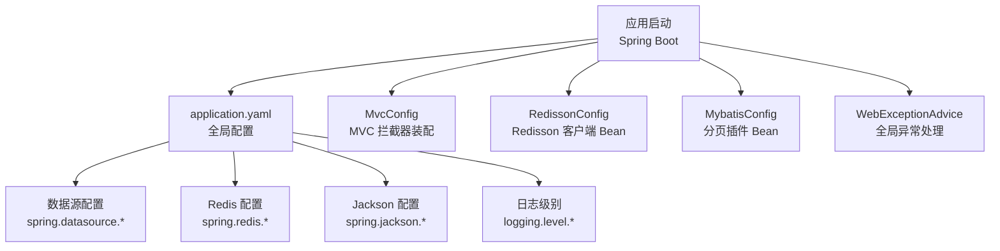
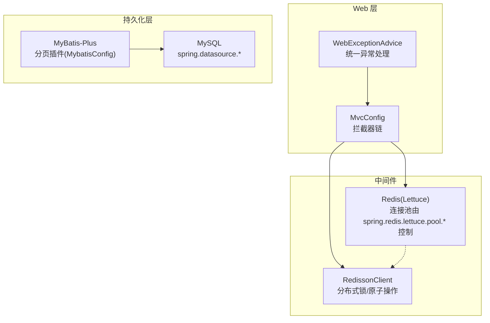
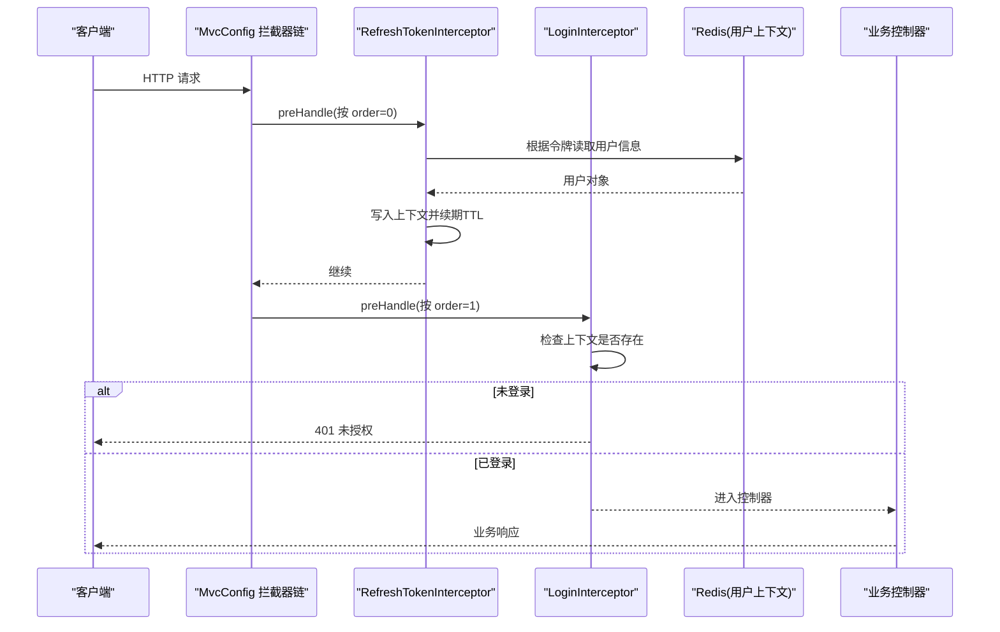
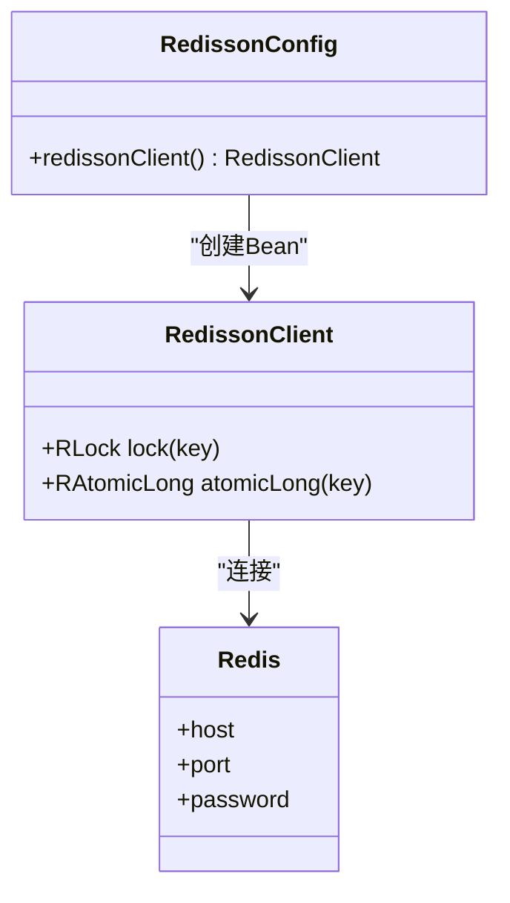
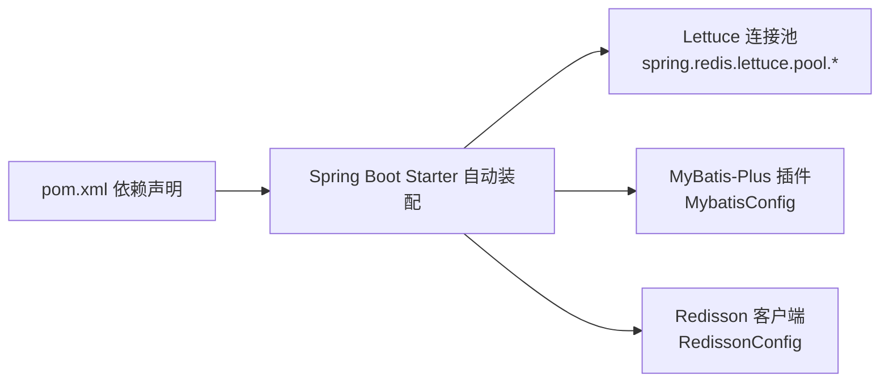

# 配置管理

<cite>
**本文引用的文件**   
- [application.yaml](file://src/main/resources/application.yaml)
- [MvcConfig.java](file://src/main/java/com/hmdp/config/MvcConfig.java)
- [RedissonConfig.java](file://src/main/java/com/hmdp/config/RedissonConfig.java)
- [MybatisConfig.java](file://src/main/java/com/hmdp/config/MybatisConfig.java)
- [WebExceptionAdvice.java](file://src/main/java/com/hmdp/config/WebExceptionAdvice.java)
- [pom.xml](file://pom.xml)
- [LoginInterceptor.java](file://src/main/java/com/hmdp/utils/LoginInterceptor.java)
- [RefreshTokenInterceptor.java](file://src/main/java/com/hmdp/utils/RefreshTokenInterceptor.java)
- [RedisConstants.java](file://src/main/java/com/hmdp/utils/RedisConstants.java)
</cite>

## 目录
1. [简介](#简介)
2. [项目结构](#项目结构)
3. [核心组件](#核心组件)
4. [架构总览](#架构总览)
5. [详细组件分析](#详细组件分析)
6. [依赖分析](#依赖分析)
7. [性能考虑](#性能考虑)
8. [故障排查指南](#故障排查指南)
9. [结论](#结论)
10. [附录](#附录)

## 简介
本文件聚焦 my-hbdp 项目的配置管理，围绕 application.yaml 中的数据库、Redis、日志等关键配置进行系统化说明，并深入解析 MVC 拦截器、Redisson 分布式锁、MyBatis-Plus 插件等自定义配置的作用与设置方法。同时给出多环境配置策略、配置校验、热重载与配置中心集成建议，以及安全与敏感信息保护的最佳实践。

## 项目结构
本项目采用 Spring Boot 标准结构，配置集中在 resources 下的 application.yaml；与配置相关的 Java 类位于 config 包下，包括 MVC 拦截器装配、Redisson 客户端初始化、MyBatis-Plus 分页插件注册等。

图表来源
- [application.yaml:1-28](file://src/main/resources/application.yaml#L1-L28)
- [MvcConfig.java:1-34](file://src/main/java/com/hmdp/config/MvcConfig.java#L1-L34)
- [RedissonConfig.java:1-18](file://src/main/java/com/hmdp/config/RedissonConfig.java#L1-L18)
- [MybatisConfig.java:1-18](file://src/main/java/com/hmdp/config/MybatisConfig.java#L1-L18)
- [WebExceptionAdvice.java:1-17](file://src/main/java/com/hmdp/config/WebExceptionAdvice.java#L1-L17)

章节来源
- [application.yaml:1-28](file://src/main/resources/application.yaml#L1-L28)
- [MvcConfig.java:1-34](file://src/main/java/com/hmdp/config/MvcConfig.java#L1-L34)
- [RedissonConfig.java:1-18](file://src/main/java/com/hmdp/config/RedissonConfig.java#L1-L18)
- [MybatisConfig.java:1-18](file://src/main/java/com/hmdp/config/MybatisConfig.java#L1-L18)
- [WebExceptionAdvice.java:1-17](file://src/main/java/com/hmdp/config/WebExceptionAdvice.java#L1-L17)

## 核心组件
本节对与配置直接相关的关键组件进行概览，帮助读者快速建立整体认知。

- 应用基础配置（application.yaml）
  - 服务端口、应用名称
  - 数据源连接参数（驱动、URL、用户名、密码）
  - Redis 连接与连接池参数（主机、端口、密码、Lettuce 连接池）
  - Jackson JSON 序列化默认行为
  - 日志级别控制

- MVC 配置（MvcConfig）
  - 登录拦截器：对需要鉴权的接口进行拦截
  - 刷新令牌拦截器：在请求前从 Redis 读取用户上下文并续期
  - 白名单路径：公开接口无需登录

- Redisson 配置（RedissonConfig）
  - 通过单节点模式创建 RedissonClient Bean
  - 用于分布式锁、限流等场景

- MyBatis-Plus 配置（MybatisConfig）
  - 注册分页插件，指定数据库类型为 MySQL

- 全局异常处理（WebExceptionAdvice）
  - 统一捕获运行时异常并返回标准化结果

章节来源
- [application.yaml:1-28](file://src/main/resources/application.yaml#L1-L28)
- [MvcConfig.java:1-34](file://src/main/java/com/hmdp/config/MvcConfig.java#L1-L34)
- [RedissonConfig.java:1-18](file://src/main/java/com/hmdp/config/RedissonConfig.java#L1-L18)
- [MybatisConfig.java:1-18](file://src/main/java/com/hmdp/config/MybatisConfig.java#L1-L18)
- [WebExceptionAdvice.java:1-17](file://src/main/java/com/hmdp/config/WebExceptionAdvice.java#L1-L17)

## 架构总览
下图展示了配置如何影响运行时的关键子系统：数据访问层、缓存与分布式锁、Web 请求处理链路。

图表来源
- [application.yaml:1-28](file://src/main/resources/application.yaml#L1-L28)
- [MvcConfig.java:1-34](file://src/main/java/com/hmdp/config/MvcConfig.java#L1-L34)
- [RedissonConfig.java:1-18](file://src/main/java/com/hmdp/config/RedissonConfig.java#L1-L18)
- [MybatisConfig.java:1-18](file://src/main/java/com/hmdp/config/MybatisConfig.java#L1-L18)
- [WebExceptionAdvice.java:1-17](file://src/main/java/com/hmdp/config/WebExceptionAdvice.java#L1-L17)

## 详细组件分析

### application.yaml 配置详解
- 服务器与应用
  - server.port：服务监听端口
  - spring.application.name：应用标识，常用于注册中心或日志追踪

- 数据库连接（DataSource）
  - driver-class-name：JDBC 驱动类名
  - url：JDBC URL，包含时区、SSL、公钥检索等参数
  - username/password：数据库账号与密码

- Redis 连接（Lettuce）
  - host/port/password：Redis 地址与认证
  - lettuce.pool.*：连接池大小、空闲回收策略等

- Jackson 序列化
  - default-property-inclusion：JSON 输出时忽略空字段

- 日志
  - logging.level.com.hmdp：业务包日志级别

章节来源
- [application.yaml:1-28](file://src/main/resources/application.yaml#L1-L28)

### MVC 配置与拦截器链
- 目标
  - 为受保护接口提供统一的登录态校验与上下文注入
  - 对公开接口放行，减少不必要的鉴权开销

- 关键要点
  - LoginInterceptor：若当前线程无用户上下文则拒绝访问
  - RefreshTokenInterceptor：从请求头获取令牌，查询 Redis 中用户信息并写入上下文，同时续期 TTL
  - 白名单路径：如店铺、代金券、上传、热门博客、验证码与登录接口等

图表来源
- [MvcConfig.java:1-34](file://src/main/java/com/hmdp/config/MvcConfig.java#L1-L34)
- [LoginInterceptor.java:1-31](file://src/main/java/com/hmdp/utils/LoginInterceptor.java#L1-L31)
- [RefreshTokenInterceptor.java:1-51](file://src/main/java/com/hmdp/utils/RefreshTokenInterceptor.java#L1-L51)
- [RedisConstants.java:1-24](file://src/main/java/com/hmdp/utils/RedisConstants.java#L1-L24)

章节来源
- [MvcConfig.java:1-34](file://src/main/java/com/hmdp/config/MvcConfig.java#L1-L34)
- [LoginInterceptor.java:1-31](file://src/main/java/com/hmdp/utils/LoginInterceptor.java#L1-L31)
- [RefreshTokenInterceptor.java:1-51](file://src/main/java/com/hmdp/utils/RefreshTokenInterceptor.java#L1-L51)
- [RedisConstants.java:1-24](file://src/main/java/com/hmdp/utils/RedisConstants.java#L1-L24)

### Redisson 配置
- 作用
  - 提供分布式锁、原子计数、限流等能力
- 当前实现
  - 使用单节点模式，直连本地 Redis
  - 密码与地址硬编码在配置类中

图表来源
- [RedissonConfig.java:1-18](file://src/main/java/com/hmdp/config/RedissonConfig.java#L1-L18)
- [application.yaml:11-20](file://src/main/resources/application.yaml#L11-L20)

章节来源
- [RedissonConfig.java:1-18](file://src/main/java/com/hmdp/config/RedissonConfig.java#L1-L18)

### MyBatis-Plus 配置
- 作用
  - 启用分页插件，适配 MySQL 方言
- 关键点
  - 通过 Bean 方式注册 MybatisPlusInterceptor 并添加 PaginationInnerInterceptor

章节来源
- [MybatisConfig.java:1-18](file://src/main/java/com/hmdp/config/MybatisConfig.java#L1-L18)

### 全局异常处理
- 作用
  - 统一捕获运行时异常，记录错误日志并返回统一失败响应
- 适用场景
  - 简化各控制器的异常分支，提升一致性

章节来源
- [WebExceptionAdvice.java:1-17](file://src/main/java/com/hmdp/config/WebExceptionAdvice.java#L1-L17)

## 依赖分析
- 构建与依赖
  - Spring Boot 2.3.12 父工程
  - Web、Data Redis、Actuator、MySQL Connector、MyBatis-Plus、Redisson、Hutool、AspectJ 等

- 与配置的关联
  - spring-boot-starter-data-redis 自动装配 Lettuce 连接池，对应 application.yaml 的 lettuce.pool.*
  - redisson 版本与 RedissonConfig 的单节点模式配合使用
  - mybatis-plus-boot-starter 与 MybatisConfig 的分页插件协同工作

图表来源
- [pom.xml:1-96](file://pom.xml#L1-L96)
- [application.yaml:1-28](file://src/main/resources/application.yaml#L1-L28)
- [MybatisConfig.java:1-18](file://src/main/java/com/hmdp/config/MybatisConfig.java#L1-L18)
- [RedissonConfig.java:1-18](file://src/main/java/com/hmdp/config/RedissonConfig.java#L1-L18)

章节来源
- [pom.xml:1-96](file://pom.xml#L1-L96)

## 性能考虑
- 数据库连接
  - 合理设置连接池大小与超时，避免连接耗尽
  - 针对高并发读场景，可引入读写分离或只读副本

- Redis 连接池（Lettuce）
  - max-active/max-idle/min-idle 需结合 QPS 与实例规格调优
  - time-between-eviction-runs 控制空闲连接回收频率，平衡 CPU 与连接健康度

- Redisson
  - 生产建议使用集群或哨兵模式，避免单点故障
  - 调整网络超时、重试次数与线程池参数以匹配业务负载

- 日志
  - 开发阶段 debug 便于定位问题，生产建议调整为 info/warn
  - 对热点接口降低日志级别，避免 IO 瓶颈

[本节为通用指导，不直接分析具体文件]

## 故障排查指南
- 常见启动问题
  - 数据库连接失败：检查驱动类名、URL 参数（时区、SSL）、账号密码
  - Redis 连接失败：核对 host/port/password，确认防火墙与安全组
  - Redisson 连接失败：确认 Redisson 配置与 Redis 一致

- 鉴权相关问题
  - 401 未授权：检查是否命中白名单路径，确认令牌格式与 Redis 键空间
  - 频繁过期：关注刷新令牌拦截器的续期逻辑与 TTL 设置

- 日志与监控
  - 开启 Actuator 暴露必要端点，结合日志级别定位问题
  - 对关键路径增加耗时埋点与错误码规范

章节来源
- [application.yaml:1-28](file://src/main/resources/application.yaml#L1-L28)
- [MvcConfig.java:1-34](file://src/main/java/com/hmdp/config/MvcConfig.java#L1-L34)
- [LoginInterceptor.java:1-31](file://src/main/java/com/hmdp/utils/LoginInterceptor.java#L1-L31)
- [RefreshTokenInterceptor.java:1-51](file://src/main/java/com/hmdp/utils/RefreshTokenInterceptor.java#L1-L51)
- [RedissonConfig.java:1-18](file://src/main/java/com/hmdp/config/RedissonConfig.java#L1-L18)

## 结论
本项目通过 application.yaml 集中管理基础设施配置，并在 Java 配置类中对 MVC 拦截器、Redisson 客户端与 MyBatis-Plus 插件进行细粒度定制。当前实现简洁直观，适合学习与演示；在生产环境中应重点关注配置外部化、敏感信息保护、连接池与超时参数调优，以及多环境差异化管理。

[本节为总结性内容，不直接分析具体文件]

## 附录

### 多环境配置管理策略
- 推荐做法
  - 使用 Spring Profile 拆分配置：application-dev.yaml、application-prod.yaml 等
  - 通过环境变量或命令行参数激活 profile：--spring.profiles.active=dev
  - 将敏感信息（数据库密码、Redis 密码、第三方密钥）放入环境变量或密钥管理服务，不在代码与仓库中明文存储

- 示例思路
  - 在 application.yaml 中仅保留公共配置
  - 在各环境文件中覆盖差异化配置项（端口、数据源、Redis、日志级别等）

[本节为通用指导，不直接分析具体文件]

### 配置校验与热重载
- 配置校验
  - 使用 @ConfigurationProperties 绑定配置并进行 JSR-303 校验，确保必填项与取值范围正确
  - 在启动阶段抛出明确错误，避免运行期隐式失败

- 热重载
  - 开发阶段可使用 Spring Boot DevTools 实现部分热更新
  - 对于非热更新的配置项，可通过 Actuator 的 refresh 端点或配置中心推送后重启容器

[本节为通用指导，不直接分析具体文件]

### 配置中心集成最佳实践
- 可选方案
  - Nacos/Apollo/Spring Cloud Config 等作为统一配置中心
  - 支持动态刷新、灰度发布与审计追踪

- 集成要点
  - 将敏感配置加密存储，启动时解密
  - 区分命名空间/分组，隔离不同环境与租户
  - 对关键配置变更增加告警与回滚机制

[本节为通用指导，不直接分析具体文件]

### 安全与敏感信息保护
- 最小权限原则
  - 数据库与 Redis 账号仅授予必要权限
  - 限制访问 IP 白名单与网络策略

- 传输与存储安全
  - 数据库连接启用 SSL（根据实际环境评估）
  - 敏感配置使用环境变量或密钥管理服务，禁止硬编码

- 令牌与上下文
  - 令牌长度与签名算法需满足安全要求
  - 定期轮换密钥与密码，记录访问审计日志

[本节为通用指导，不直接分析具体文件]