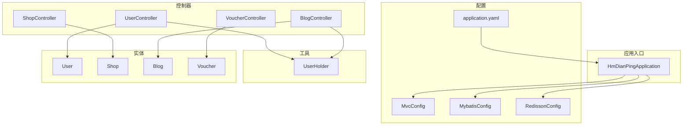
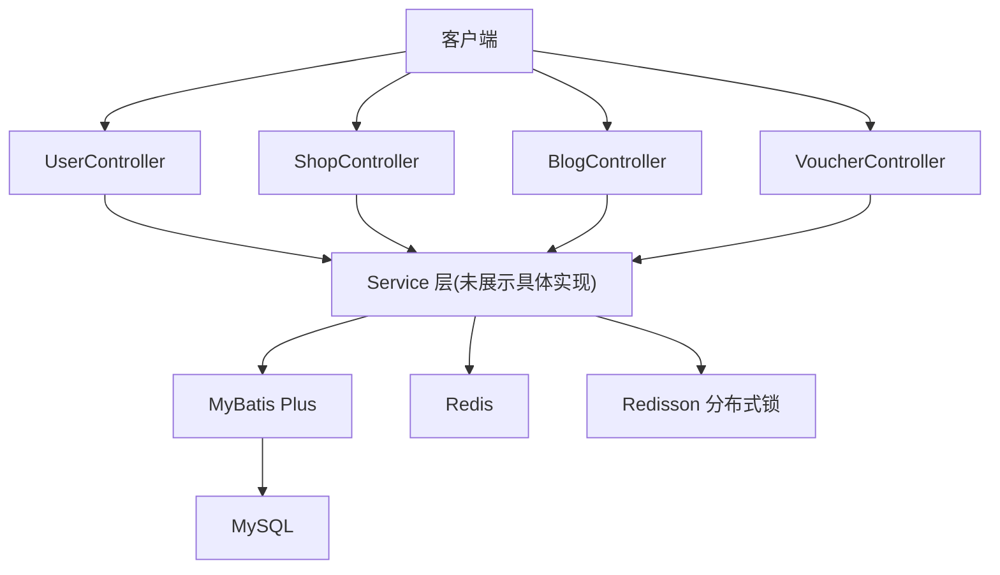
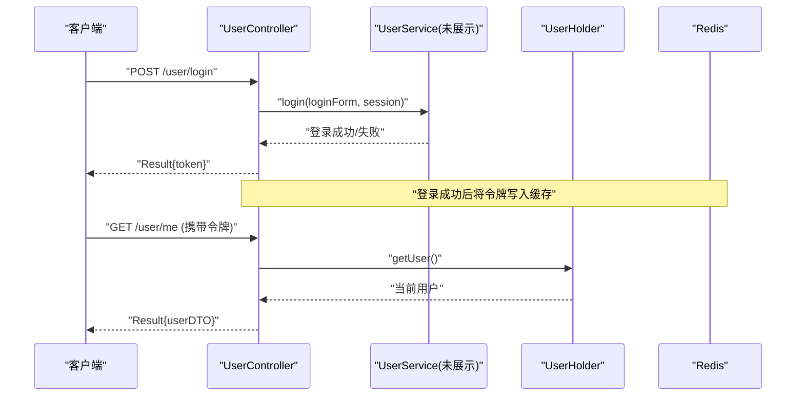
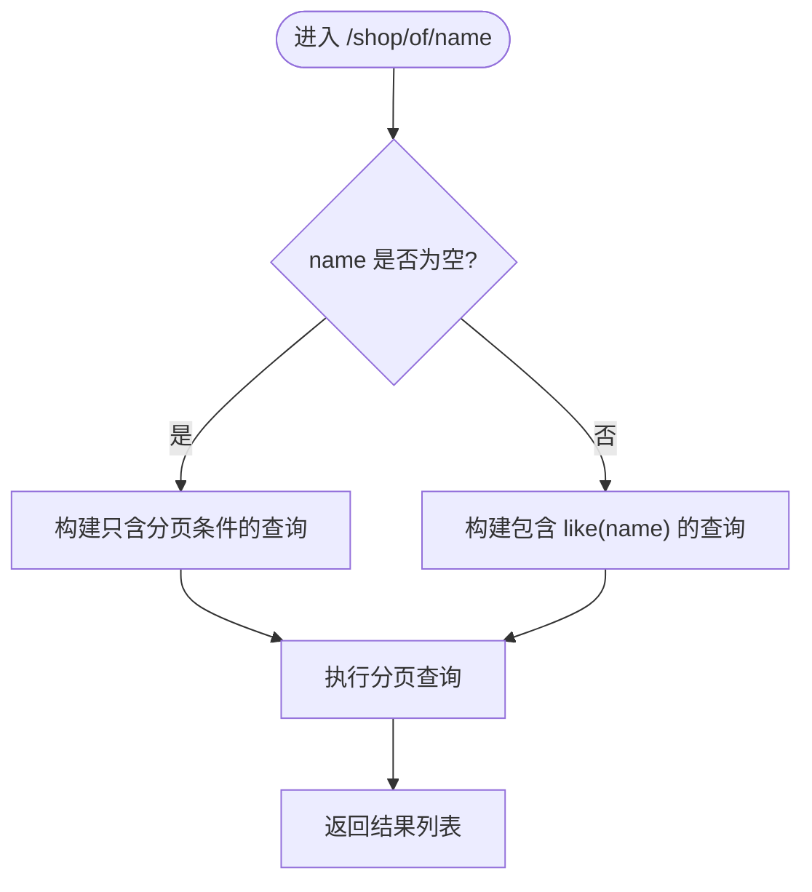
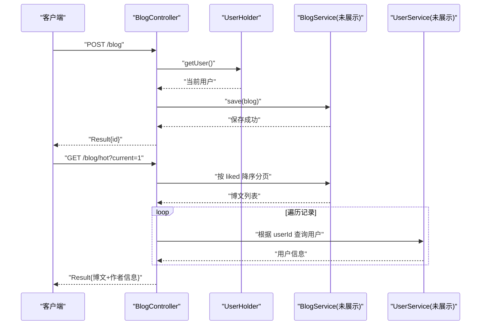
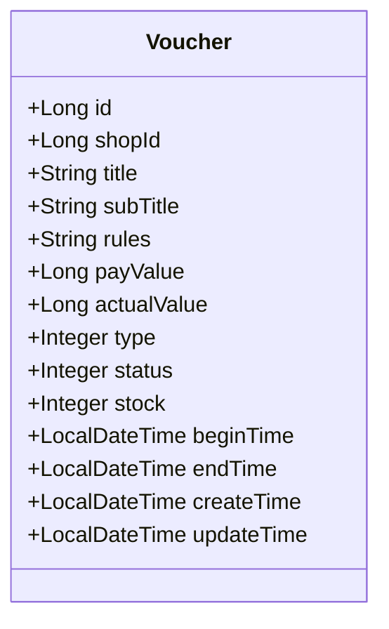
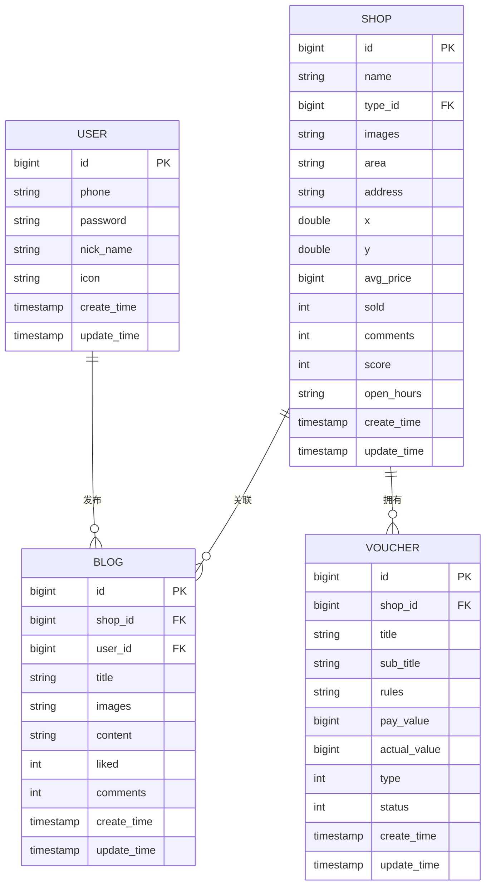
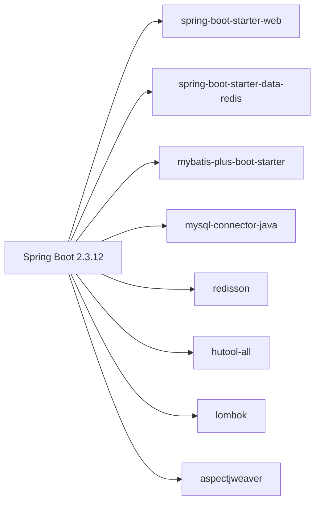

# 项目概述

<cite>
**本文引用的文件**
- [pom.xml](file://pom.xml)
- [HmDianPingApplication.java](file://src/main/java/com/hmdp/HmDianPingApplication.java)
- [application.yaml](file://src/main/resources/application.yaml)
- [hmdp.sql](file://src/main/resources/db/hmdp.sql)
- [MybatisConfig.java](file://src/main/java/com/hmdp/config/MybatisConfig.java)
- [RedissonConfig.java](file://src/main/java/com/hmdp/config/RedissonConfig.java)
- [MvcConfig.java](file://src/main/java/com/hmdp/config/MvcConfig.java)
- [UserHolder.java](file://src/main/java/com/hmdp/utils/UserHolder.java)
- [UserController.java](file://src/main/java/com/hmdp/controller/UserController.java)
- [ShopController.java](file://src/main/java/com/hmdp/controller/ShopController.java)
- [BlogController.java](file://src/main/java/com/hmdp/controller/BlogController.java)
- [VoucherController.java](file://src/main/java/com/hmdp/controller/VoucherController.java)
- [User.java](file://src/main/java/com/hmdp/entity/User.java)
- [Shop.java](file://src/main/java/com/hmdp/entity/Shop.java)
- [Blog.java](file://src/main/java/com/hmdp/entity/Blog.java)
- [Voucher.java](file://src/main/java/com/hmdp/entity/Voucher.java)
</cite>

## 目录
1. [简介](#简介)
2. [项目结构](#项目结构)
3. [核心组件](#核心组件)
4. [架构总览](#架构总览)
5. [详细组件分析](#详细组件分析)
6. [依赖分析](#依赖分析)
7. [性能考虑](#性能考虑)
8. [故障排查指南](#故障排查指南)
9. [结论](#结论)
10. [附录：快速开始](#附录快速开始)

## 简介
本项目是一个面向“探店社交”的电商平台，目标是为本地生活消费提供“发现—分享—互动—优惠”的一体化体验。系统围绕用户、商户、博客（探店内容）、评论、关注与优惠券等核心域展开，支持登录认证、商户浏览与搜索、博文发布与点赞、评论互动以及优惠券发放与秒杀等能力。技术栈以 Spring Boot 为核心，结合 MyBatis Plus、Redis、MySQL 与 Redisson 分布式锁，构建高可用、可扩展的后端服务。

## 项目结构
项目采用典型的分层架构：
- 配置层：应用启动、数据源、缓存、拦截器、异常处理等
- 控制器层：对外暴露 REST API
- 服务层：业务逻辑封装
- 数据访问层：基于 MyBatis Plus 的 Mapper 接口
- 实体层：数据库表映射对象
- 工具层：缓存客户端、锁、常量、线程上下文等

图表来源
- [HmDianPingApplication.java:1-18](file://src/main/java/com/hmdp/HmDianPingApplication.java#L1-L18)
- [MvcConfig.java:1-34](file://src/main/java/com/hmdp/config/MvcConfig.java#L1-L34)
- [MybatisConfig.java:1-18](file://src/main/java/com/hmdp/config/MybatisConfig.java#L1-L18)
- [RedissonConfig.java:1-18](file://src/main/java/com/hmdp/config/RedissonConfig.java#L1-L18)
- [application.yaml:1-28](file://src/main/resources/application.yaml#L1-L28)
- [UserController.java:1-86](file://src/main/java/com/hmdp/controller/UserController.java#L1-L86)
- [ShopController.java:1-101](file://src/main/java/com/hmdp/controller/ShopController.java#L1-L101)
- [BlogController.java:1-84](file://src/main/java/com/hmdp/controller/BlogController.java#L1-L84)
- [VoucherController.java:1-58](file://src/main/java/com/hmdp/controller/VoucherController.java#L1-L58)
- [User.java:1-67](file://src/main/java/com/hmdp/entity/User.java#L1-L67)
- [Shop.java:1-110](file://src/main/java/com/hmdp/entity/Shop.java#L1-L110)
- [Blog.java:1-96](file://src/main/java/com/hmdp/entity/Blog.java#L1-L96)
- [Voucher.java:1-106](file://src/main/java/com/hmdp/entity/Voucher.java#L1-L106)

章节来源
- [HmDianPingApplication.java:1-18](file://src/main/java/com/hmdp/HmDianPingApplication.java#L1-L18)
- [application.yaml:1-28](file://src/main/resources/application.yaml#L1-L28)

## 核心组件
- 应用启动与扫描
  - 启用 AOP 代理、扫描 Mapper 包、启动 Spring Boot 应用
- Web 配置与拦截器
  - 注册登录校验与 Token 刷新拦截器，并排除公开路径
- 数据持久化
  - 配置 MyBatis Plus 分页插件，统一类型别名与数据库方言
- 缓存与分布式锁
  - 配置 Redisson 客户端，支撑高并发场景下的分布式锁
- 用户上下文
  - 使用 ThreadLocal 保存当前登录用户信息，贯穿请求链路

章节来源
- [HmDianPingApplication.java:1-18](file://src/main/java/com/hmdp/HmDianPingApplication.java#L1-L18)
- [MvcConfig.java:1-34](file://src/main/java/com/hmdp/config/MvcConfig.java#L1-L34)
- [MybatisConfig.java:1-18](file://src/main/java/com/hmdp/config/MybatisConfig.java#L1-L18)
- [RedissonConfig.java:1-18](file://src/main/java/com/hmdp/config/RedissonConfig.java#L1-L18)
- [UserHolder.java:1-20](file://src/main/java/com/hmdp/utils/UserHolder.java#L1-L20)

## 架构总览
整体采用前后端分离的 REST 风格架构。前端通过 HTTP 调用后端控制器，控制器委托服务层完成业务编排，服务层通过 MyBatis Plus 访问 MySQL，并使用 Redis 做热点数据缓存与分布式锁协调。

图表来源
- [UserController.java:1-86](file://src/main/java/com/hmdp/controller/UserController.java#L1-L86)
- [ShopController.java:1-101](file://src/main/java/com/hmdp/controller/ShopController.java#L1-L101)
- [BlogController.java:1-84](file://src/main/java/com/hmdp/controller/BlogController.java#L1-L84)
- [VoucherController.java:1-58](file://src/main/java/com/hmdp/controller/VoucherController.java#L1-L58)
- [MybatisConfig.java:1-18](file://src/main/java/com/hmdp/config/MybatisConfig.java#L1-L18)
- [RedissonConfig.java:1-18](file://src/main/java/com/hmdp/config/RedissonConfig.java#L1-L18)
- [application.yaml:1-28](file://src/main/resources/application.yaml#L1-L28)

## 详细组件分析

### 用户模块
- 功能要点
  - 发送短信验证码、手机号+验证码或密码登录、获取当前用户信息、查询用户详情
  - 登录成功后将用户信息存入线程上下文，后续接口可直接获取
- 关键流程
  - 登录流程：接收登录表单 -> 校验参数 -> 生成会话令牌 -> 返回给客户端 -> 后续请求携带令牌由拦截器校验并填充上下文
- 相关接口
  - POST /user/code：发送验证码
  - POST /user/login：登录
  - GET /user/me：获取当前登录用户
  - GET /user/info/{id}：查询用户详情

图表来源
- [UserController.java:1-86](file://src/main/java/com/hmdp/controller/UserController.java#L1-L86)
- [UserHolder.java:1-20](file://src/main/java/com/hmdp/utils/UserHolder.java#L1-L20)
- [application.yaml:1-28](file://src/main/resources/application.yaml#L1-L28)

章节来源
- [UserController.java:1-86](file://src/main/java/com/hmdp/controller/UserController.java#L1-L86)
- [User.java:1-67](file://src/main/java/com/hmdp/entity/User.java#L1-L67)
- [UserHolder.java:1-20](file://src/main/java/com/hmdp/utils/UserHolder.java#L1-L20)

### 商户模块
- 功能要点
  - 按 ID 查询商铺详情、新增/更新商铺、按类型分页查询、按名称关键字模糊分页查询
- 设计说明
  - 使用 MyBatis Plus 的 QueryWrapper 进行条件构造与分页
  - 默认分页大小与最大页大小通过常量控制

图表来源
- [ShopController.java:1-101](file://src/main/java/com/hmdp/controller/ShopController.java#L1-L101)
- [application.yaml:1-28](file://src/main/resources/application.yaml#L1-L28)

章节来源
- [ShopController.java:1-101](file://src/main/java/com/hmdp/controller/ShopController.java#L1-L101)
- [Shop.java:1-110](file://src/main/java/com/hmdp/entity/Shop.java#L1-L110)

### 博客模块
- 功能要点
  - 发布探店博文、对博文点赞、查看我的博文、查看热门博文（按点赞数排序）
  - 热门博文会回填作者头像与昵称
- 关键点
  - 发布时从线程上下文获取当前用户 ID
  - 点赞采用原子自增 SQL 提升并发安全
  - 热门列表按需关联用户信息

图表来源
- [BlogController.java:1-84](file://src/main/java/com/hmdp/controller/BlogController.java#L1-L84)
- [UserHolder.java:1-20](file://src/main/java/com/hmdp/utils/UserHolder.java#L1-L20)

章节来源
- [BlogController.java:1-84](file://src/main/java/com/hmdp/controller/BlogController.java#L1-L84)
- [Blog.java:1-96](file://src/main/java/com/hmdp/entity/Blog.java#L1-L96)

### 优惠券模块
- 功能要点
  - 新增普通券、新增秒杀券、查询店铺优惠券列表
- 扩展点
  - 秒杀券与普通券在创建时存在差异，后续可结合库存与时间窗口进行售卖控制

图表来源
- [Voucher.java:1-106](file://src/main/java/com/hmdp/entity/Voucher.java#L1-L106)
- [VoucherController.java:1-58](file://src/main/java/com/hmdp/controller/VoucherController.java#L1-L58)

章节来源
- [VoucherController.java:1-58](file://src/main/java/com/hmdp/controller/VoucherController.java#L1-L58)
- [Voucher.java:1-106](file://src/main/java/com/hmdp/entity/Voucher.java#L1-L106)

### 数据模型概览
以下为数据库主要实体关系示意（节选）：

图表来源
- [hmdp.sql:1-200](file://src/main/resources/db/hmdp.sql#L1-L200)

## 依赖分析
- 框架与中间件
  - Spring Boot 2.3.12 作为基础框架
  - spring-boot-starter-web 提供 Web 能力
  - spring-boot-starter-data-redis 集成 Redis
  - mybatis-plus-boot-starter 简化数据访问
  - mysql-connector-java 连接 MySQL
  - redisson 提供分布式锁能力
  - hutool、lombok、aspectjweaver 辅助开发
- 配置要点
  - 端口、数据源、Redis、Jackson、MyBatis Plus 别名与日志级别均在 application.yaml 中集中管理

图表来源
- [pom.xml:1-90](file://pom.xml#L1-L90)
- [application.yaml:1-28](file://src/main/resources/application.yaml#L1-L28)

章节来源
- [pom.xml:1-90](file://pom.xml#L1-L90)
- [application.yaml:1-28](file://src/main/resources/application.yaml#L1-L28)

## 性能考虑
- 缓存策略
  - 热点数据优先走 Redis，降低数据库压力；注意缓存穿透、击穿、雪崩防护
- 分布式锁
  - 使用 Redisson 保障高并发下资源一致性（如秒杀扣减）
- 分页与限流
  - 合理设置分页大小，避免一次性拉取过多数据
- 连接池
  - 调整 Redis 连接池参数，匹配实际 QPS 与延迟要求
- 序列化
  - Jackson 忽略非空字段可减少响应体积

[本节为通用建议，不直接分析具体文件]

## 故障排查指南
- 常见问题定位
  - 数据库连接失败：检查 application.yaml 中的驱动、URL、用户名、密码
  - Redis 连接失败：检查 host、port、password 及网络连通性
  - 登录拦截异常：确认拦截器排除路径是否正确，令牌是否有效
  - 分页异常：确认 MyBatis Plus 分页插件已正确注册
- 建议
  - 开启 debug 日志，关注 com.hmdp 包输出
  - 针对热点接口增加监控与告警

章节来源
- [application.yaml:1-28](file://src/main/resources/application.yaml#L1-L28)
- [MvcConfig.java:1-34](file://src/main/java/com/hmdp/config/MvcConfig.java#L1-L34)
- [MybatisConfig.java:1-18](file://src/main/java/com/hmdp/config/MybatisConfig.java#L1-L18)

## 结论
本项目以 Spring Boot 为核心，结合 MyBatis Plus、Redis 与 Redisson，构建了覆盖用户、商户、博客、优惠券等核心能力的探店社交平台后端。通过清晰的层次划分与合理的中间件选型，既满足初学者快速上手的需求，也为有经验的开发者提供了可扩展的技术细节与优化空间。

[本节为总结性内容，不直接分析具体文件]

## 附录：快速开始
- 环境要求
  - JDK 1.8
  - Maven
  - MySQL（本地或远程）
  - Redis（本地或远程）
- 依赖安装
  - 确保 MySQL 与 Redis 已启动并可访问
  - 初始化数据库：导入 src/main/resources/db/hmdp.sql
- 项目启动
  - 修改 src/main/resources/application.yaml 中的数据库与 Redis 连接信息
  - 运行主类：com.hmdp.HmDianPingApplication
  - 访问默认端口：http://localhost:8081
- 常用接口示例
  - 登录：POST /user/login
  - 获取当前用户：GET /user/me
  - 查询商铺详情：GET /shop/{id}
  - 发布博文：POST /blog
  - 新增优惠券：POST /voucher
  - 新增秒杀券：POST /voucher/seckill

章节来源
- [application.yaml:1-28](file://src/main/resources/application.yaml#L1-L28)
- [hmdp.sql:1-200](file://src/main/resources/db/hmdp.sql#L1-L200)
- [HmDianPingApplication.java:1-18](file://src/main/java/com/hmdp/HmDianPingApplication.java#L1-L18)
- [UserController.java:1-86](file://src/main/java/com/hmdp/controller/UserController.java#L1-L86)
- [ShopController.java:1-101](file://src/main/java/com/hmdp/controller/ShopController.java#L1-L101)
- [BlogController.java:1-84](file://src/main/java/com/hmdp/controller/BlogController.java#L1-L84)
- [VoucherController.java:1-58](file://src/main/java/com/hmdp/controller/VoucherController.java#L1-L58)